# 标题：V-JEPA 2：自监督视频模型实现理解、预测与规划

- ArXiv：2506.09985
- 作者：Mahmoud Assran, Adrien Bardes, David Fan, Quentin Garrido, Russell Howes, Mojtaba Komeili, Matthew Muckley, Ammar Rizvi, Claire Roberts, Koustuv Sinha, Artem Zholus, Sergio Arnaud, Abha Gejji, Ada Martin, Francois Robert Hogan, Daniel Dugas, Piotr Bojanowski, Vasil Khalidov, Patrick Labatut, Francisco Massa, Marc Szafraniec, Kapil Krishnakumar, Yong Li, Xiaodong Ma, Sarath Chandar, Franziska Meier, Yann LeCun, Michael Rabbat, Nicolas Ballas, [
- 章节：102
- 估计词元数：51.3k

## 目录

- 1 引言
- 2 V-JEPA 2：扩展自监督视频预训练
  - 2.1 方法
    - 表示空间中的掩码去噪。
    - 架构。
    - 关键扩展要素。
    - 评估协议。
  - 2.2 扩展自监督视频学习
  - 2.3 预训练数据集
    - 扩展数据集规模。
    - 数据整理。
  - 2.4 预训练方案
    - 扩展模型规模。
    - 训练计划。
    - 高效渐进分辨率训练。
    - 扩展视频时空分辨率。
- 3 V-JEPA 2-AC：学习动作条件世界模型
  - 3.1 动作条件世界模型训练
    - 模型输入。
    - 损失函数。
    - 架构。
  - 3.2 通过规划推断动作
    - 能量最小化。
- 4 规划：零样本机器人控制
  - 4.1 实验设置
    - 基线模型。
    - 机器人部署。
  - 4.2 结果
    - 单目标到达。
    - 抓握式操作。
  - 4.3 局限性
    - 对相机定位的敏感性。
    - 长时程规划。
    - 图像目标。
- 5 理解：基于探针的分类
  - 注意力探针。
  - 评估协议。
  - 结果。
- 6 预测：基于探针的动作预期
  - 任务。
  - 预期探针。
  - 基线模型。
  - 结果。
  - 局限性。
- 7 理解：视频问答
  - 7.1 实验设置
    - 视频问答任务。
    - 视觉指令微调。
  - 7.2 与图像编码器比较
  - 7.3 扩展视觉编码器规模与输入分辨率
  - 7.4 通过扩展数据改进最先进水平
- 8 相关工作
  - 世界模型与规划。
  - 用于机器人控制的视觉-语言-动作模型。
  - 视觉基础模型。
- 9 结论
  - 未来工作。
- 致谢
- 参考文献
- 10 V-JEPA 2 预训练
  - 10.1 预训练超参数
  - 10.2 预训练数据
  - 10.3 扩展模型规模
  - 10.4 附加结果
    - 10.4.1 数据整理的影响
    - 10.4.2 长训练计划与冷却期的影响
    - 10.4.3 评估时视频长度的影响。
- 11 V-JEPA 2-AC 后训练
  - 11.1 后训练超参数
  - 11.2 机器人任务定义
  - 11.3 可视化世界模型预测
  - 11.4 评估对相机位置的敏感性
- 12 视觉分类
  - 12.1 超参数
    - 探针架构。
    - 评估设置参数。
    - ImageNet 评估。
    - Jester 和 Diving-48 评估。
    - 优化。
  - 12.2 附加结果
    - 探针规模。
    - 编码器多层的影响。
- 13 动作预期
  - 13.1 超参数
    - 探针架构。
    - 评估设置参数。
  - 13.2 附加结果
    - 架构的影响。
    - 输入分辨率的影响。
    - 更长期预测。
    - 失败案例分析。
- 14 视频问答
  - 14.1 处理图像和视频作为输入
  - 14.2 受控设置
    - 训练细节
    - 基线模型。
    - 评估。
    - 视频时长的影响
  - 14.3 数据扩展设置
    - 训练细节
    - 基线模型。
    - 评估。

## 摘要

###### 摘要

现代人工智能（Artificial Intelligence, AI）面临的一个主要挑战是学会主要通过观察来理解世界并学会行动 [LeCun, 2022]。
本文探索了一种自监督（Self-Supervised）方法，该方法将互联网规模的视频数据与少量交互数据（机器人轨迹）相结合，以开发能够在物理世界中理解、预测和规划的模型。我们首先在一个包含超过 100 万小时互联网视频的视频和图像数据集上，预训练了一个无动作的联合嵌入预测架构（Joint-Embedding-Predictive Architecture）——V-JEPA 2。V-JEPA 2 在运动理解方面取得了强劲性能（在 Something-Something v2 数据集上达到 77.3 的 top-1 准确率），并在人类动作预期方面达到了最先进（State-of-the-Art, SOTA）性能（在 Epic-Kitchens-100 数据集上达到 39.7 的召回率@5），超越了之前的任务专用模型。此外，在将 V-JEPA 2 与一个大型语言模型（Large Language Model, LLM）对齐后，我们在 80 亿参数规模上展示了在多个视频问答任务上的最先进性能（例如，在 PerceptionTest 数据集上达到 84.0，在 TempCompass 数据集上达到 76.9）。最后，我们展示了如何通过使用来自 Droid 数据集的不到 62 小时的无标签机器人视频，对一个潜在动作条件世界模型（Latent Action-Conditioned World Model）——V-JEPA 2-AC 进行后训练，将自监督学习应用于机器人规划任务。我们在两个不同实验室的 Franka 机械臂上零样本（Zero-Shot）部署了 V-JEPA 2-AC，并利用基于图像目标的规划实现了物体的抓取和放置。值得注意的是，这一成就是在 **没有从这些环境中的机器人收集任何数据** ，并且 **没有任何任务特定训练或奖励** 的情况下实现的。这项工作展示了如何通过从网络规模数据和少量机器人交互数据中进行自监督学习，产生一个能够在物理世界中进行规划的世界模型。

## 1 Introduction（引言）

人类具备适应和泛化的能力，能够应对新任务并在陌生环境中行动。一些认知学习理论认为，人类通过整合低层感官输入来学习和预测未来状态，从而构建一个关于世界的内部模型（Craik, 1967; Rao and Ballard, 1999）[1, 2]。这些理论进一步提出，这个世界模型在任何时刻都塑造着我们的感知，对我们理解现实起着至关重要的作用（Friston, 2010; Clark, 2013; Nortmann et al., 2015）[3, 4, 5]。此外，我们预测自身行为对未来世界状态影响的能力，对于面向目标的规划也至关重要（Sutton and Barto, 1981, 1998; Ha and Schmidhuber, 2018; Wolpert and Ghahramani, 2000）[6, 7, 8]。构建能够从感官数据（如视频）中学习世界模型的人工智能体，可以使它们像人类一样 **理解** 物理世界、 **预测** 未来状态，并在新情境中有效地 **规划** ，从而形成能够处理前所未见任务的系统。

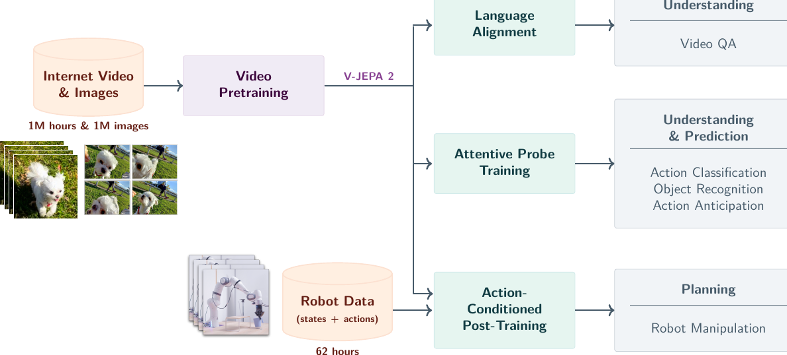

> 图 1 | V-JEPA 2 概述。利用 100 万小时的互联网规模视频和 100 万张图像，我们使用视觉掩码去噪目标（Bardes et al., 2024; Assran et al., 2023）[9, 10] 对 V-JEPA 2 视频模型进行预训练，并通过将该模型与一个大型语言模型（Large Language Model, LLM）主干对齐，将其用于下游任务，如动作分类、物体识别、动作预测和视频问答（Video Question Answering）。预训练后，我们还可以冻结视频编码器，在习得的表征之上，利用少量机器人交互数据训练一个新的动作条件预测器，并利用这个动作条件模型 V-JEPA 2-AC，在模型预测控制（Model Predictive Control, MPC）循环内通过规划来执行下游机器人操作任务。

先前的研究探索了从由状态-动作序列组成的交互数据中开发预测性世界模型，通常也依赖于来自环境的显式奖励反馈来推断目标（Sutton and Barto, 1981; Fragkiadaki et al., 2015; Ha and Schmidhuber, 2018; Hafner et al., 2019b; Hansen et al., 2022）[6, 11, 7, 12, 13]。然而，现实世界交互数据的有限可用性制约了这些方法的可扩展性。为了解决这一限制，最近的研究同时利用了互联网规模的视频和交互数据来训练用于机器人控制的动作条件视频生成模型，但在使用基于模型的控制进行机器人执行方面仅展示了有限的结果（Hu et al., 2023; Yang et al., 2024b; Bruce et al., 2024; Agarwal et al., 2025）[14, 15, 16, 17]。特别是，这类研究通常强调评估预测的忠实度和视觉质量，而非规划能力，这或许是由于通过生成视频进行规划的计算成本高昂。

在本工作中，我们以 **自监督学习（Self-supervised Learning）** 假说为基础，将其作为学习世界模型的一种手段，该模型主要从观察中捕获世界的背景知识。具体而言，我们利用了 **联合嵌入预测架构（Joint-Embedding Predictive Architecture, JEPA）** （LeCun, 2022）[18]，该架构通过在习得的表征空间中进行预测来学习。与完全从交互数据中学习的方法不同，自监督学习使我们能够利用互联网规模的视频——这些视频描绘了状态序列而无需直接观察动作——来学习如何表征视频观测，并在此习得的表征空间中学习世界动态的预测模型。此外，与基于视频生成的方法相比，JEPA 方法侧重于学习场景中可预测方面（例如，运动物体的轨迹）的表征，同时忽略生成式目标所强调的不可预测细节，因为后者进行像素级预测（例如，田野中每片草叶或树上每片叶子的精确位置）。通过扩展 JEPA 预训练，我们证明它能产生具有最先进理解和预测能力的视频表征，并且此类表征可以作为动作条件预测模型的基础，并实现 **零样本规划（Zero-shot Planning）** 。

我们的方法 V-JEPA 2 采用分阶段训练流程，首先在互联网规模的视频上进行无动作的预训练，随后使用少量交互数据进行后训练（见[图 1](#figure-1)）。在第一阶段，我们使用 **掩码去噪特征预测目标（Mask-denoising Feature Prediction Objective）** （Assran et al., 2023; Bardes et al., 2024）[10, 9]，模型在习得的表征空间中预测视频的掩码片段。我们使用多达 10 亿参数和超过 100 万小时的视频来训练 V-JEPA 2 编码器。我们的实验证实，扩展自监督视频预训练通过基于探针的评估以及将编码器与用于视频问答的语言模型对齐（Krojer et al., 2024; Pătrăucean et al., 2023; Liu et al., 2024c; Cai et al., 2024; Shangguan et al., 2024）[19, 20, 21, 22, 23]，增强了编码器实现视觉理解的能力，包括广泛的运动和外观识别能力。

在完成互联网规模视频的预训练后，我们利用第一阶段学习到的表征，在一小部分交互数据上训练了一个 **动作条件世界模型（Action-conditioned world model）** ，V-JEPA 2-AC。
我们的动作条件世界模型是一个拥有 3 亿参数的 **Transformer网络（Transformer network）** ，采用了 **块因果注意力机制（Block-causal attention mechanism）** ，能够自回归地预测在给定动作和先前状态条件下的下一视频帧的表征。
仅使用来自 Droid 数据集（Khazatsky 等人，2024）的 62 小时无标注交互数据，我们证明了训练一个 **潜在世界模型（Latent world model）** 的可行性。该模型在给定子目标的情况下，可用于规划 Franka 机械臂的动作，并在新环境中通过单目 RGB 摄像头 **零样本（Zero-shot）** 执行抓取操作任务。

总而言之，我们表明，从视频中学习的 **联合嵌入预测架构（Joint-embedding predictive architectures）** 可用于构建一个世界模型，该模型能够 **理解** 物理世界、 **预测** 未来状态，并在新情境中有效地 **规划** ；这是通过利用互联网规模的视频和少量交互数据实现的。
具体而言：

- **理解 — 基于探针的分类（Understanding — Probe-based Classification）** ：扩展自监督视频预训练会产生适用于多种任务的视频表征。V-JEPA 2 擅长编码细粒度的运动信息，在需要运动理解的任务（如 Something-Something v2）上表现出色，使用注意力探针获得了 $77.3$ 的 top-1 准确率。
- **理解 — 视频问答（Understanding — Video Question-Answering）** ：V-JEPA 2 编码器可用于训练一个 **多模态大语言模型（Multi-modal Large Language Model, MLLM）** ，以处理视频问答任务。我们在多个需要物理世界理解和时序推理的基准测试中，在 80 亿参数语言模型类别上观察到了最先进的性能，例如 MVP（$44.5$ 配对准确率）、PerceptionTest（$84.0$ 测试集准确率）、TempCompass（$76.9$ 多选准确率）、TemporalBench（$36.7$ 多二元短问答准确率）和 TOMATO（$40.3$ 准确率）。特别是，我们表明，一个未经语言监督预训练的视频编码器可以与一个语言模型对齐，并实现最先进的性能，这与传统观点（Yuan 等人，2025；Wang 等人，2024b）相反。
- **预测（Prediction）** ：大规模自监督视频预训练增强了预测能力。V-JEPA 2 在使用注意力探针的 Epic-Kitchens-100 人类动作预测任务中取得了最先进的性能，Recall@5 为 $39.7$，这相对于之前的最佳模型有 $44\%$ 的相对提升。
- **规划（Planning）** ：我们证明，V-JEPA 2-AC（仅通过使用流行的 Droid 数据集中的 $62$ 小时无标注机器人操作数据对 V-JEPA 2 进行后训练获得）可以部署到新环境中，通过基于给定子目标的规划来解决抓取操作任务。
  在没有使用我们实验室中任何额外的机器人数据进行训练，也没有任何任务特定的训练或奖励的情况下，该模型成功处理了抓取操作任务，例如在新环境中抓取新物体以及拾取和放置。

本文的其余部分组织如下。
[第 2 节](#section-2) 描述了 V-JEPA 2 的预训练过程，包括使其能够超越 Bardes 等人（2024）原始 V-JEPA 方案进行扩展的关键要素。
[第 3 节](#section-3) 接着介绍了我们训练任务无关的动作条件世界模型 V-JEPA 2-AC 的方法，该方法利用了预训练的 V-JEPA 2 模型。
[第 4 节](#section-4) 演示了如何通过基于模型的规划使用 V-JEPA 2-AC 进行机器人控制。
由于 V-JEPA 2-AC 在学习的表征空间中建模世界动态，其能力从根本上取决于 V-JEPA 2 表征空间所捕获的信息，因此我们在 [第 5 节](#section-5) 和 [第 6 节](#section-6) 中进一步探讨了 V-JEPA 2 在视频理解和预测任务上的性能。
最后，在 [第 7 节](#section-7) 中，我们展示了 V-JEPA 2 可以与语言模型对齐以进行视频问答。
[第 8 节](#section-8) 讨论了相关工作，我们在 [第 9 节](#section-9) 进行总结。

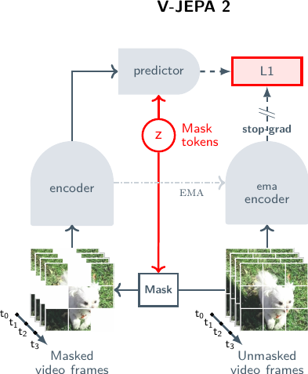

> 图 2：多阶段训练。（左）我们首先使用视觉掩码去噪目标（Bardes 等人，2024；Assran 等人，2023）在互联网规模的图像和视频数据上预训练 V-JEPA 2 视频编码器。一个视频片段被 **分块化（Patchified）** 成一个 **词元（Token）** 序列，并通过丢弃一部分词元来应用掩码。然后，编码器处理被掩码的视频序列，并为每个输入词元输出一个 **嵌入向量（Embedding vector）** 。接下来，编码器的输出与一组指定掩码块位置的可学习掩码词元连接，随后由 **预测器（Predictor）** 处理。然后，使用 L1 损失将预测器的输出回归到预测目标。预测目标由一个 **指数移动平均编码器（Exponential Moving Average encoder, EMA-encoder）** 计算，其权重定义为编码器权重的指数移动平均值。（右）预训练后，我们冻结视频编码器，并在学习到的表征之上学习一个新的动作条件预测器 V-JEPA 2-AC。我们利用一个自回归特征预测目标，该目标涉及在给定过去视频帧、动作和末端执行器状态的条件下，预测未来视频帧的表征。我们的动作条件预测器使用块因果注意力模式，使得给定时间步的每个块特征可以关注来自当前和先前时间步的块特征、动作和末端执行器状态。

## 2 V-JEPA 2：扩展自监督视频预训练（Scaling Self-Supervised Video Pretraining）

我们在一个包含超过 100 万小时视频的视觉数据集上对 **V-JEPA 2（Video Joint-Embedding Predictive Architecture 2）** 进行预训练。该自监督训练任务基于 **表征空间（representation space）** 中的 **掩码去噪（mask denoising）** ，并建立在 V-JEPA 框架之上 [1]。在本文中，我们通过探索更大规模的模型、增加预训练数据的规模，并引入一种 **时空渐进分辨率训练策略（spatial and temporal progressive resolution training strategy）** 来扩展 V-JEPA 框架，该策略使我们能够高效地预训练超越短 16 帧视频片段的模型。

### 2.1 方法论（Methodology）

##### 表征空间中的掩码去噪（Mask-Denoising in Representation Space）。

V-JEPA 的目标是从一个被 **掩码（masked）** 的视频视图 $x$（即其中部分 **图像块（patches）** 已被随机丢弃）中，预测视频 $y$ 的学习表征（[图 2](https://arxiv.org/html/2506.09985v1#S1.F2.1)，左）。该任务的元架构由一个用于提取视频表征的 **编码器（encoder）** $E_{\theta}(\cdot)$ 和一个用于预测被掩码视频部分表征的 **预测器（predictor）** $P_{\phi}(\cdot)$ 组成。编码器和预测器使用以下目标函数同时进行训练：

$$
\text{minimize}_{\theta,\phi,\Delta_{y}}\quad\lVert P_{\phi}(\Delta_{y},E_{\theta}(x))-\text{sg}(E_{\overline{\theta}}(y))\rVert_{1},(1)
$$

其中 $\Delta_{y}$ 是一个可学习的 **掩码标记（mask token）** ，用于指示被丢弃图像块的位置。该损失函数使用了 **停止梯度操作（stop-gradient operation）** $\text{sg}(\cdot)$ 和编码器网络权重 $\theta$ 的 **指数移动平均（exponential moving average）** $\overline{\theta}$，以防止 **表征坍塌（representation collapse）** 。该损失仅应用于对被掩码图像块的预测。

##### 架构（Architecture）。

编码器 $E_{\theta}(\cdot)$ 和预测器 $P_{\phi}(\cdot)$ 均被参数化为一个 **视觉变换器（Vision Transformer, ViT）** [2]。
为了在视觉变换器中编码相对位置信息，我们利用了 **RoPE（Rotary Position Embedding，旋转位置编码）** 来代替 Bardes 等人 [1] 中使用的绝对正弦余弦位置编码。我们使用了传统 1D-RoPE [3] 的 3D 扩展，具体方法是将特征维度划分为三个近似相等的部分（分别对应时间、高度和宽度轴），并对每个轴对应的部分分别应用一维旋转。
我们发现，使用 3D-RoPE 代替绝对正弦余弦位置嵌入 [4] 有助于稳定最大模型的训练。
为了使用我们的变换器编码器处理视频，我们首先将其 **分块（patchify）** 为一系列尺寸为 $2\times 16\times 16$（$T\times H\times W$）的 **管状块（tubelets）** 序列，并采用与 Bardes 等人 [1] 相同的 **多块掩码策略（multiblock masking strategy）** 。

##### 关键扩展要素（Key Scaling Ingredients）。

在本节中，我们介绍并研究了四个额外的关键要素，它们使得扩展 V-JEPA 预训练原则以获得我们的 V-JEPA 2 模型成为可能。

1.  **数据扩展（Data scaling）** ：我们通过利用和筛选额外的数据源，将数据集规模从 200 万增加到 2200 万个视频。
2.  **模型扩展（Model scaling）** ：我们将编码器架构的参数量从 3 亿扩展到超过 10 亿，从 ViT-L 升级到 ViT-g（Zhai 等人，2022）。
3.  **更长的训练（Longer training）** ：采用预热-恒定-衰减（warmup-constant-decay）学习率调度简化了超参数调优，使我们能够将训练从 9 万次迭代扩展到 25.2 万次迭代，从而有效利用了额外的数据。
4.  **更高分辨率（Higher resolution）** ：我们利用预热-恒定-衰减调度来高效扩展到更高分辨率的视频和更长的视频片段，具体方法是在预热和恒定阶段训练较短、较低分辨率的片段，然后在最终的衰减阶段增加分辨率和/或片段长度。

本节的其余部分将更详细地描述这些要素中的每一个，并使用接下来描述的评估方案量化每个要素的影响。

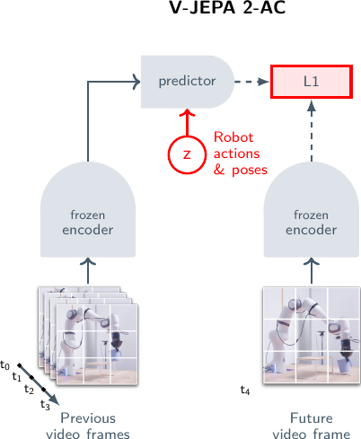

> 图 3 | 扩展要素。使用 ViT-L/16 模型作为基线，各项扩展干预措施对 6 项图像和视频分类任务（SSv2、Diving-48、Jester、Kinetics、COIN、ImageNet）平均准确率的影响。

##### 评估方案（Evaluation Protocol）

我们进行模型预训练的目标是将通用的视觉理解能力注入到我们的编码器中。因此，我们通过评估模型在一组六个运动和外观分类任务上学到的表示质量，来评估我们的模型和数据设计选择：Something-Something v2（Goyal 等人，2017）、Diving-48（Li 等人，2018）、Jester（Materzynska 等人，2019）、Kinetics（Kay 等人，2017）、COIN（Tang 等人，2019）和 ImageNet（Deng 等人，2009）。我们使用冻结评估方案（frozen evaluation protocol）：我们冻结编码器权重，并在其表示上训练一个任务专用的 4 层注意力探针（attentive probe）来输出预测类别。在本节中，我们主要关注这六项理解任务的平均准确率。有关任务、评估方案和结果的更多详细信息，请参阅[第 5 节](#section-5)。

### 2.2 扩展自监督视频学习（Scaling Self-Supervised Video Learning）

我们首先总结我们扩展分析的关键发现，其中我们研究了四个关键要素对下游任务平均性能的影响。
[图 3](#figure-3) 展示了这些扩展干预措施对 6 项分类任务平均准确率的影响，我们以使用 V-JEPA 目标在 200 万个视频上预训练的 ViT-L/16 模型作为基线。
将数据集从 200 万增加到 2200 万个视频（VM22M）带来了 1.0 个百分点的提升。将模型从 3 亿参数扩展到 10 亿参数（ViT-g/16）提供了额外的 1.5 个百分点增益。将训练从 9 万次迭代扩展到 25.2 万次迭代贡献了另外 0.8 个百分点的改进。最后，在预训练和评估期间同时提高空间分辨率（$256\rightarrow 384$）和时间长度（$16\rightarrow 64$ 帧），将性能提升至 88.2%，这表示相对于 ViT-L/16 基线累积了 4.0 个百分点的改进。每一项单独的更改都产生了积极影响，证实了扩展在视频自监督学习（Self-Supervised Learning, SSL）中的潜力。

### 2.3 预训练数据集（Pretraining Dataset）

接下来，我们将描述构成我们预训练数据集的视频和图像来源，以及我们筛选数据集的方法。

> 表 1 | VideoMix22M（VM22M）预训练数据集。为构建我们的观测预训练数据集，我们结合了四种不同的视频源和一个图像数据集。我们在训练期间使用特定于源的采样概率，并对 YT1B 应用基于检索的筛选以减少噪声内容（例如，卡通或剪贴画风格）。

| Source                                | Samples | Type     | Total Hours | Apply Curation | Weight |
| :------------------------------------ | :------ | :------- | :---------- | :------------- | :----- |
| SSv2 (Goyal et al., 2017)             | 168K    | EgoVideo | 168         | No             | 0.056  |
| Kinetics (Carreira et al., 2019)      | 733K    | ExoVideo | 614         | No             | 0.188  |
| Howto100M (Miech et al., 2019)        | 1.1M    | ExoVideo | 134K        | No             | 0.318  |
| YT-Temporal-1B (Zellers et al., 2022) | 19M     | ExoVideo | 1.6M        | Yes            | 0.188  |
| ImageNet (Deng et al., 2009)          | 1M      | Images   | n/a         | No             | 0.250  |

##### **扩展数据集规模（Scaling Dataset Size）**

我们通过结合公开可用的数据源构建了一个大规模视频数据集。在本工作中使用公开可用的数据源使其他研究人员能够复现这些结果。该整体数据集包括来自 Goyal 等人（2017）提出的 Something-Something v2 数据集（SSv2）的 **以自我为中心视频（Ego-centric videos）** ，来自 Kinetics 400、600 和 700 数据集（Kay 等人，2017；Carreira 等人，2018，2019）的 **以外部视角为中心的动作视频（Exo-centric action videos）** ，来自 HowTo100M（Miech 等人，2019）的 YouTube 教程视频，以及来自 YT-Temporal-1B（Zellers 等人，2022）的通用 YouTube 视频（我们称之为 YT1B）。我们还加入了来自 ImageNet 数据集（Deng 等人，2009）的图像，以增加预训练数据的视觉覆盖范围。

为了实现图像和视频的联合预训练，我们在时间维度上复制图像，并将其视为一个所有帧都相同的 16 帧视频。在训练期间，我们根据通过手动调优凭经验确定的加权系数从每个数据源进行采样。最终得到的数据集，我们称之为 VideoMix22M（或 VM22M），包含 2200 万个样本。[表 1](#table-1) 列出了这些数据源及其权重。

[图 4](#figure-4)（左）比较了在 VM22M 上预训练的 ViT-L/16 与在 Bardes 等人（2024）提出的较小（200 万）VideoMix2M 数据集上训练的类似模型的性能。与 VM2M 相比，在 VM22M 上训练使得视觉理解任务的平均性能提升了 $+1$ 分。在基于外观的任务上，如 Kinetics-400、COIN 和 ImageNet，性能提升更为显著，这表明增加这些任务的视觉覆盖范围非常重要。

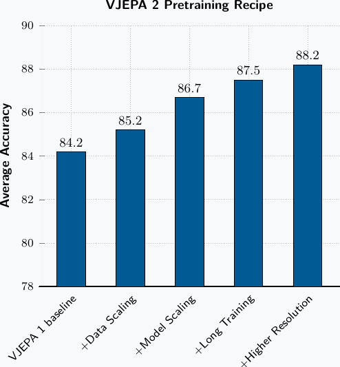

> 图 4 | 数据扩展与筛选。我们在不同的数据混合上训练和比较模型。模型是 ViT-L/16，遵循 Bardes 等人（2024）的方法，使用余弦学习计划训练了 90K 次迭代。（左）我们比较了在 VM2M 数据集上预训练的 ViT-L/16 模型和在我们的 VM22M 数据集上预训练的模型的性能。在 VM22M 数据集上训练带来了 $+1$ 分的平均性能提升。（右）我们比较了在 YT1B 上预训练的 ViT-L/16 模型和在我们利用基于聚类的筛选构建的 Curated-YT1B 数据集上预训练的模型的性能。在筛选后的数据集上训练带来了 $+1.4$ 分的平均性能提升，显示了数据筛选的有效性。

##### **数据筛选（Data Curation）**

YT1B 是一个大型视频数据集，包含 140 万视频小时，与较小的视频数据集（如 Kinetics 和 Something-Something v2）相比，未经筛选且过滤极少。因为未经筛选且不平衡的数据会阻碍模型性能（Assran 等人，2022；Oquab 等人，2023），我们通过改造一个现有的基于检索的筛选流程来处理视频，从而对 YT1B 进行过滤。具体来说，我们从 YT1B 视频中提取场景，为每个场景计算一个嵌入向量，然后使用基于聚类的检索过程（Oquab 等人，2023）根据一个目标分布来选择视频场景，该目标分布由 Kinetics、Something-Something v2、COIN 和 EpicKitchen 的训练数据集组成。我们在[第 10.2 节](#section-10-2)中描述了数据集构建过程的细节。与 Oquab 等人（2023）类似，我们确保来自目标验证集的任何视频都不包含在初始的、未经筛选的数据池中。

在[图 4](#figure-4)（右）中，我们比较了在未经筛选的 YT-1B 数据上预训练的 ViT-L 模型与在我们的 Curated-YT-1B 数据集上训练的可比模型在视觉理解评估上的平均性能。使用筛选后的数据集进行训练，相比未经筛选的基线，带来了 $+1.4$ 分的平均性能提升。值得注意的是，在 ViT-L 规模上，经过 Curated-YT-1B 训练的模型相对于完整的 VM22M 数据集取得了有竞争力的性能。然而，更大规模的模型从 VM22M 训练中获益更多（见[第 10.2 节](#section-10-2)），这表明将 Curated-YT-1B 与其他数据源结合可以增强可扩展性。

### 2.4 预训练方案（Pretraining Recipe）

##### 模型规模扩展（Scaling Model Size）

为了探索我们模型的扩展行为，我们训练了一系列编码器模型，其参数量范围从 3 亿（ViT-L）到 10 亿（ViT-g）。所有编码器的架构细节均在附录的 [表 12](#table-12) 中提供。请注意，每个编码器使用相同的预测器架构，类似于一个 ViT-small（视觉变换器-小）。

我们在 [图 5](#figure-5)（左）中报告了这些编码器在视觉理解任务上的平均性能。将模型规模从 3 亿（ViT-L）参数扩展到 10 亿（ViT-g）参数，带来了平均性能 **$+1.5$** 分的提升。运动和外观理解任务均受益于规模扩展，其中 SSv2 提升了 **$+1.6$** 分，Kinetics 提升了 **$+1.5$** 分（参见[表 4](#table-4)）。这些结果证实， **自监督视频预训练（Self-supervised Video Pretraining）** 能够有效利用更大的模型容量，直至 10 亿参数的 ViT-g。

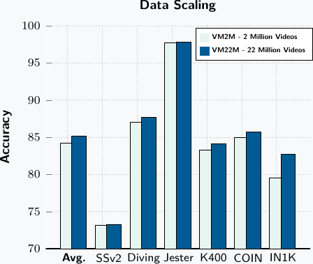

> 图 5 | 模型扩展。我们探讨了扩展模型规模和输入视频分辨率的影响。所有模型均在 VideoMix22M 预训练数据集上进行训练。（左）六个理解任务的平均性能随模型规模变化的函数。模型以恒定学习率进行训练，直至在下游任务上的性能达到平台期。然后，我们使用 64 帧、$256\times 256$ 分辨率对模型进行冷却（Cooldown），并报告冷却后的性能。将模型规模从 3 亿扩展到 10 亿参数，带来了平均 **$+1.7$** 分的提升。（中）在 A100 GPU 上，以 $384\times 384$ 分辨率训练视频、使用不同每片段帧数时，ViT-g 的训练时间（GPU-天）。我们将渐进式分辨率训练（Progressive Resolution Training）（在 16 帧 / $256\times 256$ 分辨率下进行 252K 次迭代，随后在 $384\times 384$ 分辨率下进行 12K 次冷却迭代）与全分辨率训练的预计时间进行比较。渐进式训练提供了高达 **8$\times$** 的加速，显著降低了预训练的计算需求。（右）在冷却阶段增加视频时长对 ViT-g 下游性能的影响。即使在推理/评估时仅使用 16 帧片段，在训练的冷却阶段增加视频时长也能将平均任务性能提升 **$+0.7$** 分。

##### **训练计划（Training Schedule）**

V-JEPA 2 模型的训练采用 **预热-恒定（warmup-constant）** 学习率计划，后接一个 **冷却（cooldown）** 阶段（Zhai 等人，2022；Hägele 等人，2024）。与 Hägele 等人（2024）类似，我们发现该计划与 **半余弦（half-cosine）** 计划（Loshchilov 和 Hutter，2016）性能相当；同时，由于可以从恒定阶段的不同检查点启动多个冷却运行，它使得探索长时间训练运行更具成本效益。

我们简化了 Bardes 等人（2024）的方案，保持固定的 **教师指数移动平均（teacher EMA）** 和权重衰减系数，而非使用斜坡上升计划，因为这些变化对下游理解任务的影响微乎其微。[图 3](#figure-3) 显示，将训练计划从 90K 次迭代扩展到 252K 次迭代，使用 ViT-g 模型可获得平均性能提升 +0.8，验证了延长训练时长的益处。该计划还通过在冷却阶段逐步增加视频分辨率，促进了渐进式训练。

##### **高效的渐进式分辨率训练（Efficient Progressive-Resolution Training）**

虽然以往大多数视频编码器专注于 16 帧（约秒）的短片段（Bardes 等人，2024；Wang 等人，2024b，2023），但我们探索使用长达 64 帧（16 秒）的更长片段在更高空间分辨率下进行训练。然而，训练时间随着时长和分辨率的增加而急剧增加——在 $64\times 384\times 384$ 的输入上训练我们的 ViT-g 模型大约需要 $60$ GPU 年（见[图 5](#figure-5)，中图）。

为了减少这一开销，我们采用了 **渐进式分辨率策略（progressive resolution strategy）** （Touvron 等人，2019；Oquab 等人，2023），该策略在保持下游性能的同时提升了训练效率。我们的训练过程始于一个 **预热阶段（warmup phase）** ，我们在 16 帧、$256\times 256$ 分辨率的视频上进行训练，并在 12K 次迭代内线性预热学习率，随后是 **主训练阶段（main training phase）** ，使用恒定学习率进行 228K 次迭代。然后，在 **冷却阶段（cooldown phase）** ，我们增加视频时长和分辨率，同时在 12K 次迭代内线性衰减学习率。因此，与训练更长时长、更高分辨率视频相关的额外计算开销仅在最终的冷却阶段产生。

这种方法实现了高效的高分辨率训练：如[图 5](#figure-5)（中图）所示，对于一个能够处理 64 帧、$384\times 384$ 分辨率输入的模型，与在所有训练阶段均以全分辨率从头开始直接训练相比，我们实现了 $8.4\times$ 的 GPU 时间减少。此外，我们仍然观察到了模型能够处理更长时长和更高分辨率输入所带来的益处，如下文所述。

##### **扩展视频的时间与空间分辨率（Scaling temporal and spatial video resolution）**

[图 5](#figure-5) 研究了输入视频分辨率如何影响下游任务性能。在预训练期间将片段时长从 16 帧增加到 64 帧，同时保持固定的 16 帧评估时长时，我们观察到平均性能提升了 $+0.7$ 个百分点（[图 5](#figure-5)，右图）。此外，我们发现，在评估期间增加视频时长和分辨率会带来跨任务的显著改进（参见[表 4](#table-4) 和[第 10.4.2 节](https://arxiv.org/html/2506.09985v1#S10.SS4.SSS2)）。

这些结果表明，视频自监督预训练受益于训练和评估期间时间分辨率的增加。尽管我们尝试扩展到更长的视频片段（128 和 256 帧），但在此组理解任务上，我们未观察到超过 64 帧的任何进一步改进。

## 3 V-JEPA 2-AC: 学习一个动作条件化的世界模型（Learning an Action-Conditioned World Model）

预训练后，V-JEPA 2 模型能够预测视频中的缺失部分。然而，这些预测并未直接考虑智能体（Agent）可能采取的动作的因果效应（Causal Effect）。
在本节描述的下一训练阶段，我们重点通过利用少量交互数据，使模型对规划（Planning）任务有用。
为此，我们在冻结的 V-JEPA 2 视频编码器之上，学习一个 **帧因果动作条件化预测器（Frame-causal Action-conditioned Predictor）** （[图 2](https://arxiv.org/html/2506.09985v1#S1.F2.1)，右侧）。我们在 Droid 数据集（Khazatsky et al., 2024）的数据上训练我们的模型，该数据集包含通过遥操作（Teleoperation）收集的桌面 Franka Panda 机器人手臂实验数据。我们将得到的动作条件化模型称为 V-JEPA 2-AC，并在 [第 4 节](#section-4) 中展示 V-JEPA 2-AC 可以在 **模型预测控制（Model-Predictive Control, MPC）** 规划循环中用于在新环境中规划动作。

### 3.1 动作条件化世界模型训练（Action-Conditioned World Model Training）

我们的目标是在预训练后获取 V-JEPA 2 模型，并得到一个可用于通过 **闭环模型预测控制（Closed-loop Model-Predictive Control）** 来 **控制具身智能体系统（Embodied Agentic System）** 的 **潜在世界模型（Latent World Model）** 。为实现此目标，我们训练 V-JEPA 2-AC，这是一个 **自回归模型（Autoregressive Model）** ，能够根据控制动作和 **本体感知观测（Proprioceptive Observations）** 来预测未来视频观测的表征。

在本节中，我们描述该框架在一个带有固定外中心相机（Fixed Exocentric Camera）的桌面机械臂上的具体实例化，其中控制动作对应于 **末端执行器（End-effector）** 指令。
该模型使用来自原始 Droid 数据集的大约 62 小时的 **无标签（Unlabeled）** 视频进行训练，这些视频是配备两指夹爪（Two-finger Gripper）的 7 自由度（7-DoF）Franka Emika Panda 手臂的短视频，通常长度为 3-4 秒。这里的“无标签”视频指的是我们不使用额外的元数据来指示任何奖励（Reward）、每次演示中执行的任务类型，或者演示是否成功完成了尝试的任务。相反，我们仅使用数据集中的原始视频和末端执行器状态信号（数据集中的每个视频都附有指示每一帧末端执行器状态的元数据——三维表示位置，三维表示方向，一维表示夹爪状态）。

##### 模型输入（Model inputs）。

在训练的每次迭代中，我们从 Droid 数据集中随机采样一个包含 4 秒视频片段的小批量（Mini-batch），并且为简化起见，丢弃任何短于 4 秒的视频，从而得到一个包含不到 62 小时视频的较小数据集子集。
视频片段以 $256\times 256$ 的分辨率和每秒 4 帧（4 frames-per-second, fps）的帧率采样，得到 16 帧的片段，记为 $(x_{k})_{k\in[16]}$，其中每个 $x_{k}$ 代表一个单独的视频帧。
每次观测中机器人的末端执行器状态由序列 $(s_{k})_{k\in[16]}$ 表示，其中 $s_{k}$ 是一个相对于机器人基座定义的实值 7 维向量（Real-valued 7D Vector）。
$s_{k}$ 的前三个维度编码末端执行器的笛卡尔位置（Cartesian Position），接下来的三个维度以 **外欧拉角（Extrinsic Euler Angles）** 的形式编码其方向，最后一个维度编码夹爪状态。
我们通过计算相邻帧之间末端执行器状态的变化来构建动作序列 $(a_{k})_{k\in[15]}$。
具体来说，每个动作 $a_{k}$ 是一个实值 7 维向量，表示帧 $k$ 和 $k+1$ 之间末端执行器状态的变化。
我们对采样的视频片段应用 **随机缩放裁剪增强（Random-resize-crop Augmentations）** ，其宽高比（Aspect-ratio）在范围 (0.75, 1.35) 内采样。

##### 损失函数（Loss function）。

我们使用 V-JEPA 2 编码器 $E(\cdot)$ 作为图像编码器，并在给定片段中独立编码每一帧，以获得特征图序列 $(z_{k})_{k\in[16]}$，其中 $z_{k}\coloneqq E(x_{k})\in\mathbb{R}^{H\times W\times D}$，$H\times W$ 表示特征图的空间分辨率，$D$ 表示嵌入维度。
实际上，我们的特征图使用 ViT-g 编码器进行编码，形状为 $16\times 16\times 1408$。
请注意，在此后训练阶段，编码器保持冻结状态。
特征图序列、末端执行器状态和动作在时间上交错排列为 $(a_{k},s_{k},z_{k})_{k\in[15]}$，并通过 **变换器预测器网络（Transformer Predictor Network）** $P_{\phi}(\cdot)$ 进行处理，以获得下一状态表征预测序列 $(\hat{z}_{k+1})_{k\in[15]}$。
最终，标量值的 **教师强制损失函数（Teacher-forcing Loss Function）** 计算如下：

$$
\mathcal{L}_{\text{teacher-forcing}}(\phi)\coloneqq\frac{1}{T}\sum^{T}_{k=1} \lVert\hat{z}_{k+1}-z_{k+1}\rVert_{1}=\frac{1}{T}\sum^{T}_{k=1}\left\lVert P_{\phi}\left(\left(a_{t},s_{t},E(x_{t})\right)_{t\leq k}\right)-E(x_{k+1})\right \rVert_{1},(2)
$$

其中 $T=15$。
我们还计算一个 **两步展开损失（Two-step Rollout Loss）** ，以提高模型在推理时执行自回归展开的能力。
为简化表述并略微重载符号，令 $P_{\phi}(\hat{a}_{1:T};s_{k},z_{k})\in\mathbb{R}^{H\times W\times D}$ 表示通过自回归运行 V-JEPA 2-AC，从 ($s_{k}$, $z_{k}$) 开始，使用动作序列 $(\hat{a}_{i})_{i\in[T]}$ 获得的最终预测状态表征。
现在我们可以将展开损失表示为：

$$
\mathcal{L}_{\text{rollout}}(\phi)\coloneqq\lVert P_{\phi}(a_{1:T},s_{1},z_{1} )-z_{T+1}\rVert_{1}.(3)
$$

实际上，我们使用 $T=2$ 来计算展开损失，这样我们只通过一个循环步骤对预测器进行微分。

因此，总体训练目标由下式给出：

$$
L(\phi)\coloneqq\mathcal{L}_{\text{teacher-forcing}}(\phi)+\mathcal{L}_{\text{rollout}}(\phi),(4)
$$

并相对于预测器权重 $\phi$ 进行最小化。
为便于说明，训练过程在图 6 中展示，其中教师强制损失和展开损失均设定 $T=4$。

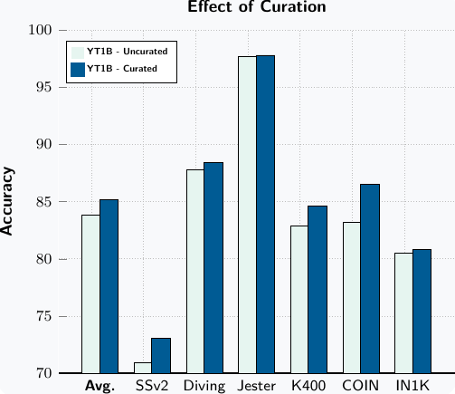

> 图 6：V-JEPA 2-AC 训练。V-JEPA 2-AC 以自回归方式进行训练，利用了教师强制损失和展开损失。（左）在教师强制损失中，预测器以当前帧表示的编码作为输入，学习预测下一个时间步的表示。（右）展开损失涉及将预测器的输出反馈作为输入，使模型能够训练预测未来多个时间步。通过优化这两个损失之和，V-JEPA 2-AC 增强了其准确预测未来的能力，减少了展开过程中的误差累积。

##### 架构（Architecture）。

预测器网络 $P_{\phi}(\cdot)$ 是一个约 3 亿参数的 **Transformer网络（Transformer network）** ，具有 24 层、16 个头、1024 的隐藏维度，并使用 **GELU激活函数（GELU activations）** 。
输入到预测器的动作、末端执行器状态和展平的特征图，通过各自独立的可学习仿射变换进行处理，以将它们映射到预测器的隐藏维度。
类似地，预测器最后一个注意力块的输出经过一个可学习的仿射变换，映射回编码器的嵌入维度。
我们使用我们实现的 **3D-RoPE（3D Rotary Positional Embedding）** 来表示展平特征图中每个视频块（patch）的时空位置，同时仅将时间维度的旋转位置嵌入应用于动作和姿态（pose）标记。
我们在预测器中使用块因果注意力模式，使得给定时间步的每个块特征可以关注来自同一时间步的动作、末端执行器状态和其他块特征，以及来自先前时间步的那些特征。

### 3.2 通过规划推断动作

##### 能量最小化（Energy minimization）。

给定目标状态的图像，我们通过规划来利用 V-JEPA 2-AC 执行下游任务。
具体而言，在每个时间步，我们通过最小化一个目标条件能量函数，为一个固定的规划时域规划一个动作序列。
然后，我们执行第一个动作，观察新状态，并重复此过程。
令 $s_{k}$ 表示当前末端执行器状态，$x_{k}$ 和 $x_{g}$ 分别表示当前观测帧和目标图像，它们分别通过视频编码器编码以获得特征图 $z_{k}$ 和 $z_{g}$。
给定一个规划时域 $T$，我们通过最小化一个目标条件能量函数来优化一个机器人动作序列 $(a^{\star}_{i})_{i\in[T]}$：

$$
\mathcal{E}(\hat{a}_{1:T};\ z_{k},s_{k},z_{g})\coloneqq\lVert P(\hat{a}_{1:T}; s_{k},z_{k})-z_{g}\rVert_{1},(5)
$$

使得 $(a^{\star}_{i})_{i\in[T]}\coloneqq\text{argmin}_{\hat{a}_{1:T}}\ \mathcal{E}(
\hat{a}_{1:T};\ z_{k},s_{k},z_{g})$。
如图 7 所示，模型通过选择一条轨迹来推断动作序列 $(a^{\star}_{i})_{i\in[T]}$，该轨迹最小化了世界模型（world model）对未来 $T$ 步的想象状态表示与其目标表示之间的 **L1距离（L1 distance）** 。
在实践中，我们使用 **交叉熵方法（Cross-Entropy Method, CEM）** (Rubinstein, 1997) 在每个规划步骤中最小化公式 (5)，并且仅在机器人上执行第一个动作，然后重新规划，如同在 **滚动时域控制（receding horizon control）** 中一样。

## 4 规划：零样本机器人控制（Planning: Zero-shot Robot Control）

在本节中，我们将展示如何利用 **V-JEPA 2-AC** 通过 **模型预测控制（Model-Predictive Control, MPC）** 来实现基本的机器人技能，如 **到达（reaching）** 、 **抓取（grasping）** 和 **拾放（pick-and-place）** 。我们专注于具有 **视觉目标指定（visual goal specification）** 的任务，并证明 **V-JEPA 2-AC** 能够 **零样本（zero-shot）** 泛化到新环境。

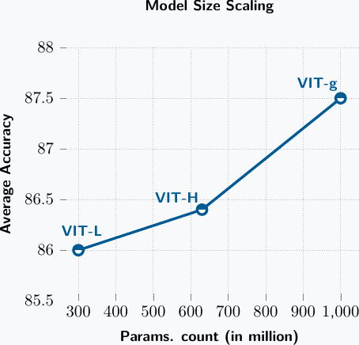

> 图 7：规划。我们通过最小化世界模型对未来 $T$ 步的 **想象状态表征（imagined state representation）** 与其 **目标表征（goal representation）** 之间的 **L1 距离（L1 distance）** ，来为一个固定的时间范围 $T$ 规划一个动作序列。该 L1 损失相对于动作 $(a_{k})_{k\in[T]}$ 使用 **交叉熵方法（Cross-Entropy Method, CEM）** （Rubinstein, 1997）进行优化。具体来说，在每一个规划步骤中，我们从一系列初始化为零均值和单位方差的高斯分布中，采样规划范围内每个时间点的动作坐标。 **前 k 个（top-k）** 动作轨迹的群体统计量被用来更新这些高斯分布的均值和方差。这个过程重复数次迭代，最终返回高斯序列的均值作为选定的动作轨迹。

### 4.1 实验设置（Experimental Setup）

##### 基线模型（Baselines）。

我们将 **V-JEPA 2-AC** 的性能与两个基线模型进行比较：一个是通过 **行为克隆（Behavior Cloning, BC）** 训练的 **视觉-语言-动作模型（vision-language-action model）** ，另一个是基于 **视频生成（video generation）** 的世界模型。

第一个基线模型基于 **Octo 视频-语言-动作模型（Octo video-language-action model）** ，它支持 **目标图像条件化（goal-image conditioning）** （Octo Model Team 等人, 2024）。我们从模型的 _octo-base-1.5_ 版本的开源权重开始，该模型在包含超过 100 万条轨迹的 _Open-X Embodiment_ 数据集上进行了预训练。(^1^ 作为对比，我们在来自 Droid 的 23k 条轨迹（包括成功和失败）上训练 V-JEPA 2-AC。) 我们在整个 Droid 数据集上使用 **后见之明重标记（hindsight relabeling）** （Andrychowicz 等人, 2017; Ghosh 等人, 2019）和图像目标及末端执行器状态，通过行为克隆对 Octo 模型进行 **微调（fine-tuning）** 。具体而言，在训练期间，我们从 Droid 数据集中随机采样轨迹片段，并均匀地采样轨迹中向前最多 20 个时间步的目标图像。我们使用官方的开源代码进行微调，包括所有标准的 Droid 优化超参数，并利用 $256\times 256$ 分辨率的单侧图像视图输入、两个先前帧的上下文以及 4 个未来动作的规划范围。

我们比较的第二个基线模型基于 **Cosmos 视频生成模型（Cosmos video generation model）** （Agarwal 等人, 2025）。我们从 **无动作（action-free）** 的 Cosmos 模型（使用连续分词器的潜在扩散-7B 模型）的开源权重开始，该模型在 2000 万小时的视频上进行了训练，然后我们使用官方发布的 **动作条件化微调（action-conditioned fine-tuning）** 代码在 Droid 数据集上对该模型进行微调。(^2^ [https://github.com/nvidia-cosmos/cosmos-predict1](https://github.com/nvidia-cosmos/cosmos-predict1)) 为了提高在 Droid 上训练时的性能，我们（i）降低了学习率以匹配视频条件化 Cosmos 配方中使用的学习率，（ii）移除了视频条件化中的 **丢弃法（dropout）** 以改善训练动态，以及（iii）将噪声水平提高了 $e^{2}$ 倍，因为我们观察到使用较低噪声因子训练的模型难以利用条件帧中的信息。尽管 Cosmos 技术报告（Agarwal 等人, 2025）提到将世界模型用于规划或模型预测控制是未来的一个应用方向，但据我们所知，这是首次报道使用 Cosmos 模型进行机器人控制的尝试。

##### **机器人部署（Robot deployment）**

所有模型均以 **零样本（zero-shot）** 方式部署在配备 RobotiQ 夹爪的 Franka Emika Panda 机械臂上，这些机械臂位于两个不同的实验室，且这两个实验室均未出现在 Droid 数据集中。
视觉输入通过一个未经标定的低分辨率单目 RGB 相机提供。
机器人使用完全相同的模型权重和推理代码，以及基于 **操作空间控制（operational space control）** 的相似底层控制器。
对于 V-JEPA 2-AC 世界模型和 Cosmos 世界模型，我们使用 **阻塞控制（blocking control）** （即系统在向控制器发送新动作前，会等待上一个指令动作完成）；对于 Octo 模型，我们同时尝试了阻塞和非阻塞控制，并报告两种方案中的最佳性能。
在使用 V-JEPA 2-AC 和 Cosmos 进行规划时，我们将每个采样动作约束在原点为中心、半径为 $0.075$ 的 L1 球内，这对应于每个独立动作的最大末端执行器位移约为 13 厘米，因为大幅度的动作对于模型而言相对属于 **分布外（out-of-distribution）** 。

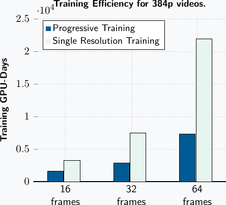

> 图 8 | **单目标到达（Single-Goal Reaching）** 。单目标到达任务涉及根据单个目标图像将末端执行器移动到空间中的期望位置。该任务用于衡量模型对动作的基本理解，以及从单目 RGB 相机获取场景（包括深度）的 3D 空间理解能力。在每一步中，我们使用 V-JEPA 2-AC 通过最小化模型想象的未来状态表示与目标帧表示之间的 L1 距离来规划一系列动作。然后执行第一个动作，并在下一个时间步重新规划。在规划过程中，我们仅在原点为中心、半径为 $0.075$ 的 L1 球内采样单个动作。因此，单步内可实现的到目标的笛卡尔距离最大减少量为 $0.13$（约 13 厘米）。

### **4.2 结果（Results）**

##### **单目标到达（Single-goal reaching）**

首先，我们在单目标到达任务上进行评估，该任务涉及根据单个目标图像将末端执行器移动到空间中的期望位置。
该任务用于衡量模型对动作的基本理解，以及从单目 RGB 相机获取场景（包括深度）的 3D 空间理解能力。

[图 8](#figure-8) 展示了在三个不同的单目标到达任务中，机器人执行期间末端执行器与其目标位置之间的欧几里得距离。
在所有情况下，模型都能将末端执行器移动到距离其目标位置小于 4 厘米的范围内，并选择导致误差单调递减的动作。
这可以看作是一种 **视觉伺服（visual servoing）** （Hill, 1979）形式，即利用来自相机的视觉反馈来控制机器人的运动。
然而，与经典的视觉伺服方法不同，V-JEPA 2-AC 是通过在未标注的真实世界视频数据上进行训练来实现这一点的。

在 [图 9](#figure-9) 中，我们可视化了公式 ([5](https://arxiv.org/html/2506.09985v1#S3.E5)) 中针对 $\Delta y$ 到达任务的 V-JEPA 2-AC **能量景观（energy landscape）** ，将其作为单个笛卡尔控制动作的函数，在保持 $\Delta z=0$ 固定的情况下扫描 $\Delta x$ 和 $\Delta y$。
能量函数在接近真实动作处取得最小值，这进一步证明模型已学会在无需精确传感的情况下合理推断动作的效果。
同样有趣的是，由 V-JEPA 2-AC 诱导的能量景观相对平滑且局部凸，这应有助于规划。

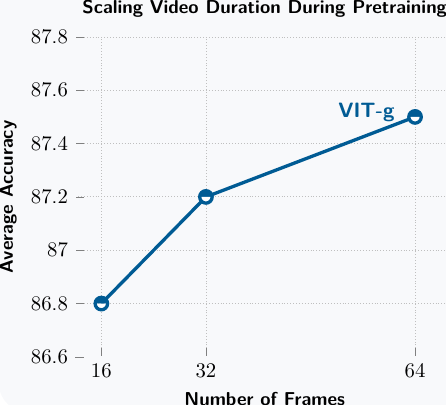

> 图 9 | V-JEPA 2-AC 能量景观。针对单目标到达任务的能量景观，关于末端执行器笛卡尔控制动作（在固定 $\Delta z=0$ 的情况下扫描 $\Delta x$ 和 $\Delta y$）；将目标图像与起始帧关联的真实动作位于 $(\Delta x,\Delta y)=(0,-0.1)$。我们看到能量函数在 $(\Delta x,\Delta y)\approx(0,-0.05)$ 附近达到最小值，表明模型已经学会在无需精确感知的情况下合理地推断动作的效果。

##### **抓握式操作（Prehensile manipulation）**

接下来，我们在更具挑战性的抓握式物体操作任务上评估所有模型，即 **抓取（grasp）** 、 **持物到达（reach with object）** 和 **拾取与放置（pick-and-place）** 。成功率报告在[表 2](#table-2)和[表 3](#table-3)中，并在10次试验中取平均值，每次试验的任务参数（如物体位置、起始姿态等）均有所不同。

- 对于 **抓取** 和 **持物到达** 任务，模型会看到一个单一的目标图像。
- 对于 **拾取与放置** 任务，除了最终目标外，我们还会向模型展示两个子目标图像。第一个目标图像显示物体被抓取的状态，第二个目标图像显示物体在目标位置附近的状态。
  模型首先针对第一个子目标优化动作4个时间步，然后自动切换到第二个子目标优化接下来的10个时间步，最后针对第三个目标（最终目标）优化最后4个时间步。拾取与放置任务的机器人执行示例如[图 10](#figure-10)所示。实验室1中所有独立任务的起始帧和目标帧见[第11.2节](#section-11.2)。
- **抓取** 任务需要根据视觉反馈进行精确控制以正确抓握物体。
- **持物到达** 任务要求模型在持有一个物体的同时进行导航，这需要对直观物理学有基本的理解以避免物体掉落。
- 最后， **拾取与放置** 任务测试的是组合这些原子技能的能力。

虽然所有模型在 **到达（reach）** 任务上都取得了较高的成功率，但在涉及物体交互的任务上，性能差异更为明显。我们观察到，所有模型的成功率都取决于被操作物体的类型。例如，我们发现杯子最容易通过将一个手指放入物体内部并抓握其边缘来抓取，然而，如果模型产生的控制动作不够精确，机器人就会错过杯子的边缘而无法抓取物体。当操作盒子时，存在更多可行的抓取配置，然而，模型需要更精确的夹爪控制，以确保手指张开得足够宽以抓取物体。我们看到，对于所有模型，成功率随物体类型的变化是由于次优动作的组合以及操作每个特定物体所面临的独特挑战共同造成的。尽管如此，我们看到 V-JEPA 2-AC 模型在所有任务中都取得了最高的成功率，这凸显了 **潜在规划（latent planning）** 用于机器人操作的可行性。

在[表 3](#table-3)中，我们比较了使用 V-JEPA 2-AC 与基于 **潜在扩散（latent diffusion）** 的 Cosmos 动作条件视频生成模型时的规划性能。在这两种情况下，我们都利用 **交叉熵方法（Cross-Entropy Method, CEM）** (Rubinstein, 1997) 在单个 NVIDIA RTX 4090 GPU 上优化动作序列，并通过在模型的潜在空间中编码目标帧来构建能量函数，如公式 ([5](https://arxiv.org/html/2506.09985v1#S3.E5)) 所示。使用 Cosmos 时，在每规划步中计算单个动作需要 80 个样本、10 个优化步骤和规划视界为 1 的设置，耗时 4 分钟。虽然使用 Cosmos 时我们在 **到达** 任务上取得了 80% 的高成功率，但在物体交互任务上的性能较弱。请注意，在每动作 4 分钟的规划时间下，一个完整的拾取与放置轨迹需要超过一小时的机器人执行时间。相比之下，在每个优化步骤中使用多 10$\times$ 的样本，V-JEPA 2-AC 世界模型每动作仅需 16 秒，并在所有考虑的机器人技能上带来更高的性能。在未来的工作中，我们有可能通过以下方式减少两种模型的规划时间：利用额外的计算资源进行规划、减少每个时间步使用的样本和优化步骤数量、在世界模型的想象中训练一个前馈策略来初始化规划问题，或者对于 V-JEPA 2-AC 的情况，可能利用基于梯度的规划。

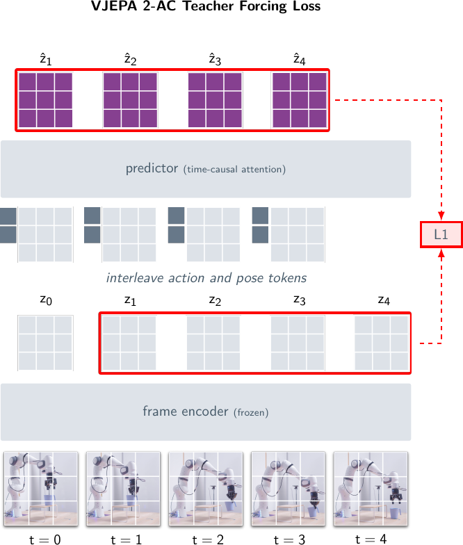

> 图 10 | 抓取-放置（Pick-&-Place）。V-JEPA 2-AC（Video Joint-Embedding Predictive Architecture 2-Action Chunking）在多目标抓取-放置任务中的 **闭环机器人（Closed-loop robot）** 执行过程。高亮帧表示模型达成一个子目标并切换到下一个目标的时刻。第一个目标图像显示物体被抓起，第二个目标图像显示物体在目标位置附近，第三个目标图像显示物体被放置在期望位置。模型首先针对第一个子目标优化动作 4 个时间步，随后自动切换到第二个子目标并执行 10 个时间步，最后针对第三个目标执行最后 4 个时间步。机器人动作通过 **目标条件规划（Goal-conditioned planning）** 推断得出。V-JEPA 2-AC 模型能够在位于不同实验室的两台 **弗兰卡机械臂（Franka arms）** 上，针对各种物体配置和杂乱环境，执行 **零样本（Zero-shot）** 抓取-放置任务。

> 表 2 | 零样本机器人操作（Zero-Shot Robot Manipulation）。所有模型均以零样本方式部署在位于不同实验室、配备 RobotiQ 夹爪的两台弗兰卡机械臂上。给定每个考虑任务的目标图像，所有模型以闭环方式运行，推断出一系列动作以实现目标。成功率基于 10 次试验报告，每次试验中对任务进行了各种变化（例如，物体位置、起始姿态等）。

|                                     |                   |               | 抓取（Grasp） | 持物接近（Reach w/ Obj.） | 抓取-放置（Pick-&-Place） |             |             |             |
| ----------------------------------- | ----------------- | ------------- | :-----------: | :-----------------------: | :-----------------------: | :---------: | :---------: | :---------: |
| 方法（Method）                      |                   | 接近（Reach） |  杯子（Cup）  |        盒子（Box）        |        杯子（Cup）        | 盒子（Box） | 杯子（Cup） | 盒子（Box） |
| Octo (Octo Model Team et al., 2024) | 实验室 1（Lab 1） | 100%          |      20%      |            0%             |            20%            |     70%     |     20%     |     10%     |
|                                     | 实验室 2（Lab 2） | 100%          |      10%      |            0%             |            10%            |     70%     |     10%     |     10%     |
|                                     | 平均（Avg）       | 100%          |      15%      |            0%             |            15%            |     70%     |     15%     |     10%     |
| V-JEPA 2-AC (ours)                  | 实验室 1（Lab 1） | 100%          |      70%      |            30%            |            90%            |     80%     |     80%     |     80%     |
|                                     | 实验室 2（Lab 2） | 100%          |      60%      |            20%            |            60%            |     70%     |     80%     |     50%     |
|                                     | 平均（Avg）       | 100%          |      65%      |            25%            |            75%            |     75%     |     80%     |     65%     |

> 表 3：规划性能。比较使用 **模型预测控制（Model Predictive Control, MPC）** 结合 V-JEPA 2-AC 世界模型和 Cosmos 世界模型进行的闭环机器人操作。在两种情况下，我们都利用 **交叉熵方法（Cross-Entropy Method, CEM）** (Rubinstein, 1997) 在单个 NVIDIA RTX 4090 GPU 上优化动作序列。对于每项机器人技能，我们在 10 个任务上评估每个模型并取平均结果。对于 Cosmos（这是一个基于 **潜在扩散（Latent Diffusion）** 的动作条件视频生成模型），使用 80 个样本、10 次优化步骤和规划视野为 1 时，每个规划步骤计算单个动作需要 4 分钟。请注意，在每动作 4 分钟的规划时间下，一个完整的拾取与放置轨迹需要超过一小时。相比之下，V-JEPA 2-AC 世界模型在每个优化步骤中使用 $10\times$ 更多的样本，每动作仅需 16 秒，并在所有考虑的机器人技能上取得了更高的性能。

表 3 | 规划性能。
| Lab 2 | Planning Details | | Grasp | Pick-&-Place | | | | | |
| ----------------------------- | ---------------- | ----- | ------- | ------------ | ----- | --- | --- | --- | --- |
| Method | #Samples | Iter. | Horizon | Time | Reach | Cup | Box | Cup | Box |
| Cosmos (Agarwal et al., 2025) | 80 | 10 | 1 | 4 min. | 80% | 0% | 20% | 0% | 0% |
| V-JEPA 2-AC (ours) | 800 | 10 | 1 | 16 sec. | 100% | 60% | 20% | 80% | 50% |

### 4.3 局限性（Limitations）

##### 对相机定位的敏感性（Sensitivity to camera positioning）。

由于 V-JEPA 2-AC 模型被训练为在给定末端执行器笛卡尔控制动作的情况下预测下一视频帧的表征，且没有任何显式的相机标定，因此它必须从单目 RGB 相机输入中隐式推断动作坐标轴。然而，在许多情况下，机器人基座在相机画面中不可见，因此推断动作坐标轴的问题定义不明确，从而导致世界模型出现错误。在实践中，我们手动尝试了不同的相机位置，最终选定了一个在我们所有实验中都能良好工作的位置。我们在 [第 11.4 节](#section-11-4) 中对 V-JEPA 2-AC 世界模型对相机位置的敏感性进行了定量分析。

##### 长视野规划（Long horizon planning）。

使用世界模型进行长视野规划受到多种因素的限制。

- 首先， **自回归预测（Autoregressive prediction）** 存在误差累积问题：表征空间预测的准确性随着自回归展开长度的增加而降低，从而使得在长视野上进行可靠规划变得更加困难。
- 其次，长视野规划增加了搜索空间的规模：可能的动作轨迹数量随着规划视野的线性增加而呈指数级增长，从而使得在长视野上进行规划在计算上具有挑战性。

另一方面，长视野规划对于解决非贪婪的预测任务是必要的，例如，没有图像子目标的拾取与放置任务。未来探索用于长视野规划的世界模型的工作将能够解决更多复杂且有趣的任务。

##### 图像目标（Image goals）。

遵循许多先前在 **目标条件机器人操作（Goal-conditioned robot manipulation）** 方面的工作 (Finn and Levine, 2017; Lynch et al., 2020; Chebotar et al., 2021; Jang et al., 2022; Liu et al., 2022; Gupta et al., 2022)，我们当前对优化目标的表述假设我们可以获得视觉目标。然而，当在真实环境中部署机器人时，以其他形式（例如语言）表达目标可能更为自然。未来将 **潜在动作条件世界模型（Latent action-conditioned world models）** 与 **语言模型（Language Models, LMs）** 对齐的工作，将朝着通过自然语言进行更通用的任务指定迈进一步。

## 5 理解：基于探针的分类（Understanding: Probe-based Classification）

**表示空间世界模型（Representation-space world model）** （例如上文讨论的 V-JEPA 2-AC）的能力，本质上受限于所学表示空间中编码的状态信息。在本节及后续章节中，我们将探究 V-JEPA 2 学习到的表示，并在视觉分类任务上将 V-JEPA 2 编码器与其他视觉编码器进行比较。

视觉分类任务可以侧重于 **_外观理解（appearance understanding）_** 或 **_运动理解（motion understanding）_** 。外观理解任务通常可以利用输入视频片段中单帧可见的信息来解决（即使分类标签描述的是动作），而运动理解任务则需要多帧才能正确分类视频 [1]。为了确保对运动和外观进行平衡的评估，我们选择了三个运动理解任务，即 Something-Something v2（SSv2）、Diving-48 和 Jester，这些任务要求模型理解人类手势和动作。对于外观理解，我们选择了 Kinetics400（K400）、COIN 和 ImageNet（IN1K），这些任务涉及识别动作、场景和物体。实验表明，V-JEPA 2 在运动理解任务上优于最先进的视觉编码器，同时在外观理解任务上具有竞争力。

##### 注意力探针（Attentive Probe）。

我们在冻结的编码器输出之上，使用每个任务的训练数据训练了一个 4 层注意力探针。我们的注意力探针由四个 Transformer 块组成，其中最后一个块使用一个可学习的查询令牌（learnable query token），将标准的自注意力（self-attention）替换为交叉注意力层（cross-attention layer）。遵循标准做法，在推理过程中从视频中采样多个具有固定帧数的片段。然后，分类逻辑值（logits）在各个片段间取平均。我们保持的分辨率与 V-JEPA 2 预训练时使用的分辨率相似。我们在 [第 12.2 节](#section-12-2) 中对注意力探针的层数进行了消融实验，并提供了下游任务中使用的片段数量、片段大小和其他超参数的完整细节。

> 表 4：动作与物体分类。我们报告了 V-JEPA 2 模型在动作和物体分类上的性能，所有模型均在 $256\times 256$ 分辨率下使用 64 帧进行预训练，但 V-JEPA 2 ViT-g384 是在 $384\times 384$ 分辨率下预训练的。我们将其性能与最先进的图像和视频编码器进行比较。除 V-JEPA 2 ViT-g384 外，所有模型遵循相同的评估协议。对于 SSv2（16 帧片段，2 个时间裁剪，3 个空间裁剪），我们使用 $256\times 256$ 分辨率和 $16\times 2\times 3$ 输入；对于 K400，使用 $16\times 8\times 3$；对于 COIN，使用 $32\times 8\times 3$；对于 Diving-48 和 Jester，使用 $32\times 4\times 3$。V-JEPA 2 ViT-g384 在所有六个任务上使用更高的 $384\times 384$ 分辨率，并且对于 SSv2 额外使用 $64\times 2\times 3$ 输入，对于 COIN 额外使用 $32\times 8\times 3$ 输入。我们的 V-JEPA 2 ViT-g 在运动理解任务上显著优于其他视觉编码器，在外观任务上具有竞争力。它在所有图像和视频编码器中取得了 $87.5$ 的最佳平均性能。V-JEPA 2 ViT-g384 进一步在所有任务上持续提升结果，达到 $88.2$ 的平均性能。$*$：PEcoreG 在 ImageNet 上使用注意力探针和 $448$ 像素的输入分辨率达到了 $89.8\%$ 的准确率 [2]。在我们的案例中，我们使用了 $256$ 像素的输入分辨率和不同的探针架构。

表 4 | 在运动和外观理解任务上的分类性能比较。所有数值均为 Top-1 准确率（%）。`Param.` 表示模型参数量（单位：十亿）。`Avg.` 表示六个任务的平均准确率。`SSv2`：Something-Something v2。`K400`：Kinetics-400。`COIN`：COIN 数据集。`IN1K`：ImageNet-1K。`–` 表示结果未报告。`^∗` 表示该结果为在 ImageNet-1K 验证集上使用 384×384 分辨率评估所得。
| | | | 运动理解 | 外观理解 | | | | |
| :----------------------------------------------- | :----- | :--- | :------- | :------- | :----- | :--- | :--- | :----- |
| **方法** | **参数量** | **平均** | **SSv2** | **Diving-48** | **Jester** | **K400** | **COIN** | **IN1K** |
| **文献中报告的结果** | | | | | | | | |
| VideoMAEv2 (Wang et al., 2023) | 1B | – | 56.1 | – | – | 82.8 | – | 71.4 |
| InternVideo2-1B (Wang et al., 2024b) | 1B | – | 67.3 | – | – | 87.9 | – | – |
| InternVideo2-6B (Wang et al., 2024b) | 6B | – | 67.7 | – | – | 88.8 | – | – |
| VideoPrism (Zhao et al., 2024) | 1B | – | 68.5 | 71.3 | – | 87.6 | – | – |
| **使用相同协议评估的图像编码器** | | | | | | | | |
| DINOv2 (Darcet et al., 2024) | 1.1B | 81.1 | 50.7 | 82.5 | 93.4 | 83.6 | 90.7 | 86.1 |
| PEcoreG (Bolya et al., 2025) | 1.9B | 82.3 | 55.4 | 76.9 | 90.0 | 88.5 | 95.3 | 87.6^∗ |
| SigLIP2 (Tschannen et al., 2025) | 1.2B | 81.1 | 49.9 | 75.3 | 91.0 | 87.3 | 95.1 | 88.0 |
| **使用相同协议评估的视频编码器** | | | | | | | | |
| V-JEPA ViT-H (Bardes et al., 2024) | 600M | 85.2 | 74.3 | 87.9 | 97.7 | 84.5 | 87.1 | 80.0 |
| InternVideo2s2-1B (Wang et al., 2024b) | 1B | 87.0 | 69.7 | 86.4 | 97.0 | 89.4 | 93.8 | 85.8 |
| V-JEPA 2 ViT-L | 300M | 86.0 | 73.7 | 89.0 | 97.6 | 85.1 | 86.8 | 83.5 |
| V-JEPA 2 ViT-H | 600M | 86.4 | 74.0 | 89.8 | 97.7 | 85.3 | 87.9 | 83.8 |
| V-JEPA 2 ViT-g | 1B | 87.5 | 75.3 | 90.1 | 97.7 | 86.6 | 90.7 | 84.6 |
| V-JEPA 2 ViT-g384 | 1B | 88.2 | 77.3 | 90.2 | 97.8 | 87.3 | 91.1 | 85.1 |

##### 评估协议（Evaluation protocol）.

我们将 V-JEPA 2 在运动和外观任务上的性能与其他几种视觉编码器进行比较：带寄存器（registers）的 DINOv2 [1] 是当前图像自监督学习（Self-supervised Learning）领域的最先进模型，而 SigLIP2 [2] 和感知编码器（Perception Encoder）PEcoreG [3] 是图像-文本对比预训练（Image-text Contrastive Pretraining）领域的两个最先进模型。我们还考虑了两种视频编码器：自监督的 V-JEPA [4]，以及主要依赖视觉-文本对比预训练的 InternVideo2s2-1B [5]。

我们对每个基线模型和 V-JEPA 2 使用相同的评估协议，即在冻结的编码器之上学习一个注意力探针（attentive probe），类似于 Bardes 等人 [4] 的做法。我们遵循 Oquab 等人 [6] 使用的程序，将基于图像的模型适配到视频任务，即拼接每个输入帧的特征。对于 InternVideo2s2-1B，我们在 ImageNet 任务中使用其图像位置嵌入（image positional embedding），对于视频任务，我们将其位置嵌入从 4 帧插值到 8 帧，以产生与 V-JEPA 2 相似的令牌（token）数量。尽管使用了共同的评估协议，但基线编码器是在不同的数据上训练的（例如，DINOv2 在 LVD-142M 上，PEcoreG 在 MetaCLIP 上），因此不能直接比较。因此，我们只能在系统层面比较不同的方法；也就是说，尽管训练协议和数据存在差异，但保持一致的评估协议。我们还收录了文献中使用类似冻结协议但可能具有不同注意力头架构的现有结果。具体来说，我们分享了 VideoMAEv2 [7]、InternVideo-1B 和 6B [5] 以及 VideoPrism [8] 在我们考虑的（当可获得时）分类任务上报告的结果。完整的评估细节和超参数见 [第 12.1 节](#section-12-1)。

##### 结果（Results）.

[表 4](#table-4) 报告了 V-JEPA 2、我们评估的其他编码器以及文献中报告的其他显著结果的分类性能。V-JEPA 2 ViT-g（256 分辨率）在运动理解任务上显著优于其他视觉编码器。它在 SSv2 上达到了 75.3 的 Top-1 准确率，而 InternVideo 为 69.7，PECoreG 为 55.4。V-JEPA 2 在外观任务上也具有竞争力，在 ImageNet 上达到 84.6（相比 V-JEPA 提高了 $+4.6$ 分）。总体而言，与其他视频和图像编码器相比，V-JEPA 2 在所有六个任务上获得了最佳的平均性能。更高分辨率、更长持续时间的 V-JEPA 2 ViT-g384 在所有任务上均显示出进一步的改进，平均性能达到 $88.2$。

## 6 Prediction: Probe-based Action Anticipation（预测：基于探针的动作预测）

> 表 5：预测：人类动作预测。在 EK100 动作预测基准上与最先进方法的比较。我们报告了 EK100 验证集上动词、名词和动作的 **平均类别召回率@5（mean-class recall-at-5）** 。V-JEPA 2 的性能随模型规模线性扩展，并且在所有模型规模上都优于之前的最先进方法。

| Method                           | Param. | Action Anticipation |      |        |
| -------------------------------- | ------ | ------------------- | ---- | ------ |
|                                  |        | Verb                | Noun | Action |
| InAViT (Roy et al., 2024)        | 160M   | 51.9                | 52.0 | 25.8   |
| Video-LLaMA (Zhang et al., 2023) | 7B     | 52.9                | 52.0 | 26.0   |
| PlausiVL (Mittal et al., 2024)   | 8B     | 55.6                | 54.2 | 27.6   |
| Frozen Backbone                  |        |                     |      |        |
| V-JEPA 2 ViT-L                   | 300M   | 57.8                | 53.8 | 32.7   |
| V-JEPA 2 ViT-H                   | 600M   | 59.2                | 54.6 | 36.5   |
| V-JEPA 2 ViT-g                   | 1B     | 61.2                | 55.7 | 38.0   |
| V-JEPA 2 ViT-g384                | 1B     | 63.6                | 57.1 | 39.7   |

**动作预测（Action anticipation）** 是指在给定一个持续到动作发生前某个时刻的上下文视频片段的情况下，预测未来的动作。使用 Epic-Kitchens-100 (EK100) 基准 [Damen et al., 2022]，我们证明了 V-JEPA 2 的动作预测性能随模型规模持续提升。此外，尽管仅使用了在 V-JEPA 2 表征之上训练的 **注意力探针（attentive probe）** ，我们表明 V-JEPA 2 显著优于专门为此任务设计的先前最先进方法。

##### 任务（Task）

EK100 数据集包含从 **自我中心视角（egocentric perspective）** 在 45 个厨房环境中记录的 100 小时烹饪活动。EK100 中的每个视频都用 **动作片段（action segments）** 进行了标注，其中包括开始时间戳、结束时间戳和动作标签。共有 3,568 个独特的动作标签，每个标签由一个动词类别和一个名词类别组成，总共有 97 个动词类别和 300 个名词类别。EK100 动作预测任务涉及从一个视频片段（称为 **上下文（context）** ）中预测名词、动词和动作（即联合预测动词和名词），该片段发生在动作片段的开始时间戳之前。上下文结束与动作片段开始之间的间隔是 **预测时间（anticipation time）** ，默认设置为 1 秒。鉴于从给定上下文中可能存在不同的未来动作，因此使用 **平均类别召回率@5（mean-class recall-at-5）** 作为衡量性能的指标 [Damen et al., 2022]。

##### 预测探针（Anticipation Probe）

在冻结的 V-JEPA 2 编码器和预测器之上训练一个 **注意力探针（attentive probe）** 来预测未来动作。
具体来说，我们采样一个在动作开始前 1 秒结束的视频片段。这个视频上下文被输入到 V-JEPA 2 编码器。预测器接收编码器的表征，以及对应于未来 1 秒帧的 **掩码标记（mask tokens）** ，并预测未来视频帧的表征。预测器和编码器的输出沿着 **标记维度（token dimension）** 拼接，并输入到一个注意力探针，其架构与 [第 5 节](#section-5) 中使用的类似，不同之处在于预测探针的最终 **交叉注意力层（cross-attention layer）** 学习三个 **查询标记（query tokens）** （而不是一个），并且每个查询输出被输入到不同的 **线性分类器（linear classifier）** ，分别用于预测动作类别、动词类别和名词类别。
**焦点损失（Focal loss）** [Lin et al., 2017] 独立应用于每个分类器，然后在通过探针的共享注意力块进行反向传播之前求和。
我们在 [第 13.1 节](#section-13-1) 中提供了更多细节和评估超参数。

##### 基线（Baselines）

我们将我们的模型与三个专门为动作预测（Action Anticipation）训练的基线（Baseline）模型进行比较：InAViT（Roy 等人，2024）是一种利用显式手-物交互建模的监督方法（Supervised Approach），而 Video-LLaMA（Zhang 等人，2023）和 PlausiVL（Mittal 等人，2024）都是利用参数高达 70 亿的大型语言模型（Large Language Model, LLM）的方法。

##### **结果（Results）**

[表 5](#table-5) 总结了在 EK100 动作预测基准测试（Benchmark）上的结果。我们比较了 V-JEPA 2 的 ViT-L、ViT-H 和 ViT-g 编码器（Encoder），参数数量从 3 亿增加到 10 亿。三者均使用 32 帧、每秒 8 帧、分辨率为 $256\times 256$ 的视频作为上下文（Context）。我们还报告了使用 $384\times 384$ 分辨率的 ViT-g384 的结果。在动作预测的召回率前 5（Recall-at-5）指标上，V-JEPA 2 表现出与模型大小相关的线性缩放（Linear Scaling）行为。拥有 3 亿参数的 V-JEPA 2 ViT-L 实现了 32.7 的召回率前 5。将模型大小增加到 10 亿参数，带来了 +5.3 分的提升，动作召回率前 5 达到 38.0。此外，V-JEPA 2 受益于使用更高分辨率的上下文，在 $384\times 384$ 分辨率下的 V-JEPA 2 ViT-g384，其召回率前 5 比使用 $256\times 256$ 分辨率的其他模型额外提升了 +1.7 分。

V-JEPA 2 以显著优势超越了之前的最先进（State-of-the-art, SOTA）模型 PlausiVL，即使其参数仅为 3 亿，而 PlausiVL 使用了 80 亿参数。具体而言，V-JEPA 2 ViT-g384 在动作召回率前 5 上比 PlausiVL 提升了 +12.1 分，相当于 44% 的相对改进。

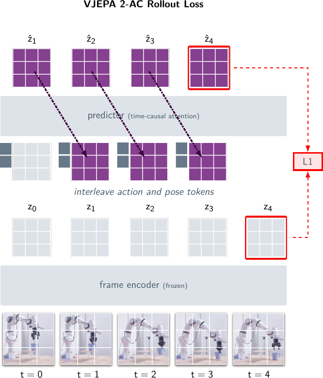

> 图 11 | EK100 预测的可视化。（左）：从上下文帧中选出的四帧。（中）：模型预测，按可能性排序。（右）：1 秒预测时间后的下一帧。我们展示了两个模型预测成功的例子和一个模型失败的例子。

在 [图 11](#figure-11) 中，我们可视化了 V-JEPA 2 对 EK100 验证集（Validation Set）中三个样本的预测，其中两个成功，一个失败。对于两个成功的例子，V-JEPA 2 不仅以最高置信度（Top 1 Confidence）正确检索到了正确的动作，还根据给定的上下文提出了连贯的排名第 2 至第 5 的动作。例如，在第一行中，正确动作是“清洗水槽（wash sink）”，但考虑到存在水龙头和墙壁，“打开水（turn on water）”或“清洁墙壁（clean wall）”也本应是有效的动作。模型还预测了“冲洗海绵（rinse sponge）”，这是当前正在执行的动作，可能是假设该动作在 1 秒后仍在进行。对于失败的案例，V-JEPA 2 仍然提出了连贯的动作，如“关门（close door）”和“放下香料包（put down spices package）”，但未能准确识别物体的具体性质：“茶包（tea package）”。

##### **局限性（Limitations）**

V-JEPA 2 和 EK100 基准测试存在若干局限性。首先，V-JEPA 2 并未完全解决 EK100 任务，存在模型将动词（Verb）、名词（Noun）或两者都预测错误的失败案例。我们在 [第 13.2 节](#section-13-2) 中研究了这些错误的分布。其次，我们在此专注于预测 1 秒预测时间后的动作。当预测更长的时间范围时，V-JEPA 2 的准确性会下降，详见 [第 13.2 节](#section-13-2)。第三，EK100 基准测试仅限于厨房环境，具有封闭且定义明确的词汇表（Vocabulary），我们不知道 V-JEPA 2 对其他环境的泛化（Generalization）能力如何。这限制了在 EK100 上训练的模型的实用性和适用性（Applicability）。最后，EK100 中的动作是从固定的类别集合中选择的，因此无法泛化到训练集中未出现的动作类别。

## 7 理解：视频问答（Understanding : Video Question Answering）

在本节中，我们探索 V-JEPA 2 执行开放语言视频问答（Video Question Answering, VidQA）的能力。为了赋予其语言能力，我们训练了一个 **多模态大语言模型（Multimodal Large Language Model, MLLM）** ，使用 V-JEPA 2 作为视觉编码器，采用由 LLaVA 系列模型（Li et al., 2024b）推广的 **非词元化早期融合（non-tokenized early fusion）** （Wadekar et al., 2024）设置。
在这类 MLLM 中，通过将视觉编码器的输出 **图像块嵌入（patch embeddings）** 投影到 LLM 的输入嵌入空间，使视觉编码器与大型语言模型对齐。然后，MLLM 以端到端的方式或使用冻结的视觉编码器进行训练。
用于 VidQA 的 MLLM 中，大多数编码器通常是 **图像编码器（image encoders）** ，对于视频输入，它们被独立地应用于每一帧（Qwen Team et al., 2025; Zhang et al., 2024b）。
这类编码器的流行实例包括 CLIP（Radford et al., 2021）、SigLIP（Tschannen et al., 2025）和 Perception Encoder（Bolya et al., 2025），选择它们主要是因为它们通过与图像-标题对进行预训练而获得的与语言的语义对齐。
据我们所知，我们的工作是 **首次使用在没有任何语言监督下预训练的视频编码器来训练用于 VidQA 的 MLLM** 。

MLLM 在下游任务上的性能也高度依赖于 **对齐数据（alignment data）** 。在这些实验中，我们使用了一个包含 8850 万个图像-文本和视频-文本对的数据集，类似于用于训练 PerceptionLM（Cho et al., 2025）的数据。为了证明 V-JEPA 2 编码器的有效性，我们首先在 [第 7.2 节](#section-7-2) 的受控数据设置中，使用 1800 万个样本的子集，将 V-JEPA 2 与其他最先进的视觉编码器进行比较。然后，在相同的受控设置中，我们在 [第 7.3 节](#section-7-3) 中展示了扩展视觉编码器和输入分辨率大小都能持续提升 VidQA 性能。最后，我们在 [第 7.4 节](#section-7-4) 中扩展对齐数据，使用全部的 8850 万个样本来测试 V-JEPA 2 的语言对齐极限。
我们的结果表明，在受控数据设置下，与其他视觉编码器相比，V-JEPA 2 在开放式 VidQA 任务上获得了有竞争力的性能。
在对齐数据扩展后，V-JEPA 2 在多个 VidQA 基准测试中实现了最先进的性能。

### 7.1 实验设置（Experiment Setup）

##### 视频问答任务（Video Question Answering Tasks）。

我们在 PerceptionTest（Pătrăucean et al., 2023）上进行评估，该测试评估模型在记忆、抽象、物理和语义等不同技能上的表现。此外，我们在用于物理世界理解的 MVP 数据集（Krojer et al., 2024）上进行评估，该数据集利用 **最小视频对评估框架（minimal-video pair evaluation framework）** 来减轻文本和外观偏见。我们还评估了 TempCompass、TemporalBench 和 TOMATO（Liu et al., 2024c; Cai et al., 2024; Shangguan et al., 2024），以研究模型的时间理解和记忆能力。最后，我们使用 MVBench（Li et al., 2024c）报告了关于一般理解能力的结果，该基准倾向于单帧外观特征（Krojer et al., 2024; Cores et al., 2024），以及 TVBench（Cores et al., 2024），后者在文献中被提出作为一般理解和时间理解的替代方案，以减轻这些偏见。

##### **视觉指令微调（Visual Instruction Tuning）**

为了评估 V-JEPA 2（Video Joint-Embedding Predictive Architecture 2）在视觉问答任务上的表征能力，我们使用 LLaVA（Large Language and Vision Assistant）框架 [1] 中的视觉指令微调流程，将 V-JEPA 2 与一个 **大型语言模型（Large Language Model, LLM）** 对齐。该过程涉及使用一个可学习的 **投影器模块（Projector Module）** （通常是一个 **多层感知机（Multilayer Perceptron, MLP）** ）将视觉编码器的输出（或视觉词元）转换为 LLM 的输入。

我们遵循 Liu 等人 [2] 的方法，通过一个渐进式的三阶段过程来训练 **多模态大语言模型（Multimodal Large Language Model, MLLM）** ：

- **阶段 1** ：我们仅使用图像描述数据训练投影器。
- **阶段 2** ：我们在大规模图像问答数据上训练完整模型。
- **阶段 3** ：我们在大规模视频描述和问答数据上进一步训练模型。

通过这种分阶段训练方法，LLM 能够逐步提升其对视觉词元的理解能力。视觉编码器可以与 MLLM 的其余部分一起被冻结或进行微调。我们探索了这两种设置，因为冻结视觉编码器能更清晰地反映视觉特征的质量，而对视觉编码器进行微调则能获得更好的整体性能。视觉指令训练的更多细节在 [第 14 节](#section-14) 中描述。

> 表 6：在冻结编码器设置下，现成的图像编码器与 V-JEPA 2 的比较。所有实验使用相同的 LLM 主干（Qwen2-7B-Instruct）、数据和训练设置（视觉编码器冻结）。PerceptionTest 准确率报告的是监督微调（Supervised Fine-Tuning, SFT）后在验证集上的结果。

| 方法                  | 参数 编码器 / LLM | 平均     | PerceptionTest SFT / 准确率 | MVP 配对准确率 | TempCompass 多选 | TemporalBench (MBA-简短问答) | TVBench 准确率 | TOMATO 准确率 | MVBench 准确率 |
| :-------------------- | :------------------- | :------- | :----------------------------- | :---------------- | :------------------ | :------------------------------ | :---------------- | :--------------- | :---------------- |
| **现成的图像编码器**  |                      |          |                                |                   |                     |                                 |                   |                  |                   |
| DINOv2 ViT-g518       | 1.1B/7B              | 45.7     | 67.1                           | 22.4              | 62.3                | 26.8                            | 47.6              | 32.0             | 61.8              |
| SigLIP2 ViT-g384      | 1.1B/7B              | 48.1     | 72.4                           | 26.2              | 66.8                | 25.7                            | 48.7              | 33.2             | 64.0              |
| PE ViT-G/14448        | 1.9B/7B              | 49.1     | 72.3                           | 26.7              | 67.0                | 27.5                            | 51.6              | 34.0             | 64.7              |
| **V-JEPA 2 ViT-g512** | **1B/7B**            | **52.3** | **72.0**                       | **31.1**          | **69.2**            | **33.3**                        | **55.9**          | **37.0**         | **67.7**          |

> 表 7：视觉编码器规模和分辨率的扩展。我们将视觉编码器的参数规模从 3 亿扩展到 10 亿，输入分辨率从 256 像素扩展到 512 像素。所有实验使用相同的 LLM 主干（Qwen2-7B-Instruct）、数据和端到端训练（视觉编码器未冻结）设置。PerceptionTest 准确率报告的是监督微调后在验证集上的结果。增加 V-JEPA 2 编码器的规模和分辨率提高了在视频问答（Video Question Answering, VidQA）任务上的平均性能。

| 方法              | 参数 编码器 / LLM | 平均 | PerceptionTest SFT / 准确率 | MVP 配对准确率 | TempCompass 多选 | TemporalBench (MBA-简短问答) | TVBench 准确率 | TOMATO 准确率 | MVBench 准确率 |
| :---------------- | :------------------- | :--- | :----------------------------- | :---------------- | :------------------ | :------------------------------ | :---------------- | :--------------- | :---------------- |
| **端到端评估**    |                      |      |                                |                   |                     |                                 |                   |                  |                   |
| V-JEPA 2 ViT-L256 | 300M/7B              | 51.7 | 74.6                           | 32.3              | 70.1                | 30.2                            | 50.9              | 36.5             | 67.1              |
| V-JEPA 2 ViT-H256 | 600M/7B              | 52.0 | 74.7                           | 30.6              | 70.9                | 29.8                            | 54.6              | 35.1             | 68.0              |
| V-JEPA 2 ViT-g256 | 1B/7B                | 52.3 | 75.5                           | 31.9              | 70.7                | 28.3                            | 54.2              | 37.3             | 68.3              |
| V-JEPA 2 ViT-g384 | 1B/7B                | 54.0 | 76.5                           | 33.0              | 71.7                | 33.1                            | 56.5              | 39.0             | 68.5              |
| V-JEPA 2 ViT-g512 | 1B/7B                | 54.4 | 77.7                           | 33.7              | 71.6                | 32.3                            | 57.5              | 38.5             | 69.5              |

### 7.2 与图像编码器比较（Comparing with Image Encoders）

为了分离视觉编码器对 **多模态大语言模型（Multimodal Large Language Model, MLLM）** 性能的贡献并与 V-JEPA 2 进行比较，我们引入了一个受控设置：我们使用相同的 **大型语言模型（Large Language Model, LLM）** 主干和训练设置，用不同的最先进编码器分别训练多个 MLLM。
在此受控设置中，我们使用 Qwen2-7B-Instruct [1] 并冻结视觉编码器。
我们使用了 1800 万个图像/视频-文本对齐样本。
我们首先将在 512$\times$512 分辨率下预训练的 V-JEPA 2 与 DINOv2 [2]、SigLIP-2 [3] 和 Perception Encoder [4] 进行比较。

我们观察到，在冻结设置下，V-JEPA 2 表现出有竞争力的性能，在所有测试的基准（[表 6](#table-6)）中都优于 DINOv2、SigLIP 和 Perception Encoder（PE），除了在 PerceptionTest 上 V-JEPA 2 略微逊色于 SigLIP 和 PE。这种改进在 MVP、TemporalBench 和 TVBench 上尤其明显——这些基准主要关注时序理解。
此外，由于我们只更换了视觉编码器，我们提供的证据表明，一个 **无需语言监督（without language supervision）** 训练的视频编码器可以优于 **有语言监督（with language supervision）** 训练的编码器，这与传统观点 [5, 6, 7, 8] 相反。结果还表明，在 **视频问答（Video Question Answering, VidQA）** 中使用视频编码器而非图像编码器，可以改善时空理解，这凸显了开发更好的视频编码器的必要性。

### 7.3 扩展视觉编码器规模与输入分辨率（Scaling Vision Encoder Size and Input Resolution）

先前的工作 [9] 表明，扩展视觉编码器和输入分辨率能显著提升 **自监督图像编码器（self-supervised image encoders）** 的 **视觉问答（Visual Question Answering, VQA）** 性能。因此，我们将 V-JEPA 2 的参数量从 3 亿扩展到 10 亿，并将输入分辨率从 256 像素提升到 512 像素，结果展示在 [表 7](#table-7) 中。在固定输入分辨率为 256 像素的情况下，将视觉编码器容量从 3 亿参数增加到 10 亿参数时，我们观察到 PerceptionTest 提升了 0.9 分，TVBench 提升了 3.3 分，MVBench 提升了 1.2 分。此外，将输入分辨率提高到 512 像素在所有下游任务中带来了进一步的提升，例如 PerceptionTest 提升了 2.2 分，TemporalBench 提升了 4.0 分，TVBench 提升了 3.3 分。这些结果表明，进一步扩展视觉编码器和输入分辨率是提升 VidQA 性能的一个有前景的方向。

> 表 8 | 与最先进方法的比较。我们使用完整的 8850 万样本对齐数据集，并采用与 PLM 8B Cho 等人 (2025) 相同的方法进行训练，使用 Llama 3.1 作为主干。我们观察到在下游评估中取得了显著提升，在 80 亿参数模型类别中获得了最先进的结果。V-JEPA 2 的 PerceptionTest 准确率是在测试集上使用监督微调（Supervised Fine-Tuning, SFT）后报告的；所有其他结果均为零样本（zero-shot）结果。

| Method                                                             | Params Enc / LLM | Avg. | PerceptionTest Test Acc | MVP Paired-Acc | TempCompass multi-choice | TemporalBench (MBA-short QA) | TOMATO Acc | TVBench Acc | MVBench Acc |
| :----------------------------------------------------------------- | :------------------ | :--- | :------------------------- | :---------------- | :-------------------------- | :------------------------------ | :------------ | :------------- | :------------- |
| $\leq 8B$ Video Language Models Results Reported in the Literature |                     |      |                            |                   |                             |                                 |               |                |                |
| InternVL-2.5 (Chen et al., 2024)                                   | 300M/7B             | 52.1 | 68.9                       | 39.9              | 68.3                        | 24.3                            | 29.4          | 61.6           | 72.6           |
| Qwen2VL (Wang et al., 2024a)                                       | 675M/7B             | 47.0 | 66.9                       | 29.2              | 67.9                        | 20.4                            | 31.5          | 46.0           | 67.0           |
| Qwen2.5VL (Qwen Team et al., 2025)                                 | 1B/7B               | 49.7 | 70.5                       | 36.7              | 71.7                        | 24.5                            | 24.6          | 50.5           | 69.6           |
| PLM 8B (Cho et al., 2025)                                          | 1B/8B               | 56.7 | 82.7                       | 39.7              | 72.7                        | 28.3                            | 33.2          | 63.5           | 77.1           |
| V-JEPA 2 ViT-g384 LLama 3.1 8B                                     | 1B/8B               | 59.5 | 84.0                       | 44.5              | 76.9                        | 36.7                            | 40.3          | 60.6           | 73.5           |

### 7.4 通过扩展数据改进最先进水平（Improving the State-of-the-art by Scaling Data）

在对 **V-JEPA 2（Video Joint-Embedding Predictive Architecture 2）** 在受控设置下训练 **多模态大语言模型（Multimodal Large Language Model, MLLM）** 的能力有了更深入的理解后，我们研究了增加对齐数据集规模以改进 **视频问答（Video Question Answering, VidQA）** 最先进水平的效果。

正如 Cho 等人 (2025) 所观察到的，下游任务性能的阶跃式提升通常通过增加训练数据的规模来实现。为此，我们将 MLLM 训练数据的规模从 1800 万增加到完整的 8850 万（4.7$\times$）。

虽然提高模型分辨率有助于提升下游性能，但这带来了在 LLM 输入中容纳大量视觉词元（visual tokens）的挑战。因此，我们选择 V-JEPA 2 ViT-g384，这导致每帧产生 288 个视觉词元。我们遵循与 Cho 等人 (2025) 相同的方案来训练 V-JEPA 2 ViT-g384，使用 Llama 3.1 作为主干。为了简化训练过程，我们使用了一个不带池化（pooling）的 **多层感知机投影器（Multilayer Perceptron Projector, MLP projector）** 。关于扩展训练设置的详细信息在 [第 14 节](#section-14) 中描述。

扩展数据一致地提升了下游基准测试的性能，在多个基准测试—— **PerceptionTest** 、 **MVP（Multimodal Video Perception）** 、 **TempCompass** 、 **TemporalBench** 和 **TOMATO** ——上取得了最先进的结果（[表 8](#table-8)）。

与当前最先进的 PerceptionLM 8B (Cho 等人, 2025) 相比，我们观察到：在 PerceptionTest 测试集上的准确率提高了 1.3 个百分点，在 MVP 上的配对准确率（paired accuracy）提高了 4.8 个百分点，在 TempCompass 上的准确率提高了 4.2 个百分点，在 TemporalBench 的短问答（short-QA）片段上的多二元准确率（Multi-binary accuracy）提高了 8.4 个百分点，以及在 TOMATO 上的准确率提高了 7.1 个百分点。

V-JEPA 2 在 TVBench 和 MVBench 上并未超越 PerceptionLM，但它仍然显著优于其他相关基线（InternVL 2.5、Qwen2VL 和 Qwen2.5VL）。

这些结果强调了扩展训练数据对于 **视觉-语言对齐（vision-language alignment）** 的必要性，并提供了证据表明，像 V-JEPA 2 这样未经语言监督预训练的编码器，在达到足够规模时也能取得最先进的结果。

## 8 相关工作（Related Work）

##### 世界模型与规划（World models and planning）。

早在 Sutton 和 Barto (1981) 以及 Chatila 和 Laumond (1985) 的工作中，人工智能（Artificial Intelligence, AI）研究者就致力于构建能够利用 **世界内部模型（internal models of the world）** 的智能体——既对世界的动态进行建模，也对静态环境进行映射——以实现高效的规划与控制。
先前的研究已在模拟任务 [Fragkiadaki et al., 2015; Ha and Schmidhuber, 2018; Hafner et al., 2019b, a; Hansen et al., 2022, 2023; Hafner et al., 2023; Schrittwieser et al., 2020; Samsami et al., 2024] 以及真实世界的移动和操作任务 [Lee et al., 2020; Nagabandi et al., 2020; Finn et al., 2016; Ebert et al., 2017, 2018; Yen-Chen et al., 2020] 中探索了世界模型。世界模型方法要么直接在 **像素空间（pixel-space）** 中学习预测模型 [Finn et al., 2016; Ebert et al., 2017, 2018; Yen-Chen et al., 2020]，要么在 **学习到的表示空间（learned representation space）** 中学习 [Watter et al., 2015; Agrawal et al., 2016; Ha and Schmidhuber, 2018; Hafner et al., 2019b; Nair et al., 2022; Wu et al., 2023b; Tomar et al., 2024; Hu et al., 2024; Lancaster et al., 2024]，或者利用更具结构化的表示空间，例如 **关键点表示（keypoint representations）** [Manuelli et al., 2020; Das et al., 2020]。
先前在机器人任务上展示出真实世界性能的方法，训练的是 **任务特定（task-specific）** 的世界模型，并且依赖于机器人部署环境中的交互数据。其评估重点在于展示世界建模方法在已探索任务空间内的性能，而非向新环境或未见物体的泛化能力。
在本工作中，我们训练了一个 **任务无关（task-agnostic）** 的世界模型，并展示了对新环境和物体的泛化能力。

一些近期工作利用互联网规模的视频和交互数据，为自主机器人训练通用的（任务无关的） **动作条件视频生成模型（action-conditioned video generation models）** [Bruce et al., 2024; Agarwal et al., 2025; Russell et al., 2025]。然而，迄今为止，这些方法仅展示了在给定机器人动作的情况下生成视觉上看似合理的规划的能力，但尚未展示出使用这些模型实际控制机器人的能力。

其他工作探索了将 **生成式建模（generative modeling）** 集成到 **策略学习（policy learning）** 中 [Du et al., 2024; Wu et al., 2023a; Zhao et al., 2025; Zhu et al., 2025; Du et al., 2023; Zheng et al., 2025; Rajasegaran et al., 2025]。与这一系列工作不同，我们的目标是通过 **模型预测控制（model-predictive control）** 而非策略学习来利用世界模型，以避免需要专家轨迹的 **模仿学习（imitation learning）** 阶段。这两种方法是正交的，可以在未来的工作中结合。与我们的工作最接近的是 Zhou et al. (2024) 和 Sobal et al. (2025)，他们表明可以分阶段或端到端地学习一个世界模型，并利用它来 **零样本（zero-shot）** 解决规划任务。虽然这些先前的工作侧重于小规模规划评估，但我们表明，类似的原理可以被规模化并用于解决真实世界的机器人任务。

##### 用于机器人控制的视觉-语言-动作模型（Vision-Language-Action models for Robotic Control）。

近期在真实世界机器人控制中的模仿学习方法在学习表现出日益增强泛化能力的策略方面取得了显著进展。这是通过利用在互联网规模的视频和文本数据上预训练的 **视频-语言模型（video-language models）** 实现的，然后通过使用来自专家演示的 **行为克隆（behavior cloning）** 对这些模型进行微调（或适配），使其也能预测动作 [Driess et al., 2023; Brohan et al., 2023; Black et al., 2024; Kim et al., 2024; Bjorck et al., 2025; Black et al., 2025]。尽管这些方法显示出有希望的泛化结果，但尚不清楚它们是否能够学习预测训练数据中未演示过的行为，因为它们缺乏对世界的显式预测模型，并且没有利用推理时计算进行规划。它们需要高质量的大规模遥操作数据，并且只能利用成功的轨迹。相比之下，我们专注于利用任何交互数据，无论它来自与环境的成功还是失败的交互。

##### 视觉基础模型（Vision Foundation Models）。

计算机视觉中的 **视频基础模型（video foundation models）** 已经表明，可以利用由图像和/或视频组成的大规模观测数据集，通过图像的自监督学习方法 [Grill et al., 2020; Assran et al., 2023; Oquab et al., 2023; Fan et al., 2025]、视频的自监督学习方法 [Bardes et al., 2024; Carreira et al., 2024; Wang et al., 2023; Rajasegaran et al., 2025]、弱语言监督 [Wang et al., 2024b; Bolya et al., 2025] 或其组合 [Tschannen et al., 2025; Fini et al., 2024]，来学习在广泛下游任务中表现良好的通用视觉编码器。然而，先前的工作往往侧重于在与大型语言模型对齐后，使用基于探针的评估或视觉问答任务进行理解评估。虽然此类任务有助于推动进展，但使智能体能够与物理世界交互仍然是视觉系统的一个重要目标 [Gibson, 1979]。除了视觉理解任务的结果外，我们研究了如何通过视频的大规模自监督学习，能够以零样本的方式解决新环境中的规划任务。

## 9 结论（Conclusion）

本研究展示了 **联合嵌入预测架构（Joint-embedding Predictive Architecture）** 如何通过从网络规模数据和少量机器人交互数据中以 **自监督（Self-supervised）** 方式学习，能够产生一个能够在物理世界中理解、预测和规划的 **世界模型（World Model）** 。
V-JEPA 2 在需要运动理解和人类动作预测的动作分类任务上取得了最先进的性能。当与 **大型语言模型（Large Language Model, LLM）** 对齐时，V-JEPA 2 在视频问答任务上也超越了以往的视觉编码器。此外，利用 V-JEPA 2 的表征，对 **动作条件世界模型（Action-conditioned World Model）** V-JEPA 2-AC 进行 **后训练（Post-training）** ，使得真实世界的机器人能够成功执行 **零样本（Zero-shot）** 的抓握操作任务，例如 **拾取与放置（Pick-and-Place）** 。这些发现表明，V-JEPA 2 是朝着开发能够在其环境中有效感知和行动的先进 AI 系统迈出的一步。

##### 未来工作（Future work）。

针对 V-JEPA 2 的局限性，未来工作有几个重要的方向。首先，在本工作中，我们专注于需要预测未来大约 16 秒的任务。这使得能够从单一目标图像出发，为更简单的操作任务（如抓取和带物移动）进行规划。然而，要将此扩展到更长期的任务，如拾取与放置甚至更复杂的任务，且无需子目标，则需要在建模方面进行进一步的创新。开发能够跨多个空间和时间尺度、在不同抽象层次上进行预测的 **分层模型（Hierarchical Model）** 方法，是一个有前景的方向。

其次，如 [第 4 节](#section-4) 所述，V-JEPA 2-AC 目前依赖于以图像目标形式指定的任务。虽然这对于某些任务来说可能很自然，但在其他情况下，基于语言的目标指定可能更可取。扩展 V-JEPA 2-AC 以接受基于语言的目标（例如，通过一个能将基于语言的目标嵌入到 V-JEPA 2-AC 表征空间中的模型），是未来工作的另一个重要方向。[第 7 节](#section-7) 中描述的将 V-JEPA 2 与语言模型对齐的结果，可以作为一个起点。

最后，在本工作中，我们将 V-JEPA 2 模型的规模扩展到了适度的 10 亿参数。 [第 2 节](#section-2) 中的结果表明，在扩展到这一水平时，性能得到了持续的提升。先前的研究已经探索了将视觉编码器扩展到高达 200 亿参数 (Zhai et al., 2022; Carreira et al., 2024)。需要在这一方向上进行更多工作，以开发可扩展的预训练方案，从而随着规模扩大带来持续的性能提升。

## Acknowledgements

我们感谢
罗布·弗格斯（Rob Fergus）、乔尔·皮诺（Joelle Pineau）、斯蒂芬·卡斯里尔（Stephane Kasriel）、奈拉·默里（Naila Murray）、姆里纳尔·卡拉克里希南（Mrinal Kalakrishnan）、吉滕德拉·马利克（Jitendra Malik）、
兰德尔·巴莱斯特里罗（Randall Balestriero）、朱伦·乌雷恩（Julen Urain）、
加布里埃尔·辛纳夫（Gabriel Synnaeve）、米歇尔·迈耶（Michel Meyer）、冯雁（Pascale Fung）、高洁丝（Justine Kao）、弗洛里安·博尔德斯（Florian Bordes）、亚伦·福斯（Aaron Foss）、
尼基尔·古普塔（Nikhil Gupta）、科迪·奥尔森（Cody Ohlsen）、卡利安·萨拉迪（Kalyan Saladi）、阿南亚·萨克塞纳（Ananya Saxena）、麦克·沃德（Mack Ward）、帕斯·马拉尼（Parth Malani）、舒博·森古普塔（Shubho Sengupta）、黄利奥（Leo Huang）、
卡米拉·本齐纳（Kamila Benzina）、瑞秋·金（Rachel Kim）、
安娜·保拉·基什纳·莫法雷（Ana Paula Kirschner Mofarrej）、艾丽莎·纽科姆（Alyssa Newcomb）、尼莎·德奥（Nisha Deo）、耶尔·云斯特（Yael Yungster）、肯尼·莱曼（Kenny Lehmann）、卡拉·马图奇（Karla Martucci）、
以及 PerceptionLM 团队，包括克里斯托夫·费希滕霍费尔（Christoph Feichtenhofer）、安德里亚·马多托（Andrea Madotto）、图沙尔·纳加拉扬（Tushar Nagarajan）和彼得·多拉尔（Piotr Dollar），
感谢他们对此项目的反馈与支持。

## 参考文献（References）

- **Agarwal et al. (2025)**
  Niket Agarwal, Arslan Ali, Maciej Bala, Yogesh Balaji, Erik Barker, Tiffany Cai, Prithvijit Chattopadhyay, Yongxin Chen, Yin Cui, Yifan Ding, Daniel Dworakowski, Jiaojiao Fan, Michele Fenzi, Francesco Ferroni, Sanja Fidler, Dieter Fox, Songwei Ge, Yunhao Ge, Jinwei Gu, Siddharth Gururani, Ethan He, Jiahui Huang, Jacob Huffman, Pooya Jannaty, Jingyi Jin, Seung Wook Kim, Gergely Klár, Grace Lam, Shiyi Lan, Laura Leal-Taixe, Anqi Li, Zhaoshuo Li, Chen-Hsuan Lin, Tsung-Yi Lin, Huan Ling, Ming-Yu Liu, Xian Liu, Alice Luo, Qianli Ma, Hanzi Mao, Kaichun Mo, Arsalan Mousavian, Seungjun Nah, Sriharsha Niverty, David Page, Despoina Paschalidou, Zeeshan Patel, Lindsey Pavao, Morteza Ramezanali, Fitsum Reda, Xiaowei Ren, Vasanth Rao Naik Sabavat, Ed Schmerling, Stella Shi, Bartosz Stefaniak, Shitao Tang, Lyne Tchapmi, Przemek Tredak, Wei-Cheng Tseng, Jibin Varghese, Hao Wang, Haoxiang Wang, Heng Wang, Ting-Chun Wang, Fangyin Wei, Xinyue Wei, Jay Zhangjie Wu, Jiashu Xu, Wei Yang, Lin Yen-Chen, Xiaohui Zeng, Yu Zeng, Jing Zhang, Qinsheng Zhang, Yuxuan Zhang, Qingqing Zhao, and Artur Zolkowski.
  **Cosmos 世界基础模型平台：面向物理人工智能（Cosmos world foundation model platform for physical AI）** 。
  _arXiv 预印本 arXiv:2501.03575_, 2025.

- **Agrawal et al. (2016)**
  Pulkit Agrawal, Ashvin V Nair, Pieter Abbeel, Jitendra Malik, and Sergey Levine.
  **通过戳动学习戳动：直觉物理的经验学习（Learning to poke by poking: Experiential learning of intuitive physics）** 。
  _神经信息处理系统进展（Advances in Neural Information Processing Systems）_, 29, 2016.

- **Andrychowicz et al. (2017)**
  Marcin Andrychowicz, Filip Wolski, Alex Ray, Jonas Schneider, Rachel Fong, Peter Welinder, Bob McGrew, Josh Tobin, OpenAI Pieter Abbeel, and Wojciech Zaremba.
  **后见之明经验回放（Hindsight experience replay）** 。
  _神经信息处理系统进展（Advances in Neural Information Processing Systems）_, 30, 2017.

- **Assran et al. (2022)**
  Mahmoud Assran, Randall Balestriero, Quentin Duval, Florian Bordes, Ishan Misra, Piotr Bojanowski, Pascal Vincent, Michael Rabbat, and Nicolas Ballas.
  **自监督学习中的隐藏均匀聚类先验（The hidden uniform cluster prior in self-supervised learning）** 。
  _arXiv 预印本 arXiv:2210.07277_, 2022.

- **Assran et al. (2023)**
  Mahmoud Assran, Quentin Duval, Ishan Misra, Piotr Bojanowski, Pascal Vincent, Michael Rabbat, Yann LeCun, and Nicolas Ballas.
  **使用联合嵌入预测架构从图像进行自监督学习（Self-supervised learning from images with a joint-embedding predictive architecture）** 。
  载于《IEEE/CVF 计算机视觉与模式识别会议论文集（Proceedings of the IEEE/CVF Conference on Computer Vision and Pattern Recognition）》，第 15619–15629 页，2023。

- **Bardes et al. (2024)**
  Adrien Bardes, Quentin Garrido, Jean Ponce, Xinlei Chen, Michael Rabbat, Yann LeCun, Mahmoud Assran, and Nicolas Ballas.
  **重新审视特征预测以从视频学习视觉表征（Revisiting feature prediction for learning visual representations from video）** 。
  _arXiv 预印本 arXiv:2404.08471_, 2024.

- **Bjorck et al. (2025)**
  Johan Bjorck, Fernando Castañeda, Nikita Cherniadev, Xingye Da, Runyu Ding, Linxi “Jim” Fan, Yu Fang, Dieter Fox, Fengyuan Hu, Spencer Huang, Joel Jang, Zhenyu Jiang, Jan Kautz, Kaushil Kundalia, Lawrence Lao, Zhiqi Li, Zongyu Lin, Kevin Lin, Guilin Liu, Edith Llontop, Loic Magne, Ajay Mandlekar, Avnish Narayan, Soroush Nasiriany, Scott Reed, You Liang Tan, Guanzhi Wang, Zu Wang, Jing Wang, Qi Wang, Jiannan Xiang, Yuqi Xie, Yinzhen Xu, Zhenjia Xu, Seonghyeon Ye, Zhiding Yu, Ao Zhang, Hao Zhang, Yizhou Zhao, Ruijie Zheng, and Yuke Zhu.
  **Gr00t n1：面向通用人形机器人的开放基础模型（Gr00t n1: An open foundation model for generalist humanoid robots）** 。
  _arXiv 预印本 arXiv:2503.14734_, 2025.

- **Black et al. (2024)**
  Kevin Black, Noah Brown, Danny Driess, Adnan Esmail, Michael Equi, Chelsea Finn, Niccolo Fusai, Lachy Groom, Karol Hausman, Brian Ichter, Szymon Jakubczak, Tim Jones, Liyiming Ke, Sergey Levine, Adrian Li-Bell, Mohith Mothukuri, Suraj Nair, Karl Pertsch, Lucy Xiaoyang Shi, James Tanner, Quan Vuong, Anna Walling, Haohuan Wang, and Ury Zhilinsky.
  **$\pi$0：用于通用机器人控制的视觉-语言-动作流模型（$\pi$0: A vision-language-action flow model for general robot control）** , 2024。
  _arXiv 预印本 arXiv:2410.24164_, 2024.

- **Black et al. (2025)**
  Kevin Black, Noah Brown, James Darpinian, Karan Dhabalia, Danny Driess, Adnan Esmail, Michael Equi, Chelsea Finn, Niccolo Fusai, Manuel Y. Galliker, Dibya Ghosh, Lachy Groom, Karol Hausman, Brian Ichter, Szymon Jakubczak, Tim Jones, Liyiming Ke, Devin LeBlanc, Sergey Levine, Adrian Li-Bell, Mohith Mothukuri, Suraj Nair, Karl Pertsch, Allen Z. Ren, Lucy Xiaoyang Shi, Laura Smith, Jost Tobias Springenberg, Kyle Stachowicz, James Tanner, Quan Vuong, Homer Walke, Anna Walling, Haohuan Wang, Lili Yu, and Ury Zhilinsky.
  **$\pi_{0.5}$：一个具有开放世界泛化能力的视觉-语言-动作模型（$\pi_{0.5}$: a vision-language-action model with open-world generalization）** 。
  _arXiv 预印本 arXiv:2504.16054_, 2025.

- **Bolya et al. (2025)**
  Daniel Bolya, Po-Yao Huang, Peize Sun, Jang Hyun Cho, Andrea Madotto, Chen Wei, Tengyu Ma, Jiale Zhi, Jathushan Rajasegaran, Hanoona Rasheed, Junke Wang, Marco Monteiro, Hu Xu, Shiyu Dong, Nikhila Ravi, Daniel Li, Piotr Dollár, and Christoph Feichtenhofer.
  **感知编码器：最佳的视觉嵌入不在网络的输出端（Perception encoder: The best visual embeddings are not at the output of the network）** 。
  _arXiv 预印本 arXiv:2504.13181_, 2025.

- **Brohan et al. (2023)**
  Anthony Brohan, Noah Brown, Justice Carbajal, Yevgen Chebotar, Xi Chen, Krzysztof Choromanski, Tianli Ding, Danny Driess, Avinava Dubey, Chelsea Finn, Pete Florence, Chuyuan Fu, Montse Gonzalez Arenas, Keerthana Gopalakrishnan, Kehang Han, Karol Hausman, Alexander Herzog, Jasmine Hsu, Brian Ichter, Alex Irpan, Nikhil Joshi, Ryan Julian, Dmitry Kalashnikov, Yuheng Kuang, Isabel Leal, Lisa Lee, Tsang-Wei Edward Lee, Sergey Levine, Yao Lu, Henryk Michalewski, Igor Mordatch, Karl Pertsch, Kanishka

- Bruce 等人 (2024)
  Jake Bruce, Michael Dennis, Ashley Edwards, Jack Parker-Holder, Yuge Shi,
  Edward Hughes, Matthew Lai, Aditi Mavalankar, Richie Steigerwald, Chris Apps,
  Yusuf Aytar, Sarah Bechtle, Feryal Behbahani, Stephanie Chan, Nicolas Heess,
  Lucy Gonzalez, Simon Osindero, Sherjil Ozair, Scott Reed, Jingwei Zhang,
  Konrad Zolna, Jeff Clune, Nando de Freitas, Satinder Singh, and Tim
  Rocktäschel.
  Genie: 生成式交互环境。
  发表于《国际机器学习会议（International Conference on Machine Learning）》，2024年。
- Cai 等人 (2024)
  Mu Cai, Reuben Tan, Jianrui Zhang, Bocheng Zou, Kai Zhang, Feng Yao, Fangrui
  Zhu, Jing Gu, Yiwu Zhong, Yuzhang Shang, Yao Dou, Jaden Park, Jianfeng Gao,
  Yong Jae Lee, and Jianwei Yang.
  Temporalbench: 多模态视频模型细粒度时序理解的基准测试。
  《arXiv 预印本 arXiv:2410.10818》，2024年。
- Carreira 等人 (2018)
  Joao Carreira, Eric Noland, Andras Banki-Horvath, Chloe Hillier, and Andrew
  Zisserman.
  关于 Kinetics-600 的简短说明。
  《arXiv 预印本 arXiv:1808.01340》，2018年。
- Carreira 等人 (2019)
  Joao Carreira, Eric Noland, Chloe Hillier, and Andrew Zisserman.
  关于 Kinetics-700 人类动作数据集的简短说明。
  《arXiv 预印本 arXiv:1907.06987》，2019年。
- Carreira 等人 (2024)
  João Carreira, Dilara Gokay, Michael King, Chuhan Zhang, Ignacio Rocco,
  Aravindh Mahendran, Thomas Albert Keck, Joseph Heyward, Skanda Koppula,
  Etienne Pot, Goker Erdogan, Yana Hasson, Yi Yang, Klaus Greff, Guillaume Le
  Moing, Sjoerd van Steenkiste, Daniel Zoran, Drew A. Hudson, Pedro Vélez,
  Luisa Polanía, Luke Friedman, Chris Duvarney, Ross Goroshin, Kelsey Allen,
  Jacob Walker, Rishabh Kabra, Eric Aboussouan, Jennifer Sun, Thomas Kipf, Carl
  Doersch, Viorica Pătrăucean, Dima Damen, Pauline Luc, Mehdi S. M. Sajjadi,
  and Andrew Zisserman.
  扩展 4D 表示。
  《arXiv 预印本 arXiv:2412.15212》，2024年。
- Chatila 和 Laumond (1985)
  Raja Chatila and Jean-Paul Laumond.
  移动机器人的位置参考与一致性世界建模。
  发表于《IEEE 机器人与自动化国际会议论文集（Proceedings of the IEEE International Conference on Robotics and Automation）》，第 2 卷，第 138–145 页，1985年。
- Chebotar 等人 (2021)
  Yevgen Chebotar, Karol Hausman, Yao Lu, Ted Xiao, Dmitry Kalashnikov, Jake
  Varley, Alex Irpan, Benjamin Eysenbach, Ryan Julian, Chelsea Finn, and Sergey
  Levine.
  可执行模型：机器人技能的无监督离线强化学习。
  《arXiv 预印本 arXiv:2104.07749》，2021年。
- Chen 等人 (2024)
  Zhe Chen, Weiyun Wang, Yue Cao, Yangzhou Liu, Zhangwei Gao, Erfei Cui, Jinguo
  Zhu, Shenglong Ye, Hao Tian, Zhaoyang Liu, Lixin Gu, Xuehui Wang, Qingyun Li,
  Yimin Ren, Zixuan Chen, Jiapeng Luo, Jiahao Wang, Tan Jiang, Bo Wang, Conghui
  He, Botian Shi, Xingcheng Zhang, Han Lv, Yi Wang, Wenqi Shao, Pei Chu,
  Zhongying Tu, Tong He, Zhiyong Wu, Huipeng Deng, Jiaye Ge, Kai Chen, Kaipeng
  Zhang, Limin Wang, Min Dou, Lewei Lu, Xizhou Zhu, Tong Lu, Dahua Lin,
  Yu Qiao, Jifeng Dai, and Wenhai Wang.
  通过模型、数据和测试时扩展来拓展开源多模态模型的性能边界。
  《arXiv 预印本 arXiv:2412.05271》，2024年。
- Cho 等人 (2025)
  Jang Hyun Cho, Andrea Madotto, Effrosyni Mavroudi, Triantafyllos Afouras,
  Tushar Nagarajan, Muhammad Maaz, Yale Song, Tengyu Ma, Shuming Hu, Suyog
  Jain, Miguel Martin, Huiyu Wang, Hanoona Rasheed, Peize Sun, Po-Yao Huang,
  Daniel Bolya, Nikhila Ravi, Shashank Jain, Tammy Stark, Shane Moon, Babak
  Damavandi, Vivian Lee, Andrew Westbury, Salman Khan, Philipp Krähenbühl,
  Piotr Dollár, Lorenzo Torresani, Kristen Grauman, and Christoph
  Feichtenhofer.
  PerceptionLM: 用于精细视觉理解的开源数据和模型。
  《arXiv 预印本 arXiv:2504.13180》，2025年。
- Clark (2013)
  Andy Clark.
  接下来是什么？预测性大脑、情境智能体与认知科学的未来。
  《行为与脑科学（Behavioral and brain sciences）》，第 36 卷，第 3 期，第 181–204 页，2013年。
- Cores 等人 (2024)
  Daniel Cores, Michael Dorkenwald, Manuel Mucientes, Cees GM Snoek, and Yuki M
  Asano.
  TVBench: 重新设计视频-语言评估。
  《arXiv 预印本 arXiv:2410.07752》，2024年。
- Craik (1967)
  Kenneth James Williams Craik.
  《解释的本质（The Nature of Explanation）》，第 445 卷。
  CUP 档案，1967年。
- Damen 等人 (2022)
  Dima Damen, Hazel Doughty, Giovanni Maria Farinella, Antonino Furnari, Jian Ma,
  Evangelos Kazakos, Davide Moltisanti, Jonathan Munro, Toby Perrett, Will
  Price, and Michael Wray.
  重新调整以自我为中心的视觉：EPIC-KITCHENS-100 的数据收集、流程与挑战。
  《国际计算机视觉杂志（International Journal of Computer Vision, IJCV）》，第 130 卷，第 33–55 页，2022年。
  [https://doi.org/10.1007/s11263-021-01531-2](https://doi.org/10.1007/s11263-021-01531-2)。
- Darcet 等人 (2024)
  Timothée Darcet, Maxime Oquab, Julien Mairal, and Piotr Bojanowski.
  视觉变换器需要寄存器。
  发表于《第十二届国际学习表征会议（The Twelfth International Conference on Learning Representations）》，2024年。
- Das 等人 (2020)
  Neha Das, Sarah Bechtle, Todor Davchev, Dinesh Jayaraman, Akshara Rai, and
  Franziska Meier.
  基于模型的视觉演示逆强化学习。
  发表于《机器人学习会议（Conference on Robot Learning, CoRL）》，2020年。
- Deng 等人 (2009)
  Jia Deng, Wei Dong, Richard Socher, Li-Jia Li, Kai Li, and Li Fei-Fei.
  ImageNet: 一个大规模分层图像数据库。
  发表于《IEEE 计算机视觉与模式识别会议论文集（Proceedings of the IEEE Conference on Computer Vision and Pattern Recognition）》，第 248–255 页，2009年。
- Dosovitskiy 等人 (2020)
  Alexey Dosovitskiy, Lucas Beyer, Alexander Kolesnikov, Dirk Weissenborn,
  Xiaohua Zhai, Thomas Unterthiner, Mostafa Dehghani, Matthias Minderer, Georg
  Heigold, Sylvain Gelly, Jakob Uszkoreit, and Neil Houlsby.
  一张图像值 16x16 个词：用于大规模图像识别的变换器。
  《arXiv 预印本 arXiv:2010.11929》，2020年。
- Driess 等人 (2023)
  Danny Driess, Fei Xia, Mehdi S. M.

- Sajjadi 等人 (2023)
  Mohammad Sajjadi, Corey Lynch, Aakanksha Chowdhery, Brian Ichter, Ayzaan Wahid, Jonathan Tompson, Quan Vuong, Tianhe Yu, Wenlong Huang, Yevgen Chebotar, Pierre Sermanet, Daniel Duckworth, Sergey Levine, Vincent Vanhoucke, Karol Hausman, Marc Toussaint, Klaus Greff, Andy Zeng, Igor Mordatch, and Pete Florence.
  PaLM-E: 一个具身多模态语言模型。
  _arXiv 预印本 arXiv:2023.03378_, 2023.
- Du 等人 (2023)
  Yilun Du, Sherry Yang, Bo Dai, Hanjun Dai, Ofir Nachum, Josh Tenenbaum, Dale Schuurmans, and Pieter Abbeel.
  通过文本引导视频生成学习通用策略。
  _神经信息处理系统进展_,
  36:9156–9172, 2023.
- Du 等人 (2024)
  Yilun Du, Sherry Yang, Pete Florence, Fei Xia, Ayzaan Wahid, Brian Ichter, Pierre Sermanet, Tianhe Yu, Pieter Abbeel, Joshua B. Tenenbaum, Leslie Pack Kaelbling, Andy Zeng, and Jonathan Tompson.
  视频语言规划。
  _ICLR_, 2024.
- Ebert 等人 (2017)
  Frederik Ebert, Chelsea Finn, Alex X Lee, and Sergey Levine.
  具有时间跳跃连接的自监督视觉规划。
  _CoRL_, 12(16):23, 2017.
- Ebert 等人 (2018)
  Frederik Ebert, Chelsea Finn, Sudeep Dasari, Annie Xie, Alex Lee, and Sergey Levine.
  视觉预见：用于基于视觉机器人控制的基于模型的深度强化学习。
  _arXiv 预印本 arXiv:1812.00568_, 2018.
- Fan 等人 (2025)
  David Fan, Shengbang Tong, Jiachen Zhu, Koustuv Sinha, Zhuang Liu, Xinlei Chen, Michael Rabbat, Nicolas Ballas, Yann LeCun, Amir Bar, and Saining Xie.
  扩展无语言视觉表征学习。
  _arXiv 预印本 arXiv:2504.01017_, 2025.
- Fini 等人 (2024)
  Enrico Fini, Mustafa Shukor, Xiujun Li, Philipp Dufter, Michal Klein, David Haldimann, Sai Aitharaju, Victor Guilherme Turrisi da Costa, Louis Béthune, Zhe Gan, Alexander T Toshev, Marcin Eichner, Moin Nabi, Yinfei Yang, Joshua M. Susskind, and Alaaeldin El-Nouby.
  大型视觉编码器的多模态自回归预训练。
  _arXiv 预印本 arXiv:2411.14402_, 2024.
- Finn 和 Levine (2017)
  Chelsea Finn and Sergey Levine.
  用于规划机器人运动的深度视觉预见。
  载于 _2017 IEEE 机器人与自动化国际会议 (ICRA)_, 第 2786–2793 页。IEEE, 2017.
- Finn 等人 (2016)
  Chelsea Finn, Ian Goodfellow, and Sergey Levine.
  通过视频预测进行物理交互的无监督学习。
  _神经信息处理系统进展_, 29, 2016.
- Fragkiadaki 等人 (2015)
  Katerina Fragkiadaki, Pulkit Agrawal, Sergey Levine, and Jitendra Malik.
  学习用于打台球的物理视觉预测模型。
  _arXiv 预印本 arXiv:1511.07404_, 2015.
- Friston (2010)
  Karl Friston.
  自由能原理：一个统一的大脑理论？
  _自然评论：神经科学_, 11(2):127–138, 2010.
- Gao 等人 (2024)
  Leo Gao, Jonathan Tow, Baber Abbasi, Stella Biderman, Sid Black, Anthony DiPofi, Charles Foster, Laurence Golding, Jeffrey Hsu, Alain Le Noac’h, Haonan Li, Kyle McDonell, Niklas Muennighoff, Chris Ociepa, Jason Phang, Laria Reynolds, Hailey Schoelkopf, Aviya Skowron, Lintang Sutawika, Eric Tang, Anish Thite, Ben Wang, Kevin Wang, and Andy Zou.
  一个用于少样本语言模型评估的框架, 07 2024.
  [https://zenodo.org/records/12608602](https://zenodo.org/records/12608602).
- Ghosh 等人 (2019)
  Dibya Ghosh, Abhishek Gupta, Ashwin Reddy, Justin Fu, Coline Devin, Benjamin Eysenbach, and Sergey Levine.
  通过迭代监督学习学习达成目标。
  _arXiv 预印本 arXiv:1912.06088_, 2019.
- Gibson (1979)
  James J Gibson.
  \_视觉感知的生态学方法：经典版》。
  心理学出版社, 1979.
- Goyal 等人 (2017)
  Raghav Goyal, Samira Ebrahimi Kahou, Vincent Michalski, Joanna Materzyńska, Susanne Westphal, Heuna Kim, Valentin Haenel, Ingo Fruend, Peter Yianilos, Moritz Mueller-Freitag, Florian Hoppe, Christian Thurau, Ingo Bax, and Roland Memisevic.
  用于学习和评估视觉常识的 "something something" 视频数据库。
  载于 \_IEEE 计算机视觉国际会议论文集》, 第 5842–5850 页, 2017.
- Grattafiori 等人 (2024)
  Aaron Grattafiori, Abhimanyu Dubey, Abhinav Jauhri, Abhinav Pandey, Abhishek Kadian, Ahmad Al-Dahle, Aiesha Letman, Akhil Mathur, Alan Schelten, Alex Vaughan, 等。
  Llama 3 模型群。
  _arXiv 预印本 arXiv:2407.21783_, 2024.
- Grill 等人 (2020)
  Jean-Bastien Grill, Florian Strub, Florent Altché, Corentin Tallec, Pierre H. Richemond, Elena Buchatskaya, Carl Doersch, Bernardo Avila Pires, Zhaohan Daniel Guo, Mohammad Gheshlaghi Azar, Bilal Piot, Koray Kavukcuoglu, Rémi Munos, and Michal Valko.
  自举你自己的潜在表示——一种自监督学习的新方法。
  \_神经信息处理系统进展》,
  33:21271–21284, 2020.
- Gupta 等人 (2022)
  Agrim Gupta, Stephen Tian, Yunzhi Zhang, Jiajun Wu, Roberto Martín-Martín, and Li Fei-Fei.
  Maskvit：用于视频预测的掩码视觉预训练。
  _arXiv 预印本 arXiv:2206.11894_, 2022.
- Ha 和 Schmidhuber (2018)
  David Ha and Jürgen Schmidhuber.
  世界模型。
  _arXiv 预印本 arXiv:1803.10122_, 2018.
- Hafner 等人 (2019a)
  Danijar Hafner, Timothy Lillicrap, Jimmy Ba, and Mohammad Norouzi.
  梦想控制：通过潜在想象学习行为。
  _arXiv 预印本 arXiv:1912.01603_, 2019a.
- Hafner 等人 (2019b)
  Danijar Hafner, Timothy Lillicrap, Ian Fischer, Ruben Villegas, David Ha, Honglak Lee, and James Davidson.
  从像素学习潜在动态以进行规划。
  载于 \_机器学习国际会议》, 第 2555–2565 页。PMLR, 2019b.
- Hafner 等人 (2023)
  Danijar Hafner, Jurgis Pasukonis, Jimmy Ba, and Timothy Lillicrap.
  通过世界模型掌握多样化领域。
  _arXiv 预印本 arXiv:2301.04104_, 2023.
- Hägele 等人

- Hägele 等人（2024）
  Alex Hägele, Elie Bakouch, Atli Kosson, Loubna Ben Allal, Leandro Von Werra, and Martin Jaggi.
  **超越固定训练时长的缩放定律与计算最优训练（Scaling laws and compute-optimal training beyond fixed training durations）** 。
  _Advances in Neural Information Processing Systems_,
  37:76232–76264, 2024.
- Hansen 等人（2022）
  Nicklas Hansen, Xiaolong Wang, and Hao Su.
  **用于模型预测控制的时序差分学习（Temporal difference learning for model predictive control）** 。
  _arXiv preprint arXiv:2203.04955_, 2022.
- Hansen 等人（2023）
  Nicklas Hansen, Hao Su, and Xiaolong Wang.
  **TD-MPC2：用于连续控制的可扩展、鲁棒的世界模型（Td-mpc2: Scalable, robust world models for continuous control）** 。
  _arXiv preprint arXiv:2310.16828_, 2023.
- Hill (1979)
  John Hill.
  **使用移动摄像头对机器人进行实时控制（Real time control of a robot with a mobile camera）** 。
  In \_Proc. 9th Int. Symp.

1979.

- Hu 等人（2023）
  Anthony Hu, Lloyd Russell, Hudson Yeo, Zak Murez, George Fedoseev, Alex Kendall, Jamie Shotton, and Gianluca Corrado.
  Gaia-1: 一种用于自动驾驶的生成式世界模型。
  _arXiv 预印本 arXiv:2309.17080_, 2023.
- Hu 等人（2024）
  Edward S Hu, Kwangjun Ahn, Qinghua Liu, Haoran Xu, Manan Tomar, Ada Langford, Dinesh Jayaraman, Alex Lamb, and John Langford.
  学习使用信念状态变换器实现目标。
  _arXiv 预印本 arXiv:2410.23506_, 2024.
- Jaegle 等人（2021）
  Andrew Jaegle, Sebastian Borgeaud, Jean-Baptiste Alayrac, Carl Doersch, Catalin Ionescu, David Ding, Skanda Koppula, Daniel Zoran, Andrew Brock, Evan Shelhamer, Olivier Hénaff, Matthew M. Botvinick, Andrew Zisserman, Oriol Vinyals, and Joāo Carreira.
  Perceiver IO：一种用于结构化输入与输出的通用架构。
  _arXiv 预印本 arXiv:2107.14795_, 2021.
- Jang 等人（2022）
  Eric Jang, Alex Irpan, Mohi Khansari, Daniel Kappler, Frederik Ebert, Corey Lynch, Sergey Levine, and Chelsea Finn.
  BC-Z：通过机器人模仿学习实现零样本任务泛化。
  收录于《机器人学习会议》，第 991–1002 页。PMLR，2022。
- Kay 等人（2017）
  Will Kay, Joao Carreira, Karen Simonyan, Brian Zhang, Chloe Hillier, Sudheendra Vijayanarasimhan, Fabio Viola, Tim Green, Trevor Back, Paul Natsev, Mustafa Suleyman, and Andrew Zisserman.
  Kinetics 人体动作视频数据集。
  _arXiv 预印本 arXiv:1705.06950_, 2017.
- Khazatsky 等人（2024）
  Alexander Khazatsky, Karl Pertsch, Suraj Nair, Ashwin Balakrishna, Sudeep Dasari, Siddharth Karamcheti, Soroush Nasiriany, Mohan Kumar Srirama, Lawrence Yunliang Chen, Kirsty Ellis, Peter David Fagan, Joey Hejna, Masha Itkina, Marion Lepert, Yecheng Jason Ma, Patrick Tree Miller, Jimmy Wu, Suneel Belkhale, Shivin Dass, Huy Ha, Arhan Jain, Abraham Lee, Youngwoon Lee, Marius Memmel, Sungjae Park, Ilija Radosavovic, Kaiyuan Wang, Albert Zhan, Kevin Black, Cheng Chi, Kyle Beltran Hatch, Shan Lin, Jingpei Lu, Jean Mercat, Abdul Rehman, Pannag R Sanketi, Archit Sharma, Cody Simpson, Quan Vuong, Homer Rich Walke, Blake Wulfe, Ted Xiao, Jonathan Heewon Yang, Arefeh Yavary, Tony Z. Zhao, Christopher Agia, Rohan Baijal, Mateo Guaman Castro, Daphne Chen, Qiuyu Chen, Trinity Chung, Jaimyn Drake, Ethan Paul Foster, Jensen Gao, Vitor Guizilini, David Antonio Herrera, Minho Heo, Kyle Hsu, Jiaheng Hu, Muhammad Zubair Irshad, Donovon Jackson, Charlotte Le, Yunshuang Li, Kevin Lin, Roy Lin, Zehan Ma, Abhiram Maddukuri, Suvir Mirchandani, Daniel Morton, Tony Nguyen, Abigail O’Neill, Rosario Scalise, Derick Seale, Victor Son, Stephen Tian, Emi Tran, Andrew E. Wang, Yilin Wu, Annie Xie, Jingyun Yang, Patrick Yin, Yunchu Zhang, Osbert Bastani, Glen Berseth, Jeannette Bohg, Ken Goldberg, Abhinav Gupta, Abhishek Gupta, Dinesh Jayaraman, Joseph J Lim, Jitendra Malik, Roberto Martín-Martín, Subramanian Ramamoorthy, Dorsa Sadigh, Shuran Song, Jiajun Wu, Michael C. Yip, Yuke Zhu, Thomas Kollar, Sergey Levine, and Chelsea Finn.
  DROID：一个大规模的真实世界机器人操作数据集。
  _arXiv 预印本 arXiv:2403.12945_, 2024.
- Kim 等人（2024）
  Moo Jin Kim, Karl Pertsch, Siddharth Karamcheti, Ted Xiao, Ashwin Balakrishna, Suraj Nair, Rafael Rafailov, Ethan Foster, Grace Lam, Pannag Sanketi, Quan Vuong, Thomas Kollar, Benjamin Burchfiel, Russ Tedrake, Dorsa Sadigh, Sergey Levine, Percy Liang, and Chelsea Finn.
  OpenVLA：一个开源的视觉-语言-动作模型。
  _arXiv 预印本 arXiv:2406.09246_, 2024.
- Krojer 等人（2024）
  Benno Krojer, Mojtaba Komeili, Candace Ross, Quentin Garrido, Koustuv Sinha, Nicolas Ballas, and Mido Assran.
  一个通过最小视频对实现物理理解的捷径感知视频问答基准。
  _预印本_, 2024.
- Lancaster 等人（2024）
  Patrick Lancaster, Nicklas Hansen, Aravind Rajeswaran, and Vikash Kumar.
  Modem-V2：用于真实世界机器人操作的视觉-运动世界模型。
  收录于《IEEE 机器人与自动化国际会议（ICRA）》，第 7530–7537 页，2024。
- LeCun（2022）
  Yann LeCun.
  迈向自主机器智能之路 版本 0.9.2，2022-06-27。
  《开放评论》，62(1):1–62, 2022。
- Lee 等人（2020）
  Joonho Lee, Jemin Hwangbo, Lorenz Wellhausen, Vladlen Koltun, and Marco Hutter.
  在具有挑战性的地形上学习四足机器人运动。
  《科学机器人学》，5(47):eabc5986, 2020。
- Li 等人（2024a）
  Bo Li, Peiyuan Zhang, Kaichen Zhang, Fanyi Pu, Xinrun Du, Yuhao Dong, Haotian Liu, Yuanhan Zhang, Ge Zhang, Chunyuan Li, and Ziwei Liu.
  LMMs-Eval：加速大型多模态模型的开发，2024年3月。
  [https://github.com/EvolvingLMMs-Lab/lmms-eval](https://github.com/EvolvingLMMs-Lab/lmms-eval).
- Li 等人（2024b）
  Bo Li, Yuanhan Zhang, Dong Guo, Renrui Zhang, Feng Li, Hao Zhang, Kaichen Zhang, Peiyuan Zhang, Yanwei Li, Ziwei Liu, and Chunyuan Li.
  LLaVA-OneVision：简易的视觉任务迁移。
  _arXiv 预印本 arXiv:2408.03326_, 2024b。
- Li 等人（2024c）
  Kunchang Li, Yali Wang, Yinan He, Yizhuo Li, Yi Wang, Yi Liu, Zun Wang, Jilan Xu, Guo Chen, Ping Luo, Limin Wang, and Yu Qiao.
  MVBench：一个全面的多模态视频理解基准。
  收录于《IEEE/CVF 计算机视觉与模式识别会议论文集》，第 22195–22206 页，2024c。
- Li 等人（2018）
  Yingwei Li, Yi Li, and Nuno Vasconcelos.
  Resound：迈向无表征偏差的动作识别。
  收录于《欧洲计算机视觉会议（ECCV）论文集》，第 513–528 页，2018。
- Lin 等人（2017）
  Tsung-Yi Lin, Priya Goyal, Ross Girshick, Kaiming He, and Piotr Dollár.
  用于密集目标检测的焦点损失。
  收录于《IEEE 国际计算机视觉会议论文集》，第 2980–2988 页，2017。
- Liu 等人（2022）
  Fangchen Liu, Hao Liu, Aditya Grover, and Pieter Abbeel.
  用于可扩展和可泛化决策的掩码自编码。

- Liu 等人 (2024a)
  Haotian Liu, Chunyuan Li, Yuheng Li, and Yong Jae Lee.
  通过视觉指令微调改进基线模型。
  发表于《IEEE/CVF 计算机视觉与模式识别会议论文集》，第 26296–26306 页，2024a。
- Liu 等人 (2024b)
  Haotian Liu, Chunyuan Li, Yuheng Li, Bo Li, Yuanhan Zhang, Sheng Shen, and
  Yong Jae Lee.
  Llava-next：改进的推理、光学字符识别与世界知识，2024年1月。
  [https://llava-vl.github.io/blog/2024-01-30-llava-next/](https://llava-vl.github.io/blog/2024-01-30-llava-next/)。
- Liu 等人 (2024c)
  Yuanxin Liu, Shicheng Li, Yi Liu, Yuxiang Wang, Shuhuai Ren, Lei Li, Sishuo
  Chen, Xu Sun, and Lu Hou.
  TempCompass：视频大型语言模型真的理解视频吗？
  《arXiv 预印本 arXiv:2403.00476》，2024c。
- Liu 等人 (2024d)
  Zhijian Liu, Ligeng Zhu, Baifeng Shi, Zhuoyang Zhang, Yuming Lou, Shang Yang,
  Haocheng Xi, Shiyi Cao, Yuxian Gu, Dacheng Li, Xiuyu Li, Yunhao Fang, Yukang
  Chen, Cheng-Yu Hsieh, De-An Huang, An-Chieh Cheng, Vishwesh Nath, Jinyi Hu,
  Sifei Liu, Ranjay Krishna, Daguang Xu, Xiaolong Wang, Pavlo Molchanov, Jan
  Kautz, Hongxu Yin, Song Han, and Yao Lu.
  NVILA：高效的前沿视觉语言模型。
  《arXiv 预印本 arXiv:2412.04468》，2024d。
- Loshchilov 和 Hutter (2016)
  Ilya Loshchilov and Frank Hutter.
  SGDR：带热重启的随机梯度下降。
  《arXiv 预印本 arXiv:1608.03983》，2016。
- Loshchilov 和 Hutter (2017)
  Ilya Loshchilov and Frank Hutter.
  解耦权重衰减正则化。
  《arXiv 预印本 arXiv:1711.05101》，2017。
- Lynch 等人 (2020)
  Corey Lynch, Mohi Khansari, Ted Xiao, Vikash Kumar, Jonathan Tompson, Sergey
  Levine, and Pierre Sermanet.
  从玩耍中学习潜在计划。
  发表于《机器人学习会议》，第 1113–1132 页。PMLR，2020。
- Manuelli 等人 (2020)
  Lucas Manuelli, Yunzhu Li, Pete Florence, and Russ Tedrake.
  关键点指向未来：基于模型的强化学习中的自监督对应关系。
  《arXiv 预印本 arXiv:2009.05085》，2020。
- Materzynska 等人 (2019)
  Joanna Materzynska, Guillaume Berger, Ingo Bax, and Roland Memisevic.
  Jester 数据集：大规模人体手势视频数据集。
  发表于《IEEE/CVF 国际计算机视觉研讨会论文集》，第 0–0 页，2019。
- Miech 等人 (2019)
  Antoine Miech, Dimitri Zhukov, Jean-Baptiste Alayrac, Makarand Tapaswi, Ivan
  Laptev, and Josef Sivic.
  HowTo100m：通过观看上亿条带旁白的视频片段学习文本-视频嵌入。
  发表于《IEEE/CVF 国际计算机视觉会议》，第 2630–2640 页，2019。
- Mittal 等人 (2024)
  Himangi Mittal, Nakul Agarwal, Shao-Yuan Lo, and Kwonjoon Lee.
  不破不立：使用大型视频语言模型进行合理的动作预测。
  发表于《IEEE/CVF 计算机视觉与模式识别会议论文集》，第 18580–18590 页，2024。
- Nagabandi 等人 (2020)
  Anusha Nagabandi, Kurt Konolige, Sergey Levine, and Vikash Kumar.
  用于学习灵巧操作的深度动力学模型。
  发表于《机器人学习会议》，第 1101–1112 页。PMLR，2020。
- Nair 等人 (2022)
  Suraj Nair, Aravind Rajeswaran, Vikash Kumar, Chelsea Finn, and Abhinav Gupta.
  R3m：用于机器人操作的通用视觉表示。
  发表于《机器人学习会议 (CoRL)》，2022。
- Nortmann 等人 (2015)
  Nora Nortmann, Sascha Rekauzke, Selim Onat, Peter König, and Dirk Jancke.
  初级视觉皮层表征过去与现在的差异。
  《大脑皮层》，第 25 卷，第 6 期，第 1427–1440 页，2015。
- Octo Model Team 等人 (2024)
  Octo Model Team, Dibya Ghosh, Homer Walke, Karl Pertsch, Kevin Black, Oier
  Mees, Sudeep Dasari, Joey Hejna, Tobias Kreiman, Charles Xu, Jianlan Luo,
  You Liang Tan, Lawrence Yunliang Chen, Pannag Sanketi, Quan Vuong, Ted Xiao,
  Dorsa Sadigh, Chelsea Finn, and Sergey Levine.
  Octo：一个开源的通才机器人策略。
  《arXiv 预印本 arXiv:2405.12213》，2024。
- Oquab 等人 (2023)
  Maxime Oquab, Timothée Darcet, Théo Moutakanni, Huy Vo, Marc
  Szafraniec, Vasil Khalidov, Pierre Fernandez, Daniel Haziza, Francisco Massa,
  Alaaeldin El-Nouby, Mahmoud Assran, Nicolas Ballas, Wojciech Galuba, Russell
  Howes, Po-Yao Huang, Shang-Wen Li, Ishan Misra, Michael Rabbat, Vasu Sharma,
  Gabriel Synnaeve, Hu Xu, Hervé Jégou, Julien Mairal, Patrick Labatut,
  Armand Joulin, and Piotr Bojanowski.
  DINOv2：无需监督学习鲁棒的视觉特征。
  《arXiv 预印本 arXiv:2304.07193》，2023。
- Pătrăucean 等人 (2023)
  Viorica Pătrăucean, Lucas Smaira, Ankush Gupta, Adrià Recasens Continente,
  Larisa Markeeva, Dylan Banarse, Skanda Koppula, Joseph Heyward, Mateusz
  Malinowski, Yi Yang, Carl Doersch, Tatiana Matejovicova, Yury Sulsky, Antoine
  Miech, Alex Frechette, Hanna Klimczak, Raphael Koster, Junlin Zhang,
  Stephanie Winkler, Yusuf Aytar, Simon Osindero, Dima Damen, Andrew Zisserman,
  and João Carreira.
  感知测试：多模态视频模型的诊断基准。
  《神经信息处理系统进展》，
  第 36 卷，第 42748–42761 页，2023。
- Qwen Team 等人 (2025)
  Qwen Team, Shuai Bai, Keqin Chen, Xuejing Liu, Jialin Wang, Wenbin Ge, Sibo
  Song, Kai Dang, Peng Wang, Shijie Wang, Jun Tang, Humen Zhong, Yuanzhi Zhu,
  Mingkun Yang, Zhaohai Li, Jianqiang Wan, Pengfei Wang, Wei Ding, Zheren Fu,
  Yiheng Xu, Jiabo Ye, Xi Zhang, Tianbao Xie, Zesen Cheng, Hang Zhang, Zhibo
  Yang, Haiyang Xu, Junyang Lin, An Yang, Binyuan Hui, Bowen Yu, Chen Cheng,
  Dayiheng Liu, Fan Hong, Fei Huang, Jiawei Liu, Jin Xu, Jianhong Tu, Jianyuan
  Zeng, Jie Zhang, Jinkai Wang, Jianwei Zhang, Jingren Zhou, Kexin Yang, Mei
  Li, Ming Yan, Na Ni, Rui Men, Songtao Jiang, Xiaodong Deng, Xiaoming Huang,
  Ximing Zhou, Xingzhang Ren, Yang Fan, Yichang Zhang, Yikai Zhu, Yuqiong Liu,
  and Zhifang Guo.

  **Qwen2.5-VL 技术报告（Qwen2.5-VL Technical Report）** 。
  _arXiv 预印本 arXiv:2502.13923_，2025年。

- Radford 等人（2021）
  Alec Radford、Jong Wook Kim、Chris Hallacy、Aditya Ramesh、Gabriel Goh、
  Sandhini Agarwal、Girish Sastry、Amanda Askell、Pamela Mishkin、Jack Clark、
  Gretchen Krueger 和 Ilya Sutskever。
  从自然语言监督中学习可迁移的视觉模型。
  发表于《国际机器学习会议（International Conference on Machine Learning）》，第
  8748–8763页，2021年。
- Rajasegaran 等人（2025）
  Jathushan Rajasegaran、Ilija Radosavovic、Rahul Ravishankar、Yossi Gandelsman、
  Christoph Feichtenhofer 和 Jitendra Malik。
  视频自回归预训练的实证研究。
  _arXiv 预印本 arXiv:2501.05453_，2025年。
- Rao 和 Ballard（1999）
  Rajesh PN Rao 和 Dana H Ballard。
  视觉皮层中的预测编码：对某些超经典感受野效应的功能解释。
  《自然神经科学（Nature Neuroscience）》，第2卷，第1期，第79–87页，1999年。
- Roy 等人（2024）
  Debaditya Roy、Ramanathan Rajendiran 和 Basura Fernando。
  用于第一人称动作预测的交互区域视觉变换器。
  发表于《IEEE/CVF 冬季计算机视觉应用会议论文集（Proceedings of the IEEE/CVF Winter Conference on Applications of Computer Vision）》，第6740–6750页，2024年。
- Rubinstein（1997）
  Reuven Y. Rubinstein。
  具有稀有事件的计算机仿真模型优化。

1997.

- Russell 等人（2025）
  Lloyd Russell, Anthony Hu, Lorenzo Bertoni, George Fedoseev, Jamie Shotton,
  Elahe Arani, and Gianluca Corrado.
  Gaia-2: A controllable multi-view generative world model for
  autonomous driving.
  _arXiv preprint arXiv:2503.20523_, 2025.
- Samsami 等人（2024）
  Mohammad Reza Samsami, Artem Zholus, Janarthanan Rajendran, and Sarath Chandar.
  Mastering memory tasks with world models.
  In _International Conference on Learning Representations_, 2024.
- Schrittwieser 等人（2020）
  Julian Schrittwieser, Ioannis Antonoglou, Thomas Hubert, Karen Simonyan,
  Laurent Sifre, Simon Schmitt, Arthur Guez, Edward Lockhart, Demis Hassabis,
  Thore Graepel, Timothy Lillicrap, and David Silver.
  Mastering atari, go, chess and shogi by planning with a learned
  model.
  _Nature_, 588(7839):604–609, 2020.
- Shangguan 等人（2024）
  Ziyao Shangguan, Chuhan Li, Yuxuan Ding, Yanan Zheng, Yilun Zhao, Tesca
  Fitzgerald, and Arman Cohan.
  Tomato: Assessing visual temporal reasoning capabilities in
  multimodal foundation models.
  _arXiv preprint arXiv:2410.23266_, 2024.
- Sobal 等人（2025）
  Vlad Sobal, Wancong Zhang, Kynghyun Cho, Randall Balestriero, Tim GJ Rudner,
  and Yann LeCun.
  Learning from reward-free offline data: A case for planning with
  latent dynamics models.
  _arXiv preprint arXiv:2502.14819_, 2025.
- Su 等人（2024）
  Jianlin Su, Murtadha Ahmed, Yu Lu, Shengfeng Pan, Wen Bo, and Yunfeng Liu.
  Roformer: Enhanced transformer with rotary position embedding.
  _Neurocomputing_, 568:127063, 2024.
- Sutton 和 Barto（1981）
  Richard S Sutton and Andrew G. Barto.
  An adaptive network that constructs and uses and internal model of
  its world.
  _Cognition and Brain Theory_, 4(3):217–246,

1981.

- Sutton 和 Barto（1998）
  Richard S Sutton and Andrew G Barto.
  _Reinforcement learning: An introduction_, volume 1.
  MIT Press, Cambridge, USA, 1998.
- Tang 等人（2019）
  Yansong Tang, Dajun Ding, Yongming Rao, Yu Zheng, Danyang Zhang, Lili Zhao,
  Jiwen Lu, and Jie Zhou.
  CoIN: A large-scale dataset for comprehensive instructional video
  analysis.
  In _Proceedings of the IEEE/CVF Conference on Computer Vision
  and Pattern Recognition_, pages 1207–1216, 2019.
- Tomar 等人（2024）
  Manan Tomar, Philippe Hansen-Estruch, Philip Bachman, Alex Lamb, John Langford,
  Matthew E Taylor, and Sergey Levine.
  Video occupancy models.
  _arXiv preprint arXiv:2407.09533_, 2024.
- Tong 等人（2024）
  Shengbang Tong, Ellis Brown, Penghao Wu, Sanghyun Woo, Manoj Middepogu,
  Sai Charitha Akula, Jihan Yang, Shusheng Yang, Adithya Iyer, Xichen Pan,
  Ziteng Wang, Rob Fergus, Yann LeCun, and Saining Xie.
  Cambrian-1: A fully open, vision-centric exploration of multimodal
  llms.
  _Advances in Neural Information Processing Systems_,
  37:87310–87356, 2024.
- Touvron 等人（2019）
  Hugo Touvron, Andrea Vedaldi, Matthijs Douze, and Hervé Jégou.
  Fixing the train-test resolution discrepancy.
  _Advances in Neural Information Processing Systems_, 32, 2019.
- Tschannen 等人（2025）
  Michael Tschannen, Alexey Gritsenko, Xiao Wang, Muhammad Ferjad Naeem, Ibrahim
  Alabdulmohsin, Nikhil Parthasarathy, Talfan Evans, Lucas Beyer, Ye Xia, Basil
  Mustafa, Olivier Hénaff, Jeremiah Harmsen, Andreas Steiner, and Xiaohua
  Zhai.
  SigLIP 2: Multilingual vision-language encoders with improved
  semantic understanding, localization, and dense features.
  _arXiv preprint arXiv:2502.14786_, 2025.
- Vaswani 等人（2017）
  Ashish Vaswani, Noam Shazeer, Niki Parmar, Jakob Uszkoreit, Llion Jones,
  Aidan N Gomez, Łukasz Kaiser, and Illia Polosukhin.
  Attention is all you need.
  _Advances in Neural Information Processing Systems_, 30, 2017.
- Videau 等人（2024）
  Mathurin Videau, Badr Youbi Idrissi, Daniel Haziza, Luca Wehrstedt, Jade Copet,
  Olivier Teytaud, and David Lopez-Paz.
  Meta Lingua: A minimal PyTorch LLM training library, 2024.
  [https://github.com/facebookresearch/lingua](https://github.com/facebookresearch/lingua).
- Wadekar 等人（2024）
  Shakti N Wadekar, Abhishek Chaurasia, Aman Chadha, and Eugenio Culurciello.
  The evolution of multimodal model architectures.
  _arXiv preprint arXiv:2405.17927_, 2024.
- Wang 等人（2023）
  Limin Wang, Bingkun Huang, Zhiyu Zhao, Zhan Tong, Yinan He, Yi Wang, Yali Wang,
  and Yu Qiao.
  Videomae v2: Scaling video masked autoencoders with dual masking.
  In _Proceedings of the IEEE/CVF conference on computer vision
  and pattern recognition_, pages 14549–14560, 2023.
- Wang 等人（2024a）
  Peng Wang, Shuai Bai, Sinan Tan, Shijie Wang, Zhihao Fan, Jinze Bai, Keqin
  Chen, Xuejing Liu, Jialin Wang, Wenbin Ge, Yang Fan, Kai Dang, Mengfei Du,
  Xuancheng Ren, Rui Men, Dayiheng Liu, Chang Zhou, Jingren Zhou, and Junyang
  Lin.
  Qwen2-vl: Enhancing vision-language model’s perception of the world
  at any resolution.
  _arXiv preprint arXiv:2409.12191_, 2024a.
- Wang 等人（2024b）
  Yi Wang, Kunchang Li, Xinhao Li, Jiashuo Yu, Yinan He, Chenting Wang, Guo Chen,
  Baoqi Pei, Ziang Yan, Rongkun Zheng, Jilan Xu, Zun Wang, Yansong Shi,
  Tianxiang Jiang, Songze Li, Hongjie Zhang, Yifei Huang, Yu Qiao, Yali Wang,
  and Limin Wang.
  Internvideo2: Scaling foundation models for multimodal video
  understanding.
  In _European Conference on Computer Vision_, pages 396–416.
  Springer, 2024b.
- Watter 等人（2015）
  Manuel Watter, Jost Springenberg, Joschka Boedecker, and Martin Riedmiller.
  Embed to control: A locally linear latent dynamics model for control
  from raw images.
  _Advances in Neural Information Processing Systems_, 28, 2015.
- Wolpert 和 Ghahramani（2000）
  Daniel M Wolpert and Zoubin Ghahramani.
  Computational principles of movement neuroscience.
  _Nature neuroscience_, 3(11):1212–1217,

2000.

- Wu et al. (2023a)
  Hongtao Wu, Ya Jing, Chilam Cheang, Guangzeng Chen, Jiafeng Xu, Xinghang Li,
  Minghuan Liu, Hang Li, and Tao Kong.
  Unleashing large-scale video generative pre-training for visual robot
  manipulation.
  _arXiv preprint arXiv:2312.13139_, 2023a.
- Wu et al. (2023b)
  Philipp Wu, Alejandro Escontrela, Danijar Hafner, Pieter Abbeel, and Ken
  Goldberg.
  Daydreamer: World models for physical robot learning.
  In _Conference on robot learning_, pages 2226–2240. PMLR,
  2023b.
- Yang et al. (2024a)
  An Yang, Baosong Yang, Binyuan Hui, Bo Zheng, Bowen Yu, Chang Zhou, Chengpeng
  Li, Chengyuan Li, Dayiheng Liu, Fei Huang, Guanting Dong, Haoran Wei, Huan
  Lin, Jialong Tang, Jialin Wang, Jian Yang, Jianhong Tu, Jianwei Zhang,
  Jianxin Ma, Jianxin Yang, Jin Xu, Jingren Zhou, Jinze Bai, Jinzheng He,
  Junyang Lin, Kai Dang, Keming Lu, Keqin Chen, Kexin Yang, Mei Li, Mingfeng
  Xue, Na Ni, Pei Zhang, Peng Wang, Ru Peng, Rui Men, Ruize Gao, Runji Lin,
  Shijie Wang, Shuai Bai, Sinan Tan, Tianhang Zhu, Tianhao Li, Tianyu Liu,
  Wenbin Ge, Xiaodong Deng, Xiaohuan Zhou, Xingzhang Ren, Xinyu Zhang, Xipin
  Wei, Xuancheng Ren, Xuejing Liu, Yang Fan, Yang Yao, Yichang Zhang, Yu Wan,
  Yunfei Chu, Yuqiong Liu, Zeyu Cui, Zhenru Zhang, Zhifang Guo, and Zhihao Fan.
  Qwen2 technical report.
  _arXiv preprint arXiv:2407.10671_, 2024a.
- Yang et al. (2024b)
  Mengjiao Yang, Yilun Du, Kamyar Ghasemipour, Jonathan Tompson, Dale Schuurmans,
  and Pieter Abbeel.
  Learning interactive real-world simulators.
  In _International Conference on Learning Representations_,
  2024b.
- Yen-Chen et al. (2020)
  Lin Yen-Chen, Maria Bauza, and Phillip Isola.
  Experience-embedded visual foresight.
  In _Conference on Robot Learning_, pages 1015–1024. PMLR, 2020.
- Yuan et al. (2025)
  Liping Yuan, Jiawei Wang, Haomiao Sun, Yuchen Zhang, and Yuan Lin.
  Tarsier2: Advancing large vision-language models from detailed video
  description to comprehensive video understanding.
  _arXiv preprint arXiv:2501.07888_, 2025.
- Zellers et al. (2022)
  Rowan Zellers, Jiasen Lu, Ximing Lu, Youngjae Yu, Yanpeng Zhao, Mohammadreza
  Salehi, Aditya Kusupati, Jack Hessel, Ali Farhadi, and Yejin Choi.
  Merlot reserve: Neural script knowledge through vision and language
  and sound.
  In _Proceedings of the IEEE/CVF Conference on Computer Vision
  and Pattern Recognition_, pages 16375–16387, 2022.
- Zhai et al. (2022)
  Xiaohua Zhai, Alexander Kolesnikov, Neil Houlsby, and Lucas Beyer.
  Scaling vision transformers.
  In _Proceedings of the IEEE/CVF conference on computer vision
  and pattern recognition_, pages 12104–12113, 2022.
- Zhang et al. (2023)
  Hang Zhang, Xin Li, and Lidong Bing.
  Video-llama: An instruction-tuned audio-visual language model for
  video understanding.
  _arXiv preprint arXiv:2306.02858_, 2023.
- Zhang et al. (2024a)
  Kaichen Zhang, Bo Li, Peiyuan Zhang, Fanyi Pu, Joshua Adrian Cahyono, Kairui
  Hu, Shuai Liu, Yuanhan Zhang, Jingkang Yang, Chunyuan Li, and Ziwei Liu.
  Lmms-eval: Reality check on the evaluation of large multimodal
  models.
  _arXiv preprint arXiv:2407.12772_, 2024a.
- Zhang et al. (2024b)
  Yuanhan Zhang, Bo Li, Haotian Liu, Yong jae Lee, Liangke Gui, Di Fu, Jiashi
  Feng, Ziwei Liu, and Chunyuan Li.
  LLaVA-NeXT: A strong zero-shot video understanding model, April
  2024b.
  [https://llava-vl.github.io/blog/2024-04-30-llava-next-video/](https://llava-vl.github.io/blog/2024-04-30-llava-next-video/).
- Zhang et al. (2024c)
  Yuanhan Zhang, Jinming Wu, Wei Li, Bo Li, Zejun Ma, Ziwei Liu, and Chunyuan Li.
  Video instruction tuning with synthetic data.
  _arXiv preprint arXiv:2410.02713_, 2024c.
- Zhao et al. (2024)
  Long Zhao, Nitesh B. Gundavarapu, Liangzhe Yuan, Hao Zhou, Shen Yan,
  Jennifer J. Sun, Luke Friedman, Rui Qian, Tobias Weyand, Yue Zhao, Rachel
  Hornung, Florian Schroff, Ming-Hsuan Yang, David A. Ross, Huisheng Wang,
  Hartwig Adam, Mikhail Sirotenko, Ting Liu, and Boqing Gong.
  VideoPrism: A foundational visual encoder for video understanding.
  _arXiv preprint arXiv:2402.13217_, 2024.
- Zhao et al. (2025)
  Qingqing Zhao, Yao Lu, Moo Jin Kim, Zipeng Fu, Zhuoyang Zhang, Yecheng Wu,
  Zhaoshuo Li, Qianli Ma, Song Han, Chelsea Finn, Ankur Handa, Ming-Yu Liu,
  Donglai Xiang, Gordon Wetzstein, and Tsung-Yi Lin.
  CoT-VLA: Visual chain-of-thought reasoning for
  vision-language-action models.
  _arXiv preprint arXiv:2503.22020_, 2025.
- Zheng et al. (2025)
  Ruijie Zheng, Jing Wang, Scott Reed, Johan Bjorck, Yu Fang, Fengyuan Hu, Joel
  Jang, Kaushil Kundalia, Zongyu Lin, Loic Magne, Avnish Narayan, You Liang
  Tan, Guanzhi Wang, Qi Wang, Jiannan Xiang, Yinzhen Xu, Seonghyeon Ye, Jan
  Kautz, Furong Huang, Yuke Zhu, and Linxi Fan.
  FLARE: Robot learning with implicit world modeling.
  _arXiv preprint arXiv:2505.15659_, 2025.
- Zhou et al. (2024)
  Gaoyue Zhou, Hengkai Pan, Yann LeCun, and Lerrel Pinto.
  DINO-WM: World models on pre-trained visual features enable
  zero-shot planning.
  _arXiv preprint arXiv:2411.04983_, 2024.
- Zhu et al. (2025)
  Chuning Zhu, Raymond Yu, Siyuan Feng, Benjamin Burchfiel, Paarth Shah, and
  Abhishek Gupta.
  Unified world models: Coupling video and action diffusion for
  pretraining on large robotic datasets.
  _arXiv preprint arXiv:2504.02792_, 2025.

## 10 V-JEPA 2 预训练（V-JEPA 2 Pretraining）

### 10.1 预训练超参数（Pretraining Hyperparameters）

如 [第 2.4 节](#section-2-4) 所述，我们的训练流程包含两个阶段：1) **恒定学习率阶段（constant learning rate phase）** 和 2) **冷却阶段（cooldown phase）** 。
对于所有模型，我们在第一阶段进行训练，直到在 **IN1K（ImageNet-1K）** 、 **COIN（Compositional Object Interaction Network）** 和 **SSv2（Something-Something v2）** 任务上观察到性能趋于稳定或下降。此时，我们启动冷却阶段。

> 表 9 | 预训练超参数。预训练大型计算机视觉模型的通用参数。我们报告了主要训练阶段和冷却阶段的这些参数。

| 参数（Parameter）                            | 主要阶段（Primary Phase） | 冷却阶段（Cooldown Phase） |
| :------------------------------------------- | :------------------------ | :------------------------- |
| 帧数（Number of frames）                     | 16                        | 64                         |
| 每秒帧数（Frames per Second）                | 4.0                       | 4.0                        |
| 裁剪尺寸（Crop Size）                        | 256                       | [256, 384, 512]            |
| 随机调整长宽比（Random Resize Aspect Ratio） | [0.75 1.35]               | [0.75, 1.35]               |
| 随机调整尺度（Random Resize Scale）          | [0.3, 1.0]                | [0.3, 1.0]                 |
| 步数（Steps）                                | 可变（Variable）          | 12000                      |
| 预热步数（Warmup Steps）                     | 12000                     | 不适用（N/A）              |
| 批次大小（全局）（Batch Size (global)）      | 3072                      | 3072                       |
| 起始学习率（Starting Learning Rate）         | 1e-4                      | 5.25e-4                    |
| 最终学习率（Final Learning Rate）            | 5.25e-4                   | 1e-6                       |
| 权重衰减（Weight Decay）                     | 0.04                      | 0.04                       |
| 指数移动平均（EMA）                          | 0.99925                   | 0.99925                    |
| 空间掩码尺度（Spatial Mask Scale）           | [0.15, 0.7]               | [0.15, 0.7]                |
| 时序掩码尺度（Temporal Mask Scale）          | [1.0, 1.0]                | [1.0, 1.0]                 |
| 掩码长宽比（Mask Aspect Ratio）              | [0.75 1.5]                | [0.75, 1.5]                |
| 小管尺寸（Tubelet Size）                     | 2                         | 2                          |
| 补丁尺寸（Patch Size）                       | 16                        | 16                         |

第一阶段的训练以 **学习率预热（learning rate warmup）** 开始，持续 12,000 步，随后在该阶段的剩余时间内保持恒定学习率。
我们每 60,000 步进行一次评估检查。
冷却阶段以 5.25e-4 的学习率开始，然后线性下降至最终学习率。
在整个两个阶段中，所有其他超参数均保持不变。

在冷却阶段，我们增加了每个片段的帧数，同时保持每秒帧数不变，因为我们观察到向模型输入更多帧数带来了显著收益（参见 [图 5](#figure-5)）。
此外，我们在此阶段还增加了模型的裁剪尺寸，这对诸如 **IN1K** 等任务带来了显著收益，其性能从 256 裁剪尺寸下的 84.6 提升至 384 裁剪尺寸下的 85.1。
两个阶段的超参数总结于 [表 9](#table-9) 中。

> 表 10 | 简略预训练超参数。预训练大型计算机视觉模型的通用参数，针对我们的简略配方。

| 参数（Parameter）                            | 简略配方（Abbreviated Recipe） |
| :------------------------------------------- | :----------------------------- |
| 帧数（Number of frames）                     | 16                             |
| 每秒帧数（Frames per Second）                | 4.0                            |
| 裁剪尺寸（Crop Size）                        | 256                            |
| 随机调整长宽比（Random Resize Aspect Ratio） | [0.75 1.35]                    |
| 随机调整尺度（Random Resize Scale）          | [0.3, 1.0]                     |
| 步数（Steps）                                | 90000                          |
| 预热步数（Warmup Steps）                     | 12000                          |
| 批次大小（全局）（Batch Size (global)）      | 3072                           |
| 起始学习率（Starting Learning Rate）         | 2e-4                           |
| 学习率（Larning Rate）                       | 6.25e-4                        |
| 最终学习率（Final Learning Rate）            | 1e-6                           |
| 起始权重衰减（Starting Weight Decay）        | 0.04                           |
| 最终权重衰减（Final Weight Decay）           | 0.4                            |
| 起始指数移动平均（Starting EMA）             | 0.999                          |
| 最终指数移动平均（Final EMA）                | 1.0                            |
| 空间掩码尺度（Spatial Mask Scale）           | [0.15, 0.7]                    |
| 时序掩码尺度（Temporal Mask Scale）          | [1.0, 1.0]                     |
| 掩码长宽比（Mask Aspect Ratio）              | [0.75 1.5]                     |
| 小管尺寸（Tubelet Size）                     | 2                              |
| 补丁尺寸（Patch Size）                       | 16                             |

在附录中，我们提及一个“简化版”训练方案，该方案对应于遵循 Bardes 等人（2024）[^1] 流程的 90,000 步训练。简化版方案有几个关键区别：

- 第一个是 **学习率（Learning Rate）** ：简化版方案以线性预热开始，随后是余弦衰减。
- 第二个是 **权重衰减（Weight Decay）** 和 **指数移动平均（Exponential Moving Average, EMA）** 的计划，它们从起始值线性增加到最终值。
- 最后是总步数，限制为 90,000 步。
  我们在多个关于数据混合的消融实验中使用简化版计划，因为这允许我们在较短的计算预算内探究数据筛选的效果。

### 10.2 预训练数据（Pretraining data）

我们通过应用 **PySceneDetect** 库 [^2] 进行场景提取来开始 **YT1B** 数据集的筛选，该库在场景转换处将视频分割成片段。我们丢弃短于 4 秒的场景，保留了 3.16 亿个场景。然后，将 **DINOv2 ViT-L** 模型应用于每个片段的中间帧以提取场景嵌入。随后，使用与 Oquab 等人（2023）[^3] 相同的聚类策略，将 YT1B 的嵌入聚类成 150 万个簇。同样地，为目标分布中的所有视频提取嵌入，然后分配到最近的 YT1B 簇。我们只保留那些至少分配了一个目标视频的簇——大约 21 万个簇，占原始 150 万个的约 14%。保留的簇包含 1.15 亿个场景。

基于簇的检索匹配了目标分布的支撑集，但未匹配其权重。我们使用加权采样方案来重新平衡数据，以更好地匹配目标分布。我们使用加权采样策略从簇中采样：
$$w_{c}=\sum_{d=1}^{D}w_{d}\times\frac{N_{d,c}}{N_{d}}$$
其中 $w_{c}$ 是第 $c$ 个簇的加权系数，$w_{d}$ 是第 $d$ 个目标数据集的加权系数（来自 [表 11](#table-11)），$N_{d,c}$ 是第 $d$ 个数据集中属于第 $c$ 个簇的样本数量，$N_{d}$ 是第 $d$ 个数据集中的总样本数，$D$ 是目标数据集的总数。我们大致根据每个目标数据集检索到的场景数量分配检索权重，并为 **EpicKitchen** 分配了额外的权重。这产生了一个最终筛选的数据集，其统计数据更接近文献中手工制作的数据集。我们发现，单独使用筛选后的 YT1B 替代其未筛选的版本，在下游理解任务上能带来好得多的结果（见 [图 4](#figure-4)）。

> 表 11：数据筛选统计。我们总结了从 YT1B 提取的簇中提取的场景数量和视频时长。最后一行包含了 K710、SSv2、COIN 和 EpicKitchen 检索结果中的重复项。

| 检索目标               | 簇数量 | 场景数量 | 检索权重 |
| :--------------------- | :----- | :------- | :------- |
| 未筛选 YT1B            | 1.5M   | 316M     |          |
| K710                   | 170k   | 100M     | 0.7      |
| SSv2                   | 41k    | 19M      | 0.125    |
| COIN                   | 37k    | 21M      | 0.125    |
| EpicKitchen            | 4k     | 13k      | 0.05     |
| 最终筛选（包含重复项） | 210k   | 115M     |          |

使用此策略检索到的簇和场景的总体统计数据总结在 [表 11](#table-11) 中。整个数据集倾向于由 K710 检索到的簇。这一点，加上其 0.7 的检索权重，使得整个筛选数据集具有强烈的 **Kinetics** 权重偏向，我们在消融实验的 K400 性能中看到了这一点（见 [第 10.4.1 节](https://arxiv.org/html/2506.09985v1#S10.SS4.SSS1)）。如正文中的 [表 1](#table-1) 所示，我们将这个筛选后的 YT1B 与 SSv2、Kinetics、HowTo100M 和 ImageNet 结合，创建了最终的 **VM22M** 数据集。

### 10.3 扩展模型规模（Scaling Model Size）

模型架构的详细信息如 [表 12](#table-12) 所示。所有模型都参数化为 **视觉变换器（Vision Transformers, ViT）** （Dosovitskiy 等人，2020）[^4]，使用标准的 $16\times 16$ 图像块大小。在扩展模型规模时，我们将编码器从 **ViT-L** （3 亿参数）增加到 **ViT-g** （10 亿参数），而预测器的大小在所有预训练实验中保持固定。

[^1]: Bardes, A., Ponce, J., & LeCun, Y. (2024). VICReg: Variance-Invariance-Covariance Regularization for Self-Supervised Learning. _arXiv preprint arXiv:2105.04906_.

[^2]: PySceneDetect: https://github.com/Breakthrough/PySceneDetect

[^3]: Oquab, M., Darcet, T., Moutakanni, T., Vo, H., Szafraniec, M., Khalidov, V., ... & Bojanowski, P. (2023). DINOv2: Learning Robust Visual Features without Supervision. _arXiv preprint arXiv:2304.07193_.

[^4]: Dosovitskiy, A., Beyer, L., Kolesnikov, A., Weissenborn, D., Zhai, X., Unterthiner, T., ... & Houlsby, N. (2020). An Image is Worth 16x16 Words: Transformers for Image Recognition at Scale. _arXiv preprint arXiv:2010.11929_.

表 12：模型架构详情。V-JEPA 2 预训练期间使用的编码器和预测器架构系列，以及部分主要参数。

| 模型                        | 参数量 | 宽度 | 深度 | 注意力头数 | MLP 维度 | 嵌入器                         |
| --------------------------- | ------ | ---- | ---- | ---------- | -------- | ------------------------------ |
| 编码器：$E_{\theta}(\cdot)$ |        |      |      |            |          |                                |
| ViT-L                       | 300M   | 1024 | 24   | 16         | 4096     | $2\times 16\times 16$ 步长卷积 |
| ViT-H                       | 600M   | 1280 | 32   | 16         | 5120     | $2\times 16\times 16$ 步长卷积 |
| ViT-g                       | 1B     | 1408 | 40   | 22         | 6144     | $2\times 16\times 16$ 步长卷积 |
| 预测器：$P_{\phi}(\cdot)$   |        |      |      |            |          |                                |
| ViT-s                       | 22M    | 384  | 12   | 12         | 1536     | 不适用                         |

### 10.4 补充结果（Additional Results）

#### 10.4.1 数据整理的效果（Effect of Data Curation）

[表 13](#table-13) 展示了数据整理对部分下游分类任务的结果。
对于此表，我们使用原始 V-JEPA（Bardes 等人，2024）的简化训练方案，在 ViT-L 和 ViT-g 规模上训练了模型。
当训练较小规模的模型（ViT-L）时，在整理过的 YT1B 变体上训练模型相较于未整理的变体带来了全面的性能提升。
然而，当转向混合数据设置（即添加图像和人工挑选的视频）时，使用整理数据时，部分任务的性能实际上有所下降，例如在 SSv2 任务上，VM22M（混合+整理 YT1B）的性能为 72.8，而混合+未整理 YT1B 的性能为 73.3。
在某些情况下，仅使用整理 YT1B 训练的模型优于使用混合数据的模型，例如在 COIN（86.5 对 86.25）和 K400（84.6 对 83.7）评估任务上。
这一结果有些令人惊讶，因为尽管在混合设置中包含了 K710 训练数据，但我们发现它并未在 K400 评估任务上带来优于整理 YT1B 的性能提升。

> 表 13：数据整理对视频理解的影响。结果在 ViT-L 和 ViT-g 模型规模上均有报告。两个规模的模型均使用 Bardes 等人（2024）的简化训练方案进行预训练。

| 训练数据         | IN1K | COIN  | SSv2 | K400 |
| ---------------- | ---- | ----- | ---- | ---- |
| ViT-L            |      |       |      |      |
| 未整理 YT1B      | 80.6 | 83.2  | 70.9 | 82.9 |
| 整理 YT1B        | 80.8 | 86.5  | 73.1 | 84.6 |
| 混合+未整理 YT1B | 82.9 | 86.25 | 73.3 | 83.0 |
| VM22M            | 82.9 | 86.0  | 72.8 | 83.7 |
| ViT-g            |      |       |      |      |
| 未整理 YT1B      | 81.8 | 86.4  | 73.6 | 85.1 |
| 整理 YT1B        | 81.7 | 88.4  | 74.8 | 86.5 |
| 混合+未整理 YT1B | 83.7 | 88.5  | 75.5 | 85.9 |
| VM22M            | 83.9 | 89.2  | 75.6 | 86.2 |

然而，这种行为在不同规模间并不一致。
在 ViT-g 规模下，VM22M（混合+整理 YT1B）在所有任务上都优于混合+未整理 YT1B。

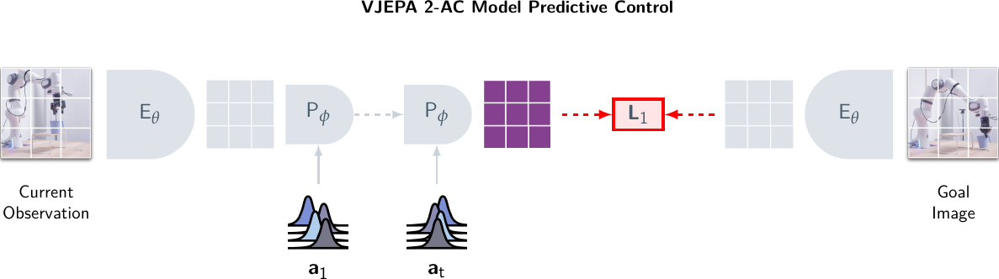

**图 12（Figure 12）: V-JEPA 2 预训练中数据筛选的效果。** 我们展示了模型在 IN1K、COIN、SSv2 和 K400 任务上的平均性能，作为预训练“轮次”（相当于 300 次优化步骤）的函数。使用未经筛选数据和经过筛选数据进行训练的模型，在达到第 600 轮次之前，性能表现相似；此后，使用未经筛选的 YT1B 数据训练的模型性能开始下降。

当采用长训练计划进行这些任务时，我们在 ViT-g（Vision Transformer-g）模型规模上继续观察到 VM22M 与 Mixed+Uncurated YT1B 之间的差异，如 [图 12](#figure-12) 所示，该图比较了模型在 IN1K、COIN、SSv2 和 K400 图像理解任务上的平均性能。最初，两个模型以大致相同的速率改进，但在第 600 轮次后，它们的性能出现分化，其中使用未经筛选数据的模型未能继续改进。

#### 10.4.2 长训练计划与冷却阶段（cooldown）的效果

在 [表 14](#table-14) 中，我们展示了两阶段训练过程的效果。与 [表 13](#table-13) 中的 ViT-g 结果进行比较时，我们发现，在冷却阶段之前， **简化的学习率计划（abbreviated schedule）** 优于 **恒定学习率计划（constant learning rate schedule）** 。主要收益是在冷却阶段实现的，该阶段使用 64 帧进行预训练，并结合了 **逐渐降低的学习率（ramped down learning rate）** 。这带来了超过整整一个百分点的巨大收益，体现在所有评估指标上。

> 表 14（Table 14）: 长训练与冷却阶段的效果。结果报告了在不同分辨率下进行冷却的 ViT-g 模型。

| 训练阶段（Training Stage）             | IN1K | COIN | SSv2 | K400 |
| -------------------------------------- | ---- | ---- | ---- | ---- |
| 阶段 1（第 800 轮，无冷却）            | 83.8 | 89.1 | 75.1 | 85.8 |
| 阶段 2（退火，$256\times 256$ 分辨率） | 84.6 | 90.7 | 75.3 | 86.6 |
| 阶段 2（退火，$384\times 384$ 分辨率） | 85.1 | 90.2 | 76.5 | 87.3 |

#### 10.4.3 评估时视频长度的影响

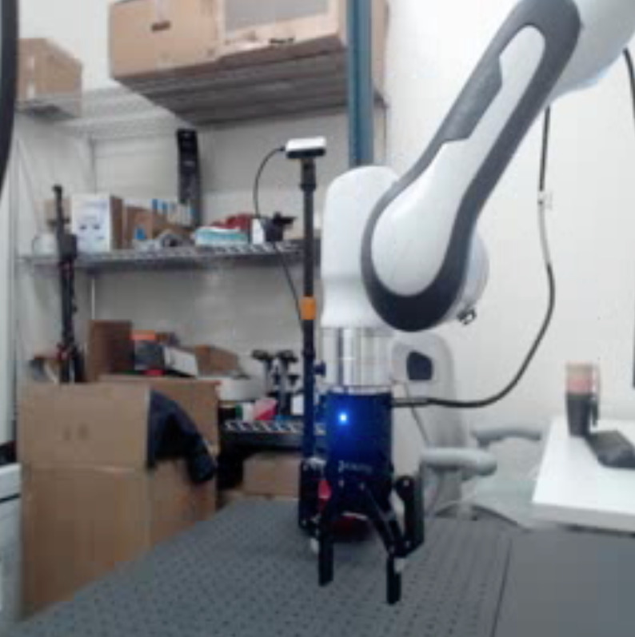

> 图 13（Figure 13）: 评估期间视频时长的影响。通过在更长的视频片段上进行推理，任务性能得到进一步提升。所有评估均使用在 $256\times 256$ 分辨率下用 64 帧进行退火处理的 ViT-g 模型。由于内存限制，结果使用 **单片段评估协议（single clip evaluation protocol）** 报告。在推理时增加处理的帧数，可将平均性能提升高达 $+9.7$ 个百分点。

[图 13](#figure-13) 研究了输入视频时长在评估期间如何影响下游任务性能。使用在 64 帧片段上预训练的模型，我们观察到在评估时将视频时长从 16 帧增加到 64 帧时，平均性能提升了 $+9.7$ 个百分点。请注意，由于内存限制，此消融实验使用了单片段评估协议（即每个视频仅采样一个片段），而不是标准的 **多片段评估（multiclip evaluations）** 。

## 11 V-JEPA 2-AC 后训练（Post-training）

### 11.1 后训练超参数（Post-Training Hyperparameters）

V-JEPA 2-AC 模型使用 **AdamW** （Loshchilov and Hutter, 2017）优化器进行训练，采用 **预热-恒定-衰减（warmup-constant-decay）** 学习率调度，以及 $0.04$ 的恒定权重衰减。
我们在 4500 次迭代中将学习率从 $7.5\times 10^{-5}$ 线性预热至 $4.25\times 10^{-4}$，随后保持恒定 85500 次迭代，最后在 4500 次迭代中将其衰减至 $0$。
我们使用的批处理大小为 $256$，其中包含从 **Droid** 原始数据集的轨迹中随机采样的 4 秒视频片段，帧率为 4 fps。
我们使用 Droid 的 **左外参相机视图（left extrinsic camera views）** 进行训练——也可以使用右相机视图的视频进行训练，但我们发现，在不额外以相机位置为条件的情况下，同时使用左右相机视图进行训练会降低性能。
为简化起见，我们丢弃任何短于 4 秒的视频，最终用于训练的视频时长不足 62 小时。
我们对采样的视频片段应用 **随机缩放裁剪（random-resize-crop）** 数据增强，其宽高比在 (0.75, 1.35) 范围内随机采样。

### 11.2 机器人任务定义（Robot Task Definitions）

[图 14](#figure-14) 展示了 Lab 1 中涉及杯子的 **抓取式操作任务（prehensile manipulation task）** 的起始帧和目标帧示例。
对于 **抓取（grasp）** 和 **持物抵达（reach with object）** 任务，模型会看到一个单一的目标图像。
对于 **拾取与放置（pick-and-place）** 任务，除了最终目标外，我们还会向模型呈现两个子目标图像。
第一个目标图像显示物体被抓住，第二个目标图像显示物体在目标位置附近。
模型首先针对第一个子目标优化动作 4 个时间步，随后自动切换到第二个子目标进行接下来的 10 个时间步，最后针对第三个目标（即最终目标）进行最后 4 个时间步。
在使用 V-JEPA 2-AC 进行规划时，我们使用 800 个样本，基于前一次迭代的前 10 个样本进行 10 次细化步骤，规划视野（planning horizon）为 $1$。
由于所有考虑的任务都相对 **贪婪（greedy）** ，我们发现较短的规划视野足以满足我们的设置。
虽然更长的规划视野也能取得相当不错的效果，但它们需要更多的规划时间。

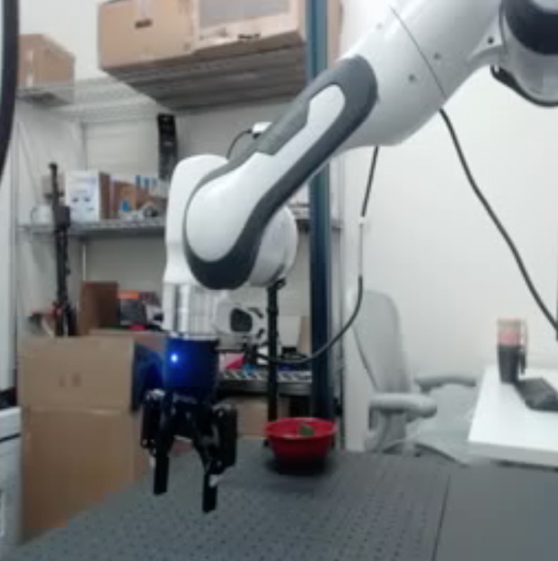

> (a) 抓取杯子（Grasp Cup）

### 11.3 可视化世界模型预测（Visualizing World Model Predictions）

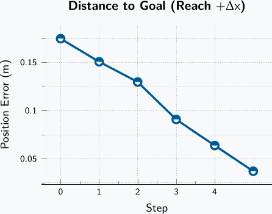

> (a) 将预测准确性与真实轨迹进行比较。（顶行）我们实验室机器人真实轨迹的视频帧。（中间行）每一帧由 V-JEPA 2 编码器编码，然后使用前馈帧解码器解码。V-JEPA 2 表征的重建表明，编码器捕捉到了基于视觉的控制所必需的场景显著部分；模糊的背景生成部分归因于我们前馈帧解码器的低容量。（底行）由 V-JEPA 2-AC 世界模型使用真实动作序列（以第一帧为上下文）产生的自回归推演，然后使用前馈帧解码器解码。V-JEPA 2-AC 推演的重建表明， **动作条件化世界模型（action-conditioned world model）** 成功地让机器人动了起来，同时保持背景和未交互物体（例如架子）不受影响。然而，我们确实观察到了误差累积，因为世界模型预测的杯子位置在最后一帧中略低于真实轨迹中的位置。

为了可视化模型的预测，我们在 Droid 数据集上训练了一个 **帧解码器（frame decoder）** ，它将 V-JEPA 2 的表征映射到人类可理解的像素。
具体来说，我们使用冻结的 V-JEPA 2 视频编码器处理 4 帧片段，使用我们的解码器网络分别解码每一帧，然后使用 **均方误差（L2）像素重建损失（mean-squared error (L2) pixel reconstruction loss）** 更新解码器的权重。
解码器是一个 **前馈网络（feedforward network）** （完全确定性的回归模型，内部不使用任何采样），输出维度为 $256\times 256\times 3$，参数化为一个 **ViT-L** 。
我们使用 AdamW 对解码器进行 150000 次优化步骤的训练，固定权重衰减为 $0.1$，梯度裁剪为 $1.0$，批处理大小为 $1024$ 帧。
我们将学习率在 2000 步内线性预热至峰值 $5\times 10^{-4}$，然后按照余弦调度衰减。
在推理时，我们取在 V-JEPA 2 编码器上训练好的解码器，并将其直接应用于 V-JEPA 2-AC 预测器产生的表征。
之所以仅使用简单的前馈架构并在帧级别（而非视频级别）解码表征，是为了更好地利用解码器作为可解释性工具，来分析 V-JEPA 2-AC 针对一组机器人动作序列的推演。

在[图 15(a)](https://arxiv.org/html/2506.09985v1#S11.F15.sf1)中，我们展示了来自我们实验室机器人的 **真实轨迹（ground-truth trajectory）** 的视频帧（顶行）、每帧解码后的 V-JEPA 2 编码器表示（中行），以及使用真实动作序列和单个起始帧作为上下文解码得到的 V-JEPA 2-AC 世界模型推演（底行）。
V-JEPA 2 表示的重建结果（中行）表明，编码器捕捉到了基于视觉的控制所必需的场景显著部分；模糊的背景生成可以部分归因于我们前馈帧解码器的 **低容量（low-capacity）** 。
V-JEPA 2-AC 推演的重建结果表明， **动作条件化世界模型（action-conditioned world model）** 成功地让机器人动了起来，同时保持了背景和未交互物体（例如架子）不受影响。
我们还看到，在夹爪闭合的情况下，模型正确地预测了杯子随手臂的运动，这表明其对 **直觉物理（intuitive physics）** （例如，物体恒常性、形状恒常性和重力）有合理的理解。但我们确实观察到误差累积，世界模型预测的杯子位置在最后一帧中略低于真实轨迹中的位置。
在[图 15(b)](https://arxiv.org/html/2506.09985v1#S11.F15.sf2)中，我们探究了当使用相同的动作序列驱动模型时，V-JEPA 2-AC 的预测如何变化。一种情况使用闭合的夹爪（顶行），另一种情况使用张开的夹爪（底行）。
当使用张开夹爪的动作序列时，世界模型预测杯子的位置在不同时间步中保持不变。

### 11.4 评估对相机位置的敏感性（Assessing Sensitivity to Camera Position）

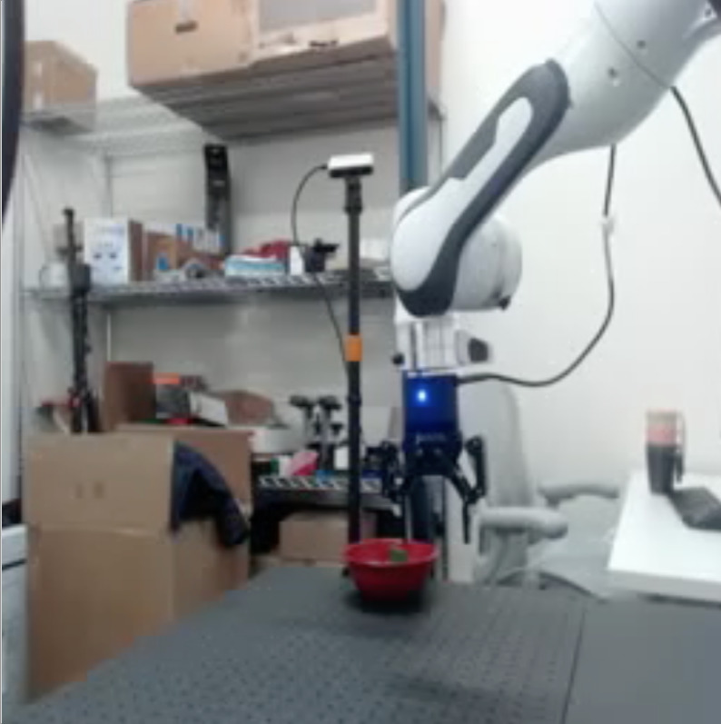

> 图 16 | 对相机位置的敏感性。V-JEPA 2-AC 推断出的动作坐标轴旋转误差（在 x-y 平面内）随相机位置变化的函数，0 度对应位于机器人基座的相机，90 度对应位于机器人基座左侧的相机。理想情况下，模型推断的坐标轴应对相机位置保持不变，但这里我们观察到模型推断的坐标轴对相机位置敏感。

在实践中，我们手动尝试了不同的相机位置，然后选定一个对我们的实验效果最佳的位置；随后，在所有实验和所有任务中，相机都保持在同一位置。
在本节中，我们对 V-JEPA 2-AC 世界模型对相机位置的敏感性进行了定量分析。
理想情况下，模型推断的坐标轴应对相机位置保持不变，但这里我们观察到模型推断的坐标轴对相机位置敏感；这是有问题的，因为推断坐标轴中的大误差会降低下游任务的 **成功率（success rate）** 。

我们围绕机器人基座扫掠了多个相机位置，我们将其描述为围绕桌子中心的顺时针角度位置，其中 0 度位于机器人基座处，90 度位于机器人基座的左侧。
由于我们使用 Droid 数据集中的左侧外中心相机视图进行训练，因此我们扫掠了大约 35 度到 85 度之间的相机位置。
接下来，对于每个相机位置，我们在水平 x-y 平面内收集一段包含 201 个步骤的随机机器人运动轨迹。
对于这段 201 步轨迹中的每一对相邻帧，我们计算由 V-JEPA 2-AC 推断出的最优动作，即在给定一步推演（1-step rollout）的情况下，使方程 ([5](https://arxiv.org/html/2506.09985v1#S3.E5)) 中能量函数最小化的动作。
这使我们能够为每个相机位置构建一个由 **真实动作** 与 **推断动作** 对组成的数据集。
在我们的分析中，我们只关注 $\Delta x$ 和 $\Delta y$ 笛卡尔控制动作（动作向量的前两个维度）。
令 $A\in\mathbb{R}^{200\times 2}$ 表示推断动作，$B\in\mathbb{R}^{200\times 2}$ 表示真实动作。
基于此，我们可以求解一个线性最小二乘问题，以识别将推断动作 $A$ 映射到真实动作 $B$ 的线性变换 $W^{\star}\in\mathbb{R}^{2\times 2}$，

$$
W^{\star}=\underset{W\in\mathbb{R}^{2\times 2}}{\text{argmin}}\ \lVert AW-B \rVert_{2}.
$$

所有相机位置的平均绝对预测误差约为 $1.6$ 厘米（与之相比，真实姿态变化量约为 $5$ 厘米），这表明误差是系统性的。
此外，我们观察到对于每个相机位置，矩阵 $W^{\star}$ 的条件数约为 $1.5$，即，模一个固定的标量系数，$W^{\star}$ 近似为一个旋转矩阵，因此我们可以使用下式计算推断坐标轴中的旋转误差：

$$
W^{\star}\approx\overline{W}^{\star}=\begin{bmatrix}\cos\theta&-\sin\theta\\ \sin\theta&\cos\theta\end{bmatrix},
$$

其中 $\overline{W}^{\star}\coloneq UV^{\top}$，而 $U$ 和 $V$ 分别是 $W^{\star}$ 的左、右奇异向量。

[图 16](#figure-16) 展示了相机位置与 V-JEPA 2-AC 推断坐标轴中旋转误差的关系图。
我们观察到，推断坐标轴中的旋转误差几乎是相机位置的线性函数。
在我们[图 8](#figure-8) 的单目标到达实验中，可以最清楚地看到推断坐标轴中旋转误差的影响。
虽然模型总能基于单目 RGB 相机的视觉反馈将机械臂移动到距离目标 $4$ 厘米的范围内，但推断坐标轴中的旋转误差会导致每个规划步骤的动作相对次优，从而使得每一步到目标的距离虽单调递减，但并非最大程度地减少。

有趣的是，由于推断坐标轴中的误差主要是基于旋转的，因此可以使用这种方法来“校准”其世界模型，只需将所有推断动作旋转 $W^{\star}$，从而引入对相机位置所需的 **不变性（invariance）** 。
这种无监督校准阶段将涉及机器人执行随机动作，通过比较其推断的最优动作与实际执行的动作来求解线性最小二乘问题，然后在任务执行期间将推断动作乘以旋转矩阵后再发送给控制器。
虽然这种方法很有趣，但我们强调，在我们的实验中 **并未进行此类校准** 。

## 12 视觉分类（Visual Classification）

我们将更详细地描述用于 [第 5 节](#section-5) 中所述分类任务的评估流程。

### 12.1 超参数（Hyperparameters）

##### 探针架构（Probe Architecture）。

我们使用每个下游任务的训练数据，在冻结的编码器输出之上训练一个 **注意力探针（attentive probe）** 。我们的注意力探针由四个 **Transformer块（transformer blocks）** 组成，每个块的注意力层使用 16 个头。前三个块使用标准的 **自注意力（self-attention）** ；最后一个块使用一个带有可学习查询令牌的 **交叉注意力层（cross-attention layer）** 。在应用该块的其余部分（层归一化（LayerNorm），后接具有单个 GeLU 激活的 **多层感知机（Multilayer Perceptron, MLP）** ）之前，最后一个块中交叉注意力层的输出会作为 **残差连接（residual connection）** 加回到查询令牌上。Transformer块之后是一个最终的线性分类器层。

##### 评估设置参数（Evaluation setup parameters）。

所有模型都遵循相同的评估协议，并使用 $256\times 256$ 的分辨率，除了我们的 V-JEPA 2 ViT-g384。对于视频评估，我们从每个输入视频中采样多个片段。在验证期间，我们还从每个片段中提取三个空间视图（而不是训练期间的一个视图）。片段数量、帧步长参数和全局批大小因每次评估而异；每次评估使用的参数可在 [表 15](#table-15) 中找到。默认情况下，我们为 SSv2 使用 $16\times 2\times 3$ 的输入（16 帧片段，2 个时间裁剪，3 个空间裁剪），为 K400 使用 $16\times 8\times 3$，为 COIN 使用 $32\times 8\times 3$，为 Diving-48 和 Jester 使用 $32\times 4\times 3$。V-JEPA 2 ViT-g384 对 K400、COIN、Diving-48 和 Jester 使用更高的 $384\times 384$ 分辨率，对 ImageNet 使用 $512\times 512$，对 SSv2 使用 $384\times 384$ 分辨率和 $64\times 2\times 3$ 的输入。

##### ImageNet 评估（ImageNet evaluation）。

对于 ImageNet，我们重复每个输入图像以生成一个 16 帧的视频片段。我们还使用更大的全局批大小（1024，而不是 256 或 128），并且每个样本不使用多个片段或视图。

##### Jester 和 Diving-48 评估（Jester and Diving-48 evaluation）。

我们的 Jester 和 Diving-48 动作分类评估任务在几个方面与其他理解评估不同，主要在于我们采用了 **多层策略（multilayer strategy）** 。我们不是仅关注编码器最后一层的令牌，而是从四个编码器层（最后一层和三个中间层）提取令牌，并关注所有这些令牌。（[表 16](#table-16) 显示了我们为每种编码器大小使用的层。）我们还为这两个评估训练探针，但只使用三个分类头（而不是其他评估的 20 个），并训练 100 个周期（而不是 20 个），因为这些评估受益于更长的训练。我们对这两个评估都使用 128 的全局批大小。

##### 优化（Optimization）。

对于每次评估，我们同时训练具有不同超参数（学习率和权重衰减）的多个分类器头，并报告性能最佳的分类器的准确率。对于我们的大多数评估（Kinetics、SSv2、COIN 和 ImageNet），我们训练 20 个周期并使用 20 个头，每个头使用五个学习率值之一和四个权重衰减值之一，并且学习率根据余弦调度衰减。我们在 [表 15](#table-15) 中提供了所有超参数的摘要。

> 表 15：视觉分类评估参数。用于视觉分类评估的默认参数，以及每次评估的非默认值（\* 表示默认值）。所有注意力探针都使用 4 个具有 16 个头的 Transformer 块。

| 参数              | 默认值（K400）             | ImageNet | SSv2 | COIN | Jester/Diving-48 |
| ----------------- | -------------------------- | -------- | ---- | ---- | ---------------- |
| 帧数              | 16                         | 16       | 16   | 32   | 32               |
| 片段数 / 视频片段 | 8                          | 1        | 2    | 8    | 4                |
| 视图数 / 片段     | 3                          | 1        | \*   | \*   | \*               |
| 帧步长            | 4                          | n/a      | \*   | \*   | 2                |
| 训练轮数          | 20                         | \*       | \*   | \*   | 100              |
| 批次大小（全局）  | 256                        | 1024     | \*   | 128  | 128              |
| 分辨率            | $256\times 256$            | \*       | \*   | \*   | \*               |
| 分类器头数        | 20 (4x5)                   | \*       | \*   | \*   | 3 (3x1)          |
| 分类器学习率      | [5e-3 3e-3 1e-3 3e-4 1e-4] | \*       | \*   | \*   | [1e-3 3e-4 1e-4] |
| 分类器权重衰减    | [.8 .4 .1 .01]             | \*       | \*   | \*   | [.8]             |

> 表 16 | Jester/Diving-48 的输入层。对于每种编码器大小，列出了在 Jester 和 Diving-48 评估中，其令牌被用作线性分类器输入的四个编码器层的索引。

| 编码器 | 层数 |   被关注的层   |
| :----: | :--: | :------------: |
| ViT-L  |  24  | 17, 19, 21, 23 |
| ViT-H  |  32  | 25, 27, 29, 31 |
| ViT-g  |  40  | 24, 29, 34, 39 |

### 12.2 Additional Results（补充结果）

##### Probe Size（探针大小）

由于我们在这些评估中使用了一个四层注意力探针（attentive probe），我们研究了使用更小的探针是否会影响评估性能。我们使用一个更小的探针重新运行了我们的六项理解评估（针对两种模型大小，ViT-L 和 ViT-g），该探针由单个使用 16 个注意力头（attention heads）的交叉注意力块（cross-attention block）组成。与 [第 5 节](#section-5) 不同，我们在所有评估（包括 Diving-48 和 Jester）中都使用 16 帧。分类性能见 [表 18](#table-18)——我们确认，在所有理解评估中（Jester 除外），我们的四层探针均优于单层注意力探针，对于 ViT-L 平均准确率高出 $+1.4$ 个百分点，对于 ViT-g 平均高出 $+1.0$ 个百分点。

##### Impact of encoder multilayer（编码器多层的影响）

我们研究了在评估期间，将来自编码器多个层的令牌（tokens）馈送到注意力探针的影响。[表 17](#table-17) 显示，Diving-48 和 Jester 强烈受益于编码器更深层的信息。

> 表 17 | 编码器多层消融实验。我们改变了馈送到注意力探针的编码器层数。我们报告了在 V-JEPA 2 之上训练的、使用 16 帧和 $256\times 256$ 分辨率的注意力探针的分类性能。

| 模型  | 编码器层数 | Diving-48 | Jester |
| :---: | :--------: | :-------: | :----: |
| ViT-g |     1      |   82.9    |  96.1  |
| ViT-g |     4      |   86.7    |  97.6  |

> 表 18 | 探针大小消融实验。我们改变了注意力探针中的层数。我们报告了在 V-JEPA 2 之上训练的、使用 16 帧和 $256\times 256$ 分辨率的注意力探针的分类性能。

| 模型  | 探针层数 | 平均 | 运动理解 | 外观理解  |        |      |      |      |
| :---: | :------: | :--: | :------: | :-------: | :----: | :--: | :--: | :--: |
|       |          |      |   SSv2   | Diving-48 | Jester | K400 | COIN | IN1K |
| ViT-L |    1     | 84.0 |   72.0   |   83.2    |  97.7  | 83.3 | 85.9 | 81.8 |
| ViT-L |    4     | 85.6 |   73.6   |   87.1    |  97.7  | 85.1 | 86.8 | 83.5 |
| ViT-g |    1     | 86.0 |   74.8   |   85.3    |  97.8  | 85.6 | 88.9 | 83.5 |
| ViT-g |    4     | 87.0 |   75.6   |   86.7    |  97.6  | 86.6 | 90.7 | 84.6 |

## 13 动作预测（Action Anticipation）

我们提供与[第 6 节](#section-6)中 Epic-Kitchen 100 动作预测评估相关的更多细节、结果和消融实验。

### 13.1 超参数（Hyperparameters）

##### 探针架构（Probe Architecture）。

我们的动作预测探针架构遵循[第 12.1 节](#section-12-1)中描述的分类探针架构，由四个 **Transformer块（Transformer blocks）** 组成，其中包括一个带有 **一组可学习的查询词元（a set of learnable query tokens）** 的最后一个 **交叉注意力层（cross-attention layer）** ，随后是为每个查询词元设置的最终 **线性分类器层（linear classifier layer）** 。

##### 评估设置参数（Evaluation setup parameters）。

在训练探针时，我们使用 **焦点损失（Focal Loss）** (Lin et al., 2017)，其中 $\alpha=0.25$ 且 $\gamma=2.0$；该损失函数更适用于处理 **长尾不平衡类别分布（long-tailed imbalanced class distributions）** 的训练。
对于 V-JEPA 2 ViT-L、ViT-H 和 ViT-g 模型，我们使用 32 帧的上下文，帧率为每秒 8 帧，分辨率为 $256\times 256$；对于 V-JEPA 2 ViT-g384 模型，分辨率为 $384\times 384$。
在探针训练期间，我们随机采样一个介于 $0.25$ 到 $1.75$ 秒之间的 **预测时间（anticipation time）** ，以及一个介于 $0.0$ 到 $0.25$ 之间的 **预测点（anticipation point）** 。
*预测点*标识了动作片段中用于执行预测的起始点；例如，预测点为 0.0 意味着我们在将动作片段输入探针之前，使用 V-JEPA 2 预测器来预测该动作片段第一帧的表征；而预测点为 $1$ 则意味着我们预测动作片段最后一帧的表征，然后再将其输入探针。
验证时的预测时间设置为 1 秒，验证预测点设置为 0.0。
我们在[表 19](#table-19) 中提供了包括优化参数在内的超参数汇总。

> 表 19: 动作预测评估参数。用于 EK100 动作预测评估的默认参数。

| 参数（Parameter）                         | EK100                      |
| :---------------------------------------- | :------------------------- |
| 训练预测时间（Train Anticipation time）   | 0.25s – 1.75s              |
| 训练预测点（Train Anticipation point）    | 0.0 – 0.25                 |
| 验证预测时间（Val Anticipation time）     | 1s                         |
| 验证预测点（Val Anticipation point）      | 0.0                        |
| 帧数（Number of frames）                  | 32                         |
| 每秒帧数（Frames per second）             | 8                          |
| 训练轮数（Epochs）                        | 20                         |
| 预热轮数（Warmup epochs）                 | 0                          |
| 全局批量大小（Batch Size (global)）       | 128                        |
| 分类器头数（Classifier Heads）            | 20 (4x5)                   |
| 分类器学习率（Classifier Learning Rates） | [5e-3 3e-3 1e-3 3e-4 1e-4] |
| 分类器权重衰减（Classifier Weight Decay） | [1e-4 1e-3 1e-2 1e-1]      |

### 13.2 补充结果（Additional results）

##### 架构的影响（Impact of Architecture）。

[表 20](#table-20) 研究了向动作预测探针提供 V-JEPA 2 **编码器（encoder）** 、 **预测器（predictor）** 或两者输出的影响。仅使用编码器输出已经在 EK100 任务上取得了有竞争力的性能。添加预测器在动作、动词和物体类别上均带来了虽小但一致的性能提升。此外，单独使用预测器输出也能产生一定的性能，但与使用编码器相比仍处于低得多的水平，这表明 EK100 任务主要需要强大的 **语义理解（semantic understanding）** 能力，而非 **预测能力（forecasting capabilities）** 。

> 表 20 | EK100： **动作预期探针（Action Anticipation Probe）** 输入的影响。我们研究了向动作预期探针提供 V-JEPA 2 编码器、预测器或两者的输出所产生的影响。仅使用编码器输出已在 EK100 任务上取得了有竞争力的性能。添加预测器可在动作、动词和物体类别上带来虽小但一致的改进。

|        |        | 动作预期 |      |      |
| ------ | ------ | -------- | ---- | ---- |
| 编码器 | 预测器 | 动词     | 名词 | 动作 |
| ✓      |        | 61.3     | 57.0 | 39.1 |
|        | ✓      | 48.7     | 34.7 | 20.2 |
| ✓      | ✓      | 63.6     | 57.1 | 39.7 |

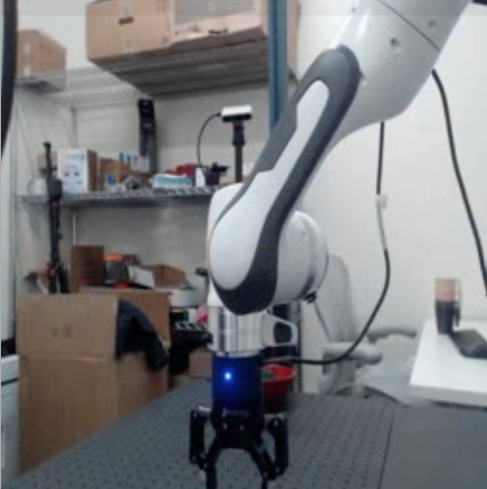

> 图 17 | EK100 上动作预期的协议消融研究。（左）性能与用于动作预期的上下文帧数量的关系。（中）性能与用于推理的帧率（fps）的关系；上下文帧数量固定为 32。（右）性能与用于动作预期的上下文帧空间分辨率（高度和宽度）的关系。

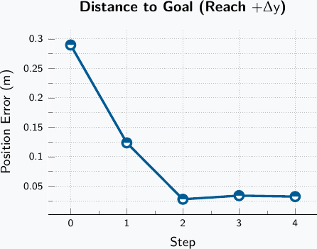

> 图 18 | （左）：更长期预期时间的影响。在多个召回值和预期时间下，EK100 动作预期的性能。（右）：V-JEPA 2 成功与失败案例的分布。基于 EK100 验证集计算。VNA 表示动词、名词和动作均被模型正确分类。X 符号表示模型未能正确分类相应属性。注：该探针由三个独立的动词、名词和动作分类器组成，因此模型对动作的预测可能与对动词/名词对的预测不同。

##### **输入分辨率的影响（Impact of Input Resolution）**

我们在 [图 17](#figure-17) 中报告了输入分辨率和帧采样参数的影响。总之，V-JEPA 2 受益于更长的上下文、更高的帧率和更高的分辨率，直到性能达到饱和或略有下降。通过在训练中使用 32 帧的上下文长度、8 的帧率和 $384\times 384$ 的分辨率，可以获得最佳性能。

##### **更长期预测（Longer-term Prediction）**

我们在 [图 18](#figure-18)（左）中报告了在更长预测时间范围上的影响，通过将预期时间在（1秒，2秒，4秒，10秒）之间变化。对于每个预期时间，我们报告了在多个召回值（1，5，10，20）下的性能。结果表明，随着预期时间的增加，性能急剧下降，这是预期的，因为在 EK100 中预测未来是一项非确定性任务。

##### **失败案例分析（Analysis of Failure Cases）**

我们在 [图 18](#figure-18)（右）中报告了在 EK100 验证集上，动词、名词和动作每种成功/失败配置之间，预测失败和成功的分布情况。模型表现非常好，因此最具代表性的配置是动词、名词和动作全部成功。最具代表性的失败配置都包含未能找到动作的情况。

## 14 视频问答（Video Question Answering）

在本节中，我们将详细介绍如何训练一个基于 **V-JEPA 2** 的 **多模态大语言模型（Multi-modal Large Language Model, MLLM）** 。我们遵循 **LLaVA 框架（LLaVA framework）** （Liu et al., 2024a）来训练 MLLM，其中视觉主干网络使用 V-JEPA 2，而语言主干网络可以是任何现成的预训练 LLM，类似于 **非词元化早期融合（non-tokenized early fusion）** （Wadekar et al., 2024）的设置。MLLM 接收视觉编码器的输出嵌入，这些嵌入通过一个投影器模块被映射到语言主干网络的隐藏维度。该投影器通常是一个 **2层多层感知机（2-layer MLP）** 。MLLM 使用一系列渐进式训练步骤，混合图像-文本和视频-文本配对数据进行训练。

为了理解数据规模的影响，我们使用了一个包含 8850 万对图像-文本和视频-文本的数据集，类似于用于训练 **PerceptionLM** （Cho et al., 2025）的数据集。如 [第 7 节](#section-7) 所述，我们研究了两种设置：(a) **受控设置（controlled）** ，即使用 1800 万对图像和视频-文本进行训练，并在完全相同的 MLLM 训练设置下评估 V-JEPA 2 和其他编码器；(b) **扩展设置（scaling）** ，即使用 V-JEPA 2 VITg384 模型并利用完整的对齐数据集。
为了进一步测试 V-JEPA 2 的通用性，我们在受控实验中使用 **Qwen2-7B-Instruct** （Yang et al., 2024a）作为语言主干网络，在扩展实验中使用 **Llama 3.1 8B Instruct** （Grattafiori et al., 2024）作为语言主干网络。我们将在以下小节中描述训练细节。

### 14.1 处理图像和视频作为输入（Processing Images and Videos as Input）

由于视频问答使用视频而非图像作为输入，与图像问答相比，输出的视觉词元数量显著增加。如果需要，我们可以使用 **池化方法（pooling methods）** 来减少视觉词元的数量。常用的池化方法包括 **自适应 2x2 池化（adaptive 2x2 pooling）** （Cho et al., 2025）、 **感知器采样器（Perceiver Sampler）** （Jaegle et al., 2021）、 **注意力池化（Attentive Pooling）** （Bardes et al., 2024）等。

此外，我们观察到，从图像-文本对中学习对于在下游基准测试中取得高性能至关重要。为了使用图像进行训练，一种简单的方法是将给定图像重复 $k$ 帧，其中 $k$ 是 V-JEPA 2 支持的最大帧数。然而，在我们的初步实验中，我们发现这种策略对于提升下游性能效果不佳，因为它不允许模型提取细粒度信息。
因此，我们采用了 Liu 等人（2024d）引入的改进版 **Dynamic $S^{2}$ 策略（Dynamic $S^{2}$ strategy）** ，以便在训练期间为 V-JEPA 2 提供更高的分辨率粒度。该方法通过创建一系列 V-JEPA 2 支持的最大尺寸的图块，自适应地以不同宽高比处理图像的原生分辨率，从而保留其原始分辨率。
对于视频，我们选择使用固定的帧数 $f_{n}$ 进行训练，以平衡视觉词元数量与计算预算。

### 14.2 受控设置（Controlled Setup）

##### **训练细节（Training details）**

在受控实验设置中，我们遵循 **LLaVA-NEXT 框架（LLaVA-NEXT framework）** (Liu et al., 2024a; Zhang et al., 2024b)，使用 **Qwen2-7B-Instruct** (Yang et al., 2024a) 作为所有编码器的 **基础大型语言模型（Base Large Language Model, Base LLM）** 。
为了减少视觉词元（Visual tokens）的数量，我们采用了一个 **注意力池化器（Attentive pooler）** ，其池化因子在 4 到 16 之间，具体取决于计算预算和视觉补丁（Visual patches）的数量。更多细节参见 [表 21](#table-21)。

我们的训练设置遵循 **LLaVA-NeXT 流程（LLaVA-NeXT pipeline）** (Li et al., 2024b)，该流程包含多个分阶段的训练。具体阶段包括：a) 使用图像描述数据对齐注意力池化器（阶段 1），b) 在高质量图像描述数据上训练完整模型（阶段 1.5），以及 c) 在大规模图像问答数据上训练完整模型（阶段 2）。我们额外增加了一个阶段，用于在大规模视频描述和问答数据上进行训练（阶段 3）。
我们使用了 1800 万条图像和视频-文本对齐数据。
经过多阶段训练后， **大型语言模型（LLM）** 对视觉词元的理解逐步提升，其中在阶段 3 之后，视频问答任务的提升最为显著。

我们探索了 **冻结（Frozen）** 和 **微调（Finetuned）** 两种编码器对齐设置。
在这两种设置中， **大型语言模型（LLM）** 和 **投影器（Projector）** 的所有参数都会被训练；在后一种设置中， **V-JEPA 2** 的参数也会被解冻并进行训练。
为了减少视觉词元的数量并保持 **多模态大型语言模型（Multimodal Large Language Model, MLLM）** 的上下文长度固定，我们采用注意力池化器作为投影器，将视觉词元数量减少为原来的 1/4（除非另有说明）。
本受控研究使用的实现基于 **Llava-NEXT 代码库** [44](https://github.com/LLaVA-VL/LLaVA-NeXT)，并分别使用 **PyTorch 2.5.1** 、 **Transformers 4.46.0** 、 **Flash Attention 2** 和 **DeepSpeed 0.14.4** 进行模型实现、加速训练和多 GPU 模型分片。我们使用 128 块 **H100 GPU** 训练所有模型，所有阶段的有效批次大小（Effective batch size）均为 256。所有优化均使用 **AdamW** 优化器，权重衰减（Weight decay）设为 0。对于阶段 1 和 1.5，我们使用学习率为 1e-5 并采用余弦衰减（Cosine decay）；对于阶段 2 和 3，我们使用恒定的学习率 5e-6。在所有阶段中，我们在前 3% 的训练步数中使用线性预热（Linear warmup）。
训练超参数列于 [表 21](#table-21)。

##### **基线模型（Baselines）**

为了评估 **V-JEPA 2** 在 **视频问答（Video Question Answering, VidQA）** 任务中捕捉时空细节的能力，我们将其与领先的现成图像编码器进行比较。具体而言，我们与 **DINOv2** (Oquab et al., 2023)、 **SigLIP2** (Tschannen et al., 2025) 和 **Perception Encoder** (Bolya et al., 2025) 进行比较。DINOv2 是一个自监督图像模型，而 SigLIP2 和 Perception Encoder 都是使用带噪声的图像-文本描述进行语言监督训练的。我们对所有图像编码器均在其“原生”预训练分辨率下独立应用于每个视频帧，分辨率分别为 518 像素、384 像素和 448 像素。

我们保持所有训练细节相同，但将注意力池化比率增加到 16，以保持各模型间的图像词元数量相对接近。详情参见 [表 21](#table-21)。

> 表 21 | 视觉编码器受控比较的超参数。我们使用每个视觉编码器时，均采用其原生的预训练输入分辨率。

| 模型（Model）     | 池化比例（Pooling Ratio） | 视觉词元（Vision Tokens） | 批次大小（BS） | 阶段 1/1.5 学习率（Stage 1/1.5 LR） | 阶段 2/3 学习率（Stage 2/3 LR） | 权重衰减（WD） | 帧数（Frames） |
| ----------------- | ------------------------- | ------------------------- | -------------- | ----------------------------------- | ------------------------------- | -------------- | -------------- |
| V-JEPA 2 ViT-L256 | 4                         | 4096                      | 256            | 1e-5                                | 5e-6                            | 0.0            | 128            |
| V-JEPA 2 ViT-H256 | 4                         | 4096                      | 256            |                                     |                                 |                |                |
| V-JEPA 2 ViT-g256 | 4                         | 4096                      | 256            |                                     |                                 |                |                |
| V-JEPA 2 ViT-g384 | 4                         | 9216                      | 256            |                                     |                                 |                |                |
| V-JEPA 2 ViT-g512 | 8                         | 8192                      | 256            |                                     |                                 |                |                |
| DINOv2 518        | 16                        | 10952                     | 256            | 1e-5                                | 5e-6                            | 0.0            | 128            |
| SigLIP 384        | 16                        | 5832                      | 256            |                                     |                                 |                |                |
| PE 448            | 16                        | 8192                      | 256            |                                     |                                 |                |                |

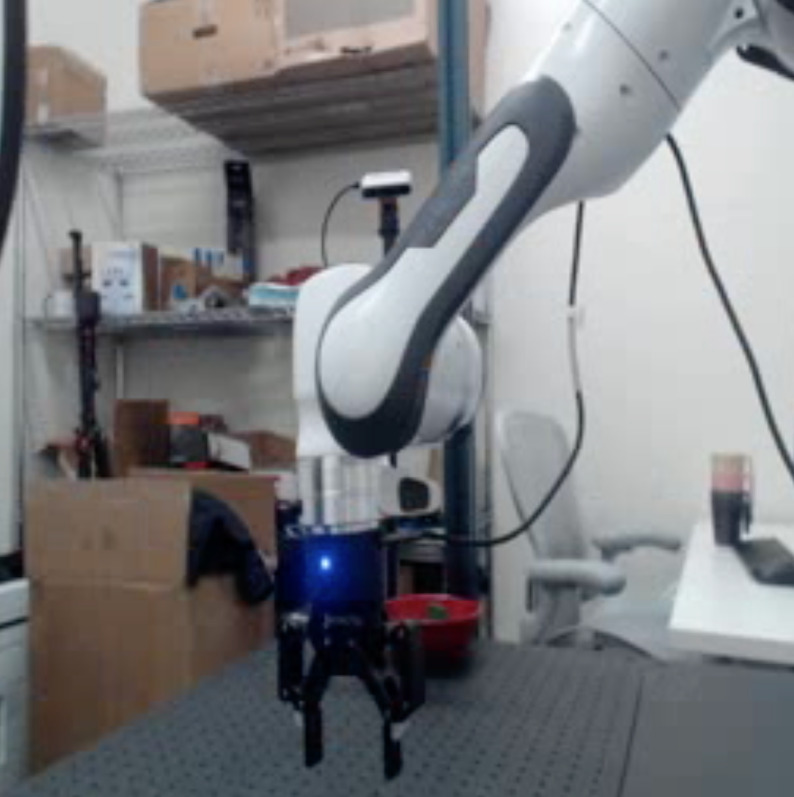

> 图 19 | 视觉指令微调期间视频时长的影响。我们研究了在视觉指令微调期间增加帧数的影响，此时编码器被冻结。我们观察到，与基于自监督学习（Self-Supervised Learning, SSL）的图像编码器 DINOv2 相比，随着帧数增加，V-JEPA 2 的性能呈线性提升，这表明 V-JEPA 2 具有随帧数增加而扩展的潜力。

##### 评估（Evaluation）

为了评估 V-JEPA 2 通过视频和语言理解世界的能力，我们选择了为测试时空推理能力而构建的流行评估数据集。
为确保评估的可复现性，我们利用 lmms-eval 库（Li et al., 2024a; Zhang et al., 2024a）进行实验，该库是 llm-eval-harness（Gao et al., 2024）的一个支持视觉模型的分支，而后者是用于评估大型语言模型（Large Language Models, LLMs）在基于文本任务上表现的流行评估库。
在受控设置下，对于每个模型和数据集，我们通过使用均匀帧采样机制，并在推理时选择 128 帧进行评估。
对于 PerceptionTest 数据集，我们在其训练集上进一步训练模型 5 个轮次（epochs）。

##### 视频时长的影响（Impact of Video Duration）

在受控设置下，我们进行了一项分析，以了解 V-JEPA 2 在长视频理解方面的能力。我们在 V-JEPA 2 和 DINOv2 上训练多模态大语言模型（Multimodal Large Language Models, MLLMs），保持编码器冻结，并通过增加训练和测试中使用的帧数。
我们观察到，随着帧数增加，V-JEPA 2 在下游任务上的性能线性提升，但在 DINOv2 的情况下，性能下降并保持平稳（[图 19](#figure-19)）。
这凸显了诸如 V-JEPA 2 这样的视频编码器，通过将 V-JEPA 2 作为视觉编码器来适配一个 LLM，从而理解带有自然语言查询的长视频的潜力。

### 14.3 数据扩展设置（Data scaling setup）

> 表 22：数据扩展训练参数。

| 参数（Parameter）                       | 值（Values）    |
| --------------------------------------- | --------------- |
| 通用参数（Common parameters）           |                 |
| 裁剪尺寸（Crop Size）                   | 384             |
| 视频帧率（Video Frames per Second）     | 1               |
| 采样方法（Sampling method）             | 均匀（Uniform） |
| 随机种子（Seed）                        | 777             |
| 阶段 1（Stage 1）                       |                 |
| 步数（Steps）                           | 16000           |
| 预热步数（Warmup Steps）                | 96              |
| 批次大小（全局）（Batch Size (global)） | 128             |
| 学习率（Learning Rate）                 | 1e-4            |
| 最终学习率（Final Learning Rate）       | 1e-6            |
| 权重衰减（Weight Decay）                | 0.05            |
| 最大序列长度（Max sequence length）     | 1920            |
| 阶段 2（Stage 2）                       |                 |
| 步数（Steps）                           | 35000           |
| 预热步数（Warmup Steps）                | 200             |
| 批次大小（全局）（Batch Size (global)） | 2048            |
| 学习率（Learning Rate）                 | 4e-5            |
| 最终学习率（Final Learning Rate）       | 4e-7            |
| 权重衰减（Weight Decay）                | 0.05            |
| 最大序列长度（Max sequence length）     | 6400            |
| 图像分块数（Image tiles）               | 16              |
| 视频帧数（Video frames）                | 16              |
| 阶段 3（Stage 3）                       |                 |
| 步数（Steps）                           | 28000           |
| 早停步数（Early stopping step）         | 22000           |
| 预热步数（Warmup Steps）                | 168             |
| 批次大小（全局）（Batch Size (global)） | 2048            |
| 学习率（Learning Rate）                 | 1e-5            |
| 最终学习率（Final Learning Rate）       | 1e-7            |
| 权重衰减（Weight Decay）                | 0.05            |
| 最大序列长度（Max sequence length）     | 12800           |
| 图像分块数（Image tiles）               | 32              |
| 视频帧数（Video frames）                | 32              |

##### 训练细节（Training details）

在扩展设置中，我们遵循 Cho 等人（2025）[1] 用于训练 **Perception LM 8B** 的框架。具体而言，我们利用基于 **Lingua** （Videau 等人，2024）[2] 的开源代码库。我们修改了代码以使用 **V-JEPA 2** 编码器，并采用 **Llama 3.1 8B Instruct** （Grattafiori 等人，2024）[3] 作为骨干 **大型语言模型（Large Language Model, LLM）** 。与 Cho 等人（2025）[1] 不同，我们不使用池化（pooling）操作，而是使用 **多层感知机投影器（Multilayer Perceptron projector, MLP projector）** 来训练 **V-JEPA 2 VIT-g384** ，这导致每帧产生 288 个 **词元（tokens）** 。训练设置同样包含三个渐进阶段：

- **阶段 1** ：使用图像描述数据对齐 MLP 池化器。
- **阶段 2** ：在图像-文本描述和问答（Question Answering, QA）数据的混合集上进行训练。
- **阶段 3** ：在视频-文本描述和问答数据上进行训练。

我们将数据规模扩展至 8850 万个样本。
我们的设置使用了 **PyTorch 2.5.1** 和 **Perception LM** 训练代码 [^5^55](https://github.com/facebookresearch/perception_models/tree/main)，并集成了 **V-JEPA 2** 编码器。我们在 512 块 **H100 GPU** 上进行训练，阶段 2 和阶段 3 的全局批次大小分别为 2048 和 1024。训练超参数的详细信息见 [表 22](#table-22)。

##### 基线模型（Baselines）

我们将我们的扩展训练结果与 **Qwen2VL** （Wang 等人，2024a）[4]、 **Qwen2.5VL** （Qwen Team 等人，2025）[5]、 **InternVL-2.5** （Chen 等人，2024）[6] 以及 **PerceptionLM 8B** （Cho 等人，2025）[1] 进行比较。基线数据除 **MVP** 外均直接引自各论文，MVP 的结果由我们自己运行得出。

##### 评估（Evaluation）

我们遵循与受控设置中报告的类似评估流程，使用 **lmms-eval** 库。
我们报告了模型在 32 帧上的评估结果。

[^5^55]: https://github.com/facebookresearch/perception_models/tree/main
