# 在可扩展世界模型中训练智能体（Training Agents Inside of Scalable World Models）

**世界模型（World models）** 从视频中学习通用知识，并在想象中模拟经验以训练行为，为通向智能体（Intelligent agents）提供了一条路径。然而，先前的研究表明，世界模型无法准确预测复杂环境中的物体交互。我们介绍了 **Dreamer 4** ，这是一个可扩展的智能体，它通过在一个快速且准确的世界模型内部进行 **强化学习（Reinforcement Learning）** 来学习解决控制任务。在复杂的视频游戏《我的世界（Minecraft）》中，该世界模型能够准确预测物体交互和游戏机制，其性能远超以往的世界模型。该世界模型通过一个 **捷径强制目标（shortcut forcing objective）** 和一个高效的 **Transformer 架构（Transformer architecture）** ，在单个 GPU 上实现了实时交互式推理。此外，该世界模型仅从少量数据中就能学习通用的 **动作条件化（action conditioning）** ，使其能够从多样化的无标签视频中提取大部分知识。我们提出了仅使用离线数据在《我的世界》中获取钻石的挑战，这与机器人学等实际应用场景相符，因为在那些场景中，通过与环境交互进行学习可能不安全且缓慢。这项任务需要从原始像素中，选择超过 20,000 个鼠标和键盘动作的序列。通过在想象中学习行为， **Dreamer 4 成为首个纯粹从离线数据中、无需环境交互就在《我的世界》中获取钻石的智能体** 。我们的工作为想象训练提供了一个可扩展的方案，标志着向智能体迈进了一步。

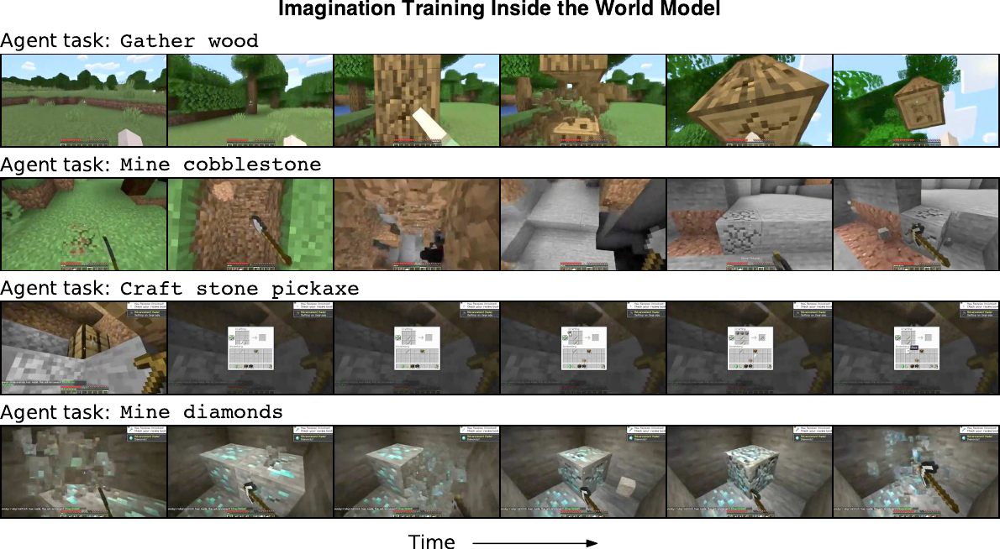

> 图 4 | Dreamer 4 通过在其世界模型内部进行强化学习来学习解决复杂的控制任务。我们对想象的训练序列进行解码以进行可视化，结果表明该世界模型已经学会了从低层级的鼠标和键盘动作中模拟广泛的游戏机制，包括破坏方块、使用工具以及与工作台交互。

# 引言（Introduction）

为了在具身环境中解决复杂任务，智能体需要深刻理解世界并选择成功的行动。 **世界模型（World models）** 为实现这一目标提供了一种有前景的途径，它通过学习从智能体（如机器人或视频游戏玩家）的视角预测潜在行动的未来结果。通过这种方式，世界模型赋予智能体对世界的深刻理解，以及通过在想象中进行规划或 **强化学习（Reinforcement Learning）** 来选择行动的能力。此外，世界模型原则上可以从固定数据集中学习，从而允许纯粹在想象中训练智能体，而无需在线交互。离线优化行为对于许多实际应用（例如物理世界中的机器人）非常有价值，因为与部分训练的智能体进行在线交互通常是不安全的。

诸如 Dreamer 3 这样的世界模型智能体，是迄今为止在游戏和机器人领域表现最佳、最稳健的强化学习算法之一 [@dreamerv3; @wu2023daydreamer; @hansen2023tdtmpc2; @alonso2024diffusion; @schrittwieser2019muzero; @hessel2021muesli]。虽然这些模型在其特定环境中快速且准确，但其架构缺乏拟合复杂真实世界分布的能力。可控视频模型，例如 Genie 3，已经在多样化的真实视频和游戏上进行了训练，并实现了多样化的场景生成和简单交互 [@genie3; @tu2025playerone; @he2025matrix; @sun2025virtual; @bai2025whole; @team2025yan]。这些模型基于可扩展的架构，例如 **扩散变换器（Diffusion Transformers）** [@peebles2023dit; @diffusionforcing]。然而，它们仍然难以学习物体交互和游戏机制的精确物理规律，这限制了它们在训练成功智能体方面的实用性。此外，它们通常需要许多 GPU 来实时模拟单个场景，进一步降低了它们在想象训练中的实用性。

我们提出了 **Dreamer 4** ，一个通过在快速且准确的世界模型内部进行想象训练来解决控制任务的可扩展智能体。Dreamer 4 是首个 **仅从标准离线数据集** 中、无需环境交互，就在具有挑战性的视频游戏《我的世界（Minecraft）》中获得钻石的智能体。Dreamer 4 利用一种新颖的 **捷径强制目标（shortcut forcing objective）** 和一个高效的 **变换器（Transformer）** 架构，能够准确学习复杂的物体交互，同时支持实时人机交互和高效的想象训练。我们展示了该世界模型能够准确预测《我的世界》中广泛的语义交互，大幅超越了以往的世界模型。此外，Dreamer 4 可以在大量未标记视频上进行训练，并且仅需要少量与动作配对的视频。这为未来从多样化的网络视频中学习通用世界知识开辟了可能性，而这些视频通常没有动作标签。

我们的贡献总结如下：

- 我们提出了 Dreamer 4，一个通过在世界模型内部进行想象训练来学习解决具有挑战性控制任务的可扩展智能体。
- Dreamer 4 是首个仅从离线数据中就在《我的世界》中收集到钻石的智能体，尽管使用的数据量比 OpenAI 的 VPT 离线智能体 [@vpt] 少 100 倍，但性能仍有显著提升。
- 我们引入了一个高容量的世界模型，它通过捷径强制目标和一个高效的变换器架构，在单个 GPU 上实现了实时推理。
- 我们展示了该世界模型能够准确预测《我的世界》中广泛的物体交互和游戏机制，大幅超越了以往的世界模型。
- 我们展示了该世界模型可以从未标记视频中学习，并且仅需要少量对齐数据即可学习具有强泛化能力的动作条件化。
- 一项广泛的消融研究衡量了目标和架构带来的改进。

# 背景（Background） {#sec:background}

## **流匹配（Flow matching）**

我们的世界模型基于 **扩散模型（Diffusion models）** [@sohl2015deep; @ddpm] 的范式，其中网络 $f_\theta$ 被训练用于在给定被破坏的版本 $x_\tau$ 时，恢复数据点 $x_1$。信号水平 $\tau\in [0, 1]$ 决定了噪声与数据的混合比例，并在训练过程中随机化，其中 $\tau=0$ 对应纯噪声，$\tau=1$ 表示干净数据。我们基于 **流匹配（Flow matching）** 公式 [@flowmatching; @rectifiedflow]，因其简洁性，其中网络预测指向干净数据的速度向量 $v = x_1 - x_0$：

$$
\begin{aligned}
x_\tau= (1 - \tau)\,x_0 + \tau\,x_1 \qquad
x_0 \sim \operatorname{N}(0, \mathbb{I}) \qquad
x_1 \sim \mathcal{D} \qquad
\tau\sim p(\tau) \\
\mathcal{L}(\theta) = \| f_\theta(x_\tau,\tau) - (x_1 - x_0) \|^2
\end{aligned}
$$

信号水平通常从均匀分布或 logit-正态分布中采样 [@sd3]。在推理时，采样过程从一个纯噪声向量 $x_0$ 开始，通过步长 $d = 1/K$ 的 $K$ 个采样步骤迭代地将其转换为干净数据点 $x_1$：

$$
\begin{aligned}
x_{\tau+d} = x_\tau+ f_\theta(x_\tau,\tau)\,d\qquad
x_0 \sim \operatorname{N}(0, \mathbb{I})
\end{aligned}
$$

## **捷径模型（Shortcut models）**

捷径模型 [@shortcut] 不仅将信号水平 $\tau$ 作为神经网络的输入条件，还将请求的步长 $d$ 也作为条件。这使得它们能够在推理时选择步长，并仅使用少量采样步骤和神经网络的前向传递来生成数据点。对于最精细的步长 $d_\mathrm{min}$，捷径模型使用流匹配损失进行训练。对于更大的步长 $d_\mathrm{min}<d\leq 1$，捷径模型使用一个 **自举损失（Bootstrap loss）** 进行训练，该损失通过蒸馏两个更小的步骤得到，其中 $\operatorname{sg}(\cdot)$ 表示停止梯度：

$$
\begin{aligned}
x_0 \sim \operatorname{N}(0, \mathbf{I}) \qquad
x_1 \sim \mathcal{D} \qquad
\tau,d\sim p(\tau,d) \\
b' = f_\theta(x_\tau,\tau,d/2) \qquad
b'' = f_\theta(x',\tau+d/2,d/2) \qquad
x' = x_\tau+ b'\,d/2 \\
\mathcal{L}(\theta) = \| f_\theta(x_\tau,\tau,d) - v_\mathrm{target} \|^2
\qquad
v_\mathrm{target} = \begin{cases}
x_1 - x_0 &\text{if} d=d_\mathrm{min}  \\
\operatorname{sg}(b' + b'')/2 &\text{else}
\end{cases}
\end{aligned}
$$

步长基于最大采样步数 $K_\mathrm{max}$ 以 2 的幂次均匀采样，这定义了最精细的步长 $d_\mathrm{min}=1/K_\mathrm{max}$。信号水平在当前步长所能到达的网格上均匀采样：

$$
\begin{aligned}
d\sim 1/\operatorname{U}(\{1, 2, 4, 8, \dots, K_{\mathrm{max}}\}) \qquad
\tau\sim \operatorname{U}(\{0, 1/d, \dots, 1 - 1/d\})
\end{aligned}
$$

在推理时，可以将模型条件化为步长 $d=1/K$，以针对 $K$ 个采样步骤，而不会遭受离散化误差，因为模型已经学会了预测每个步骤的终点。在实践中，捷径模型仅用 2 或 4 个采样步骤就能生成高质量样本，而典型的扩散模型则需要 64 步或更多。

## **扩散强制（Diffusion forcing）**

对于序列数据， **扩散强制（Diffusion forcing）** [@diffusionforcing] 为数据序列的每个时间步分配不同的信号水平，从而产生一个被破坏的序列。这使得可以将损失项应用于序列中的所有时间步，其中每个时间步既作为去噪任务，也作为后续时间步的历史上下文。在推理时，扩散强制支持灵活的噪声模式，例如在给定干净或轻微噪声历史的情况下生成下一帧。

# World Model Agent（世界模型智能体）

我们提出了 Dreamer 4，一个可扩展的智能体，它通过在快速且准确的世界模型内部进行强化学习（Reinforcement Learning）来学习解决复杂的控制任务。如图 [2](#fig:model) 所示，该智能体由一个分词器（Tokenizer）和一个动力学模型（Dynamics Model）组成。分词器将视频帧压缩为连续的表征（Representation），而动力学模型则在给定交错排列的行动序列后预测这些表征，两者都使用相同的高效 Transformer 架构。分词器使用掩码自编码（Masked Autoencoding）进行训练，而动力学模型则使用捷径强制（Shortcut Forcing）目标进行训练，以实现仅需少量前向传播（Forward Pass）的交互式生成，并防止误差随时间累积。如 [公式 alg:agent](#alg:agent) 所述，我们首先在视频和行动数据上预训练分词器和世界模型，然后通过交错插入任务嵌入（Task Embedding）将策略模型和奖励模型微调进世界模型中，最后通过想象训练对策略进行后训练。为了训练一个包含多种模态（Modality）和多个输出头的单一动力学 Transformer，我们通过其均方根（Root-Mean-Square, RMS）的运行估计值对所有损失项进行归一化。

<figure>
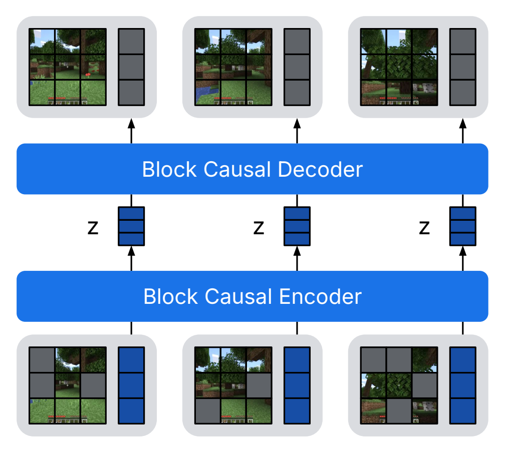
<figcaption>因果分词器（Causal Tokenizer）</figcaption>
</figure>

<figure>
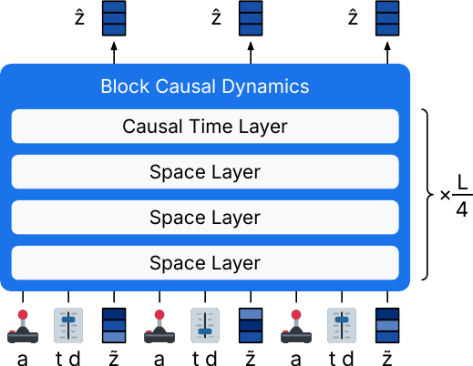
<figcaption>交互式动力学（Interactive Dynamics）</figcaption>
</figure>

> 世界模型设计。Dreamer 4 由一个因果分词器和一个交互式动力学模型组成，两者都使用相同的块因果（Block-Causal）Transformer 架构。分词器对部分掩码的图像块（Image Patch）和潜在标记（Latent Token）进行编码，通过一个带有 tanh 激活函数的低维投影对潜在表征进行压缩，然后解码出图像块。它使用因果注意力（Causal Attention）来实现时间压缩，同时允许逐帧解码。动力学模型处理交错排列的行动序列、捷径噪声水平（Shortcut Noise Level）与步长（Step Size）以及分词器表征。它通过捷径强制目标对表征进行去噪。预训练后，通过将任务标记（Task Token）插入动力学 Transformer 并从中预测行动、奖励和价值，将世界模型微调为一个智能体。

> Algorithm 1 Dreamer 4

- **阶段 1：世界模型预训练**
  - 使用 [公式 eq:tok](#eq:tok) 在视频上训练分词器（Tokenizer）。使用 [公式 eq:dyn](#eq:dyn) 在分词后的视频（及可选的行动数据）上训练世界模型。
- **阶段 2：智能体微调**
  - 使用 [公式 eq:dyn](#eq:dyn) 和 [公式 eq:bcrm](#eq:bcrm)，通过插入任务输入，将世界模型微调为包含策略（Policy）头和奖励（Reward）头的智能体。
- **阶段 3：想象训练**
  - 在世界模型和策略头生成的轨迹上，使用 [公式 eq:pol](#eq:pol) 优化策略头，并使用 [公式 eq:val](#eq:val) 优化价值（Value）头。

## 因果分词器（Causal Tokenizer） {#sec:tokenizer}

分词器将原始视频压缩为一组连续的序列表征，供动力学模型使用和生成。它由一个编码器（Encoder）和一个解码器（Decoder）组成，中间有一个瓶颈层（Bottleneck）。两个组件在时间上都是因果的（Causal），这使其能够在实现时间压缩的同时，保持为交互式推理（Interactive Inference）而逐帧解码的能力。

**架构**

我们使用后文描述的高效 Transformer 架构。每个时间步（Time Step）由当前图像的块标记（Patch Token）和习得的潜在标记（Learned Latent Token）组成。应用编码器后，通过一个线性投影（Linear Projection）将表征从潜在标记中读出到一个更小的通道维度，然后经过一个 `tanh` 激活函数。对于解码器，该表征被投影回模型维度，并与习得的标记拼接以读出图像块。为了在有多种输入模态可用时灵活地整合它们，编码器允许潜在标记关注（Attend）所有模态，而每个模态只关注自身内部。相应地，每个解码器模态关注自身内部以及潜在标记，而潜在标记只关注自身内部。

**掩码自编码（Masked Autoencoding）**

我们使用一个直接的重构目标来训练分词器，该目标由均方误差（Mean Squared Error）和 LPIPS [@lpips] 损失组成。为了简化这两个损失项的权重设置，我们采用了后文解释的损失归一化（Loss Normalization）方法。

$$
\begin{aligned}
\mathcal{L}(\theta) =
\mathcal{L}_{\mathrm{MSE}}(\theta) +
0.2\,\mathcal{L}_{\mathrm{LPIPS}}(\theta)

\end{aligned}
$$

我们对编码器的输入 **图像块（patches）** 进行 **丢弃（dropout）** ，以利用 **掩码自编码（Masked Autoencoding, MAE）** [@mae; @chen2025maetok] 来改进其表征。丢弃概率在图像间随机设定为 $p \sim U(0, 0.9)$。每个图像的图像块以该概率被替换为一个可学习的嵌入，这样 **分词器（tokenizer）** 有时会在推理时使用的 $p=0$ 情况下进行训练。我们发现 MAE 训练能提高 **动力学模型（dynamics model）** 所生成视频的空间一致性。

## 交互式动力学（Interactive Dynamics） {#sec:dynamics}

动力学模型在由冻结的分词器产生的动作与表征的交错序列上运行。它使用 **捷径强制（shortcut forcing）** 目标进行训练，以实现快速的交互式推理，每生成一帧只需 $K=4$ 次前向传播。

**架构（Architecture）**

动力学模型在我们高效的 **Transformer 架构（transformer architecture）** 上处理观测和动作的交错块。表征被线性投影为 $S_\mathrm{z}$ 个 **空间词元（spatial tokens）** ，并与 $S_\mathrm{r}$ 个可学习的 **寄存器词元（register tokens）** [@vitregister] 以及一个用于 **捷径信号水平（shortcut signal level）** 和 **步长（step size）** 的单一词元进行拼接。由于信号水平和步长是离散的，我们使用离散嵌入查找对每个进行编码，并拼接它们的通道。动作可以包含多个组件，例如鼠标和键盘。我们将每个动作组件分别编码为 $S_\mathrm{a}$ 个词元，并将结果与一个可学习的嵌入相加。连续动作组件被线性投影，而分类或二元组件则使用嵌入查找。在训练未标记视频时，仅使用可学习的嵌入。

**捷径强制（Shortcut forcing）**

为了高效的训练和推理，我们使用捷径强制目标来训练动力学模型，该目标建立在 **扩散强制（diffusion forcing）** [@diffusionforcing] 和 **捷径模型（shortcut models）** [@shortcut] 的基础上，在 [2](#sec:background) 节中进行了回顾。我们在数据空间中制定目标，以防止由高频网络输出引起的误差累积，并引入一个简单的损失权重，将模型容量集中在具有最强学习信号的损失项上。动力学模型以动作 $a=\{a_t\}$、离散信号水平 $\tau=\{\tau_t\}$、步长 $d=\{d_t\}$ 以及 **污染表征（corrupted representations）** $\tilde{z}=\{z_t^{(\tau_t)}\}$ 的交错序列作为输入，并预测 **干净表征（clean representations）** $z_1=\{z_t^1\}$。注意，$t \in [1,T]$ 是序列时间步，而 $\tau_t \in [0, 1]$ 是该步的信号水平。

$$
\begin{aligned}
z_0 \sim \operatorname{N}(0, \mathbf{1}) \qquad
z_1 \sim \mathcal{D} \qquad
\tau, d\sim p(\tau, d) \qquad
\tau, d\in [0, 1]^T \\
\hat{z}_1 = f_\theta(\tilde{z},\tau,d,a) \qquad
\tilde{z} = (1-\tau)\,z_0 + \tau\,z_1
\end{aligned}
$$

捷径模型将网络参数化为预测 **速度（velocities）** $v = x_1 - x_0$，称为 **v-预测（v-prediction）** [@kingma2023understanding]。这种方法在将输出作为一个整体块生成时表现出色，例如用于图像或视频生成模型。然而，v-预测训练网络产生高频输出。当逐帧迭代生成长视频时，这可能导致微妙的误差随时间累积。相反，我们发现将网络参数化为预测干净表征，称为 **x-预测（x-prediction）** ，能够实现任意长度的高质量 **推演（rollouts）** 。在 x-空间中计算 **流损失项（flow loss term）** 是直接的 [@kingma2023understanding]。为了计算 **引导损失项（bootstrap loss term）** ，我们将网络输出转换为 v-空间，并将得到的损失缩放回 x-空间[^1]：

$$
\begin{aligned}
\mathcal{L}(\theta) =
\mathcal{L}_{\mathrm{MSE}}(\theta) +
0.2\,\mathcal{L}_{\mathrm{LPIPS}}(\theta)
\end{aligned}
$$

我们对编码器的输入 **图像块（patches）** 进行 **丢弃（dropout）** ，以利用 **掩码自编码（Masked Autoencoding, MAE）** [@mae; @chen2025maetok] 来改进其表征。丢弃概率在图像间随机设定为 $p \sim U(0, 0.9)$。每个图像的图像块以该概率被替换为一个可学习的嵌入，这样 **分词器（tokenizer）** 有时会在推理时使用的 $p=0$ 情况下进行训练。我们发现 MAE 训练能提高 **动力学模型（dynamics model）** 所生成视频的空间一致性。

## 交互式动力学（Interactive Dynamics） {#sec:dynamics}

动力学模型在由冻结的分词器产生的动作与表征的交错序列上运行。它使用 **捷径强制（shortcut forcing）** 目标进行训练，以实现快速的交互式推理，每生成一帧只需 $K=4$ 次前向传播。

**架构（Architecture）**

动力学模型在我们高效的 **Transformer 架构（transformer architecture）** 上处理观测和动作的交错块。表征被线性投影为 $S_\mathrm{z}$ 个 **空间词元（spatial tokens）** ，并与 $S_\mathrm{r}$ 个可学习的 **寄存器词元（register tokens）** [@vitregister] 以及一个用于 **捷径信号水平（shortcut signal level）** 和 **步长（step size）** 的单一词元进行拼接。由于信号水平和步长是离散的，我们使用离散嵌入查找对每个进行编码，并拼接它们的通道。动作可以包含多个组件，例如鼠标和键盘。我们将每个动作组件分别编码为 $S_\mathrm{a}$ 个词元，并将结果与一个可学习的嵌入相加。连续动作组件被线性投影，而分类或二元组件则使用嵌入查找。在训练未标记视频时，仅使用可学习的嵌入。

**捷径强制（Shortcut forcing）**

为了高效的训练和推理，我们使用捷径强制目标来训练动力学模型，该目标建立在 **扩散强制（diffusion forcing）** [@diffusionforcing] 和 **捷径模型（shortcut models）** [@shortcut] 的基础上，在 [2](#sec:background) 节中进行了回顾。我们在数据空间中制定目标，以防止由高频网络输出引起的误差累积，并引入一个简单的损失权重，将模型容量集中在具有最强学习信号的损失项上。动力学模型以动作 $a=\{a_t\}$、离散信号水平 $\tau=\{\tau_t\}$、步长 $d=\{d_t\}$ 以及 **污染表征（corrupted representations）** $\tilde{z}=\{z_t^{(\tau_t)}\}$ 的交错序列作为输入，并预测 **干净表征（clean representations）** $z_1=\{z_t^1\}$。注意，$t \in [1,T]$ 是序列时间步，而 $\tau_t \in [0, 1]$ 是该步的信号水平。

$$
\begin{aligned}
z_0 \sim \operatorname{N}(0, \mathbf{1}) \qquad
z_1 \sim \mathcal{D} \qquad
\tau, d\sim p(\tau, d) \qquad
\tau, d\in [0, 1]^T \\
\hat{z}_1 = f_\theta(\tilde{z},\tau,d,a) \qquad
\tilde{z} = (1-\tau)\,z_0 + \tau\,z_1
\end{aligned}
$$

捷径模型将网络参数化为预测 **速度（velocities）** $v = x_1 - x_0$，称为 **v-预测（v-prediction）** [@kingma2023understanding]。这种方法在将输出作为一个整体块生成时表现出色，例如用于图像或视频生成模型。然而，v-预测训练网络产生高频输出。当逐帧迭代生成长视频时，这可能导致微妙的误差随时间累积。相反，我们发现将网络参数化为预测干净表征，称为 **x-预测（x-prediction）** ，能够实现任意长度的高质量 **推演（rollouts）** 。在 x-空间中计算 **流损失项（flow loss term）** 是直接的 [@kingma2023understanding]。为了计算 **引导损失项（bootstrap loss term）** ，我们将网络输出转换为 v-空间，并将得到的损失缩放回 x-空间[^1]：

$$
\begin{aligned}
\end{aligned}
$$

$$
\begin{aligned}
b' &= (f_\theta(\tilde{z},\tau,\textstyle\frac{d}{2},a) - z_\tau)/(1-\tau) \qquad
z' = \tilde{z} + b'\,\textstyle\frac{d}{2}\\
b'' &= (f_\theta(z',\tau+\textstyle\frac{d}{2},\textstyle\frac{d}{2},a) - z')/(1-(\tau+\textstyle\frac{d}{2}))
\end{aligned} \\
\mathcal{L}(\theta) = \begin{cases}
\|\hat{z}_1 - z_1\|_2^2 &\text{if} d=d_\mathrm{min} \\
(1-\tau)^2 \| (\hat{z}_1-\tilde{z})/(1-\tau) - \operatorname{sg}(b_1 + b_2)/2  \|_2^2 &\text{else} \\
\end{cases}
$$

低信号水平包含的学习信号较少，因为 **流匹配（Flow Matching）** 项会退化为预测数据集均值，而 **引导（Bootstrap）** 项通常更容易优化，因为与含噪声的流匹配项相比，它具有确定性的目标。为了将模型容量集中在具有最多学习信号的信号水平上，我们提出了一种 `ramp` 损失权重，该权重随信号水平 $\tau$ 线性增加，其中 $\tau=0$ 对应完全噪声，$\tau=1$ 对应干净数据：

$$
\begin{aligned}
w(\tau) = 0.9 \tau+ 0.1
\end{aligned}
$$

在推理时，动力学模型支持不同的噪声模式。我们按时间自回归采样，并使用 **捷径模型（Shortcut Model）** 生成每一帧的表征，采样步数 $K=4$，对应步长 $d=1/4$。我们将动力学模型的过去输入轻微破坏至信号水平 $\tau_\mathrm{ctx}=0.1$，以使模型对其生成中的微小缺陷具有鲁棒性。

## **想象训练（Imagination Training）**

为了解决控制任务，我们首先调整预训练的世界模型，使其能够根据多个任务中的一个，从数据集中预测动作和奖励。为此，我们将 **智能体词元（Agent Tokens）** 作为额外的模态插入到世界模型的 **变换器（Transformer）** 中，并将其与图像表征、动作和 **寄存器词元（Register Tokens）** 交错排列。智能体词元接收任务嵌入作为输入，我们使用它们通过 **多层感知器（Multi-Layer Perceptron, MLP）** 头来预测策略和奖励模型。虽然智能体词元可以关注自身和所有其他模态，但其他模态不能反过来关注智能体词元。这对于避免世界模型的 **因果混淆（Causal Confusion）** 至关重要——其未来预测只能直接受动作影响，而不能受当前任务影响。为了超越数据集中展示的策略，我们随后通过 **强化学习（Reinforcement Learning）** 在世界模型生成的 **推演（Rollouts）** 上进行想象训练，并使用一个额外的价值头来微调策略。

### **行为克隆与奖励模型（Behavior cloning and reward model）**

在基于动作条件的视频预测对世界模型进行预训练之后，第二个训练阶段涉及学习一个任务条件的策略和奖励模型。给定一个视频数据集 $x=\{x_t\}$，其被编码为表征 $z=\{z_t\}$，以及动作 $a=\{a_t\}$、任务 $q=\{q_t\}$ 和标量奖励 $r=\{r_t\}$，我们使用长度为 $L=8$ 的 **多词元预测（Multi-Token Prediction, MTP）** [@gloeckle2024mtp] 在任务输出嵌入 $h_t$ 上训练策略头和奖励头：

$$
\begin{aligned}
\mathcal{L}(\theta) =
- \sum_{n=0}^{L} \langle \ln p_\theta \rangle (a_{t+n} | h_t)
- \sum_{n=0}^{L} \langle \ln p_\theta \rangle (r_{t+n} | h_t)
\end{aligned}
$$

为了保留现有能力，我们在这种额外的损失函数下重用预训练设置，因此表征是带噪声的，并且我们继续应用视频预测损失。我们使用小型 MLP 来参数化策略头和奖励头，每个 MTP 距离对应一个输出层。遵循 Dreamer 3，奖励头被参数化为一个 **对称指数双热点输出（Symexp Twohot Output）** [@dreamerv3]，以便在不同数量级上鲁棒地学习随机奖励。策略头根据数据集的 **动作空间（Action Space）** 被参数化为 **分类分布（Categorical Distribution）** 或 **向量化二元分布（Vectorized Binary Distribution）** 。

### **强化学习（Reinforcement learning）**

为了改进策略，使其超越数据集中展示的行为，我们继续在想象的推演上使用强化学习对其进行训练，以最大化学习到的奖励模型。与需要与环境交互的 **在线强化学习（Online Reinforcement Learning）** 不同，我们的策略完全在世界模型内部学习，使其能够 **离线（Offline）** 改进。我们初始化一个价值头和一个冻结的策略头副本，后者作为 **行为先验（Behavioral Prior）** 。我们只更新策略头和价值头，并保持变换器冻结。[^2] 想象的推演从早期训练阶段使用的数据集的上下文开始。与 Dreamer 的前几代不同，我们只从每个上下文开始一个推演，优先考虑数据多样性并减少内存消耗。推演是通过变换器自身展开生成的，从流头采样表征 $z=\{z_t\}$，从策略头采样动作 $a=\{a_t\}$。我们使用奖励头为生成的轨迹标注奖励 $r=\{r_t\}$，并使用价值头标注价值 $v=\{v_t\}$。

**价值头（Value head）** 被训练用于预测未来奖励的折扣总和，使得策略能够最大化超出想象视野的奖励。它使用一种 **symexp twohot** 输出，以在不同量级的价值范围内进行鲁棒学习 [@dreamerv3]。我们使用时序差分学习（Temporal Difference Learning, TD-learning）[@sutton1988td] 来训练价值头，以预测根据序列中预测的奖励和价值计算出的 $\lambda$-回报（$\lambda$-returns），其中 $\gamma=0.997$ 是折扣因子，$c_t$ 表示非终止状态：

$$
\begin{aligned}
\mathcal{L}(\theta) = -\sum_{t=1}^T \ln p_\theta(R^\lambda_t | s_t)
\qquad
R^\lambda_t = r_t + \gamma c_t \big((1-\lambda)v_t + \lambda R^\lambda_{t+1}\big)
\qquad
R^\lambda_T = v_T

\end{aligned}
$$

与之前的 Dreamer 版本不同， **策略头（Policy head）** 使用 **PMPO（PMPO）** [@abdolmaleki2024pmpo] 进行学习，这是一种鲁棒的强化学习目标，它利用优势（Advantage） $A_t = R^\lambda_t-v_t$ 的符号而忽略其大小。这一特性减少了对回报或优势进行归一化的需求，并确保了对所有任务给予同等关注，尽管它们的回报尺度可能不同。PMPO 通过分别对具有正优势和负优势的状态计算简单最大似然损失的平均值，来平衡对正反馈和负反馈的关注。我们将批次和时间维度上所有想象的状态 $s_i$ 分配到正集 $\mathcal{D}^+=\{s_i \mid A_t \geq 0\}$ 或负集 $\mathcal{D}^-=\{s_i \mid A_t < 0\}$，并应用以下策略损失：

$$
\begin{aligned}
\mathcal{L}(\theta) &=
\frac{1-\alpha}{|\mathcal{D}^-|} \sum_{i \in \mathcal{D}^-}  \ln p<pi_\theta>(a_i|s_i)
-\frac{\alpha}{|\mathcal{D}^+|} \sum_{i \in \mathcal{D}^+} \ln p<pi_\theta>(a_i|s_i)
+\frac{\beta}{N} \sum_{i=1}^N \operatorname{KL}[p<pi_\theta>(a_i|s_i)\,\|\,pi_\mathrm{prior}] \\

\end{aligned}
$$

我们设定 $\alpha=0.5$ 以平等地平衡正负集，并为行为先验（Behavioral prior）使用一个较弱的尺度 $\beta=0.3$。与原始的 PMPO 目标不同，我们对先验 KL 散度使用了反向方向，以更好地将策略约束在合理行为的空间内。我们发现，这三个目标项之间的尺度在实践中具有高度鲁棒性，因为它们都以奈特（nats）[@shannon1948infotheory] 为单位进行度量。

## **高效 Transformer（Efficient Transformer）**

将世界模型扩展到多样化的数据分布，同时保持快速推理，需要一个高效的高容量架构。在本节中，我们将介绍用于分词器（Tokenizer）和动力学模型（Dynamics model）的高效 Transformer 架构。该架构是一个具有时间和空间维度的 **2D Transformer（2D Transformer）** [@vaswani2017transformer]。为了支持交互式生成，注意力被掩码为时间因果的，使得一个时间步内的所有词元（Token）可以相互关注并关注过去。我们从标准的 Transformer 开始，采用了层前 **RMSNorm（RMSNorm）** [@rmsnorm]、 **RoPE（RoPE）** [@rope] 和 **SwiGLU（SwiGLU）** [@swiglu]。我们使用 **QKNorm（QKNorm）** [@dehghani2023scaling] 和注意力对数软上限（Attention logit soft capping）[@bello2016neural; @gemma2] 来提高训练稳定性。

**效率（Efficiency）**

块因果 Transformer 架构的推理速度同时受到 MLP 的浮点运算次数（FLOPs）以及访问长上下文 KV 缓存（KV cache）所需的内存带宽的限制。我们采用了一系列改进措施来加速推理，其中一些也加速了训练。首先，我们通过使用独立的仅空间注意力层和仅时间注意力层 [@axial]，来分解对所有视频词元进行密集注意力的成本。其次，我们发现只需要相对较少数量的时间层，并且每 4 层才使用一次时间注意力，这与最近的发现一致 [@llama4]。第三，我们将 **GQA（GQA）** [@gqa] 应用于动力学模型中的所有注意力层，其中多个查询头（Query head）关注相同的键值头（Key-value head），以进一步减少 KV 缓存的大小。

**序列长度（Sequence length）**

增加空间词元直接提高了视觉质量，而增加时间词元则允许训练更长的上下文长度，以实现时间上更一致的生成。为了支持高效训练，我们交替使用许多短批次和偶尔的长批次进行训练，之后仅使用长批次对模型进行微调。交替批次长度产生的中间训练指标和生成结果，比仅使用短批次训练更能指示最终模型的性能。批次长度需要长于模型的上下文长度，以防止 Transformer 过拟合于总是在其上下文开头看到起始帧，从而实现长度泛化到任意生成长度。

# 实验（Experiments）

![ 无环境交互时智能体在《我的世界》（Minecraft）中的性能。所有方法均可访问相同的承包商数据集 [@vpt]，该数据集包含图像输入以及低级别的鼠标和键盘动作。我们报告了在 1000 次实验周期中计算得出的、在随机生成世界且初始库存为空的情况下，60 分钟实验周期内获得重要物品的成功率。 **通过利用想象训练（imagination training），Dreamer 4 是首个纯粹依靠离线经验在《我的世界》中获得钻石的智能体** 。Dreamer 4 在使用数据量减少 100 倍的情况下，性能大幅超越了 OpenAI 的 VPT 离线智能体 [@vpt]。它还优于我们的 VLA 智能体 [@kim2024openvla; @intelligence2025pi05]（该智能体利用了 Gemma 3 视觉语言模型 [@team2025gemma3] 的通用知识），将制作铁镐的成功率提高了近三倍。](figures/rl/rl){#fig:rl width="\\linewidth"}

我们进行了广泛的实验，以评估和探索 Dreamer 4 的能力。我们的大部分实验集中在《我的世界》（Minecraft）上，这是一款复杂的视频游戏，具有无限的开放世界，包含怪物和数百种可挖掘或制作的物品，观测输入为原始像素，动作为低级别的鼠标和键盘操作。我们主要使用 VPT 数据集 [@vpt]，该数据集包含 2541 小时的承包商游戏录像，视频分辨率为 360p，鼠标和键盘动作记录频率为 20 FPS。这些实验旨在回答以下问题：

- Dreamer 4 是否能够 **纯粹通过在内部世界模型（world model）中进行想象训练，无需在线环境交互，就学会解决具有挑战性的控制任务？** （[4.1](#sec:control){reference-type="ref+Label" reference="sec:control"}）
- 与之前的世界模型相比，Dreamer 4 在预测《我的世界》中准确的物体交互和游戏机制方面表现如何？（[4.2](#sec:interact){reference-type="ref+Label" reference="sec:interact"}）
- Dreamer 4 需要多少动作数据来学习动作条件化（action conditioning），并且学习到的动作基础（action grounding）能推广到何种程度？（[4.3](#sec:actgen){reference-type="ref+Label" reference="sec:actgen"}）
- 其目标和架构的每个组成部分对 Dreamer 4 的性能有多大贡献？（[4.4](#sec:modeldesign){reference-type="ref+Label" reference="sec:modeldesign"}）

我们在 256 到 1024 个 TPU-v5p 上训练模型，模型参数量为 20 亿（2B）——其中分词器（tokenizer）占 4 亿（400M），动态模型（dynamics model）占 16 亿（1.6B）——每个设备的批次大小为 1，并采用 FSDP 分片技术 [@fsdp; @deepspeed]。为了改进无上下文（without context）的生成，我们将批次中 30% 的视频视为单独的图像，从而有效地训练动态模型生成起始帧。对于《我的世界》，我们使用 256 个空间标记（spatial tokens），上下文长度为 192 帧，批次长度为 256。对于真实世界数据集，我们使用 512 个空间标记，上下文长度为 96 帧，批次长度为 128。

## 离线钻石挑战（Offline Diamond Challenge） {#sec:control}

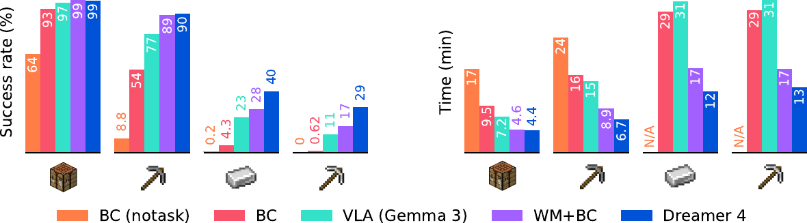

> 图 5：离线钻石挑战中的智能体消融研究（Agent ablations）。我们报告了获取四个里程碑物品的成功率以及所需时间。Dreamer 4 在这两项指标上都优于基于行为克隆（behavioral cloning）的方法，表明想象训练提高了策略的鲁棒性和效率。此外，使用世界模型表征进行行为克隆，其效果优于使用 Gemma 3 或从头开始训练。

我们在《我的世界》钻石挑战中评估 Dreamer 4，这是一个长视野（long-horizon）控制任务，需要在由原始像素、鼠标和键盘动作构成的复杂程序化生成的 3D 世界中解决若干子任务，例如收集材料和制作工具。有《我的世界》经验的人类玩家平均需要 20 分钟收集一颗钻石，这对应于 24,000 个鼠标和键盘动作序列。

**离线设置（Offline setting）**

尽管先前的智能体（Agents）已通过与环境进行在线交互在《我的世界》（Minecraft）中实现了获取钻石的目标 [@vpt; @dreamerv3]，但在实际应用（如物理机器人）中部署部分训练的策略通常并不可行，因为确保安全、重置场景以及实时提供奖励都很困难。因此，我们专注于 **从固定的经验数据集中进行纯离线学习（purely offline learning）** 这一挑战。我们仅使用 VPT 承包商数据集（VPT contractor dataset）[@vpt]——该数据集包含 2500 小时的视频、动作和事件标注——而不允许智能体与环境交互进行学习，并在此离线设置下与基线进行比较。我们遵循 VPT 的评估协议，使用原始像素输入和低层级的鼠标与键盘动作，要求通过游戏内用户界面进行合成。每个回合（Episode）持续 60 分钟，从随机生成的《我的世界》世界中空物品栏开始。

**实现（Implementation）**

Dreamer 4 学习一个单一的 **变换器（Transformer）** ，用于预测输入、动作、奖励和价值。为了构建一个可引导的智能体，我们选择了一个 **多任务设置（multi-task setting）** ，并将动作、奖励和价值以任务嵌入（Task embeddings）为条件。我们使用 VPT 数据集中现有的事件来标注任务及其稀疏的二元奖励。表 1（tab:mc_tasks）列出了 20 个任务，表 2（tab:mc_ladder）展示了在环境评估期间引导智能体获取钻石的线性提示序列。为了在行为克隆（Behavioral cloning）、奖励建模（Reward modeling）和强化学习（Reinforcement learning）过程中放大数据集中的信号，我们使用了 50% 均匀序列（Uniform sequences）和 50% 完成其中一项任务的相关序列（Relevant sequences）的数据混合。行为克隆损失仅应用于相关部分，而动态损失仅应用于均匀序列，以避免生成过于乐观的结果。我们使用独热编码（One-hot）任务指示符，但也可以轻松使用文本嵌入。我们使用 **中央凹离散化（Foveated discretization）** [@vpt] 将键盘动作表示为 23 个二元分布，将鼠标动作表示为具有 121 个类别的分类分布。

我们比较了以下智能体：

- **VPT (finetuned)** ：文献中针对鼠标和键盘控制的最强《我的世界》智能体 [@vpt]。VPT 论文在离线设置中提出了两个无条件的 **行为克隆策略（Behavioral cloning policies）** ，均在 27 万小时经过合成标注的 YouTube 游戏视频上训练，其中一个还在经过筛选的“早期游戏”数据子集上进行了微调。我们使用微调后的策略，因为它显著优于预训练策略。
- **BC (notask)** ：使用 **多词元预测（Multi-token prediction, MTP）** 从头开始进行行为克隆，无任务条件。VPT 使用承包商数据训练动作标注器，并在标注的 YouTube 视频上训练策略；而我们的 BC 智能体直接且仅在承包商动作的相关子集上进行训练。该智能体不受任务条件约束，使其可直接与 VPT 进行比较。
- **BC** ：在带有任务条件的、经过筛选的承包商数据集上从头开始进行行为克隆。该智能体在与 BC (notask) 相同的经过筛选的承包商数据集上训练，但额外的任务输入使其可引导。在环境评估时，提示序列会引导智能体通过中间任务逐步实现挖掘钻石的目标。

* **VLA (Gemma 3)** 遵循 VLA（Vision-Language-Action，视觉-语言-动作）方法 [@kim2024openvla; @intelligence2025pi05]，我们通过使用 MTP（Masked Token Prediction，掩码词元预测）在相关序列上微调 **视觉-语言模型（Vision-Language Model, VLM）** Gemma 3[@team2025gemma3] 来训练一个 **行为克隆（Behavioral Cloning, BC）** 策略。与其他模型相比，Gemma 3 使用了显著更多的计算资源和数据进行预训练，包括针对视觉感知的图像原生预训练，这使其成为一个强有力的基线。

* **WM+BC** 这是 Dreamer 4 在应用 **想象训练（Imagination Training）** 之前的行为克隆策略。该策略从在全量承包商数据集上预训练好的 **世界模型（World Model, WM）** 初始化，然后通过行为克隆、奖励建模和动力学损失进行 **智能体微调（Agent Finetuning）** 。

* **Imagination RL** 这是通过 **想象（Imagination）** 中的 **强化学习（Reinforcement Learning, RL）** 微调 WM+BC 智能体得到的完整 Dreamer 4 智能体，我们称之为想象训练。尽管在世界模型内部执行的是 **同策略强化学习（On-policy Reinforcement Learning）** ，但并没有实际的环境交互，因此它是一种 **离线方法（Offline Method）** 。

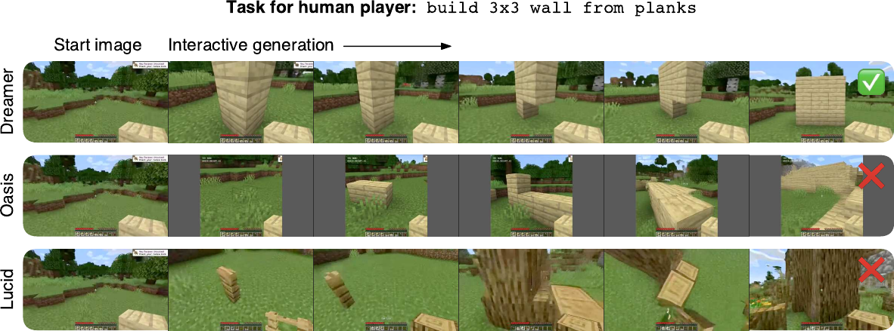

> 图 6 | 人类交互。一名人类玩家通过鼠标和键盘与世界模型进行反事实的实时交互，从相同的初始图像开始执行相同的任务。Dreamer 4 是首个能够准确预测方块交互和将方块放置成正确形状的游戏机制的世界模型。相比之下，之前的 Minecraft 世界模型在视觉上会退化、改变手持物品，并幻觉出玩家从未建造过的结构。Dreamer 4 世界模型允许玩家完成任务（  ），而 Oasis 和 Lucid 则不能（  ）。

**智能体性能**

[3](#fig:rl){reference-type="ref+Label" reference="fig:rl"} 比较了智能体在钻石任务上的性能。我们报告了[公式 tab:mc_items](#tab:mc_items)中列出的、通向钻石的几个相关物品的成功率。VPT（微调版）的进度最高到木棍，其成功率为 53%。它还通过边缘情况（如爆炸的苦力怕怪物和战利品箱）收集了少量石头、铁矿石和铁锭。通过直接使用承包商动作而非标注 YouTube 视频，我们现代的 BC 基线实现了比 VPT（微调版）更高的性能。VLA (Gemma 3) 表明，从预训练模型初始化策略能带来显著优势，其进度最高到铁镐，成功率为 11%。Dreamer 4 在石镐之前的物品上实现了超过 90% 的高成功率，铁镐的成功率为 29%，并在 0.7% 的回合中获得了钻石。想象训练相对于行为克隆智能体的改进效果，在里程碑越具挑战性时表现得越强。[4](#fig:rlabl){reference-type="ref+Label" reference="fig:rlabl"} 比较了钻石任务上的其他智能体，表明世界模型的表征在用于行为克隆时，优于 Gemma 3 的通用表征。这表明 **视频预测（Video Prediction）** 隐式地学习了对世界的理解，这种理解对决策制定同样有用。最后，想象训练不仅持续提高了成功率，还使策略更加高效，从而能更快地达到里程碑。

## 人机交互（Human Interaction） {#sec:interact}

为了评估其预测复杂交互的能力，我们在 **Minecraft VPT 数据集（Minecraft VPT dataset）** [@vpt] 上训练 **Dreamer 4（Dreamer 4）** ，并将其生成结果与此数据集上的先前世界模型进行比较。在此评估中，人类玩家尝试在世界模型内部进行游戏以完成任务，如 [图 5](#fig:wmtask) 所示。人类玩家接收任务描述，世界模型被初始化为任务的起始帧。我们选择了一组多样化的任务，涵盖了广泛的物体交互和游戏机制。这些任务包括挖掘坑洞、建造墙壁、砍伐树木、放置和乘坐船只、移开视线并重新注视物体、与工作台和熔炉交互等。我们将 Dreamer 4 与世界模型 **Oasis（Oasis）** [@oasis]、 **Lucid-v1（Lucid-v1）** [@lucidv1] 和 **MineWorld（MineWorld）** [@mineworld] 进行比较。请注意，我们无法直接与 **Genie 3（Genie 3）** [@genie3] 进行比较，因为它仅支持相机动作和一个通用的“交互”按钮，而 Minecraft 需要一个更通用的鼠标和键盘动作空间。[表 1](#tab:inference) 总结了所比较的模型。完整结果见 [图 fig:wmtasks_ours, fig:wmtasks_oasis, fig:wmtasks_lucid](#fig:wmtasks_ours,fig:wmtasks_oasis,fig:wmtasks_lucid)。

表 1 | 模型推理性能比较。
| 模型 | 参数量 | 分辨率 | 上下文长度 | 帧率（FPS） | 成功率 |
| :--- | :--- | :--- | :--- | :--- | :--- |
| MineWorld | 1.2B | 384$\times$224 | 0.8s | 2 | --- |
| Lucid-v1 | 1.1B | 640$\times$360 | 1.0s | 44 | 0/16 |
| Oasis (小) | 500M | 640$\times$360 | 1.6s | 20 | 0/16 |
| Oasis (大) | --- | 360$\times$360 | 1.6s | 5 | 5/16 |
| Dreamer 4 | 2B | 640$\times$360 | 9.6s | 21 | **14/16** |

**推理速度（Inference speed）**

我们在单个 **H100 GPU（H100 GPU）** 上测量了每个模型的推理速度。Dreamer 4 和 Lucid-v1 通过超过 Minecraft 物理引擎 [^3] 和 VPT 数据集 [@vpt] 的 20 FPS，实现了实时交互推理。与先前模型的 0.8–1.6 秒相比，Dreamer 4 的上下文长度显著更长，达到 9.6 秒。Oasis 有两种规模：一个具有开放权重的 5 亿参数版本，以及一个在项目网站上可玩的、规模未知的更大模型。小模型在单个 H100 上达到 20 FPS。大模型托管在多个 H100 上用于在线交互，我们根据公开信息估计其在单个 H100 上的推理速度约为 5 FPS。MineWorld 通过其并行解码方法达到 2 FPS，若不使用该方法则更慢。此外，并行解码需要提前知道动作，这在提供的用户界面中也是必需的。因此，它不支持实时交互，我们无法在需要数百个动作的任务上对其进行评估。

> 图 2：针对反事实动作的机器人学生成。Dreamer 4 学习了一个精确的实时环境模拟器，允许人类操作员控制想象中的机器人拾取物体、翻转碗、将球按在盘子上、移动毛巾以及投掷碗。

**复杂交互（Complex interactions）**

人类玩家在世界模型内部尝试所有任务的视频生成结果见 [图 fig:wmtasks_ours, fig:wmtasks_oasis, fig:wmtasks_lucid](#fig:wmtasks_ours,fig:wmtasks_oasis,fig:wmtasks_lucid)。Lucid-v1 无法完成任务，其生成结果会发散或忽略物体交互。大型 Oasis 模型允许完成 16 项任务中的 5 项，例如放置火把、用玻璃板填充窗户以及开门。然而，它在建造任务上失败了，因为在放置了几个方块后，它会迅速在世界上 **幻觉生成（hallucinate）** 出大型结构。这种“自动补全”失败模式反映了对游戏机制缺乏理解。由于 MineWorld 缺乏交互式推理能力，我们未对其进行评估。 **Dreamer 4 在 16 项任务中完成了 14 项** ，准确地生成了复杂的交互和游戏机制，例如切换物品、放置和破坏方块、与怪物战斗、放置和乘坐船只、进入传送门等。其时序一致性限于 9.6 秒的上下文长度，尽管这已显著长于先前的模型。虽然它能正确生成物品栏、合成和熔炉的界面，并预测大部分鼠标移动，但物品栏中的物品有时会不清晰或随时间变化，这为未来的改进留下了空间。

作为测试 Dreamer 4 对真实世界视频适用性的一步，我们还在一个 **机器人学数据集（robotics dataset）** [@soar] 上训练了世界模型。在 [图 6](#fig:robotics) 中，我们观察到与真实世界物体之间精确的物理和反事实交互，克服了现有视频模型的 **因果混淆（causal confusion）** 。更多细节包含在补充材料中。

## 动作泛化（Action Generalization） {#sec:actgen}

**世界模型（World models）** 的一个承诺是利用多样化的无标签视频来教导智能体（Agents）关于世界的知识。例如，一个世界模型可以从网络视频中学习通用的物理规律和物体交互，而这些视频中可能没有动作信息。在本节中，我们研究需要多少带有动作的配对视频，才能将具身（Embodiment）概念 **锚定（Grounding）** 到 Dreamer 4 世界模型中。直观地说，当动作缺失时，世界模型必须学习更广泛的可能结果分布；而当提供动作时，它可以缩小这个分布。此外，我们不仅研究动作条件化（Action conditioning）在相同分布内的泛化能力，还研究其 **分布外（Out-of-distribution, OOD）** 泛化能力，即泛化到被特意保留的世界部分。为了衡量动作条件化的准确性，我们在保留集（Holdout set）上将动作条件化的多步生成结果与真实视频进行比较。我们报告在给定 320 帧上下文的情况下，进行 16 步生成的 **峰值信噪比（Peak Signal-to-Noise Ratio, PSNR）** 和 **结构相似性指数（Structural Similarity Index Measure, SSIM）** 。

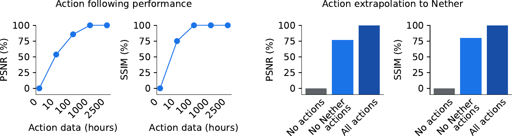

> 图 7 | 动作泛化。 **（左）** Dreamer 4 仅从 2500 小时的视频中（其中仅 100 小时带有配对动作）即可学习到准确的动作条件化。其动作条件化生成准确率达到了 80% 以上，该准确率是在完全无动作训练和使用全部动作训练的性能范围内进行归一化的。 **（右）** 当仅使用《我的世界（Minecraft）》主世界（Overworld）的动作进行学习时，动作条件化能够泛化到游戏中仅出现在无标签视频中的下界（Nether）和末地（End）维度。这些环境在主世界的纹理、方块和物品方面均有所不同。结果表明，Dreamer 4 能够从少量动作数据中学习到具有广泛泛化能力的动作条件化，这为从多样化的无标签网络视频中学习模拟器（Simulators）铺平了道路。

### **动作数量（Amount of actions）**

为了解学习动作条件化所需的带动作视频数量，我们在 VPT 数据集的所有 2541 小时视频上训练 Dreamer 4，但仅对一小部分视频提供动作。当动作不可用时， **动力学模型（Dynamics model）** 以一个学习到的嵌入（Embedding）为条件，如 [3.2](#sec:dynamics) 节所述。我们分别使用 0、10、100、1000 和 2541 小时的动作数据训练 Dreamer 4 模型。可用的动作按数据集的顺序取前一部分，这比随机打乱（Random shuffling）产生的独特世界（Unique worlds）和玩家数量要少。图 [7](#fig:actgen) 展示了动作条件化的质量，对比范围从完全无动作训练到使用全部动作训练。仅使用 10 小时动作数据，Dreamer 4 就能达到与使用全部动作训练的模型相比 53% 的 PSNR 和 75% 的 SSIM。使用 100 小时动作数据时，性能进一步提升至 85% 的 PSNR 和 100% 的 SSIM。这一结果表明，世界模型的大部分知识来源于无标签视频，仅需要少量的动作数据。

### **动作外推（Action extrapolation）**

世界模型的一个承诺是利用多样化的无标签视频来教导智能体关于世界的知识。例如，一个世界模型可以从网络视频中学习通用的物理规律和物体交互，而这些视频中可能没有动作信息。在本节中，我们研究需要多少带有动作的配对视频，才能将具身概念锚定到 Dreamer 4 世界模型中。直观地说，当动作缺失时，世界模型必须学习更广泛的可能结果分布；而当提供动作时，它可以缩小这个分布。此外，我们不仅研究动作条件化在相同分布内的泛化能力，还研究其分布外泛化能力，即泛化到被特意保留的世界部分。为了衡量动作条件化的准确性，我们在保留集上将动作条件化的多步生成结果与真实视频进行比较。我们报告在给定 320 帧上下文的情况下，进行 16 步生成的峰值信噪比和结构相似性指数。

> 图 7 | 动作泛化。 **（左）** Dreamer 4 仅从 2500 小时的视频中（其中仅 100 小时带有配对动作）即可学习到准确的动作条件化。其动作条件化生成准确率达到了 80% 以上，该准确率是在完全无动作训练和使用全部动作训练的性能范围内进行归一化的。 **（右）** 当仅使用《我的世界》主世界的动作进行学习时，动作条件化能够泛化到游戏中仅出现在无标签视频中的下界和末地维度。这些环境在主世界的纹理、方块和物品方面均有所不同。结果表明，Dreamer 4 能够从少量动作数据中学习到具有广泛泛化能力的动作条件化，这为从多样化的无标签网络视频中学习模拟器铺平了道路。

### **动作数量（Amount of actions）**

为了解学习动作条件化所需的带动作视频数量，我们在 VPT 数据集的所有 2541 小时视频上训练 Dreamer 4，但仅对一小部分视频提供动作。当动作不可用时，动力学模型以一个学习到的嵌入为条件，如 [3.2](#sec:dynamics) 节所述。我们分别使用 0、10、100、1000 和 2541 小时的动作数据训练 Dreamer 4 模型。可用的动作按数据集的顺序取前一部分，这比随机打乱产生的独特世界和玩家数量要少。图 [7](#fig:actgen) 展示了动作条件化的质量，对比范围从完全无动作训练到使用全部动作训练。仅使用 10 小时动作数据，Dreamer 4 就能达到与使用全部动作训练的模型相比 53% 的 PSNR 和 75% 的 SSIM。使用 100 小时动作数据时，性能进一步提升至 85% 的 PSNR 和 100% 的 SSIM。这一结果表明，世界模型的大部分知识来源于无标签视频，仅需要少量的动作数据。

### **动作外推（Action extrapolation）**

原则上， **世界模型（World models）** 不仅可以从少量动作中学习动作基础，还能将其动作条件化能力泛化到全新的场景。未来，这可能使世界模型能够从多样化的网络视频中吸收通用知识，以模拟不同环境中的智能体。据我们所知，我们首次对这一假设进行了受控评估。为此，我们仔细地将 VPT 数据集划分为两部分：一部分仅包含主世界（Overworld）的视频，另一部分仅包含另外两个游戏维度——下界（Nether）和末地（End）的视频。主世界包含森林、沙漠、海洋等，而下界和末地则呈现出截然不同且独特的视觉效果。下界是一个充满熔岩和红色方块的地下世界，而末地则充满了在主世界中从未见过的黄色方块和黑色高塔。我们在两个数据集的视频上训练 Dreamer 4，但只为主世界视频提供动作。然后，我们在模型从未见过任何动作的下界和末地场景上，对训练得到的模型进行动作条件化评估。在之前的实验中，我们观察到仅在主世界部分训练（不含任何下界视频）会导致模型对下界起始帧的生成分数很差。[7](#fig:actgen) 报告了与不使用任何动作或使用全部动作进行训练相比的相对性能。令人惊讶的是，该世界模型达到了使用全部动作训练的模型在 PSNR（峰值信噪比）上的 76% 和 SSIM（结构相似性指数）上的 80%。这表明， **世界模型的动作条件化能力可以泛化到仅从未标记视频中获知的场景** 。

## Model Design（模型设计） {#sec:modeldesign}

表 1 | 模型设计消融实验。
| Model | Train step seconds | Inference FPS ( | Quality FVD ( |
| :-----: | :-----: | :-----: | :-----: |
| Diffusion Forcing Transformer | 9.8 | 0.8 | 306 |
| + Fewer sampling steps ($K=4$) | 9.8 | 9.1 | 875 |
| + Shortcut model | 9.8 | 9.1 | 329 |
| + X-Prediction | 9.8 | 9.1 | 326 |
| + X-Loss | 9.8 | 9.1 | 151 |
| + Ramp weight | 9.8 | 9.1 | 102 |
| + Alternating batch lengths | 1.5 | 9.1 | 80 |
| + Long context every 4 layers | 0.6 | 18.9 | 70 |
| + GQA | 0.5 | 23.2 | 71 |
| + Time factorized long context | 0.4 | 30.1 | 91 |
| + Register tokens | 0.5 | 28.9 | 91 |
| + More spatial tokens ($N_\mathrm{z}=128$) | 0.8 | 25.7 | 66 |
| + More spatial tokens ($N_\mathrm{z}=256$) | 1.7 | 21.4 | 57 |

世界模型需要 **高模型容量（high model capacity）** 来预测复杂的物体交互，以及 **快速推理（fast inference）** 能力来支持用于检查的想象训练和人机交互。此外，与典型的视频模型相比，交互式推理需要不同的设计选择，以实现快速生成单个帧并防止误差累积。在本节中，我们通过对一个朴素的 **扩散强制变换器（Diffusion Forcing Transformer）** 基线模型应用一系列改进，来消融分析 Dreamer 4 的目标和架构决策。为了评估每个模型，我们训练 48 小时，然后在没有任何上下文的情况下生成 1024 个视频，每个视频 384 帧（约 20 秒），其中交互动作由固定的 **行为克隆（Behavioral Cloning, BC）** 策略选择。然后，我们将生成的视频分割成 16 帧的片段，以计算其与保留数据集的 **弗雷歇视频距离（Frechét Video Distance, FVD）** [@fvd]。

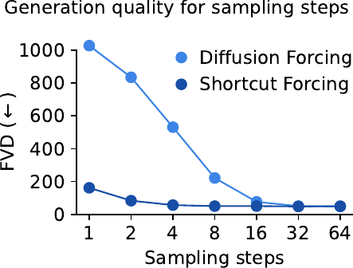{width="\\linewidth"}

> 图 1 | 图片描述。

[表 1](#tab:ablations) 展示了模型的演进过程及其生成质量和速度。我们从一个标准的 **块因果变换器（Block-causal Transformer）** 开始，它使用 **密集注意力（Dense Attention）** 和采用 **速度参数化（Velocity Parameterization）** 的 **扩散强制（Diffusion Forcing）** 。我们的目标是在单个 H100 GPU 上实现 20 FPS 的交互式推理，以匹配《我的世界（Minecraft）》的刻速率和 VPT 数据集的帧率。在每帧 64 个采样步数的情况下，基线模型无法实现实时生成，在单个 H100 GPU 上仅能达到 0.8 FPS；而 4 个采样步数能达到 9.1 FPS，但会导致生成质量低下。 **捷径模型（Shortcut Models）** [@shortcut] 仅用 4 个采样步数就几乎恢复了原始视觉质量。随后，我们对模型进行参数化，使其做出 **x 空间（x-space）** 预测，在 x 空间中计算损失，并应用 **斜坡损失权重（Ramp Loss Weight）** 。这些改变相较于传统的 **v 空间（v-space）** 预测，显著提升了生成质量，尤其是在生成长序列时。我们假设 x 空间中的预测目标更具结构性，因此降低了随时间累积的高频误差风险。[图 1](#fig:nfe) 比较了 **捷径强制（Shortcut Forcing）** 与 **扩散强制（Diffusion Forcing）** ——两者均使用带斜坡权重的 x 空间损失——在更广泛采样步数范围内的视觉质量。

在交替批次长度上进行训练类似于 **渐进式训练（Progressive Training）** ，它加速了学习过程，同时允许在整个训练过程中生成长视频以供检查。仅在每 4 层中使用 **时间注意力（Temporal Attention）** 不仅加快了训练和推理速度 [@llama4]，还提高了生成质量，这可能是因为 **空间注意力（Spatial Attention）** 的 **归纳偏置（Inductive Bias）** 将计算集中在当前帧上。 **分组查询注意力（Grouped-Query Attention, GQA）** 进一步加速了生成过程，且未降低性能。将长上下文层从密集注意力切换到 **仅时间注意力（Time-only Attention）** ，以轻微的质量代价加速了推理，并为我们后续增加总令牌数做好了准备。虽然 **寄存器令牌（Register Tokens）** 没有显著改善 **FVD（Frechet Video Distance）** 分数，但我们定性地注意到它们改善了时间一致性。经过这些改变后，训练和推理速度足够快，可以通过增加空间令牌数量来提升模型容量，从而改善对复杂交互的预测。完整模型的 FVD 达到了 57，而朴素的扩散强制变换器基线为 306，采用 v 空间预测和损失的完整架构则为 124。

表 1 | 表格描述。

| | | | |
| :--- | :--- | :--- | :--- |
| | | | Offline | Web | Online |
| Dreamer 3 | 64$\times$64, inventory | keyboard, camera, abstract crafting | --- | --- | 1.4K |
| VPT (RL) | 128$\times$128 | keyboard, mouse | 2.5K | 270K | 194K |
| VPT (BC) | 128$\times$128 | keyboard, mouse | 2.5K | 270K | --- |
| Dreamer 4 | 360$\times$640 | keyboard, mouse | 2.5K | --- | --- |

# 相关工作（Related Work）

## **《我的世界》（Minecraft）智能体**

在视频游戏《我的世界》（Minecraft）中获取钻石，一直是智能体研究的一个焦点 [@johnson2016malmo; @guss2019minerl; @kanervisto2022minerlcomp; @kanitscheider2021minecraftcurriculum]。这是一个 **长视野任务（long-horizon task）** ，需要在复杂的程序化生成的三维世界中，通过数千个低层级动作来收集资源和制作工具。文献中使用了不同的实验设置，[表 1](#tab:setups) 总结了与我们工作相关的设置。 **视频预训练（Video PreTraining, VPT）** [@vpt] 收集了 2500 小时的承包商游戏录像，并用合成的鼠标和键盘动作标注了 27 万小时的网络视频。在这个大型离线数据集上进行 **行为克隆（Behavioral Cloning）** ，并在“游戏早期”数据上进行针对性微调，可以得到一个偶尔能获得木镐的策略。随后进行 19.4 万小时的 **在线强化学习（online reinforcement learning）** ，最终得到一个能获得钻石和钻石镐的策略。 **Dreamer 3** [@dreamerv3] 从零开始，通过 1400 小时的在线交互学习收集钻石，不使用任何人类数据。它使用了包含抽象制作动作的 MineRL 竞赛动作空间。其他工作则探索了用于更简单任务的新算法 [@lifshitz2023steve1; @cai2023minecraftgroot; @zhou2024minedreamer; @nieto2021minecraftskills]。在本文中，我们训练一个智能体， **仅使用 2500 小时的承包商数据集** ，无需任何在线交互，来达成获取钻石的目标。我们使用低层级的鼠标和键盘动作以及高分辨率的图像输入。

## **世界模型智能体**

基于学习到的环境模型来学习行为，这一思路已被探索了很长时间 [@sutton1991dyna; @deisenroth2011pilco; @watter2015e2c]。 **视觉预见（Visual Foresight）** [@finn2017visualforesight]、@ha2018worldmodels 的工作以及 **PlaNet** [@hafner2018planet] 实现了足够精确、能够从像素进行规划的世界模型。随着 **Dreamer** 的出现，世界模型已成为解决高维输入控制问题的最先进方法，在鲁棒性、效率和最终性能方面超越了 **无模型强化学习（model-free reinforcement learning）** [@hafner2019dreamer; @hafner2020dreamerv2; @dreamerv3]。基于 **变换器（Transformer）** 或 **扩散（Diffusion）** 目标的世界模型在离散控制中展示了很高的数据效率 [@micheli2022iris; @robine2023twm; @storm]。然而，这些世界模型的模型容量有限，限制了它们只能应用于相对简单的模拟环境。

## **可扩展的世界模型**

更大的世界模型已被证明能够模拟更复杂的数据分布 [@yu2025survey]。像 **Genie 3** 这样的世界模型能够生成高度多样化的场景，并模拟相机移动和简单的交互 [@genie3; @he2025matrix; @sun2025virtual; @team2025yan]。 **PlayerOne** [@tu2025playerone] 和 **PEVA** [@bai2025whole] 则以更详细的人体运动为条件。 **Oasis** [@oasis]、 **Lucid** [@lucidv1] 和 **MineWorld** [@mineworld] 从鼠标和键盘输入中学习《我的世界》模拟器。Oasis 捕捉了简单的游戏机制，并在专用硬件上实现了实时推理，而 Lucid 的预测会迅速发散，MineWorld 则慢于实时。 **GameNGen** [@valevski2024diffusion] 将 Stable Diffusion 微调成游戏《毁灭战士》（Doom）某一关的可玩模拟器。 **DIAMOND** [@alonso2024diffusion] 学习了游戏《反恐精英：全球攻势》（CS GO）某一关的模拟器，实现了短期预测。 **GAIA** [@hu2023gaia; @russell2025gaia] 从真实世界数据生成驾驶场景。然而，这些世界模型仍然难以足够精确地预测复杂的物体交互，以满足 **想象训练（imagination training）** 的需求。

## **快速生成**

实现快速且准确的生成一直是生成建模中长期存在的挑战。 **MaskGit** 并行生成离散 **词元（token）** ，以加速对 **自回归模型（autoregressive models）** 的采样 [@chang2022maskgit]。 **扩散模型（Diffusion models）** 通常通过 **蒸馏（distillation）** 来减少采样所需的前向传播次数 [@salimans2022progressive; @kodaira2025streamdit]，但这需要两个训练阶段。 **一致性模型（Consistency models）** 学习直线路径以实现快速图像生成，但需要精心设计的 **调度（schedules）** [@song2023consistency; @song2023improved; @lu2024simplifying]，并已成功应用于视频生成 [@wang2023videolcm]。 **捷径模型（Shortcut models）** [@shortcut] 以噪声水平和步长共同为条件来构建 **流（flows）** ，从而在一个训练阶段内、无需调度地产生快速生成模型。 **平均流（Mean Flow）** [@geng2025meanflow] 将步长条件化的思想扩展到连续时间公式中。由于词元数量巨大，高效且稀疏的架构被用于视频生成 [@axial; @zhao2024real; @zhang2025vsa]。这些模型不支持交互式推理，并且许多技术是对我们工作的补充。

# **讨论（Discussion）**

我们提出了 **Dreamer 4** ，这是一个可扩展的智能体（Agent），它通过在快速且准确的世界模型（World Model）内部进行想象训练来学习解决具有挑战性的控制任务。Dreamer 4 是首个 **纯粹从离线数据中、无需在线交互** 就在《我的世界》（Minecraft）中获得钻石的智能体。这一成就证明了它能够在复杂环境中学习成功的 **长时程策略（Long-horizon strategies）** 。纯粹从离线数据集学习，使得在在线交互不切实际或不安全的应用场景成为可能。

Dreamer 4 的世界模型基于一个 **捷径强制目标（Shortcut Forcing Objective）** 和一个高效的 **Transformer 架构（Transformer Architecture）** ，用以预测复杂的物体交互，同时支持在单块 GPU 上进行实时交互式推理。我们证明，在《我的世界》中，它显著优于以往的世界模型，能够根据鼠标和键盘输入准确预测广泛的游戏机制。然而，该世界模型远非游戏的完整克隆，特别是由于其 **短期记忆（Short Memory）** 和不精确的 **库存预测（Inventory Predictions）** ，这使得《我的世界》成为未来世界模型和智能体研究的理想基准。我们还表明，Dreamer 4 仅需少量包含动作的视频就能学习准确的动作条件化（Action Conditioning），从而使其能够从多样化的未标注视频中吸收大部分知识。

有前景的未来方向包括：在通用互联网视频上进行预训练（Pretraining）、将长期记忆（Long-term Memory）整合到世界模型和智能体中、融入语言理解（Language Understanding）、利用少量校正性在线数据（Corrective Online Data），以及自动发现目标（Automatically Discovering Goals）以分解长时任务。Dreamer 4 为这些探索提供了一个可靠且高性能的起点。

# 数据集（Datasets）

**Minecraft VPT**

我们使用了 OpenAI 的 VPT 数据集（Video PreTraining dataset）[@vpt]，该数据集包含承包商游戏过程，并合并了可用的子集 6 至 10，总计 **2541 小时** 的游戏时长。我们将数据集按 **90% 训练** 和 **10% 评估** 的比例进行划分，确保划分后的数据不共享任何相同的底层 5 分钟录制片段。我们将键盘动作编码为一个 **二元变量（binary variables）** 向量，并按照 VPT 的方法处理鼠标动作：使用 **$\mu$-律编码（$\mu$-law encoding）** ，将每个坐标离散化为 11 个区间，并枚举所有 $11 \times 11 = 121$ 种组合，从而得到一个 **分类变量（categorical variable）** 。图像分辨率为 $360 \times 640$，帧率为 **20 FPS** 。我们将帧进行零填充（zero pad）至 $384 \times 640$，然后使用 $16 \times 16$ 的 **补丁大小（patch size）** 进行 **分块化（patchify）** ，得到 **960 个词元（tokens）** 。我们将 **分词器（tokenizer）** 的瓶颈层 $(N_\mathrm{b} = 512) \times (D_\mathrm{b} = 16)$ 重塑为 $(N_\mathrm{z} = 256) \times 32$，以供 **动力学模型（dynamics model）** 使用。我们使用 $N_\mathrm{z} = 256$ 个空间词元、 **上下文长度（context length）** $C = 192$ 以及 **批次长度（batch lengths）** $T_1 = 64$ 和 $T_2 = 256$ 来训练动力学模型。

**Minecraft 主世界与下界划分**

为了研究 Dreamer 4 中 **动作条件化（action conditioning）** 的 **分布外泛化（out-of-distribution generalization）** ，我们仔细地将 Minecraft 数据集划分为 **主世界（Overworld）** 和 **下界（Nether）** 维度的视频。我们还将 **末地（End）** 维度包含在数据集的“下界”部分。与主世界相比，下界和末地都具有独特的视觉效果、方块和地形形状。主世界包含森林、沙漠、海洋等自然景观，而下界则是以红色方块和熔岩为主题的地下世界，末地则是太空主题的区域。为了分离数据集，我们希望确保没有因玩家进入下界/末地维度并将那里的方块带回主世界而导致的数据泄露。因此，我们排除了包含长时间自由游戏的 VPT 6 和 7 子集。然后，我们根据数据集提供的物品事件，将剩余数据集的每个 5 分钟录制片段分配到主世界或下界/末地部分。每当与下界/末地物品发生交互时，我们就把该视频分配到下界/末地划分中。这确保了主世界划分中不包含任何下界/末地片段，而下界/末地划分有时可能包含一些主世界片段，尽管这在实践中很少见。我们手动检查了通过此策略获得的主世界划分，在其中没有发现任何下界/末地轨迹。

**SOAR Robotics**

SOAR 数据集 [@soar] 包含 **遥操作演示（teleoperated demonstrations）** 和 **强化学习策略（reinforcement learning policy）** 的在线轨迹，因此涵盖了成功和失败两种情况。我们将数据集按 **90% 训练** 和 **10% 评估** 的比例进行划分。该数据集总共包含 **180 小时** 的视频，带有 **7 维相对末端执行器动作（7D relative end-effector actions）** 。图像分辨率为 $256 \times 256$，帧率为 **5 FPS** 。我们使用 $16 \times 16$ 的补丁大小进行分块化，得到 **256 个词元** 。我们使用 $N_\mathrm{z} = 512$ 个空间词元、上下文长度 $C = 96$ 以及批次长度 $T_1 = 32$ 和 $T_2 = 128$ 来训练动力学模型。

**Epic Kitchens**

Epic Kitchens 100 数据集 [@epickitchens] 包含来自 45 个厨房的人类 **第一人称视角（first-person perspective）** 的 **100 小时** 视频。测试集包含在相同厨房中执行的不同任务。我们使用的数据集分辨率为 $256 \times 256$，帧率为 **10 FPS** 。我们使用 $16 \times 16$ 的补丁大小进行分块化，得到 **256 个词元** 。我们使用 $N_\mathrm{z} = 512$ 个空间词元、上下文长度 $C = 96$ 以及批次长度 $T_1 = 32$ 和 $T_2 = 128$ 来训练动力学模型。

# 厨房生成（Kitchen Generations）

> 图 8：从保留上下文开始的厨房视频生成。

# Minecraft Tasks（《我的世界》任务）

表 1 | 《我的世界》任务列表。
| 索引 | 任务 |
| :--- | :--- |
| 1 | `mine_log` |
| 2 | `mine_cobblestone` |
| 3 | `mine_iron_ore` |
| 4 | `mine_coal` |
| 5 | `mine_diamond` |
| 6 | `craft_planks` |
| 7 | `craft_stick` |
| 8 | `craft_crafting_table` |
| 9 | `craft_furnace` |
| 10 | `craft_iron_ingot` |
| 11 | `craft_wooden_pickaxe` |
| 12 | `craft_stone_pickaxe` |
| 13 | `craft_iron_pickaxe` |
| 14 | `open_crafting_table` |
| 15 | `open_furnace` |
| 16 | `place_crafting_table` |
| 17 | `place_furnace` |
| 18 | `use_wooden_pickaxe` |
| 19 | `use_stone_pickaxe` |
| 20 | `use_iron_pickaxe` |

表 2 | 《我的世界》物品图标。
| 图标 | 物品 |
| :--- | :--- |
| {height="2.5ex"} | 原木（Log） |
| {height="2.5ex"} | 木板（Planks） |
| {height="2.5ex"} | 木棍（Stick） |
| {height="2.5ex"} | 工作台（Crafting Table） |
| {height="2.5ex"} | 木镐（Wooden Pickaxe） |
| {height="2.5ex"} | 圆石（Cobblestone） |
| {height="2.5ex"} | 石镐（Stone Pickaxe） |
| {height="2.5ex"} | 铁矿石（Iron Ore） |
| {height="2.5ex"} | 熔炉（Furnace） |
| {height="2.5ex"} | 铁锭（Iron Ingot） |
| {height="2.5ex"} | 铁镐（Iron Pickaxe） |
| {height="2.5ex"} | 钻石（Diamond） |

表 3 | 《我的世界》任务阶梯示例。
| 任务 | 数量 |
| :--- | :--- |
| `mine_log` | 10 |
| `craft_planks` | 20 |
| `craft_crafting_table` | 1 |
| `place_crafting_table` | 1 |
| `craft_stick` | 4 |
| `craft_wooden_pickaxe` | 1 |
| `use_wooden_pickaxe` | 1 |
| `mine_cobblestone` | 3 |
| `craft_planks` | 4 |
| `craft_crafting_table` | 1 |
| `place_crafting_table` | 1 |
| `craft_stick` | 4 |
| `craft_stone_pickaxe` | 1 |
| `use_stone_pickaxe` | 1 |
| `mine_iron_ore` | 3 |
| `mine_cobblestone` | 8 |
| `craft_planks` | 4 |
| `craft_crafting_table` | 1 |
| `place_crafting_table` | 1 |
| `craft_furnace` | 1 |
| `craft_iron_ingot` | 3 |
| `craft_stick` | 2 |
| `craft_iron_pickaxe` | 1 |
| `use_iron_pickaxe` | 1 |
| `mine_diamond` | $\infty$ |

# Offline Diamond Challenge（离线钻石挑战）

表 4 | 离线钻石挑战成功率（%）。
| 物品 | 第 1 步 | 第 2 步 | 第 3 步 | 第 4 步 | 第 5 步 | 第 6 步 | 第 7 步 | **第 8 步** |
| :--- | :---: | :---: | :---: | :---: | :---: | :---: | :---: | :---: |
| 原木（Log） | 81.9 | 84.3 | 71.4 | 92.6 | **97.3** | **98.5** | **99.6** | **99.1** |
| 木板（Planks） | 30.6 | 65.3 | 68.6 | 91.6 | **95.7** | **98.3** | **99.6** | **98.9** |
| 工作台（Crafting table） | 1.7 | 4.7 | 63.8 | 90.6 | 93.5 | **97.2** | **99.1** | **98.5** |
| 木棍（Stick） | 30.3 | 52.6 | 62.4 | 90.1 | **95.0** | **97.7** | **98.9** | **98.7** |
| 木镐（Wooden pickaxe） | 0.0 | 0.0 | 33.8 | 77.3 | 86.5 | **94.1** | **97.3** | **96.6** |
| 圆石（Cobblestone） | 4.8 | 6.9 | 32.0 | 77.4 | 83.9 | 91.6 | **97.2** | **95.9** |
| 石镐（Stone pickaxe） | 0.0 | 0.0 | 8.8 | 38.4 | 53.8 | 76.7 | **89.4** | **90.1** |
| 铁矿石（Iron ore） | 0.1 | 0.1 | 3.6 | 22.0 | 26.5 | 46.3 | 62.9 | **66.7** |
| 熔炉（Furnace） | 0.0 | 0.0 | 4.0 | 28.0 | 16.2 | 42.4 | 51.1 | **58.1** |
| 铁锭（Iron ingot） | 0.1 | 0.1 | 0.2 | 1.2 | 4.3 | 22.5 | 27.8 | **39.5** |
| 铁镐（Iron pickaxe） | 0.0 | 0.0 | 0.0 | 0.1 | 0.6 | 11.2 | 16.9 | **29.0** |
| 钻石（Diamond） | 0.0 | 0.0 | 0.0 | 0.0 | 0.0 | 0.0 | 0.0 | **0.7** |

表 5 | 离线钻石挑战平均尝试次数。
| 物品 | 第 1 步 | 第 2 步 | 第 3 步 | 第 4 步 | 第 5 步 | 第 6 步 | 第 7 步 | **第 8 步** |
| :--- | :---: | :---: | :---: | :---: | :---: | :---: | :---: | :---: |
| 原木（Log） | 9.1 | 6.3 | 11.9 | 5.4 | 1.8 | 2.2 | 1.2 | **0.9** |
| 木板（Planks） | 25.2 | 14.2 | 12.2 | 5.9 | 4.3 | 3.4 | 2.1 | **2.0** |
| 木棍（Stick） | 32.0 | 24.0 | 13.3 | 6.7 | 6.4 | 5.0 | **3.1** | **2.9** |
| 工作台（Crafting table） | 41.4 | 27.5 | 17.1 | 8.0 | 9.5 | 7.2 | **4.6** | \*\*4.4

# Minecraft Inputs（《我的世界》输入）

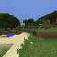

> 图 3 | Dreamer 3 (64×64)

<figure>
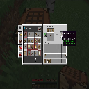
<figcaption>VPT (128×128)</figcaption>
</figure>

<figure>
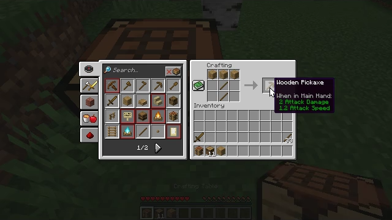
<figcaption>Dreamer 4 (360×640)</figcaption>
</figure>

<figcaption> 不同智能体输入图像的对比。Dreamer 4 直接从反映人类玩家体验的高分辨率图像中学习。</figcaption>
</figure>

# Previous Dreamer Generations（先前的 Dreamer 版本）

**Dreamer 3** [@dreamerv3] 通过在线交互，从零开始学习在《我的世界》（Minecraft）中获取钻石。其输入是低分辨率图像和物品栏状态，输出是鼠标、键盘和抽象的合成动作。Dreamer 3 使用一个 **循环状态空间模型（Recurrent State-Space Model, RSSM）** [@hafner2018planet] 作为其世界模型，该模型基于循环神经网络和变分目标。这种方法产生了一个推理效率极高的轻量级世界模型，但难以扩展到多样化的数据分布。相比之下， **Dreamer 4** 纯粹从离线数据中学习在《我的世界》中获取钻石。其输入仅为高分辨率图像，输出是底层的鼠标和键盘动作。Dreamer 4 使用一个基于高效 **Transformer 架构（Transformer architecture）** 和 **捷径强制目标（shortcut forcing objective）** 的可扩展世界模型，使其能够扩展到包含大量细节的多样化数据分布。Dreamer 3 使用回报归一化和熵正则化器，而 Dreamer 4 在想象训练中使用带有 **KL 散度（Kullback-Leibler divergence）** 到行为克隆先验的 **PMPO（PMPO）** ，无需任何归一化。

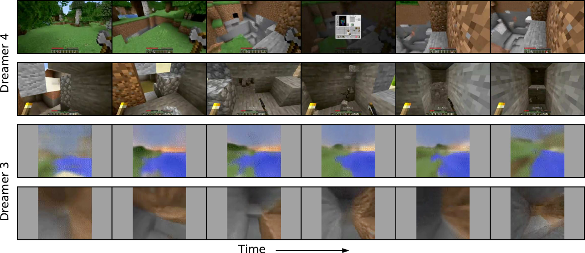

> 图 9 | Dreamer 3 与 Dreamer 4 的多步视频生成对比。

# Human Interaction: Lucid-v1（人机交互：Lucid-v1）

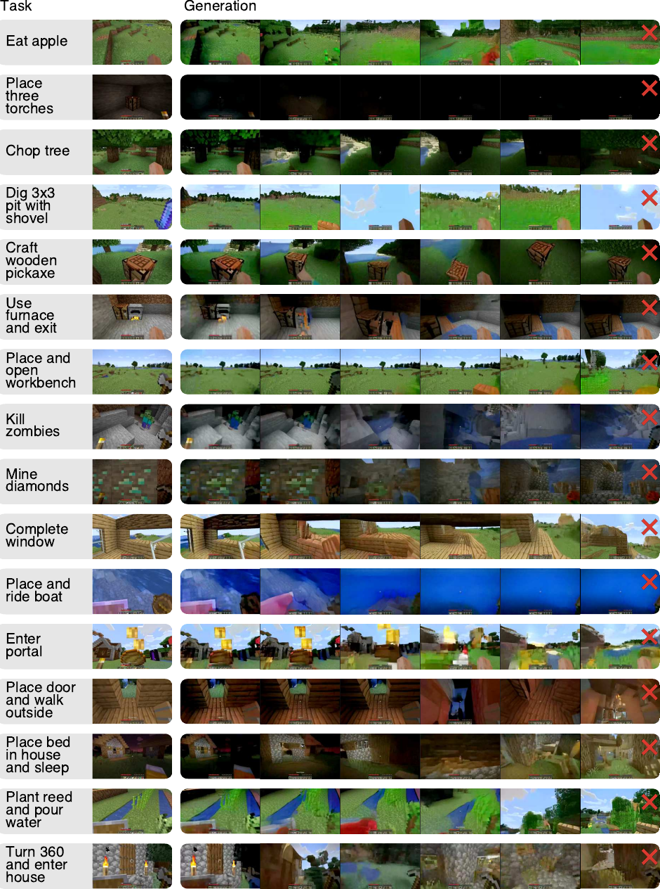

> 图 10 | Lucid-v1

# Human Interaction: OASIS (large)（人机交互：OASIS (large)）

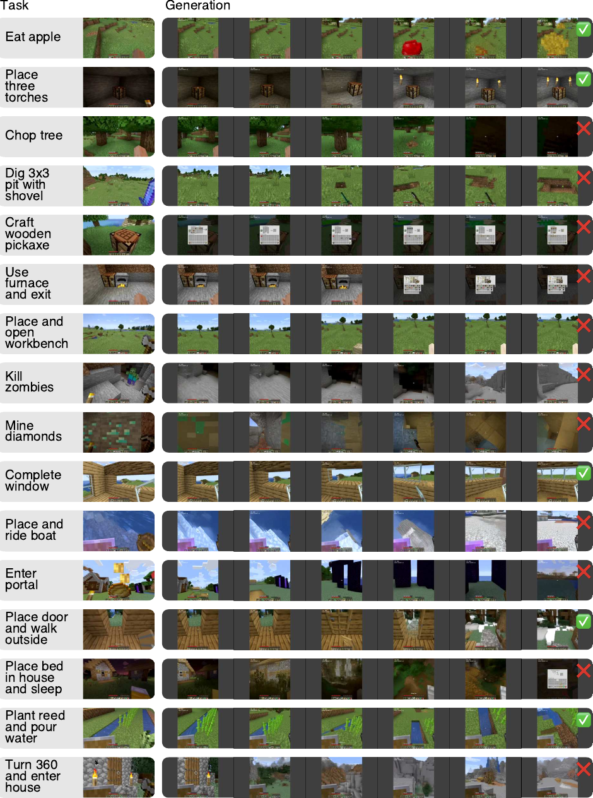

> 图 11 | Oasis (large)

# Human Interaction: Dreamer 4（人机交互：Dreamer 4）

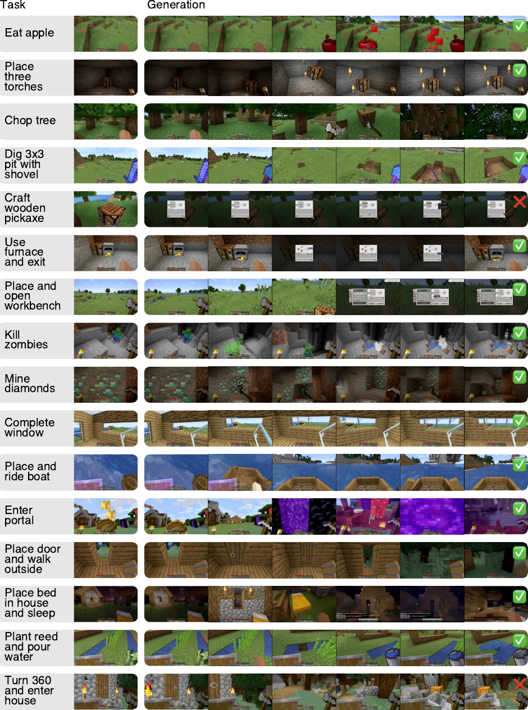

> 图 12 | Dreamer 4

[^1]: 网络输出被转换为 $\hat{v}_\tau= (\hat{x}_1 - x_\tau) / (1 - \tau)$。x 空间和 v 空间的 **均方误差（Mean Squared Error, MSE）** 通过 $\|\hat{x}_1 - x_1\|^2_2 = (1-\tau)^2\|\hat{v}_\tau-v_\tau\|^2_2$ 相关联，这促使使用 $(1-\tau)^2$ 乘子将引导损失调整到与 x 空间流损失相似的范围。
[^2]: 对整个 Transformer 进行微调能以更高的计算成本带来微小的额外收益。为此，在想象训练期间需要应用动态、策略先验和奖励损失，以保持它们的功能。
[^3]: <https://minecraft.fandom.com/wiki/Tick>
