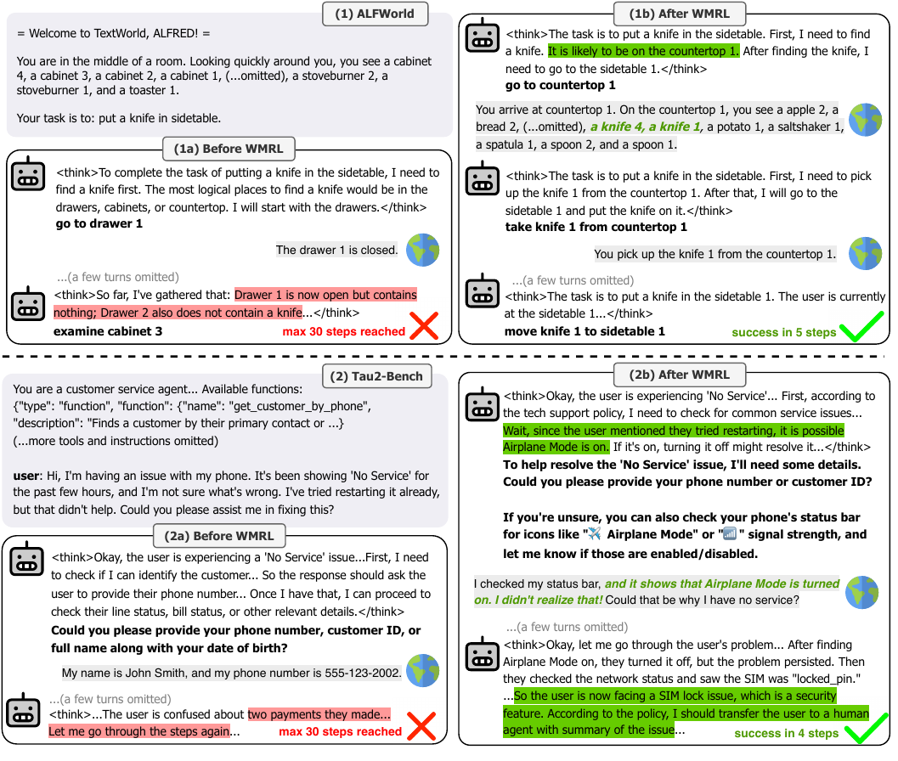

## Appendix A LLM Usage

This work used LLMs as general-purpose writing assistants to improve the grammar and clarity of the paper. We did not use LLMs to generate any research ideas, automate experiments, or analyze results.

> Table A1: Comparing RWML to related methods. _Expert Actions_ indicates if the method requires expert rollouts; _LLM Synthetic Data_ indicates if the method uses LLM-generated data; _Task Success Reward_ indicates if the method requires accessing task-success reward signals for training/data collection.

|                                             | Expert Actions | LLM Synthetic Data | Task-Success Reward |
| ------------------------------------------- | -------------- | ------------------ | ------------------- |
| IWM (Zhang et al., 2025a; Yu et al., 2025c) | Required       | ✗                  | ✗                   |
| SR (Zhang et al., 2025a; Yu et al., 2025c)  | Required       | Required           | ✗                   |
| Imitation Learning                          | Required       | ✗                  | ✗                   |
| RFT                                         | ✗              | ✗                  | Required            |
| \rowcolorlight-gray RWML (ours)             | ✗              | ✗                  | ✗                   |

> Table A2: Hyperparameters introduced in RWML. _Value_ represents value used in ALFWorld, $\tau^{2}$ Bench, respectively.

| Stage         | Name                   | Value     | Heuristics                                                                       | Intuition                                                                                                                                                                                                                                                                                                                |
| ------------- | ---------------------- | --------- | -------------------------------------------------------------------------------- | ------------------------------------------------------------------------------------------------------------------------------------------------------------------------------------------------------------------------------------------------------------------------------------------------------------------------ |
| RWML Data     | $\tau_{d}$             | 0.1, 0.15 | Set such that “too easy” samples correspond to $\sim$30% of the original dataset | Spending more training on medium-to-hard samples better incentivizes the model to learn non-trivial world-model knowledge.                                                                                                                                                                                               |
| RWML Data     | $\tau_{\mathrm{easy}}$ | 0.0, 0.0  | Fixed                                                                            | Spending more training on medium-to-hard samples better incentivizes the model to learn non-trivial world-model knowledge.                                                                                                                                                                                               |
| RWML Data     | $p$                    | 0.1, 0.1  | Fixed                                                                            | The final dataset retains mostly medium-to-hard examples while preserving sufficient dataset diversity.                                                                                                                                                                                                                  |
| RWML Training | $\tau_{d}$             | 0.2, 0.4  | Add 0.15 from $\tau_{d}$ used in data collection, then rounded to nearest 0.2    | Slightly higher than that of data construction since it uses a fine-tuned model. Values that are too high (e.g., >0.5) make the world-modeling task overly easy, encouraging generic next-state descriptions. Values that are too low (e.g., <0.1) approximate exact matching and become overly strict in many settings. |

## Appendix B More Details on ALFWorld

ALFWorld (Shridhar et al., 2021) is a text-based, long-horizon agent environment designed to align with the embodied ALFRED benchmark (Shridhar et al., 2021). An ALFWorld task can involve over 50 locations and require more than 50 steps for an expert policy, challenging agents to plan, track subgoals, and explore these locations efficiently. In particular, a key challenge in ALFWorld is identifying likely locations of household items (e.g., desklamps are likely on desks, shelves, or dressers). This makes ALFWorld well suited for evaluating both pretrained commonsense and learned world knowledge of an LLM-based agent.

- [B.1 RWML Training Setup](#b1-rwml-training-setup)
- [B.2 Policy RL Training Setup](#b2-policy-rl-training-setup)
- [B.3 Other Training Setup](#b3-other-training-setup)

### B.1 RWML Training Setup

To collect training data for RWML (and WM SFT), we use the target model (Qwen2.5-7B-Instruct) to rollout $N=3$ trajectories per training task with temperature $\tau=1.0$. We use 2048 tasks from the ALFWorld original training set with a maximum step of 30. We then convert these rollouts to triplets of $\left\langle s_{\leq t},a_{t},s_{t+1}\right\rangle$. After minor postprocessing (e.g., removing some samples that contains invalid actions), we obtain 21,011 triplets for training and 2,288 for validation. Then, we finetune a filtering model with SFT on the validation split, and subsampled “too easy” training samples with $\tau_{d}=0.1,\tau_{\mathrm{easy}}=0.0$ which corresponds to $\sim$30% of the original training data. We set $p=0.1$ to subsample these “too easy” training samples, so that the final dataset retains mostly medium-to-hard examples while preserving sufficient dataset diversity. We note that this value is chosen heuristically without tuning and is also fixed for $\tau^{2}$ Bench (see [Section˜B.1](https://arxiv.org/html/2602.05842v2#A2.SS1)). An overview of hyperparameter heuristics/intuitions is shown in [Table˜A2](#table-2). This results in a final training set of 15,813 triplets. For a fair comparison, both RWML and WM SFT are then trained on this final training set.

For $r^{\textrm{WM}}$ during training, we using Qwen3-Embedding-8B (Zhang et al., 2025b) with $\tau_{d}=0.2$. For RWML, we prompt the model to generate reasoning before making a final prediction of the next state. For WM SFT, we directly train the model to predict the next state with empty reasoning tokens. Since there is no reasoning data available for the triplets, we find this training method for WM SFT can better enable generalization/reasoning during the second stage Policy RL training. We present the prompts used for RWML and WM SFT in [Table˜A4](#table-4) and [Table˜A5](#table-5), respectively. For RWML, we train over 2 epochs using a learning rate of 1e-6, batch size of 32, group size of 8 with 2xB200 GPUs. For WM SFT, we train over 2 epochs using a learning rate of 2e-6, effective batch size of 32 over 4xB200 GPUs.

### B.2 Policy RL Training Setup

For Policy RL, we mainly follow setups and prompts from Feng et al. (2025c); Yu et al. (2025a). We use the official training split from ALFWorld during training, prompting the model to generate reasoning tokens (i.e., <think>…</think>) before generating an action. We use a maximum step of 15 during training, using $\gamma=1.0$ to propagate terminal task success rewards to every turn in the trajectory. We note that this setup is identical to all Policy RL experiments (e.g., RWML+Policy RL and WM SFT+Policy RL). The only differences is the starting model checkpoint. All Policy RL runs are trained with GRPO over 300 steps with a group size of 8 on 2xB200 GPUs. Average training time is 28 hours.

### B.3 Other Training Setup

For Imitation Learning, IWM, and SR, we use expert data from the official ALFWorld dataset, following Zhang et al. (2025a). For reflection data in SR, we follow Zhang et al. (2025a) and use a branching factor of 3 per expert action. Then, we use the prompt provided in Zhang et al. (2025a) to generate reflection data with the target model (i.e., Qwen2.5-7B-Instruct). However, we find that the target model cannot consistently generate coherent reflections, likely due to its limited long-context instruction-following capability. Therefore, following Yu et al. (2025c), we use a stronger LLM (i.e., GPT-4o) to generate reflections. After data collection, we follow Zhang et al. (2025a) and performed SFT training by combining the world model data/critic data with the original expert actions dataset. All training is done on 4xB200 GPUs, similar to our WM SFT.

## Appendix C More Details on τ 2 \tau^{2} Bench

$\tau^{2}$ Bench (Barres et al., 2025) is a text-based, long-horizon agent environment designed to evaluate the customer service ability of an LLM-based agent in a dual-control environment, where both the agent and user can make use of tool calls to act in a shared, dynamic environment. A $\tau^{2}$ Bench task, in practice, requires the agent to communicate with the user to gather information, make tool-calls, and adapt to the evolving environment state (e.g., users making tool-calls). Tasks spans across domains such as telecom, retail, and airline support, creating diverse multi-step interactions that challenge agents to plan, adapt, and coordinate with the user. In particular, solving $\tau^{2}$ Bench tasks requires reasoning about which tool to use (e.g., what information or actions each tool provides) as well as modeling user intent and behavior. This makes $\tau^{2}$ Bench suitable for evaluating the tool/user understanding and modeling ability of an LLM-based agent.

- [C.1 RWML Training Setup](#c1-rwml-training-setup)
- [C.2 Policy RL Training Setup](#c2-policy-rl-training-setup)
- [C.3 Additional Evaluation Results](#c3-additional-evaluation-results)
- [C.4 Other Training Setup](#c4-other-training-setup)

### C.1 RWML Training Setup

To collect training data for RWML (and WM SFT), we use the target model (Qwen3-8B) to rollout $N_{\mathrm{total}}=6$ trajectories per training task. Specifically, since $\tau^{2}$ Bench has limited training samples (178 tasks in the training split), we performed rollout with $N=3$ using GPT-4.1 as the user simulator and $N=3$ using Qwen3-235B-A22B-Instruct as the user simulator to promote diversity. We then converted all rollouts to triplets of $\left\langle s_{\leq t},a_{t},s_{t+1}\right\rangle$. To prevent the model from memorizing database values in the tool responses (e.g.,{"customer*id": "abc123", "full_name": "John Doe"}), we masked these values by converting them to the corresponding OpenAPI schema (e.g., {"type": "object", "properties": {"customer_id": {"type": "string"}, "full_name": {"type": "string"}}}). Similarly, to prevent memorization of user details, we also provide basic user information available to the user simulator (e.g., “I am John Doe. My phone number is 123-456-7890.”) in the prompt. We do not provide information regarding the user’s intent in the world model learning prompts. We present an example in [Table˜A6](#table-6) and [Table˜A7](#table-7). Then, we follow [Section˜B.1](https://arxiv.org/html/2602.05842v2#A2.SS1) to subsample “too easy” triplets with $\tau*{d}=0.15,\tau*{\mathrm{easy}}=0.0$ and obtained 5,578 triplets for training. We set $p=0.1$ to subsample these “too easy” training samples, so that the final dataset retains mostly medium-to-hard examples while preserving sufficient dataset diversity. An overview of hyperparameter heuristics/intuitions is show in [Table˜A2](#table-2). In total, $\sim$60% of the $s*{t+1}$ are tool-use responses and $\sim$40% are user responses.

For $r^{\textrm{WM}}$ during training, we use Qwen3-Embedding-8B (Zhang et al., 2025b) similar to [Section˜B.1](https://arxiv.org/html/2602.05842v2#A2.SS1). However, since tool-use responses are generally structured outputs, we find using rouge-score (Lin, 2004) is more effective at capturing these structures and any missing keys/values. Our final reward function in $\tau^{2}$ Bench is defined as:

$$
r^{\mathrm{WM}}(\hat{s}_{t+1},s_{t+1})=\begin{cases}1.0,&\text{if}d(\hat{s}_{t+1},s_{t+1})<\tau_{d}\text{and}s_{t+1}\text{is a user response},\\ \textrm{round(rouge(\hat{s}_{t+1},s_{t+1}), 0.2)},&\text{if}s_{t+1}\text{is a tool-use response},\\ 0.0,&\text{otherwise}.\end{cases}
$$

with $\tau_{d}=0.4$ as user responses are highly non-deterministic, and round($\cdot$, 0.2) is used to promote better training stability. For RWML, we train over 2 epochs using a learning rate of 1e-6, batch size of 32, and group size of 16 with 4xB200 GPUs. For WM SFT, we train over 2 epochs using a learning rate of 2e-6 and an effective batch size of 32 over 4xB200 GPUs.

### C.2 Policy RL Training Setup

We extend the codebase from [Section˜B.2](https://arxiv.org/html/2602.05842v2#A2.SS2) to allow for multi-turn rollouts with $tau^{2}$ Bench. We use the official prompts from $tau^{2}$ Bench for both training and evaluation. However, since the official setting requires using GPT-4.1 as user simulator, to save cost we use the open-source Qwen3-235B-A22B-Instruct as user simulator during Policy RL. During Policy RL, we use a maximum step of 30 and $\gamma=1.0$ to propagate terminal task success rewards to every turn in the trajectory. All Policy RL runs are trained with GRPO over 200 steps with a group size of 8 on 8xB200 GPUs. Average training time is 5 days.

> Table A3: Performance on $\tau^{2}$ Bench using the official evaluation setting (GPT-4.1 as user simulator, and a maximum step of 100).

| Method                                      | Retail       | Telecom      | Airline      | AVG          |
| ------------------------------------------- | ------------ | ------------ | ------------ | ------------ |
| ReACT(Qwen3-8B)                             | 42.5$\pm$2.0 | 30.0$\pm$4.1 | 23.3$\pm$4.7 | 33.7$\pm$0.5 |
| ReACT(GPT-4.1)                              | 66.7$\pm$3.1 | 50.0$\pm$2.0 | 41.7$\pm$0.0 | 55.0$\pm$1.4 |
| ReACT(GPT-5)                                | 77.5$\pm$7.4 | 97.5$\pm$2.0 | 51.7$\pm$2.4 | 80.3$\pm$4.2 |
| _Learning from experts/strong LLMs_         |              |              |              |              |
| Imitation Learning                          | 49.2$\pm$4.5 | 50.0$\pm$2.0 | 33.3$\pm$3.3 | 46.3$\pm$3.3 |
| SR                                          | 52.5$\pm$3.5 | 45.8$\pm$6.5 | 43.3$\pm$2.6 | 48.0$\pm$2.5 |
| _Learning from task success reward_         |              |              |              |              |
| Policy RL                                   | 34.2$\pm$3.1 | 45.0$\pm$7.4 | 31.7$\pm$5.3 | 38.0$\pm$2.2 |
| _Self-supervised_                           |              |              |              |              |
| WM SFT                                      | 40.8$\pm$3.1 | 30.8$\pm$1.2 | 30.0$\pm$8.2 | 34.7$\pm$3.3 |
| \rowcolorlight-gray RWML (ours)             | 43.3$\pm$3.1 | 47.5$\pm$2.0 | 45.0$\pm$8.2 | 45.3$\pm$3.1 |
| _Self-supervised + Policy RL_               |              |              |              |              |
| \rowcolorlight-gray RWML + Policy RL (ours) | 48.3$\pm$4.7 | 41.7$\pm$2.4 | 50.0$\pm$0.0 | 46.0$\pm$2.8 |

### C.3 Additional Evaluation Results

To augment our evaluation in [Table˜1](#table-1) and [Table˜2](#table-2), we additionally evaluate our models using the official setting with GPT-4.1 as user simulator and a maximum step of 100. Since GPT-4.1 is expensive, we evaluate the representative models in each category of [Table˜1](#table-1) and [Table˜2](#table-2). We present the results in [Table˜A3](#table-3). In general, we find our method surpasses all training methods that does not use experts/strong LLMs; and is competitive compared to methods that use experts/strong LLMs.

### C.4 Other Training Setup

Imitation Learning, IWM, and SR requires expert rollouts for training. However, since $\tau^{2}$ Bench does not provide expert trajectory annotations, we collect “expert” rollouts using rejection sampling with a strong LLM. Specifically, we use Qwen3-235B-A22B-Thinking-2507 and perform rollouts with $N_{\mathrm{total}}=6$, with $N=3$ using GPT-4.1 as user simulator and $N=3$ using Qwen3-235B-A22B-Instruct (same as [Section˜C.1](https://arxiv.org/html/2602.05842v2#A3.SS1)). We then only keep rollouts that successfully solved the tasks as expert rollouts. For reflection data in SR, we follow the same procedure as ALFWorld ([Section˜B.1](https://arxiv.org/html/2602.05842v2#A2.SS1)). Similar to ALFWorld, due to the weak performance of the target model on the benchmark, we use GPT-4.1 instead of Qwen3-8B to generate reflection data. All training is done on 8xB200 GPUs.

## Appendix D More Details on Ablation Studies

For LLM-as-a-judge in [Table˜4](#table-4), we present an example prompt and an example (hacked) response from ALFWorld in [Table˜A8](#table-8). We note that the model being trained is Qwen2.5-7B-Instruct, where as the judge model is Qwen3-235B-A22B-Instruct. In general, we find LLM-as-a-judge can be unreliable, awarding high scores to predictions that does not show genuine understanding of the environment dynamics relevant to the task.

## Appendix E More Details on Parameter Change Analysis

> (a) Layer-wise parameter change ratios by transformer layer (ALFWorld and $\tau^{2}$-Bench).

We report a fine-grained analysis of parameter updates at both the layer and module levels. Specifically, we compute the fraction of parameters exhibiting major changes within each transformer layer, with results summarized in [Figure˜1(a)](https://arxiv.org/html/2602.05842v2#A5.F1.sf1). Across both benchmarks, we observe highly consistent trends throughout the network depth. Models trained with RWML display the lowest proportion of updated parameters, whereas WM SFT leads to noticeably broader parameter modifications. This pattern aligns with the forgetting behavior analyzed in [Section˜3.3](#section-3-3), where RWML models retain prior knowledge more effectively.

In addition, we compare the effects of policy RL when applied to different mid-trained initializations. Notably, the parameter change profiles of policy RL remain largely similar regardless of whether RWML is applied beforehand, and closely resemble those obtained when policy RL is performed directly on the base model. In contrast, initializing policy RL from a WM SFT model results in substantially elevated update ratios. These results indicate that RWML preserves a parameter configuration that is more amenable to subsequent policy optimization, reducing the extent of disruptive updates during post-training.

To further validate that this behavior is not an artifact of layer aggregation, we conduct a module-wise breakdown over attention projections (Q/K/V/O) and MLP projection parameters, as shown in [Figure˜1(b)](https://arxiv.org/html/2602.05842v2#A5.F1.sf2). The observed trends closely mirror the layer-wise results, suggesting that the relative stability induced by RWML is consistent across different architectural components rather than being localized to specific modules.

Overall, these detailed analyses provide additional evidence that employing RL during both mid-training and post-training leads to more coherent and stable parameter update than the conventional SFT-then-RL pipeline.

Finally, we emphasize that the analyses presented here are empirical and are intended to provide descriptive evidence rather than a complete mechanistic explanation. While the observed parameter update patterns offer insights into how RWML influences subsequent training dynamics, a more systematic understanding of RL-based training—particularly from the perspectives of optimization dynamics and mechanistic interpretability—remains an important direction for future work. We hope these findings motivate further investigation into the internal representations and learning trajectories induced by RL at different stages of model training.

> Table A4: Prompt for RWML in ALFWorld, given a current state $s_{t}$ and an action $a_{t}$. Final output within the <next*state> </next_state> tags is used to compare with the next state in $r^{\textrm{WM}}(\hat{s}*{t+1},s\_{t+1})$ during RL.

| You are an expert agent operating in the ALFRED Embodied Environment. Your task is to …_// omitting task instruction and previous action history here for brevity_ Your current observation is: {current_state} Potential action: {action} Now, your task is to predict the immediate next observation after taking the potential action above. You should first briefly reason step-by-step about the previous steps and current situation — summarize key information you’ve learned about the environment that is relevant to the task. This reflection and reasoning process must be enclosed within <think> </think> tags. Once you’ve finished your reasoning, you should describe the next observation (use the past and current observations as examples!) and present them within <next_state> </next_state> tags. |
| --------------------------------------------------------------------------------------------------------------------------------------------------------------------------------------------------------------------------------------------------------------------------------------------------------------------------------------------------------------------------------------------------------------------------------------------------------------------------------------------------------------------------------------------------------------------------------------------------------------------------------------------------------------------------------------------------------------------------------------------------------------------------------------------------------------------------- |

> Table A5: Prompt for WM SFT in ALFWorld, given a current state $s_{t}$ and an action $a_{t}$. The label is the next state $s_{t+1}$.

| You are an expert agent operating in the ALFRED Embodied Environment. Your task is to …_// omitting task instruction and previous action history here for brevity_ Your current observation is: {current_state} Potential action: {action} Now, your task is to predict the immediate next observation after executing the potential action above. Directly present your final prediction of the next observation (use the past and current observations as examples!) within <next_state> </next_state> tags. DO NOT generate anything else. |
| --------------------------------------------------------------------------------------------------------------------------------------------------------------------------------------------------------------------------------------------------------------------------------------------------------------------------------------------------------------------------------------------------------------------------------------------------------------------------------------------------------------------------------------------- |
| Label: <think> </think> <next_state> {next_state} </next_state>                                                                                                                                                                                                                                                                                                                                                                                                                                                                               |

> Table A6: Prompt for RWML in $\tau^{2}$ Bench, given $s_{\leq t}$ and an action $a_{t}$. Final output within the <next*state> </next_state> tags is used to compare with the next state in $r^{\textrm{WM}}(\hat{s}*{t+1},s\_{t+1})$ during RL.

| You are a customer service agent that helps the user according to the <policy> provided below…_// omitting task instruction, policy, and tool usage details here for brevity_ # User Information The following information about the user is available: {available_user_info} # History {current_state} Potential assistant response: {action} # Your Task Now, your task is to predict the immediate next user/tool response if the above ‘potential assistant response’ is used based on the available information above. Once you’ve finished your thinking, format your final prediction of the next user/tool response and task completion status within <next_state> </next_state> tags. Note that a user response should be written as plain text. A tool response may be a short status message (e.g., no data found, error, transaction success, etc.,) or a JSON object; if it is JSON, only predict the JSON schema in OpenAPI format rather than actual values (e.g., {"type": "object", "properties": {"customer_id": {"type": "string"}, "full_name": {"type": "string"}},…}). |
| -------------------------------------------------------------------------------------------------------------------------------------------------------------------------------------------------------------------------------------------------------------------------------------------------------------------------------------------------------------------------------------------------------------------------------------------------------------------------------------------------------------------------------------------------------------------------------------------------------------------------------------------------------------------------------------------------------------------------------------------------------------------------------------------------------------------------------------------------------------------------------------------------------------------------------------------------------------------------------------------------------------------------------------------------------------------------------------------- |

> Table A7: Prompt for WM SFT in $\tau^{2}$ Bench, given $s_{\leq t}$ and an action $a_{t}$. The label is the next state $s_{t+1}$.

| You are a customer service agent that helps the user according to the <policy> provided below…_// omitting task instruction, policy, and tool usage details here for brevity_ # User Information The following information about the user is available: {available_user_info} # History {current_state} Potential assistant response: {action} # Your Task Now, your task is to predict the immediate next user/tool response if the above ‘potential assistant response’ is used based on the available information above. DO NOT perform any thinking. Directly present your final prediction of the next user/tool response within <next_state> </next_state> tags. Note that a user response should be written as plain text. A tool response may be a short status message (e.g., no data found, error, transaction success, etc.,) or a JSON object; if it is JSON, only predict the JSON schema in OpenAPI format rather than actual values (e.g., {"type": "object", "properties": {"customer_id": {"type": "string"}, "full_name": {"type": "string"}},…}). |
| -------------------------------------------------------------------------------------------------------------------------------------------------------------------------------------------------------------------------------------------------------------------------------------------------------------------------------------------------------------------------------------------------------------------------------------------------------------------------------------------------------------------------------------------------------------------------------------------------------------------------------------------------------------------------------------------------------------------------------------------------------------------------------------------------------------------------------------------------------------------------------------------------------------------------------------------------------------------------------------------------------------------------------------------------------------------- |
| Label: <think> </think> <next_state> {next_state} </next_state>                                                                                                                                                                                                                                                                                                                                                                                                                                                                                                                                                                                                                                                                                                                                                                                                                                                                                                                                                                                                      |

> Table A8: Example prompt for LLM-as-a-judge in our ablation studies. In general, we find LLM-as-a-judge is unreliable and can award high scores to predictions that are not meaningful. “predicted_next_state” are contents extracted from the <next_state></next_state> tags in the generated response.

| You are a helpful judge AI agent. # Current state {current_state} # Action proposed by an AI agent {action_text} # Predicted next observation After executing the above action, another AI agent predicted the next observation as follows: {predicted_next_state} # Actual next observation The actual next observation from the environment is as follows: {actual_next_state} # Evaluate the predicted next observation Now, your task is to evaluate how well the predicted next observation matches the actual next observation. Specifically, you need to judge whether the prediction demonstrates a _genuine_ understanding of the environment dynamics relevant to the task, using the actual next observation as reference. - If all important task-related information in the actual next observation is present in the predicted next observation, assign a score of 1.0. - Otherwise, assign a score of 0.0. # Your output format Your task is to output a JSON object in the following format: <json> {"analysis": "which important task-related content is present/missing in the predicted next observation.", "score": 0.0 or 1.0} </json> Directly output the JSON object. DO NOT generate anything else. |
| --------------------------------------------------------------------------------------------------------------------------------------------------------------------------------------------------------------------------------------------------------------------------------------------------------------------------------------------------------------------------------------------------------------------------------------------------------------------------------------------------------------------------------------------------------------------------------------------------------------------------------------------------------------------------------------------------------------------------------------------------------------------------------------------------------------------------------------------------------------------------------------------------------------------------------------------------------------------------------------------------------------------------------------------------------------------------------------------------------------------------------------------------------------------------------------------------------------------------- |
| _Example generation that achieved a score of 1.0:_ <think> The potential action is to go to countertop 1. After this action, I should observe that I am at countertop 1, and the contents of the countertop will be displayed. The task is not yet completed as I have not found the tomato or started the process of putting it in the microwave. </think> <next_state> The immediate next observation after going to countertop 1 will describe the contents of countertop 1 or indicate if there is anything special about the countertop.</next_state>                                                                                                                                                                                                                                                                                                                                                                                                                                                                                                                                                                                                                                                                  |
| _Example actual next state:_ You arrive at countertop 1. On the countertop 1, you see a apple 2, a bread 2, (…omitted), a knife 4, a knife 1, a potato 1, a saltshaker 1, a spatula 1, a spoon 2, and a spoon 1.                                                                                                                                                                                                                                                                                                                                                                                                                                                                                                                                                                                                                                                                                                                                                                                                                                                                                                                                                                                                            |
