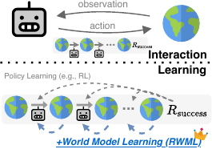
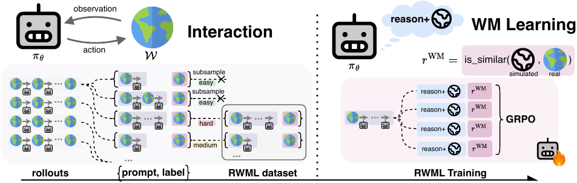
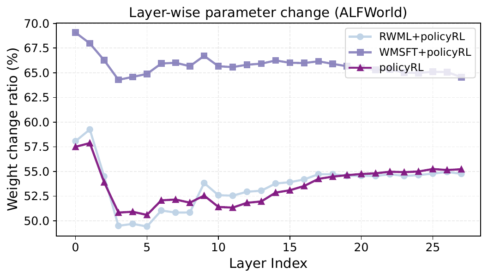
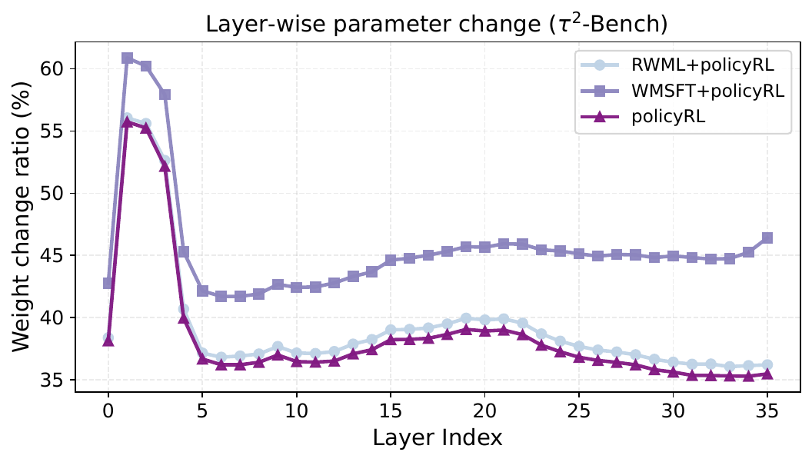
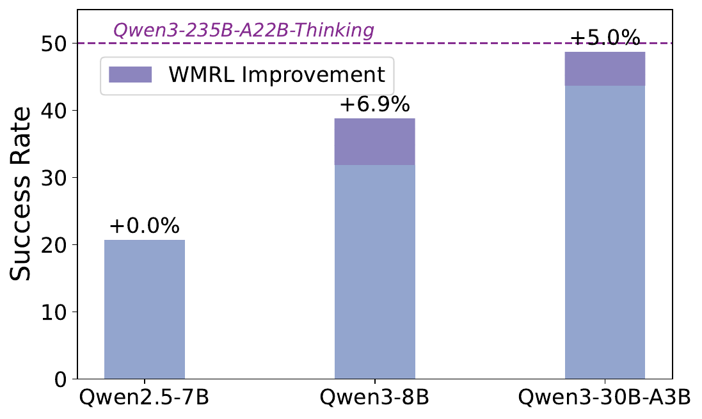

# Title: Reinforcement World Model Learning for LLM-based Agents

- ArXiv: 2602.05842
- Authors: Xiao Yu, Baolin Peng, Ruize Xu, Yelong Shen, Pengcheng He, Suman Nath, Nikhil Singh, Jiangfeng Gao, Zhou Yu
- Sections: 34
- Estimated tokens: 31.2k

## Contents

- [Abstract](#abstract)
- [1 Introduction](#1-introduction)
- [2 Method](#2-method)
  - [2.1 Notation](#21-notation)
  - [2.2 Reinforcement World Model Learning](#22-reinforcement-world-model-learning)
- [3 Experiments](#3-experiments)
  - [3.1 Experiment Setup](#31-experiment-setup)
    - [Benchmarks](#benchmarks)
    - [Baselines](#baselines)
    - [Models and Training Data](#models-and-training-data)
  - [3.2 Main Results](#32-main-results)
  - [3.3 RWML Forgets Less](#33-rwml-forgets-less)
  - [3.4 Ablation Studies](#34-ablation-studies)
- [4 Discussion](#4-discussion)
  - [4.1 Impact of RWML on Decision-Making](#41-impact-of-rwml-on-decision-making)
  - [4.2 Weight Change Analysis](#42-weight-change-analysis)
  - [4.3 Impact of Base Model Capability](#43-impact-of-base-model-capability)
- [5 Related Work](#5-related-work)
  - [Training Decision-Making Agents](#training-decision-making-agents)
  - [Training World Models](#training-world-models)
- [6 Conclusion](#6-conclusion)
- [7 Impact Statements](#7-impact-statements)

## Abstract

Large language models (LLMs) have achieved strong performance in language-centric tasks. However, in agentic settings, LLMs often struggle to anticipate action consequences and adapt to environment dynamics, highlighting the need for world-modeling capabilities in LLM-based agents. We propose Reinforcement World Model Learning (RWML), a self-supervised method that learns action-conditioned world models for LLM-based agents on textual states using sim-to-real gap rewards. Our method aligns simulated next states produced by the model with realized next states observed from the environment, encouraging consistency between internal world simulations and actual environment dynamics in a pre-trained embedding space. Unlike next-state token prediction, which prioritizes token-level fidelity (i.e., reproducing exact wording) over semantic equivalence and can lead to model collapse, our method provides a more robust training signal and is empirically less susceptible to reward hacking than LLM-as-a-judge. We evaluate our method on ALFWorld and $\tau^{2}$ Bench and observe significant gains over the base model, despite being entirely _self-supervised_. When combined with task-success rewards, our method outperforms direct task-success reward RL by 6.9 and 5.7 points on ALFWorld and $\tau^{2}$ Bench respectively, while matching the performance of expert-data training.

## 1 Introduction

Large language models (LLMs) have achieved remarkable success in a wide range of language-centric tasks, including question answering, code generation, and multi-step reasoning (Brown et al., 2020; Wei et al., 2022; Lample and Conneau, 2019; Rozière et al., 2024; DeepSeek-AI et al., 2025; OpenAI and et al., 2024). These advances have motivated growing interests in using LLMs as autonomous agents to interact with realistic environments and complete long-horizon tasks (Yao et al., 2023; Deng et al., 2023). Despite strong linguistic and reasoning abilities, LLM-based agents struggle in many agentic settings that require anticipating action consequences and adapting to environment dynamics (Liu et al., 2025). This discrepancy highlights the distinction between _language competence_ from pretraining and _agentic intelligence_ required for LLM-based agents.

> Figure 1: We propose RWML as a scalable, self-supervised method to improve the world modeling ability of LLM-based agent by learning from next-states, prior to downstream policy RL which learns from task-success reward.

A key reason for this limitation is the misalignment between standard pretraining objectives and agentic use cases. Standard pretraining objectives such as next-token prediction over static text corpora emphasize language understanding and generation. In contrast, modern LLM-based agents operate in complex, long-horizon environments, where successful task completion requires reasoning about both the current state and how the environment might evolve in response to actions (LeCun, 2022; Hu and Shu, 2023; Hao et al., 2023). The ability to model potential future outcomes of one’s actions is central to biological intelligence. Research in neuroscience and psychology shows that humans, animals, and intelligent systems use internal world models to reason, plan, explore, and learn efficiently from very few trials (Craik, 1944; Tolman, 1948; Daw et al., 2005; Daw and Dayan, 2014; Bennett, 2023). We believe this capacity for world modeling is likewise essential for effective reasoning and planning in LLM-based agents.

Recent work has explored equipping LLM-based agents with world-modeling capabilities, training LLMs to predict next-states using next-token prediction (i.e., SFT). Examples include Zhang et al. (2025a); Yu et al. (2025c) which teaches LLMs to model environment transitions using trajectories provided by expert policies or high-quality synthetic data generated with stronger language models. While effective in some settings, these methods face scalability challenges: (1) they rely heavily on high-quality data from experts/strong LLMs; and (2) they are based on SFT, which prioritizes token-level fidelity (i.e., reproducing exact wording) over semantic equivalence and can lead to model collapse.

In this paper, we propose Reinforcement World Model Learning (RWML), a self-supervised training method based on RL that learns action-conditioned world models for LLM-based agents. Rather than optimizing token-level fidelity with SFT, RWML trains LLMs to minimize the discrepancy between simulated next states produced by the model and realized next states observed from the environment, measured in a pre-trained embedding space. This sim-to-real alignment promotes semantic consistency between the agent’s internal world model and real environment dynamics while preserving task-relevant transitions, making them suitable for downstream decision-making. We evaluate our method on two long-horizon agent benchmarks (ALFWorld and $\tau^{2}$ Bench), and find RWML significantly improved the base model performance by 19.6 and 6.9 points without using any expert data, strong LLMs, or task-success reward signal. When combined with task-success rewards, agents trained with RWML outperform direct task-success reward RL by 6.9 and 5.7 points on ALFWorld and $\tau^{2}$ Bench, respectively, while matching the performance of training with expert data.

In summary, our contributions are: (1) We propose RWML as a scalable, self-supervised training method for LLM-based agents that learns action-conditioned world models from sim-to-real gap rewards. (2) We evaluate our method on two long-horizon benchmarks (ALFWorld and $\tau^{2}$ Bench) and find that RWML significantly improves base model performance. When combined with task-success rewards, our models outperform standard RL and match the performance of training with expert data. (3) We conduct comprehensive analyses — including ablation studies, model forgetting, qualitative analysis, and more — to highlight the benefits of RL and world model learning for LLM-based agents.

> Figure 2: Overview of RWML. Given a target model $\pi_{\theta}$, we first collect training data for RWML by using $\pi_{\theta}$ to gather rollouts $(s_{0},a_{0},s_{1},a_{1},...s_{T})$ with the environment, and then convert these rollouts into $\left\langle s_{\leq t},a_{t},s_{t+1}\right\rangle$ triplets for all $t$, after subsampling “too easy” samples defined in [Equation˜1](https://arxiv.org/html/2602.05842v2#S2.E1). We then train $\pi_{\theta}$ to reason as a world model via GRPO, using lightweight reward functions (e.g., embedding-based cosine similarity) to compare the predicted $\hat{s}_{t+1}$ with the real $s_{t+1}$.

## 2 Method

- [2.1 Notation](#21-notation)
- [2.2 Reinforcement World Model Learning](#22-reinforcement-world-model-learning)

### 2.1 Notation

Completing tasks in complex, long-horizon environments is typically formulated as a Markov Decision Process of $\left\langle\mathcal{S},\mathcal{A},\mathcal{T},\mathcal{R},\gamma\right\rangle$. In the generic setting of multi-step tasks, an LLM-powered agent $\pi_{\theta}$ receives a task instruction and an observation(^1^11Technically, any input to the agent from our environments is an observation (as in POMDP). However, to simplify notation we use $s$ to generally denote input data received from the environment.) from the environment $s_{t}\sim\mathcal{S}$, generates an action $a_{t}\sim\pi(\cdot|s_{t})$, and receives a new observation $s_{t+1}\sim\mathcal{S}$. During action generation, the model is often given up to $H$ turns of interaction history $\left\langle s_{t-H},a_{t-H},...,s_{t}\right\rangle$, and is allowed to think/reason before generating the next action $a_{t}$. This interaction process is repeated until the task completion or reaching a maximum number of steps, upon which a terminal reward $r_{T}\sim\mathcal{R}(a_{T},s_{T})$ is returned based on whether the task is failed/completed successfully. The discounting factor $\gamma\in(0,1]$ is used to discount and propagate future rewards during RL training. Note that since this work trains LLMs as world models, _we denote generated states as $\hat{s}_{t}$_ to distinguish them from real environment states $s_{t}$.

For example, in environments such as ALFWorld (Shridhar et al., 2021), an action $a_{t}$ may be “go to sidetable 1”, and the resulting state $s_{t+1}$ describes the outcome of that interaction, such as the objects currently available to agent (e.g., “You arrive at sidetable 1. On the sidetable you see a mug, a pepper shaker, and a tomato.”). In more complex environments such as $\tau^{2}$ Bench (Barres et al., 2025), an action $a_{t}$ could be a tool-call or a response to the user, and the next state $s_{t+1}$ returns either a tool response (often in json format), or a natural language response generated by the user simulator (powered by an LLM). For more details on each environment, please see [Appendices˜B](#appendix-b) and [C](#appendix-c), respectively.

### 2.2 Reinforcement World Model Learning

A key challenge in scaling agentic post-training methods such as RL is their reliance on accurate task-success rewards provided at the end of an episode. While effective, these rewards are sparse and require careful design by domain experts (Barres et al., 2025; Xie et al., 2024; Rawles et al., 2025; Zhou et al., 2024). As tasks and environments become more complex, this reliance introduces scaling challenges.

We introduce Reinforcement World Model Learning (RWML), a scalable, self-supervised training method where the agent learns accurate world model knowledge from the environment dynamics $\mathcal{T}$, before further finetuning with task-success reward RL. Intuitively, RWML trains an LLM policy $\pi_{\theta}$ to _also be able to reason about the consequences_ $\hat{s}_{t+1}$ given an action $a_{t}$ and a history $H$ of past interactions:

$$
(\mathrm{reason},\hat{s}_{t+1})\sim\pi_{\theta}(\cdot|s_{\leq t},a_{t});s_{\leq t}\equiv\left\langle s_{t-H},a_{t-H},...,s_{t}\right\rangle
$$

where “$\mathrm{reason}$” denotes reasoning tokens generated by the model before generating the final prediction of the next state $\hat{s}_{t+1}$. To evaluate the quality of the prediction, we use a simple binary(^2^22Empirically, we find that binarized rewards are more robust and less susceptible to hacking (see [Section 3.4](#section-3-4)).) reward function that compares the distance between $\hat{s}_{t+1}$ and the ground truth $s_{t+1}$:

$$
r^{\mathrm{WM}}(\hat{s}_{t+1},s_{t+1})=\begin{cases}1.0,&\text{if}d(\hat{s}_{t+1},s_{t+1})<\tau_{d},\\ 0.0,&\text{otherwise}.\end{cases}
$$

where $\tau_{d}$ is a hyperparameter, and $d$ is implemented mainly using an off-the-shelf embedding model $E(\cdot)$ with cosine similarity (Karpukhin et al., 2020; Zhang et al., 2025b):

$$
d(\hat{s}_{t+1},s_{t+1})=1-\cos(E(\hat{s}_{t+1}),E(s_{t+1})).
$$

To optimize this reward, we use standard GRPO (Shao et al., 2024; DeepSeek-AI et al., 2025):

$$
\displaystyle\mathbb{E}_{\pi_{\theta_{\mathrm{old}}}}\left[\min{\left(\rho_{\theta}A,\textrm{clip}(\rho_{\theta},1\pm\epsilon)A\right)}-\beta D_{\textrm{KL}}(\pi_{\theta}||\pi_{\theta_{\mathrm{ref}}})\right],
$$

where $\rho_{\theta}=\pi_{\theta}(y|x)/\pi_{\theta_{\mathrm{ref}}}(y|x)$ is the importance sampling ratio, $\beta$ is the KL regularization coefficient, and $A=[r^{\mathrm{WM}}-\textrm{mean}(r^{\mathrm{WM}})]/{\textrm{std}(r^{\mathrm{WM}})}$ is the group-relative advantage using our reward function. We note that the entire process does not require any expert data, stronger LLMs, or task-success reward signals.

To collect training data for RWML, we directly use the target model $\pi_{\theta}$ to gather rollouts $(s_{0},a_{0},s_{1},a_{1},...s_{T})$ with the environment, and then convert the rollouts into triplets of $\left\langle s_{\leq t},a_{t},s_{t+1}\right\rangle$ for all $t$. To improve coverage and diversity, we perform $N>1$ rollouts per training task. To help the model focus on learning non-trivial world model knowledge during RL, we follow intuitions from (Snell et al., 2024; Sun et al., 2025) and subsample the portion of the dataset that are “too easy” to learn. Specifically, we first use SFT to train a separate LLM $\pi^{\prime}_{\theta}$ capable of predicting $\hat{s}_{t+1}$ using 10% of the full dataset. Then, we use this $\pi^{\prime}_{\theta}$ to generate $\hat{s}_{t+1}$ on the other 90% of the dataset (i.e., the training split), subsampling training samples that consistently achieve high reward through $K=10$ attempts:

$$
\frac{1}{K}\sum\limits_{K}r^{\mathrm{WM}}(\hat{s}_{t+1},s_{t+1})\geq\tau_{\mathrm{easy}},(1)
$$

where $\tau_{\mathrm{easy}}$ is a hyperparameter. For “easy” samples above the threshold, we only include them in the final training split with probability $p=0.1$, prioritizing harder samples while preserving diversity. This resulting dataset is used for GRPO training in RWML, as described in the previous section. An overview of the entire process is shown in [Figure˜2](#figure-2).

## 3 Experiments

We evaluate RWML on two widely used long-horizon environments that require accurate world and tool understanding for effective planning and task completion.

- [3.1 Experiment Setup](#31-experiment-setup)
- [3.2 Main Results](#32-main-results)
- [3.3 RWML Forgets Less](#33-rwml-forgets-less)
- [3.4 Ablation Studies](#34-ablation-studies)

### 3.1 Experiment Setup

- [Benchmarks](#benchmarks)
- [Baselines](#baselines)
- [Models and Training Data](#models-and-training-data)

#### Benchmarks

We conduct experiments on two popular agent benchmarks, ALFWorld (Shridhar et al., 2021) and $\tau^{2}$ Bench (Barres et al., 2025). ALFWorld is a text-based embodied environment where the agent needs to locate and interact with objects to complete household tasks using natural language instructions. $\tau^{2}$ Bench is an interleaved tool-use environment where the model acts as a customer service agent and uses tool-calls to resolve issues while conversing to a simulated user who raised the issue. We use the official training and test splits provided by each benchmark for training and evaluation.

#### Baselines

We compare with other policy and world model related training methods from three categories: (1) learning from task-success reward; (2) learning from interaction/transition function $\mathcal{T}$, similar to our method; and (3) learning from expert annotations/stronger LLMs.

- 1. Learning from task-success reward: we consider Reinforced Finetuning (RFT) using rejection sampling and standard RL with task-success reward (Policy RL). RFT first uses the target model to rollout $N$ trajectories per training task and then performs SFT training only on the trajectories that correctly solved the task (Touvron et al., 2023; Zelikman et al., 2022). Policy RL directly uses GRPO to train the base model $\pi_{\theta}$ to optimize for task-success reward using online rollouts (Feng et al., 2025c; Yu et al., 2025a).
- 2. Learning from interaction/transition function: we consider World Model SFT (WM SFT) which uses identical training data as RWML, but trains the model to directly predict $s_{t+1}$ using SFT. Note that no reasoning is involved in WM SFT as only $s_{t+1}$ is available.
- 3. Learning from expert/strong LLMs: we consider Implicit World Modeling (IWM) and Self-Reflection (SR) from Zhang et al. (2025a); Yu et al. (2025c). Using expert rollouts $(s_{0},a^{*}_{0},s_{1},a^{*}_{1},...)$, these methods first augment them with alternative, non-optimal action-state pairs $(s_{t},a^{\prime}_{t})$ generated by the target model $\pi_{\theta}$. Then, either these data are converted to next-state prediction triplets $\left\langle s_{\leq t},a_{t},s_{t+1}\right\rangle$ for WM learning, or a strong LLM is used to synthesize reasoning data (contrasting expert actions with alternative non-optimal actions) for reflection learning. Finally, these data are combined with the expert policy data (i.e., predict $a^{*}_{t+1}$), and SFT is used to train on the combined dataset. Since these two methods heavily rely on expert rollouts, we also consider a simpler baseline that directly learns the expert policy using SFT (denoted as “Imitation Learning”). For more implementation details, please refer to [Sections˜B.3](https://arxiv.org/html/2602.05842v2#A2.SS3) and [C.4](https://arxiv.org/html/2602.05842v2#A3.SS4).

In addition to these training-based methods, we also evaluate ReACT-style prompting (Yao et al., 2023) on closed-source LLMs such as GPT-5 (Singh et al., 2025) as additional references. For a more high-level comparison between these methods and our approach, please see [Table˜A1](#table-1).

> Table 1: Performance on ALFWorld and $\tau^{2}$ Bench. All results are averaged over 3 runs, with a maximum step of 30. Our methods are highlighted in gray. \*We use Qwen3-235B-A22B-instruct for ALFWorld, and Qwen3-235B-A22B-thinking for $\tau^{2}$ Bench.

| Method                                      | ALFWorld     | $\tau^{2}$ Bench |              |              |              |              |              |
| ------------------------------------------- | ------------ | ---------------- | ------------ | ------------ | ------------ | ------------ | ------------ |
| ID                                          | OOD          | AVG              | Retail       | Telecom      | Airline      | AVG          |              |
| ReACT(Qwen2.5-7B)                           | 16.2$\pm$1.0 | 6.8$\pm$2.0      | 13.0$\pm$1.3 | 15.0$\pm$2.0 | 27.5$\pm$0.0 | 18.3$\pm$2.4 | 20.7$\pm$0.9 |
| ReACT(Qwen3-8B)                             | 40.9$\pm$1.5 | 31.3$\pm$2.6     | 37.7$\pm$1.8 | 37.7$\pm$4.9 | 31.2$\pm$4.2 | 21.6$\pm$5.2 | 31.9$\pm$2.9 |
| ReACT(Qwen3-235B\*)                         | 38.0$\pm$0.4 | 32.3$\pm$2.7     | 36.1$\pm$0.7 | 50.6$\pm$2.7 | 48.8$\pm$3.8 | 51.3$\pm$5.5 | 50.0$\pm$3.4 |
| ReACT(GPT-4.1)                              | 42.5$\pm$1.0 | 47.4$\pm$0.7     | 44.1$\pm$0.5 | 55.8$\pm$2.4 | 41.7$\pm$4.3 | 48.3$\pm$2.4 | 48.7$\pm$4.5 |
| ReACT(GPT-5)                                | 51.6$\pm$1.3 | 44.8$\pm$0.7     | 49.3$\pm$0.9 | 55.8$\pm$7.2 | 65.0$\pm$5.4 | 55.0$\pm$4.1 | 59.3$\pm$0.5 |
| _Learning from task success reward_         |              |                  |              |              |              |              |              |
| RFT                                         | 34.4$\pm$3.8 | 34.4$\pm$3.4     | 34.4$\pm$2.6 | 43.3$\pm$3.1 | 33.3$\pm$3.1 | 13.3$\pm$2.4 | 33.3$\pm$1.7 |
| Policy RL                                   | 82.1$\pm$3.6 | 79.2$\pm$2.0     | 81.0$\pm$1.6 | 40.8$\pm$1.2 | 39.2$\pm$1.2 | 30.0$\pm$8.2 | 38.0$\pm$1.6 |
| _Self-Supervised_                           |              |                  |              |              |              |              |              |
| WM SFT                                      | 3.1$\pm$0.0  | 2.1$\pm$0.7      | 2.8$\pm$0.3  | 32.3$\pm$5.3 | 24.1$\pm$6.1 | 26.9$\pm$6.6 | 27.9$\pm$3.1 |
| \rowcolorlight-gray RWML (ours)             | 34.4$\pm$0.6 | 29.2$\pm$7.5     | 32.6$\pm$2.1 | 40.8$\pm$4.0 | 40.5$\pm$4.9 | 31.3$\pm$6.7 | 38.8$\pm$2.5 |
| _Self-Supervised + Policy RL_               |              |                  |              |              |              |              |              |
| WM SFT + Policy RL                          | 76.2$\pm$3.4 | 82.3$\pm$0.7     | 80.4$\pm$1.5 | 40.8$\pm$4.2 | 45.0$\pm$5.4 | 30.0$\pm$7.1 | 40.3$\pm$3.9 |
| \rowcolorlight-gray RWML + Policy RL (ours) | 86.7$\pm$2.8 | 90.1$\pm$0.7     | 87.9$\pm$1.6 | 44.2$\pm$2.1 | 45.8$\pm$2.4 | 38.3$\pm$2.4 | 43.7$\pm$2.1 |

> Table 2: Comparing ours against training methods that uses expert data/strong LLMs. Imitation Learning, IWM, and SR are reproduced following Zhang et al. (2025a), which reports 78.1, 82.8, 82.0 for ID and 64.1, 70.3, 71.1 for OOD on ALFWorld, respectively. Highest score is in bold, second highest score is in _underline_. Our models show competitive performance without using expert/strong LLM data.

| Method                                      | ALFWorld       | $\tau^{2}$ Bench |                |                |                |                |                |
| ------------------------------------------- | -------------- | ---------------- | -------------- | -------------- | -------------- | -------------- | -------------- |
| ID                                          | OOD            | AVG              | Retail         | Telecom        | Airline        | AVG            |                |
| _Learning from experts/strong LLMs_         |                |                  |                |                |                |                |                |
| Imitation Learning                          | 84.9$\pm$1.9   | 77.6$\pm$3.2     | 82.5$\pm$2.3   | 48.3$\pm$1.2   | 41.7$\pm$3.1   | 38.3$\pm$2.4   | _43.7_$\pm$1.3 |
| IWM                                         | _85.6_$\pm$1.6 | 78.1$\pm$1.6     | 83.1$\pm$1.0   | 40.8$\pm$4.3   | 44.2$\pm$5.1   | 46.7$\pm$2.4   | 43.3$\pm$2.6   |
| SR                                          | 83.9$\pm$1.0   | _82.3_$\pm$0.7   | _83.3_$\pm$0.4 | _45.0_$\pm$3.5 | 45.8$\pm$8.3   | _43.3_$\pm$2.4 | 45.0$\pm$3.6   |
| _Self-Supervised + Policy RL_               |                |                  |                |                |                |                |                |
| WM SFT + Policy RL                          | 76.2$\pm$3.4   | _82.3_$\pm$0.7   | 80.4$\pm$1.5   | 40.8$\pm$4.2   | _45.0_$\pm$5.4 | 30.0$\pm$7.1   | 40.3$\pm$3.9   |
| \rowcolorlight-gray RWML + Policy RL (ours) | 86.7$\pm$2.8   | 90.1$\pm$0.7     | 87.9$\pm$1.6   | 44.2$\pm$2.1   | 45.8$\pm$2.4   | 38.3$\pm$2.4   | _43.7_$\pm$2.1 |

#### Models and Training Data

Following prior work (Feng et al., 2025c; Yu et al., 2025a; Zhang et al., 2025a), we train from Qwen2.5-7B-Instruct (Qwen et al., 2025) on ALFWorld for all methods. On $\tau^{2}$ Bench, we train from Qwen3-8B (Yang et al., 2025) for all methods, due to the difficulty of the benchmark and the enhanced tool-use capabilities from Qwen3 models.

For RWML, we collect interaction data using $\pi_{\theta}$ to rollout $N$ trajectories per training task with temperature $\tau=1.0$, with $N=3$ for ALFWorld and $N=6$ for $\tau^{2}$ Bench. Then, we split all turns into triplets of $\left\langle s_{\leq t},a_{t},s_{t+1}\right\rangle$ for all $t$, using 90% of the triplets for training and 10% for validation. Finally, we subsample “simple” training samples using a $\tau_{\mathrm{easy}}$ that corresponds to $\sim$30% of the training data for both benchmarks. In contrast to our baselines, we note that the entire process does not require any expert annotation/stronger LLMs nor require task success/failure signals. Only triplets of $\left\langle s_{\leq t},a_{t},s_{t+1}\right\rangle$ are required.

Finally, for Policy RL training, we use GRPO to let the model learn to solve the tasks using task-success rewards with $\gamma=1.0$. For ALFWorld, we follow prior work (Yu et al., 2025a) and allow a maximum of 30 steps per task. For $\tau^{2}$ Bench, due to cost concerns we train and evaluate using Qwen3-235B-A22B-Instruct (Yang et al., 2025) as the user simulator, and allow a maximum step of 30 per task. For evaluation results using the official setting (GPT-4.1 as user simulator), please refer to [Section˜C.3](https://arxiv.org/html/2602.05842v2#A3.SS3). All trainings are performed with B200 GPUs. For more training and hyperparameter details, please see [Appendix˜B](#appendix-b) and [Appendix˜C](#appendix-c) for ALFWorld and $\tau^{2}$ Bench, respectively.

### 3.2 Main Results

In [Table˜1](#table-1) we demonstrate the effectiveness of RWML as a self-supervised method, trained solely from interaction data. Without using any expert data, strong LLMs, or task-success reward signals, RWML significantly improved agentic capability compared to the base model, advancing 19.6 and 7.9 points on ALFWorld and $\tau^{2}$ Bench, respectively. When combined with task-success reward (i.e., Policy RL), we find our models outperform all other training-based baselines. Notably, in [Table˜2](#table-2) we find (1) on ALFWorld, our models even outperform approaches that use expert annotations/strong LLMs; and (2) on $\tau^{2}$ Bench, our models achieve the second best overall score, despite not accessing any expert data/strong LLMs. This demonstrates the effectiveness of RWML, whose scalable, self-supervised design represents a promising direction for “mid-training” algorithms that can complement post-training methods such as Policy RL to further improve LLM-based agent performance.

### 3.3 RWML Forgets Less

In [Table˜3](#table-3), we evaluate relative susceptibility of RL and SFT to catastrophic forgetting (Kirkpatrick et al., 2017; Luo et al., 2025c) in the context of world model learning. We evaluate our models trained on ALFWorld and $\tau^{2}$ Bench on (1) general knowledge benchmarks such as MMLU-Redux (Gema et al., 2025) and IFEval (Zhou et al., 2023); (2) math and STEM problems such as MATH-500 (Lightman et al., 2023), GSM8k (Cobbe et al., 2021), and GPQA-Diamond (Rein et al., 2023); and (3) coding tasks such as LiveCodeBench (Jain et al., 2024). In [Table˜3](#table-3), we find RWML leads to less model forgetting compared to WM SFT on nearly all benchmarks. We believe this is consistent with findings from prior work (Shenfeld et al., 2025; Chen et al., 2025a), that online RL preserves prior knowledge and capabilities significantly better than SFT due to its on-policy nature. For more analysis on model parameter updates, please see [Section˜4.2](#section-4-2).

### 3.4 Ablation Studies

In [Table˜4](#table-4) we present an ablation study to investigate the contribution of different components in our RWML. Specifically, we consider: (1) replacing our embedding-based reward with LLM-as-a-judge (Zheng et al., 2023); (2) removing the data subsampling step which subsamples “too easy” samples, denoted as “w/o subsample”; (3) removing the RWML training entirely, denoted as “w/o training”. For LLM-as-a-judge, we consider two variants: prompting the LLM to compare the generated $\hat{s}_{t+1}$ with the ground truth $s_{t+1}$ and return a _real-valued reward_ $r\in[0,1]$, allowing for partial credits. We denote this as “w/ LLM-as-a-judge”. Alternatively, we prompt the LLM to return a _binary reward_ of either 0.0 or 1.0. We denote this as “w/ bin(LLM-as-a-judge)”. In both cases, we use Qwen-3-235B-A22B-Instruct (Yang et al., 2025) as the judge model as it is a fast, strong, open-source LLM that can be hosted locally.

Results in [Table˜4](#table-4) show that all components of our method are important in improving model performance. Additionally, we find that (1) weaker models such as Qwen2.5-7B are more susceptible to data quality/noisy reward functions; (2) LLM-as-a-judge is unreliable and can sometimes be hacked during training (see [Appendix˜D](#appendix-d) for an example); and (3) subsampling “easy” training samples is beneficial to further improve model performance.

> Table 3: Measuring forgetting after training on ALFWorld and $\tau^{2}$ Bench. For LiveCodeBench, we use questions between 2025-01-01 and 2025-04-30. Evaluation is done with temperature of 1.0 and max response length of 16k using EvalScope (ModelScope, 2024). Largest performance degradation ($\Delta$) is highlighted in dark red. Best viewed in color.

|              |               | ALFWorld                                 | $\tau^{2}$ Bench                          |                                           |                                          |                                           |                                           |
| ------------ | ------------- | ---------------------------------------- | ----------------------------------------- | ----------------------------------------- | ---------------------------------------- | ----------------------------------------- | ----------------------------------------- |
|              |               | Qwen2.5-7B                               | +WM SFT                                   | +RWML                                     | Qwen3-8B                                 | +WM SFT                                   | +RWML                                     |
| General      | MMLU-Redux    | 77.26                                    | \cellcolorforgetDark67.16($\Delta$-10.10) | \cellcolorforgetLight74.88($\Delta$-2.38) | 87.75                                    | \cellcolorforgetDark87.02($\Delta$-0.73)  | \cellcolorforgetLight87.42($\Delta$-0.33) |
| IFEval       | 71.34         | \cellcolorforgetDark68.39($\Delta$-2.95) | \cellcolorforgetLight69.32($\Delta$-2.02) | 84.46                                     | \cellcolorforgetDark82.07($\Delta$-2.39) | \cellcolorforgetLight83.36($\Delta$-1.10) |                                           |
| Math & STEM  | MATH-500      | 75.40                                    | \cellcolorforgetDark71.60($\Delta$-3.80)  | 75.40($\Delta$0.00)                       | 92.80                                    | 92.80($\Delta$0.00)                       | 92.80($\Delta$0.00)                       |
| GSM8k        | 91.66         | \cellcolorforgetDark90.45($\Delta$-1.21) | \cellcolorforgetLight91.28($\Delta$-0.38) | 96.13                                     | \cellcolorforgetDark95.53($\Delta$-0.60) | \cellcolorforgetLight95.68($\Delta$-0.45) |                                           |
| GPQA-Diamond | 32.83         | \cellcolorforgetDark25.25($\Delta$-7.58) | \cellcolorforgetLight28.79($\Delta$-4.05) | 59.09                                     | \cellcolorforgetDark57.07($\Delta$-2.02) | \cellcolorforgetLight58.08($\Delta$-1.01) |                                           |
| Coding       | LiveCodeBench | 19.23                                    | \cellcolorforgetDark15.38($\Delta$-3.85)  | \cellcolorforgetLight16.48($\Delta$-2.75) | 43.41                                    | \cellcolorforgetDark41.21($\Delta$-2.20)  | 43.41($\Delta$0.00)                       |

> Table 4: Ablation studies on RWML. We use Qwen2.5-7B-Instruct on ALFWorld and Qwen3-8B on $\tau^{2}$ Bench. We find that stronger base models (e.g., Qwen3-8B on $\tau^{2}$ Bench) is less susceptible to data quality/reward hacking, and that subsampling “too easy” training samples is beneficial to further improve performance.

| Method                   | ALFWorld     | $\tau^{2}$ Bench |              |              |              |              |              |
| ------------------------ | ------------ | ---------------- | ------------ | ------------ | ------------ | ------------ | ------------ |
| ID                       | OOD          | AVG              | Retail       | Telecom      | Airline      | AVG          |              |
| RWML (ours)              | 34.4$\pm$0.6 | 29.2$\pm$7.5     | 32.6$\pm$2.1 | 40.8$\pm$4.0 | 40.5$\pm$4.9 | 31.3$\pm$6.7 | 38.8$\pm$2.5 |
| - w/ bin(LLM-as-a-judge) | 21.9$\pm$2.4 | 9.9$\pm$1.9      | 14.5$\pm$1.3 | 30.0$\pm$5.4 | 34.2$\pm$1.2 | 28.3$\pm$4.7 | 31.3$\pm$2.9 |
| - w/ LLM-as-a-judge      | 3.9$\pm$1.0  | 3.0$\pm$1.2      | 3.6$\pm$1.3  | 36.1$\pm$2.5 | 34.2$\pm$4.3 | 21.7$\pm$4.7 | 33.7$\pm$3.9 |
| - w/o subsample          | 3.1$\pm$1.3  | 2.6$\pm$1.5      | 2.9$\pm$1.0  | 39.2$\pm$6.2 | 40.0$\pm$2.0 | 28.3$\pm$6.2 | 36.3$\pm$2.5 |
| - w/o training           | 16.2$\pm$1.0 | 6.8$\pm$2.0      | 13.0$\pm$1.3 | 37.7$\pm$4.9 | 31.2$\pm$4.2 | 21.6$\pm$5.2 | 31.9$\pm$2.9 |

## 4 Discussion

> (a) ALFWorld

- [4.1 Impact of RWML on Decision-Making](#41-impact-of-rwml-on-decision-making)
- [4.2 Weight Change Analysis](#42-weight-change-analysis)
- [4.3 Impact of Base Model Capability](#43-impact-of-base-model-capability)

### 4.1 Impact of RWML on Decision-Making

In this section, we provide some qualitative and quantitative analyses of model’s decision-making behavior before and after RWML training. Qualitatively, in [Figure˜5](#figure-5) we find RWML-trained models produce more accurate and efficient decisions, utilizing its improved knowledge about the environment. For example, in ALFWorld, our model correctly predicts that a “knife” is most likely on “countertop” rather than other locations, completing the task within 5 steps. In $\tau^{2}$ Bench, it correctly considers the possibility that the airplane mode is on — a case omitted by the base model.

Quantitatively, we find RWML effectively mitigates generating invalid/ineffective actions on both benchmarks, despite not being explicitly trained to do so. On ALFWorld, the proportion of invalid (e.g., formatting errors) or inefficient actions (e.g., “look” and “examine” actions) drops from 59.30% to 39.45% after RWML. Similarly, on $\tau^{2}$ Bench, the proportion of invalid tool calls (e.g., made-up tool names or incorrect arguments) decreases from 24.90% to 8.84% per tool-call made. Overall, our qualitative and quantitative results demonstrate that RWML meaningfully improves the decision-making ability of an LLM in agentic environments.

> Figure 4: RWML training with different base models on $\tau^{2}$ Bench.

### 4.2 Weight Change Analysis

To understand the effectiveness of RWML, we also analyze how it reshapes model parameters during training. Following Zhu et al. (2025), we examine parameter-wise weight changes relative to the untrained base model, adopting the same definition and threshold $\eta=10^{-3}$ to identify major point-wise updates:

$$
|\hat{w_{i}}-w_{i}|>\eta\cdot\max(|w_{i}|,|\hat{w_{i}}|),
$$

where $w_{i},\hat{w_{i}}\in\mathbb{R}$ are finite, non-zero scalars of models’ weight points before and after tuning.

For each layer, we compute the ratio of parameters that undergo major updates. Results for Qwen3-8B on $\tau^{2}$-Bench and Qwen2.5-7B-Instruct on ALFWorld are shown in [Figure˜3](#figure-3). Full results are in [Appendix˜E](#appendix-e). A consistent pattern emerges that RWML induces notably fewer parameter changes across layers compared to WM SFT, indicating that it encodes task-relevant information with a smaller and more targeted set of updates (also see [Appendix˜E](#appendix-e)). This suggests that RWML learns in a more parameter-efficient and structurally conservative manner, avoiding widespread modifications to the pretrained representation space.

Importantly, this compact update behavior also help explain why RWML integrates well with subsequent policy learning, as shown in [Figure˜3](#figure-3). When followed by Policy RL, the resulting weight-change ratios remain remarkably close to those of Policy RL applied directly to the base model. In contrast, models initialized with WM SFT exhibit substantially higher change ratios after policy optimization, reflecting stronger parametric interference. These observations suggest that RWML maintains a parameter landscape more compatible with policy learning, reducing conflict and redundancy during post-training.

Overall, we find this parameter update behavior of RWML is consistent across both benchmarks and largely invariant to different transformer components, including attention (Q/K/V/O) and MLP projection layers (see [Appendix˜E](#appendix-e)). The consistently lower change ratio of RWML-trained models compared to that of WM SFT also aligns with our findings in [Section˜3.3](#section-3-3), which shows that RWML better mitigates catastrophic forgetting. These results provide a perspective distinct from the conventional SFT-then-RL paradigm: applying RL in both “mid-training” and post-training stages appears to produce more stable and consistent parameter updates, and may help explain the improved performance.

### 4.3 Impact of Base Model Capability

On the challenging $\tau^{2}$ bench, we find the ability to learn and transfer world model knowledge from RWML to decision-making is dependent on the capability of the base model. In [Figure˜4](#figure-4), we perform RWML training with three different base models: Qwen2.5-7B, Qwen3-8B, and Qwen3-30B-A3B(^3^33We use Qwen3-30B-A3B-Thinking-2507, an enhanced version of Qwen3-30B-A3B post-trained with additional reasoning and agent data, leaving less room for further improvement.). We find that weaker models like Qwen2.5-7B struggle to transfer world knowledge to decision-making on the challenging $\tau^{2}$ Bench, while stronger models (Qwen3-8B and Qwen3-30B-A3B) show substantial gains, approaching the performance of Qwen3-235B-A22B-Thinking-2507. This suggests that RWML is most effective for (sufficiently) strong base models. We leave improving transfer abilities for weaker models to future work.

> Figure 5: After RWML, models produce more accurate and efficient decisions by leveraging its improved knowledge of the environment.

## 5 Related Work

- [Training Decision-Making Agents](#training-decision-making-agents)
- [Training World Models](#training-world-models)

#### Training Decision-Making Agents

LLM-based agents (Yao et al., 2023; Shinn et al., 2023) has seen wide applications in domains such as interactive gaming (Wang et al., 2023; Feng et al., 2025c); software engineering (Jimenez et al., 2024; Yang et al., 2024); computer, phone, browser-use (Xie et al., 2024; Rawles et al., 2025; Zhou et al., 2024; Yu et al., 2025b), and more. Many early work on training language agents primarily rely on imitation learning (i.e., SFT), using either demonstrations from human experts (Deng et al., 2023; Chen et al., 2025b; Wang et al., 2025a) or trajectories synthesized from stronger LLMs often accompanied with a set of manually designed workflows/heuristics (Zeng et al., 2023; Chen et al., 2024; Su et al., 2025; Xu et al., 2025). While high-quality SFT data offers dense supervision signals, it is difficult to scale due to the high cost of collecting such demonstrations. Alternatively, recent efforts in RL bypasses the need for step-by-step demonstrations and instead directly learn from terminal rewards (i.e., task success) through trail and error. Recent work include Feng et al. (2025a); Tan et al. (2025); Luo et al. (2025a); Jin et al. (2025); Wang et al. (2025b), often powered by algorithms such as PPO (Schulman et al., 2017) and GRPO (Shao et al., 2024). However, designing task-success reward functions in complex environments still requires substantial human expertise (Chowdhury et al., 2024; Xie et al., 2024; Gou et al., 2025), limiting scalability. Together, these works motivate the need for more scalable training methods to bridge the gap between next-token-prediction pretrained models and their downstream applications in long-horizon agentic environments.

#### Training World Models

Beyond task-success rewards, real-world interaction data contains rich information that can be used to help decision-making. Early examples include Dyna algorithms (Sutton, 1991) which separately trains a world model to combine model-based with model-free learning for efficient policy training. Recent applications on LLM agents either train a _separate_ world model to support inference-time algorithms such as MCTS (Hao et al., 2023; Wu et al., 2025; Chae et al., 2025; Gu et al., 2025), or jointly learn world models and policies within a single model to improve generalization (FAIR CodeGen team et al., 2025; Zhang et al., 2025a; Yu et al., 2025a, c; Feng et al., 2025b; Li et al., 2025; Qian et al., 2026). However, these approaches either require expensive training/inference of multiple models, or rely on additional annotations from experts/strong LLMs during world model learning. We propose RWML as a scalable, _self-supervised_ method to improve the world knowledge and decision-making ability of a single model.

## 6 Conclusion

We propose RWML, a scalable, self-supervised method that enhances the environment understanding and decision-making ability of LLM-based agents prior to downstream RL with task-success reward. Without expert/strong LLM annotations or task-success signals, RWML trains the LLM as an action-conditioned world model by aligning the simulated next states with observed environment states in a pre-trained embedding space. We evaluate RWML on two long-horizon agent benchmarks, ALFWorld and $\tau^{2}$ Bench, and find significant performance gains while using only interaction data. When combined with task-success rewards in policy RL, our method outperforms direct policy RL on both benchmarks and matches training with expert data. We believe our work opens up new avenues for scalable, self-supervised training methods to further advance LLM-based agents in the era of agentic RL.

## 7 Impact Statements

This paper presents work that aims to advance the agentic capabilities of LLM-based agents through a scalable, self-supervised method. While most LLM-based agent methods are not designed for unethical use, their applications and data collection processes may still pose risks of misuse. In this work, we propose RWML, which improves world modeling in LLM-based agents using interaction data without expert annotations or stronger LLMs, and is trained exclusively on established, isolated benchmarks without real-world impact. We believe that developing guardrails, such as safety filters (OpenAI, 2022; Inan et al., 2023; Luo et al., 2025b), and using isolated environments like sandboxes (AgentInfra Team, 2025; Pan et al., 2025), is essential for safe AI agent research. We do not condone the use of RWML or its constituent methods for any unlawful or morally unjust purposes.
