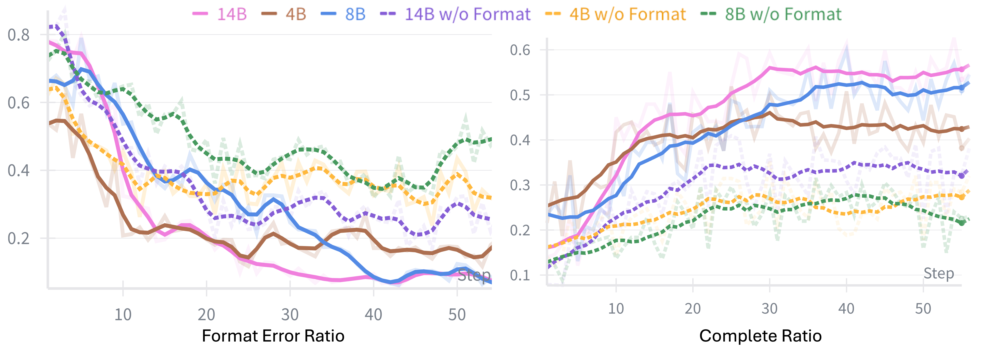
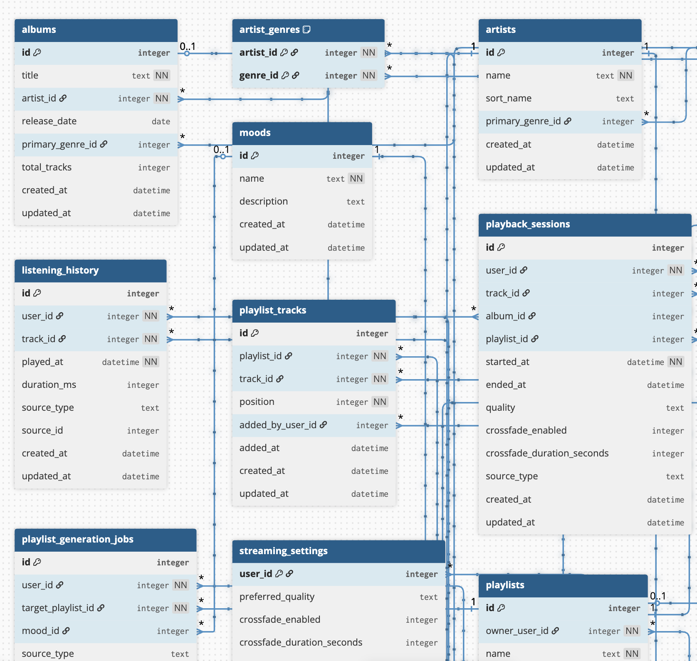

## Appendix A Implementation Details

- [A.1 Scenario Generation](#a1-scenario-generation)
- [A.2 Task Generation](#a2-task-generation)
- [A.3 Environment Synthesis](#a3-environment-synthesis)
- [A.4 Tool Calling Format and Validation](#a4-tool-calling-format-and-validation)
- [A.5 Training and Evaluation Details](#a5-training-and-evaluation-details)

### A.1 Scenario Generation

We adopt a Self-Instruct style expansion (Wang et al., 2023) to scale from 100 seed websites to 1,000 diverse scenarios. The seed set is drawn from popular domain names(^1^11[https://www.similarweb.com/top-websites/](https://www.similarweb.com/top-websites/)), and the LLM generates new candidates conditioned on few-shot examples that emphasize stateful, database-backed interactions. To maintain diversity, we apply two complementary filters: (1) an LLM classifier that scores each candidate on suitability for CRUD operations (create, read, update, delete), rejecting content-centric or read-only scenarios (e.g., news), and (2) embedding-based deduplication using cosine similarity with a threshold of 0.85, ensuring newly generated scenarios are sufficiently distinct from the existing pool. We also enforce category caps to prevent over-representation of dominant types such as e-commerce. The prompts used for generation and classification are provided in Figures [10](https://arxiv.org/html/2602.10090v2#A2.F10) and [11](https://arxiv.org/html/2602.10090v2#A2.F11). Table [9](#table-9) shows a random sample of 100 generated scenarios. We also show the distribution of the synthesized scenarios in Figure [7](https://arxiv.org/html/2602.10090v2#A2.F7) and the wordcloud of the scenario descriptions in Figure [7](https://arxiv.org/html/2602.10090v2#A2.F7). The distribution shows that the synthesized scenarios span diverse domains without collapsing to a few dominant types.

### A.2 Task Generation

For each scenario, we prompt the LLM to generate $k=10$ diverse user tasks that serve as functional requirements for downstream synthesis. This modest count keeps the database schema and toolset implementation tractable for LLMs. The prompt enforces two constraints: (1) tasks must be API-solvable without UI dependencies such as clicking or page navigation, and (2) tasks assume post-authentication context to unlock deeper functionalities. Each task is required to be specific and self-contained, including concrete parameters (e.g., product IDs, user names) so that it can be executed without additional clarification. This requirement-driven design ensures that the subsequently generated database schema and toolset are aligned with actual user needs rather than being over-specified or incomplete. The prompt template is shown in Figure [12](https://arxiv.org/html/2602.10090v2#A2.F12). And the generated tasks are shown in Table [11](#table-11).

### A.3 Environment Synthesis

This section details the synthesis of the three core POMDP components: state space (database), action and observation spaces (interface), and reward function (verification).

Database Schema Generation. Given the scenario description and task set $\mathcal{T}_{E_{i}}$, the LLM infers the minimal relational schema required to make all tasks feasible. The output is a set of SQLite DDL statements defining tables, columns, types, primary keys, foreign keys, and indexes. We instruct the LLM to reason about entity relationships implied by the tasks (e.g., a “cancel order” task implies an Orders table with a status column) and to avoid authentication-related fields. Based on the introduced self-correction mechanism, we attempt to run the generated DDL statements in an isolated environment and test the functionality. If any DDL statement fails execution, we capture the error message, summarize it via a separate LLM call, and append the summary to the prompt for regeneration. This feedback loop repeats with an error threshold of 10%: if fewer than 10% of tables fail, we accept the schema. The prompt is shown in Figure [13](https://arxiv.org/html/2602.10090v2#A2.F13). And we visualize part of the SQLite database schema with sample data in Figure [8](https://arxiv.org/html/2602.10090v2#A2.F8).

Sample Data Synthesis. An empty schema is insufficient for task execution, since many tasks require querying or updating existing records. We synthesize sample data by prompting the LLM to analyze task preconditions and generate INSERT statements that satisfy them. For example, if a task requires “updating product inventory,” the synthesized data must include at least one product with a non-zero stock level. The LLM outputs a JSON structure containing table names and corresponding INSERT statements, which are executed in dependency order respecting foreign key constraints. We apply the same error-feedback loop as schema generation, with an error threshold of 10% for acceptable insert failures. The prompt is shown in Figures [14](https://arxiv.org/html/2602.10090v2#A2.F14) and [15](https://arxiv.org/html/2602.10090v2#A2.F15).

Interface Specification Design. Before generating implementation code, we first synthesize an interface specification that defines the toolset schema. This two-stage approach (schema then code) reduces hallucination in long code generation, since pilot experiments show that direct code generation for environments with 30+ tools often produces inconsistent interfaces. Given the task set and database schema, the LLM infers the minimal set of endpoints required to make every task executable. Each endpoint specification includes: name, method, path, summary, typed input parameters, and response schema. The specification also serves as documentation for agents at inference time, shown in Table [B.2](https://arxiv.org/html/2602.10090v2#A2.SS2). The prompt is shown in Figures [16](https://arxiv.org/html/2602.10090v2#A2.F16) and [17](https://arxiv.org/html/2602.10090v2#A2.F17), and an example of the synthesized MCP toolset is shown in Figure [25](https://arxiv.org/html/2602.10090v2#A2.F25).

Environment Implementation. With the API specification and database schema, we generate a complete Python file implementing an MCP server. The generated code includes: SQLAlchemy ORM models mirroring the database schema, Pydantic request/response models, and FastAPI endpoint handlers that perform database operations. Each environment averages about 2,000 lines of code and exposes 35 tools on average. After generation, we validate the environment by launching and checking that the MCP server starts successfully and responds to health checks and “list tools” calls. Failed environments enter the self-correction loop to fix the errors. The prompt is shown in Figures [18](https://arxiv.org/html/2602.10090v2#A2.F18), [19](https://arxiv.org/html/2602.10090v2#A2.F19), and [20](https://arxiv.org/html/2602.10090v2#A2.F20).

Verification Code Synthesis. For each task, we generate a Python verification function that compares database states before and after agent execution. The function takes two database paths (initial and final) as input, executes SQL queries to extract task-relevant information, and returns a structured dictionary containing: changed records, expected outcomes, and diagnostic signals. We also generate success and failure criteria in natural language that guide the LLM-as-a-Judge in interpreting the verification results. During RL training, this code-augmented verification provides grounded evidence to the judge, reducing hallucination in reward assignment. The prompt for generating the verification code is shown in Table [21](https://arxiv.org/html/2602.10090v2#A2.F21), and the example of the synthesized verification code is shown in Figure [26](https://arxiv.org/html/2602.10090v2#A2.F26) and [27](https://arxiv.org/html/2602.10090v2#A2.F27).

Self-Correction Mechanism. All synthesis stages share a common error-recovery pattern. When generated code fails execution, we capture the full error traceback and invoke a separate LLM call to produce a concise error summary (typically 200-500 tokens) that identifies the root cause and suggests fixes. This summary is appended to the original prompt for the next generation attempt. We limit retries to 5 iterations per component. If an error threshold (10% for schema/data, 0% for environment startup) is exceeded after all retries, we select the best attempt based on error rate and proceed. This approach achieves over 85% first-attempt success rate across all stages, with an average of 1.13 correction iterations for failed cases.

### A.4 Tool Calling Format and Validation

We adopt the Qwen3 tool-calling format (Yang et al., 2025), which wraps each tool invocation in XML tags: “<tool_call>{name: …, arguments: …}</tool_call>”. Rather than exposing all environment-specific tools directly to the agent, we design a two-level abstraction that decouples the agent from environment details.

Two-Level Tool Abstraction The agent interacts with MCP environments through exactly two meta-tools: (1) list_tools, which queries the MCP server to retrieve all available tools in the current environment along with their metadata (input/output schemas, descriptions), and (2) call_tool, which invokes an environment-specific tool by name with the required arguments passed as a JSON string. This design enables the agent to dynamically discover and invoke different toolsets across environments without hardcoding any tool information. The complete system prompt is shown in Figure [9](https://arxiv.org/html/2602.10090v2#A2.F9).

Format Validation Rules During RL training, we enforce format constraints to ensure well-formed tool calls and prevent hallucinated or malformed interactions. We apply rule-based validation at each step of the trajectory, classifying it as either valid, a format error, or an environment/server error. The validation checks the following conditions: (1) Reasoning format: All assistant messages must contain non-empty reasoning within <think>...</think> tags. (2) Tool name validity: The agent must not call hallucinated tools (tools not returned by list*tools) or use invalid tool names. (3) Argument validity: Tool arguments must be well-formed JSON that conforms to the tool schema. (4) Protocol adherence: The agent must call list_tools exactly once, and it must be the first tool call in the trajectory. (5) Interaction consistency: If the agent produces multiple interaction turns, it must make at least one successful tool call beyond the initial list_tools. (6) Server response: Each tool call must receive a non-error response from the MCP server. For example, if the server returns an error message indicating timeout or internal failure, we classify it as an environment error. For each step $t$, if any of the 1-5 conditions are violated, we classify it as a format error, assigning a negative reward $r*{t}=-1$. If condition 6 is violated, we classify it as an environment error with reward $r_{t}=0$ following the reward shapes in Sec. [4.1](#section-4-1).

Early Termination To improve training efficiency, we implement early stopping for unrecoverable errors. When the validator detects a format error or server error during rollout, we terminate the trajectory immediately rather than continuing to generate additional steps. This saves computational resources and prevents the agent from receiving reward signals for fundamentally broken trajectories.

### A.5 Training and Evaluation Details

Training Hyperparameters. Table [8](#table-8) summarizes the hyperparameters used for GRPO training (Shao et al., 2024). According to the common agentic RL training settings (Li et al., 2025b; Wang et al., 2025b), we set the KL coefficient to 0.001. Beyond standard GRPO settings, we use a higher clip ratio of 0.28, following the recommendation in DAPO (Yu et al., 2025) to allow more exploration for the agent. Also, we use sequence-level importance sampling to mitigate the distribution shift issue between the rollout engine and the model training engine (Yao et al., 2025).

Environment Management. We implement multi-turn RL training on top of AgentFly (Wang et al., 2025a) and verl (Sheng et al., 2024). Each training step launches 1,024 isolated environment instances in parallel, with each instance running as an independent MCP server backed by its own SQLite database copy. This isolation ensures that concurrent rollouts do not interfere with each other’s state transitions. Environment instances are reset by restoring the database to its initial state after each rollout completes. Environment startup (spawning MCP servers, copying databases) is a bottleneck in online RL, as it blocks rollout collection. To overlap environment preparation with policy training, we further implement a pre-fetching mechanism: while the current batch undergoes gradient updates, a background thread pre-configures environments for the next batch. This significantly reduces per-step wall-clock time compared to sequential environment startup.

Sample Splitting for History-Aware Training. As described in Section [4.2](#section-4-2), we align training with inference by applying history truncation during optimization. We use simple history context management, specifically sliding window truncation, to study the mismatch issue between training and inference. Specifically, given a completed rollout with $T$ assistant turns, we split it into $T$ separate training samples. For sample $t$, the input consists of the system prompt, initial user message, the first assistant-tool exchange (which contains the list_tools call), and the $w=3$ most recent turns preceding turn $t$. The loss is computed only on the tokens of turn $t$, while all preceding context tokens have their loss mask set to zero. This “sample splitting” approach ensures each training sample mirrors the truncated context the agent will see at inference time. Although this increases the number of forward passes per rollout by a factor of $T$, it eliminates the distribution shift that would otherwise occur when training on full histories but deploying with truncated contexts. More complex history context management is possible, but it is beyond the scope of this paper.

Reward Computation. At the end of each rollout, we invoke the code-augmented LLM-as-a-Judge to determine task completion status. The verification code is executed on the final database state, comparing it against the initial state, and its structured output (changed records, success criteria) is provided to GPT-5 (OpenAI, 2025) along with the agent trajectory. The judge returns one of four classifications: Completed, Partially Completed, Agent Error, or Environment Error. We map these to rewards as specified in Sec. [4.1](#section-4-1). To reduce latency, verification calls are batched and executed asynchronously while the next rollout batch is being collected, adding negligible overhead to the training loop.

Evaluation Protocol. We evaluate trained agents on three benchmarks that differ substantially from our training distribution. A key challenge is that each benchmark uses a different tool-calling format: $\tau^{2}$-bench (Barres et al., 2025; Cuadron et al., 2025) expects direct tool names (e.g., get*user_details), BFCLv3 (Patil et al., 2025) uses function-calling syntax, and MCP-Universe (Luo et al., 2025) uses the MCP protocol. To bridge this gap, we implement format converters that translate between our unified call_tool abstraction and each benchmark’s native format. For $\tau^{2}$-bench, we wrap each tool call as call_tool(tool_name="mcp_tool*{name}", arguments={...}) and unwrap responses accordingly. For BFCLv3, we aggregate multi-turn trajectories into the expected single-turn or parallel function call format, skipping list_tools meta-calls. This ensures evaluation measures the agent’s actual task-solving ability rather than format compliance.

Decoding and Context Configuration. During evaluation, we use temperature 0.6 with top-$k$=20 and top-$p$=0.95, following the recommended decoding settings in Qwen3 (Yang et al., 2025). We extend the context window to 131,072 tokens via RoPE scaling (Su et al., 2024) for all evaluations, as some benchmark tasks (especially BFCLv3 multi-turn categories) require processing lengthy interaction histories. When processing long context tasks, the history limit is loosened to $w=10$ turns during evaluation, allowing agents to leverage more context information.

> Table 8: Hyperparameters for GRPO training.

| Hyperparameter         | Value             |
| ---------------------- | ----------------- |
| GRPO                   |                   |
| Learning rate          | $7\times 10^{-7}$ |
| Batch size             | 64                |
| Mini-batch size        | 16                |
| Rollouts per task $G$  | 16                |
| Instances per step     | 1,024             |
| Max optimization steps | 96                |
| KL coefficient         | 0.001             |
| Entropy coefficient    | 0.0               |
| Clip ratio (high)      | 0.28              |
| Rollout                |                   |
| Temperature            | 1.0               |
| Max response length    | 2,048             |
| Max model context      | 32,000            |
| Agent                  |                   |
| Max interaction turn   | 20                |
| History window size    | 3                 |

## Appendix B Analysis

- [B.1 Analysis on Step-level Format Correctness Reward](#b1-analysis-on-step-level-format-correctness-reward)
- [B.2 Case Study for Verification](#b2-case-study-for-verification)

### B.1 Analysis on Step-level Format Correctness Reward

> Figure 5: Format error ratio comparison of AWM. “w/o Format” means disabling the step-level format correctness reward.

We study the impact of the step-level format correctness reward in Figure [5](https://arxiv.org/html/2602.10090v2#A2.F5). With this reward, agents quickly learn to follow the tool interface contract, and the format error ratio rapidly converges to a low level. It also improves training efficiency by reducing the average rollout time by about $27\%$. In contrast, without this reward, the format error ratio remains above $20\%$ even after 50 optimization steps, leading to frequent invalid actions and noisier learning signals. This degradation further translates into a lower task completion rate, which saturates below $40\%$. Overall, the step-level format correctness reward improves both agent performance and training efficiency.

### B.2 Case Study for Verification

We provide three representative cases in Figures [28](https://arxiv.org/html/2602.10090v2#A2.F28), [29](https://arxiv.org/html/2602.10090v2#A2.F29), and [30](https://arxiv.org/html/2602.10090v2#A2.F30) to illustrate why our code-augmented LLM-as-a-Judge is more robust than either rigid code-only verification or LLM-only judging from agent trajectories. For the first case (Fig. [28](https://arxiv.org/html/2602.10090v2#A2.F28)), the task is a clean, database-grounded query: the agent calls the correct tool to retrieve the full bid history of the item and summarize the findings; the verifier can deterministically confirm these statistics from the underlying state/returned records, and the judge aligns, illustrating the ideal regime where structured verification evidence is decisive. For the second case (Fig. [29](https://arxiv.org/html/2602.10090v2#A2.F29)), the environment exhibits an imperfection when the agent tries to create a routine; a strict code-only verifier that expects a state delta would incorrectly flag failure because the initial and final snapshots appear identical, yet the trajectory shows an idempotent success path, and the code-augmented judge uses this context to correctly mark Completed, reducing false negatives under transient tool/infrastructure issues. For the last case (Fig. [30](https://arxiv.org/html/2602.10090v2#A2.F30)), an API/tool calling error misleads the agent into creating a duplicate event and then adding the session under the wrong event ID; tool calls succeed locally so a judge without verifier grounding could be fooled into marking Completed, but the verifier reveals the real target event remains unchanged, enabling the code-augmented judge to identify a wrong operation and correctly reject the spurious success claim.

Overall, the key theme is that synthetic interactive environments are imperfect: transient tool failures, idempotent tasks, and ambiguous tool calling behaviors can all break the assumptions of rigid verification. Our design mitigates this by letting the verifier extract _structured evidence_ from database snapshots and rule-based checks, while the judge reasons over _trajectory context_ to resolve ambiguity and reduce both false negatives and false positives.

> Figure 6: Distribution of synthesized scenarios of AWM.

> Figure 8: Visualization of part of the SQLite database schema of “Spotify” environment.

> Figure 9: System prompt for agent in MCP environments.

> Table 9: A random sample of 100 generated scenarios from AWM. The collection includes both synthetic applications and real-world services that represent common enterprise and consumer tool-use patterns.

| Scenario Name                                    | Scenario Name                                   | Scenario Name                                           |
| ------------------------------------------------ | ----------------------------------------------- | ------------------------------------------------------- |
| ArenaPlay Competitive Gaming Hub                 | AT&T                                            | AutoCareLane Service Scheduler                          |
| AutoGrid Dealer Inventory Manager                | Basecamp                                        | Bill.com                                                |
| BlockBridge HOA & Condo Community Manager        | CampusEnroll Admissions Registration Suite      | Canva                                                   |
| Charles Schwab                                   | CineRealm Digital Cinema                        | ClaimWise Property & Auto Insurance Claims Desk         |
| ClassBench Music School Scheduling & Attendance  | ClassTrack Micro-LMS                            | ClinicConnect Multi-Specialty Appointment Center        |
| ClinicPaws Veterinary Practice Suite             | ClubNest Membership Hub                         | CodeMentor Classroom LMS                                |
| CraftBench Custom Manufacturing Job Tracker      | DeskQueue IT Support                            | DevForum Hub (Technical Q&A Forum)                      |
| DeviceFleet Cloud Appliance Manager              | Discord                                         | Duo Security (Cisco Duo)                                |
| Eventbrite                                       | EventHarbor Conference & Session Manager        | FleetAxis Commercial Fleet Command                      |
| Fleetio                                          | FleetPath Manager                               | FlexDesk Workspace Reservations                         |
| FlowMesh Workflow Automation Hub                 | FlowPay Subscription Billing Engine             | FlowTrack Team Workflow Hub                             |
| FormPilot Enterprise Surveys & Workflows         | FundHarbor Retail Investing & Portfolio Tracker | GhostKitchenOS Virtual Brand Manager                    |
| GitHub                                           | GiveStream Community Grants Hub                 | GiveWell-style Donation Portal                          |
| Gmail                                            | GrantPath Scholarship Application Portal        | GreenLedger Utility & Sustainability Dashboard          |
| GuildForge Esports Hub                           | HelpLane Support Desk                           | HireBench Coding Graduate Pipeline                      |
| HireBoard Remote Jobs Marketplace                | HomeFlow Smart Device Console                   | HomeGrid Smart Panel                                    |
| HostEase Property Bookings                       | InsightLoop Feedback & NPS Tracker              | Jira                                                    |
| KitchenGrid Restaurant Ops Hub                   | LeaseLink Corporate Workspace                   | ListNest Shared Collections & Bookmarks                 |
| LootPlaza Virtual Goods Marketplace              | MacroMate Corporate Meal Program Portal         | Microsoft 365 (Office)                                  |
| Microsoft Account (Live.com)                     | Mindbody                                        | NeighborHands Volunteer Network                         |
| NeighborLink Mutual Aid Exchange                 | Notion                                          | OpenTable                                               |
| PantryPicks Grocery & Recipe Wishlist            | PawSitter Network & Booking Hub                 | PayBridge Merchant Payments Gateway                     |
| PayStream Merchant Payment Hub                   | PetCrate Supply Subscriptions                   | PinHarbor Visual Bookmarks                              |
| PrepLine Kitchen Display & Routing               | QuickBite Campus Food Ordering                  | QuickLift Auto Service Booking                          |
| RegShield Policy Compliance & Attestation Center | Restaurant Backoffice Pro                       | Reverb                                                  |
| Salesforce                                       | ShelfStack Personal Media Library               | SignSure Enterprise E-Signature & Policy Acknowledgment |
| SitBuddy Pet Sitting & Home Visit Marketplace    | SkinMart Virtual Goods Marketplace              | SlotBand Event & Vendor Scheduler                       |
| StackList Personal Collections Manager           | StockCrate Warehouse Inventory Cloud            | Stripe Dashboard                                        |
| SubScript Subscription & Billing Manager         | SubStream Creator Membership Hub                | SyncRoom Remote Collaboration Suite                     |
| TailCart Pet Supplies Marketplace                | TalentLoop Recruiting CRM                       | TeleVisit360 Virtual Care                               |
| Toast POS                                        | TutorLane Subject Sessions                      | VendorVault Procurement & Vendor Portal                 |
| VenueLane Event Space Booker                     | VetConnect Telehealth Hub                       | VolunteerGrid Scheduling & Shift Manager                |
| VolunteerShift Scheduler                         | WalkLoop Pet Sitting Network                    | WishCart Social Shopping Lists                          |
| WishLoom Multi-Store Gift Registry               |                                                 |                                                         |

> Table 10: Example of interface schema snippet with rich annotations and explicit database constraints.

| Scenario                                                                                                                                                                                                                                       | Generated Tasks                                                                                                                                                                                                                                                      |
| ---------------------------------------------------------------------------------------------------------------------------------------------------------------------------------------------------------------------------------------------- | -------------------------------------------------------------------------------------------------------------------------------------------------------------------------------------------------------------------------------------------------------------------- |
| Music Streaming                                                                                                                                                                                                                                | Create a new playlist named “Morning Focus 2025” with the description “Upbeat but not distracting” and add the top 10 most popular tracks by “Daft Punk” to it.                                                                                                      |
| Generate a personalized playlist of 30 songs based on my recent listening history that match the “chill” mood and save it as “Chill Evening Mix”.                                                                                              |                                                                                                                                                                                                                                                                      |
| Create a collaborative playlist named “Road Trip to Yosemite” and add the top 5 rock tracks from the 1990s plus the top 5 pop tracks from the 2010s.                                                                                           |                                                                                                                                                                                                                                                                      |
| E-commerce Platform                                                                                                                                                                                                                            | Search for “wireless noise cancelling headphones”, sort results by average customer rating, and add the top-rated item under $200 to my cart in quantity 1.                                                                                                          |
| Locate my order for “Instant Pot Duo 7-in-1” placed within the last 6 months and initiate a return request selecting “Item defective or doesn’t work” as the reason and requesting a refund to my original payment method.                     |                                                                                                                                                                                                                                                                      |
| Subscribe to a “household paper towels” product with at least a 4-star rating using Subscribe & Save, delivering a 12-roll pack every 2 months to my default address.                                                                          |                                                                                                                                                                                                                                                                      |
| Travel Booking                                                                                                                                                                                                                                 | Create and save a multi-destination trip itinerary that includes a hotel in Rome (Italy) from August 5–8, 2025 and a hotel in Florence (Italy) from August 8–11, 2025 for 2 adults, choosing mid-range properties (3 or 4 stars) with guest ratings of at least 8.5. |
| Search for vacation packages that bundle hotel and flight from Berlin (BER) to Barcelona (BCN) for April 12–17, 2025 for 2 adults, and return the cheapest package that includes at least a 4-star hotel within 2 km of the city center.       |                                                                                                                                                                                                                                                                      |
| Search for pet-friendly apartments in Lisbon, Portugal for a one-month stay from January 5, 2026 to February 5, 2026 for 2 adults and 1 child with a budget of at most €80 per night, and return the top three options sorted by guest rating. |                                                                                                                                                                                                                                                                      |
