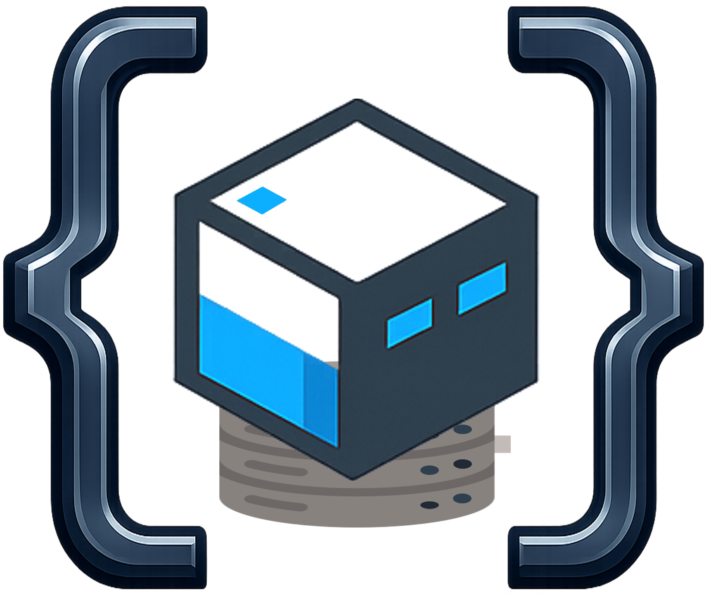
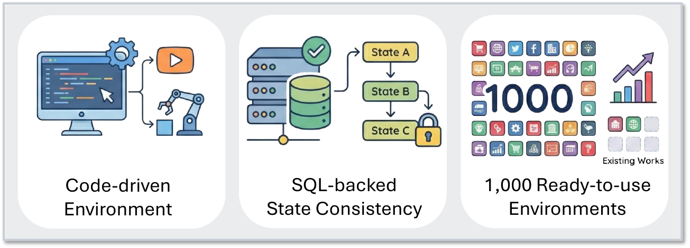
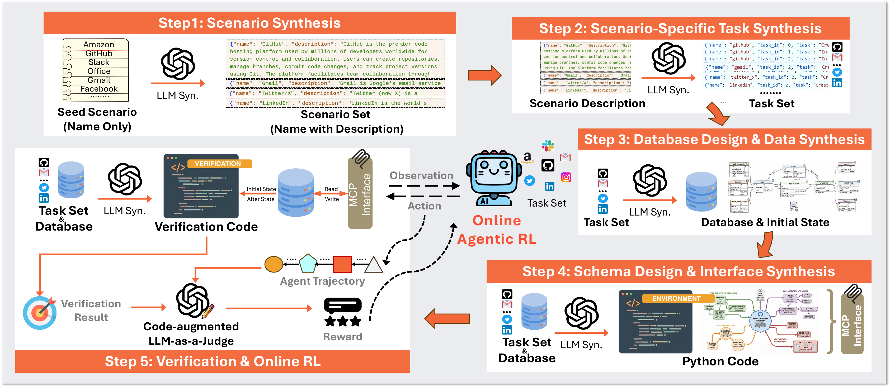
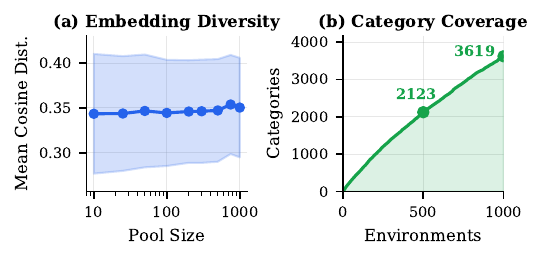

# Title: Agent World Model: Infinity Synthetic Environments for Agentic Reinforcement Learning

- ArXiv: 2602.10090
- Authors: Zhaoyang Wang, Canwen Xu, Boyi Liu, Yite Wang, Siwei Han, Zhewei Yao, Huaxiu Yao, Yuxiong He
- Sections: 34
- Estimated tokens: 25.6k

## Contents

- [Abstract](#abstract)
- [1 Introduction](#1-introduction)
- [2 Related Work](#2-related-work)
- [3 Agent World Model](#3-agent-world-model)
  - [3.1 Scenario Generation](#31-scenario-generation)
  - [3.2 Task Generation](#32-task-generation)
  - [3.3 Environment Synthesis](#33-environment-synthesis)
    - [3.3.1 Environment](#331-environment)
    - [3.3.2 Pipeline Results and Analysis](#332-pipeline-results-and-analysis)
- [4 Agentic Reinforcement Learning](#4-agentic-reinforcement-learning)
  - [4.1 Reward Design](#41-reward-design)
  - [4.2 History-Aware Training](#42-history-aware-training)
- [5 Experiments](#5-experiments)
  - [5.1 Experimental Setup](#51-experimental-setup)
  - [5.2 Main Results](#52-main-results)
- [6 Analysis](#6-analysis)
  - [6.1 Quality of Synthesized Environments](#61-quality-of-synthesized-environments)
  - [6.2 Analysis on Verification Design](#62-analysis-on-verification-design)
  - [6.3 Analysis on History-Aware Training](#63-analysis-on-history-aware-training)
  - [6.4 Environment Scaling Curve](#64-environment-scaling-curve)
- [7 Conclusion](#7-conclusion)
- [Impact Statement](#impact-statement)
- [Limitations](#limitations)
- [Use of AI Assistants](#use-of-ai-assistants)
- [Acknowledgment](#acknowledgment)

## Abstract

Recent advances in large language model (LLM) have empowered autonomous agents to perform complex tasks that require multi-turn interactions with tools and environments. However, scaling such agent training is limited by the lack of diverse and reliable environments. In this paper, we propose Agent World Model (AWM), a fully synthetic environment generation pipeline. Using this pipeline, we scale to 1,000 environments covering everyday scenarios, in which agents can interact with rich toolsets (35 tools per environment on average) and obtain high-quality observations. Notably, these environments are code-driven and backed by databases, providing more reliable and consistent state transitions than environments simulated by LLMs. Moreover, they enable more efficient agent interaction compared with collecting trajectories from realistic environments. To demonstrate the effectiveness of this resource, we perform large-scale reinforcement learning for multi-turn tool-use agents. Thanks to the fully executable environments and accessible database states, we can also design reliable reward functions. Experiments on three benchmarks show that training exclusively in synthetic environments, rather than benchmark-specific ones, yields strong out-of-distribution generalization. The code is available at [https://github.com/Snowflake-Labs/agent-world-model](https://github.com/Snowflake-Labs/agent-world-model).

## 1 Introduction

Large language models (LLMs) have achieved remarkable performance in instruction following, reasoning, code generation, and tool-use (Chen et al., 2021; Schick et al., 2023; OpenAI, 2025; Anthropic, 2025a; Comanici et al., 2025; Guo et al., 2025). Agents powered by LLMs emerge as a promising paradigm for handling multi-step complex tasks in realistic environments (Nakano et al., 2021; Yao et al., 2023; Yang et al., 2024; Qin et al., 2024). However, training such agents often requires performing large-scale reinforcement learning (RL) on diverse environments that are relatively resource-scarce and expensive to scale.

Using real-world environments for training is prohibitively expensive and hard to scale, since many scenarios do not expose public APIs and RL training often requires agents to interact with them thousands of times in a stable and efficient manner (Dulac-Arnold et al., 2021; Qin et al., 2024; Xu et al., 2024a; Luo et al., 2025). Human-created environments are hard to scale and often lack diversity. For example, $\tau^{2}$-bench (Barres et al., 2025) and TheMCPCompany (Esfandiarpoor et al., 2025) only contain three and five environments, respectively, which is far from enough for training generic AI agents. Most existing synthetic research on agents focuses on task synthesis (Wang et al., 2023; Chen et al., 2024; Xie et al., 2025; Patil et al., 2024; Wang et al., 2026) and trajectory collection (Xu et al., 2024b; Li et al., 2025a; Song et al., 2024) rather than environment synthesis. Another line of research simulates the tool response or even the environment, where each state transition is generated by LLMs (Liu et al., 2024b; Lu et al., 2025; Li et al., 2025b, c; Chen et al., 2025). However, this approach is not reliable or efficient due to the hallucination issue (Wang et al., 2024; Kalai et al., 2025) and LLM’s high inference cost.

> Figure 1: Agent World Model (AWM) is a synthetic environment generation pipeline that synthesizes 1,000 diverse code-driven agentic environments with databases for training tool-use agents.

These limitations highlight a missing piece: scalable environment synthesis. In particular, The challenge is to synthesize executable, reliable environments at scale, enabling replicable agent interaction and learning. In recent months, DeepSeek-V3.2 (DeepSeek-AI et al., 2025) introduces a synthesis pipeline to create thousands of executable environments for general agents, while Qwen Tongyi (Fang et al., 2025) also describes an environment synthesis pipeline but for supervised fine-tuning (SFT) rather than RL training. The adopted code-based approach is promising to build such environments at scale, since it can control the state transition and ensure the consistency of the environment. However, neither of them releases the generation pipeline nor open-sources their environments. Several concurrent community efforts (Feng et al., 2025; Sullivan et al., 2025; Cai et al., 2025; Zhang et al., 2025a; Song et al., 2026) explore environment synthesis through programming. However, they either target game-like environments, rely on human priors (e.g., code documentation), lack strong guarantees of state consistency, or remain limited in scale.

To address this, we propose Agent World Model (AWM), an open-source pipeline that synthesizes executable tool-use environments at scale. The key insight is that agent environments share a common structure: a stateful backend, a tools interface layer, and task-specific success criteria. By decomposing synthesis into these three components, we can leverage LLMs to generate each part systematically while maintaining consistency. Our AWM mirrors how software is built in practice. Starting from a high-level scenario description (e.g., “an online shopping platform”), we first generate common user requirements (i.e., tasks) that users are likely to perform in this scenario. Then, we generate the database schema to define what entities and relations exist to fulfill these user requirements. This schema can guide the design of exposed interfaces (toolset) and help generate the backend code for the interfaces, ensuring each tool has a clear data model to operate on. The interface is exposed via Model Context Protocol (MCP) (Anthropic, 2024) for unified agent tool interaction with the environment. Finally, we generate verification code that compares the database state before and after agent execution, which augments an LLM-as-a-Judge to provide robust reward signals for RL training. Critically, each stage includes automated execution and simple self-correction: if generated code fails to run, we feed the error information back to the LLM for correction.

This pipeline enables us to scale to 1,000 unique environments spanning most real-world scenarios such as shopping, social media, finance, and travel. Each environment provides an executable sandbox where agents can interact with dozens of tools, and they fully support parallel isolated instances and are easy to reset or restart, which are important for efficient online RL. To validate AWM, we perform large-scale RL (each step with 1,024 environment instances) to train agents to use MCP tools to complete the task. In contrast to some works performing training on test environments, our environments and tasks are not tailored for any benchmarks or specific scenarios. Experimental results on three tool-use benchmarks demonstrate the generalization performance of our framework. In summary, our contributions are three-fold: (1) AWM, an open-source pipeline for automatic generation of executable tool-use environments with database-backed state consistency, (2) 1,000 ready-to-use diverse environments suitable for large-scale RL training, and (3) empirical results show that agents trained on AWM generalize to out-of-distribution environments.

> Figure 2: Overview of AWM. Starting from scenario synthesis, we progressively generate tasks, database, interface and verification to obtain fully executable environments. Then, we perform multi-turn RL training for tool-use agents in our synthesized environments.

## 2 Related Work

Tool-use Agents. Recent work shows that LLMs can use external tools to solve complex tasks (Qin et al., 2024; OpenAI, 2025; DeepSeek-AI et al., 2025; Team et al., 2025). Toolformer (Schick et al., 2023) trains tool-use LLMs by supervised learning. ToolLLM (Qin et al., 2024) curates real-world APIs and trains on LLM-generated trajectories, but uses simulated responses instead of tool execution. Gorilla (Patil et al., 2024) fine-tunes with API documentation to improve tool-use accuracy. ReAct (Yao et al., 2023) and SWE-agent (Yang et al., 2024) alternate reasoning and acting in interactive environments. However, most training data remains static or comes from small-scale environments. Existing benchmarks (Yao et al., 2024; Barres et al., 2025; Esfandiarpoor et al., 2025; Luo et al., 2025; Fan et al., 2025; Mo et al., 2025) either use real-world APIs or provide small-scale environments. This makes them hard to use as large-scale RL training grounds. The gap is the lack of diverse and executable environments that are efficient enough for RL. Such training needs extensive agent interactions, and it benefits from fast interactions and reliable state transitions.

Agent Data Synthesis. Synthetic data is widely used to scale agent training (Patil et al., 2024; Schick et al., 2023; Qin et al., 2024; Liu et al., 2024b, 2025). Self-Instruct (Wang et al., 2023) popularizes using LLMs to generate data for fine-tuning. Subsequent work uses LLMs to synthesize tasks, tools specifications, and agent trajectories (Xie et al., 2025; Xu et al., 2024b; Li et al., 2025a; Song et al., 2024; Liu et al., 2024b, 2025; Wang et al., 2026; Prabhakar et al., 2025). These methods provide diverse tasks and tool-use demonstrations, but do not offer executable environments for agent interaction. The key limitation is that they treat the environment as given or simulate tool responses with LLMs. Without environment synthesis, agents cannot explore alternative actions or receive grounded feedback from state changes, which limits applicability to RL.

Environment Synthesis. As agentic RL grows, the need for diverse and executable environments becomes more urgent. Environment synthesis largely follows two directions: LLM-based simulation (Wang et al., 2024; Li et al., 2025c; Chen et al., 2025; Li et al., 2025b) and programming-based synthesis (Tang et al., 2024; Sullivan et al., 2025; Cai et al., 2025; Zhang et al., 2025a; Song et al., 2026). LLM-based simulation often simulates the environment by prompting reasoning model to generate state transition and observation. However, it suffers from hallucinations in state transition (Kalai et al., 2025; Wang et al., 2024). It is also expensive and inefficient for RL, since each environment step may require an LLM call. Programming-based synthesis builds environments through programming and database, where each state transition and observation are driven by the code. Some methods extract tool graphs from documentation and sample tool call sequences to build environments (Fang et al., 2025; Cai et al., 2025). Procedural generation has also been explored, for example with human designed type systems (Sullivan et al., 2025). AutoEnv (Zhang et al., 2025a) creates 36 game-like environments (e.g., maze navigation) for simulating heterogeneous worlds. EnvScaler (Song et al., 2026) is a concurrent work that synthesizes 191 interactive environments via code generation given existing task sets.

The proposed AWM differs in three aspects: (1) We synthesize environments from scratch without assuming predefined task sets or API documentation. This avoids human priors and enables scalable synthesis. (2) We use database-backed state management to enforce consistency and enable code-augmented verification for RL. (3) With 1,000 environments, 35,062 tools and 10,000 tasks paired with verification code synthesized, to the best of our knowledge, AWM is the largest open-source tool-use environment set to date.

## 3 Agent World Model

In this section, we describe AWM in details, as shown in Figure [2](#figure-2). We synthesize environments as partially observable Markov decision processes (POMDPs) suitable for agentic RL training. Each environment $E_{i}$ comprises five components: a state space $\mathcal{S}_{E_{i}}$, an action space $\mathcal{A}_{E_{i}}$, an observation space $\mathcal{O}_{E_{i}}$, a transition function $T_{E_{i}}:\mathcal{S}_{E_{i}}\times\mathcal{A}_{E_{i}}\rightarrow\mathcal{S}_{E_{i}}\times\mathcal{O}_{E_{i}}$, and task-specific reward functions $R_{\tau}$ for each $\tau\in\mathcal{T}_{E_{i}}$ that is the task set for the environment. The goal of the agent is to complete tasks by interacting with the environment through multi-turn tool interactions. The synthesis pipeline in Sec. [3.3.1](https://arxiv.org/html/2602.10090v2#S3.SS3.SSS1) would instantiate: the database defines $\mathcal{S}_{E_{i}}$, the interface layer defines $\mathcal{A}_{E_{i}}$, $\mathcal{O}_{E_{i}}$, and $T_{E_{i}}$, while verification provides $R_{\tau}$ for each user task.

- [3.1 Scenario Generation](#31-scenario-generation)
- [3.2 Task Generation](#32-task-generation)
- [3.3 Environment Synthesis](#33-environment-synthesis)

### 3.1 Scenario Generation

We leverage the vast world knowledge of modern LLMs to generate diverse scenario descriptions (websites, apps, or common tools collection), seeded with 100 popular domain names. Unlike general web agents that navigate static content sites (e.g., news, wikis), we focus on stateful applications (e.g., e-commerce, CRM, management) that necessitate database interactions instead of information retrieval. To ensure quality, we employ a filtering pipeline: an LLM-based classifier selects scenarios involving core CRUD operations (create, read, update, delete), while embedding-based deduplication ensures diversity. We also cap over-represented categories to prevent the collection from collapsing to a few dominant types. This process yields 1,000 unique scenarios spanning finance, travel, retail, social media, and more, as shown in Figure [7](https://arxiv.org/html/2602.10090v2#A2.F7) and Table [9](#table-9).

### 3.2 Task Generation

Following software engineering principles, we then synthesize user tasks to serve as functional requirements for the environment. These tasks would dictate the necessary database entities and API endpoints in subsequent synthesis steps. For each scenario, we prompt the LLM to generate $k=10$ different tasks $\mathcal{T}_{E_{i}}=\{\tau_{i,j}\}^{k}_{j=1}$ covering diverse functionalities of the scenario. We enforce two design principles: (1) API-solvability, avoiding purely UI-dependent actions (e.g., clicking, page navigation), and (2) post-authentication context, assuming login is completed to focus on deep functionalities rather than access control, because such authentication is typically handled by human in realistic settings. This results in 10,000 executable tasks that would drive the synthesis of the environment backends.

### 3.3 Environment Synthesis

Given a scenario description and its task set $\mathcal{T}_{E_{i}}$, we synthesize an executable environment $E_{i}$ by instantiating POMDP components. First, we construct the state space $\mathcal{S}_{E_{i}}$ and initial state by generating a SQLite (Gaffney et al., 2022) schema and populating it with synthetic sample data that supports the entities and constraints implied by $\mathcal{T}_{E_{i}}$. Then, we generate an MCP (Anthropic, 2024) interface layer that exposes a toolset in Python, which defines the action space $\mathcal{A}_{E_{i}}$ as tool calls and the observation space $\mathcal{O}_{E_{i}}$ as tool responses. Calling a tool runs database operations that read and write, which implements the environment transition function $T_{E_{i}}$. Finally, we synthesize verification logic to define the task-specific reward functions $R_{\tau}$. This design grounds environment state in structures, while ensuring agents interact with $E_{i}$ only via a unified MCP interface.

- [3.3.1 Environment](#331-environment)
- [3.3.2 Pipeline Results and Analysis](#332-pipeline-results-and-analysis)

#### 3.3.1 Environment

Database. The database grounds each environment in a concrete and persistent state. We use SQLite (Gaffney et al., 2022) as the state backend for structured relational state, unlike the simplified NoSQL or key-value stores used in concurrent works (Zhang et al., 2025a; Cai et al., 2025; Song et al., 2026). Given the scenario and task set $\mathcal{T}_{E_{i}}$, the LLM infers required entities/attributes/relations to make every task feasible, generating tables only when required by the tasks. We exclude authentication-related fields to align with the task generation step. The schema defines the state space $\mathcal{S}_{E_{i}}$ and constrains all transitions through explicit keys and constraints. However, schema alone is insufficient, as many tasks require querying or updating existing records. We therefore synthesize sample data that instantiates a realistic initial state $s_{0}$, ensuring every task in $\mathcal{T}_{E_{i}}$ is executable from the start. The LLM analyzes preconditions for each task and creates records satisfying these constraints, including variation data needed for robust execution.

Interface. Agents cannot directly manipulate the database without breaking abstraction. We introduce a Python interface layer exposed via MCP (Anthropic, 2024) that defines the action space $\mathcal{A}_{E_{i}}$ and observation space $\mathcal{O}_{E_{i}}$. We use two stages: first toolset schema design, then code generation. Pilot experiments show that environments may require over 3,000 lines of code, making direct generation challenging without schema guidance. Given the task set and database schema, the LLM infers the minimal set of operations required to make every task executable, generating endpoints only when necessary. The schema also serves as documentation for agents through summaries, typed parameters, and response schemas, as shown in Table [B.2](https://arxiv.org/html/2602.10090v2#A2.SS2). We then generate an executable Python file where each endpoint becomes an MCP tool. Tool execution triggers database operations, implementing the transition function $T_{E_{i}}$.

Verification. To complete the POMDP specification, we define task-specific reward functions $R_{\tau}$ to enable RL training. We design a task-associated verification module for each task $\tau$ that grounds evaluation in the environment state. Specifically, this module inspects the database state before and after agent execution, extracting task-relevant signals and success or failure criteria that describe how to interpret state differences. However, because our environments are fully synthetic, verification can occasionally be affected by environment imperfections, such as incomplete state updates, unexpected execution failures, or infrastructure-related issues (e.g., timeouts). To improve reward robustness, the ultimate decision is made by an LLM-as-a-Judge (Zheng et al., 2023), which combines the agent trajectory with structured verification signals. LLM-as-a-Judge complements code-based checks by leveraging trajectory-level context which helps mitigate misjudgments caused by imperfect environment signals. Finally, the verification step returns one of {Completed, Partially Completed, Agent Error, Environment Error}.

A natural question arises: why not rely entirely on code-driven verification? While appealing, this approach assumes that task success is perfectly specifiable and reliably observable from state alone. In practice, this assumption is fragile. Even realistic services exhibit imperfect behavior due to transient failures, partial executions, or infrastructure issues; synthetic environments are no exception. In general task settings, brittle verification logic can introduce false positives or negatives, an issue that has surfaced repeatedly in existing benchmarks such as WebArena, $\tau^{2}$-bench, and SWE-Bench, which were later revised to correct earlier misjudgments (hattami et al., 2025; Cuadron et al., 2025; OpenAI, 2024). Our code-augmented LLM-as-a-Judge addresses this by combining the precision of code-based verification with the flexibility and context-awareness of LLM reasoning. Specifically, structured verification signals ground the LLM in concrete evidence, enabling it to resolve ambiguities that rigid code alone cannot handle. We also prepare the code-driven verification for AWM, providing the community with both options, though our analysis in Sec. [6.2](#section-6-2) and case study of verification failure cases in Appendix [B.2](https://arxiv.org/html/2602.10090v2#A2.SS2) confirm that code-augmented LLM-as-a-Judge is more robust.

Execution-based Self-Correction. Across all synthesis steps described above, we employ a simple self-correction mechanism to handle generation errors. After generating each component of the environment, we attempt to run it in an isolated environment and test the functionality. If any error occurs (e.g., runtime exceptions), we capture the error message and feed it back to the LLM together with the problematic code snippet, prompting the LLM to regenerate a corrected version. This process is repeated for up to five iterations or until the component executes successfully. In practice, we often find that this lightweight retry strategy is effective in repairing generated code, without requiring a more complex correction mechanism.

#### 3.3.2 Pipeline Results and Analysis

Through AWM, we synthesize 1,000 executable environments along with 10,000 tasks. Table [1](#table-1) shows the statistics of the synthesis process. The pipeline achieves over 85% success rates, and the self-correction mechanism requires only 1.13 iterations on average to repair, confirming the rationality of the pipeline design. Table [2](#table-2) reports the complexity of synthesized environments. These statistics further show that each stage generates non-trivial artifacts, far exceeding toy environments. Table [3](#table-3) compares AWM with existing environment sets. Our method achieves the largest scale, with 5$\times$ more environments than the closest concurrent work EnvScaler (Song et al., 2026), while requiring minimal human participation beyond 100 scenario names. This indicates that large-scale synthesis of executable environments is both feasible and cost-effective via AWM.

> Table 1: Statistics of the synthesis pipeline. Success rates and trial counts reflect the self-correction. Costs are averaged per 100 samples using GPT-5 (OpenAI, 2025) as the generation model.

| Synthesis Stage | Success (%) | # Trial | Cost ($) |
| --------------- | ----------- | ------- | -------- |
| Scenario        | –           | –       | 0.43     |
| Task            | –           | –       | 0.56     |
| Database        | 88.3        | 1.12    | 3.59     |
| Sample Data     | 88.2        | 1.12    | 13.75    |
| Toolset Schema  | –           | –       | 23.74    |
| Env Code        | 86.8        | 1.13    | 12.81    |
| Verification    | –           | –       | 2.21     |
| Total           | –           | –       | 57.09    |

> Table 2: Environment complexity statistics. Agent steps and unique tools are measured using Claude-4.5-Sonnet (Anthropic, 2025a) as the agent backbone, with a maximum step budget of 20. About $13.7\%$ of tasks exceeded this budget.

| Metric (#)                 | Mean    | Median  | Top 90% |
| -------------------------- | ------- | ------- | ------- |
| Database Tables            | 18.5    | 18.0    | 25.0    |
| Sample Data Records        | 129.3   | 121.0   | 192.0   |
| Exposed Tools              | 35.1    | 35.0    | 45.0    |
| Environment Code Lines     | 1,984.7 | 1,944.0 | 2,586.0 |
| Agent Steps per Task       | 8.5     | 6.0     | 20.0    |
| Unique Tools used per Task | 7.1     | 6.0     | 12.0    |

> Table 3: Comparison with existing programming-based environments. Our AWM generates environments with minimal reliance (only a seed set of scenario names) on human or real APIs, achieving the largest scale with SQL-backed state consistency.

| Method           | Syn.     | Reliance   | SQL      | # Envs | # Tools | # Code |
| ---------------- | -------- | ---------- | -------- | ------ | ------- | ------ |
| $\tau$-bench     | $\times$ | Human      | $\times$ | 2      | 12.5    | –      |
| $\tau^{2}$-bench | $\times$ | Human      | $\times$ | 3      | 22.7    | –      |
| MCP-Universe     | $\times$ | Real APIs  | –        | 11     | 12.1    | –      |
| AutoForge        | ✓        | Tool Doc   | $\times$ | 10     | –       | –      |
| EnvScaler        | ✓        | Task Set   | $\times$ | 191    | 18.6    | 662.1  |
| AWM              | ✓        | Names Only | ✓        | 1,000  | 35.1    | 1984.7 |

## 4 Agentic Reinforcement Learning

With the synthesized environments, we perform online reinforcement learning for tool-use agents using Group Relative Policy Optimization (GRPO) (Shao et al., 2024). Agentic interaction involves long-horizon trajectories with interleaved observations and tool calls, requiring both careful reward design and alignment between training and inference.

- [4.1 Reward Design](#41-reward-design)
- [4.2 History-Aware Training](#42-history-aware-training)

### 4.1 Reward Design

Purely outcome-based rewards have shown success in mathematical reasoning (Guo et al., 2025); however, in agentic environments, they may be insufficient and inefficient to regularize tool-use behavior. We therefore adopt a hybrid reward design that combines step-level format correctness with task-level outcome verification. At each step $t$, we check whether the tool call follows the required format (see Appendix [A.4](https://arxiv.org/html/2602.10090v2#A1.SS4)). Any violation triggers early termination of the rollout and an immediate negative reward. This both discourages invalid actions and saves computation in long-horizon multi-turn settings. After a rollout terminates normally, we evaluate the task-level outcome via our code-augmented LLM-as-a-Judge, defining the final reward as:

$$
R_{\tau}=\left\{\begin{array}[]{@{}l@{\,}l@{}}1.0,&\text{if task}\tau\ \texttt{Completed},\\ 0.1,&\text{if task}\tau\ \texttt{Partially Completed},\\ 0.0,&\text{otherwise}.\end{array}\right.(1)
$$

The step-level reward $r_{t}$ follows: if early termination occurs at step $t$, $r_{t}=-1.0$; if the rollout terminates normally, $r_{t}=R_{\tau}$ is broadcast to all action steps; otherwise $r_{t}=0$. This design encourages syntactically valid tool usage while preserving outcome-driven optimization.

### 4.2 History-Aware Training

When deploying agents, history context is often managed by a dedicated framework that strategically truncates long interaction histories to avoid attention sink and improve efficiency (Liu et al., 2024a; Anthropic, 2025b; Zhang et al., 2025b). However, existing RL training pipelines may optimize policies using full histories, creating a distribution mismatch issue between training and inference.

Let $h_{t}=(o_{1},a_{1},o_{2},a_{2},\ldots,o_{t})$ denote the full interaction history. In practice, many RL frameworks (Sheng et al., 2024; Hu et al., 2025) optimize all actions from a completed rollout in one model forward pass for efficiency:

$$
\begin{split}\mathcal{L}=&-r\log\pi_{\theta}(\underbrace{o_{1},a_{1},o_{2},a_{2},\ldots,o_{T},a_{T}}_{\text{one forward pass}})\\ &\cdot\underbrace{[0,1,0,1,\ldots,0,1]}_{\text{loss mask}},\end{split}(2)
$$

where $\pi_{\theta}$ is the agent parameterized by $\theta$, and the mask selects action tokens while ignoring observations. At inference time, however, the agent may condition on a truncated history $h_{t}^{\text{trunc}}=(o_{\max(1,t-w+1)},a_{\max(1,t-w+1)},\ldots,o_{t}),$ which results in a distribution shift if training always uses full history. To address this issue, we align training with inference by applying the same truncation during optimization. Under GRPO, for each task $\tau$ in environment $E_{i}$, we sample a group of $G$ rollout trajectories $\{y^{(k)}\}_{k=1}^{G}$, where $y^{(k)}=(a_{1}^{(k)},\ldots,a_{T_{k}}^{(k)})$, and optimize:

$$
\displaystyle\mathcal{L}_{\text{GRPO}}=\mathbb{E}_{\tau,E_{i},\{y^{(k)}\}}\left[\frac{1}{G}\sum_{k=1}^{G}A^{(k)}\sum_{t=1}^{T_{k}}\log\pi_{\theta}(a_{t}^{(k)}\mid h_{t}^{\text{trunc},(k)})\right],(3)
$$

where $A^{(k)}=(R^{(k)}-\bar{R})/\sigma_{R}$ is the group-relative advantage computed from the rollout rewards $\{R^{(j)}\}_{j=1}^{G}$. This objective splits the trajectory into multiple individual sub-trajectories, each conditioned on its own truncated history, ensuring consistency with inference-time execution.

## 5 Experiments

- [5.1 Experimental Setup](#51-experimental-setup)
- [5.2 Main Results](#52-main-results)

### 5.1 Experimental Setup

Benchmarks. We evaluate agents on three tool-use and MCP benchmarks to assess out-of-distribution generalization: (1) The verified version of $\tau^{2}$-bench (Barres et al., 2025; Cuadron et al., 2025), which consists of multi-turn conversational agentic tasks across three representative scenarios: airline, retail, and telecom; (2) BFCLv3 (Patil et al., 2025), a comprehensive benchmark for function-calling ability evaluation, covering single-turn, multi-turn (long-context), synthetic tools, real-world tools, and hallucination tests, resulting in four evaluation categories: non-live, live, multi-turn, and hallucination; (3) MCP-Universe (Luo et al., 2025), a collection of real-world MCP servers spanning location navigation, financial analysis, browser automation, web search, and multi-server workflows. We exclude 3D design tasks that require GUI and repository management tasks that require authenticated access to GitHub or Notion.

Baselines. We compare against the following baselines: (1) Base: the original LLMs equipped with reasoning and tool-use capabilities, without additional training; (2) Simulator (Li et al., 2025b; Chen et al., 2025): agents trained with RL in LLM-simulated environments, where GPT-5 (OpenAI, 2025) serves as the environment transition model, using the same tasks and toolsets as AWM, to highlight the advantage of executable environments over simulated ones; (3) EnvScaler (Song et al., 2026): a concurrent method that synthesizes 191 programming-based environments for SFT and RL, included to compare the synthesis quality.

Implementation Details. The AWM pipeline is instantiated using GPT-5 (OpenAI, 2025), which is also used as the code-augmented LLM-as-a-Judge for task verification. We select Qwen3 thinking models (Yang et al., 2025) across 4B, 8B, and 14B scales as base agents due to their popular community adoption. Multi-turn RL training is implemented on top of AgentFly (Wang et al., 2025a) and verl (Sheng et al., 2024). Due to limited computation budget, we train agents on a subset of AWM consisting of 526 environments and 3,315 tasks. Each model is trained for up to 96 optimization steps with a fixed learning rate of $7\times 10^{-7}$. We use a batch size of 64 and 16 rollouts, resulting in 1,024 isolated environment instances launched per step. The sliding window size and maximum interaction turn are set to $w=3$ and $20$, respectively. More details are in Appendix [A](#appendix-a).

### 5.2 Main Results

> Table 4: Results across BFCLv3, $\tau^{2}$-bench, and MCP-Universe benchmarks. Best performance is in bold. For BFCLv3, “Hall.” refers to the hallucination category. For $\tau^{2}$-bench, Pass@k denotes task success rate allowing $k$ attempts, with Pass@1 averaged over 4 runs. For MCP-Universe, we report task success rates. Note that EnvScaler did not release the 14B model.

| BFCLv3 Leaderboard |        |                 |           |            |        |         |         |
| ------------------ | ------ | --------------- | --------- | ---------- | ------ | ------- | ------- |
|                    | Method | Non-Live        | Live      | Multi-Turn | Hall.  | Overall |         |
| 4B                 | Base   | 61.44           | 63.95     | 39.38      | 73.93  | 54.92   |         |
| Simulator          | 66.10  | 62.69           | 37.75     | 75.48      | 55.52  |         |         |
| EnvScaler          | 60.31  | 64.25           | 37.63     | 85.25      | 54.06  |         |         |
| AWM                | 78.60  | 76.91           | 39.38     | 73.70      | 64.50  |         |         |
| 8B                 | Base   | 59.58           | 58.03     | 43.88      | 76.42  | 53.83   |         |
| Simulator          | 56.35  | 59.36           | 41.88     | 74.06      | 52.53  |         |         |
| EnvScaler          | 33.67  | 31.83           | 45.00     | 90.30      | 36.83  |         |         |
| AWM                | 80.44  | 72.39           | 45.00     | 70.80      | 65.94  |         |         |
| 14B                | Base   | 69.48           | 67.28     | 47.00      | 77.94  | 61.25   |         |
| Simulator          | 77.23  | 73.43           | 52.38     | 76.91      | 67.68  |         |         |
| AWM                | 81.46  | 77.20           | 51.88     | 78.37      | 70.18  |         |         |
| $\tau^{2}$-bench   |        |                 |           |            |        |         |         |
|                    |        | Domain (Pass@1) | Overall   |            |        |         |         |
|                    | Method | Airline         | Retail    | Telecom    | Pass@1 | Pass@4  |         |
| 4B                 | Base   | 21.00           | 19.96     | 9.43       | 15.83  | 34.89   |         |
| Simulator          | 15.50  | 18.64           | 7.90      | 13.67      | 35.25  |         |         |
| EnvScaler          | 31.50  | 44.30           | 12.50     | 28.96      | 51.80  |         |         |
| AWM                | 19.00  | 30.26           | 16.45     | 22.57      | 43.89  |         |         |
| 8B                 | Base   | 26.50           | 34.43     | 18.42      | 26.44  | 50.72   |         |
| Simulator          | 34.00  | 32.24           | 29.17     | 31.30      | 54.32  |         |         |
| EnvScaler          | 31.50  | 49.56           | 32.68     | 39.39      | 63.31  |         |         |
| AWM                | 38.50  | 41.23           | 23.47     | 33.45      | 55.40  |         |         |
| 14B                | Base   | 27.00           | 65.35     | 12.28      | 36.69  | 55.40   |         |
| Simulator          | 21.50  | 48.90           | 18.20     | 31.39      | 55.40  |         |         |
| AWM                | 31.50  | 63.60           | 17.76     | 39.03      | 57.19  |         |         |
| MCP-Universe       |        |                 |           |            |        |         |         |
|                    | Method | Location        | Financial | Browser    | Web    | Multi   | Overall |
| 4B                 | Base   | 2.86            | 25.00     | 0.00       | 0.00   | 0.00    | 6.15    |
| Simulator          | 0.00   | 15.00           | 5.88      | 2.00       | 0.00   | 6.15    |         |
| EnvScaler          | 0.00   | 17.50           | 2.94      | 0.00       | 0.00   | 4.47    |         |
| AWM                | 0.00   | 22.50           | 2.94      | 2.00       | 5.00   | 6.70    |         |
| 8B                 | Base   | 0.00            | 22.50     | 5.88       | 2.00   | 0.00    | 6.70    |
| Simulator          | 5.71   | 10.00           | 8.82      | 4.00       | 0.00   | 6.15    |         |
| EnvScaler          | 0.00   | 17.50           | 5.88      | 2.00       | 0.00   | 5.59    |         |
| AWM                | 8.57   | 35.00           | 8.82      | 0.00       | 5.00   | 11.17   |         |
| 14B                | Base   | 0.00            | 27.50     | 5.88       | 2.00   | 5.00    | 8.38    |
| Simulator          | 2.86   | 30.00           | 8.82      | 6.00       | 0.00   | 10.62   |         |
| AWM                | 8.57   | 32.50           | 11.77     | 4.00       | 0.00   | 12.29   |         |

Table [4](#table-4) presents results on three out-of-distribution benchmarks. AWM does not target conversational interaction, whereas $\tau^{2}$-bench requires multi-turn dialogue. AWM omits refusal scenarios, while BFCLv3 stresses hallucination resistance. AWM also excludes browser automation and information retrieval, both central to MCP-Universe.

On BFCLv3, AWM improves performance across all models. For 8B model, the overall score increases from 53.83 to 65.94, surpassing Simulator and EnvScaler. Gains are broadly distributed, with a modest weakness on hallucination, likely due to our format correctness reward that always encourages tool use and penalizes refusals (Appendix [A.4](https://arxiv.org/html/2602.10090v2#A1.SS4)). On $\tau^{2}$-bench, AWM is competitive with EnvScaler and consistently exceeds Simulator. Notably, EnvScaler regresses on BFCLv3 (-8.93) and MCP-Universe (-1.39) on average, whereas ours improves over Base across all benchmarks; plausibly because EnvScaler relies on existing tasks for synthesis that may overlap with $\tau^{2}$-bench. On MCP-Universe, AWM achieves the best overall results, with large gains in Financial and Location. These results indicate that training on our synthetic environments builds robust tool-use capabilities that transfer to real-world scenarios. Moreover, the comparison with Simulator suggests that programming-based state consistency provides a more stable learning signal than LLM-generated interactions, while substantially reducing RL latency, since Simulator requires an LLM call at each interaction step. Overall, AWM shows the strongest generalization, validating the effectiveness of our synthesis.

## 6 Analysis

- [6.1 Quality of Synthesized Environments](#61-quality-of-synthesized-environments)
- [6.2 Analysis on Verification Design](#62-analysis-on-verification-design)
- [6.3 Analysis on History-Aware Training](#63-analysis-on-history-aware-training)
- [6.4 Environment Scaling Curve](#64-environment-scaling-curve)

### 6.1 Quality of Synthesized Environments

> Table 5: Quality analysis of 100 sampled environments. We compare AWM with EnvScaler using two LLM judges (GPT-5.1 and Claude-4.5-Sonnet). Top section shows scores (1–5 scale, $\uparrow$ higher is better). The bottom shows code bug analysis ($\downarrow$ lower is better). Note that bugs may only affect a few tools and edge use cases.

|                                    | GPT-5.1       | Claude 4.5    |               |               |
| ---------------------------------- | ------------- | ------------- | ------------- | ------------- |
| Metric                             | AWM           | EnvScaler     | AWM           | EnvScaler     |
| LLM-as-a-Judge Scores ($\uparrow$) |               |               |               |               |
| Task Feasibility                   | 3.68$\pm$1.02 | 2.94$\pm$1.25 | 3.99$\pm$0.81 | 3.14$\pm$1.29 |
| Data Alignment                     | 4.04$\pm$0.91 | 3.73$\pm$0.89 | 4.84$\pm$0.50 | 4.11$\pm$1.02 |
| Toolset Completeness               | 3.65$\pm$0.87 | 2.89$\pm$0.79 | 4.98$\pm$0.14 | 4.06$\pm$0.87 |
| Bug Analysis ($\downarrow$)        |               |               |               |               |
| Envs w/ Bugs                       | 74%           | 88%           | 83%           | 83%           |
| # Bugs per Env                     | 4.13          | 1.82          | 2.70          | 2.21          |
| Blocked Tasks                      | 14.0%         | 57.1%         | 11.5%         | 46.8%         |

> Figure 3: Diversity analysis of 1,000 synthesized environments. (a) Embedding diversity is calculated by encoding the scenario description, database schema and toolset schema. (b) Category coverage counts the number of unique topics of scenarios.

We evaluate synthesized environments based on two critical criteria for scalable agentic RL: _quality_ (tasks are executable with coherent schema and tool interfaces) and _diversity_ (training does not collapse to near-duplicate environments).

Quality. Table [5](#table-5) reports LLM-as-a-Judge scores on Task Feasibility (whether tasks are executable within the environment), Data Alignment (whether the data schema is coherent with the task), and Toolset Completeness (whether the toolset is complete and usable), where AWM consistently outperforms EnvScaler, indicating stronger end-to-end consistency from tasks $\rightarrow$ database $\rightarrow$ interface. Despite our environments containing roughly 3x more code than those generated by EnvScaler (see Table [3](#table-3)), this increase in scale results in only a moderate rise in bugs, highlighting effective scalability. Both methods exhibit implementation issues at this scale, manual inspection on our environments attributes 44% of bugs to not handling edge input cases and 14% to operations conflicting with database constraints. During RL training, the environment error rate consistently remains low, around 4%, indicating overall reliability and usability of our environments. AWM yields fewer blocked tasks than EnvScaler, which is critical for RL because blocked tasks truncate exploration and inject systematically incorrect negative signals. To mitigate such imperfect environment issue, we design Environment Error reward in Sec. [3.3.1](https://arxiv.org/html/2602.10090v2#S3.SS3.SSS1).

Diversity. Figure [3](#figure-3) analyzes diversity from semantic and topical perspectives. Embedding diversity remains stable as pool size grows, suggesting newly generated environments continue to add novel content rather than forming duplicates. Meanwhile, category coverage steadily increases, showing that AWM globally expands into new regions instead of collapsing to a few dominant domains. Overall, quality and diversity results suggest that AWM can scale to thousands of high-quality environments while maintaining diversity.

### 6.2 Analysis on Verification Design

> Table 6: Overall performance across three verification strategies: LLM-only, code-only, and code-augmented. LLM-only verification decides the rewards based on the agent trajectory. Code-only verification inspects database state differences and the final answer, deciding either Completed ($r_{t}=1$) or Others ($r_{t}=0$).

| Size      | Verification | BFCLv3 | $\tau^{2}$ P@1 | $\tau^{2}$ P@4 | MCP   |
| --------- | ------------ | ------ | -------------- | -------------- | ----- |
| 4B        | LLM          | 51.92  | 15.65          | 35.97          | 6.70  |
| Code      | 55.66        | 14.93  | 32.01          | 6.15           |       |
| Augmented | 64.50        | 22.57  | 43.89          | 6.70           |       |
| 8B        | LLM          | 55.46  | 26.44          | 52.52          | 10.62 |
| Code      | 60.00        | 29.59  | 52.88          | 5.59           |       |
| Augmented | 65.94        | 33.45  | 55.40          | 11.17          |       |
| 14B       | LLM          | 65.44  | 31.03          | 55.76          | 10.62 |
| Code      | 65.04        | 29.50  | 53.60          | 8.38           |       |
| Augmented | 70.18        | 39.03  | 57.19          | 12.29          |       |

Table [6](#table-6) compares three verification strategies. LLM-only verification relies on trajectory without being grounded in database state changes, which makes the reward signal unreliable. Consequently, it yields the weakest performance. Replacing the judge with code-only verification improves over LLM-only, but it can be brittle: when environment imperfections occur, rigid checks may incorrectly assign false negatives, as discussed in Sec. [3.3.1](https://arxiv.org/html/2602.10090v2#S3.SS3.SSS1). In contrast, our code-augmented strategy combines structured verification signals (from state diffs and rule-based checks) with an advanced reasoning LLM, allowing the judge to use grounded evidence while remaining tolerant to imperfect environment signals. This hybrid design consistently achieves the best results across model scales and benchmarks, indicating that it provides a more robust reward for RL training in imperfect synthetic environments. Finally, the extra cost of invoking GPT-5 as the judge is about $1.80 on average per training step (at most 1,024 samples), and the asynchronous setting makes augmented judge introduce negligible latency. We also study the format correctness reward in Appendix [B.1](https://arxiv.org/html/2602.10090v2#A2.SS1).

### 6.3 Analysis on History-Aware Training

> Table 7: Analysis of history-aware training with aligned and misaligned inference settings with 4B model. “Aligned” uses the same history limit (HL) setting for training and inference (i.e., no truncation for model w/o HL, while truncated history for model w/ HL). “Misaligned” uses opposite settings for training and inference.

| Setting    | Method | BFCLv3 | $\tau^{2}$ P@1 | $\tau^{2}$ P@4 | MCP  |
| ---------- | ------ | ------ | -------------- | -------------- | ---- |
| Aligned    | w/ HL  | 64.50  | 22.57          | 43.89          | 6.70 |
| w/o HL     | 55.35  | 15.92  | 36.33          | 6.15           |      |
| Misaligned | w/ HL  | 61.85  | 9.35           | 15.11          | 5.03 |
| w/o HL     | 56.80  | 16.10  | 33.09          | 6.15           |      |

Table [7](#table-7) compares our history-aware training against a variant using full history (w/o HL), under aligned and misaligned inference settings. When aligned, AWM w/ HL achieves the best results among all settings, indicating benefits from optimizing directly under truncated histories. In contrast, the full-history variant is relatively insensitive to misalignment. When truncated at inference, it even shows a slight improvement in $\tau^{2}$, consistent with truncation suppressing interference from earlier irrelevant turns. We believe history management should be treated as part of policy optimization rather than a purely inference-time heuristic.

### 6.4 Environment Scaling Curve

Figure [4](#figure-4) shows how agent scales with the number of training environments. 10 environments lead to severe performance degradation across all benchmarks, likely due to overfitting to the limited environment distribution. Scaling to 100 environments yields substantial gains, and further scaling to 526 environments continues to improve performance. This monotonic improvement highlights the importance of environment diversity for agentic RL. Due to compute constraints, we train on 526 environments rather than the full synthesized set. However, the aforementioned analysis confirms that diversity remains stable as the environment pool expands, suggesting that AWM can support scaling well beyond 1,000 environments with sustained benefits.

> Figure 4: Scaling of AWM over environment sizes with 4B model.

## 7 Conclusion

In this paper, we propose Agent World Model, a scalable pipeline that synthesizes executable agentic environments by mirroring practical software development. Using AWM, we successfully scale to 1,000 environments with 35,062 tools and 10,000 tasks. These environments are code-driven and backed by SQL databases exposed through a unified MCP interface, supporting parallel isolated instances for large-scale agentic RL. Experiments on three benchmarks show that agents trained on our synthetic environments generalize well to out-of-distribution domains, outperforming both LLM-simulated training and concurrent synthesis methods. We believe AWM’s 1,000 synthesized environments and its scalable pipeline are valuable resources to the community.

## Impact Statement

This work presents an open-source pipeline for synthesizing executable environments to train tool-use agents. By releasing both the generation pipeline and the synthesized environments, we aim to lower the barrier for the research community to study agentic systems. However, synthetic environments may not fully reflect real-world scenarios, thus we encourage the community to apply safeguards when deploying agents trained on AWM to real-world scenarios.

## Limitations

Opportunities for Self-Evolving. Our AWM pipeline synthesizes environments through a fixed generation process, inherently limiting the model’s ability to autonomously improve and evolve beyond the initial capabilities. While this approach has shown improvements in our experiments, incorporating a self-evolving paradigm where a trained agent contributes to synthesizing new environments allows the model to continuously adapt and improve its capabilities. We leave this as a promising direction for future work.

Synthesis Pipeline Optimization. Current AWM pipeline provides opportunities for further optimization. For example, self-correction currently operates primarily through trial-and-error, addressing runtime errors without deeper semantic validation. Integrating an LLM to proactively detect logical inconsistencies or subtle bugs not caught by runtime checks could enhance the robustness and semantic coherence of generated environments. It is also valuable to take human inspection to further improve the quality of synthesized environments if resources are available. Moreover, synthesizing tasks that span multiple scenarios or environments represents another promising area for extension. Both enhancements are readily compatible with our existing architecture, offering clear pathways for future improvements.

Training Scale and Model Coverage. Due to limited computing resources, we train agents on 526 of the 1,000 synthesized environments. We also mainly focus on Qwen3 model family (Yang et al., 2025) across 4B, 8B, and 14B scales. Despite these limitations, the experiments already demonstrate consistent out-of-distribution generalization across three benchmarks, suggesting that even a subset of AWM provides a strong training signal. Importantly, the core contribution of this paper is the synthesis pipeline itself. The released environments and pipeline are model-agnostic and can benefit the broader community regardless of the specific models used in our experiments.

## Use of AI Assistants

We acknowledge the use of AI assistants in the writing of this paper, primarily for polishing text and creating figure icons. All generated content is reviewed by the authors, and necessary corrections are made.

## Acknowledgment

We would like to thank Jeff Rasley for valuable discussions and for helping organize relevant resources.
