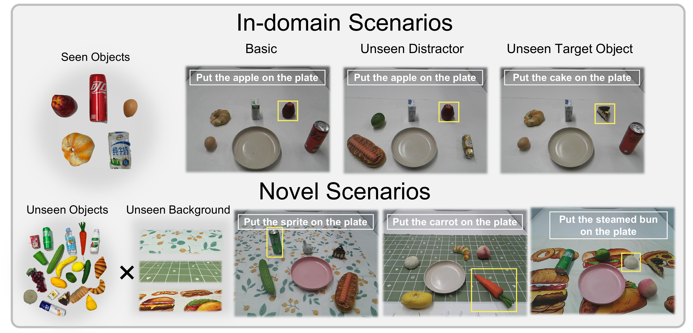
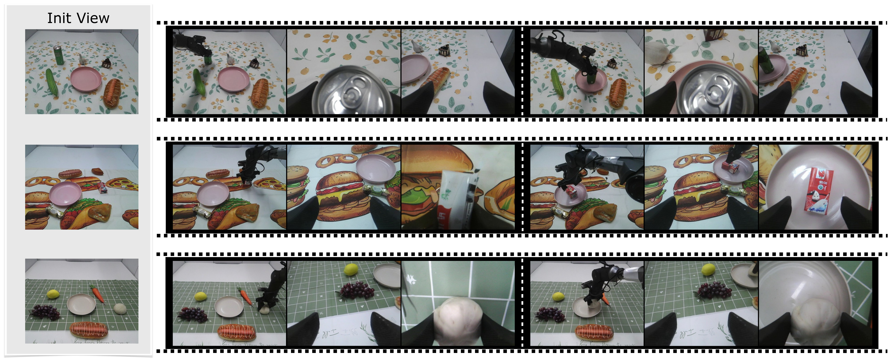

<a id="appendix-a"></a>

## Appendix A Implementation Details

- [A-A World Model Planner](#a-a-world-model-planner)
- [A-B Goal-conditioned VLA.](#a-b-goal-conditioned-vla)

### A-A World Model Planner

- [Model Architecture and Tokenization](#model-architecture-and-tokenization)
- [Sequence Formatting](#sequence-formatting)
- [Model Training](#model-training)

##### Model Architecture and Tokenization

We construct the World Model with a total of 34.1 billion parameters, comprising 31.2 billion in the transformer layers and 2.9 billion in the embedding layers. For tokenization, we employ a unified vocabulary of 282,926 tokens. We utilize the pre-trained IBQ-Tokenizer from EMU3.5 [16] for vision, which features a vocabulary size of 131,072 and quantizes each $16\times 16$ patch into discrete tokens. Particularly, in our setting, inputs are resized to a resolution of $512\times 512$, resulting in 1024 visual tokens per image. For language, we utilize the Qwen3 tokenizer [1] with a vocabulary size of 151,854.

##### Sequence Formatting

We set the max sequence length to 16,384, with each sequence formatted using interleaved text and visual tokens. For supervision, we provide only the instruction and the initial observations, and the model is required to predict the entire interleaved sequence auto-regressively. Since a sequence contains at most 16 images, we sample the timestamp within 1 second around a random goal image’s timestamp, and task the model with predicting the subsequent steps. Therefore, the sequence could start at an arbitrary subtask stage, and would continue to generate the subtasks and goal images sequence until the task is finished or the stage number is reached as required in the prompt. This sliding window style operation not only augments the dataset size and diversity, but also enables an endless closed-loop generation.

##### Model Training

For the training setup, we utilize Megatron-LM [39] to train the world model, with the tensor-parallel size set to 8 and context-parallel size set to 1. The global batch size is 512, and the learning rate is $1\times 10^{-5}$. We perform 2,000 steps of continued training on the open-source EMU3.5 [16] checkpoint. We utilize 128 Nvidia H100 GPUs to train VISTA over a period of 2 days for post-training, employing a cosine learning rate scheduler with linear warmup.

### A-B Goal-conditioned VLA.

- [Model Architecture](#model-architecture)
- [Two-Stage Training settings](#two-stage-training-settings)
- [Inference Details](#inference-details)

##### Model Architecture

We adopt a MoE-like architecture similar to $\pi_{0}$ [5], with PaliGemma-3B [3] as the backbone, and construct a 0.3B-scale action expert simultaneously. Block-wise causal masking is employed where the VLM block attends to its own features, the proprioception block (with weight sharing with the action block) attends to its own features and those of the VLM block, and the action block attends to all blocks; each individual block is fully bidirectional internally. In each inference step, the model takes six images as input, including three current observation images and three goal images, which are encoded into tokens via SigLIP [52]. It also takes the current subtask prompt and proprioceptive signals representing the 6D pose of the robotic arm end-effector as inputs. Subsequently, a 10-step flow matching decoding process is performed to generate an action chunk with a length of 30 steps.

##### Two-Stage Training settings

We adopt a two-stage training paradigm for GoalVLA. In the first stage, we leverage 200,000 trajectory samples from the AgiBot-Beta dataset [9], utilizing annotated subtask text and goal images as additional conditioning. This stage consists of 100,000 training steps with a global batch size of 512 andd an initial learning rate of $5\times 10^{-5}$. For the second stage, we fine-tune GoalVLA on 737 self-collected robot trajectories. We set a global batch size of 128 and a learning rate of $2\times 10^{-5}$, training the model for 10 epochs (approximately 20k steps).

##### Inference Details

In the real-robot deployment and testing phase, to mitigate the impact of motion errors and enable the model to adjust the robot with finer granularity, we only execute 10 out of the 30 steps in the action chunk inferred by the model. We adopt closed-loop absolute end-effector (EE) pose control to operate the robot arm. Since the model outputs delta EE poses, we calculate the absolute EE poses based on the currently read proprioceptive signals. For smoother control, we select the absolute EE poses at the 5th and 10th steps as target waypoints for execution.

<a id="appendix-b"></a>

## Appendix B Dataset Construction and Visualization

> TABLE A.1: Post-sampling dataset statistics for the embodied sub-task, goal image, and co-trained X2I datasets. M and B denote millions and billions, respectively.

| Data Type                        | Weight | Seq Num (M) | Token Num (B) |
| -------------------------------- | ------ | ----------- | ------------- |
| Data Type                        | Weight | Seq Num (M) | Token Num (B) |
| Data Type                        | Weight | Seq Num (M) | Token Num (B) |
| Data Type                        | Weight | Seq Num (M) | Token Num (B) |
| Open-X Embodiment                | 0.25   | 1.8         | 9.1           |
| Open-X Embodiment                | 0.25   | 1.8         | 9.1           |
| Open-X Embodiment                | 0.25   | 1.8         | 9.1           |
| Open-X Embodiment                | 0.25   | 1.8         | 9.1           |
| AgiBot World Beta Single-View    | 0.075  | 0.16        | 2.2           |
| AgiBot World Beta Single-View    | 0.075  | 0.16        | 2.2           |
| AgiBot World Beta Single-View    | 0.075  | 0.16        | 2.2           |
| AgiBot World Beta Single-View    | 0.075  | 0.16        | 2.2           |
| AgiBot World Beta Multi-View     | 0.075  | 0.32        | 3.8           |
| AgiBot World Beta Multi-View     | 0.075  | 0.32        | 3.8           |
| AgiBot World Beta Multi-View     | 0.075  | 0.32        | 3.8           |
| AgiBot World Beta Multi-View     | 0.075  | 0.32        | 3.8           |
| Self-collected Aloha Single-View | 0.075  | 0.015       | 0.11          |
| Self-collected Aloha Single-View | 0.075  | 0.015       | 0.11          |
| Self-collected Aloha Single-View | 0.075  | 0.015       | 0.11          |
| Self-collected Aloha Single-View | 0.075  | 0.015       | 0.11          |
| Self-collected Aloha Multi-View  | 0.075  | 0.003       | 0.04          |
| Self-collected Aloha Multi-View  | 0.075  | 0.003       | 0.04          |
| Self-collected Aloha Multi-View  | 0.075  | 0.003       | 0.04          |
| Self-collected Aloha Multi-View  | 0.075  | 0.003       | 0.04          |
| Any-to-Image                     | 0.45   | 3.3         | 15.2          |
| Any-to-Image                     | 0.45   | 3.3         | 15.2          |
| Any-to-Image                     | 0.45   | 3.3         | 15.2          |
| Any-to-Image                     | 0.45   | 3.3         | 15.2          |

With the proposed auto-divide and labeling framework, we totally split 1.2 million trajectories into interleaved subtask and goal image format, supporting 10 embodiments and multi-view generation. For Agibot World Beta dataset, we further utilize Qwen2.5-VL 72B [2] to refine the abstract task type to detailed instruction, and split the original skill description into fine-grained subtasks. The prompt we used in this framework is fully shown in the following code block.


> Figure A.1: Visualization of samples from our constructed dataset. Our dataset consists of two main components: the Embodied Sub-task and Goal Image Dataset, and the Any-to-Image (X2I) dataset. In the bottom panel, we demonstrate the Camera-View Edit samples and other general Edit samples from the X2I dataset.

As a fundamental single-step generation task, X2I generation typically involves arbitrary multimodal interleaved inputs composed of text and any number of images, requiring the model to output a single image as the response. This imposes significant demands on the model’s key capabilities, particularly in multimodal instruction following, maintaining subject/background consistency, adhering to world knowledge and rules, and controlling image style and texture. Mastering these challenging X2I capabilities will facilitate the model’s robust evolution toward a more general Any-to-Any (X2X) generation paradigm, thereby advancing it into a more complex and powerful world model. To this end, we construct a large-scale X2I dataset (containing 15.2 billion tokens) for training to overcome the limitations in diversity, quality, and scale of existing open-source data. The in-house X2I dataset also integrates parts of multiple open-source datasets, including SEED-Data-Edit [22], WeatherStream [53], PromptFix [51], OmniGen-X2I [45], ShareGPT-4o-Image [11], ImgEdit [50], OmniGen2-X2I2 [43], MultiRef [12], and GPT-IMAGE-EDIT-1.5M [42]. To increase the spatial understanding and multi-view consistency, we further label the relative positions of multiple images shot from the same scene with mast3r [30], and construct a camera-view edit dataset.

The prompt for subtask text segmentation and annotation:

````text

Your are an expert in robot indoor manipulation task analysis. The robot is exectuing the following instruction: {instruction}. Given {num_views} image sequence of the robot camera, you should analyze the subtask involved in the whole process.

The image sequences are organized as follows:
Image1_of_timestamp1, Image1_of_timestamp2, ..., Image1_of_timestamp{timestamp};
...
Image{num_views}_of_timestamp1, ..., Image{num_views}_of_timestamp{timestamp}

### NOTE:
1. The images are sampled uniformly, there could be multiple images belong to the same subtask.

2. The subtask should involved the manipulation skill and the manipulated object or target.

3. The subtask should be a sentence that is consistent with the instruction, and decribe the dyanmics between each adjacent images pair.

4. The subtask should be a single sentence, and the length should be less than 10 words and contains a single skill and the semantic description of the object or target.

5. All the skills should be involved in the skill library:
{skill_library}

6. Use predictive, grounded, and descriptive language that sounds like:
- "Approach the ..."
- "Close the gripper and pick up the ..."
- "Put down the ..."
- "Place the xxx onto the ..."
- "Close the ..."

7. The output should be a list of subtasks, each subtask is a single sentence.

8. The subtask number should ranged from 2 to 5.

9. The subtask should be continuous, and the from_timestamp and to_timestamp should be continuous.

10. The "from_timestamp" for the first subtask should be 1.

11. The "to_timestamp" for the last subtask should be {timestamp}.

12. The "from_timestamp" should be less than the "to_timestamp".

13. If the robot has two arms, add the utilized arm(s) information to the subtask (left/right/both).

### OUTPUT FORMAT:
```json
[
    {{"subtask": "subtask 1", "from_timestamp": 1, "to_timestamp": 2}},
    {{"subtask": "subtask 2", "from_timestamp": 2, "to_timestamp": 5}},
    ...
]
````

### Image Sequence {view_index} from {view_name} camera:

````

The prompt for instruction generation based on the task type and subtask description in AgiBot World Beta dataset:

```text
Your are an expert in robot indoor manipulation task analysis. The Dual-Arm Agibot is exectuing the following type of task: {task_type}. Given {num_views} image sequence of the robot camera and the subtask descriptions by temeral order, you should conclude the final instruction with a single brief sentence.

The image sequences are organized as follows:
Image1_of_timestamp1, Image1_of_timestamp2, ..., Image1_of_timestamp{timestamp};
...
Image{num_views}_of_timestamp1, ..., Image{num_views}_of_timestamp{timestamp}

### Subtask Descriptions:
{subtask_descriptions}

### Image Sequence {view_index} from {view_name} camera:
````

<a id="appendix-c"></a>

## Appendix C Visualization of Generated Results for Unconstrained Scenarios

We evaluate the generative performance of our world model across diverse, unconstrained scenarios, including images synthesized by text-to-image models (e.g., Nano Banana [15]) and real-world photographs captured via mobile devices. The results are shown in Fig. [A.2](https://arxiv.org/html/2602.10983v2#A3.F2) and Fig. [A.3](https://arxiv.org/html/2602.10983v2#A3.F3). On these novel scenarios, VISTA can alternately generate reasonable subtasks and physically plausible, instruction-following goal images according to the specified robot arm type and task. For long-horizon tasks such as folding clothes and tidying desktops, VISTA is also capable of decomposing tasks into key steps and generating informative keyframes that provide effective guidance.


> Figure A.2: Generated samples of VISTA on diverse unconstrained scenarios. These scenarios are dramatically different from the training sample in terms of layout, object appearance, background, and camera view.


> Figure A.3: More visualization results for the generated interleaved sequences on unconstrained scenarios.

<a id="appendix-d"></a>

## Appendix D Illustration of Real-World Experiment Setup

We present the setup for in-domain scenarios in Fig. [A.4](https://arxiv.org/html/2602.10983v2#A4.F4). The distribution of our training data is shown on the left side of Fig. [A.4](https://arxiv.org/html/2602.10983v2#A4.F4). The training scenes contain five fixed objects, and the training set consists of five tasks (i.e., put one of the objects on the plate). Each task includes approximately 150 trajectories, amounting to a total of 737 trajectories. It can be seen that our training data is highly homogeneous in both object placement and scene composition. On the right side of Fig. [A.4](https://arxiv.org/html/2602.10983v2#A4.F4), we show the settings for unseen distractors and unseen targets used in our testing. For the unseen distractor setting, we first align with the object placement layouts present in the training set, then replace $1–3$ of the distractors with unseen objects. The position of the target object remains unchanged in this setting, which thus primarily evaluates the model’s robustness to distractor objects. For the unseen target setting, we also align with the object placement layouts from the training set, then replace the target object with an unseen one. The position of the target object is also fixed in this setting, which mainly assesses the model’s generalization capability for the grounding and grasping of unseen objects.

Fig. [A.5](https://arxiv.org/html/2602.10983v2#A4.F5) presents the setup for novel scenarios, which includes 21 unseen objects, tablecloths with three distinct patterns, and plates in unseen colors, forming a total of 63 novel scenarios for evaluation. Given the lack of diversity in the placement positions of objects within the training data, we consistently place the target object within the reachable and graspable range of the robotic arm in the setup of novel scenarios, while introducing randomness in its specific position to ensure a distinction from the training set.


> Figure A.4: Visualization of training dataset and in-domain scenarios setup.


> Figure A.5: Visualization of novel scenarios setup.

<a id="appendix-e"></a>

## Appendix E Visualization of generated goal images for novel scenarios

We present more goal images generated by VISTA on novel scenarios in Fig. [A.6](https://arxiv.org/html/2602.10983v2#A5.F6). It can be observed that the generated goal images are almost all timing-accurate, effectively capturing the critical moments of picking and placing, and thus providing precise spatial positional guidance for object grasping and placement. Benefiting from the powerful image generation capability of Emu3.5, VISTA is able to maintain high consistency in both background and object appearance even when confronted with previously unseen scenarios. Furthermore, after fine-tuning on a large-scale cross-embodiment robotic dataset, VISTA demonstrates remarkable multi-view consistent generation. As illustrated in the fourth row of Fig. [A.6](https://arxiv.org/html/2602.10983v2#A5.F6), in the generated images of cucumber placement, the cucumber in the plate and the gripper of the right arm are clearly visible from the wrist camera of the left arm, with their relative spatial positions being almost perfectly consistent. This strong multi-view spatial consistency enables VISTA to provide clear and reliable spatial relationship cues for the goal-conditioned VLA, thereby enhancing its ability to perceive the spatial positions of objects.

In addition, we find that our model is capable of generating corresponding reasonable grasping modes for different object placement configurations. As shown in the last row of Fig. [A.6](https://arxiv.org/html/2602.10983v2#A5.F6), when generating goal images for grasping a soda water bottle, the gripper adopts a horizontal, forward grasp rather than the vertical downward grasp commonly observed for other objects. This ability to synthesize diverse and object-specific grasping strategies is crucial for handling a wide range of unseen objects. With more robotic manipulation datasets, our model is promising to generate reasonable and critical goal images for a wide range of complex manipulation tasks.


> Figure A.6: Visualization of generated goal images for novel scenarios.

<a id="appendix-f"></a>

## Appendix F Emerging Capability Analysis

We further investigate the generalization boundaries of VISTA in generating goal images. Fig. [A.7](https://arxiv.org/html/2602.10983v2#A6.F7), [A.8](https://arxiv.org/html/2602.10983v2#A6.F8) and [A.9](https://arxiv.org/html/2602.10983v2#A6.F9) presents qualitative visualizations of compositional tasks, spatial understanding tasks, and semantic understanding tasks generated by VISTA.

For compositional tasks, VISTA is able to accurately interpret the given instructions and sequentially generate goal images for manipulating multiple objects, while maintaining spatiotemporal consistency in object positions, as shown in Fig. [A.7](https://arxiv.org/html/2602.10983v2#A6.F7). These results suggest that our approach has the potential to scale to more complex long-horizon manipulation tasks and to support flexible composition of subtasks. Moreover, such compositional visual guidance enables goal-conditioned VLAs to achieve controllable composition of manipulation skills.

For spatial understanding tasks, VISTA demonstrates the ability to comprehend instructions involving simple spatial relationships. As shown in Fig. [A.8](https://arxiv.org/html/2602.10983v2#A6.F8), VISTA correctly interprets spatial descriptions of both placement targets and grasping targets. In addition, we observe that VISTA can generalize to novel task types, such as “put the Sprite near the mango”, in which the generated goal image shows the robot placing the object outside the plate in accordance with the instruction.

For semantic understanding tasks, VISTA similarly identifies the manipulated objects and placement targets based on semantic cues and generates the corresponding goal images. The Fig. [A.9](https://arxiv.org/html/2602.10983v2#A6.F9) illustrates several representative examples, including instructions describing the shape and color of the plate, as well as more challenging cases that require semantic understanding of pictures displayed on the tabletop.

We attribute these instruction-following capabilities to the strong text-to-image generation and editing abilities of Emu3.5. After fine-tuning on robotic datasets, we find that a portion of this instruction-following ability is retained, although it remains limited and typically exhibits hallucinations. We believe that with more diverse robotic data, VISTA has significant potential to further improve its generation quality on these tasks.

By leveraging the instruction understanding capability of the world model, the GoalVLA can focus more on action generation and goal image following, thereby alleviating its limitations in instruction comprehension. We present several real-world execution examples in Fig. [A.10](https://arxiv.org/html/2602.10983v2#A6.F10), [A.11](https://arxiv.org/html/2602.10983v2#A6.F11) and [A.12](https://arxiv.org/html/2602.10983v2#A6.F12). As shown, by integrating the world model with stronger instruction understanding, the manipulation capacity of the VLA can be further raised, enabling not only flexible composition of manipulation skills but also execution of tasks that require instruction-level reasoning.


> Figure A.7: Visualization of VISTA generated sequences on compositional tasks.


> Figure A.8: Visualization of VISTA generated sequences on spatial understanding tasks.


> Figure A.9: Visualization of VISTA generated sequences on semantic understanding tasks.



> Figure A.10: Visualization of goal-conditioned execution trajectory for compositional task. For the reset stage, our GoalVLA is trained via language instructions without requiring goal images.


> Figure A.11: Visualization of goal-conditioned execution trajectories for spatial understanding tasks.



> Figure A.12: Visualization of goal-conditioned execution trajectories for semantic understanding tasks.

<a id="appendix-g"></a>

## Appendix G Visualization and Analysis of Execution Results

We visualize additional execution results, as shown in Fig. [A.13](https://arxiv.org/html/2602.10983v2#A7.F13). By comparing the final frame of each subtask stage with its corresponding goal image, we observe that the robot arm posture largely aligns with that shown in the goal image. This indicates that GoalVLA can accurately capture the visual features related to the robot’s spatial configuration provided by the goal images and then robustly generate the corresponding action chunks to reach the specified positions and execute the desired manipulations, even in novel scenarios with significant visual distractions.


> Figure A.13: Visualization of goal-conditioned execution trajectories.

We also analyze several failure cases observed during execution. We identify two categories of failures caused by suboptimal goal image generation quality. The first category arises from inaccurate timing of the generated goal images, where the images do not precisely correspond to the critical moments of picking or placing. As illustrated in the bottom-left example of Fig. [A.14](https://arxiv.org/html/2602.10983v2#A7.F14), the goal image is generated at a moment prior to object grasping, when the robot arm has not yet descended sufficiently and the gripper has not fully enclosed the object. During execution, GoalVLA overly focuses on matching the robot pose depicted in the goal image, resulting in insufficient downward motion and eventual grasp failure. This suggests that GoalVLA relies heavily on accurate grasping position cues provided by the goal images, while exhibiting limited capability to adapt to the actual execution state observed online. The top-left example in Fig. [A.14](https://arxiv.org/html/2602.10983v2#A7.F14) shows another failure case where the goal image corresponds to a moment after the object has already been grasped and slightly lifted. In this case, the goal image fails to provide precise spatial guidance for the grasping phase, leading to positional deviations and grasp failure. To mitigate failures caused by imprecise goal image timing, we employ a random goal image offset during the training of GoalVLA, which can partially alleviate this issue. However, in certain cases, GoalVLA still exhibits suboptimal performance. We leave further improvements on this aspect to future work.

The second category of failures stems from spatial misalignment in the generated goal images. As shown in the top-right example of Fig. [A.14](https://arxiv.org/html/2602.10983v2#A7.F14), the goal image from the left wrist camera is not fully aligned with the target object and is slightly shifted to the left, causing the left gripper to collide with the object during execution and resulting in grasp failure. Similarly, in the bottom-right example of Fig. [A.14](https://arxiv.org/html/2602.10983v2#A7.F14), the goal images from the left wrist camera exhibit a comparable leftward offset, again leading to execution failure. In such cases, GoalVLA is required to balance guidance from the goal images with the current visual observations, rather than relying exclusively on the goal images to generate actions. Achieving this balance calls for a more refined network design, which we plan to explore in future work.

Finally, limited by the diversity of the training data, GoalVLA struggles to accurately follow goal images that specify target positions significantly outside the training distribution, even when the goal images themselves are accurately generated. We believe that increasing the spatial diversity of training data is crucial for improving GoalVLA’s generalization, and we will explore training with more diverse datasets in future work.


> Figure A.14: Visualization of failed execution trajectories. The left side shows failures caused by inaccurate timing of the generated goal images, and the right side shows failures caused by spatial misalignment of the generated goal images.
