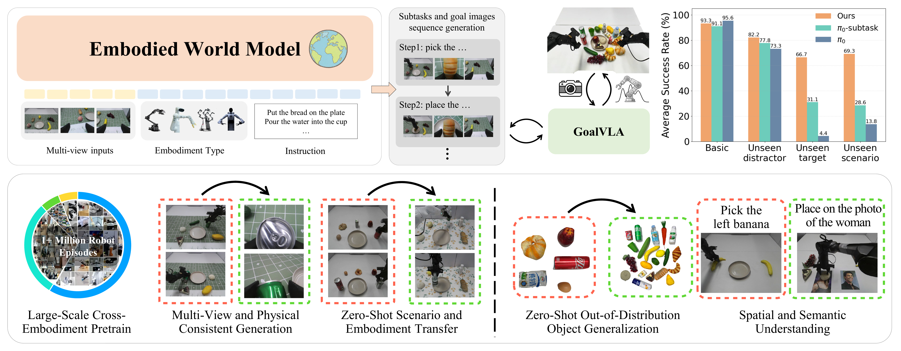
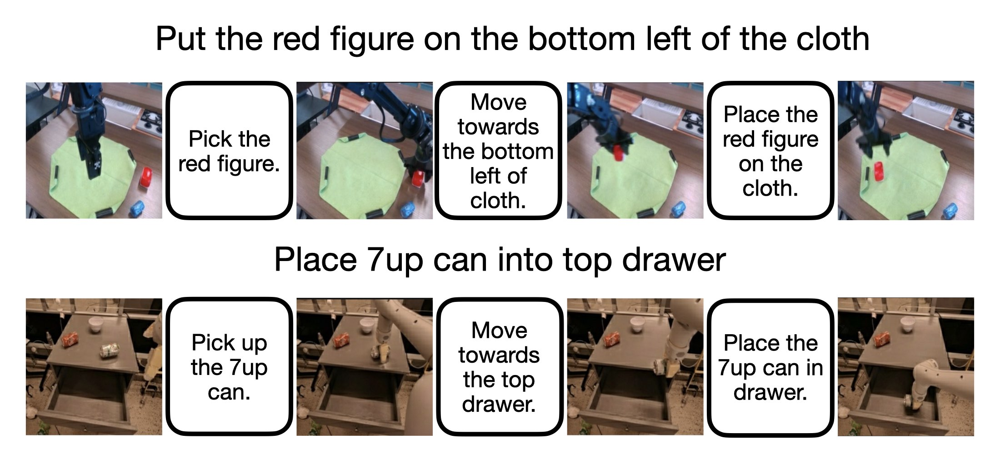
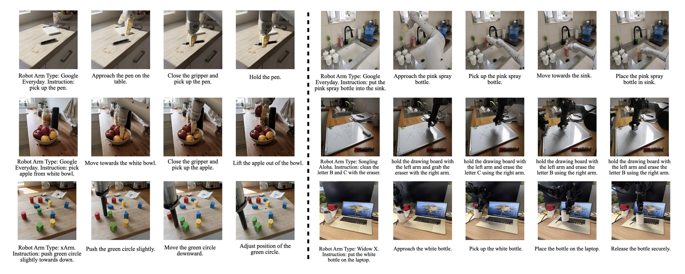
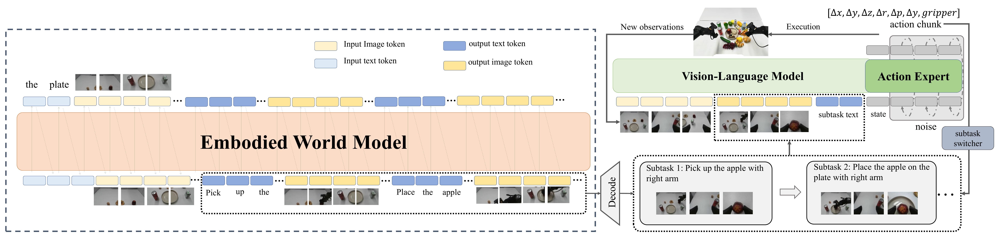

# Title: Scaling World Model for Hierarchical Manipulation Policies

- ArXiv: 2602.10983
- Authors: Qian Long, Yueze Wang, Jiaxi Song, Junbo Zhang, Peiyan Li, Wenxuan Wang, Yuqi Wang, Haoyang Li, Shaoxuan Xie, Guocai Yao, Hanbo Zhang, Xinlong Wang, Zhongyuan Wang, Xuguang Lan, Huaping Liu, Xinghang Li
- Sections: 44
- Estimated tokens: 31.7k

## Contents

- [Abstract](#abstract)
- [I Introduction](#i-introduction)
- [II Related Works](#ii-related-works)
  - [II-A Language-conditioned Imitation Learning](#ii-a-language-conditioned-imitation-learning)
  - [II-B World Models for Robot Manipulation](#ii-b-world-models-for-robot-manipulation)
  - [II-C Manipulation Task Decomposition](#ii-c-manipulation-task-decomposition)
- [III Problem Formulation](#iii-problem-formulation)
- [IV Method](#iv-method)
  - [IV-A World Model Planner](#iv-a-world-model-planner)
    - [Model Formulation](#model-formulation)
    - [Subtask Planning](#subtask-planning)
  - [IV-B Goal Conditioned VLA](#iv-b-goal-conditioned-vla)
    - [Model Formulation](#model-formulation)
    - [Subtask-Aware Action Padding](#subtask-aware-action-padding)
    - [Random Goal Image Offset](#random-goal-image-offset)
  - [IV-C Dataset Curation](#iv-c-dataset-curation)
    - [Dataset Source](#dataset-source)
    - [Automatic Milestone Labeling](#automatic-milestone-labeling)
    - [Any-to-Image Pretraining Data](#any-to-image-pretraining-data)
- [V Experimental Results](#v-experimental-results)
  - [V-A Real World Tasks and Setups](#v-a-real-world-tasks-and-setups)
  - [V-B Visual Subgoal–based Task Decomposition](#v-b-visual-subgoalbased-task-decomposition)
    - [V-B 1 Qualitative Results on Real Photos Synthetic Scenes](#v-b-1-qualitative-results-on-real-photos-synthetic-scenes)
    - [V-B 2 Qualitative Results on Real-Robot Scenarios](#v-b-2-qualitative-results-on-real-robot-scenarios)
  - [V-C Goal Conditioned VLA](#v-c-goal-conditioned-vla)
    - [V-C 1 Quantitative Analysis](#v-c-1-quantitative-analysis)
    - [V-C 2 Qualitative Analysis](#v-c-2-qualitative-analysis)
- [VI Conclusion](#vi-conclusion)
- [VII Limitations](#vii-limitations)

## Abstract

Vision-Language-Action (VLA) models are promising for generalist robot manipulation but remain brittle in out-of-distribution (OOD) settings, especially with limited real-robot data. To resolve the generalization bottleneck, we introduce a hierarchical Vision-Language-Action framework VISTA that leverages the generalization of large-scale pre-trained world model for robust and generalizable VIsual Subgoal TAsk decomposition (VISTA). Our hierarchical framework VISTA consists of a world model as the high-level planner and a VLA as the low-level executor. The high-level world model first divides manipulation tasks into subtask sequences with goal images, and the low-level policy follows the textual and visual guidance to generate action sequences. Compared to raw textual goal specification, these synthesized goal images provide visually and physically grounded details for low-level policies, making it feasible to generalize across unseen objects and novel scenarios. We validate both visual goal synthesis and our hierarchical VLA policies in massive out-of-distribution scenarios, and the performance of the same-structured VLA in novel scenarios could boost from 14% to 69% with the guidance generated by the world model. Results demonstrate that our method outperforms previous baselines with a clear margin, particularly in out-of-distribution scenarios. Project page: [https://vista-wm.github.io](https://vista-wm.github.io/)

## I Introduction

Vision-Language-Action (VLA) models [31, 4, 32] offer a promising paradigm for learning generalist robot manipulation policies by leveraging large-scale pretraining to directly follow natural language instructions and generate low-level actions. However, VLAs remain brittle in out-of-distribution (OOD) scenarios, particularly when real-world robot data is scarce. As analyzed in [25, 23], this limitation stems from a fundamental mismatch in data structure between pretrained Vision-Language Models (VLMs) and VLAs. VLMs are trained on paired image–text data to model a discretized language distribution, whereas VLAs are trained on long robot trajectories consisting of hundreds of image–action pairs under a single instruction, with continuous action regression as the learning target. As a result, VLAs lack the zero-shot generalization ability of VLMs and require a large amount of real-world data for robust performance. This challenge is exacerbated in long-horizon manipulation, where the combinatorial growth of state transitions makes direct mapping from a static language command to precise action sequences ill-posed and highly data-intensive.

Hierarchical task decomposition is therefore essential. However, existing approaches face a representation trade-off: linguistic sub-goals generalize well semantically but lack concrete spatial and physical constraints [27, 48], while dense video prediction provides richer detail but suffers from temporal drift and physical inconsistency over long horizons [14, 47]. This motivates a central question: How can we leverage foundation model generalization to abstract manipulation into an intermediate representation that improves both robustness and data efficiency?

We answer this question with VISTA, a hierarchical Vision-Language-Action framework in which high-level planning is performed by a world model that decomposition manipulation into a sequence of compact, visually grounded subgoals, and low-level control is carried out by a VLA policy guided by these discretized visual subgoals. The key insight of our approach is that robust generalization can be achieved by reasoning over stable visual subgoals, rather than relying solely on brittle textual subtasks or dense, error-prone trajectory predictions.

Specifically, VISTA synthesizes a discrete sequence of goal images that serve as visual milestones, which are interleaved with textual subtasks to form goal-conditioned manipulation primitives. Predicting only key frames enables scalable training on large video datasets, mitigates hallucination through state invariance, and provides explicit spatial constraints that language alone cannot convey. Within VISTA, execution is handled by a goal-conditioned VLA policy that fuses the current observation with the synthesized goal image and textual instruction to predict action chunks. Trained at scale, this policy leverages high-fidelity visual goals as strong spatial priors, enabling precise execution and improved generalization to unseen objects and scenes.

We evaluate VISTA on multi-stage manipulation with an emphasis on out-of-distribution (OOD) generalization. Using only 2 hours of real-world teleoperation data collected on 5 objects, VISTA achieves 69% success in novel scenarios spanning 21 unseen objects, outperforming the baseline $\pi_{0}$ guided by language instruction, which only achieves 14% success. These results highlight that our hierarchical generative visual decomposition substantially improves both data efficiency and robustness.

Our main contributions are as follows:

- A scalable data processing pipeline that relabels millions of robot trajectories into an interleaved format of textual subtasks and visual goal images.
- A generative embodied world model that produces physically and multi-view consistent visual sub-goals for manipulation guidance.
- The VIsual Subgoal-based TAsk decomposition framework VISTA, a hierarchical framework with a generative world model and a goal-image-conditioned policy (GoalVLA) that significantly outperforms standard baselines in OOD settings.

The remainder of the paper is organized as follows. Sec. [II](#section-2) reviews related work, Sec. [III](#section-3) presents the problem formulation, and Sec. [IV](#section-4) details VISTA. The experimental results are reported in Sec. [V](#section-5), followed by conclusions and limitations in Sec. [VI](#section-6) and Sec. [VII](#section-7).

> Figure 1: Overview of the VISTA. The framework comprises two essential modules: Left: VISTA serves as a high-level planner. By treating visual goals and textual subtasks as a unified multi-modal sequence, it autoregressively generates interleaved textual subtasks and visual goals conditioned on the global instruction and initial observation. Right: The GoalVLA acts as the low-level controller. It takes the real-time observation and the generated subgoal as input to predict executable action chunks. The execution process is managed hierarchically, where a subtask switcher transitions to the next stage upon completion of the current stage.

## II Related Works

- [II-A Language-conditioned Imitation Learning](#ii-a-language-conditioned-imitation-learning)
- [II-B World Models for Robot Manipulation](#ii-b-world-models-for-robot-manipulation)
- [II-C Manipulation Task Decomposition](#ii-c-manipulation-task-decomposition)

### II-A Language-conditioned Imitation Learning

Language-conditioned imitation learning typically aims to map visual observations and linguistic instructions directly to action sequences. Early works like BC-Z [28] and CLIPort [40] relied on end-to-end behavior cloning with labeled data or generalizable semantic representations for modular design. Recently, the emergence of Vision-Language-Action (VLA) models [7, 54, 6] fundamentally shifted this formulation by casting robot actions as tokens within a unified autoregressive sequence, enabling the direct transfer of semantic reasoning from internet-scale pre-training to robotic control. Yet, despite their promise as generalist policies, these models suffer from brittleness in generalization, particularly for long-horizon tasks with out-of-distribution objects. To address this, hierarchical decompositions such as Helix [20] and G0 [29] explicitly separate high-level planning from low-level execution. However, these methods typically rely on textual sub-goals, which lack the expressiveness required to enforce strict visual and physical constraints. Therefore, effectively grounding high-level semantics into physically consistent manipulation plans remains an open challenge that this work addresses.

### II-B World Models for Robot Manipulation

World models seek to internalize physical dynamics from large-scale unstructured data, enabling robots to predict action outcomes without costly real-world interaction. A prominent application is video pretraining, which leverages internet-scale human manipulation videos to learn physics and object affordances. Methods such as GR-1 [44] cast this as a GPT-style sequence completion problem, learning strong visual representations by predicting future frames and treating robot actions as latent drivers of video evolution. Extending this paradigm, Inverse Dynamics [18] decouples high-level planning from low-level control by first generating future successful executions with a diffusion model, then decoding actions from the predicted futures. Beyond policy initialization, world models support rewards, planning, and decomposition. In RL, video generative models provide dense, differentiable rewards, as in VIPER [19] and TeViR [13], which score trajectories by their likelihood under pretrained video models. Model-based methods such as Dreamer [24] plan in learned latent spaces to achieve sample-efficient robot learning. To bridge passive video and control, latent action models like Genie [8], LAPA [49], and UniVLA [10] learn discrete action codes via VQ-VAE objectives, effectively transforming videos into interactive simulators. In contrast, our work synthesizes sparse visual sub-goals as a temporal bottleneck, avoiding long-horizon video generation while providing explicit spatial constraints for robust execution.

### II-C Manipulation Task Decomposition

The decomposition of manipulation tasks aims to distill long-horizon behaviors into compact intermediate representations that are expressive enough for planning and structured enough for reliable execution. In the context of VLA systems, dual-system frameworks such as Helix [20] and G0 [29] implicitly adopt this decomposition principle by separating low-frequency semantic reasoning (e.g., VLM-based planning) from high-frequency motor control. More broadly, prior work has explored a spectrum of decomposition interfaces between language and action. Code-based decompositions (e.g., Code as Policies [33] and ProgPrompt [41]) use executable programs as a structured interface for compositional reasoning, while neuro-symbolic approaches such as LLM+P [34] and SayPlan [37] map natural language into PDDL-style plans to enforce logical consistency. Beyond purely linguistic decompositions, visual decompositions such as LEAP [35] and VLM-TDP [26] represent tasks using latent embeddings or predicted spatial trajectories. These methods collectively reveal a central trade-off among decompositions expressiveness, interpretability, and verifiability. In contrast, we formulate task decompositions as generative visual subgoal synthesis, providing a lightweight yet grounded intermediate representation that preserves fine-grained spatial constraints while remaining easy to verify.

## III Problem Formulation

We define the language-conditioned manipulation problem in which a robot interacts with an environment to fulfill a global instruction $L\in\mathcal{T}$, where $\mathcal{T}$ is the free text space. The input of the system comprises the current visual observation $I_{t}\in\mathcal{I}$ at timestamp $t$, where $\mathcal{I}$ is the space of images, and the execution history. The output is a sequence of actions $\boldsymbol{a}\in\mathcal{A}^{k}$, i.e., an action chunk of length $k$, that drives the robot toward task completion.

To address the challenge of compositional manipulation tasks, we do not map the global instruction directly to actions; instead, we decompose $L$ into a sequence of intermediate subtasks. The subtask at stage $i$ consists of a textual subtask $l_{i}\in\mathcal{T}$, specifying “what to do”, and a visual goal $g_{i}\in\mathcal{I}$ specifying “how to do it”. The objective is to train a policy $\pi$ that leverages these sub-goals to generate precise action trajectories. Formally, we utilize a world model $W$ to predict the next required sub-goal based on the instruction $L$ and the history $\boldsymbol{h}=(l_{0},g_{0},...,l_{i-1},g_{i-1})$. The low-level policy $\pi_{\theta}$, parameterized by $\theta$, then takes the current observation $I_{t}$ and the current milestone of both the subtask and the visual goal ($l_{i},g_{i}$) to infer the action sequence $\boldsymbol{a}$. This process is formulated as follows:

$$
(s_{i},g_{i})=W(L,\boldsymbol{h}),\quad\boldsymbol{a}=\pi_{\theta}(I_{t},l_{i},g_{i})(1)
$$

The robot executes $a$ until the current observation $I_{t}$ visually aligns with the goal $g_{i}$, at which point the system updates the history $\boldsymbol{h}$ and queries $W$ for the next stage.

In contrast to prevalent VLAs that often discard interaction history to accommodate architectural constraints and hinder compositional reasoning, or video generation frameworks that suffer from the stochasticity of pixel prediction, our formulation adopts a structured hierarchical decomposition. We abstract the continuous task into discrete key milestones $(l_{i},g_{i})$ rather than relying on the generation of dense future frames. This approach leverages the heuristics of sub-goal invariance and hence avoids ambiguity of video prediction. Moreover, it provides the policy $\pi_{\theta}$ with explicit references for “what” to execute and “how” to verify termination to ensure robustness.

## IV Method

In this section, we describe the two essential modules of VISTA, including the embodied world model and the GoalVLA. For each manipulation task, we divide it into multiple stages, each stage contains an atom skill and a target object or position. Our world model generates the interleaved sequence of text and images as the subtask instruction and goal image for each subtask stage, which we will describe in Sec. [IV-A](#section-4-1). Next, the GoalVLA would judge the current stage and take the current observation and the subtask and goal images of the current stage as input to predict the current action chunk, this process will be detailed in Sec. [IV-B](#section-4-2). Finally, the datasets used for the training of the two modules are illustrated in Sec. [IV-C](#section-4-3).

- [IV-A World Model Planner](#iv-a-world-model-planner)
- [IV-B Goal Conditioned VLA](#iv-b-goal-conditioned-vla)
- [IV-C Dataset Curation](#iv-c-dataset-curation)

### IV-A World Model Planner

To enable high-level planning, we introduce the Embodied World Model which we denoted as $\mathcal{W}$, that decomposes the global instruction $L$ into executable milestones $(l_{i},g_{i})$. By treating visual goals and textual subtasks as a unified multi-modal sequence, $\mathcal{W}$ autoregressively predicts the next stage of the task conditioned on the generated history.

- [Model Formulation](#model-formulation)
- [Subtask Planning](#subtask-planning)

##### Model Formulation

We adopt a unified discrete representation by mapping both vision and language into a shared vocabulary $\mathcal{V}$. We utilize the IBQ-Tokenizer [38] for images and the Qwen3 tokenizer [1] for text, denoted jointly as the tokenization function $\phi$. The multi-view images, which are flattened in a fixed order, and text are converted into a discrete token sequence $S$:

$$
\displaystyle S \displaystyle=(\phi(I_{0}),\phi(L),\phi(l_{0}),\phi(g_{0}),\dots,\phi(l_{N}),\phi(g_{N})) \displaystyle=(u_{1},u_{2},\dots,u_{K})
$$

where $u_{k}\in\mathcal{V}$ represents the $k$-th token in the sequence of length $K$. This unifies the global context ($I_{0},L$) and the interleaved milestones ($l_{i},g_{i}$) into a single homogeneous input for the transformer. Based on the unified sequence formulation, the model is trained via standard autoregressive modeling to learn the joint distribution of the task sequence. We optimize the cross-entropy loss $\mathcal{L}$ over the sequence $S$, maximizing the likelihood of the next token given the preceding context:

$$
\mathcal{L}=-\sum_{k=1}^{K}\log P(u_{k}\mid u_{<k};\theta_{\mathcal{W}})(2)
$$

where $\theta_{\mathcal{W}}$ denotes the model parameters. Training utilizes teacher forcing with a causal attention mask, ensuring that predictions at step $k$ depend solely on the history $u_{<k}$.

##### Subtask Planning

During inference, generation proceeds autoregressively via iterative sampling to predict the sequence of milestones. Starting from the initial context $(\phi(I_{0}),\phi(L))$, the model sequentially predicts tokens for subsequent subtasks and goal images using beam search. Specifically, we maintain a set of $B$ candidate sequences (where $B$ is the beam width). At each step $j$, given the current token history $S_{<j}=(u_{1},\ldots,u_{j-1})$, we compute the output logits and expand each candidate with the top-$B$ most probable next tokens. The joint probability of a candidate sequence $S$ is computed as the product of the conditional probabilities of its constituent tokens:

$$
P(S)=\prod_{j}P(u_{j}\mid u_{<j})(3)
$$

The sampling process repeats until termination tokens are generated for all candidates. We then select the sequence with the highest overall probability and use the inverse tokenizer $\phi^{-1}$ to reconstruct the goal images $g_{i}$ at the pixel-level. This approach enables the generation of globally coherent milestone sequences conditioned on the initial input, effectively mitigating the risk of suboptimal token-level decisions that can occur with greedy decoding. We implement a continued training on the open-sourced EMU3.5 [16] checkpoint, which is trained on interleaved text-image data, including navigation and manipulation, with 2000 steps. Please see Appendix [A](#appendix-a) for detailed training hyper parameters.

### IV-B Goal Conditioned VLA

Leveraging the planning capability of the World Model, we train a goal images guided Vision-Language-Action (VLA) policy $\pi_{\theta}$ as a low-level controller for fine-grained manipulation.

- [Model Formulation](#model-formulation)
- [Subtask-Aware Action Padding](#subtask-aware-action-padding)
- [Random Goal Image Offset](#random-goal-image-offset)

##### Model Formulation

At each time step $t$ in stage $i$, the policy takes the current observation $I_{t}$, the subtask instruction $l_{i}$, and the corresponding goal image $g_{i}$ as input to predict an action chunk $\boldsymbol{a}\in\mathcal{A}^{k}$ that drives the robot toward the milestone. To fuse visual information effectively, we extend the input representation by concatenating the current observation tokens with the goal image tokens before feeding them into the model backbone.

Following the architecture of $\pi_{0}$ [6], we train our policy using flow matching objective to generate continuous action trajectories. We define a linear interpolation between a noise sample $\boldsymbol{z}\sim\mathcal{N}(\mathbf{0},\mathbf{I})$ and the ground-truth action chunk $\boldsymbol{a}$ as $\mathbf{x}_{\tau}=(1-\tau)\boldsymbol{z}+\tau\boldsymbol{a}$, where $\tau\in[0,1]$ denotes the flow time. The policy predicts the corresponding velocity field $\boldsymbol{v}_{\tau}=\boldsymbol{a}-\boldsymbol{z}$ conditioned on the $(l_{i},I_{t},g_{i})$. The objective is to minimize the expected mean squared error:

$$
\mathcal{L}_{\mathrm{FM}}=\mathbb{E}{\tau,\boldsymbol{z}}\left[\left|\pi_{\theta}(\mathbf{x}_{\tau},l_{i},I_{t},g_{i},\tau)-\boldsymbol{v}_{\tau}\right|^{2}\right].(4)
$$

##### Subtask-Aware Action Padding

Action chunks may straddle subtask boundaries (i.e., include steps that belong to stage $i{+}1$). To prevent the policy from prematurely executing the next stage without an updated goal, we zero-pad the portion of each ground-truth chunk that occurs after the completion of the current milestone, explicitly teaching the policy to stop once the goal $g_{i}$ is satisfied.

##### Random Goal Image Offset

Goal images predicted by the world model may be a few frames early/late relative to the true subtask termination, which can destabilize execution near stage boundaries. To make GoalVLA robust to this misalignment, we define a temporal overlap window around the boundary between subtasks $i$ and $i{+}1$. For training samples inside this window, we randomly use either $g_{i}$ or $g_{i+1}$ as the goal condition; when $g_{i+1}$ is used, we also relabel the sample as stage $i{+}1$ to avoid zero-padding. For samples in the rest of stage $i$, we randomly sample $g_{i}$ from the terminal overlap window instead of using a fixed goal frame. This simple augmentation exposes the policy to boundary noise and encourages smooth stage transitions.

> Figure 2: Visualization of samples from our constructed embodied dataset. The dataset represents manipulation tasks as interleaved sequences of textual subtask and corresponding visual goals.

### IV-C Dataset Curation

- [Dataset Source](#dataset-source)
- [Automatic Milestone Labeling](#automatic-milestone-labeling)
- [Any-to-Image Pretraining Data](#any-to-image-pretraining-data)

##### Dataset Source

We train the world model on large-scale embodied manipulation data from Open-X-Embodiment [36], AgiBot World Beta [9], and our Mobile Aloha dataset [21]. Although the corpus exceeds 1M trajectories, annotations include only global instructions and image–action pairs, lacking intermediate milestones $(l_{i},g_{i})$. We therefore introduce an automated trajectory decomposition pipeline.

##### Automatic Milestone Labeling

The pipeline proceeds in three steps. First, we build a library of 50 atomic skills (e.g., _pick_, _push_) by clustering instruction verbs with Qwen3 [46]. Second, candidate milestone boundaries are detected via physical state changes, using Ramer–Douglas–Peucker (RDP) [17] on motion trajectories and gripper state transitions. Finally, Qwen2.5-VL 72B [2] merges adjacent segments with identical skills and generates natural language subtask descriptions $l_{i}$.

This process converts 1.2M trajectories into interleaved subtask and goal-image sequences, covering 14 embodiments with multi-view support and totaling 15.2B tokens (Fig. [2](#figure-2)). For AgiBot, we further refine abstract task types into fine-grained instructions.

##### Any-to-Image Pretraining Data

We co-train the world model with a 15.0B-token Any-to-Image dataset built from SEED-Data-Edit [22], WeatherStream [53], ShareGPT-4o-Image [11], etc. See Appendix [B](#appendix-b) for details.

## V Experimental Results

- [V-A Real World Tasks and Setups](#v-a-real-world-tasks-and-setups)
- [V-B Visual Subgoal–based Task Decomposition](#v-b-visual-subgoalbased-task-decomposition)
- [V-C Goal Conditioned VLA](#v-c-goal-conditioned-vla)

### V-A Real World Tasks and Setups

For the training dataset, we collect 2 hours of the pick-place task with five objects: egg, cola can, apple, milk bin, and croissant. We selected the $\pi_{0}$ model, which features remarkable influence and outstanding performance, as our baseline. To further illustrate the impact of subtask instructions, we modified the training paradigm of $\pi_{0}$ by replacing the original instructions in the dataset with subtasks, and we denote this variant as $\pi_{0}\text{-subtask}$.

As shown in Fig. [3](#figure-3), we evaluate the methods over the in-domain and out-of-distribution (ood) scenarios. For in-domain scenarios, despite the basic setup, we further replace the distractors and target objects to unseen objects. With each setting in in-domain scenarios, we have 5 tasks $\times$ 3 scene setup (combination of layout and unseen objects) $=$ 15 scenarios. For ood scenarios, we involve 21 novel objects with different semantic types and sample 5 objects for each scenario, of which one is selected as the target and the other four as the distractors. Then, we have 21 targets $\times$ 3 scene setup (combination of table-cloth and layout) $=$ 63 scenarios. For each scenario, we evaluate the model 3 times and calculate the mean metrics, and thus conduct 78 scenarios (15 in-domain + 63 ood) $\times$ 3 rollouts per scenario $=$ 234 rollouts per policy.

> Figure 3: Visualization of real-world experiment setups, including the in-domain and novel scenarios.

> Figure 4: The qualitative results for the subtask and goal image sequences generated by VISTA. See Appendix [C](#appendix-c) for more results.

> Figure 5: The visualization of the multi-view goal images generated by VISTA in the real robot workspace with novel scenarios (unseen layout, distractor, target object, and background).

### V-B Visual Subgoal–based Task Decomposition

With the continued training over the above-mentioned large-scale robotics and general dataset, VISTA emerges with the following abilities:

- Generate a physically consistent manipulation process over diverse phone captured and synthetic scenes.
- Maintain multi-view and physical consistency over diverse backgrounds, objects, and scenarios.
- Compose independent skills into entirely unseen long-horizon tasks, while grounding semantic and spatial understanding from language into visual goal images.
- Transfer the real robot photos captured by Aloha to other embodiments.

- [V-B 1 Qualitative Results on Real Photos Synthetic Scenes](#v-b-1-qualitative-results-on-real-photos-synthetic-scenes)
- [V-B 2 Qualitative Results on Real-Robot Scenarios](#v-b-2-qualitative-results-on-real-robot-scenarios)

#### V-B 1 Qualitative Results on Real Photos Synthetic Scenes

To evaluate the generalization of VISTA, we generate out-of-distribution initial frames using Nano Banana [15], based on phone-captured images and real robot trajectories. Nano Banana is prompted to preserve object semantic types while varying object appearance, layout, background, and camera viewpoint. As shown in Fig. [4](#figure-4), the first image in each panel is an OOD initial frame, which we manually verify and annotate with the corresponding robot embodiment and language instruction.

The subsequent subtask and goal image sequences generated by VISTA demonstrate coherent planning and physically plausible interactions. The model consistently approaches target objects, synthesizes appropriate arm poses, and generates interaction sequences with realistic object motion, shadows, and grasping behavior, rather than artifacts such as object attachment. This indicates that VISTA maintains high-quality generation under significant visual and contextual shifts.

Moreover, VISTA exhibits cross-embodiment generalization. For example, the spray bottle is unseen in RT-1 and the laptop is unseen in Bridge, yet the model successfully transfers object affordances and skill knowledge across embodiments. This suggests that VISTA encodes skills, objects, and embodiments in a shared representation space, enabling linear rather than combinatorial generalization.

Finally, Fig. [4](#figure-4) (right) shows that when instructed to erase only the letters “B” and “C,” the model correctly identifies and removes the specified regions, despite being trained only on full-board cleaning tasks. This demonstrates that the world model preserves fine-grained world knowledge (e.g., OCR) and generates realistic future states conditioned on precise instructions.

> Figure 6: Visualization of VISTA generated sequences over compositional, spatial understanding, and semantic understanding tasks.

> Figure 7: The visualization for cross-embodiment transfer. VISTA could generate high-quality rollouts for different embodiments based on the robot arm type provided in the prompt.

#### V-B 2 Qualitative Results on Real-Robot Scenarios

As shown in Fig. [5](#figure-5), VISTA exhibits strong multi-view generation, producing spatially consistent goal images across head, left-wrist, and right-wrist cameras. Even under unseen scene layouts, objects, backgrounds, and viewpoints, the generated sequences maintain coherent spatial relationships between target objects and surrounding distractors across all views, including top-down perspectives. This indicates robust 3D spatial reasoning and generalization to novel multi-view observations.

The interleaved goal sequences accurately reflect the temporal structure of manipulation tasks such as pick-and-place. Across views, the generated goals depict consistent arm and gripper configurations, including approach trajectories, grasp poses, and object relocation, ensuring physically plausible and actionable goal states.

Multi-view visual goals provide complementary guidance beyond textual subtasks. While language specifies semantic intent, goal images convey precise spatial constraints, such as relative positions and orientations, which are difficult to express textually. This combined representation enables GoalVLA to better interpret task requirements and improves robustness in downstream control.

Despite being trained on single-arm, single-object tasks in Mobile Aloha, VISTA generalizes to multi-object and dual-arm compositions. As shown in Fig. [6](#figure-6), the model generates coherent multi-step plans under different arm usage constraints, with consistent object motion observed across all camera views, even when such cross-arm observations are absent from the training data. This further demonstrates strong multi-view consistency.

Finally, VISTA transfers across embodiments. When prompted with Mobile Aloha head-camera images and different robot arms, the model successfully generates interleaved goal sequences for Aloha, AgiBot G1, and WidowX in unseen environments (Fig. [7](#figure-7)). We additionally evaluate more complex tasks, such as T-shirt folding and object packing, with results provided in Appendix [C](#appendix-c).

> TABLE I: Comparison with baseline methods over the basic, unseen distractors and unseen target object setting for the collected 5 training tasks. The App denotes the approach success rate, and Suc denotes the execution success rate.

| Setup                             | Method                    | Task 1 (cola can) | Task 2 (egg) | Task 3 (bread) | Task 4 (apple) | Task 5 (milk) | Avg  |      |      |      |      |      |      |
| --------------------------------- | ------------------------- | ----------------- | ------------ | -------------- | -------------- | ------------- | ---- | ---- | ---- | ---- | ---- | ---- | ---- |
| Setup                             | Method                    | Task 1 (cola can) | Task 2 (egg) | Task 3 (bread) | Task 4 (apple) | Task 5 (milk) | Avg  |      |      |      |      |      |      |
| Setup                             | Method                    | Task 1 (cola can) | Task 2 (egg) | Task 3 (bread) | Task 4 (apple) | Task 5 (milk) | Avg  |      |      |      |      |      |      |
| Setup                             | Method                    | Task 1 (cola can) | Task 2 (egg) | Task 3 (bread) | Task 4 (apple) | Task 5 (milk) | Avg  |      |      |      |      |      |      |
| Setup                             | Method                    | Task 1 (cola can) | Task 2 (egg) | Task 3 (bread) | Task 4 (apple) | Task 5 (milk) | Avg  |      |      |      |      |      |      |
| Setup                             | Method                    | Task 1 (cola can) | Task 2 (egg) | Task 3 (bread) | Task 4 (apple) | Task 5 (milk) | Avg  |      |      |      |      |      |      |
| Setup                             | Method                    | Task 1 (cola can) | Task 2 (egg) | Task 3 (bread) | Task 4 (apple) | Task 5 (milk) | Avg  |      |      |      |      |      |      |
| Setup                             | Method                    | Task 1 (cola can) | Task 2 (egg) | Task 3 (bread) | Task 4 (apple) | Task 5 (milk) | Avg  |      |      |      |      |      |      |
| App                               | Suc                       | App               | Suc          | App            | Suc            | App           | Suc  | App  | Suc  | App  | Suc  |      |      |
| App                               | Suc                       | App               | Suc          | App            | Suc            | App           | Suc  | App  | Suc  | App  | Suc  |      |      |
| App                               | Suc                       | App               | Suc          | App            | Suc            | App           | Suc  | App  | Suc  | App  | Suc  |      |      |
| App                               | Suc                       | App               | Suc          | App            | Suc            | App           | Suc  | App  | Suc  | App  | Suc  |      |      |
| App                               | Suc                       | App               | Suc          | App            | Suc            | App           | Suc  | App  | Suc  | App  | Suc  |      |      |
| App                               | Suc                       | App               | Suc          | App            | Suc            | App           | Suc  | App  | Suc  | App  | Suc  |      |      |
| App                               | Suc                       | App               | Suc          | App            | Suc            | App           | Suc  | App  | Suc  | App  | Suc  |      |      |
| App                               | Suc                       | App               | Suc          | App            | Suc            | App           | Suc  | App  | Suc  | App  | Suc  |      |      |
| App                               | Suc                       | App               | Suc          | App            | Suc            | App           | Suc  | App  | Suc  | App  | Suc  |      |      |
| App                               | Suc                       | App               | Suc          | App            | Suc            | App           | Suc  | App  | Suc  | App  | Suc  |      |      |
| App                               | Suc                       | App               | Suc          | App            | Suc            | App           | Suc  | App  | Suc  | App  | Suc  |      |      |
| App                               | Suc                       | App               | Suc          | App            | Suc            | App           | Suc  | App  | Suc  | App  | Suc  |      |      |
| Basic                             | $\pi_{\scalebox{0.8}{0}}$ | 1.0               | 1.0          | 1.0            | 1.0            | 1.0           | 1.0  | 1.0  | 0.89 | 1.0  | 0.89 | 1.0  | 0.96 |
| Basic                             | $\pi_{\scalebox{0.8}{0}}$ | 1.0               | 1.0          | 1.0            | 1.0            | 1.0           | 1.0  | 1.0  | 0.89 | 1.0  | 0.89 | 1.0  | 0.96 |
| Basic                             | $\pi_{\scalebox{0.8}{0}}$ | 1.0               | 1.0          | 1.0            | 1.0            | 1.0           | 1.0  | 1.0  | 0.89 | 1.0  | 0.89 | 1.0  | 0.96 |
| Basic                             | $\pi_{\scalebox{0.8}{0}}$ | 1.0               | 1.0          | 1.0            | 1.0            | 1.0           | 1.0  | 1.0  | 0.89 | 1.0  | 0.89 | 1.0  | 0.96 |
| Basic                             | $\pi_{\scalebox{0.8}{0}}$ | 1.0               | 1.0          | 1.0            | 1.0            | 1.0           | 1.0  | 1.0  | 0.89 | 1.0  | 0.89 | 1.0  | 0.96 |
| Basic                             | $\pi_{\scalebox{0.8}{0}}$ | 1.0               | 1.0          | 1.0            | 1.0            | 1.0           | 1.0  | 1.0  | 0.89 | 1.0  | 0.89 | 1.0  | 0.96 |
| Basic                             | $\pi_{\scalebox{0.8}{0}}$ | 1.0               | 1.0          | 1.0            | 1.0            | 1.0           | 1.0  | 1.0  | 0.89 | 1.0  | 0.89 | 1.0  | 0.96 |
| Basic                             | $\pi_{\scalebox{0.8}{0}}$ | 1.0               | 1.0          | 1.0            | 1.0            | 1.0           | 1.0  | 1.0  | 0.89 | 1.0  | 0.89 | 1.0  | 0.96 |
| Basic                             | $\pi_{\scalebox{0.8}{0}}$ | 1.0               | 1.0          | 1.0            | 1.0            | 1.0           | 1.0  | 1.0  | 0.89 | 1.0  | 0.89 | 1.0  | 0.96 |
| Basic                             | $\pi_{\scalebox{0.8}{0}}$ | 1.0               | 1.0          | 1.0            | 1.0            | 1.0           | 1.0  | 1.0  | 0.89 | 1.0  | 0.89 | 1.0  | 0.96 |
| Basic                             | $\pi_{\scalebox{0.8}{0}}$ | 1.0               | 1.0          | 1.0            | 1.0            | 1.0           | 1.0  | 1.0  | 0.89 | 1.0  | 0.89 | 1.0  | 0.96 |
| Basic                             | $\pi_{\scalebox{0.8}{0}}$ | 1.0               | 1.0          | 1.0            | 1.0            | 1.0           | 1.0  | 1.0  | 0.89 | 1.0  | 0.89 | 1.0  | 0.96 |
| Basic                             | $\pi_{\scalebox{0.8}{0}}$ | 1.0               | 1.0          | 1.0            | 1.0            | 1.0           | 1.0  | 1.0  | 0.89 | 1.0  | 0.89 | 1.0  | 0.96 |
| Basic                             | $\pi_{\scalebox{0.8}{0}}$ | 1.0               | 1.0          | 1.0            | 1.0            | 1.0           | 1.0  | 1.0  | 0.89 | 1.0  | 0.89 | 1.0  | 0.96 |
| $\pi_{\scalebox{0.8}{0}}$-subtask | 1.0                       | 0.89              | 1.0          | 1.0            | 1.0            | 1.0           | 1.0  | 0.67 | 1.0  | 1.0  | 1.0  | 0.91 |      |
| $\pi_{\scalebox{0.8}{0}}$-subtask | 1.0                       | 0.89              | 1.0          | 1.0            | 1.0            | 1.0           | 1.0  | 0.67 | 1.0  | 1.0  | 1.0  | 0.91 |      |
| $\pi_{\scalebox{0.8}{0}}$-subtask | 1.0                       | 0.89              | 1.0          | 1.0            | 1.0            | 1.0           | 1.0  | 0.67 | 1.0  | 1.0  | 1.0  | 0.91 |      |
| $\pi_{\scalebox{0.8}{0}}$-subtask | 1.0                       | 0.89              | 1.0          | 1.0            | 1.0            | 1.0           | 1.0  | 0.67 | 1.0  | 1.0  | 1.0  | 0.91 |      |
| $\pi_{\scalebox{0.8}{0}}$-subtask | 1.0                       | 0.89              | 1.0          | 1.0            | 1.0            | 1.0           | 1.0  | 0.67 | 1.0  | 1.0  | 1.0  | 0.91 |      |
| $\pi_{\scalebox{0.8}{0}}$-subtask | 1.0                       | 0.89              | 1.0          | 1.0            | 1.0            | 1.0           | 1.0  | 0.67 | 1.0  | 1.0  | 1.0  | 0.91 |      |
| $\pi_{\scalebox{0.8}{0}}$-subtask | 1.0                       | 0.89              | 1.0          | 1.0            | 1.0            | 1.0           | 1.0  | 0.67 | 1.0  | 1.0  | 1.0  | 0.91 |      |
| $\pi_{\scalebox{0.8}{0}}$-subtask | 1.0                       | 0.89              | 1.0          | 1.0            | 1.0            | 1.0           | 1.0  | 0.67 | 1.0  | 1.0  | 1.0  | 0.91 |      |
| $\pi_{\scalebox{0.8}{0}}$-subtask | 1.0                       | 0.89              | 1.0          | 1.0            | 1.0            | 1.0           | 1.0  | 0.67 | 1.0  | 1.0  | 1.0  | 0.91 |      |
| $\pi_{\scalebox{0.8}{0}}$-subtask | 1.0                       | 0.89              | 1.0          | 1.0            | 1.0            | 1.0           | 1.0  | 0.67 | 1.0  | 1.0  | 1.0  | 0.91 |      |
| $\pi_{\scalebox{0.8}{0}}$-subtask | 1.0                       | 0.89              | 1.0          | 1.0            | 1.0            | 1.0           | 1.0  | 0.67 | 1.0  | 1.0  | 1.0  | 0.91 |      |
| $\pi_{\scalebox{0.8}{0}}$-subtask | 1.0                       | 0.89              | 1.0          | 1.0            | 1.0            | 1.0           | 1.0  | 0.67 | 1.0  | 1.0  | 1.0  | 0.91 |      |
| $\pi_{\scalebox{0.8}{0}}$-subtask | 1.0                       | 0.89              | 1.0          | 1.0            | 1.0            | 1.0           | 1.0  | 0.67 | 1.0  | 1.0  | 1.0  | 0.91 |      |
| Ours                              | 1.0                       | 0.89              | 1.0          | 1.0            | 1.0            | 1.0           | 1.0  | 0.78 | 1.0  | 1.0  | 1.0  | 0.93 |      |
| Ours                              | 1.0                       | 0.89              | 1.0          | 1.0            | 1.0            | 1.0           | 1.0  | 0.78 | 1.0  | 1.0  | 1.0  | 0.93 |      |
| Ours                              | 1.0                       | 0.89              | 1.0          | 1.0            | 1.0            | 1.0           | 1.0  | 0.78 | 1.0  | 1.0  | 1.0  | 0.93 |      |
| Ours                              | 1.0                       | 0.89              | 1.0          | 1.0            | 1.0            | 1.0           | 1.0  | 0.78 | 1.0  | 1.0  | 1.0  | 0.93 |      |
| Ours                              | 1.0                       | 0.89              | 1.0          | 1.0            | 1.0            | 1.0           | 1.0  | 0.78 | 1.0  | 1.0  | 1.0  | 0.93 |      |
| Ours                              | 1.0                       | 0.89              | 1.0          | 1.0            | 1.0            | 1.0           | 1.0  | 0.78 | 1.0  | 1.0  | 1.0  | 0.93 |      |
| Ours                              | 1.0                       | 0.89              | 1.0          | 1.0            | 1.0            | 1.0           | 1.0  | 0.78 | 1.0  | 1.0  | 1.0  | 0.93 |      |
| Ours                              | 1.0                       | 0.89              | 1.0          | 1.0            | 1.0            | 1.0           | 1.0  | 0.78 | 1.0  | 1.0  | 1.0  | 0.93 |      |
| Ours                              | 1.0                       | 0.89              | 1.0          | 1.0            | 1.0            | 1.0           | 1.0  | 0.78 | 1.0  | 1.0  | 1.0  | 0.93 |      |
| Ours                              | 1.0                       | 0.89              | 1.0          | 1.0            | 1.0            | 1.0           | 1.0  | 0.78 | 1.0  | 1.0  | 1.0  | 0.93 |      |
| Ours                              | 1.0                       | 0.89              | 1.0          | 1.0            | 1.0            | 1.0           | 1.0  | 0.78 | 1.0  | 1.0  | 1.0  | 0.93 |      |
| Ours                              | 1.0                       | 0.89              | 1.0          | 1.0            | 1.0            | 1.0           | 1.0  | 0.78 | 1.0  | 1.0  | 1.0  | 0.93 |      |
| Ours                              | 1.0                       | 0.89              | 1.0          | 1.0            | 1.0            | 1.0           | 1.0  | 0.78 | 1.0  | 1.0  | 1.0  | 0.93 |      |
| Unseen Distractor                 | $\pi_{\scalebox{0.8}{0}}$ | 1.0               | 1.0          | 1.0            | 1.0            | 1.0           | 0.56 | 1.0  | 0.11 | 1.0  | 1.0  | 1.0  | 0.73 |
| Unseen Distractor                 | $\pi_{\scalebox{0.8}{0}}$ | 1.0               | 1.0          | 1.0            | 1.0            | 1.0           | 0.56 | 1.0  | 0.11 | 1.0  | 1.0  | 1.0  | 0.73 |
| Unseen Distractor                 | $\pi_{\scalebox{0.8}{0}}$ | 1.0               | 1.0          | 1.0            | 1.0            | 1.0           | 0.56 | 1.0  | 0.11 | 1.0  | 1.0  | 1.0  | 0.73 |
| Unseen Distractor                 | $\pi_{\scalebox{0.8}{0}}$ | 1.0               | 1.0          | 1.0            | 1.0            | 1.0           | 0.56 | 1.0  | 0.11 | 1.0  | 1.0  | 1.0  | 0.73 |
| Unseen Distractor                 | $\pi_{\scalebox{0.8}{0}}$ | 1.0               | 1.0          | 1.0            | 1.0            | 1.0           | 0.56 | 1.0  | 0.11 | 1.0  | 1.0  | 1.0  | 0.73 |
| Unseen Distractor                 | $\pi_{\scalebox{0.8}{0}}$ | 1.0               | 1.0          | 1.0            | 1.0            | 1.0           | 0.56 | 1.0  | 0.11 | 1.0  | 1.0  | 1.0  | 0.73 |
| Unseen Distractor                 | $\pi_{\scalebox{0.8}{0}}$ | 1.0               | 1.0          | 1.0            | 1.0            | 1.0           | 0.56 | 1.0  | 0.11 | 1.0  | 1.0  | 1.0  | 0.73 |
| Unseen Distractor                 | $\pi_{\scalebox{0.8}{0}}$ | 1.0               | 1.0          | 1.0            | 1.0            | 1.0           | 0.56 | 1.0  | 0.11 | 1.0  | 1.0  | 1.0  | 0.73 |
| Unseen Distractor                 | $\pi_{\scalebox{0.8}{0}}$ | 1.0               | 1.0          | 1.0            | 1.0            | 1.0           | 0.56 | 1.0  | 0.11 | 1.0  | 1.0  | 1.0  | 0.73 |
| Unseen Distractor                 | $\pi_{\scalebox{0.8}{0}}$ | 1.0               | 1.0          | 1.0            | 1.0            | 1.0           | 0.56 | 1.0  | 0.11 | 1.0  | 1.0  | 1.0  | 0.73 |
| Unseen Distractor                 | $\pi_{\scalebox{0.8}{0}}$ | 1.0               | 1.0          | 1.0            | 1.0            | 1.0           | 0.56 | 1.0  | 0.11 | 1.0  | 1.0  | 1.0  | 0.73 |
| Unseen Distractor                 | $\pi_{\scalebox{0.8}{0}}$ | 1.0               | 1.0          | 1.0            | 1.0            | 1.0           | 0.56 | 1.0  | 0.11 | 1.0  | 1.0  | 1.0  | 0.73 |
| Unseen Distractor                 | $\pi_{\scalebox{0.8}{0}}$ | 1.0               | 1.0          | 1.0            | 1.0            | 1.0           | 0.56 | 1.0  | 0.11 | 1.0  | 1.0  | 1.0  | 0.73 |
| Unseen Distractor                 | $\pi_{\scalebox{0.8}{0}}$ | 1.0               | 1.0          | 1.0            | 1.0            | 1.0           | 0.56 | 1.0  | 0.11 | 1.0  | 1.0  | 1.0  | 0.73 |
| $\pi_{\scalebox{0.8}{0}}$-subtask | 1.0                       | 1.0               | 1.0          | 0.78           | 1.0            | 1.0           | 1.0  | 0.33 | 1.0  | 0.78 | 1.0  | 0.78 |      |
| $\pi_{\scalebox{0.8}{0}}$-subtask | 1.0                       | 1.0               | 1.0          | 0.78           | 1.0            | 1.0           | 1.0  | 0.33 | 1.0  | 0.78 | 1.0  | 0.78 |      |
| $\pi_{\scalebox{0.8}{0}}$-subtask | 1.0                       | 1.0               | 1.0          | 0.78           | 1.0            | 1.0           | 1.0  | 0.33 | 1.0  | 0.78 | 1.0  | 0.78 |      |
| $\pi_{\scalebox{0.8}{0}}$-subtask | 1.0                       | 1.0               | 1.0          | 0.78           | 1.0            | 1.0           | 1.0  | 0.33 | 1.0  | 0.78 | 1.0  | 0.78 |      |
| $\pi_{\scalebox{0.8}{0}}$-subtask | 1.0                       | 1.0               | 1.0          | 0.78           | 1.0            | 1.0           | 1.0  | 0.33 | 1.0  | 0.78 | 1.0  | 0.78 |      |
| $\pi_{\scalebox{0.8}{0}}$-subtask | 1.0                       | 1.0               | 1.0          | 0.78           | 1.0            | 1.0           | 1.0  | 0.33 | 1.0  | 0.78 | 1.0  | 0.78 |      |
| $\pi_{\scalebox{0.8}{0}}$-subtask | 1.0                       | 1.0               | 1.0          | 0.78           | 1.0            | 1.0           | 1.0  | 0.33 | 1.0  | 0.78 | 1.0  | 0.78 |      |
| $\pi_{\scalebox{0.8}{0}}$-subtask | 1.0                       | 1.0               | 1.0          | 0.78           | 1.0            | 1.0           | 1.0  | 0.33 | 1.0  | 0.78 | 1.0  | 0.78 |      |
| $\pi_{\scalebox{0.8}{0}}$-subtask | 1.0                       | 1.0               | 1.0          | 0.78           | 1.0            | 1.0           | 1.0  | 0.33 | 1.0  | 0.78 | 1.0  | 0.78 |      |
| $\pi_{\scalebox{0.8}{0}}$-subtask | 1.0                       | 1.0               | 1.0          | 0.78           | 1.0            | 1.0           | 1.0  | 0.33 | 1.0  | 0.78 | 1.0  | 0.78 |      |
| $\pi_{\scalebox{0.8}{0}}$-subtask | 1.0                       | 1.0               | 1.0          | 0.78           | 1.0            | 1.0           | 1.0  | 0.33 | 1.0  | 0.78 | 1.0  | 0.78 |      |
| $\pi_{\scalebox{0.8}{0}}$-subtask | 1.0                       | 1.0               | 1.0          | 0.78           | 1.0            | 1.0           | 1.0  | 0.33 | 1.0  | 0.78 | 1.0  | 0.78 |      |
| $\pi_{\scalebox{0.8}{0}}$-subtask | 1.0                       | 1.0               | 1.0          | 0.78           | 1.0            | 1.0           | 1.0  | 0.33 | 1.0  | 0.78 | 1.0  | 0.78 |      |
| Ours                              | 1.0                       | 1.0               | 1.0          | 0.56           | 1.0            | 1.0           | 1.0  | 0.56 | 1.0  | 1.0  | 1.0  | 0.82 |      |
| Ours                              | 1.0                       | 1.0               | 1.0          | 0.56           | 1.0            | 1.0           | 1.0  | 0.56 | 1.0  | 1.0  | 1.0  | 0.82 |      |
| Ours                              | 1.0                       | 1.0               | 1.0          | 0.56           | 1.0            | 1.0           | 1.0  | 0.56 | 1.0  | 1.0  | 1.0  | 0.82 |      |
| Ours                              | 1.0                       | 1.0               | 1.0          | 0.56           | 1.0            | 1.0           | 1.0  | 0.56 | 1.0  | 1.0  | 1.0  | 0.82 |      |
| Ours                              | 1.0                       | 1.0               | 1.0          | 0.56           | 1.0            | 1.0           | 1.0  | 0.56 | 1.0  | 1.0  | 1.0  | 0.82 |      |
| Ours                              | 1.0                       | 1.0               | 1.0          | 0.56           | 1.0            | 1.0           | 1.0  | 0.56 | 1.0  | 1.0  | 1.0  | 0.82 |      |
| Ours                              | 1.0                       | 1.0               | 1.0          | 0.56           | 1.0            | 1.0           | 1.0  | 0.56 | 1.0  | 1.0  | 1.0  | 0.82 |      |
| Ours                              | 1.0                       | 1.0               | 1.0          | 0.56           | 1.0            | 1.0           | 1.0  | 0.56 | 1.0  | 1.0  | 1.0  | 0.82 |      |
| Ours                              | 1.0                       | 1.0               | 1.0          | 0.56           | 1.0            | 1.0           | 1.0  | 0.56 | 1.0  | 1.0  | 1.0  | 0.82 |      |
| Ours                              | 1.0                       | 1.0               | 1.0          | 0.56           | 1.0            | 1.0           | 1.0  | 0.56 | 1.0  | 1.0  | 1.0  | 0.82 |      |
| Ours                              | 1.0                       | 1.0               | 1.0          | 0.56           | 1.0            | 1.0           | 1.0  | 0.56 | 1.0  | 1.0  | 1.0  | 0.82 |      |
| Ours                              | 1.0                       | 1.0               | 1.0          | 0.56           | 1.0            | 1.0           | 1.0  | 0.56 | 1.0  | 1.0  | 1.0  | 0.82 |      |
| Ours                              | 1.0                       | 1.0               | 1.0          | 0.56           | 1.0            | 1.0           | 1.0  | 0.56 | 1.0  | 1.0  | 1.0  | 0.82 |      |
| Unseen Target                     | $\pi_{\scalebox{0.8}{0}}$ | 0.33              | 0.0          | 0.67           | 0.0            | 0.33          | 0.0  | 0.33 | 0.22 | 0.33 | 0.0  | 0.40 | 0.04 |
| Unseen Target                     | $\pi_{\scalebox{0.8}{0}}$ | 0.33              | 0.0          | 0.67           | 0.0            | 0.33          | 0.0  | 0.33 | 0.22 | 0.33 | 0.0  | 0.40 | 0.04 |
| Unseen Target                     | $\pi_{\scalebox{0.8}{0}}$ | 0.33              | 0.0          | 0.67           | 0.0            | 0.33          | 0.0  | 0.33 | 0.22 | 0.33 | 0.0  | 0.40 | 0.04 |
| Unseen Target                     | $\pi_{\scalebox{0.8}{0}}$ | 0.33              | 0.0          | 0.67           | 0.0            | 0.33          | 0.0  | 0.33 | 0.22 | 0.33 | 0.0  | 0.40 | 0.04 |
| Unseen Target                     | $\pi_{\scalebox{0.8}{0}}$ | 0.33              | 0.0          | 0.67           | 0.0            | 0.33          | 0.0  | 0.33 | 0.22 | 0.33 | 0.0  | 0.40 | 0.04 |
| Unseen Target                     | $\pi_{\scalebox{0.8}{0}}$ | 0.33              | 0.0          | 0.67           | 0.0            | 0.33          | 0.0  | 0.33 | 0.22 | 0.33 | 0.0  | 0.40 | 0.04 |
| Unseen Target                     | $\pi_{\scalebox{0.8}{0}}$ | 0.33              | 0.0          | 0.67           | 0.0            | 0.33          | 0.0  | 0.33 | 0.22 | 0.33 | 0.0  | 0.40 | 0.04 |
| Unseen Target                     | $\pi_{\scalebox{0.8}{0}}$ | 0.33              | 0.0          | 0.67           | 0.0            | 0.33          | 0.0  | 0.33 | 0.22 | 0.33 | 0.0  | 0.40 | 0.04 |
| Unseen Target                     | $\pi_{\scalebox{0.8}{0}}$ | 0.33              | 0.0          | 0.67           | 0.0            | 0.33          | 0.0  | 0.33 | 0.22 | 0.33 | 0.0  | 0.40 | 0.04 |
| Unseen Target                     | $\pi_{\scalebox{0.8}{0}}$ | 0.33              | 0.0          | 0.67           | 0.0            | 0.33          | 0.0  | 0.33 | 0.22 | 0.33 | 0.0  | 0.40 | 0.04 |
| Unseen Target                     | $\pi_{\scalebox{0.8}{0}}$ | 0.33              | 0.0          | 0.67           | 0.0            | 0.33          | 0.0  | 0.33 | 0.22 | 0.33 | 0.0  | 0.40 | 0.04 |
| Unseen Target                     | $\pi_{\scalebox{0.8}{0}}$ | 0.33              | 0.0          | 0.67           | 0.0            | 0.33          | 0.0  | 0.33 | 0.22 | 0.33 | 0.0  | 0.40 | 0.04 |
| Unseen Target                     | $\pi_{\scalebox{0.8}{0}}$ | 0.33              | 0.0          | 0.67           | 0.0            | 0.33          | 0.0  | 0.33 | 0.22 | 0.33 | 0.0  | 0.40 | 0.04 |
| Unseen Target                     | $\pi_{\scalebox{0.8}{0}}$ | 0.33              | 0.0          | 0.67           | 0.0            | 0.33          | 0.0  | 0.33 | 0.22 | 0.33 | 0.0  | 0.40 | 0.04 |
| $\pi_{\scalebox{0.8}{0}}$-subtask | 0.33                      | 0.33              | 1.0          | 0.56           | 1.0            | 0.33          | 0.33 | 0.0  | 1.0  | 0.33 | 0.73 | 0.31 |      |
| $\pi_{\scalebox{0.8}{0}}$-subtask | 0.33                      | 0.33              | 1.0          | 0.56           | 1.0            | 0.33          | 0.33 | 0.0  | 1.0  | 0.33 | 0.73 | 0.31 |      |
| $\pi_{\scalebox{0.8}{0}}$-subtask | 0.33                      | 0.33              | 1.0          | 0.56           | 1.0            | 0.33          | 0.33 | 0.0  | 1.0  | 0.33 | 0.73 | 0.31 |      |
| $\pi_{\scalebox{0.8}{0}}$-subtask | 0.33                      | 0.33              | 1.0          | 0.56           | 1.0            | 0.33          | 0.33 | 0.0  | 1.0  | 0.33 | 0.73 | 0.31 |      |
| $\pi_{\scalebox{0.8}{0}}$-subtask | 0.33                      | 0.33              | 1.0          | 0.56           | 1.0            | 0.33          | 0.33 | 0.0  | 1.0  | 0.33 | 0.73 | 0.31 |      |
| $\pi_{\scalebox{0.8}{0}}$-subtask | 0.33                      | 0.33              | 1.0          | 0.56           | 1.0            | 0.33          | 0.33 | 0.0  | 1.0  | 0.33 | 0.73 | 0.31 |      |
| $\pi_{\scalebox{0.8}{0}}$-subtask | 0.33                      | 0.33              | 1.0          | 0.56           | 1.0            | 0.33          | 0.33 | 0.0  | 1.0  | 0.33 | 0.73 | 0.31 |      |
| $\pi_{\scalebox{0.8}{0}}$-subtask | 0.33                      | 0.33              | 1.0          | 0.56           | 1.0            | 0.33          | 0.33 | 0.0  | 1.0  | 0.33 | 0.73 | 0.31 |      |
| $\pi_{\scalebox{0.8}{0}}$-subtask | 0.33                      | 0.33              | 1.0          | 0.56           | 1.0            | 0.33          | 0.33 | 0.0  | 1.0  | 0.33 | 0.73 | 0.31 |      |
| $\pi_{\scalebox{0.8}{0}}$-subtask | 0.33                      | 0.33              | 1.0          | 0.56           | 1.0            | 0.33          | 0.33 | 0.0  | 1.0  | 0.33 | 0.73 | 0.31 |      |
| $\pi_{\scalebox{0.8}{0}}$-subtask | 0.33                      | 0.33              | 1.0          | 0.56           | 1.0            | 0.33          | 0.33 | 0.0  | 1.0  | 0.33 | 0.73 | 0.31 |      |
| $\pi_{\scalebox{0.8}{0}}$-subtask | 0.33                      | 0.33              | 1.0          | 0.56           | 1.0            | 0.33          | 0.33 | 0.0  | 1.0  | 0.33 | 0.73 | 0.31 |      |
| $\pi_{\scalebox{0.8}{0}}$-subtask | 0.33                      | 0.33              | 1.0          | 0.56           | 1.0            | 0.33          | 0.33 | 0.0  | 1.0  | 0.33 | 0.73 | 0.31 |      |
| Ours                              | 1.0                       | 0.67              | 1.0          | 1.0            | 1.0            | 0.67          | 1.0  | 0.67 | 1.0  | 0.33 | 1.0  | 0.67 |      |
| Ours                              | 1.0                       | 0.67              | 1.0          | 1.0            | 1.0            | 0.67          | 1.0  | 0.67 | 1.0  | 0.33 | 1.0  | 0.67 |      |
| Ours                              | 1.0                       | 0.67              | 1.0          | 1.0            | 1.0            | 0.67          | 1.0  | 0.67 | 1.0  | 0.33 | 1.0  | 0.67 |      |
| Ours                              | 1.0                       | 0.67              | 1.0          | 1.0            | 1.0            | 0.67          | 1.0  | 0.67 | 1.0  | 0.33 | 1.0  | 0.67 |      |
| Ours                              | 1.0                       | 0.67              | 1.0          | 1.0            | 1.0            | 0.67          | 1.0  | 0.67 | 1.0  | 0.33 | 1.0  | 0.67 |      |
| Ours                              | 1.0                       | 0.67              | 1.0          | 1.0            | 1.0            | 0.67          | 1.0  | 0.67 | 1.0  | 0.33 | 1.0  | 0.67 |      |
| Ours                              | 1.0                       | 0.67              | 1.0          | 1.0            | 1.0            | 0.67          | 1.0  | 0.67 | 1.0  | 0.33 | 1.0  | 0.67 |      |
| Ours                              | 1.0                       | 0.67              | 1.0          | 1.0            | 1.0            | 0.67          | 1.0  | 0.67 | 1.0  | 0.33 | 1.0  | 0.67 |      |
| Ours                              | 1.0                       | 0.67              | 1.0          | 1.0            | 1.0            | 0.67          | 1.0  | 0.67 | 1.0  | 0.33 | 1.0  | 0.67 |      |
| Ours                              | 1.0                       | 0.67              | 1.0          | 1.0            | 1.0            | 0.67          | 1.0  | 0.67 | 1.0  | 0.33 | 1.0  | 0.67 |      |
| Ours                              | 1.0                       | 0.67              | 1.0          | 1.0            | 1.0            | 0.67          | 1.0  | 0.67 | 1.0  | 0.33 | 1.0  | 0.67 |      |
| Ours                              | 1.0                       | 0.67              | 1.0          | 1.0            | 1.0            | 0.67          | 1.0  | 0.67 | 1.0  | 0.33 | 1.0  | 0.67 |      |
| Ours                              | 1.0                       | 0.67              | 1.0          | 1.0            | 1.0            | 0.67          | 1.0  | 0.67 | 1.0  | 0.33 | 1.0  | 0.67 |      |

### V-C Goal Conditioned VLA

- [V-C 1 Quantitative Analysis](#v-c-1-quantitative-analysis)
- [V-C 2 Qualitative Analysis](#v-c-2-qualitative-analysis)

#### V-C 1 Quantitative Analysis

To evaluate robustness and generalization, we consider two settings: (i) replacing training-case distractors with unseen distractors, and (ii) substituting target objects with unseen targets while keeping the scene layout and instruction structure unchanged. Quantitative results are reported in Table [I](#table-1). In unseen-distractor settings, all models experience some degradation, particularly for tasks requiring precise grasping (e.g., eggs and apples), but our model consistently achieves the highest overall success rate, demonstrating superior robustness.

> Figure 8: The comparison of execution visualization results in novel scenarios.

In unseen-target settings, the policy $\pi_{0}$ performs poorly in both approach and execution, highlighting the difficulty of grounding novel object names in vision. $\pi_{0}$-subtask improves approach success via subtask guidance but still fails during execution, revealing the limitations of language-only conditioning. In contrast, our model achieves a 100% approach success rate and significantly higher execution success, enabled by goal-image guidance that provides explicit spatial cues for accurate grasping and execution on unseen objects.

We further investigate the generalization limits by employing highly challenging scenarios with patterned tablecloths and entirely unseen objects across multiple categories, including fruits, breads, boxes, and bottles. The evaluation results are shown in Fig. [9](#figure-9). Despite substantial visual interference, our model maintains a high success rate, whereas baselines fail to execute accurate grasps despite reasonable approach performance. Background-specific analysis shows that semantically rich patterns cause performance drops for all models; however, our model exhibits the smallest degradation, confirming its stronger robustness to complex visual backgrounds.

> Figure 9: Comparison with baseline methods on unseen scenarios over different target object categories and backgrounds. The bar chart corresponds to the bottom x-axis, and the line chart to the top x-axis.

#### V-C 2 Qualitative Analysis

As shown in Fig. [8](#figure-8), we qualitatively compare three policies in novel scenarios with unseen objects, table layouts, and backgrounds. In these settings, the SOTA VLA $\pi_{0}$ and its subtask-guided variant $\pi_{0}\text{-subtask}$ fail, while our method succeeds. In the first scenario on the left of Fig. [8](#figure-8), all policies initially approach the soda bottle; however, without visual goal guidance, both $\pi_{0}$ and $\pi_{0}\text{-subtask}$ baseline fail to grasp it. This reflects a common limitation of learning-based VLAs: when the target object is unseen, the policy interpolates action chunks from visually similar training objects. With only two hours of real-robot data, the closest object is a cola can, causing the baselines to adopt a horizontal can-grasping posture rather than a vertical bottle grasp, leading to failure under distribution shift.

In contrast, our method generates temporally aligned, multi-view goal images that explicitly encode the interaction region and desired end-effector pose. Conditioned on these goal images, GoalVLA accurately adjusts both position and posture, successfully grasping the unseen bottle and completing the task. This highlights the effectiveness of our world-model-driven hierarchy, where the world model supplies precise visual interaction cues and GoalVLA follows combined textual and visual guidance to produce robust action chunks.

A similar pattern appears in the second scenario on the right of Fig. [8](#figure-8). When instructed to grasp the red milk carton, $\pi_{0}$ misidentifies the target and grasps a grape. Refining the instruction via subtask decomposition improves target localization but still fails to execute a precise grasp, even with subtask guidance. In contrast, our method uses goal-image spatial cues to guide arm selection, end-effector alignment, and grasp execution, enabling successful manipulation of the unseen object.

Overall, these results demonstrate that multi-view visual goals deliver substantially richer spatial guidance compared to language alone. By conditioning low-level control on goal images, our framework achieves superior robustness to unseen objects, novel semantic information, and visual interference. Additionally, as shown in Fig. [6](#figure-6), VISTA generates coherent textual and visual guidance for compositional tasks, demonstrating understanding of object attributes and spatial relations. It also correctly interprets instructions that incorporate spatial relationships and semantic meaning. Additional results and real-world executions are provided in Appendix [F](#appendix-f) and Appendix [G](#appendix-g).

## VI Conclusion

We propose a generative hierarchical framework that unifies world modeling and visual goal–conditioned policy learning for long-horizon robotic manipulation. By synthesizing textual subtasks and visual subgoals, our method effectively bridges high-level semantic reasoning and low-level control through an explicit, verifiable intermediate representation, providing spatial guidance beyond what language alone can offer.

Real-world experiments demonstrate significant gains in data efficiency, robustness, and out-of-distribution generalization. The learned world model produces physically plausible multi-view goal images across unseen objects and scenes, while the goal-conditioned VLA reliably follows these visual subgoals to perform precise manipulation. These results highlight visual goal synthesis as a powerful decomposition for scalable and generalizable robot learning, enabling tighter integration between world models and embodied control.

## VII Limitations

While VISTA shows strong potential for cross-embodiment generalization and complex tasks (e.g., liquid pouring and deformable object folding), our real-world evaluation is currently limited to pick-and-place tasks. Extending validation to more diverse and longer-horizon manipulation scenarios remains an important direction for future work. Additionally, the generated visual subgoals may exhibit minor spatial deviations from the true subtask endpoints; although infrequent, larger deviations can lead to execution failures in GoalVLA. Finally, while visual goals transfer useful interaction priors across embodiments, successful execution still depends on the presence of corresponding interaction patterns in the real-robot training data. Increasing the diversity of skills and tasks during GoalVLA fine-tuning is therefore essential to further improve robustness and generalization.
