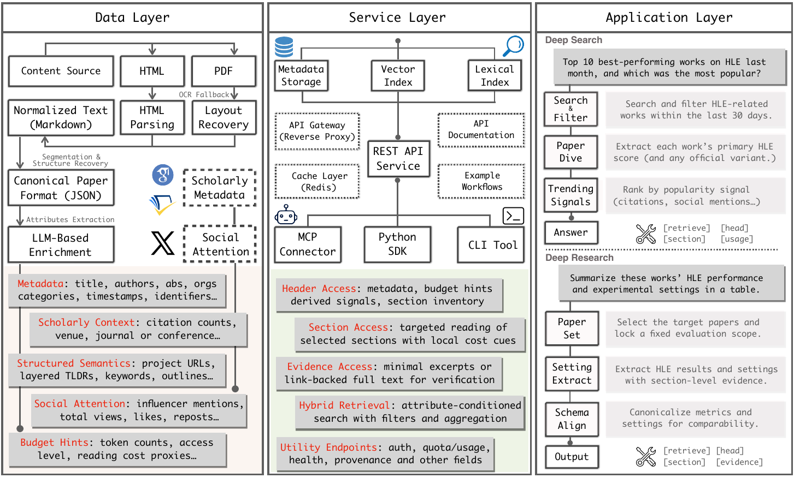

# Title: DeepXiv-SDK: An Agentic Data Interface for Scientific Literature

- ArXiv: 2603.00084
- Authors: Hongjin Qian, Ziyi Xia, Ze Liu, Jianlyu Chen, Kun Luo, Minghao Qin, Chaofan Li, Lei Xiong, Junwei Lan, Sen Wang, Zhengyang Liang, Yingxia Shao, Defu Lian, Zheng Liu
- Sections: 26
- Estimated tokens: 12.0k

[摘要（Abstract）](#abstract)

- [1 引言（Introduction）](#1-introduction)
- [2 相关工作（Related Work）](#2-related-work)
- [3 系统：DeepXiv-SDK（System: DeepXiv-SDK）](#3-system-deepxiv-sdk)
  - [3.1 概述（Overview）](#31-overview)
  - [3.2 数据层：语料库规模的摄取、结构化与信号物化（Data Layer: Corpus-Scale Ingestion, Structuring, and Signal Materialization）](#32-data-layer-corpus-scale-ingestion-structuring-and-signal-materialization)
    - [处理流程（Processing pipeline）](#processing-pipeline)
    - [交付产物（Delivered products）](#delivered-products)
  - [3.3 服务层：渐进式访问与混合检索的统一协议（Service Layer: Unified Protocol for Progressive Access and Hybrid Retrieval）](#33-service-layer-unified-protocol-for-progressive-access-and-hybrid-retrieval)
    - [API 接口（API surface）](#api-surface)
    - [作为服务接口的客户端接口（Client interfaces as service surfaces）](#client-interfaces-as-service-surfaces)
  - [3.4 应用层：SDK、智能体与深度研究工作流（Application Layer: SDK, Agent, and Deep-Research Workflows）](#34-application-layer-sdk-agent-and-deep-research-workflows)
- [4 许可（License）](#4-license)
- [5 评估（Evaluation）](#5-evaluation)
  - [5.1 智能体搜索（Agentic Search）](#51-agentic-search)
    - [设置（Setup）](#setup)
    - [结果与分析（Results and analysis）](#results-and-analysis)
  - [5.2 深度研究问答（Deep Research QA）](#52-deep-research-qa)
    - [设置（Setup）](#setup)
    - [结果与分析（Results and analysis）](#results-and-analysis)
  - [5.3 延迟性能（Latency Performance）](#53-latency-performance)
- [6 结论（Conclusion）](#6-conclusion)

## 摘要（Abstract）

**基于大语言模型的智能体（LLM-agents）** 正被越来越多地用于加速科学研究的进程。然而，一个持续的瓶颈是 **数据访问（data access）** ：智能体不仅缺乏现成的检索工具，还必须处理互联网上非结构化、以人为中心的数据，如 HTML 网页和 PDF 文件，这导致 **词元（token）** 消耗过多、工作效率受限以及证据查找脆弱。这一差距推动了 **智能体数据接口（agentic data interface）** 的开发，其设计目标是使智能体能够以更有效、高效且成本可控的方式访问和利用科学文献。

本文介绍了 **DeepXiv-SDK** ，它为科学文献提供了一个三层智能体数据接口。1) **数据层（Data Layer）** ，将非结构化、以人为中心的数据转换为 JSON 格式的规范化、结构化表示，提高了数据可用性并实现了数据的渐进式可访问性。2) **服务层（Service Layer）** ，提供现成的数据访问和即席检索工具。它还支持丰富的智能体使用形式，包括 CLI、MCP 和 Python SDK。3) **应用层（Application Layer）** ，创建了一个内置智能体，打包了服务层的基本工具以支持复杂的数据访问需求。

DeepXiv-SDK 目前支持完整的 **ArXiv** 语料库，并每日同步以纳入新发布的论文。它被设计为可扩展到所有常见的开放获取语料库，如 PubMed Central、bioRxiv、medRxiv 和 chemRxiv。我们发布了 RESTful API、开源的 Python SDK 以及一个展示深度搜索和深度研究工作流的网络演示。DeepXiv-SDK 注册后即可免费使用。

**DeepXiv-SDK：面向科学文献的智能体数据接口**

Hongjin Qian, Ziyi Xia, Ze Liu, Jianlyu Chen, Kun Luo, Minghao Qin, Chaofan Li, Lei Xiong, Junwei Lan, Sen Wang, Zhengyang Liang, Yingxia Shao, Defu Lian, Zheng Liu(^†^†注：通讯作者。) 北京智源人工智能研究院 {chienqhj,zhengliu1026}@gmail.com 项目页面：[https://github.com/DeepXiv/deepxiv_sdk](https://github.com/DeepXiv/deepxiv_sdk)

## 1 引言（Introduction）

基于大语言模型的智能体已成为将通用语言模型转变为目标导向系统的实用范式，这些系统能够分解任务、调用工具并通过迭代反馈优化决策（Yao 等人，[2023]；Wang 等人，[2024b]）。在其应用中， **研究智能体（research agents）** 在支持探究和证据驱动的科学决策方面尤其具有前景（Schmidgall 等人，[2025]；Asai 等人，[2026]）。此类工作流中的一项基础能力是可靠地访问学术论文：智能体必须快速识别相关工作、浏览冗长且异构的文档，并检索可验证的证据来支撑其主张和综合（Mei 等人，[2025]；Ju 等人，[2025]；OpenAI，[2025]）。

尽管智能体框架发展迅速，但当今流程中的论文访问在很大程度上仍然是 **即席的（ad hoc）** （Ifargan 等人，[2025]；Miao 等人，[2025]）。一个常见的工作流是查询通用搜索引擎，以 PDF 或 HTML 形式打开论文，启发式地提取文本，然后将大块文本反馈给智能体进行检索或问答（Agarwal 等人，[2024]）。这个流程既低效又脆弱：它反复产生大量的解析和读取开销，依赖于文档特定的格式特性，并且缺乏跨领域和跨领域的标准化接口（Yang 等人，[2025]）。因此，中间表示很难跨任务或智能体复用，模型必须在没有明确结构、成本或证据范围概念的情况下，对嘈杂的非结构化文本进行推理（Qian 和 Liu，[2025]）。

> 图 1：DeepXiv-SDK 的系统概览。系统摄取并丰富论文，将其转换为具有成本感知、渐进式访问视图（标题优先筛选、章节级导航和证据级验证）的规范化模式，并通过由混合检索（词法和密集索引）支持的 REST API 提供服务。这些能力支持智能体应用，包括深度搜索、深度研究以及可复现、基于证据的比较。

一个对智能体友好的解决方案应将论文访问视为一个 **数据接口（data interface）** ，而非一次性的解析步骤（Yang 等人，[2025]）。首先，它应该是结构化和规范化的，通过一致的 **模式（schema）** 公开论文，以便智能体可以通过单一协议访问元数据、文档结构和支持证据（Tirado 等人，[2016]；Lù 等人，[2025]）。其次，它应支持按知识密度进行 **渐进式披露（progressive disclosure）** ，提供从粗到细的视图，允许智能体在支付完整上下文成本之前决定 **读什么** 和 **读多少** ，从而减轻认知负担并减少不必要的词元消耗（Qian 和 Liu，[2025]）。第三，它应该是面向检索且可条件化的，使智能体能够通过对多个属性组合约束来定位和筛选论文，并在确定候选论文后路由到最相关的部分（Song 等人，[2025]）。这些原则共同使论文访问变得可复用、成本感知且以证据为导向。

在这些原则的指导下，我们介绍了 **DeepXiv-SDK** ，这是一个统一的、智能体可调用的接口，它将论文转变为 **具有可控访问成本的结构化对象** 。DeepXiv-SDK 将每篇论文物化为模式规范化的视图，智能体可以确定性地查询这些视图：一个 **标题优先视图（header-first view）** ，公开核心元数据、章节清单和全局成本提示；一个 **章节可寻址视图（section-addressable view）** ，支持无需完整文档摄取的目标阅读；以及一个 **证据级视图（evidence-level view）** ，返回完整内容以供验证和下游处理。为了使发现和筛选同样对工具友好，DeepXiv-SDK 还提供了基于词法和密集索引的 **混合、属性条件化检索（hybrid, attribute-conditioned retrieval）** ，允许智能体在实际约束下（例如，类别信号、作者、时间范围、引用/场所属性）过滤和聚合候选论文，然后再深入最相关的章节。我们在 ArXiv 规模上部署了 DeepXiv-SDK，并每日同步新发布的论文（通常在 24 小时内），并发布了 RESTful API、开源 SDK 以及一个展示深度搜索和深度研究工作流的实时演示。

最后，我们构建了一个小型实用评估集，以评估在两个与接口设计匹配的任务族下的端到端实用性。在 **深度搜索（deep search）** 中，智能体在时间限制下使用检索加标题优先筛选来检索和筛选相关论文；在 **深度研究（deep research）** 中，智能体选择性地阅读章节以提取详细证据，并生成带有证据链接的报告或比较表格。在这两种设置下，DeepXiv-SDK 通过避免默认的全文摄取减少了词元开销，通过混合、属性条件化搜索和结构感知路由提高了检索精度，并且仅在需要验证时才升级到证据级访问，从而产生更高质量的输出。我们还对服务进行了压力测试，观察到当前堆栈能够支持 **每日数百万次请求** 并具备扩展能力，在实践中支持交互式智能体使用。

## 2 相关工作（Related Work）

随着大语言模型智能体日益依赖工具使用和多步交互， **数据访问（data access）** 常常成为扩展智能体能力的瓶颈，因为智能体必须反复检索、解析并基于外部工件（如网页和 PDF）进行推理（Wang 等人，[2024b]；Yao 等人，[2023]；OpenAI，[2025]）。因此，越来越多的工作主张将原始网络工件转变为 **结构化的、智能体可调用的接口（structured, agent-callable interfaces）** ，这些接口具有规范化模式、可控视图和来源追踪，以减少即席解析并提高可靠性（Qian 和 Liu，[2025]；Song 等人，[2025]）。在科学文献领域，许多先前的工作侧重于智能体框架或网络平台以提高文献综述效率（例如，搜索-阅读工作流、迭代摘要和多文档问答），但通常不公开一个可复用的 **数据接口 API（data interface API）** ，供智能体跨任务确定性地调用（He 等人，[2025]；Miao 等人，[2025]；Ju 等人，[2025]）。在理念上最接近的工作是 ar5iv 和 AlphaXiv，它们通过将 arXiv 论文转换为可读的 HTML 和增强视图，提供了更易用的浏览体验。(^1^11[https://ar5iv.labs.arxiv.org/](https://ar5iv.labs.arxiv.org/))(^2^22[https://www.alphaxiv.org/](https://www.alphaxiv.org/)) 这些系统最好被视为供人类浏览的 arXiv 高级镜像，而非旨在通过可复用的 API 和渐进式、成本感知的访问来扩展的智能体数据接口。

相比之下，DeepXiv-SDK 提供了一个可访问的、渐进式的接口，具有明确的成本提示和混合、属性条件化检索，使智能体能够廉价筛选、选择性阅读并按需验证。

[3.1 概述](#31-概述)

- [3.2 数据层：语料库规模的摄取、结构化与信号物化](#32-数据层语料库规模的摄取结构化与信号物化)
- [3.3 服务层：渐进式访问与混合检索的统一协议](#33-服务层渐进式访问与混合检索的统一协议)
- [3.4 应用层：SDK、智能体与深度研究工作流](#34-应用层sdk智能体与深度研究工作流)

### 3.1 概述（Overview）

图 [1](#figure-1) 展示了 **DeepXiv-SDK** 作为一个 **论文原生（paper-native）、智能体化（agentic）的数据接口** ，它将学术论文转化为具有可控访问成本的 **结构化、可工具调用的对象（structured, tool-callable objects）** 。该系统包含三个层次。

**数据层（Data Layer）** 执行语料库规模的规范化和丰富化，物化出一个 **可按章节寻址（section-addressable）的规范表示** ，其中包含机器可消费的信号，如文档结构、轻量级摘要和明确的预算提示（例如，词元/长度统计）。在此基础上， **服务层（Service Layer）** 公开了一个统一协议，提供：（i）通过信息密度和成本递增的结构化视图（标题、章节、证据）实现 **渐进式访问（progressive access）** ；（ii） **混合的、基于属性条件的检索（hybrid, attribute-conditioned retrieval）** ，用于在阅读前构建和优化候选论文集合。最后， **应用层（Application Layer）** 将这些原语实例化为端到端的演示服务，包括用于候选发现和筛选的 **深度搜索（deep search）** ，以及用于迭代式章节阅读和证据关联合成的 **深度研究（deep research）** 。这种分层设计保持了接口的模块化和可复用性；我们将在以下各节详细说明每一层。

### 3.2 数据层：语料库规模的摄取、结构化与信号物化（Data Layer: Corpus-Scale Ingestion, Structuring, and Signal Materialization）

数据层（图 [1](#figure-1)，左侧）将异构的 arXiv 制品转换为 **模式稳定、智能体可消费的论文对象（schema-stable, agent-consumable paper objects）** 。arXiv 提供官方元数据，而内容则以 PDF/HTML 格式交付，其布局和章节提示高度可变；直接读取这些原始制品会迫使每个智能体流水线重新实现解析和分割，导致脆弱的失败和不可复现的读取。DeepXiv-SDK 集中处理这项工作，并物化出一个具有明确结构、衍生信号和预算提示的规范表示。

> 表 1：DeepXiv-SDK 数据层的交付成果：丰富的信号族与物化的访问视图。

| 信号 / 视图 | 物化内容（示例）                                                                          |
| :---------- | :---------------------------------------------------------------------------------------- |
| 核心元数据  | 标题、作者、摘要、类别、发布/更新时间、所属机构、标识符（arXiv ID，如可用则包括 DOI）     |
| 结构化信息  | 章节大纲、章节 TL;DR（简短摘要）、关键词、资源链接                                        |
| 预算提示    | 词元/长度估计（论文级和章节级）、预览截断标志（例如，`is_truncated`, `total_characters`） |
| 学术背景    | 引用属性和（如可用）会议/期刊信号（附带来源存储）                                         |
| 社会关注度  | 从链接到 arxiv.org 的帖子中聚合的可选关注度指标（例如，浏览量、点赞、转发）               |
| 概览视图    | 标题优先的有效载荷：核心元数据、衍生信号、章节清单、全局预算提示                          |
| 章节视图    | 可按章节寻址的有效载荷：章节文本、摘要、各章节预算提示                                    |
| 证据视图    | 可用于验证的完整内容：完整的 Markdown 和结构化 JSON，用于确定性的下游处理                 |

- [处理流水线](#处理流水线)
- [交付成果](#交付成果)

#### 处理流水线（Processing pipeline）

给定一个 arXiv ID，数据层运行一个确定性的流水线，生成一个可按章节寻址的论文对象以及衍生信号。它首先通过 **OAI-PMH** 协议拉取官方元数据，并记录发布/更新时间戳以进行同步。然后获取源制品，优先使用可用的 HTML 渲染视图，否则回退到 PDF。对于 PDF，我们使用 **MinerU** （Wang 等人，[2024a]）将文档转换为 Markdown，以将异构布局规范化为以文本为中心的格式；对于 HTML，我们提取主要内容并将其规范化为相同的内部表示。接下来，我们通过检测标题提示和格式规律来恢复文档结构，构建一个有序的章节清单（章节标题和层级），并将规范化的文本分割成章节级的有效载荷。这些输出被组装成一个具有固定模式（论文级字段加上明确的章节映射）的规范 JSON，支持跨论文的确定性章节寻址。

在规范 JSON 之上，我们物化渐进式访问和检索所需的信号。我们首先计算预算提示，包括全局和每章节的词元/长度统计（通过 `tiktoken`）。然后，我们使用一个小型指令模型生成轻量级语义信号，包括论文预览 TL;DR 和每章节 TL;DR。接着，我们通过正则表达式提取资源链接（例如，GitHub 仓库），并使用 **LLM** 通过联合考虑 URL 身份和论文预览上下文来验证每个候选 URL 是否真正与论文相关。我们进一步在可用时附加可选的外部上下文，包括通过将 arXiv ID 链接到第三方学术服务（如 **Semantic Scholar** 或 **Google Scholar** ）获得的引用计数和会议/期刊元数据，以及从 X.com 上提及 arxiv.org 的搜索结果中聚合的社会关注度信号（例如，浏览量、点赞、转发）。最后，我们持久化多个物化视图（概览、章节和证据形式）以及来源字段（源类型、提取时间、更新时间），使下游智能体流水线能够进行可追溯和可复现的访问。

#### 交付成果（Delivered products）

数据层输出一组物化视图以及丰富的信号族，因此智能体可以确定性地消费论文，而无需进行临时解析。具体来说，DeepXiv-SDK 提供了一个用于筛选和路由的概览视图、一个用于可按章节寻址导航的章节视图，以及一个暴露完整内容的证据视图。这些视图旨在支持从低成本分诊到针对性阅读，并在需要时到证据级验证的明确升级路径。在所有视图中，响应都包含预算提示（论文级和章节级的成本提示）和来源（源类型、提取时间、更新时间），使智能体能够规划阅读成本、跟踪新鲜度并保持可追溯性。表 [1](#table-1) 总结了物化视图和相应的信号族。

### 3.3 服务层：渐进式访问与混合检索的统一协议（Service Layer: Unified Protocol for Progressive Access and Hybrid Retrieval）

服务层将数据层制品转化为一个 **稳定、具备预算感知（stable, budget-aware）** 的接口，供智能体调用。其目标是使论文访问（i）在任务和语料库间协议可复用，以及（ii）成本可控，以便智能体可以从低成本筛选开始，升级到章节级阅读，并且仅在需要验证时才请求全文。DeepXiv-SDK 通过一个统一的 **REST** 服务暴露这些原语，该服务包含承载令牌认证、用于高频读取的 **Redis** 缓存、按需加载较重视图的功能，以及一个使工具调用可审计的使用量端点。

- [API 接口](#api-接口)
- [作为服务接口的客户端接口](#作为服务接口的客户端接口)

#### API 接口（API surface）

表 [4](#table-4) 总结了核心端点。该 API 提供两种互补的能力。首先，它支持通过信息密度和成本递增的结构化视图（概览、预览、章节、全文）进行渐进式访问。其次，它提供带有属性条件的混合检索（词法加稠密），使智能体能够在阅读前构建和优化候选论文集合。这些端点共同允许智能体明确控制阅读预算，并将证据级访问推迟到必要时。

#### 作为服务接口的客户端接口（Client interfaces as service surfaces）

为了减少集成摩擦，DeepXiv-SDK 提供了三个绑定到相同 REST 协议的轻量级客户端：（i）一个用于确定性检索和渐进式阅读调用的 **Python SDK** ，（ii）一个在智能体运行时中将端点注册为工具原语的 **MCP 连接器** ，以及（iii）一个用于脚本化使用和可复现评估的 **CLI** 。将这些客户端视为服务层的一部分，确保了协议在操作上是可用的，而不仅仅是规范化的。

### 3.4 应用层：SDK、智能体与深度研究工作流（Application Layer: SDK, Agent, and Deep-Research Workflows）

应用层将服务原语打包成 **面向开发者和智能体（developer- and agent-ready）** 的工具，用于学术论文的深度研究。其目标有两个：提供能够干净地集成到研究智能体栈中的可复现绑定，以及提供一个直接实例化渐进式论文访问作为可执行工作流的智能体实现。

DeepXiv-SDK 包含一个轻量级的 Python SDK，它将 REST 协议封装成一小组确定性的调用，涵盖 **检索（retrieval）** 和 **渐进式阅读（progressive reading）** （标题、章节和证据访问）。在这些工具之上，DeepXiv-SDK 集成了一个专为以论文为中心的深度研究而设计的内置智能体：用户可以在 Python 中实例化它（例如，`agent = deepxiv.agent(...); agent.query("...")`）或从 CLI 调用它（例如，`deepxiv agent query "..."`），该智能体会自动检索候选论文，通过低成本视图筛选它们，路由到相关章节，并且仅在需要验证时才升级到证据级阅读。

为了使预期行为具体化，我们公开了两个规范工作流。 **深度搜索（Deep search）** 强调通过混合检索和标题级信号（可选地结合社会关注度指标）进行候选集构建、过滤和排序。 **深度研究（Deep research）** 执行迭代式章节阅读以提取实验设置和结果，并生成跨论文集的证据关联摘要或比较表格。最后，我们在[此网站](https://1stauthor.com/)上提供了一个实时演示，在交互式环境中端到端地展示这些工作流。

## 4 许可协议（License）

DeepXiv-SDK 被设计为一个 **智能体访问与结构化接口（agentic access and structuring interface）** ，而非全文再分发服务。我们根据 arXiv API 使用条款复用 arXiv 的 **描述性元数据（descriptive metadata）** （例如，标题、作者、摘要、类别和时间戳），该条款规定 arXiv 电子预印本元数据在 CC0 1.0 下可用。(^3^33[https://info.arxiv.org/help/api/tou.html](https://info.arxiv.org/help/api/tou.html)) 除了元数据，DeepXiv-SDK 还衍生出导航和丰富化信号（例如，章节结构、摘要、预算提示以及可选的学术/社会背景），以支持智能体筛选、路由和证据查找。

对于论文内容，我们不主张再分发权利，也不镜像或批量提供全文。大多数 arXiv 提交使用默认的 arXiv 许可，该许可授予 arXiv 分发作品的权利，但通常不授予第三方无限制地再分发全文的权利；arXiv 进一步建议基于全文构建的工具链接回 arXiv 进行下载。(^4^44[https://info.arxiv.org/help/bulk_data_s3.html](https://info.arxiv.org/help/bulk_data_s3.html)) 因此，对于任何需要访问原始论文的请求，DeepXiv-SDK 返回源链接（arXiv 着陆页或出版商提供的 URL），而不是提供镜像副本。这一立场与现有的 arXiv 衍生浏览接口（如 **ar5iv** (^5^55[https://ar5iv.labs.arxiv.org/](https://ar5iv.labs.arxiv.org/)) 和 **AlphaXiv** (^6^66[https://www.alphaxiv.org/](https://www.alphaxiv.org/))）一致，它们在链接回源的同时提高了可用性。

[2](#figure-2) 总结了结果，表 [3](#table-3) 给出了代表性查询示例。

- [5.1 代理式搜索](#51-agentic-search)
- [5.2 深度研究问答](#52-deep-research-qa)
- [5.3 延迟性能](#53-latency-performance)

### 5.1 代理式搜索（Agentic Search）

- [实验设置（Setup）](#setup)
- [结果与分析（Results and analysis）](#results-and-analysis)

#### 实验设置（Setup）

我们构建了一个专注于搜索的评估集，包含 50 个多条件查询，每个查询都映射到 **一篇** 目标论文（唯一答案）。我们将 DeepXiv 与五个提供代理式搜索功能的学术搜索平台进行比较：Google Scholar、Google Scholar Labs (^7^77[https://scholar.google.com/scholar_labs/](https://scholar.google.com/scholar_labs/))、alpXiv (^8^88[https://www.alphaxiv.org/](https://www.alphaxiv.org/))、PASA (^9^99[https://pasa-agent.ai/](https://pasa-agent.ai/)) 和 ASTA (^10^1010[https://asta.allen.ai/](https://asta.allen.ai/))。我们报告检索指标，并测量普通搜索与代理式深度搜索的端到端延迟（图 [2](#figure-2) a）。

> **图 2：DeepXiv-SDK 的评估结果** 。（a）在 50 个具有唯一目标的多约束查询上进行代理式论文搜索：与现有的代理式搜索平台相比，DeepXiv 实现了更高的 Recall@1/10，且延迟显著更低。（b）在 47 个查询上进行深度研究问答：与传统的搜索与阅读（Search&Read）流程相比，DeepXiv 在提高答案质量的同时，降低了令牌消耗和时间成本。

#### 结果与分析（Results and analysis）

DeepXiv 在准确性和效率方面均持续优于基线模型。在所有多约束查询中，DeepXiv 实现了更强的顶级检索效果，并保持了高召回率，同时在标准搜索中保持近乎交互式的速度，并且在代理式搜索中比依赖大量验证的系统快得多。从定性角度看，PASA 和 alpXiv 通常枚举候选论文并通过阅读全文进行验证，而 DeepXiv 则利用 **渐进式访问（progressive access）** ：代理首先使用低成本的标题/预览信号进行筛选，仅在必要时才升级到章节或证据级别的阅读，这提高了精确度并减少了延迟。

### 5.2 深度研究问答（Deep Research QA）

- [实验设置（Setup）](#setup)
- [结果与分析（Results and analysis）](#results-and-analysis)

#### 实验设置（Setup）

我们构建了第二个评估集，包含 47 个复杂的问答查询，这些查询需要聚合和验证来自论文的证据（例如，关于基准结果的时间范围问题，如“过去一个月内的最佳分数”）。我们比较了两个代理流程：（i）使用 Google Search 进行检索并使用 Jina Reader (^11^1111[https://jina.ai/](https://jina.ai/)) 阅读全文的传统 **搜索与阅读（Search & Read, S&R）** 流程，以及（ii）基于 DeepXiv 的流程，该流程使用基于属性的条件检索（attribute-conditioned retrieval）加上渐进式访问（标题、章节、证据）进行针对性阅读。

#### 结果与分析（Results and analysis）

图 [2](#figure-2)b 显示，基于 DeepXiv 的深度研究通过避免默认的全文摄取，并用结构化的、可按章节寻址的访问方式替代脆弱的页面解析，从而降低了工具成本和实际延迟。在代表性模型中，DeepXiv 持续提高了端到端的答案质量，同时显著减少了令牌消耗和运行时间。这种模式与预期的交互模型一致：代理使用低成本视图筛选候选论文，选择性阅读相关章节，仅在需要验证时才升级到证据级别的访问。总体而言，结果支持了 DeepXiv-SDK 的核心主张：通过渐进式、预算感知的访问使论文变得 **可工具调用（tool-callable）** ，提高了研究代理工作流程的效率和证据基础质量。

### 5.3 延迟性能（Latency Performance）

我们在 1000 个 arXiv ID 上对 DeepXiv-SDK 的延迟进行基准测试，并发数 $=16$，报告了本地（同区域）和远程（跨国）调用的平均冷启动（缓存未命中）和热启动（缓存命中）时间（表 [2](#table-2)）。在此负载下，服务仍保持交互性，缓存为频繁访问的视图提供了可靠的加速（预览视图最高可达 $3.36\times$）；即使在远程情况下，对于较重的端点（如 json，181.6 毫秒），热启动延迟也保持在几百毫秒内。

作为对比，在相同的 1000 篇论文上，传统的“获取+解析”工作流程通过商业代理池获取 HTML/PDF 需要 31 分 12 秒，转换为 Markdown 格式需要 88 分 49 秒（使用 8$\times$A100 GPU），总计 120 分 01 秒，即每篇论文 7.20 秒。与此基线相比，DeepXiv-SDK 实现了巨大的端到端加速，例如，对于热启动的 json 访问，本地加速比为 $54.6\times$，远程加速比为 $39.6\times$。

> **表 2：在 1000 个 arXiv ID 上、并发数 $=16$ 时的平均延迟（本地 vs 远程；冷启动 vs 热启动）** 。缓存加速比（Cache spd）为冷启动/热启动。作为比较，获取+解析基线：1000 篇论文耗时 120 分 01 秒（每篇论文 7200 毫秒）。

| 端点（Endpoint） | 本地（Local） (ms) | 远程（Remote） (ms) | 缓存加速比（Cache spd） |
| :--------------- | :----------------- | :------------------ | :---------------------- | -------------- | ----------------- |
|                  | 冷启动（Cold）     | 热启动（Warm）      | 冷启动（Cold）          | 热启动（Warm） | (本地 L / 远程 R) |
| head             | 23.21              | 12.51               | 142.55                  | 114.62         | 1.86 / 1.24       |
| brief            | 187.55             | 164.46              | 307.39                  | 196.25         | 1.14 / 1.57       |
| raw              | 108.14             | 146.15              | 216.29                  | 167.89         | 0.74 / 1.29       |
| json             | 203.79             | 131.89              | 283.21                  | 181.63         | 1.55 / 1.56       |
| preview          | 102.05             | 30.39               | 201.46                  | 112.31         | 3.36 / 1.79       |

## 6 结论（Conclusion）

在本文中，我们关注 **论文访问（paper access）** 作为研究代理的一个实际瓶颈：现有的流程通常将论文视为原始的 PDF/HTML 文件，导致昂贵的全文摄取和脆弱的证据查找。我们提出了 **DeepXiv-SDK** ，这是一个代理式数据接口，它将论文表示为规范化的、可工具调用的对象，具有渐进式访问（标题 $\rightarrow$ 章节 $\rightarrow$ 证据）和混合的、基于属性的条件检索功能。通过一个每日同步的 arXiv 规模部署，我们将此设计实现为一个稳定的服务和 SDK，代理可以在不同任务中重复调用。通过在多约束代理式搜索和复杂深度研究问答上的任务驱动评估，以及在并发负载下的延迟基准测试，我们实证表明，DeepXiv-SDK 能够实现更便宜的筛选、更具选择性的章节阅读，以及仅在需要时进行验证，从而提高了 AI4Science 工作流程的效率和证据基础质量。

DeepXiv-SDK 的实现细节（数据处理和服务部署）在附录 [A](#appendix-a) 中提供，当前语料库统计信息总结在附录 [B](#appendix-b) 中，清单 [1](#LST1) 展示了一篇示例论文返回的元数据格式。
