# Title: The Trinity of Consistency as a Defining Principle for General World Models

一致性三位一体作为一般世界模型的定义原则

- ArXiv: 2602.23152
- Sections: 192
- Estimated tokens: 82.2k
- 机构：
  - Shanghai Artificial Intelligence Laboratory
  - University of Chinese Academy of Sciences
  - Westlake University
  - National University of Singapore
  - Shanghai Jiaotong University
  - Zhejiang University
  - China University of Petroleum (East China)

## 目录（Contents）

- [摘要（Abstract）](#abstract)
- [1 引言（Introduction）](#1-introduction)
- [2 一致性基础探索（Foundational Exploration of Consistencies）](#2-foundational-exploration-of-consistencies)
  - [2.1 通用世界模型的结构剖析（The Anatomy of General World Models）](#21-the-anatomy-of-general-world-models)
  - [2.2 模态一致性（Modal Consistency）](#22-modal-consistency)
    - [2.2.1 理论基础（Theoretical Foundations）](#221-theoretical-foundations)
      - [柏拉图洞穴与投影流形（Platonic Cave &amp; Projected Manifolds）](#platonic-cave-projected-manifolds)
      - [超球面假设与模态间隙（Hypersphere Hypothesis &amp; Modal Gap）](#hypersphere-hypothesis-modal-gap)
      - [计算范式的演进：从摊销推理到测试时计算（Evolution of Computational Paradigms: From Amortized Inference to Test-time Compute）](#evolution-of-computational-paradigms-from-amortized-inference-to-test-time-compute)
    - [2.2.2 离散序列 vs. 连续流形（Discrete Sequences vs. Continuous Manifolds）](#222-discrete-sequences-vs)
      - [离散自回归（Discrete Autoregressive, AR）](#离散自回归-discrete-autoregressive-ar)
      - [连续流匹配（Continuous Flow Matching, FM）](#连续流匹配-continuous-flow-matching-fm)
    - [2.2.3 架构演进（Architectural Evolution）](#2-2-3-architectural-evolution)
      - [早期演进：双塔架构与连接器范式的建立（Early Evolution: Establishment of Dual-Tower Architectures and Connector Paradigms）](#1-早期演进双塔架构与连接器范式的建立)
      - [早期融合与统一优化的挑战（Early Fusion and the Challenge of Unified Optimization）](#2-早期融合与统一优化的挑战)
      - [正交解耦的主流范式（The Mainstream Paradigm of Orthogonal Decoupling）](#3-正交解耦的主流范式)
    - [2.2.4 通过强化学习进行意图对齐（Intent Alignment via RL）](#2-2-4-通过强化学习进行意图对齐)
      - [过程监督与物理约束（Process Supervision &amp; Physical Constraints）](#过程监督与物理约束-process-supervision-physical-constraints)
      - [感知-生成协同循环（Perception-Generation Synergistic Loop）](#感知-生成协同循环-perception-generation-synergistic-loop)
      - [面向自回归模型的分解优化（Factorized Optimization for AR Models）](#面向自回归模型的分解优化-factorized-optimization-for-ar-models)
    - [2.2.5 通过测试时计算实现认知循环（Cognitive Loop via Test-time Compute）](#2-2-5-通过测试时计算实现认知循环)
  - [2.3 空间一致性（Spatial Consistency）](#2-3-spatial-consistency)
    - [2.3.1 一致性的几何分解（Geometric Decomposition of Consistency）](#231-geometric-decomposition-of-consistency)
      - [微观层面：局部邻域拓扑一致性（Micro-level: Local Neighborhood Topological Consistency）](#micro-level-local-neighborhood-topological-consistency)
      - [宏观层面：全局几何一致性（Macro-level: Global Geometric Consistency）](#macro-level-global-geometric-consistency)
    - [2.3.2 理论公式（Theoretical Formulation）](#232-theoretical-formulation)
      - [物理渲染：辐射传输方程（Physical Rendering: The RTE）](#physical-rendering-the-rte)
      - [生成演化：随机微分方程（Generative Evolution: The SDE）](#generative-evolution-the-sde)
      - [运动定律：拉格朗日输运（Motion Law: Lagrangian Transport）](#motion-law-lagrangian-transport)
    - [2.3.3 二维代理流形与域不匹配（2D Proxy Manifold &amp; Domain Mismatch）](#233-2d-proxy-manifold-domain-mismatch)
      - [缺乏 $SE(3)$ 等变性的动力学拟合（Dynamics Fitting Lacking $SE(3)$ Equivariance）](#dynamics-fitting-lacking-s-e-3-se3-equivariance)
      - [物理感知建模的早期尝试与局限性（Early Attempts and Limitations of Physics-aware Modeling）](#early-attempts-and-limitations-of-physics-aware-modeling)
    - [2.3.4 隐式连续场（Implicit Continuous Fields）](#234-implicit-continuous-fields)
      - [表示效率与频率保真度（Representation Efficiency &amp; Frequency Fidelity）](#1-representation-efficiency-frequency-fidelity)
      - [水平集歧义性与程函流形约束（Level Set Ambiguity &amp; Eikonal Manifold Constraints）](#2-level-set-ambiguity-eikonal-manifold-constraints)
    - [2.3.5 显式拉格朗日基元（Explicit Lagrangian Primitives）](#235-explicit-lagrangian-primitives)
      - [静态表示的机制（Mechanisms of Static Representation）](#1-mechanisms-of-static-representation)
      - [向四维动力学的演进（Evolution towards 4D Dynamics）](#2-evolution-towards-4d-dynamics)
    - [2.3.6 生成式统计先验（Generative Statistical Priors）](#236-generative-statistical-priors)
      - [算法与几何约束（Algorithmic &amp; Geometric Constraints）](#1-algorithmic-geometric-constraints)
      - [规模化数据基础（Scaled Data Foundation）](#2-scaled-data-foundation)
  - [2.4 时间一致性（Temporal Consistency）](#2-4-temporal-consistency)
    - [2.4.1 从频率稳定性到物理一致性（From Frequency Stability to Physical Compliance）](#241-from-frequency-stability-to-physical-compliance)
      - [从感知到物理推理（From Perception to Physical Reasoning）](#from-perception-to-physical-reasoning)
    - [2.4.2 潜在时间膨胀（Latent Temporal Inflation）](#242-latent-temporal-inflation)
      - [独立性假设与证据下界松弛（Independence Assumption &amp; ELBO Relaxation）](#independence-assumption-elbo-relaxation)
      - [空间锚定与零样本注入（Spatial Anchoring &amp; Zero-shot Injection）](#spatial-anchoring-zero-shot-injection)
      - [频率滤波与动态校正（Frequency Filtering &amp; Dynamic Correction）](#frequency-filtering-dynamic-correction)
      - [膨胀的理论边界（The Theoretical Boundary of Inflation）](#the-theoretical-boundary-of-inflation)
    - [2.4.3 离散自回归建模（Discrete Autoregressive Modeling）](#243-discrete-autoregressive-modeling)
      - [因果三维分词器与数据压缩（Causal 3D Tokenizer &amp; Data Compression）](#causal-3d-tokenizer-data-compression)
      - [长序列中的记忆衰减（Memory Decay in Long Sequences）](#memory-decay-in-long-sequences)
      - [回归连续潜在空间（Return to Continuous Latent Space）](#return-to-continuous-latent-space)
      - [混合过渡：融合自回归与扩散（Hybrid Transition: Fusing AR and Diffusion）](#hybrid-transition-fusing-ar-and-diffusion)
    - [2.4.4 基于扩散变换器的统一时空建模（Unified Spatiotemporal Modeling via DiT）](#244-unified-spatiotemporal-modeling-via-dit)
      - [原生时空架构（Native Spatiotemporal Architecture）](#native-spatiotemporal-architecture)
      - [计算演进：线性化与推理加速（Computational Evolution: Linearization &amp; Inference Acceleration）](#computational-evolution-linearization-inference-acceleration)
      - [工业界的趋同与分歧（Convergence &amp; Divergence in Industry）](#convergence-divergence-in-industry)
    - [2.4.5 逻辑一致性与因果推理（Logical Consistency and Causal Reasoning）](#245-logical-consistency-and-causal-reasoning)
      - [多模态感知中的“图像伴随思考”（Think-with-Image in Multimodal Perception）](#think-with-image-in-multimodal-perception)
      - [帧链与时间因果性（Chain-of-Frame &amp; Temporal Causality）](#chain-of-frame-temporal-causality)
  - [2.5 一致性的展望（Outlook of the Consistencies）](#2-5-outlook-of-the-consistencies)
- [3 多种一致性的初步整合（Initial Integration of Multiple Consistencies）](#3-initial-integration-of-multiple-consistencies)
  - [3.1 大型多模态模型的崛起（The Rise of Large Multimodal Models）](#31-the-rise-of-large-multimodal-models)
    - [3.1.1 大语言模型作为核心认知基础（LLM as a Core Cognitive Base）](#311-llm-as-a-core-cognitive-base)
      - [模态分词化与表示桥接（Modal Tokenization &amp; Representation Bridging）](#1-modal-tokenization-representation-bridging)
      - [从刚性投影到感知器瓶颈（From Rigid Projection to Perceiver Bottleneck）](#2-from-rigid-projection-to-perceiver-bottleneck)
    - [3.1.2 作为多模态的认知演化（Cognitive Evolution as a Multimodal）](#312-cognitive-evolution-as-a-multimodal)
      - [层次化任务规划与程序化指令（Hierarchical Task Planning &amp; Programmatic Instruction）](#1-hierarchical-task-planning-programmatic-instruction)
      - [工具使用与闭环验证（Tool-use &amp; Closed-loop Verification）](#2-tool-use-closed-loop-verification)
  - [3.2 模态一致性与空间一致性的整合（Integration of Modal and Spatial Consistency）](#32-integration-of-modal-and-spatial-consistency)
    - [3.2.1 像素空间操作（Pixel Space Manipulation）](#321-pixel-space-manipulation)
      - [指令驱动的图像编辑（Instruction-Driven Image Editing）](#1-instruction-driven-image-editing)
      - [通用图像生成（General Image Generation）](#2-general-image-generation)
    - [3.2.2 视角空间映射（View Space Mapping）](#322-view-space-mapping)
      - [姿态对齐的耦合训练（Pose-Aligned Coupled Training）](#姿态对齐的耦合训练)
    - [3.2.3 体积空间表示（Volume Space Representation）](#323-volume-space-representation)
      - [条件三维生成：从二维蒸馏到视频流形约束（Conditional 3D Generation: From 2D Distillation to Video Manifold Constraints）](#1-条件三维生成从二维蒸馏到视频流形约束)
      - [多模态对齐（Multimodal Alignment）](#2-多模态对齐)
      - [三维理解与编辑：语义提升（3D Understanding &amp; Editing: Semantic Lifting）](#3-三维理解与编辑语义提升)
    - [3.2.4 用于模态-空间对齐的强化学习（Reinforcement Learning for Modal-Spatial Alignment）](#324-reinforcement-learning-for-modal-spatial-alignment)
      - [判别器引导的显式锚定（Discriminator-Guided Explicit Anchoring）](#discriminator-guided-explicit-anchoring)
      - [区域-时间解耦（Region-Temporal Decoupling）](#region-temporal-decoupling)
      - [测试时训练与视觉思维链（TTT &amp; Visual CoT）](#ttt-visual-cot)
  - [3.3 模态一致性与时间一致性的整合（Integration of Modal and Temporal Consistency）](#33-integration-of-modal-and-temporal-consistency)
    - [3.3.1 端到端可扩展建模（End-to-End Scalable Modeling）](#331-end-to-end-scalable-modeling)
      - [扩散模型（Diffusion Model）](#1-diffusion-model)
      - [自回归模型（Autoregressive Model, AR）](#2-autoregressive-model-ar)
      - [自回归-扩散混合模型（Autoregressive-Diffusion Hybrid Model）](#3-autoregressive-diffusion-hybrid-model)
    - [3.3.2 显式结构化控制（Explicit Structured Control）](#332-explicit-structured-control)
      - [运动-几何显式编码（Motion-Geometry Explicit Encoding）](#1-motion-geometry-explicit-encoding)
      - [首尾帧锚定与插值（Start-End Frame Anchoring and Interpolation）](#2-start-end-frame-anchoring-and-interpolation)
      - [多条件解耦架构（Multi-Condition Decoupling Architecture）](#3-multi-condition-decoupling-architecture)
    - [3.3.3 统一理解与生成共生架构（Unified Comprehension and Generation Symbiosis Architecture）](#333-unified-comprehension-and-generation-symbiosis-architecture)
      - [共享表示双向协同（Shared Representation Bidirectional Synergy）](#1-shared-representation-bidirectional-synergy)
      - [预训练驱动的协同适应（Pre-training Driven Synergistic Adaptation）](#2-pre-training-driven-synergistic-adaptation)
    - [3.3.4 用于模态-时间对齐的强化学习（Reinforcement Learning for Modal-Temporal Alignment）](#334-reinforcement-learning-for-modal-temporal-alignment)
      - [基于偏好的联合对齐（Preference-based Joint Alignment）](#1-基于偏好的联合对齐)
      - [通过自我精炼的迭代对齐（Iterative Alignment via Self-Refinement）](#2-通过自我精炼的迭代对齐)
      - [通用奖励建模（Universal Reward Modeling）](#3-通用奖励建模)
      - [通过视觉-语言-动作-强化学习的具体化动作对齐（Embodied Action Alignment via VLA-RL）](#4-通过视觉-语言-动作-强化学习的具体化动作对齐)
  - [3.4 空间一致性与时间一致性的整合（Integration of Spatial and Temporal Consistency）](#34-integration-of-spatial-and-temporal-consistency)
    - [3.4.1 隐式时空学习（Implicit Spatiotemporal Learning）](#34-implicit-spatiotemporal-learning)
      - [视频先验蒸馏（Video Prior Distillation）](#视频先验蒸馏video-prior-distillation)
    - [3.4.2 显式几何锚定（Explicit Geometric Anchoring）](#34-explicit-geometric-anchoring)
      - [点云条件化（Point Cloud Conditioning）](#1-point-cloud-conditioning)
      - [几何嵌入注入（Geometric Embedding Injection）](#2-geometric-embedding-injection)
      - [轨迹参数化控制（Trajectory Parametric Control）](#3-trajectory-parametric-control)
    - [3.4.3 统一时空表示（Unified Spatiotemporal Representation）](#34-unified-spatiotemporal-representation)
      - [混合体积表示：低秩张量分解与混合场（Hybrid Volumetric Representation: Low-Rank Tensor Decomposition &amp; Hybrid Fields）](#1-hybrid-volumetric-representation-low-rank-tensor-decomposition-hybrid-fields)
      - [显式结构化表示（Explicit Structured Representation）](#2-explicit-structured-representation)
      - [以轨迹为中心的基础模型（Trajectory-Centric Foundation Models）](#3-trajectory-centric-foundation-models)
    - [3.4.4 用于时空对齐的强化学习（Reinforcement Learning for Spatial-Temporal Alignment）](#34-reinforcement-learning-for-spatial-temporal-alignment)
      - [全局混合奖励反馈与动态对齐（Global Mixed-Reward Feedback &amp; Dynamic Alignment）](#global-mixed-reward-feedback-dynamic-alignment)
      - [层次化结构解耦与显式代价（Hierarchical Structural Decoupling &amp; Explicit Costs）](#hierarchical-structural-decoupling-explicit-costs)
  - [3.5 世界模型的初步涌现（Preliminary Emergence of World Models）](#35-preliminary-emergence-of-world-models)
    - [3.5.1 从基准建立到多样化演进（From Benchmark Establishment to Diverse Evolution）](#35-from-benchmark-establishment-to-diverse-evolution)
      - [Sora：世界模拟器范式的建立（Sora: Paradigm Establishment of World Simulator）](#sora-world-simulator-paradigm-establishment)
      - [Open-Sora：技术民主化与架构验证（Open-Sora: Technology Democratization &amp; Architecture Verification）](#open-sora-technology-democratization-architecture-verification)
      - [从被动观察到主动交互的转变（Transition from Passive Observation to Active Interaction）](#from-passive-observation-to-active-interaction)
      - [多样化技术路径的协同印证（Synergistic Corroboration of Diverse Technical Paths）](#synergistic-corroboration-of-diverse-technical-paths)
    - [3.5.2 三种一致性的对抗循环（Combat Loop of Three Consistencies）](#35-combat-loop-of-three-consistencies)
      - [交互式世界模拟器：物理、逻辑与三维保真度的融合（Interactive World Simulators: The Convergence of Physics, Logic, and 3D Fidelity）](#interactive-world-simulators-the-convergence-of-physics-logic-and-3d-fidelity)
      - [统一的认知-动作流形：从操作到导航（Unified Cognition-Action Manifolds: From Manipulation to Navigation）](#unified-cognition-action-manifolds-from-manipulation-to-navigation)
      - [基于物理因果性的时空约束（Spatio-Temporal Constraints Based on Physical Causality）](#spatio-temporal-constraints-based-on-physical-causality)
- [4 挑战、基准与展望（Challenges, Benchmarks, and Outlook）](#4-challenges-benchmarks-and-outlook)
  - [4.1 从初步融合到真正统一的核心挑战（Core Challenges from Preliminary Fusion to True Unification）](#4-1-core-challenges-from-preliminary-fusion-to-true-unification)
  - [4.2 构建综合评估基准（Constructing Comprehensive Evaluation Benchmarks）](#4-2-constructing-comprehensive-evaluation-benchmarks)
    - [4.2.1 模态一致性：从符号映射到知识协同（Modal Consistency: From Symbol Mapping to Knowledge Synergy）](#4-2-1-modal-consistency-from-symbol-mapping-to-knowledge-synergy)
      - [知识驱动对齐（Knowledge-driven Alignment）](#知识驱动对齐knowledge-driven-alignment)
      - [理解与生成之间的执行鸿沟（Execution Gap between Understanding and Generation）](#理解与生成之间的执行鸿沟execution-gap-between-understanding-and-generation)
    - [4.2.2 空间一致性：从视觉相似性到拓扑与物理验证（Spatial Consistency: From Visual Similarity to Topological &amp; Physical Verification）](#4-2-2-spatial-consistency-from-visual-similarity-to-topological-physical-verification)
      - [拓扑逻辑与交互推理（Topological Logic &amp; Interactive Reasoning）](#拓扑逻辑与交互推理topological-logic-interactive-reasoning)
      - [物理模拟与穿透检测（Physical Simulation &amp; Penetration Detection）](#物理模拟与穿透检测physical-simulation-penetration-detection)
    - [4.2.3 时间一致性：从帧间平滑性到逻辑因果演化（Temporal Consistency: From Inter-frame Smoothness to Logical Causal Evolution）](#4-2-3-temporal-consistency-from-inter-frame-smoothness-to-logical-causal-evolution)
      - [静态时间语义（时间即属性）（Static Temporal Semantics (Time-as-Attribute)）](#静态时间语义时间即属性static-temporal-semantics-time-as-attribute)
      - [视觉物理时序（视频中的思考）（Visual Physical Chronology (Thinking-in-Video)）](#视觉物理时序视频中的思考visual-physical-chronology-thinking-in-video)
      - [符号逻辑时序与过程可验证性（Symbolic Logical Chronology &amp; Process Verifiability）](#符号逻辑时序与过程可验证性symbolic-logical-chronology-process-verifiability)
      - [长程缺陷与恒常性失效（Long-range Defects &amp; Constancy Failure）](#长程缺陷与恒常性失效long-range-defects-constancy-failure)
    - [4.2.4 现有基准的局限性与本基准的设计原理（Limitations of Existing Benchmarks &amp; Design Rationale of Our Benchmark）](#4-2-4-limitations-of-existing-benchmarks-design-rationale-of-our-benchmark)
      - [指标的软上限与评估幻觉（Soft Ceiling of Metrics &amp; Judge Hallucination）](#指标的软上限与评估幻觉soft-ceiling-of-metrics-judge-hallucination)
      - [分布内记忆掩盖了分布外泛化的不足（In-Distribution Memory Masks OOD Generalization Shortcomings）](#分布内记忆掩盖了分布外泛化的不足in-distribution-memory-masks-ood-generalization-shortcomings)
      - [长程生成中的误差累积与缺乏过程验证（Error Accumulation in Long-range Generation &amp; Lack of Process Verification）](#长程生成中的误差累积与缺乏过程验证error-accumulation-in-long-range-generation-lack-of-process-verification)
      - [缺乏用于主动干预的因果探针（Lack of Causal Probes for Active Intervention）](#缺乏用于主动干预的因果探针lack-of-causal-probes-for-active-intervention)
  - [4.3 终极展望：通用世界模拟器（Ultimate Outlook: General World Simulator）](#4-3-ultimate-outlook-general-world-simulator)
- [5 CoW-Bench](#5-cow-bench)
  - [5.1 数据集（Dataset）](#5-1-dataset)
    - [5.1.1 数据集构建（Dataset Construction）](#5-1-1-dataset-construction)
    - [5.1.2 数据集分析（Dataset Analysis）](#5-1-2-dataset-analysis)
      - [统计信息与分层本体（Statistics and Hierarchical Ontology）](#统计信息与分层本体statistics-and-hierarchical-ontology)
      - [细粒度复杂度分析（Fine-grained Complexity Analysis）](#细粒度复杂度分析fine-grained-complexity-analysis)
  - [5.2 评估指标（Evaluation metrics）](#5-2-evaluation-metrics)
  - [5.3 与现有基准的比较（Comparison with Existing Benchmarks）](#5-3-comparison-with-existing-benchmarks)
    - [判别式感知 vs. 生成式模拟（Discriminative Perception vs. Generative Simulation）](#判别式感知-vs-生成式模拟discriminative-perception-vs-generative-simulation)
    - [评估信号：问答准确率 vs. 动态约束满足度（Evaluation Signals: QA Accuracy vs. Dynamic Constraint Satisfaction）](#评估信号问答准确率-vs-动态约束满足度evaluation-signals-qa-accuracy-vs-dynamic-constraint-satisfaction)
    - [复杂度来源：认知深度 vs. 物理真实性（Complexity Sources: Cognitive Depth vs. Physical Fidelity）](#复杂度来源认知深度-vs-物理真实性complexity-sources-cognitive-depth-vs-physical-fidelity)

## 摘要（Abstract）

能够学习、模拟和推理客观物理规律的 **世界模型（World Model）** 的构建，是追求 **人工通用智能（Artificial General Intelligence, AGI）** 的一项基础性挑战。以 Sora 等视频生成模型为代表的最新进展，展示了数据驱动的 **缩放定律（Scaling Laws）** 在近似物理动力学方面的潜力，而新兴的 **统一多模态模型（Unified Multimodal Model, UMM）** 则为整合感知、语言和推理提供了一种有前景的架构范式。尽管取得了这些进展，该领域仍然**缺乏一个原则性的理论框架来定义通用世界模型所必需的基本属性**。在本文中，我们提出，一个世界模型必须基于 **一致性三元组（Trinity of Consistency）** ： **模态一致性（Modal Consistency）** 作为语义接口， **空间一致性（Spatial Consistency）** 作为几何基础，以及 **时间一致性（Temporal Consistency）** 作为因果引擎。通过这个三元视角，我们系统地回顾了**多模态学习**的演变，揭示了一条**从松散耦合的专业模块**走向**统一架构**的轨迹，该架构使得内部世界模拟器的协同涌现成为可能。为补充这一概念框架，我们引入了  **CoW-Bench** ，一个**以多帧推理和生成场景为核心的基准**。CoW-Bench 在统一的评估协议下评估视频生成模型和统一多模态模型。我们的工作为迈向通用世界模型建立了一条原则性路径，阐明了当前系统的局限性以及未来进步所需的架构要求。

[Code](https://github.com/openraiser/awesome-world-model-evolution) [Leaderboard](https://openraiser.github.io/CoW-Bench/) [Dataset](https://huggingface.co/datasets/openraiser/CoW-Bench)

``

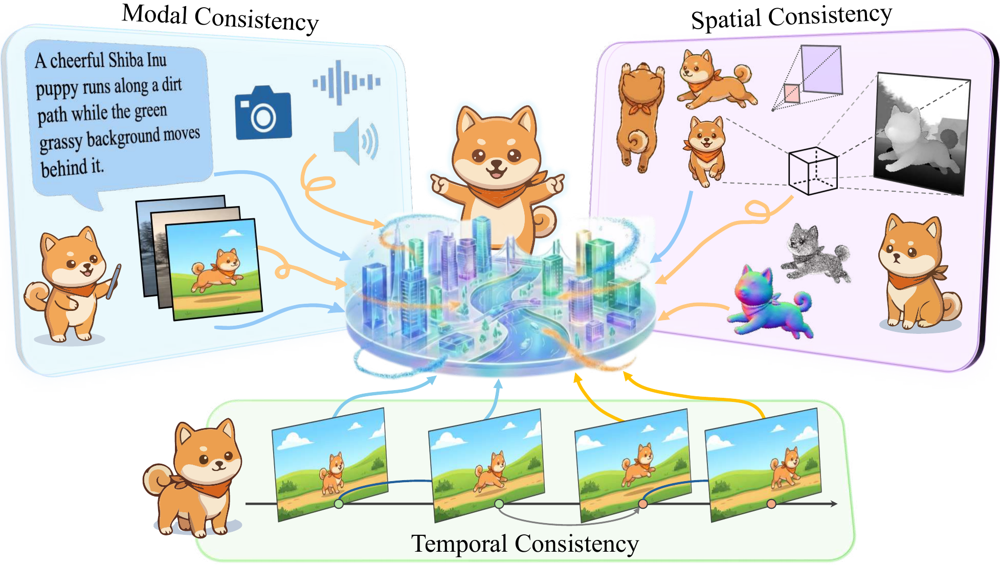

> 图 1: 世界模型中的一致性三元组：模态一致性（语义）、空间一致性（几何）和时间一致性（因果）。

``

## 1 引言（Introduction）

对 **人工通用智能（AGI）** 的追求，从根本上植根于赋予机器对物理现实深刻理解的渴望。一个真正智能的智能体必须从一个被动的观察者 [lecun2022path] 演变为一个主动的模拟器 [openai2024sora, bardes2024vjepa]，拥有一个能够学习客观物理定律、推理反事实场景 [lu2024deepseek] 并根据当前行动预测未来状态 [lingbotworld2026] 的内部世界模型。

近年来，由数据驱动的 **缩放定律（Scaling Laws）** 推动，生成能力呈爆炸式增长。以 Sora [openai2024sora] 和 Gen-3 [runway2024gen3] 为代表的视频生成模型，展示了逼近复杂动态的惊人能力，创建了通常与真实世界难以区分的高保真视觉序列。同时， **统一多模态模型（Unified Multimodal Models, UMMs）** 的兴起 [team2023gemini, deng2025emerging] 为将多样化的感官输入整合到一个共享的语义流形 [min2024platonic] 中提供了一种有前景的架构范式。然而，一个关键差距仍然存在：**现有模型尽管在视觉上看似合理，但通常表现得像幼稚的物理学家**。它们经常遭受结构性幻觉、时间不一致性和违反因果关系的困扰——这些是系统模仿像素统计而非内化物理原理的症状。该领域缺乏一个原则性的理论框架来定义通用世界模型所必需的基本属性。

为了弥合视觉生成与物理模拟之间的鸿沟，我们提出一个健壮的世界模型必须基于 **一致性三元组（Trinity of Consistency）** 。我们认为，**一个有效的内部模拟器必须满足三个正交且协同的约束**：

- **模态一致性（语义接口）** ：将异质信息（文本、图像、触觉）对齐到统一语义空间的能力，作为指令和反馈的认知接口。
- **空间一致性（几何基础）** ：构建一个尊重几何、遮挡和物体恒存性的三维感知表示的能力，确保模拟世界的静态合理性。
- **时间一致性（因果引擎）** ：随时间推移遵循物理定律和因果逻辑，确保动态演化遵循可预测且逻辑合理的轨迹。

通过这个三元视角，我们系统地回顾了生成模型从专业模块到统一世界模拟器的演变。我们追溯了从松散耦合的专业模块到端到端统一架构的轨迹。我们认为，消除这些维度之间的障碍是世界模拟能力涌现的必要基础，确保模态、空间和时间不是孤立运作，而是协同建模一个连贯的现实。

本文的组织结构反映了从专业模块到统一世界模拟器的演化路径。

- 首先（§[2](#section-2)），我们解构模态、空间和时间一致性的独立发展，分析它们各自的理论基础。
- 其次（§[3](#section-3)），我们研究统一多模态模型所引发的范式转变，详细阐述这些维度的深度融合如何促进物理模拟能力的涌现。
- 第三（§[4](#section-4)），我们指出现有概率生成器与真实物理模拟器之间仍然存在的差距，为严格的评估奠定基础。
- 使用的符号总结在表 [1](#table-1) 中。

最后，理论框架需要严格的验证。我们引入了  **CoW-Bench（世界模型一致性基准，Consistency of World-models Benchmark）** ，一个以多帧推理和约束满足为核心的统一评估套件。与以往的基准不同，CoW-Bench **严格测试模型在复杂、开放场景下维持一致性三元组的能力，迫使其证明自己理解了世界，而不仅仅是知道如何描绘它**。

``

``

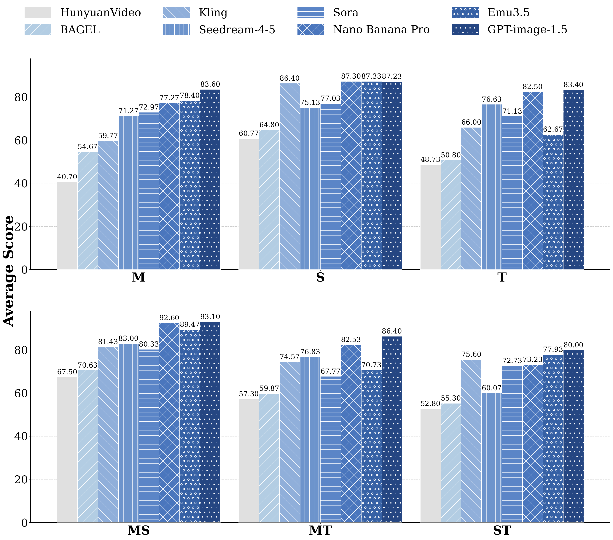

> 图 2: 主流模型在不同任务上的性能比较。分数已从原始范围 [0, 10] 线性重新缩放到百分比范围 [0, 100]。

> 表 1: 符号与描述

| 符号                                      | 描述            | 符号                          | 描述                   |
| ----------------------------------------- | --------------- | ----------------------------- | ---------------------- |
| $\mathcal{W}$                           | 世界模型        | $\boldsymbol{p}$            | 三维位置               |
| $\mathcal{S},\mathcal{A}$               | 状态与动作空间  | $\boldsymbol{P}_{t}$        | 在时间$t$ 的相机位姿 |
| $\boldsymbol{s}_{t},\boldsymbol{a}_{t}$ | 状态与动作实例  | $\boldsymbol{K}$            | 内参矩阵               |
| $\pi$                                   | 策略            | $\Pi$                       | 投影算子               |
| $\tau$                                  | 轨迹            | $\mathcal{K}$               | 关键帧集合             |
| $\mathcal{T}$                           | 动力学函数      | $\mathcal{M}_{geo}$         | 几何流形               |
| $\mathcal{Z}$                           | 潜在世界状态    | $\mathcal{G}_{k}$           | 三维高斯基元           |
| $\boldsymbol{x}_{obs}$                  | 多模态观测      | $\sigma$                    | 体积密度               |
| $\boldsymbol{z}$                        | 潜在向量        | $\boldsymbol{c}$            | 视角相关辐射度         |
| $\mathcal{E},\mathcal{D}$               | 编码器 / 解码器 | $\boldsymbol{F}_{fund}$     | 基础矩阵               |
| $\mathcal{C}$                           | 向量量化码本    | $\mathcal{O}_{flow}$        | 光流                   |
| $S$                                     | 词元序列        | $\mathcal{M}_{epi}$         | 对极掩码               |
| $W_{proj}$                              | 投影权重        | $\boldsymbol{T}(t)$         | 连续轨迹               |
| $I(X;Z)$                                | 互信息          | $\Phi$                      | 时空场                 |
| $\epsilon_{\theta}$                     | 噪声预测器      | $\Psi$                      | 物理属性场             |
| $\boldsymbol{v}_{t}$                    | 速度场          | $D\Phi/Dt$                  | 物质导数               |
| $g(t)$                                  | 扩散系数        | $\nabla\cdot\boldsymbol{v}$ | 散度                   |
| $\alpha_{t},\sigma_{t}$                 | 信噪比参数      | $\boldsymbol{F}$            | 力向量                 |
| $\boldsymbol{w}$                        | 维纳过程        | $\nabla f$                  | 隐式梯度               |
| $\mathcal{F}_{t}$                       | 短时傅里叶变换  | $\mathcal{M}_{dyn}$         | 动态流形               |
| $\mathcal{L}$                           | 损失函数        | Phys                          | 物理评分               |
| $\mathcal{G}_{raph}$                    | 因果图          | $\Delta_{const}$            | 约束偏差               |
| $D_{KL}$                                | KL 散度         | $w$                         | 引导尺度               |

``

## 2 一致性的基础探索（Foundational Exploration of Consistencies）

- [2.1 通用世界模型的剖析](#21-the-anatomy-of-general-world-models)
- [2.2 模态一致性](#22-modal-consistency)
- [2.3 空间一致性](#23-spatial-consistency)
- [2.4 时间一致性](#24-temporal-consistency)
- [2.5 一致性的展望](#25-outlook-of-the-consistencies)

``

### 2.1 通用世界模型的剖析（The Anatomy of General World Models）

如第 1 节（§[1](#section-1)）所述， **世界模型（world models）**  的构建依赖于 **模态一致性（modal consistency）** （作为信息接口）、 **空间一致性（spatial consistency）** （作为几何基石）和 **时间一致性（temporal consistency）** （作为动态引擎）的有机整合。在专用模型的演进过程中，这些一致性并非孤立发展，而是相互渗透：**来自模态对齐的统一表示空间为空间几何的重建提供了语义先验，而空间一致性的三维流形则为时间演化建立了物理约束。**

本节解构了这一演进历史。我们将追溯专用模型如何首先在孤立状态下攻克这些挑战：

- 模态对齐通过**高维流形映射**趋于成熟，
- 空间一致性通过**从二维代理到显式三维基元的转变**得以解决，
- 而时间一致性则从简单的**帧插值**演变为**因果动力学建模**。

在此，我们系统地分析了每个维度的理论基础和机制转变，建立了必要的先决条件，这些条件最终使得后续章节讨论的统一世界模拟器得以出现。

``

### 2.2 模态一致性（Modal Consistency）

构建通用世界模型的核心挑战在于异构模态的语义对齐。与单模态生成的同质性不同，多模态一致性本质上是一个**求解高维异构流形对齐的问题**，如图 [3](#figure-3) 所示。模型必须**超越熵差异和拓扑失配，构建一个物理完备且逻辑自洽的统一表示空间**。为此，我们引入两个基本的理论假设，即 **柏拉图表示假说（Platonic Representation Hypothesis）** 和 **超球面几何假说（Hypersphere Geometry Hypothesis）** ，并以此为基础阐述**从直接前馈映射（feed-forward mapping）到迭代推理与规划（iterative reasoning and planning）的认知架构演进**。

``

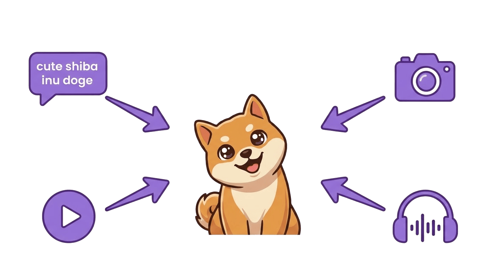

> 图 3：统一表示目标。模态一致性旨在将异构输入（文本、图像、视频、音频）投影到一个统一的、物理对齐的潜在空间中。

为了系统地解构这一对齐过程，本节将：

- 首先，**从几何拓扑的角度阐明模态差异的起源**（§[2.2.1](#S2.SS2.SSS1)）；
- 随后，分析两种主流的**生成流形机制**——即**离散自回归（discrete autoregression）**和**连续流匹配（continuous flow matching）**（§[2.2.2](#S2.SS2.SSS2)）；
- 接着，探讨为最小化梯度冲突而演化的**正交解耦架构**（§[2.2.3](#S2.SS2.SSS3)）；
- 最后，介绍**基于反馈的意图对齐**以及**迈向测试时计算的认知推理循环**（§[2.2.5](#S2.SS2.SSS5)）。
- elucidate the origins of the modality gap from the perspective of geometric topology (§2.2.1);
- subsequently, it will analyze two mainstream generative manifold mechanisms—namely, discrete autoregression and continuous flow matching (§2.2.2);
- it will then explore the orthogonal decoupled architecture evolved to minimize gradient conflicts (§2.2.3);
- and finally, it will introduce feedback-based intent alignment and the cognitive inference loop moving towards test-time compute (§2.2.5).
- [2.2.1 理论基础](#221-theoretical-foundations)
- [2.2.2 离散序列与连续流形](#222-discrete-sequences-vs-continuous-manifolds)
- [2.2.3 架构演进](#223-architectural-evolution)
- [2.2.4 通过强化学习进行意图对齐](#224-intent-alignment-via-rl)
- [2.2.5 通过测试时计算实现认知循环](#225-cognitive-loop-via-test-time-compute)

#### 2.2.1 理论基础（Theoretical Foundations）

- [柏拉图洞穴与投影流形](#platonic-cave-projected-manifolds)
- [超球面假说与模态差距](#hypersphere-hypothesis-modal-gap)
- [计算范式的演进：从摊销推理到测试时计算](#evolution-of-computational-paradigms-from-amortized-inference-to-test-time-compute)

##### 柏拉图洞穴与投影流形（Platonic Cave & Projected Manifolds）

多模态学习的理论基础可以追溯到 **柏拉图表示假说（Platonic Representation Hypothesis）**  [min2024platonic]。该假说正式定义了现实世界中存在一个客观的潜在物理状态空间 $\mathcal{Z}_{world}$，其中图像和文本是该高维实体在不同低维子空间上的投影。模态一致性的本质是求解一个**联合逆投影问题**：通过观察到的“影子” $\{x_{img},x_{txt}\}$ 重建共享的潜在变量 $z$。然而，这是一个典型的病态问题——视觉投影 $\mathcal{P}_{img}$ 保留了大量的高频物理熵，而文本投影 $\mathcal{P}_{txt}$ 则高度抽象了离散的符号逻辑。这种 **熵不对称性（Entropy Asymmetry）**  构成了直接对齐的主要障碍。

##### 超球面假说与模态差距（Hypersphere Hypothesis & Modal Gap）

为了在数学上对齐这两个异构空间，主流范式（如 CLIP）引入了 **超球面假说（Hypersphere Hypothesis）**  [wang2020understanding]，该假说**强制特征向量均匀分布在单位超球面** $\mathbb{S}^{d-1}$ 上。然而，这一强假设忽略了多模态表示中普遍存在的 **模态差距（modal gap）**  [liang2022neurips]。

- 一方面，Liang 等人的经验研究指出了 **锥体效应（cone effect）** ，如图 [5](#figure-5) 所示：**联合优化导致视觉和文本嵌入坍缩到两个狭窄且分离的锥形区域，破坏了特征空间的各向同性**。
- 另一方面，从流形学习的角度来看，这一差距揭示了更深层的拓扑失配：**视觉数据通常分布在连续、稠密的低维流形上，而语言数据则呈现出稀疏、离散的聚类结构。**
- 这种内在维度和数据密度的根本差异导致了**流形非同构**，使得在两个空间之间实现完美的等距对齐，同时保持各自语义结构，成为一个病态问题。

``

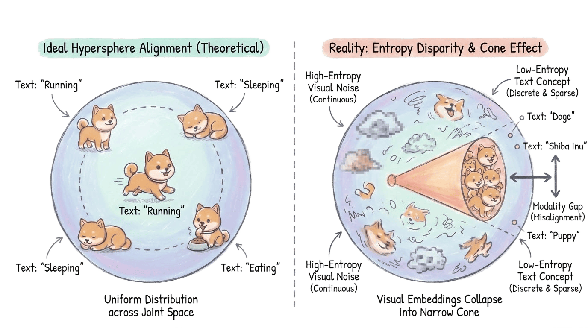

> 图 5：模态差距挑战。
>
> （左）理想的超球面对齐假设均匀分布。
>
> （右）实际上，熵差异导致视觉嵌入坍缩到一个狭窄的“锥体”中，从而导致与离散文本词元的拓扑失配。

##### 计算范式的演进：从摊销推理到测试时计算（Evolution of Computational Paradigms: From Amortized Inference to Test-time Compute）

面对上述几何拓扑失配导致的固有表示误差，简单的**参数内化策略**面临理论瓶颈，促使模态一致性的建模经历了两大计算范式之间的转变。这深刻地反映了 **训练时计算（train-time compute）** 和 **测试时计算（test-time compute）**  [snell2024scaling] 之间的权衡。

早期的**直接前馈映射**对应于 **双塔架构（Dual-Tower architectures）**  [radford2021icml] 和**单步生成模型**，其核心是**通过大规模训练将物理规则识别到神经网络权重中**，即 **摊销推理（Amortized Inference）**  [gershman2014amortized]。该范式在推理时仅需一次前向传播（$\text{NFE}=1$）。虽然效率极高，但它**受限于分布内统计相关性，本质上只能在已建立的锥形区域内进行插值，难以处理未见'过的反事实组合** [bengio2021machine]。

相比之下，当前的趋势正转向 **迭代推理与规划（iterative reasoning & planning）** ，对应于迭代推理架构。该范式承认了单次映射在弥合模态差距方面的局限性，并因此在推理阶段引入了显式的状态空间搜索。通过在潜在空间中构建 **思维树（Tree of Thoughts）**  [yao2024tree] 或执行梯度引导的动态规划，模型利用额外的推理计算来即时校正物理漂移。这标志着一致性建模从静态模式匹配向动态流形规划的转变。

#### 2.2.2 离散序列与连续流形（Discrete Sequences vs. Continuous Manifolds）

为了在计算上实现上述理论中的 **联合逆投影（Joint Inverse Projection）** 过程，学术界探索了两条不同的数学路径来建模目标条件概率密度 $P(x_{img}|x_{txt})$。这一选择决定了**潜在空间流形的物理本质**：是将其视为 **离散符号序列（Discrete Symbolic Sequence）** 还是 **连续欧几里得向量场（Continuous Euclidean Vector Field）** ？我们在表 [2](#table-2) 中比较了这两种范式的数学形式和动态特性。

``

> 表 2：机制对比：离散自回归 vs. 连续流匹配。公式凸显了优化目标与误差传播动态之间的权衡。

| 范式                      | 目标函数（灵魂）                                                                                 | 误差   | 拓扑结构 |
| ------------------------- | ------------------------------------------------------------------------------------------------ | ------ | -------- |
| 离散自回归（Discrete AR） | $\displaystyle\mathcal{L}_{AR}=-\mathbb{E}\left[\sum\log P(s_{t}|s_{<t})\right]$               | 指数级 | 离散     |
| 流匹配（Flow Matching）   | $\displaystyle\mathcal{L}_{FM}=\mathbb{E}\left[\|v_{\theta}(x_{t})-(x_{1}-x_{0})\|^{2}\right]$ | 线性   | 欧几里得 |

- [离散自回归（Discrete Autoregressive, AR）](#离散自回归-discrete-autoregressive-ar)
- [连续流匹配（Continuous Flow Matching, FM）](#连续流匹配-continuous-flow-matching-fm)

##### 离散自回归（Discrete Autoregressive, AR）

该范式的核心在于 **以词元为中心（Token-centric）**  的理念，**试图通过统一的离散符号接口将视觉生成转化为序列预测问题** [van2017neural, ramesh2021zero]。其生成过程包含**严格耦合**的阶段：**首先通过 VQ-GAN 将连续图像量化为离散符号，随后利用 Transformer 的因果注意力掩码最大化序列对数似然。**

 **指数级漂移与码本坍塌（Exponential Drift & Codebook Collapse）** 。尽管 AR 范式实现了接口统一，但从动态视角来看，其存在两个内生缺陷 [Huh2023Straightening]。

- 首先是 **维度灾难（curse of dimensionality）** 。离散化过程受 **狄利克雷过程（Dirichlet process）**  支配；**随着码本维度增加，有效利用率呈指数级衰减，导致高频纹理丢失** [iccv2025GigaTok, cvpr2025MergeVQ]。
- 其次是 **误差累积动态（error accumulation dynamics）** 。自回归生成的本质是算子的递归应用。假设算子的局部 **利普希茨常数（Lipschitz constant）**  为 $L>1$，则初始量化误差 $\epsilon_{0}$ 在 $T$ 步后的累积漂移为 $\|\delta_{T}\|\approx L^{T}\|\epsilon_{0}\|$。**这种指数级误差放大解释了为什么 AR 模型在生成长序列时，其尾部常出现结构坍塌** [bengio2015scheduled]。

##### 连续流匹配（Continuous Flow Matching, FM）

为规避量化误差，新一代范式（如 Stable Diffusion 3 [esser2024sd3]、Emu3 [wang2024emu3]）回归到 **连续潜空间（continuous latent space）** 。不同于基于 SDE 去噪视角的传统扩散模型， **流匹配（Flow Matching, FM）**  [lipman2023flow] 采用  **ODE**  视角，构建连接噪声与数据的确定性传输路径。

 **速度场回归与修正路径（Velocity Field Regression & Rectified Path）** 。连续 FM 的核心思想是**直接拟合概率流的速度场**。

- 训练时，中间状态 $x_{t}$ 被定义为数据与噪声之间的线性插值，对应一条理想的直线轨迹，其目标速度场恒为 $v_{t}=x_{1}-x_{0}$。
- 神经网络通过 **均方误差（Mean Squared Error, MSE）**  损失直接回归该速度向量。
- **修正流（Rectified Flow）**  [liu2023iclr] 证明，这种 Reflow 操作修正了传输轨迹，使其对应的利普希茨常数 $L\approx 1$。
- 这意味着误差累积转变为线性增长 $\|\delta_{T}\|\approx T\cdot\epsilon_{step}$，使得 FM 能够以极少的步数生成高保真样本，同时完美保留潜空间的连续语义流形。

#### 2.2.3 架构演进（Architectural Evolution）

建立生成机制仅解决了目标流形的数学表达。如何将异构模态信息注入该流形，取决于模型的 **条件机制（conditioning mechanism）** 。多模态架构的演进呈现出非线性特征，其本质是寻找最优的参数空间拓扑结构，以最小化模态间的梯度冲突和信息损失。该过程经历了从**几何隔离**到**早期融合**，最终收敛于**正交解耦**的三阶段演进，如图 [6](#figure-6) 所示。

``

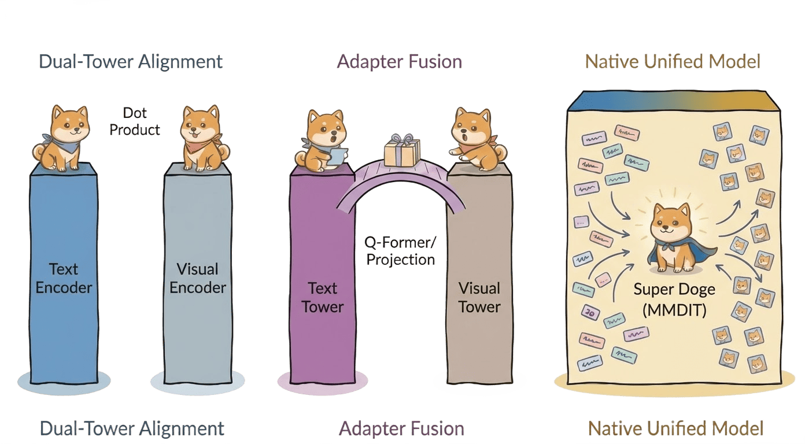

> 图 6：多模态融合范式演进。从几何隔离（双塔架构）到不稳定的早期融合（适配器），最终演进至大规模统一架构中正交解耦的**原生统一多模态模型**（MM-DiT）。

- [(1) 早期演进：双塔架构与连接器范式的建立。](#1-早期演进双塔架构与连接器范式的建立)
- [(2) 早期融合与统一优化的挑战。](#2-早期融合与统一优化的挑战)
- [(3) 正交解耦的主流范式。](#3-正交解耦的主流范式)

##### (1) 早期演进：双塔架构与连接器范式的建立。

多模态对齐的早期探索呈现出**两条清晰的技术演进路径**。

- 其一是以 CLIP [radford2021icml] 和 ALIGN [jia2021icml] 为代表的 **双塔架构（Dual-Tower Architecture）** 。该范式利用 **对比学习（contrastive learning）**  将异构模态投影到共享的超球面上。尽管在检索任务中表现出色，但独立编码器对图像和文本的分离处理导致了几何拓扑上的天然不对称性，缺乏深度的细粒度交互。

- 为解决此局限性，以 Flamingo [alayrac2022flamingo] 和 BLIP/BLIP-2 [li2022blip, li2023blip2] 为代表的 **基于连接器的范式（Connector-based Paradigm）**  应运而生。这些方法**冻结了预训练的视觉编码器**，并创新性地引入了可学习的桥接模块（如 Perceiver Resampler 或 Q-Former），用以对齐视觉特征与 **大语言模型（Large Language Models, LLMs）**  的语义空间。这种 **冻结视觉主干与轻量级连接器（Frozen Visual Backbone & Lightweight Connector）**  的设计不仅降低了训练成本，也为后续的 **大语言模型（Large Multimodal Models, LMMs）**  建立了标准架构模板。

##### (2) 早期融合与统一优化的挑战。

为进一步打破模态间的几何隔离，学界开始探索更激进的 **早期融合（Early Fusion）**  策略。代表性工作如 Unified-IO [lu2022unifiedio] 试图在统一的序列到序列框架内处理各种异构任务，推动了通用接口的发展。

然而，这种完全统一的范式暴露了深层的 **优化不稳定性（Optimization Instability）** 。特别是在引入离散化策略（如 Chameleon [meta2024chameleon]）时，尽管实现了接口统一，但不同模态在训练动态上表现出显著差异。经验证据表明，视觉词元的梯度方差显著高于文本词元，使得模型在联合训练中难以收敛到最优解。

此外，以 LLaVA [liu2023llava] 为代表的连续非对称范式，通过投影层与大语言模型进行接口对接。然而，线性投影层 $W_{proj}$ 本质上充当了一个 **低秩压缩器（low-rank compressor）** （如图 [7](#figure-7) 所示）。在优化过程中，模型倾向于保留与文本推理相关的语义信息，同时抑制对图像合成至关重要的高频分量。因此，输入图像与投影表示之间的互信息被大幅削减。这解释了为何 LLaVA 在理解任务中表现优异，但在生成任务中却无法恢复纹理细节。

``

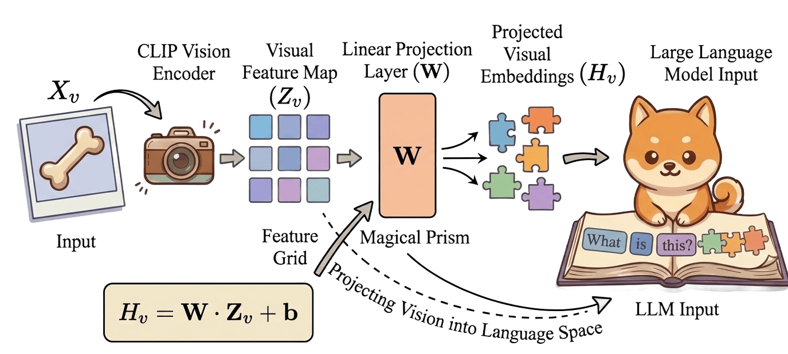

> 图 7：LLaVA 中的信息不对称性。线性投影层 $W_{proj}$ 充当低秩压缩器，优先与 LLM 进行语义对齐，同时丢弃了可控视觉生成所需的高频视觉纹理。

##### (3) 正交解耦的主流范式。

针对上述梯度冲突问题，以 Stable Diffusion 3.5 [esser2024sd3] 和 Emu3 [wang2024emu3] 为代表的工作建立了当前的  **MM-DiT**  架构。其核心在于 **权重解耦策略（weight decoupling strategy）** ——为文本和图像维护独立的权重集 $W_{txt},W_{img}$，仅在注意力运算期间进行数据交换，如图 [8](#figure-8) 所示。

``

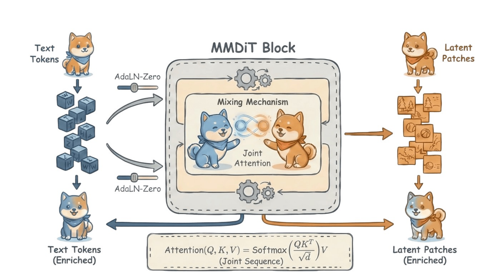

 **图 8: MM-DiT 架构。**  通过为文本和图像模态保持独立的权重集，并仅通过联合注意力（Joint Attention）进行交互，MM-DiT 实现了正交梯度更新，有效解决了模态冲突。

从优化动态的角度来看，这种设计迫使联合损失函数的 **海森矩阵（Hessian matrix）** 呈现近似块对角结构：

$$
H_{total}\approx\begin{bmatrix}H_{txt}&0\\ 0&H_{img}\end{bmatrix},\quad\text{s.t.} \ \frac{\partial^{2}\mathcal{L}}{\partial W_{txt}\partial W_{img}}\to 0,(1)
$$

其中 $\boldsymbol{H}_{\textrm{total}}$ 表示联合海森矩阵，$\boldsymbol{W}_{\textrm{txt/img}}$ 代表特定模态的参数。这种结构有效地隔离了模态特定的曲率，使得不同模态的梯度更新在参数空间中趋向于正交。经验数据表明，该机制将梯度冲突率从 **自回归（AR）范式** 中的超过 50% 显著降低至约 30% [ma2024theoretical]。这一点在  **Stable Diffusion 3.5 Large**  中得到了验证：得益于模态解耦，在需要复杂排版渲染和长文本理解的任务中，该模型展现出的指令遵循能力和物理保真度显著优于诸如  **LLaVA**  等非对称架构。

#### 2.2.4 通过强化学习（RL）进行意图对齐

在通过 MM-DiT 架构实现正交解耦后，一致性建模的重点从物理表示拟合转向了高级语义对齐。尽管传统的 **最大似然估计（Maximum Likelihood Estimation, MLE）** 能够捕捉像素的统计相关性，但在处理不适定的联合逆投影问题时，由于缺乏显式监督，常常陷入语义漂移 [min2024platonic]。为此，学术界引入了 **基于人类反馈的强化学习（Reinforcement Learning with Human Feedback, RLHF）**  [fan2024aligning]，将对齐重新定义为超球面流形上的奖励引导搜索 [wang2020understanding]。

- [过程监督与物理约束](#process-supervision-physical-constraints)
- [感知-生成协同循环](#perception-generation-synergistic-loop)
- [自回归模型的分解优化](#factorized-optimization-for-ar-models)

##### 过程监督与物理约束

基于偏好微调的架构演进始于高效的  **DiT**  基线模型，以  **PixArt-$\alpha$**  [chen2024pixart] 为代表。由于其训练成本相对较低，这些架构能够在偏好监督下实现实用的端到端对齐。针对传统  **DPO（直接偏好优化，Direct Preference Optimization）** 中轨迹反馈稀疏的问题， **SPO**  [liang2025spo] 和  **VisualPRM**  [wang2025visualprm] 引入了逐步评估机制，对去噪路径中的每一个推理步骤进行细粒度监督。同时，为了解决诸如违反重力等非物理现象， **PhyGDPO**  [cai2025phygdpo] 引入了具有物理意识的  **VLM**  反馈，其核心损失函数通过惩罚物理违反项 $\Delta\text{PhysScore}$ 来实现：

$$
\mathcal{L}_{\text{Phy-DPO}}=-\mathbb{E}\left[\log\sigma\left(\beta\log\frac{\pi_{\theta}(v_{w})}{\pi_{ref}(v_{w})}-\beta\log\frac{\pi_{\theta}(v_{l})}{\pi_{ref}(v_{l})}+\alpha\Delta\text{PhysScore}\right)\right],(2)
$$

其中 $\beta$ 是控制与参考策略 $\pi_{\textrm{ref}}$ 偏差的 KL 散度惩罚系数，$v_{w}$ 和 $v_{l}$ 分别代表获胜和失败的视频样本，$\Delta\textrm{PhysScore}$ 衡量物理一致性得分的差异。

##### 感知-生成协同循环

为了进一步突破静态数据集的上限，学术界建立了一个以  **VLM-as-a-Judge**  为核心的交互式优化范式。该范式利用多模态大模型（Multimodal Large Models）强大的语义感知能力作为评判器（Critic），构建了一个“生成-评估-优化”的闭环系统。代表性工作如  **MetaMorph**  [metamorph] 通过指令微调实现了理解与生成的统一对齐；而  **SRUM**  [2510.12784] 则进一步提出了统一的多模态自我修正机制。SRUM 通过将判别梯度反向传播到生成器，或利用 VLM 生成的细粒度反馈描述（feedback captions），来引导扩散模型的迭代微调。这种感知与生成之间的互惠改进，不仅解决了复杂提示下的属性遗漏问题，还使得 **文生图（T2I）模型** 能够在缺乏外部人工标注的情况下，通过自举（bootstrapping）不断逼近 VLM 的语义理解上限。

##### 自回归模型的分解优化

与扩散模型的去噪优化不同， **自回归（AR）模型** 面临着离散空间不可微性和时序误差累积的双重挑战。针对这一问题，2025 年的  **AR-GRPO**  [zhang2025argrpo] 和  **ReasonGen-R1**  [zhang2025reasongen] 提出了一种针对序列生成的分解优化策略：

$$
\mathcal{L}_{AR-RL}=\underbrace{\mathbb{E}_{\pi}[R(x)]}_{\text{对齐增益}}-\beta\underbrace{D_{KL}(\pi||\pi_{ref})}_{\text{时序平滑}},(3)
$$

其中 $R(x)$ 是来自  **CLIP**  或  **VQA**  反馈的奖励函数，$\beta$ 是 KL 散度项 $D_{KL}$ 的正则化系数。该范式将损失函数显式分解为对齐增益和时序平滑项。对齐项利用 CLIP/VQA 奖励来指导词元（token）选择以符合语义意图，而 KL 散度约束则迫使策略保持在预训练语言流形内，防止模型因过度优化奖励而遭受 **语言崩溃（Language Collapse）** 。经验证据表明，此策略能有效抑制长序列生成中的词元重复和乱码文本。

#### 2.2.5 通过测试时计算（Test-time Compute）实现认知循环

尽管强化学习已初步实现了人类意图对齐，但模态一致性仍受限于柏拉图式的统计边界 [min2024platonic]。现有的生成模型本质上是 **模式匹配插值器** ，仅通过摊销推理（amortized inference）来拟合训练分布 [bengio2021machine]。当面对需要多步骤链式推理的反事实任务时，这种一次性的映射机制缺乏实时验证，容易产生逻辑幻觉 [islam2025reasoning]。

为了纠正长程生成中的逻辑漂移，一致性建模正转向 **测试时计算（test-time compute）**  [snell2024scaling] 范式。该范式承认一次性逆投影的局限性，转而在推理阶段引入显式的状态空间搜索。在这个闭环中，生成过程被重新定义为时空流形 $\mathcal{M}$ 上的最优路径搜索问题。

最近的范式如  **UniGen**  [tian2025unigen] 和  **EvoSearch**  [zhang2025evosearch] 引入了多步骤推理架构，结合了 **蒙特卡洛树搜索（Monte Carlo Tree Search, MCTS）**  [silver2017mastering] 与验证器机制 [cobbe2021training]，在生成过程中实现了推理时扩展（inference-time scaling）。针对视觉任务的高维特性， **VisualPRM**  [wang2025visualprm] 利用过程奖励模型（Process Reward Model）对去噪轨迹的逻辑节点进行细粒度验证，从而在数学上增强生成结果的逻辑一致性。此外，通过集成显式的因果规划层 [huang2025vchain]，模型能够利用额外的推理计算来检测和修正物理轨迹中的偏差。

``

### 2.3 空间一致性（Spatial Consistency）

上一节讨论的模态一致性成功地为异构数据构建了统一的语义映射。然而，对于构建一个可执行的 **内部模拟器（Internal Simulator）** 而言，仅有语义对齐是不完整的。正如发展心理学研究所指出的，对世界的认知建立在 **客体永久性（Object Permanence）**  [baillargeon1987object] 和 **三维排他性（3D Exclusivity）**  [spelke1990principles] 的基础之上。这种缺乏几何实体的语义表示，无法支持智能体在三维空间中的导航和交互 [anderson2018evaluation]。空间一致性的核心任务是将这些语义潜变量锚定到符合物理定律的三维几何流形 $\mathcal{M}_{geo}$ 上。这本质上是在解决一个典型的不适定逆问题（Ill-posed Inverse Problem）[hartley2003multiple]，如图 [9](#figure-9) 所示：具体来说，就是如何从降维的、稀疏的二维观测中恢复一个满足多视图几何约束（如极线等变性）的高维状态空间，同时避免如 **杰纳斯问题（Janus Problem）** 之类的结构伪影。

``

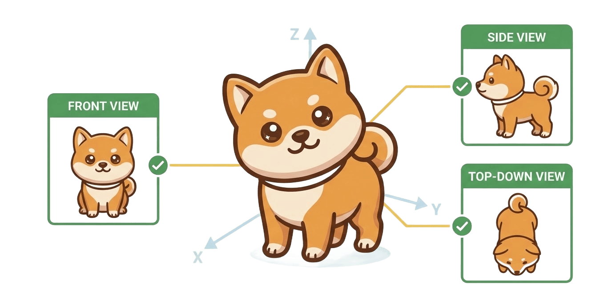

> **图 9：通过多视图约束实现空间一致性。**  模型确保生成的物体（Doge）在正面、侧面和俯视图中保持几何一致性，防止结构扭曲和杰纳斯问题。

为了构建统一的理论框架，我们将此过程形式化为在时空流形上求解一组耦合微分方程逆问题。本节将阐明模型如何沿着从二维代理流形到三维隐式场，最终收敛到 **显式拉格朗日基元（Explicit Lagrangian Primitives）** 的演化路径，通过引入物理先验和生成扩散先验来建立世界模型的静态几何基础。

- [2.3.1 一致性的几何分解](#231-geometric-decomposition-of-consistency)
- [2.3.2 理论形式化](#232-theoretical-formulation)
- [2.3.3 二维代理流形与域不匹配](#233-2d-proxy-manifold-domain-mismatch)
- [2.3.4 隐式连续场](#234-implicit-continuous-fields)
- [2.3.5 显式拉格朗日基元](#235-explicit-lagrangian-primitives)
- [2.3.6 生成式统计先验](#236-generative-statistical-priors)

#### 2.3.1 一致性的几何分解

为了从数学上刻画空间一致性，我们将这一抽象概念分解为两个互补且层次递进的拓扑约束：前者支配物理表面的微观连续性，后者保证物体结构的宏观唯一性和连贯性。

- [微观层面：局部邻域拓扑一致性。](#micro-level-local-neighborhood-topological-consistency)
- [宏观层面：全局几何一致性。](#macro-level-global-geometric-consistency)

##### 微观层面：局部邻域拓扑一致性（Micro-level: Local Neighborhood Topological Consistency）

该约束关注于流形 $\mathcal{M}$ 的 **内在连续性（Intrinsic Continuity）** ，这在数学上对应于 **利普希茨条件（Lipschitz Condition）** 。即，对于流形上任意两个相邻点，其物理属性（如颜色、密度）的差异应严格受其欧几里得距离的线性约束。在三维重建与生成任务中，该约束通常通过几何正则化项显式实现。例如， **IGR（隐式几何正则化，Implicit Geometric Regularization）**  [gropp2020implicit] 利用 **程函方程（Eikonal equation）** 约束梯度范数，而  **RegNeRF**  [niemeyer2022regnerf] 则引入平滑损失来抑制稀疏视角下产生的非物理高频噪声，确保生成物体具有平滑且物理合理的表面。

##### 宏观层面：全局几何一致性（Macro-level: Global Geometric Consistency）

仅有局部平滑性是不够的，模型还必须满足多视图几何中的 **对极等变性（Epipolar Equivariance）**  [hartley2003multiple]。即，从不同视角 $v_{a},v_{b}$ 观察同一物体时，其投影坐标应满足严格的代数约束 $\boldsymbol{x}_{b}^{\top}\boldsymbol{F}_{ab}\boldsymbol{x}_{a}=0$。在生成模型中，违反此约束是 **Janus 问题（Janus Problem）**  [poole2022dreamfusion] 的根本原因——不同视角产生不兼容的物体几何。为解决此问题， **SyncDreamer**  [syncdreamer] 构建了显式的三维代价体（cost volume）来强制对齐，而  **MVDream**  [shi2023MVDream] 则利用多视角自注意力机制将硬几何约束内化到注意力权重中，直接锁定生成物体的全局拓扑唯一性。

上述分解阐明了空间一致性的几何目标。然而，如何在神经网络的参数空间内系统地解决这些拓扑约束，需要建立一个统一的微分方程视角。

#### 2.3.2 理论公式化（Theoretical Formulation）

为构建理论框架，我们将三维视觉生成中的空间一致性形式化为在时空流形 $\mathcal{M}\subseteq\mathbb{R}^{3}\times\mathbb{R}^{+}$ 上求解一组耦合的 **逆微分问题（Inverse Differential Problems）** 。从这个角度看，全状态场 $\Phi(\boldsymbol{x},t)$ 的构建遵循三个核心物理定律，它们分别定义了世界的呈现模式、生成规则和运动规律。

- [物理渲染：辐射传输方程（RTE）](#physical-rendering-the-rte)
- [生成演化：随机微分方程（SDE）](#generative-evolution-the-sde)
- [运动定律：拉格朗日输运（Lagrangian Transport）](#motion-law-lagrangian-transport)

##### 物理渲染：辐射传输方程（Physical Rendering: The RTE）

显式和隐式三维表示在物理上均可视为 **辐射传输方程（Radiative Transfer Equation, RTE）**  [kajiya1986rendering] 的离散化解。对于一条光线 $\boldsymbol{r}(s)=\boldsymbol{o}+s\boldsymbol{d}$，其辐射度 $L$ 沿路径的变化遵循：

$$
\underbrace{\boldsymbol{d}\cdot\nabla L(\boldsymbol{x},\boldsymbol{d})}_{\text{输运}}=\underbrace{-\sigma(\boldsymbol{x})L(\boldsymbol{x},\boldsymbol{d})}_{\text{吸收}}+\underbrace{\sigma(\boldsymbol{x})\boldsymbol{c}(\boldsymbol{x},\boldsymbol{d})}_{\text{发射}},(4)
$$

其中 $\sigma(\boldsymbol{x})$ 表示位置 $\boldsymbol{x}$ 处的 **体密度（Volume Density）** ，$\boldsymbol{c}(\boldsymbol{x},\boldsymbol{d})$ 表示与视角相关的 **颜色发射（Color Emission）** 。离散化方式的差异构成了技术路线的分野： **NeRF（隐式场，Implicit Fields）** 采用体渲染积分，通过沿光线对公式 ([4](#S2.E4)) 进行密集黎曼和来近似求解；而  **3DGS（显式基元，Explicit Primitives）** 则将连续场离散为一组拉格朗日高斯基函数，将积分转化为高效的分析光栅化。前者保证了连续性，后者实现了实时性能。

##### 生成演化：随机微分方程（Generative Evolution: The SDE）

在生成先验范式中，空间一致性源于预训练模型的概率分布。我们将从高斯白噪声 $\boldsymbol{z}_{T}$ 恢复至数据流形 $\boldsymbol{z}_{0}$ 的过程建模为一个 **随机微分方程（Stochastic Differential Equation, SDE）**  [song2021scorebased]：

$$
d\Phi_{t}=\boldsymbol{f}(\Phi_{t},t)dt+g(t)d\boldsymbol{w},(5)
$$

其中 $\boldsymbol{f}(\cdot)$ 是控制语义演化的确定性漂移项，$g(t)$ 表示扩散系数，$\boldsymbol{w}$ 代表标准维纳过程。现代生成模型旨在学习上述 SDE 的逆过程（分数匹配）。当扩散项 $g(t)=0$ 时，SDE 退化为确定性 **常微分方程（Ordinary Differential Equation, ODE）** ，即 **流匹配（Flow Matching）** 。这为理解生成模型如何从无序噪声中恢复出“平滑且拓扑一致”的几何结构提供了理论基础。

##### 运动定律：拉格朗日输运（Motion Law: Lagrangian Transport）

为确保空间结构沿时间轴的拓扑一致性，物质点 $\boldsymbol{x}$ 的运动必须遵循 **拉格朗日流（Lagrangian Flow）** ：

$$
\frac{d\boldsymbol{x}}{dt}=\boldsymbol{v}(\boldsymbol{x},t),\quad\text{s.t.}\quad\frac{D\Phi}{Dt}=0\quad(\text{物质导数}),(6)
$$

其中 $\boldsymbol{v}$ 表示驱动粒子运动的速度场，$\frac{D\Phi}{Dt}$ 表示物质导数。该约束意味着特征 $\Phi$ 在随流体运动时保持守恒（物质导数为 0）。这直接对应显式基元范式中的粒子追踪机制，也是连接静态几何与动态视频的数学桥梁。

空间一致性演化的历史，本质上就是学界从求解静态 RTE（NeRF），到逆向求解生成式 SDE（扩散），最终整合拉格朗日动力学约束的过程。这种从尝试在二维投影流形上拟合动力学，到隐式连续场积分，再回到显式拉格朗日基元的迭代过程，如图 [11](#figure-11) 所示。

``

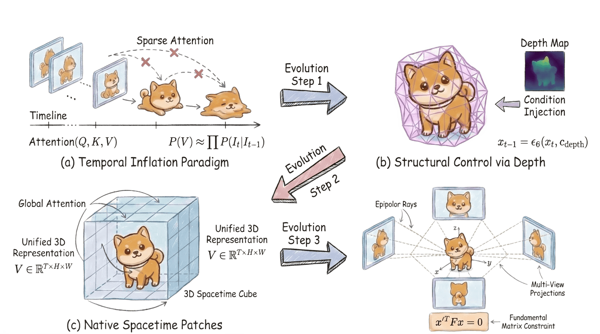

> 图 11：空间一致性范式的演化。我们追溯了从早期二维代理流形，到 NeRF 等隐式连续场，再到 3DGS 等显式拉格朗日基元，最终整合生成式扩散先验的轨迹。

#### 2.3.3 二维代理流形与域不匹配（2D Proxy Manifold & Domain Mismatch）

在显式三维表示确立主流地位之前，解决时空一致性的主要途径是基于 **流形假设（Manifold Hypothesis）** 的视频预测。该范式避开了昂贵的 $SE(3)$ 空间建模，转而尝试将高维物理状态场 $\Phi$ 的演化动力学算子 $\mathcal{F}_{3D}:SE(3)\times\mathbb{R}^{3}\to\mathbb{R}^{3}$ 降维为二维图像流形 $\mathcal{M}_{img}$ 上的参数化映射 $\mathcal{F}_{\theta}:\mathbb{R}^{H\times W}\to\mathbb{R}^{H\times W}$。尽管这种代理流形策略具有计算复杂度优势，但它引入了一个根本性的 **域不匹配（Domain Mismatch）** 。

- [缺乏 $SE(3)$ 等变性的动力学拟合](#dynamics-fitting-lacking-s-e-3-se3-equivariance)
- [物理感知建模的早期尝试与局限](#early-attempts-and-limitations-of-physics-aware-modeling)

##### 缺乏 $SE(3)$ 等变性的动力学拟合（Dynamics Fitting Lacking $SE(3)$ Equivariance）

早期工作如  **ConvLSTM**  [Shi2015NIPS] 和  **PredRNN**  [Wang2017NIPS, Wang2018TPAMI]，虽然通过改进循环单元（如梯度高速单元 GHU）缓解了长序列梯度衰减，但它们依赖的卷积操作 $W\ast I$ 仅具有平移等变性，缺乏对三维旋转群 $SO(3)$ 的感知能力。如 [Gao2022CVPR, tan2025ustep, tan2023temporal, wei2024interpretable] 所述，试图通过二维像素网格的非线性变换来模拟三维刚体旋转，本质上是在低维流形上近似高维拓扑。这种归纳偏置的不匹配导致模型无法解耦相机外参运动与物体内禀形变，必然在大视角变换的生成视频中引发非物理的 **非刚性畸变（Non-rigid Distortion）** 或纹理拉伸。

##### 物理感知建模的早期尝试与局限（Early Attempts and Limitations of Physics-aware Modeling）

为缓解纯统计拟合带来的模糊性并增强时间外推的鲁棒性，学界尝试赋予黑盒模型物理可解释性，其核心思想是将物理守恒定律注入神经网络的参数空间。此方向的先驱是 **物理信息神经网络（Physics-Informed Neural Networks, PINN）**  [raissi2019physics]，它将偏微分方程（PDE）的残差作为正则化项加入损失函数，迫使网络输出符合流体力学或波动方程等物理约束。随后， **深度拉格朗日网络（Deep Lagrangian Networks, DeLaN）**  [lutter2019deep] 和 **哈密顿神经网络（Hamiltonian Neural Networks, HNN）**  [greydanus2019hamiltonian] 进一步引入了能量守恒先验，利用欧拉-拉格朗日方程显式建模系统的总能量（哈密顿量），从而在连续时间上实现对复杂动态系统的精确轨迹预测。

在视频预测领域， **PhyDNet**  [LeGuen2020CVPR] 借鉴了这些思想，将隐状态显式解耦为物理动力学分支 $\mathcal{H}_{phy}$ 和残差纹理分支 $\mathcal{H}_{res}$。与 PINN 的软约束不同，PhyDNet 通过 **矩匹配（Moment Matching）** 直接限制卷积核权重，使其近似离散网格上的 PDE 有限差分算子：

$$
\frac{\partial\mathcal{H}}{\partial t}\approx\sum_{k}c_{k}\frac{\partial^{k}\mathcal{H}}{\partial\boldsymbol{x}^{k}}\implies\text{滤波器权重}\xrightarrow{\text{矩}}\text{有限差分模板},(7)
$$

其中 $\mathcal{H}$ 表示解耦后的隐状态，$\boldsymbol{x}$ 是空间坐标，$c_{k}$ 代表偏微分系数。

此外，为了解决离散时间采样的局限性，Rubanova 等人提出的 **潜在常微分方程（Latent ODEs）**  [rubanova2019latent] 利用连续时间 ODE 求解器来建模隐状态演化，有效处理了非均匀采样下的时间一致性问题。

尽管这些方法以及诸如 SVG [Denton2018ICML] 之类的变分推理模型在短期预测方面取得了进展，但基于 **二维流形（2D manifold）**  的建模隐含了空间连续性假设。一旦由遮挡（Occlusion）引起深度突变，光流场将变得不可微，偏微分方程（PDE）约束会立即失效。这种无法建模物体恒存性（object permanence）的缺陷，表明了在二维代理流形上解决严格三维一致性问题的理论局限性。

#### 2.3.4 隐式连续场（Implicit Continuous Fields）

针对二维代理流形在三维一致性方面的理论局限性，学术界转向直接在三维欧几里得空间中定义状态场。这一范式的建立，基于诸如 SoftRas [Liu2019SoftRas] 和 DIB-R [Chen2019DIBR] 等基于网格的可微渲染工作，这些工作验证了通过平滑光栅化过程计算梯度 $\partial I/\partial\mathcal{V}$ 的可行性。 **神经辐射场（NeRF）**  [mildenhall2020nerf] 进一步摒弃了离散几何，使用 **多层感知机（MLP）**  将场景参数化为一个连续的坐标映射函数 $F_{\Theta}:(\boldsymbol{x},\boldsymbol{d})\rightarrow(\boldsymbol{c},\sigma)$，并通过可微的 **体渲染积分（Volume Rendering Integral）**  将三维场与二维观测连接起来。

- [(1) 表示效率与频率保真度（Representation Efficiency &amp; Frequency Fidelity）.](#1-representation-efficiency-frequency-fidelity)
- [(2) 水平集模糊性与 Eikonal 流形约束（Level Set Ambiguity &amp; Eikonal Manifold Constraints）.](#2-level-set-ambiguity-eikonal-manifold-constraints)

##### (1) 表示效率与频率保真度（Representation Efficiency & Frequency Fidelity）.

神经辐射场的演进本质上是在参数效率与信号保真度之间寻求平衡的过程。该领域的挑战已从最初的推理加速（引入离散表示）深化到在离散空间中保持频域抗锯齿特性。

(i) 向混合表示的转变。为了突破纯 MLP 架构的效率瓶颈，NVIDIA 的 Instant-NGP [muller2022instant] 引入了 **多分辨率哈希网格（Multiresolution Hash Grids）** ，使用空间哈希将连续坐标映射到可学习的特征表；而在生成领域，EG3D [chan2022eg3d] 提出了 **三平面（Tri-plane）表示** ，确立了 3D GAN 的主流范式。这些方法（包括 TensoRF [chen2022tensorf]）通过引入显式的空间归纳偏置，显著提升了训练效率和几何生成能力。

(ii) 混叠与信号处理校正。然而，前述的离散化表示（以及原始 NeRF 中的逐点采样）在高频区域引入了严重的混叠。Mip-NeRF [Barron2021MipNeRF] 从信号处理角度纠正了这一缺陷，指出忽略采样体积的离散采样违反了 **奈奎斯特采样定理（Nyquist sampling theorem）** 。通过引入 **锥形追踪（Cone Tracing）**  和 **集成位置编码（Integrated Positional Encoding, IPE）** ，Mip-NeRF 计算了高斯体积内的特征期望，揭示了其数学形式中抗锯齿的本质：

$$
\gamma(\boldsymbol{\mu},\boldsymbol{\Sigma})=\mathbb{E}_{\boldsymbol{x}\sim\mathcal{N}(\boldsymbol{\mu},\boldsymbol{\Sigma})}[\gamma(\boldsymbol{x})]\approx\sin(\boldsymbol{\mu})\circ\exp\left(-\frac{1}{2}\text{diag}(\boldsymbol{\Sigma})\right),(8)
$$

其中，$\boldsymbol{\mu}$ 和 $\boldsymbol{\Sigma}$ 分别表示锥台的均值向量和协方差矩阵，$\circ$ 表示逐元素乘积。该公式揭示了一个深刻的物理机制：指数衰减项 $\exp(-\boldsymbol{\Sigma})$ 本质上充当了一个 **自适应低通滤波器（Adaptive Low-pass Filter）** 。当采样锥半径增大时（即方差 $\boldsymbol{\Sigma}$ 增大，对应于远距离视图或低分辨率区域），高频特征被指数级地抑制。

为了将这种优秀的抗锯齿特性迁移到高效的网格表示中，Zip-NeRF [barron2023zip] 进一步结合了 **多重采样（Multisampling）**  与特征平滑技术，解决了哈希网格固有的尺度不确定性。这一系列演进在数学上等价于傅里叶变换中的 **不确定性原理（Uncertainty Principle）** ：空间定位越宽（$\boldsymbol{\Sigma}$ 越大），频率带宽越窄，从而在机理上消除了摩尔纹和高频伪影，实现了效率与保真度的统一。

##### (2) 水平集模糊性与 Eikonal 流形约束（Level Set Ambiguity & Eikonal Manifold Constraints）.

NeRF 的密度场 $\sigma$ 存在物理模糊性。在提取表面时，人为设定的阈值 $\tau$ 导致了 **水平集模糊性（Level Set Ambiguity）** 。为了获得精确的几何表面，NeuS [wang2021neus] 和 VolSDF [Yariv2021VolSDF] 将表示从密度场转换为 **符号距离场（Signed Distance Field, SDF）** 。通过引入无偏的 **逻辑变换（Logistic transformation）**  $\phi_{s}(f(\boldsymbol{x}))$ 并施加 **Eikonal 正则化项（Eikonal regularization term）** ：

$$
\mathcal{L}_{geo}=\mathbb{E}_{\boldsymbol{x}}[(\|\nabla f(\boldsymbol{x})\|_{2}-1)^{2}],(9)
$$

其中 $f(\boldsymbol{x})$ 是符号距离函数，梯度范数约束 $\|\nabla f\|_{2}=1$ 确保了物理有效性。该约束强制隐式场的梯度范数恒为 1，确保零水平集 $\mathcal{S}=\{\boldsymbol{x}|f(\boldsymbol{x})=0\}$ 收敛到一个满足物理约束的光滑封闭流形表面。

从流形优化的角度看，隐式连续场本质上是用 **推理延迟（Inference Latency）**  换取 **几何完整性（Geometric Completeness）**  [wang2021neus]。由于 SDF 的连续可微性，该范式构成了高保真逆渲染的理想基础。它不仅适用于重建封闭的 **水密流形（Watertight Manifolds）**  以实现静态资产数字化 [Yariv2021VolSDF, yariv2020multiview]，还能通过 Eikonal 正则化在稀疏视图下引入的平滑先验 [gropp2020implicit]，有效避免显式方法中常见的几何空洞。然而，其数学特性也定义了一个理论上限：体积积分的高昂采样成本 $O(N_{samples})$ 使其难以支持高帧率实时交互 [mildenhall2020nerf]，并且连续场的平滑假设在建模具有剧烈拓扑断裂的动态场景时面临表达能力瓶颈 [Park2021_Hyper, Kerbl2023SIGGRAPH]。

#### 2.3.5 显式拉格朗日基元（Explicit Lagrangian Primitives）

尽管隐式连续场为多视角一致性建立了理论完备性，但其依赖体积积分的采样机制构成了实时模拟的计算瓶颈。 **三维高斯泼溅（3D Gaussian Splatting, 3DGS）**  的提出 [Kerbl2023SIGGRAPH]CC2 标志着状态场 $\Phi$IQ3 的表示形式从隐式场回归到显式粒子（如图 [12](#figure-12)CR1(c) 所示）。该范式将场景离散化为一组各向异性的高斯基元 $\Phi=\{\mathcal{G}_{i}(\mu,\Sigma,\alpha,SH)\}_{i=1}^{M}$，并将投影算子 $\mathcal{P}$ 重构为 **光栅化（Rasterization）** 。

``

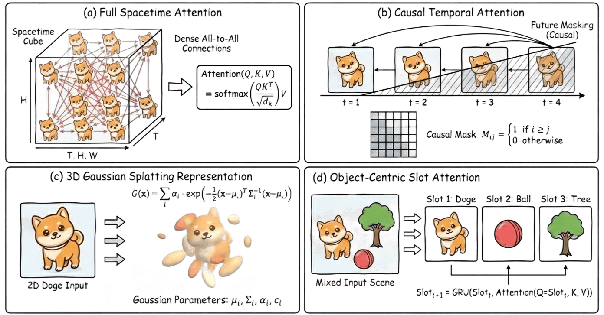

> 图 12：高级时空建模的关键机制。支撑现代模型的核心技术分类：(a) 全时空注意力（Full Spacetime Attention）实现了密集的长程依赖；(b) 因果掩码（Causal Masking）确保了时间因果性；(c) 三维高斯泼溅（3D Gaussian Splatting）提供了显式、可微的三维结构；(d) 以对象为中心的槽（Object-Centric Slots）将复杂场景分解为不同的实体。

- [(1) 静态表示机制（Mechanisms of Static Representation）.](#1-mechanisms-of-static-representation)
- [(2) 向四维动力学的演进（Evolution towards 4D Dynamics）.](#2-evolution-towards-4d-dynamics)

##### (1) 静态表示机制（Mechanisms of Static Representation）.

与 NeRF [mildenhall2020nerf] 的 **光线行进（ray marching）**  不同，3DGS [Kerbl2023SIGGRAPH] 利用 GPU 排序管线进行加速，包含三个关键特性：

(i) 光栅化管线。该算法涉及两个关键步骤：首先是 **视锥体裁剪与投影（Frustum Culling and Projection）** ，将三维高斯投影为二维屏幕空间协方差矩阵 $\Sigma^{2D}=JW\Sigma^{3D}W^{T}J^{T}$；其次是 **分块基数排序（tiled radix sort）** ，这是计算瓶颈，复杂度为 $O(N\cdot k)$。通过利用基于分块的并行渲染策略，该方法将计算限制在重叠的高斯上，并且在光栅化期间仅需进行 $\alpha$-混合，避免了空白空间的无意义采样。

(ii) 积分对偶性。NeRF 采用 **后向拉取（Backward Pull）**  方式，容易产生梯度遮蔽（$\partial C/\partial\sigma_{far}\approx 0$）。相比之下，3DGS 采用 **前向推送（Forward Push）** ；显式的稀疏性允许误差梯度 $\frac{\partial\mathcal{L}}{\partial\mu}$ 绕过 MLP，直接且稀疏地反向传播到几何参数。这种显式的梯度流是 3DGS 高效收敛的数学基础。

(iii) 自适应密度控制（Adaptive Density Control）。该方法可被视为 **自适应网格细化（Adaptive Mesh Refinement, AMR）**  的一种变体。其核心思想是：如果梯度过大且方差较小（$\|\nabla\mathcal{L}\|>\tau,\|\Sigma\|<\epsilon$），则判定为欠拟合，克隆该高斯；如果梯度大且方差大，则判定为过拟合，分裂该高斯。通过这种机制，该方法能够根据底层优化景观动态调整拉格朗日粒子的密度。

##### (2) 向四维动力学的演进（Evolution towards 4D Dynamics）.

针对四维时空建模，显式基元范式根据时间维度 $t$ 的处理方式，发展出三条主要演进路径：

(i) 拉格朗日粒子追踪（Lagrangian Particle Tracking）。如 PhysGaussian [Xie2024] 所述，它假设高斯基元具有物质点属性，通过引入连续介质力学方程（$\rho\ddot{\boldsymbol{x}}=\nabla\cdot\sigma+\boldsymbol{g}$）来求解运动方程 $\mu(t)=\mu_{0}+\int\boldsymbol{v}(\tau)d\tau$。通过将物理约束嵌入优化过程，该方法能够实现视觉外观与物理行为的联合学习。

(ii)  **欧拉张量分解（Eulerian Tensor Decomposition）** 。与 4D-GS [4dgaussiansplatting] 类似，4D时空场被建模为一个高维张量 $\mathcal{T}$，使用 CP 或 Tucker 分解来降低维度：

$$
\mathcal{T}(x,y,z,t)\approx\sum_{r=1}^{R}\boldsymbol{u}_{r}(x)\circ\boldsymbol{v}_{r}(y)\circ\boldsymbol{w}_{r}(z)\circ\boldsymbol{h}_{r}(t),(10)
$$

其中 $\circ$ 表示外积，$R$ 是张量秩，$\boldsymbol{u}_{r},\boldsymbol{v}_{r},\boldsymbol{w}_{r},\boldsymbol{h}_{r}$ 表示沿每个维度的因子向量。这种形式将存储复杂度从 $O(N^{4})$ 优化到 $O(N^{2})$，有效支持拓扑结构的动态变化。

(iii)  **规范变形（Canonical Deformation）** 。如 Deformable-GS [Yang2024_Deformable3DGS] 所述，它采用静态基元与瞬态偏移相结合的形式，通过 MLP 预测坐标偏移 $\Delta\mu$，利用 MLP 的谱偏差有效捕获高频运动场。

显式基元范式在平衡高帧率渲染和高分辨率重建方面表现出显著优势。然而，其离散特性引入了拓扑适应性限制，使其难以像隐式场 [luiten2024dynamic] 那样自然处理流体动力学中的断裂与融合，这表明需要引入高阶生成动力学模型。

#### 2.3.6 生成式统计先验（Generative Statistical Priors）

在开放世界生成任务中，观测条件极为稀疏，导致问题退化为不适定问题。在此阶段，研究工作利用 **视频扩散模型（video diffusion models）** 作为隐式世界模型先验，建立了一种算法-数据协同框架。

- [(1) 算法与几何约束](#1-algorithmic-geometric-constraints)
- [(2) 规模化数据基础](#2-scaled-data-foundation)

##### (1) 算法与几何约束（Algorithmic & Geometric Constraints）

为将二维先验提升至三维一致性，学术界重构了优化目标与架构设计：

(i)  **分数蒸馏采样（Score Distillation Sampling, SDS）与变分修正（Variational Correction）** 。与光度损失不同，SDS [poole2022dreamfusion] 通过计算预训练扩散模型的分数函数来获取梯度。针对 SDS 的过平滑问题，VSD（变分分数蒸馏，Variational Score Distillation）[Wang2023_Prolific] 引入了变分分布，最小化生成分布与先验分布之间的 KL 散度，从而恢复高频纹理细节。

(ii)  **多视角几何注意力（Multi-View Geometric Attention）** 。纯二维先验难以保证多头一致性。MVDream [shi2023MVDream] 等工作修改了 U-Net 架构，将空间自注意力升级为三维对应注意力。该设计迫使模型在生成不同视角时通过相机参数 ($R,T$) 进行特征对齐，实现了软几何一致性。

##### (2) 规模化数据基础（Scaled Data Foundation）

为打破三维数据瓶颈，学术界采用了合成-真实-生成混合构建策略进行大规模数据集建设：

(i)  **聚合（Aggregation）** 。Objaverse-XL [deitke2023objaverse] 整合了从互联网收集的数千万个三维资产，从根本上缓解了大规模三维数据稀缺的问题。G-Objaverse [Tang2024_LGM] 通过物理渲染管线提供了高质量的 RGB-D-法向三联体，成为训练大型通用重建模型（Large General Reconstruction Models, LGM）的标准数据源。

(ii)  **真实世界感知（Real-world Perception）** 。MVImgNet [yu2023mvimgnet] 和 Co3D-v2 [reizenstein2021common] 提供了数百万个在真实环境中捕获的以物体为中心的视频序列。尽管密集的几何真值大多不可用，但这些数据集在减少合成数据与真实数据之间的域差异方面发挥了关键作用，尤其是在外观和纹理分布上。

(iii)  **逆向生成引擎（Inverse Generative Engine）** 。See3D [ma2025youseeit] 通过将生成式视频模型与几何重建耦合，推进了一种自动化数据生成范式。具体而言，利用 SV3D [Stability_SV3D] 等视频扩散模型合成大规模伪三维视频，随后通过 Dust3R [wang2024dust3r] 进行几何推理，并借助 LGM 快速重建，构建了一个闭环数据生产引擎，以实现指数级的资产扩展。

空间一致性建模的发展呈现出清晰的迭代轨迹。早期方法依赖于二维代理拟合，随后逐渐演变为三维隐式表示以提升几何连贯性。此后，三维高斯泼溅（3D Gaussian Splatting）等显式公式重新引入了计算效率与渲染可扩展性。当前趋势表明，正朝着结合显式几何基元与隐式扩散先验的混合架构收敛，充分利用两种表示的互补优势 [Tang2024_LGM, Stability_SV3D]。

展望未来，该领域的研究重点正从纯视觉重建转向深度物理交互建模。一方面， **神经符号接地（Neuro-symbolic Grounding）** 将成为连接语义空间与几何空间的关键。未来模型旨在建立大语言模型（Large Language Models, LLMs）符号逻辑与数值参数之间的可微映射，如 Eureka [ma2024eureka] 等工作所示，以实现对物体材质与力学机制的内生理解，从而超越基于像素统计的模仿。另一方面，空间一致性的范围正扩展至 **动作一致性（Action-Consistency）** 。随着世界模型向交互式环境演进 [menapace2024playable]，强化学习（Reinforcement Learning, RL）将被引入生成循环，确保场景在响应动作 $\pi(a_{t}|s_{t})$ 时遵循物理因果性。为支持这一能力，架构层面有望打破级联生成管线，转向 **端到端原生 4D 流（End-to-End Native 4D Streaming）** ，即直接使用压缩的 4D 词元（Tokens）进行实时流式推理 [dalal2025oneminute]。

``

### 2.4 时间一致性（Temporal Consistency）

通过空间一致性的建模（§[2.3](#section-2-3)），我们已成功构建了一个几何完备的静态世界。然而，世界模型的核心价值不在于存档某一时刻的状态，而在于预演未来的轨迹。如果将空间一致性视为世界模型 [ha2018world] 的 **静态几何基础（Static Geometric Basis）** ，那么时间一致性则构成了确立其物理演化的 **时间动力学（Temporal Dynamics）** 的关键要素 [lecun2022path]。数学上，该过程等价于在高维流形空间中求解一个受物理约束 $\mathcal{L}_{\text{phy}}$ 与因果逻辑 $\mathcal{L}_{\text{causal}}$ 共同约束的 **多目标优化问题（Multi-objective Optimization Problem）**  [zhang2024physdreamer]，如图 [14](#figure-14) 所示。

``

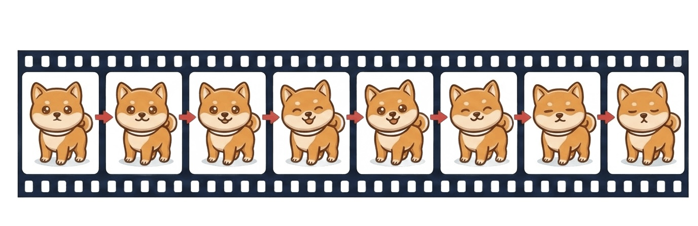

> 图 14：时间一致性与身份保持。图示时间注意力机制确保连续帧（$t_{0}\rightarrow t_{n}$）间主体特征的一致性。生成过程受两个关键约束支配： **物理约束（$\mathcal{L}_{\text{phy}}$）** 强制运动轨迹平滑，防止闪烁伪影； **因果约束（$\mathcal{L}_{\text{causal}}$）** 确保整个时间线上事件的逻辑演进（如物体恒存性）。

- [2.4.1 从频率稳定性到物理合规性](#241-from-frequency-stability-to-physical-compliance)
- [2.4.2 隐式时间膨胀](#242-latent-temporal-inflation)
- [2.4.3 离散自回归建模](#243-discrete-autoregressive-modeling)
- [2.4.4 基于 DiT 的统一时空建模](#244-unified-spatiotemporal-modeling-via-dit)
- [2.4.5 逻辑一致性与因果推理](#245-logical-consistency-and-causal-reasoning)

#### 2.4.1 从频率稳定性到物理合规性（From Frequency Stability to Physical Compliance）

为客观衡量时间一致性技术的演进轨迹，评估指标必须超越传统的感知维度。长期以来，学术界依赖 FVD（Fréchet 视频距离，Fréchet Video Distance）[unterthiner2018towards] 来评估视频质量，但实证研究表明，FVD 主要刻画空间特征分布的相似性，在检测时间域高频闪烁和非物理变形方面存在局限性。

必须指出，时间一致性中的频率稳定性并非孤立存在；它必须建立在模态对齐（§[2.2](#section-2-2)）的语义基础与空间几何（§[2.3](#section-2-3)）的拓扑约束之上。例如，Veo 3 [google2025veo] 等前沿模型正是通过集成 MM-DiT（模态一致性）和 3DGS（空间一致性），有效抑制了高频伪影并实现了物理合规的因果推理。

为填补这一空白， **视频一致性距离（Video Consistency Distance, VCD）**  [aoshima2025video] 被设计为一种 **基于奖励的微调目标（Reward-based Fine-tuning Objective）** 。如图 [15](#figure-15) 所示，VCD 测量生成视频 $\hat{V}$ 与自然视频在时间频谱中的特征差异：

``

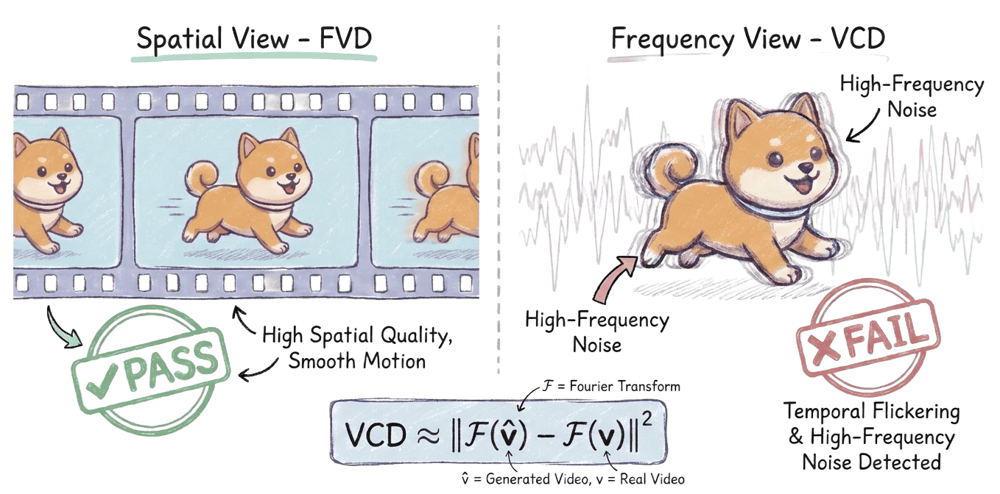

> 图 15：视频一致性分析：空间视角 vs. 频率视角。传统的基于分布的评价指标（如 FVD）主要在特征空间中评估空间感知质量和平滑运动，常常忽略高频时间闪烁。相比之下， **视频一致性分析（Video Consistency Analysis, VCD）** 通过分析特征嵌入的傅里叶频谱来显式建模时间一致性，从而能够检测到空间统计量无法察觉的细微高频噪声和闪烁伪影。

$$
\mathcal{L}_{\text{VCD}}(\hat{V})=\mathbb{E}_{t}\left[\|\mathcal{F}_{t}(\phi(\hat{v}_{t}))-\mathcal{F}_{t}(\phi(\hat{v}_{t-1}))\|_{\text{High-Pass}}^{2}\right],(11)
$$

其中 $\phi(\cdot)$ 表示特征提取器（例如，CLIP 图像编码器 [radford2021icml]），$\mathcal{F}_{t}$ 表示沿时间轴的 **短时傅里叶变换（Short-Time Fourier Transform, STFT）** 。该公式的物理含义是，现实世界中的运动特征应在频域中具备连续性，而生成模型中的时间不一致性（如纹理闪烁）将表现为高频频段上的显著能量波动。

``

> 表 3：跨代模型的实证演进。数据综合自 VBench（时间一致性）、Physics-IQ（物理合规性）和 Veo 3 技术报告（推理能力）基准。

| 生成范式       | 代表模型     | 时间一致性$\uparrow$ | 物理合规性$\uparrow$ | 因果推理$\uparrow$ | 频率保真度 (VCD)$\downarrow$ |
| -------------- | ------------ | ---------------------- | ---------------------- | -------------------- | ------------------------------ |
|                |              | (VBench 归一化)        | (Physics-IQ)           | (任务成功率)         | (奖励惩罚)                     |
| 时间膨胀       | AnimateDiff  | $0.68$               | $0.42$               | 不适用 ($<10\%$)   | 高 ($>1.2$)                  |
| 离散自回归     | VideoPoet    | $0.79$               | $0.55$               | 低 ($\sim 25\%$)   | 中 ($\sim 0.9$)              |
| 原生扩散变换器 | HunyuanVideo | $0.88$               | $0.78$               | 中 ($\sim 45\%$)   | 低 ($\sim 0.6$)              |
| 世界模型先验   | Google Veo 3 | 0.95^∗                | 0.86^∗                | 高 ($>70\%$)^†    | 极小 ($<0.3$)                |

- [从感知到物理推理](#from-perception-to-physical-reasoning)

##### 从感知到物理推理（From Perception to Physical Reasoning）

传统评估侧重于视觉质量，而新标准已扩展到物理因果维度。如表 [3](#table-3) 所示，首先，为了解决时间抖动问题， **生成先验范式（World Model Priors）** 通过引入频域奖励微调，显著减少了高频伪影（VCD $<$ 0.3）。其次，为了评估对物理定律的遵守情况，使用  **Physics-IQ**  [motamed2025physics] 来量化模型在刚体动力学和流体模拟中的合规性。最后，因果推理已成为像 Veo 3 [google2025veo] 这样的模型的核心评估维度。Veo 3 在零样本物理交互任务（例如预测多米诺骨牌倾倒）中展现出涌现能力，任务成功率超过 70%，标志着视频生成技术从纯视觉模拟向能够进行逻辑推理的动态系统的演进。

#### 2.4.2 潜在时间膨胀（Latent Temporal Inflation）

在大规模 4D 数据尚未普及的早期阶段，学术界致力于降低视频生成的训练门槛。以 Tune-A-Video [wu2023tuneavideo] 和 AnimateDiff [guo2023animatediff] 为代表的成果确立了“空间冻结、时间插入”的 **时间膨胀（Temporal Inflation）** 范式。

- [独立性假设与证据下界放松](#independence-assumption-elbo-relaxation)
- [空间锚定与零样本注入](#spatial-anchoring-zero-shot-injection)
- [频率滤波与动态校正](#frequency-filtering-dynamic-correction)
- [膨胀的理论边界](#the-theoretical-boundary-of-inflation)

##### 独立性假设与证据下界放松（Independence Assumption & ELBO Relaxation）

该范式的核心策略是将预训练的 2D 文生图（Text-to-Image, T2I）模型扩展为视频生成器，具体做法是冻结 2D U-Net 的空间卷积层，仅在层之间插入可学习的 1D 时间注意力模块。从概率图的角度看，这本质上是将视频生成的联合分布 $p(\boldsymbol{x}_{1:T})$ 简化为一个一阶马尔可夫链。理论推导表明，这种对 **证据下界（Evidence Lower Bound, ELBO）** 的放松忽略了 $p(x_{t}|x_{<t-1})$ 的高阶依赖关系，导致长序列上的 KL 散度项显著增加。在实际应用中（例如 VideoCrafter1 [he2024videocrafter]），这种数学上的放松表现为显著的 **语义漂移（Semantic Drift）** ：随着生成帧数的增加（$T>16$），初始帧的身份特征逐渐被独立的噪声注入所稀释。

##### 空间锚定与零样本注入（Spatial Anchoring & Zero-shot Injection）

为了抑制语义漂移，早期工作探索了无需训练的一致性增强路径。Text2Video-Zero [khachatryan2023text2video] 和 FateZero [qi2023fatezero] 采用了 **零样本注意力注入（Zero-shot Attention Injection）** 机制，强制后续帧复用第一帧的键/值（Key/Value）特征矩阵。同时，受 ControlNet [zhang2023controlnet] 的启发，一些工作引入了显式的几何条件（如深度/姿态）作为空间锚点。经验数据表明，尽管这些方法在静态背景下表现良好，但当物体运动幅度超过屏幕宽度的 20% 时，强制特征注入会导致明显的 **拖尾伪影（Smearing Artifacts）** ，揭示了膨胀范式在处理复杂动态时的局限性。

##### 频率滤波与动态校正（Frequency Filtering & Dynamic Correction）

除了时间漂移，现有的时间膨胀模型通常还面临 **频率盲区（Frequency Blindness）** 问题。由于时间注意力机制在 $(B\cdot HW)$ 维度上独立运行，在捕捉高频纹理变化时往往缺乏归纳偏置。傅里叶频谱分析表明，生成的视频在高频频段（$>15$Hz）存在显著的能量损失，视觉上表现为非物理的纹理闪烁。针对长程依赖和高频信息的捕捉，频域学习提供了一种新颖的视角。 **全局滤波器网络（Global Filter Networks, GFN）**  [rao2021global] 提出使用 2D 离散傅里叶变换（2D Discrete Fourier Transform, 2D DFT）替代自注意力机制，通过在频域执行全局滤波操作，以 $O(N\log N)$ 的复杂度实现长程时空交互的捕捉。在此基础上， **自适应傅里叶神经算子（Adaptive Fourier Neural Operators, AFNO）**  [guibas2021adaptive] 进一步优化了通道间信息聚合，证明了频域词元混合器（Token Mixers）能够有效克服空间盲区并精确保留高频细节。此外，针对序列建模中的噪声干扰，BERT4Rec [sun2019bert4rec] 和 Denoising SASRec [fan2022denoising] 引入了不确定性量化机制，通过在反向传播过程中将高噪声样本的梯度置零（梯度剪枝），实现了对无关扰动的动态抑制。在视频生成领域，FastInit [xing2025fastinit] 借鉴了这些去噪思想，提出了一种基于学习的噪声初始化策略。该方法摒弃了传统的独立高斯采样，而是训练一个轻量级的反演网络，根据前一帧的时空特征直接预测当前帧的最优初始噪声，在显著增强生成连贯性的同时，抑制了潜在空间的时间高频抖动。

##### 膨胀的理论边界（The Theoretical Boundary of Inflation）

尽管像 FastInit [xing2025fastinit] 这样的方法缓解了频域闪烁问题，但时间膨胀范式始终受限于其 2D 拓扑锚点。由于核心的空间卷积层被冻结，模型本质上是在对静态图像进行微小的弹性变形，而非生成真正的时间动态。实证研究 [xing2023dynamiccrafter] 表明，当面对大的视角变换（例如物体旋转 180 度）或新内容出现时，这类模型通常会产生严重的纹理拉伸。这种对预训练 2D 先验的过度依赖决定了它只能扮演过渡方案的角色。为了捕捉真实的物理世界动态，学术界转向探索从头开始训练的原生视频架构，这正是离散自回归范式发展的驱动力。

#### 2.4.3 离散自回归建模（Discrete Autoregressive Modeling）

为了打破长序列建模的理论瓶颈，VideoPoet [kondratyuk2023videopoet]、CogVideo [hong2022cogvideo] 和 W.A.L.T [gupta2023walt] 借鉴了大语言模型（LLMs）的缩放定律，建立了 **两阶段自回归生成范式** 。通过扩展上下文窗口，该范式将视频生成重构为对离散词元（Tokens）的长程因果预测。

- [因果 3D 分词器与数据压缩](#causal-3d-tokenizer-data-compression)
- [长序列中的记忆衰减](#memory-decay-in-long-sequences)
- [回归连续潜在空间](#return-to-continuous-latent-space)
- [混合过渡：融合自回归与扩散](#hybrid-transition-fusing-ar-and-diffusion)

##### 因果 3D 分词器与数据压缩（Causal 3D Tokenizer & Data Compression）

离散自回归范式的基石是高效的 3D VQ-VAE。与图像分词器不同，视频压缩必须严格遵守时间因果性。MagViT-v2 [yu2023magvitv2] 创新性地引入了 **非对称时间填充（Asymmetric Temporal Padding）** 和 **因果 3D 卷积（Causal 3D Convolution）** ，严格限制卷积核的感受野仅覆盖当前帧 $t$ 及之前的时刻，确保未来信息在压缩过程中不会泄露。针对低运动场景下的重建模糊问题，VTokenizer-Plus [arxiv2025compositional] 进一步引入了 **以对象为中心（Object-Centric）** 的表示，通过分离前景和背景的码本，显著提高了静态背景的纹理保真度。

##### 长序列中的记忆衰减（Memory Decay in Long Sequences）

随着 NVIDIA Cosmos [agarwal2025cosmos] 等模型的发布，AR 范式因其优越的数据扩展能力而重新受到关注。然而， **误差累积（Error Accumulation）** 仍然是该范式的核心挑战。根据序列建模理论 [bengio2015scheduled]，训练阶段的 **教师强制（Teacher Forcing）** 与推理阶段的自回归生成之间的分布偏移（暴露偏差），导致微小的帧间预测误差随时间步 $t$ 呈指数级放大。为了抑制这种序列方差，VAR [var_clip] 提出了 **下一尺度预测（Next-Scale Prediction）** 机制，将自回归过程从像素扫描重构为从粗到细的尺度递归，在数学上将推理步骤从线性 $O(N)$ 减少到对数 $O(\log N)$。此外，FramePack [zhang2025framepack] 引入了帧上下文打包机制和双向抗漂移采样，结合 **预训练帧保持（Pretraining Frame Preservation, PFP）**  [zhang2025pfp] 目标，显著提高了长时间序列下的重建保真度。

##### 回归连续潜在空间（Return to Continuous Latent Space）

尽管架构不断优化，但离散化操作 $z_{q}=\arg\min\|z_{e}-e_{k}\|$ 的不可微性是该范式固有的优化难题。训练通常依赖于 **直通估计器（Straight-Through Estimator, STE）**  [bengio2013estimating] 进行近似，但在高维视频空间（$D>4096$）中，由 STE 引起的梯度方差（$\sigma^{2}>10^{3}$）容易触发 **码本崩溃（Codebook Collapse）**  [van2017neural]。这种离散化差距限制了 AR 模型在生成细微纹理和亚像素运动方面的精度。正是这种局限性推动了技术焦点向 **连续潜在空间（Continuous Latent Space）** 的转移，即利用 **扩散变换器（Diffusion Transformers）** 直接在流形上对连续概率密度进行建模。

##### 混合过渡：融合自回归与扩散（Hybrid Transition: Fusing AR and Diffusion）

在纯 **自回归（Auto-Regressive, AR）**  与 **扩散变压器（Diffusion Transformer, DiT）**  之间，学术界探索了两者的融合路径，旨在结合AR的长程因果性与Diffusion的高保真解码能力。首先，在推理层面， **扩散强制（Diffusion Forcing）**  [chen2024diffusionforcing] 提出了一种非刚性序列建模方案，将每个时间步建模为独立的扩散过程，支持推理过程中的回滚和分支探索，打破了传统AR“覆水难收”的限制。其次，在架构层面， **Show-o**  [xie2024show] 提出了 **统一全模态模型（Unified Omni-Model）**  范式。该方法并非模块的简单堆叠，而是在单一权重集内实现了 **离散词元（discrete tokens）** （用于语义理解）和 **连续词元（continuous tokens）** （用于视觉生成）的同构建模。通过混合掩码机制，Show-o在物理权重中实现了理解与生成的双向互操作。

#### 2.4.4 基于DiT的统一时空建模

与时间膨胀范式带来的时空碎片化以及离散AR范式带来的量化损失相比，以 **Sora**  [openai2024sora] 和 **混元视频（HunyuanVideo）**  [hunyuan2024] 为代表的新一代范式，通过彻底回归连续潜空间并采用 **扩散变压器（Diffusion Transformer, DiT）**  架构，确立了当前视频生成时间一致性的基准。这种从时空解耦到完全时空同构的演进路径如图[16](#figure-16)所示。

``

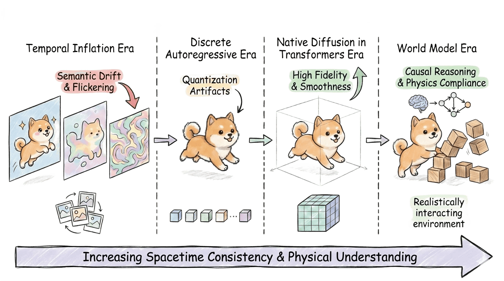

> 图16：视频生成范式的演进。技术路径从时间膨胀（易漂移）和离散AR（量化损失）演进到当前的 **原生DiT（Native DiT）** 。该范式实现了完全的时空同构，是 **世界模型（world models）**  的基础。

- [原生时空架构（Native Spatiotemporal Architecture）](#native-spatiotemporal-architecture)
- [计算演进：线性化与推理加速（Computational Evolution: Linearization &amp; Inference Acceleration）](#computational-evolution-linearization-inference-acceleration)
- [产业界的趋同与分化（Convergence &amp; Divergence in Industry）](#convergence-divergence-in-industry)

##### 原生时空架构（Native Spatiotemporal Architecture）

原生3D DiT将视频视为一个3D块序列 $N=T\times H\times W$，其核心优势在于通过全局感受野捕捉非局部的物理交互。

(i)  **全序列联合注意力（Full Sequence Joint Attention）** 。通过引入3D-RoPE来计算联合注意力 $\text{Attn}=\text{Softmax}(QK^{T}/\sqrt{d}+\mathcal{M})V$，模型能够计算跨全序列的联合注意力。实证研究（如 **Physics-IQ**  [motamed2025physics]）表明，切断时空联系的分解架构在数学上难以逼近 **纳维-斯托克斯方程（Navier-Stokes equations）**  中的对流项和长程相关性。只有全注意力机制提供的全局时空感受野才能捕捉此类非局部的物理交互。

(ii)  **流形微分同胚（Manifold Diffeomorphism）** 。在此基础上，基于 **流匹配（Flow Matching）**  [lipman2023flow] 的生成过程在数学上对应于流形上的微分同胚，使得模型能够从高斯噪声中平滑地恢复细微纹理细节，消除了因离散化导致的边缘闪烁。

##### 计算演进：线性化与推理加速（Computational Evolution: Linearization & Inference Acceleration）

尽管DiT确立了图像质量基准，但Transformer的二次复杂度（$O(N^{2})$）使得显存（VRAM）占用成为从短视频向长视频迈进时的物理障碍。

(i)  **线性化与缓存（Linearization & Caching）** 。在架构方面， **Video-TTT**  [dalal2025oneminute] 引入了 **测试时训练（Test-Time Training, TTT）**  范式，将历史上下文压缩到神经网络权重中，在保持 $O(N)$ 线性复杂度的同时实现了长视频的记忆保留。与此互补， **金字塔流（Pyramid Flow）**  [jin2025pyramid] 利用了视频的时空冗余，提出了一种金字塔流匹配机制，通过层次化解耦策略将高质量视频生成的计算成本降低了5-10倍。在推理方面， **TeaCache**  [liu2025teacache] 利用了扩散模型中相邻时间步特征输出的极高相似性（皮尔逊相关系数 $>0.98$），引入了一种免训练的动态缓存机制，在零图像质量损失的情况下实现了2-3倍的端到端加速。

##### 产业界的趋同与分化（Convergence & Divergence in Industry）

产业界并非简单地堆叠参数，而是展现了三条不同的演进路线：

(i)  **标准化与异构化（Standardization vs. Heterogeneity）** 。以 **Meta Movie Gen**  [meta2024moviegen] 为代表的工作确立了DiT + 流匹配的标准化范式，其提出的时间因果3D VAE解决了长视频中的时间切片闪烁问题。相比之下， **谷歌DeepMind**  在 **Lumiere**  和 **Veo**  [bar2024lumiere, google2025veo] 中坚持使用 **时空U-Net（Space-Time U-Net）**  架构，通过全时空注意力机制避免了级联超分辨率带来的时间不一致性，定义了高保真仿真质量的上限。

(ii)  **生态系统与可控性（Ecosystem & Controllability）** 。诸如 **Runway Gen-3**  [runway2024gen3] 和 **字节跳动PixelDance**  [makepixelsdance] 等应用层模型专注于细粒度交互，通过多模态导演模式和轨迹级控制实现了复杂的指令跟随。同时， **CogVideoX**  [cogvideox] 和 **混元视频（HunyuanVideo）**  [hunyuan2024] 等开源基础模型降低了微调门槛，直接推动了 **HuggingFace**  社区中视频微调生态系统的发展。

#### 2.4.5 逻辑一致性与因果推理

尽管基于DiT的生成模型已解决视觉连续性问题，但在处理长程物理逻辑（如因果不可逆性）时仍面临挑战。为弥合这一差距，学术界正从纯拟合范式转向认知推理范式，主要体现在两个互补方向的探索：多模态感知模型中的图文交错推理和生成视频模型中的时间链推理。

- [多模态感知中的图像思考（Think-with-Image in Multimodal Perception）](#think-with-image-in-multimodal-perception)
- [帧链与时间因果性（Chain-of-Frame &amp; Temporal Causality）](#chain-of-frame-temporal-causality)

##### 多模态感知中的图像思考（Think-with-Image in Multimodal Perception）

作为世界模型的认知前端， **大型多模态模型（Large Multimodal Models, LMMs）**  正试图通过引入视觉模态作为中间推理步骤来增强逻辑能力，而非仅依赖文本思维链（CoT）。以 **Mini-O3**  [minio3] 和 **VisCoT**  [viscot] 为代表的工作通过在推理过程中生成或检索图像来辅助逻辑跳跃。 **RECAP**  [zhang2023multimodal] 进一步形式化了这一流程，提出了一个递归的 **检索-生成-验证（Retrieve-Generate-Verify）**  循环，利用视觉信息弥补文本在空间关系推理上的不足。 **UV-CoT**  [wang2024chain] 探索了无监督条件下的图文思想对齐。尽管这些工作主要关注感知和理解层面，但其图像辅助思维机制为处理复杂时空逻辑的生成模型提供了有价值的架构见解。

##### 帧链与时间因果性（Chain-of-Frame & Temporal Causality）

在生成侧，时间一致性的核心已从视觉流畅性上升到事件因果性。模型必须理解物理事件的发生顺序，而不仅仅是像素插值。 **Video-CoT**  [videocot] 和 **Video Espresso**  [qiu2024freenoise] 引入了 **帧链（Chain-of-Frame）**  范式，将视频生成分解为关键帧规划和中间帧合成。与像素级自回归方法不同，该框架在潜空间中显式推导未来关键状态，迫使模型先确定因果节点，再生成视觉过程。 **Think Sound**  [liu2025thinksound] 进一步将这种因果性扩展到听觉模态，通过音频线索约束视频的物理演化。通过跨模态对齐底层因果图结构，该方法在整个时空跨度上强制逻辑自洽性，缓解了长视频中常见的逻辑退化问题。

``

### 2.5 一致性的展望（Outlook of the Consistencies）

通过专用模型的演进，实际上已经出现了三种不同的计算引擎。 **模态一致性（Modal Consistency）**  解决了跨模态的语义转换； **空间一致性（Spatial Consistency）**  从粗略的2D近似发展到显式的3D基元； **时间一致性（Temporal Consistency）**  则从简单的帧插值迈向因果世界模拟。

然而，将这些能力视为独立的优化目标会引入一个根本性瓶颈。在缺乏共享认知基板的情况下，一组高度专业化的模块，无论其个体多么精妙，都无法构成一个连贯的世界模拟器。因此，核心挑战从优化孤立组件转向实现架构统一。世界模型的未来在于达到一种平衡，使得语义理解、几何结构和因果推理能在单一参数空间内共同涌现。这一需求推动了接下来要审视的范式转变： **统一多模态模型（Unified Multimodal Models, UMMs）**  的出现。

``

## 3 多种一致性的初步整合（Initial Integration of Multiple Consistencies）

- [3.1 大型多模态模型的兴起](#31-the-rise-of-large-multimodal-models)
- [3.2 模态一致性与空间一致性的整合](#32-integration-of-modal-and-spatial-consistency)
- [3.3 模态一致性与时间一致性的整合](#33-integration-of-modal-and-temporal-consistency)
- [3.4 空间一致性与时间一致性的整合](#34-integration-of-spatial-and-temporal-consistency)
- [3.5 世界模型的初步涌现](#35-preliminary-emergence-of-world-models)

``

### 3.1 大型多模态模型的兴起（The Rise of Large Multimodal Models）

在前文中， **模态一致性（Modal Consistency）** 、 **空间一致性（Spatial Consistency）**  和  **时间一致性（Temporal Consistency）**  被视为独立的技术维度。然而，通用世界模型的构建最终并非取决于这些能力的孤立发展，而在于它们能否连贯地整合到一个统一的认知系统中。应对这一挑战需要超越模块化解决方案，转向能够跨模态、空间和时间进行联合推理的架构。以 LLaVA [liu2023llava] 和 GPT-4V [openai2023gpt4v] 为代表的 **大型多模态模型（Large Multimodal Models, LMMs）**  的兴起，标志着从单任务专家向通用认知实体的决定性范式转变。

- [3.1.1 大语言模型作为核心认知基础](#311-llm-as-a-core-cognitive-base)
- [3.1.2 认知演化作为多模态过程](#312-cognitive-evolution-as-a-multimodal)

#### 3.1.1 大语言模型作为核心认知基础（LLM as a Core Cognitive Base）

现代 LMMs [openai2023gpt4, team2023gemini, su2023sigir] 的核心设计理念是将预训练的 **大语言模型（Large Language Models, LLMs）**  [brown2020language, touvron2023llama] 视为一个通用推理引擎 [wei2022neurips, kojima2022large]。其本质在于将异构的模态数据映射到 LLM 的 **词嵌入空间（Word Embedding Space）**  [li2023blip2, zhu2023arxiv]。这一过程并非简单的维度变换，而是通过特定的 **转换器机制（translator mechanisms）** （例如，视觉连接器或适配器）[alayrac2022flamingo, liu2023llava, gao2023llamaadapter] 来实现跨模态的语义对齐与转换 [radford2021icml]。

- [(1) 模态词元化与表征桥接](#1-modal-tokenization-representation-bridging)
- [(2) 从刚性投影到感知器瓶颈](#2-from-rigid-projection-to-perceiver-bottleneck)

##### (1) 模态词元化与表征桥接（Modal Tokenization & Representation Bridging）

在具体实现路径中，模型首先利用 **视觉编码器（Visual Encoder）** （如 CLIP-ViT [radford2021icml] 或 SigLIP [zhai2023cvpr]）提取高维特征图 $\mathcal{F}\in\mathbb{R}^{H\times W\times C}$。为了使 LLM 能够处理这些非文本信号，LLaVA [liu2023llava] 及其后续改进 [liu2024llavanext, zhu2023arxiv] 采用了一个 MLP 或 **线性投影层（Linear Projection Layer）**  $\boldsymbol{W}_{\phi}$，将图像块特征直接投影为一组与文本词元维度对齐的 **视觉词元（Visual Tokens）**  $\mathcal{V}=\{\boldsymbol{v}_{1},\boldsymbol{v}_{2},\dots,\boldsymbol{v}_{n}\}$（其中 $\boldsymbol{v}_{i}\in\mathbb{R}^{d}$）。随后，这些词元与文本嵌入拼接，作为 **软提示（soft prompts）** ，形成混合输入序列：

$$
\boldsymbol{X}_{\textrm{input}}=\left[\boldsymbol{e}_{\textrm{text}}^{(1)},\dots,\boldsymbol{e}_{\textrm{text}}^{(m)},\boldsymbol{v}_{1},\dots,\boldsymbol{v}_{n}\right],(12)
$$

其中 $\boldsymbol{X}_{\textrm{input}}$ 表示对齐后的多模态序列，$\boldsymbol{e}_{\textrm{text}}$ 表示文本嵌入，$\boldsymbol{v}\in\mathbb{R}^{d}$ 是视觉词元。从这个角度看，对齐的物理意义在于使 LLM 的 **自注意力机制（self-attention mechanism）**  能够以处理文本词元的相同方式，计算视觉词元之间的关联熵。

##### (2) 从刚性投影到感知器瓶颈（From Rigid Projection to Perceiver Bottleneck）

为了解决直接投影可能导致的序列长度冗余问题，作为 Q-Former 和  **感知器重采样器（Perceiver Resampler）**  方法代表性架构的 BLIP-2 [li2023blip2] 和 Flamingo [alayrac2022flamingo]，利用固定数量的 **可学习查询（Learned Queries）**  作为中介，从海量的 **像素特征（Pixel Features）**  中过滤冗余信息。

该机制在数学上等效于一种 **语义池化（semantic pooling）** ：它强制模型将数千个 **空间块（Spatial Patches）**  压缩成数十个具有高度抽象语义的词元。这不仅解决了计算开销问题，而且在理论上满足了 **信息瓶颈假说（Information Bottleneck hypothesis）**  [tishby2015deep]；通过约束 $I(Z;X_{vis})$ 的容量，模型被迫在对齐过程中仅保留那些有利于语言推理的特征。此外，DeepSeek-VL [lu2024deepseek] 和 InternVL [chen2023internvl] 的实验表明，这种对齐过程可以在预对齐阶段促使 LLM 内部形成 **跨模态物理流形（cross-modal physical manifold）** ，使得模型即使在未见场景中也能维持基本的逻辑一致性。

#### 3.1.2 认知演化作为多模态过程（Cognitive Evolution as a Multimodal）

LMMs 的涌现超越了传统的端到端映射范式 [kim2021vilt, wang2022git]，赋予了系统类似于 **多模态操作系统（multimodal operating system）**  的资源调度和逻辑协调能力。在此架构中，LLM 不再仅仅充当特征处理器，而是扮演 **内核（Kernel）**  的角色 [yang2023mmreact, wu2023visual]，负责管理复杂的指令流，并按需调用异构的 **专用模块（Specialized Modules）**  [schick2023toolformer, meta2024chameleon, suris2023vipergpt]。

- [(1) 层次化任务规划与程序化指令](#1-hierarchical-task-planning-programmatic-instruction)
- [(2) 工具使用与闭环验证](#2-tool-use-closed-loop-verification)

##### (1) 层次化任务规划与程序化指令（Hierarchical Task Planning & Programmatic Instruction）

为了解决长时域任务中的语义漂移问题， **大语言模型（Large Language Models, LLMs）**  展现出递归分解的能力，将高层模糊指令拆解为原子性子任务。与早期静态映射不同，VisProg [gupta2023visualprog] 和 ViperGPT [suris2023vipergpt] 提出了 **视觉程序化推理范式（visual programmatic reasoning paradigm）** ，将视觉查询解析为可执行的 Python 代码流程，通过结合底层视觉算子实现逻辑自洽性。该机制的本质——将物理指令转化为逻辑程序——在于利用 LLM 的 **上下文学习（in-context learning）** 能力，将开放域问题投影到受限的算子空间。此外，PaLM-E [driess2023palm] 和 Voyager [wang2023voyager] 已证明，通过融入多模态感知的实时反馈，LLMs 能够在潜在动作空间中进行层次化搜索，从而在动态环境中保持长期一致性。

##### (2) 工具使用与闭环验证（Tool-use & Closed-loop Verification）

为了纠正生成过程中的物理幻觉，LMMs 发展出一种基于 **测试时计算（test-time compute）** 的闭环精炼机制。以 Visual ChatGPT [wu2023visual] 和 HuggingGPT [shen2024hugginggpt] 为代表的框架采用了 **ReAct（推理与行动，Reasoning and Acting）范式**  [yao2022react]，如图 [17](#figure-17) 所示。这使得模型能够主动暂停生成路径，调用外部专家模型（例如，调用检测器验证空间关系，或调用扩散模型重绘不合理纹理）。Chameleon [meta2024chameleon] 和 Auto-GPT [richards2023autogpt] 等架构进一步引入了反馈评估阶段：通过计算生成中间状态与原始指令之间的互信息或几何约束偏差 $\Delta_{\phi}$，模型可以执行梯度引导的迭代精炼。

``

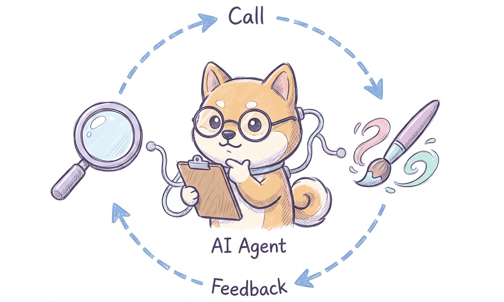

> 图 17：工具使用与闭环验证（Tool-use & Closed-loop Verification）。图示 ReAct 范式，其中 AI 智能体循环调用外部检测与校正工具来精炼生成输出。

``

### 3.2 模态与空间一致性的融合（Integration of Modal and Spatial Consistency）

模态与空间一致性的融合构成了通往物理世界模拟器 [yang2023unisim, gaia1] 的核心桥梁。这种深层的跨域协同旨在解决传统生成模型中语义丰富但几何坍缩的持续性问题，其核心效用体现在两个维度。在 **语义-空间对齐（semantic-spatial alignment）** 方面，它赋予模型对复杂空间指令（如遮挡、环绕和视角堆叠）的精确响应能力 [li2023gligen]，实现了从文本描述纹理到语言定义布局的可控性质的飞跃 [lian2024llmvideo]，如图 [18](#figure-18) 所示。在 **几何-物理锚定（geometric-physical grounding）** 方面，它迫使生成内容遵循客观世界的几何规律，有效消除了多视图条件下的结构性非刚体变形和空间错位幻觉 [liu2023zero1to3]。这种融合确保了人工智能不再局限于二维像素的统计拟合，而是具备在三维流形中推断时空动态的能力 [videodiffusionmodels, bar2024lumiere]。

``

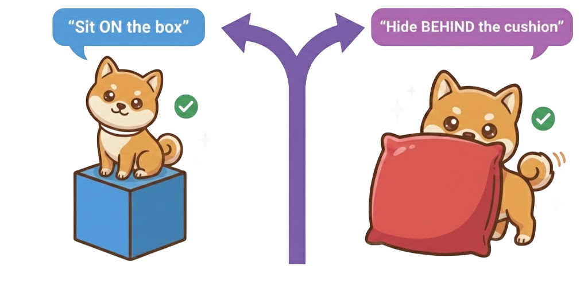

> 图 18：模态 + 空间一致性：语言控制精确空间关系（Modal + Spatial Consistency: Language Controls Precise Spatial Relations）。该模型结合模态与空间一致性，使用语言指令精确控制主体（Doge）与物体之间的空间关系（例如，坐在盒子上面，藏在垫子后面）。

在现有研究中，模态与空间一致性的深度融合呈现出四条并行技术路径，如图 [19](#figure-19) 所示，分别探索了隐式涌现、显式协同、结构化同构与强化学习的独特范式。 **像素空间操控（Pixel space manipulation）** 侧重于利用大规模多模态语料库的规模效应，将几何变换内化为隐式语义映射，在通用生成中实现直观指令即空间控制 [editworld, sgedit, mio]。并行地， **视图空间映射（View space mapping）** 引入相机姿态和深度图作为显式几何条件，通过交叉注意力机制使语义流和几何流在二维平面上共存并协同，有效平衡了生成灵活性与视角准确性 [liu2023zero1to3, chen2024moai, Long2024]。与此同时， **体素空间表示（Volume space representation）** 以世界坐标系为基础，将语义特征直接锚定到神经体素场或三维高斯原语上，使空间一致性成为表示的内在物理属性 [openshape, lang3dxl]。最后， **强化学习（Reinforcement learning）** 通过引入 **系统二推理范式（System-2 Reasoning paradigm）** 来解决组合指令中的词袋缺陷。通过区域-时间解耦和推理侧缩放机制，它将生成过程从纯粹的统计采样提升为配备逻辑验证的计划性解决方案 [black2023training, chen2025ttpo, zeng2025layoutcot]。这四种范式并非线性替代关系，而是互补共生；它们共同从数据驱动泛化、条件控制灵活性、物理建模精度以及逻辑推理鲁棒性四个维度，拓展了世界模型中语义-空间融合的边界。

- [3.2.1 像素空间操控](#321-pixel-space-manipulation)
- [3.2.2 视图空间映射](#322-view-space-mapping)
- [3.2.3 体素空间表示](#323-volume-space-representation)
- [3.2.4 模态-空间对齐的强化学习](#324-reinforcement-learning-for-modal-spatial-alignment)

#### 3.2.1 像素空间操控（Pixel Space Manipulation）

该范式的核心思想在于锚定数据分布，明确地用几何先验换取规模效应 [poole2022dreamfusion, lin2023magic3d]。与依赖昂贵硬编码几何先验的传统图形学 [mildenhall2020nerf, muller2022instant] 不同，像素空间操控主张基于预训练的二维生成基座（如潜在扩散模型或自回归变换器）[esser2021taming, rombach2022high]，构建图像-文本及时空数据的联合分布 $p_{\theta}(\boldsymbol{x}_{\textrm{img}},\boldsymbol{c})$ [ho2022imagen]。

从数学上讲，这等价于假设海量的二维投影数据 $\{\boldsymbol{x}_{\textrm{img},i}\}_{i=1}^{N}$ 足以覆盖高维三维流形 $\mathcal{M}_{\textrm{world}}$ 的拓扑结构 [liu2023zero1to3]。在此背景下， **模态一致性（Modal Consistency）** 表现为条件概率 $p(\boldsymbol{x}_{\textrm{img}}|\boldsymbol{c}_{\textrm{sem}})$ 的语义对齐 [radford2021icml, zhang2023controlnet]，而 **空间一致性（Spatial Consistency）** 则作为在重建误差最小化时优化联合分布所自发涌现的结果 [blattmann2023align, guo2023animatediff]。

#### 3.2.2 视角空间映射（View Space Mapping）

- [(1) 指令驱动图像编辑（Instruction-Driven Image Editing）](#1-instruction-driven-image-editing)
- [(2) 通用图像生成（General Image Generation）](#2-general-image-generation)

##### (1) 指令驱动图像编辑（Instruction-Driven Image Editing）

为解决基于文本编辑中常见的几何坍缩问题（例如，在指示狗坐下时背景出现非物理形变）， **指令驱动图像编辑（Instruction-Driven Image Editing）** 建立了一种混合范式，将 **梯度解耦与更新** 和 **作为门控机制的注意力注入（attention injection）** 相结合。该范式旨在通过构建正交控制路径来解决语义重建与结构保持之间的内在矛盾，实现了一个 **重语义桥接**  [hertz2022prompt] 与 **轻量结构约束架构** ，如图 [20](#figure-20) 所示。

``

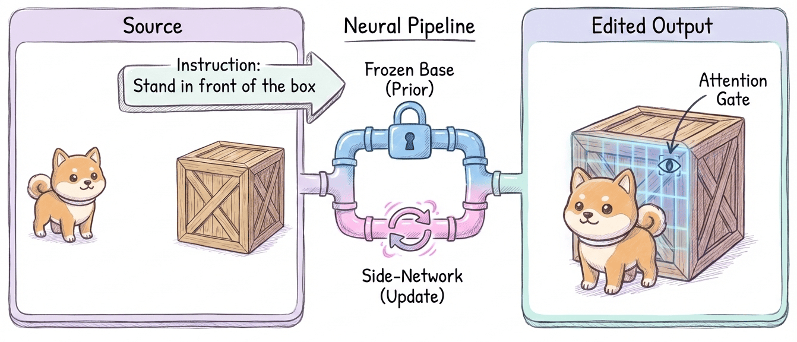

> 图 20：指令驱动图像编辑。该图展示了保持结构的图像编辑过程，其中一只“神烦狗（Doge）”通过文本指令被重新定位。图中描绘了 **梯度解耦（冻结基础模型）** 和 **注意力注入（几何门控）** 机制，以维持空间一致性。

 **梯度解耦与更新（Gradient Decoupling & Update）。**  为有效解耦并保护原始空间布局 $\mathcal{S}_{\textrm{orig}}$，同时注入新的语义 $\Delta\boldsymbol{c}$，主流范式（如 ControlNet [zhang2023controlnet] 或 IP-Adapter [ye2023ipadapter]）采用了一种结构化解耦架构。通过冻结预训练基础模型（例如 SDXL），仅微调侧网络或解耦的交叉注意力，该模型在参数流形上构建了一条与基础模型正交的梯度更新路径：

$$
\nabla_{\boldsymbol{\theta}}\mathcal{L}=\underbrace{\nabla_{\boldsymbol{\theta}_{\textrm{base}}}\mathcal{L}_{\textrm{prior}}}_{\approx 0\text{(Frozen)}}+\underbrace{\nabla_{\boldsymbol{\theta}_{\textrm{adapter}}}\mathcal{L}_{\textrm{edit}}}_{\text{Semantics}},(13)
$$

其中，$\boldsymbol{\theta}_{\textrm{base}}$ 表示基础模型的冻结参数，$\boldsymbol{\theta}_{\textrm{adapter}}$ 表示侧网络的可训练参数。这确保了基础模型内化的物理常识（如光照、遮挡）不受干扰。

 **作为门控机制的注意力注入（Attention Injection as Gating）。**  在推理阶段，Prompt-to-Prompt [hertz2022prompt] 和 MasaCtrl [cao2023masactrl] 揭示了交叉注意力图与空间布局之间的强相关性。为保持空间一致性，模型将原始图像的注意力图 $\boldsymbol{M}_{\textrm{attn}}^{\textrm{src}}$ 作为几何硬门控机制注入到编辑步骤中：

$$
\textrm{Attn}_{\textrm{edit}}(\boldsymbol{Q},\boldsymbol{K},\boldsymbol{V})\leftarrow\alpha\cdot\textrm{Softmax}\left(\frac{\boldsymbol{Q}\boldsymbol{K}^{T}}{\sqrt{d}}\right)+(1-\alpha)\cdot\boldsymbol{M}_{\textrm{attn}}^{\textrm{src}},(14)
$$

其中，$\boldsymbol{M}_{\textrm{attn}}^{\textrm{src}}$ 表示从源图像保留下来以引导空间布局的注意力图，$\alpha$ 是注入强度系数。结合 Step-1X Edit [step1xedit] 提出的 **多模态大语言模型（MLLM）语义中枢机制** ，该方法成功实现了拓扑保持下的语义变化。后续工作如 EditWorld [editworld] 进一步引入了后编辑闭环，利用 **分段任意模型（SAM）** 掩码进行二阶几何验证，以解决物体边缘的像素伪影问题。

##### (2) 通用图像生成（General Image Generation）

 **通用图像生成（General Image Generation）** 正经历从 **外部插件对齐** 到 **原生全双工建模** 的范式重构，旨在通过端到端联合训练直接捕获物理世界的时空动态分布。该领域的范式转变特征为：从 **外部对齐（基于CLIP）** 到 **端到端交错建模（End-to-End Interleaved Modeling）** 。这一转变不再依赖冻结的特征提取器，而是通过 **联合建模**  [dreamllm]、 **视频流监督**  [kipf2019contrastive] 和 **轻量连接**  [mentor] 构建一个模态与空间紧密耦合的生成基础。

(i)  **联合建模突破信息瓶颈（Joint Modeling Breaking Information Bottleneck）。**  传统两阶段模型（如 DALL-E 2）受限于 **对比语言-图像预训练（CLIP）** 编码器的模态隔离，导致特征压缩过程中空间关系丢失。新一代模型，如 DreamLLM [dreamllm] 和 Emu [sun2024emu]，摒弃了这种设计，转而使用自回归或扩散方法直接在原始图像-文本序列上进行联合建模：

$$
\mathcal{L}_{\textrm{joint}}=-\sum_{t}\log p\left(\boldsymbol{x}_{\textrm{img},t}\mid\boldsymbol{x}_{\textrm{img},<t},\boldsymbol{x}^{\textrm{txt}}\right)-\sum_{j}\log p\left(\boldsymbol{x}_{j}^{\textrm{txt}}\mid\boldsymbol{x}_{\textrm{img}},\boldsymbol{x}_{<j}^{\textrm{txt}}\right),(15)
$$

其中，$\mathcal{L}_{\textrm{joint}}$ 表示统一的训练目标，$\boldsymbol{x}_{\textrm{img},t}$ 代表时间步 $t$ 的图像词元（token），$\boldsymbol{x}^{\textrm{txt}}$ 对应文本词元。这种全双工信息流使模型能够捕获诸如“桌子上的猫”这类描述中隐含的像素级空间约束。

(ii)  **视频作为世界模拟器（Video as World Simulator）。**  超越简单的几何透视变换，对 Sora [openai2024sora] 的实证研究揭示了视频数据的深刻价值：它提供了关于 **物理合理性** 的内源性监督信号。

与静态图像不同，视频流中的时间依赖性迫使模型学习 **物体恒存性（object permanence）**  [kipf2019contrastive, locatello2020object]——例如，推断一个被遮挡的物体并未消失，而是继续沿其轨迹运动。这种自监督迫使模型在潜在空间内构建一个符合物理守恒定律（如重力、碰撞、流体动力学）的动力学模型 [ha2018world]，从而将生成模型从单纯的像素统计拟合提升为对物理世界演化的预测性模拟 [yang2023unisim]。

(iii)  **轻量连接层（Lightweight Connection Layer）。**  为平衡计算效率与多模态对齐，Flamingo [alayrac2022flamingo] 中的 **感知器重采样器（perceiver resampler）** 和 Mentor [mentor] 中的 **多层感知器（MLP）** 连接层设计展示了如何使用最少的参数将视觉特征投影到大语言模型（LLM）的语义流形上。这证明只要基础模型足够强大，简单的线性映射就能维持复杂的空间-语义对应关系。

- [姿态对齐耦合训练（Pose-Aligned Coupled Training）](#姿态对齐耦合训练)

##### 姿态对齐耦合训练（Pose-Aligned Coupled Training）

该范式的核心思想在于摒弃纯粹数据驱动的黑箱假设，并将 **三维几何信息** 作为结构化条件变量 $\tau=\{\boldsymbol{P}_{t},\mathcal{D}\}$（其中 $\boldsymbol{P}_{t}\in SE(3)$ 是 **相机姿态（camera pose）** ，$\mathcal{D}$ 是 **深度先验（depth prior）** ）注入到预训练的 **扩散模型（diffusion model）**  [zhang2023controlnet, liu2023zero1to3] 中，如图 [21](#figure-21) 所示。其数学本质是构建一个受几何约束的条件去噪分布：

``

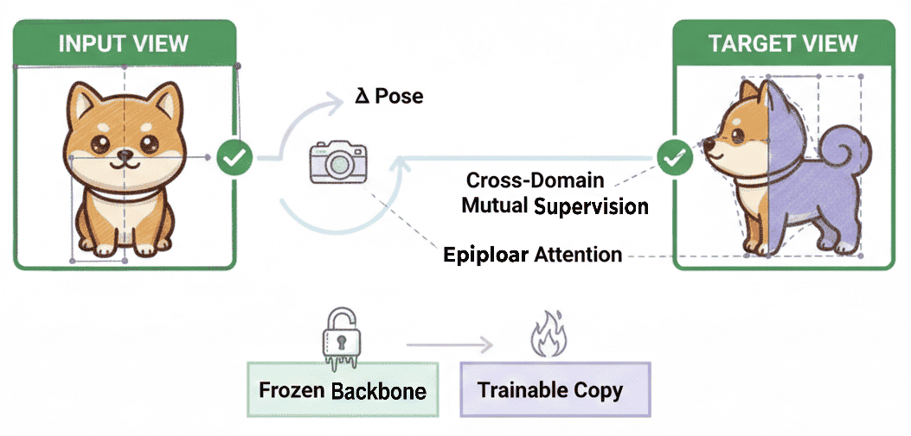

> 图 21：姿态对齐视图合成（Pose-Aligned View Synthesis）。该图展示了使用解耦主干网络和极线注意力进行姿态条件生成的流程。目标视图展示了RGB纹理和紫蓝色法向图（Normal Map）的分屏显示，代表了用于几何精度的跨域相互监督。

$$
\mathcal{L}_{\textrm{view}}=\mathbb{E}_{\boldsymbol{z},t,\boldsymbol{c},\tau,\boldsymbol{\epsilon}}\left[\|\boldsymbol{\epsilon}-\boldsymbol{\epsilon}_{\boldsymbol{\theta}}(\boldsymbol{z}_{t},t,\boldsymbol{c},\tau)\|_{2}^{2}\right]+\lambda\mathcal{R}_{\textrm{consist}},(16)
$$

其中，$\boldsymbol{z}_{t}$ 表示时间步 $t$ 处的带噪潜变量，$\boldsymbol{\epsilon}_{\boldsymbol{\theta}}$ 是以几何信息 $\tau$ 为条件的噪声预测网络，$\mathcal{R}_{\textrm{consist}}$ 表示多视图一致性的正则化项。该范式的成功实施依赖于以下三个协同机制：

(i)  **主干网络解耦与注入（Backbone Decoupling & Injection）** 。为避免灾难性遗忘，同时保留预训练模型的语义生成能力，学术界建立了一种 **冻结主干网络（frozen backbone）**  与 **旁路控制（bypass control）**  的设计。以 Zero-1-to-3 [liu2023zero1to3] 和 ControlNet [zhang2023controlnet] 为代表，该方法通过锁定主干网络 $\mathcal{F}_{\textrm{locked}}$ 并引入一个可训练的副本 $\mathcal{F}_{\textrm{copy}}$ 来实现选择性梯度流：$\boldsymbol{h}_{\textrm{out}}=\mathcal{F}_{\textrm{locked}}(\boldsymbol{h}_{\textrm{in}})+\mathcal{Z}(\mathcal{F}_{\textrm{copy}}(\boldsymbol{h}_{\textrm{in}},\tau))$。这种 **零卷积（zero convolution）**  策略确保了模型在精确执行几何指令的同时，能够生成 **逼真的纹理（photo-realistic textures）** 。

(ii)  **结构化稀疏注意力（Structured Sparse Attention）** 。为解决多视图生成中的 **“Janus”问题（janus problem）** ，模型引入了结构化稀疏注意力。MVDream [shi2023MVDream] 和 SyncDreamer [syncdreamer] 创新性地将三维空间中的 **极线几何约束（epipolar geometry constraints）**  转化为注意力掩码：

$$
\textrm{Attn}(\boldsymbol{Q}_{i},\boldsymbol{K}_{j},\boldsymbol{V}_{j})\propto\exp\left(\frac{\boldsymbol{Q}_{i}\boldsymbol{K}_{j}^{T}}{\sqrt{d}}+\mathcal{M}_{\textrm{epi}}(i,j)\right),(17)
$$

其中 $\boldsymbol{Q}_{i}$ 和 $\boldsymbol{K}_{j}$ 分别表示来自视图 $i$ 和视图 $j$ 的特征，$\mathcal{M}_{\textrm{epi}}$ 表示源自极线约束的几何偏置。该机制强制不同视图的词元仅与其几何上对应的极线区域进行交互，从而将几何硬约束转化为注意力机制中的 **软归纳偏置（soft inductive bias）** 。

(iii)  **跨域注意力正则化（Cross-Domain Attention Regularization）** 。为进一步提升几何精度，Wonder3D [Long2024] 和 MoAI [chen2024moai] 通过并行生成 RGB 图像和法向图，并引入跨域注意力注入 $\boldsymbol{f}_{\textrm{rgb}}\leftrightarrow\boldsymbol{f}_{\textrm{geo}}$，实现了纹理语义与几何结构之间的相互监督。结合 **三维一致噪声初始化策略（3D consistent noise initialization strategy）** （基于相机投影矩阵初始化噪声），该范式成功地从初始状态打破了 **独立同分布（i.i.d.）**  假设，实现了从简单图像生成到几何可控生成的转变。

#### 3.2.3 体积空间表示（Volume Space Representation）

与前两种在二维平面上模拟三维的范式不同， **体积空间表示（volume space representation）**  选择直接面对物体的三维本质 [poole2022dreamfusion, realfusion]。这一方向的核心思想是利用 **三维原生表示（3D Native Representations）** （如 NeRF、三维高斯泼溅（3D Gaussian Splatting））作为架构抽象的主要层次。这使得空间一致性成为表示的内在属性，而模态一致性则转化为跨模态查询与可微渲染之间的协同优化问题。

- [(1) 条件三维生成：从二维蒸馏到视频流形约束。](#1-条件三维生成从二维蒸馏到视频流形约束)
- [(2) 多模态对齐。](#2-多模态对齐)
- [(3) 三维理解与编辑：语义提升。](#3-三维理解与编辑语义提升)

##### (1) 条件三维生成：从二维蒸馏到视频流形约束（Conditional 3D Generation: From 2D Distillation to Video Manifold Constraints）

 **条件三维生成（Conditional 3D generation）**  旨在通过将预训练的生成模型重构为冻结的认知引擎，来克服三维数据稀缺的瓶颈，建立一条从 **二维语义蒸馏（2D semantic distillation）**  演进到 **视频流形约束（video manifold constraints）**  的技术路线。由于高质量三维-文本数据对极度稀缺（比二维数据少 2–3 个数量级），该方向不再试图从头训练三维生成器，而是专注于发现和迁移预训练的二维或视频模型 [poole2022dreamfusion, ma2025youseeit] 中固有的空间智能。

(i)  **来自二维先验的梯度流（Gradient Flow from 2D Priors）** 。DreamFusion [poole2022dreamfusion] 和 RealFusion [realfusion] 为该领域建立了基础公式： **分数蒸馏采样（Score Distillation Sampling, SDS）** 。其核心原理并非优化像素误差，而是优化一个参数化的三维场 $\theta$（如 NeRF 或 3DGS），使得从任意视点渲染的图像 $\boldsymbol{x}_{\textrm{img}}=g(\theta,\boldsymbol{P}_{t})$ 位于二维扩散模型的低能量区域：

$$
\nabla_{\boldsymbol{\theta}}\mathcal{L}_{\textrm{SDS}}=\mathbb{E}_{t,\boldsymbol{\epsilon}}\left[w_{\textrm{guidance}}\left(\boldsymbol{\epsilon}_{\boldsymbol{\theta}}(\boldsymbol{z}_{t},t)-\boldsymbol{\epsilon}\right)\frac{\partial\boldsymbol{x}_{\textrm{img}}}{\partial\boldsymbol{\theta}}\right],(18)
$$

其中 $w_{\textrm{guidance}}$ 是权重因子，$\boldsymbol{\epsilon}_{\boldsymbol{\theta}}$ 是来自冻结扩散模型的预测噪声，$\frac{\partial\boldsymbol{x}_{\textrm{img}}}{\partial\boldsymbol{\theta}}$ 表示 **可微渲染器（differentiable renderer）**  的雅可比矩阵。该公式表明，由二维模型计算的语义残差通过可微渲染器 $g$ 的雅可比矩阵 $\frac{\partial\boldsymbol{x}_{\textrm{img}}}{\partial\boldsymbol{\theta}}$ 反向传播，直接塑造三维几何。

(ii)  **作为动态三维先验的视频流形（Video Manifold as Dynamic 3D Prior）** 。为解决二维先验导致的“Janus”问题，近期研究转向利用 **视频扩散模型（Video Diffusion Models, VDMs）**  固有的物理一致性。其核心假设是： **时间相关性（Temporal Correlation）**  $\cong$  **空间一致性（Spatial Consistency）** 。See3D [ma2025youseeit] 和 V3D [chen2025v3d] 提出利用视频生成模型作为多视图生成器。通过对 VDM 进行微调，将时间轴 $T$ 隐式地重构为相机轨迹 $\boldsymbol{P}_{t}$（例如，环绕视点）：

$$
p(\boldsymbol{x}_{\textrm{img, novel}}\mid\boldsymbol{x}_{\textrm{img, ref}})\approx p_{\textrm{video}}(\boldsymbol{x}_{\textrm{img},t+1}\mid\boldsymbol{x}_{\textrm{img},t},\text{motion_cond}),(19)
$$

其中 $p_{\textrm{video}}$ 表示视频模型学习到的转移概率，motion_cond 代表相机轨迹条件。在此范式下， **SV3D**  [Stability_SV3D] 利用视频模型的时间注意力层作为 **软极线约束** ，强制生成具有几何连续性的多视角序列。随后，使用  **SDS**  将此动态视频先验蒸馏为静态 3D 资产，从根本上解决了视角冲突问题。

(iii)  **先验-约束两阶段循环** 。鉴于单视角生成的不适定性， **Magic123**  [qian2024magic123] 和  **One-2-3-45**  [Liu2023_One2345] 建立了粗生成 $\to$ 精细优化的范式。当前的趋势是使用视频模型 [hunyuan3domni] 快速生成多视图作为初始猜测，然后结合轻量级求解器 [shen2021dmtet] 使用  **SDS**  进行几何细化。这种视频初始化与物理微调的策略在保留语义丰富性的同时，利用视频先验修正了 3D 结构的拓扑合理性。

##### (2) 多模态对齐（Multimodal Alignment）。

多模态对齐旨在构建跨越几何与语义的通用表征。通过建立判别式度量对齐与生成式交互融合的双轨机制，打破了 3D 数据长期存在的表征孤岛困境。为了像  **CLIP**  处理图像一样处理 3D 数据，该方向专注于构建一个 **统一嵌入空间**  $\mathcal{Z}_{\textrm{uni}}$。其技术理念是将空间一致性转化为网络前向传播过程中的结构化约束，如图 [22](#figure-22) 所示。

``

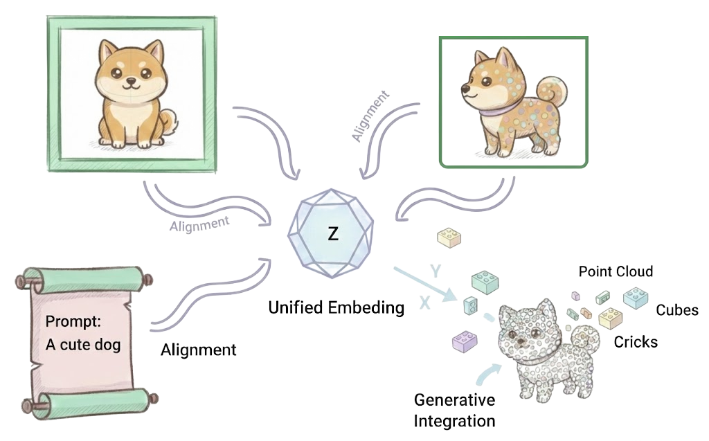

> 图 22：多模态对齐。该图展示了文本、图像和 3D 点云汇聚到一个中心化统一嵌入的过程。它描绘了输入的对比对齐以及用于 3D 数据集成的生成式分词化。

 **对比度量学习** 。 **ULIP-2**  [ulip2] 和  **OpenShape**  [openshape] 采用大规模三元组对比学习。通过挖掘难负样本并利用  **InfoNCE**  损失，强制 3D 编码器（ **PointNet++**  或  **Transformer** ）的特征分布与  **CLIP**  的文本/图像空间对齐：

$$
\mathcal{L}_{\textrm{align}}=-\log\frac{\exp\left(\boldsymbol{z}_{\textrm{3D}}\cdot\boldsymbol{z}_{\textrm{txt}}/\tau\right)}{\sum_{j}\exp\left(\boldsymbol{z}_{\textrm{3D}}\cdot\boldsymbol{z}_{\textrm{txt}}^{j}/\tau\right)},(20)
$$

其中 $\boldsymbol{z}_{\textrm{3D}}$ 和 $\boldsymbol{z}_{\textrm{txt}}$ 分别表示 3D 形状和文本的特征嵌入，$\tau$ 是温度参数。 **Genesis**  [genesis] 进一步将其扩展到 4D 时空对齐，通过在体素空间中引入跨视角注意力来融合视频和激光雷达模态，实现了跨时空维度的对齐。

 **生成式集成** 。与对比学习的整体对齐不同， **ShapeLLM-Omni**  [shapellmomni] 和  **ViewSetDiffusion**  [viewsetdiffusion] 引入了  **3D VQ-VAE** ，将连续几何离散化为词元序列。这使得大语言模型（LLM）能够直接读取和生成 3D 几何，实现了模态间的生成式交互，而非简单的检索匹配。

##### (3) 3D 理解与编辑：语义提升（3D Understanding & Editing: Semantic Lifting）。

3D 理解与编辑旨在赋予 3D 几何实体语义感知和语言操作的 **双重能力** 。其核心范式是通过 **语义提升** 将 2D 视觉基础模型的认知先验注入 3D 空间，构建一个映射 $F(x,y,z)\mapsto\mathbb{R}^{D_{\textrm{clip}}}$。

 **语义场构建** 。 **LERF**  [lerf] 和  **Lang3D-XL**  [lang3dxl] 提出在与 NeRF 的颜色头并行的位置训练一个语义头。该模块通过多尺度监督学习  **CLIP**  特征场，使得空间中的每个坐标点 $\boldsymbol{p}(x,y,z)$ 都能响应自然语言查询（例如， **找到椅子上的裂缝** ）。 **SKED**  [sked] 和  **CoRe-3D**  [core3d] 引入了层次化语义场，将实例-部件-材质层次嵌入表征中，以解决细粒度语义定位问题。

 **语言驱动的拓扑编辑** 。对于编辑任务， **CLIP-NeRF**  [clipnerf] 利用解耦的潜在映射实现对形状和外观的近即时修改。 **InstructNeRF2NeRF**  [haque2023instructnerf2nerf] 采用迭代数据集更新策略：首先使用  **InstructPix2Pix**  修改渲染视图图像，然后将修改后的图像作为伪真值反向更新 NeRF。 **Lift3D**  [lift3d] 和  **ICE-G**  [iceg] 引入 **规范空间约束** ，确保即使在显著的几何变形（例如， **指令猫站立起来** ）期间，拓扑结构也不会崩溃。

#### 3.2.4 模态-空间对齐的强化学习（Reinforcement Learning for Modal-Spatial Alignment）

尽管诸如  **ControlNet**  [zhang2023controlnet] 等架构提供了显式的几何条件，但 **大型多模态模型（LMMs）** 在处理组合指令（例如，属性绑定： **蓝车上的红猫** ）时，仍然频繁表现出严重的模态-空间错位 [li2023gligen]。为了解决这种词袋模型缺陷，学术界正经历从黑盒优化向 **系统-2 推理（System-2 Reasoning）**  [lian2024llmvideo] 的范式转变。

此范式演进可概括为三个阶段：

- [判别器引导的显式锚定。](#discriminator-guided-explicit-anchoring)
- [区域-时间解耦。](#region-temporal-decoupling)
- [TTT 与视觉思维链。](#ttt-visual-cot)

##### 判别器引导的显式锚定（Discriminator-Guided Explicit Anchoring）。

早期工作集中于利用现成的视觉判别器作为外部奖励函数 $\mathcal{R}$，强制建立文本提示与边界框之间的对应关系。

 **黑盒离散优化** 。 **DDPO**  [black2023training] 将扩散去噪建模为 **马尔可夫决策过程（MDP）** 。对于空间指令，它引入一个开放词汇检测器（例如  **GroundingDINO**  [liu2023grounding]）来计算  **IoU**  奖励。这是一种松耦合融合；虽然它增强了对象召回率，但奖励信号的稀疏性使其难以解决复杂的属性绑定。

 **白盒梯度反向传播** 。 **AlignProp**  [prabhudesai2023alignprop] 提出将判别器微调为可微分的奖励模型。这建立了一个端到端的梯度路径 $\nabla_{\textrm{pixels}}\mathcal{L}_{\textrm{align}}$，使得空间误差可以直接反向传播到去噪网络，从而实现像素级的精炼。

##### 区域-时间解耦（Region-Temporal Decoupling）。

为了防止全局奖励混淆语义与空间信息，后续工作转向了细粒度控制。

 **R-DPO**  [gallego2024refined] 提出了空间掩码下的子流形优化。与传统的  **DPO**  不同，它将图像 $\boldsymbol{x}_{\textrm{img}}$ 和文本 $\boldsymbol{c}$ 分解为若干局部对 $(\boldsymbol{x}_{\textrm{crop}}^{k},\boldsymbol{c}_{\textrm{sub}}^{k})$，确保特定的模态属性（例如， **红色** ）仅反向传播到特定的空间区域（例如，在 **猫** 的坐标范围内）：

$$
\mathcal{L}_{\textrm{R-DPO}}=-\sum_{k}\mathbb{E}_{(\boldsymbol{x}_{\textrm{w}},\boldsymbol{x}_{\textrm{l}})\sim B_{k}}\left[\log\sigma\left(\beta\log\frac{\pi_{\boldsymbol{\theta}}(\boldsymbol{x}_{\textrm{img, w}}^{k}\mid\boldsymbol{c}_{k})}{\pi_{\textrm{ref}}(\boldsymbol{x}_{\textrm{img, w}}^{k}\mid\boldsymbol{c}_{k})}-\beta\log\frac{\pi_{\boldsymbol{\theta}}(\boldsymbol{x}_{\textrm{img, l}}^{k}\mid\boldsymbol{c}_{k})}{\pi_{\textrm{ref}}(\boldsymbol{x}_{\textrm{img, l}}^{k}\mid\boldsymbol{c}_{k})}\right)\right],(21)
$$

其中 $B_{k}$ 表示区域 $k$ 的局部偏好数据集，$\boldsymbol{x}_{\textrm{w}}$ 和 $\boldsymbol{x}_{\textrm{l}}$ 分别表示获胜和失败的图像裁剪块，$\sigma$ 是 sigmoid 函数。

同时， **SPO**  [liang2025spo] 利用扩散模型的频率特性，采用 **时分复用策略** ：在去噪早期阶段（$t\in[T,T/2]$）专注于空间  **IoU**  优化，在后期阶段（$t\in[T/2,0]$）切换到语义优化，以避免梯度冲突。此外， **DRaFT**  [clark2024directly] 利用视觉语言模型（VLM）生成关于空间错误的自然语言批评，并将其映射到一个稠密的奖励图 $\mathcal{R}\in\mathbb{R}^{H\times W}$。这标志着强化学习对齐从离散框向连续像素场的转变，使生成模型能够理解诸如 **左腿扭曲** 等极其细微的空间模态指令。

##### TTT 与视觉思维链（TTT & Visual CoT）。

继  **DeepSeek-R1**  和  **OpenAI o1**  成功展示了推理侧扩展的有效性之后，最近的研究开始将强化学习引入生成的推理阶段，实现了模态与空间的强逻辑融合。

 **测试时偏好优化（Test-Time Preference Optimization, TTPO）** 。为了解决预训练模型在特定分布下感知质量不足的问题， **TTPO**  [chen2025ttpo] 提出了一种即时优化机制。该方法通过在推理阶段使用轻量级奖励模型（如图像质量评分）迭代更新潜在变量 $\boldsymbol{z}$，避免了繁重的重新训练。虽然这项工作主要验证了其在图像恢复任务中的有效性，但这种测试时微调范式为解决高度反直觉的生成任务提供了一条通用的 **用计算换质量** 的路径。

 **视觉思维链（Visual Chain-of-Thought, Visual CoT）** 。为了解决一步生成固有的逻辑断裂问题， **Layout-CoT**  [zeng2025layoutcot] 借鉴了大语言模型的推理范式。该方法将生成过程分解为一个显式链： **规划**  $\to$  **对齐**  $\to$  **生成** 。模型首先在低维空间中生成一个离散的布局计划，并使用强化学习对该计划进行逻辑验证。只有通过验证的思维链才能被解码为像素。该机制本质上将 **系统-2**  逻辑验证前置，从根本上消除了诸如相互穿插或空间错位等幻觉。

``

### 3.3 模态与时间一致性的集成（Integration of Modal and Temporal Consistency）

模态与时间一致性的深度集成标志着生成式人工智能正式从静态图像的 **冻结瞬间** 向动态世界的 **连续演绎** 过渡，如图 [23](#figure-23) 所示 [openai2024sora]。该维度的核心效用在于构建一个 **时空因果的概率模拟** ：在语义层面，确保视频内容严格遵循文本或图像指令的定义（例如， **绽放** 、 **奔跑** ），从而消除跨模态语义漂移 [videocomposer, bar2024lumiere]；在动力学层面，赋予模型对 **物体恒存性** 和 **物理守恒定律** 的内生理解，确保生成的帧序列不再是离散像素的随机堆叠，而是一个符合逻辑演进的 **连续流形**  [ho2022imagen, blattmann2023stable]。这种融合从根本上解决了传统视频生成中长期存在的问题，如运动闪烁、时间逻辑混乱和长视频崩溃。

``

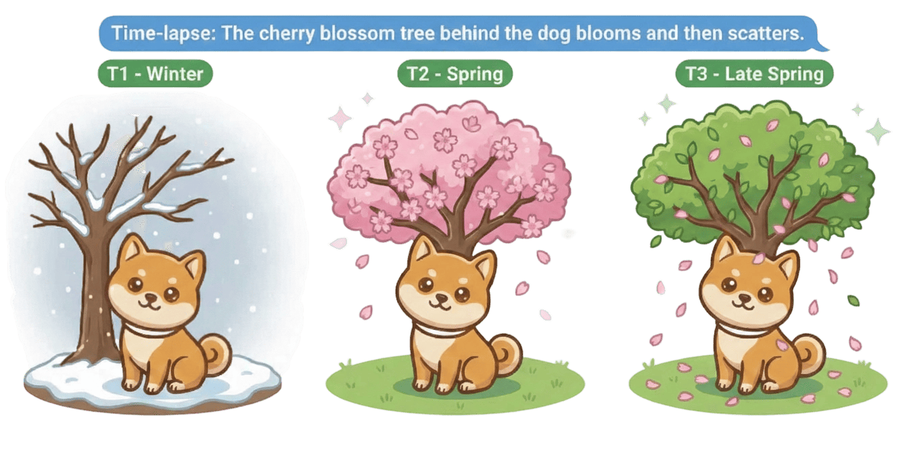

 **图 23：模态 + 时间一致性：语言控制时间演化。**  该模型整合了模态一致性与时间一致性，利用语言指令控制时间演化过程（例如，狗背后的樱花树在 T1-冬季、T2-春季、T3-晚春期间依次开花并飘落），确保随时间产生连贯的变化。

基于这一目标，当前的探索路径呈现出 **四种渐进式技术范式** ，如图 [24](#figure-24) 所示： **端到端可扩展建模** 遵循“数据暴力美学”的数据哲学，依赖 **扩散模型（Diffusion Models）**  和 **自回归架构（Autoregressive Architectures）**  验证 **规模定律（Scaling Law）** ，旨在从海量数据中直接学习一个通用的物理模拟器 [videodiffusionmodels, ovi, hybridvla]； **显式结构化控制** 针对工业应用的可控性需求，通过引入运动矢量、轨迹热力图和正交解耦机制，将人类意图显式注入生成过程，解决端到端模型的模糊性问题 [vast2024, makepixelsdance, fancyvideo]；与此同时， **统一理解与生成共生架构** 试图通过共享表示和双向适配打破感知与生成之间的壁垒，构建一个具备感知与行动闭环的通用智能体 [phenaki, omnivideo]；最后， **强化学习驱动的对齐** 通过构建 **多维奖励流形（Multi-dimensional Reward Manifold）** ，解决 **监督微调（Supervised Fine-Tuning, SFT）**  在优化模态语义与“时间动态”方面的非凸性问题。通过整合 **直接偏好优化（Direct Preference Optimization, DPO）**  和 **自我精炼（Self-Refinement）**  机制，该范式实现了对齐目标的联合优化，驱动模型超越二元博弈，收敛至时空权衡的 **帕累托前沿（Pareto Frontier）**  [liu2025videodpo, cheng2025vpo]。这四种范式共同从 **通用基础、可控接口、认知顶层和价值优化** 四个维度，构建了模态与时间智能的完整架构。

``

> **图 24：模态一致性与时间一致性的演进。**

- [3.3.1 端到端可扩展建模](#331-end-to-end-scalable-modeling)
- [3.3.2 显式结构化控制](#332-explicit-structured-control)
- [3.3.3 统一理解与生成共生架构](#333-unified-comprehension-and-generation-symbiosis-architecture)
- [3.3.4 用于模态-时间对齐的强化学习](#334-reinforcement-learning-for-modal-temporal-alignment)

#### 3.3.1 端到端可扩展建模（End-to-End Scalable Modeling）

 **端到端可扩展建模** 代表了视频生成领域从“分而治之”向“统一场论”的范式转变。其核心目标是在高维时空流形上验证 **规模定律（Scaling Law）**  的有效性——具体而言，通过协同扩展模型和数据规模，直接拟合从多模态输入到视频输出的联合分布 $p(\boldsymbol{x}_{img}|\boldsymbol{c})$。与早期严重依赖手工设计的插值和超分辨率模块的级联流水线不同，该范式致力于构建一个通用的物理模拟器，推动模型从 Sora [openai2024sora] 到 Wan 2.1 [wan2025] 的产业化进程。

- [(1) 扩散模型（Diffusion Model）](#1-diffusion-model)
- [(2) 自回归模型（Autoregressive Model, AR）](#2-autoregressive-model-ar)
- [(3) 自回归-扩散混合模型（Autoregressive-Diffusion Hybrid Model）](#3-autoregressive-diffusion-hybrid-model)

##### (1) 扩散模型（Diffusion Model）

作为端到端视频生成的核心引擎， **扩散模型** 通过在 **潜空间（Latent Space）**  $\mathcal{Z}$ 内验证 **规模定律（Scaling Law）** ，彻底重构了从“图像动画”到“原生世界模拟”的技术路径。为支撑这一物理一致性的复杂目标，现代架构的演进已不再局限于简单的去噪迭代，而是系统性地重塑了四大核心支柱：从生成理论的 **常微分方程（Ordinary Differential Equation, ODE）**  统一 [liu2023rectified]，压缩表示的因果解耦 [cogvideox]，注意力建模的原生三维化 [guo2023animatediff]，到生成策略的渐进级联 [visiondialect]，共同构成了时空智能的底层基础。

(i)  **通过流匹配（Flow Matching）实现理论统一。**  尽管早期工作遵循基于 **随机微分方程（Stochastic Differential Equation, SDE）**  的 DDPM 范式，但诸如 Sora [openai2024sora] 和 Wan 2.1 [wan2025] 等 **当前最优（state-of-the-art, SOTA）**  模型已普遍转向 **流匹配（Flow Matching, FM）**  框架，以提升采样效率和时间连贯性。FM 并非预测高斯噪声 $\epsilon$，而是将生成过程形式化为在噪声分布 $\pi_{0}$ 与数据分布 $\pi_{1}$ 之间构建一条确定性的 **常微分方程（ODE）**  轨迹。核心优化目标转变为在最优传输路径上回归速度场 $\boldsymbol{v}_{t}$：

$$
\mathcal{L}_{\textrm{FM}}(\boldsymbol{\theta})=\mathbb{E}_{t,\boldsymbol{z}_{0},\boldsymbol{z}_{1}}\left[\left\|\boldsymbol{v}_{\boldsymbol{\theta}}\left(t,(1-t)\boldsymbol{z}_{0}+t\boldsymbol{z}_{1}\right)-(\boldsymbol{z}_{1}-\boldsymbol{z}_{0})\right\|^{2}\right],(22)
$$

其中 $\boldsymbol{v}_{\boldsymbol{\theta}}$ 表示由网络参数 $\boldsymbol{\theta}$ 预测的速度场，$\boldsymbol{z}_{0},\boldsymbol{z}_{1}$ 分别代表来自先验噪声和数据分布的样本。如 Rectified Flow [liu2023rectified] 所示，该范式强制潜变量 $\boldsymbol{z}$ 沿线性轨迹演化，显著降低了传输曲率。这使得模型能够在极少的步数内生成具有物理守恒性的动态纹理，解决了 DDPM 在长期采样中固有的结构崩溃问题。

(ii)  **因果时空压缩。**  为规避高维视频数据的计算瓶颈，架构设计中的首要挑战在于构建一个满足因果性的紧凑潜空间 $\mathcal{Z}$。MagViT-v2 [yu2024magvitv2] 和 CogVideoX [cogvideox] 指出了传统 3D 卷积中存在的“未来信息泄露”风险。因此，现代编码器普遍引入 **因果 3D 变分自编码器（Causal 3D VAE）**  [blattmann2023stable, bar2024lumiere]，利用非对称时间填充和因果卷积核，确保潜码 $\boldsymbol{z}_{t}$ 的生成仅依赖于历史帧 $\boldsymbol{x}_{img,\leq t}$。这种设计不仅在数学上保证了时间逻辑的单向性，也为流式推理提供了架构基础。此外，通过采用异构下采样策略（例如 $t\times 4,h\times 8,w\times 8$），模型实现了高频运动信息与低频语义特征的解耦压缩 [rombach2022high, peebles2023scalable]。

(iii)  **原生 3D 注意力建模。**  关于潜空间中的动力学建模，学术界经历了一次深刻的归纳偏置修正。早期工作如 AnimateDiff [guo2023animatediff] 采用“时空因子化”注意力，虽降低了计算成本，却割裂了时空耦合，难以模拟复杂的流体动力学。HunyuanVideo [hunyuanvideo] 和 OpenSora [opensora] 随后确立了 **原生 3D 扩散 Transformer（Native 3D DiT）**  的主导地位，使用 3D-RoPE 计算整个时空序列上的联合自注意力。尽管这引入了 $O((THW)^{2})$ 的二次复杂度，但通过集成 Ring Attention [liu2023ring] 等序列并行技术，模型能够捕获长程时空依赖关系，从而使符合物理规律的连贯运动得以涌现。

(iv)  **渐进对齐与级联。**  为解决长视频生成中的误差累积问题，模型采用了“从粗到细”的条件控制策略。Tar 提出的 Visual Dialect [visiondialect] 通过将文本映射为视觉兼容的标记，实现了语义的原生对齐。对于生成长视频（$>10s$），Kling [kling] 和 Vidu [vidu] 利用时空级联策略。模型首先以低帧率生成一个语义骨架，该骨架随后作为条件 $\boldsymbol{c}_{ctx}$ 输入到 **时间超分辨率模型（Temporal Super-Resolution Model）** 。这种级联架构本质上将高维联合分布 $p(\boldsymbol{x}_{img})$ [ma2024latte] 分解为多个条件概率的乘积，有效缓解了长序列生成中单个模型的显存压力和逻辑漂移 [wu2023tune]。

##### (2) 自回归模型（Autoregressive Model, AR）

 **自回归模型** 借鉴了 **大语言模型（Large Language Models, LLMs）**  的 **规模定律（Scaling Law）**  [kaplan2020scaling, hoffmann2022training]，其核心理念是“万物皆可标记化”。该范式摒弃了扩散模型的去噪先验，将视频生成重新定义为离散潜空间中的因果序列预测问题 [esser2021taming, vandenOord2017neural]。其数学本质是最大化联合概率分布的对数似然，通过单向链式法则强制模型学习物理世界的时间因果性。为支撑这一统一序列建模的愿景，该范式的技术演进正围绕四个关键维度展开：离散编码的保真度、多模态交互的拓扑结构、混合生成的时间鲁棒性以及多任务推理的泛化边界。

(i)  **离散化瓶颈与因果3D码本（The Discretization Bottleneck & Causal 3D Codebook）** 。自回归模型的上界取决于分词器（tokenizer）的压缩质量。早期的 **VQGAN** 存在严重的 **码本坍缩（codebook collapse）** 和高频闪烁问题。 **VideoPoet**  [kondratyuk2023videopoet] 和  **MagViT-v2**  [yu2024magvitv2] 通过引入 **免查找量化（Lookup-Free Quantization, LFQ）** 和 **因果3D卷积（Causal 3D Convolution）** 取得了突破。前者通过直接投影降低了量化方差，而后者通过非对称填充（asymmetric padding）确保了压缩过程不违反物理因果性。 **VILA-U**  [vilau] 进一步提出了 **统一视觉塔（Unified Vision Tower）** ，在预训练阶段强制对齐视觉词元（visual tokens）和文本嵌入（text embeddings），从根本上解决了离散空间中异质模态之间的语义鸿沟。

(ii)  **全模态交互拓扑（Omni-Modal Interaction Topology）** 。在序列建模阶段，架构设计的核心在于处理多模态词元的交互粒度。 **序列拼接（Sequence Concatenation）** ： **UniForm**  [uniform] 采用激进的早期融合策略，将视频、音频和文本词元拼接成一个长序列。虽然使用共享权重的变换器（Transformers）捕获跨模态依赖性可最大化模态间的知识迁移，但面临注意力计算中的 $O(N^{2})$ 爆炸问题。 **双流门控调制（Dual-Stream Gated Modulation）** ：为降低计算开销， **RFLAV**  [rflav] 和  **Ovi**  [ovi] 采用后期融合。Ovi 设计了一种对称双骨干架构，通过 **旋转位置编码（RoPE）频率缩放** 对齐不同模态的采样率；RFLAV 在变换器的 **自适应层归一化（AdaLN）** 层中引入时间平均调制，在不显著增加参数量的情况下实现了音视频特征的软对齐。

(iii)  **长程动力学与混合范式（Long-Horizon Dynamics & Hybrid Paradigms）** 。纯离散自回归模型在生成长视频时，常因误差累积而面临崩溃。为纠正这一缺陷，研究者开始探索“离散规划 + 连续校正”的混合路径。 **非量化自回归（Non-Quantized AR）** ： **NoVA**  [autoregressivevideogeneration] 挑战了数据“必须离散化”的假设，提出了在连续空间中进行连续自回归预测的方法。它将视频分解为“帧级时间步”和“集合级空间步”，通过扩散解码器预测连续特征，以规避量化带来的信息损失。 **滚动流匹配（Rolling Flow Matching）** ： **RFLAV**  [rflav] 创新性地引入了滑动窗口机制。在自回归预测出粗粒度词元后，使用流匹配进行局部细化。通过“移除首帧并添加加噪末帧”的滚动策略，理论上实现了无限时长的物理一致生成，解决了自回归模型“有逻辑但缺细节”的固有问题。

(iv)  **统一多任务推理（Unified Multi-Task Reasoning）** 。自回归架构的终极优势在于其 **零样本泛化（zero-shot generalization）** 能力。如  **VideoPoet**  所示，通过引入特定任务词元（例如 `'¡optical_flow¿'`、`'¡depth¿'`），单个模型无需微调即可执行视频生成、风格迁移甚至视听问答任务。这种“杂食性”特征证明了自回归范式在构建通用世界模拟器方面的独特潜力。

##### (3)  **自回归-扩散混合模型（Autoregressive-Diffusion Hybrid Model）** 。

 **自回归-扩散混合模型** 的核心协同机制，如图 [25](#figure-25) 所示，本质在于将 **自回归的时间因果约束** 注入到 **扩散模型** 的迭代去噪流形中。这种混合生成的通用数学表示不再是简单的概率叠加，而是构建一个“因果逻辑与高质量生成”的联合概率密度：

``

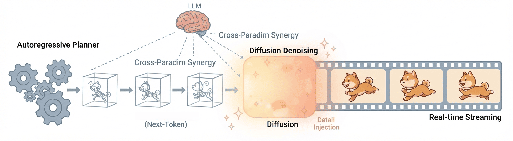

> 图 25：自回归-扩散模型。它描绘了一个 **自回归规划器（AR Planner）** 构建因果时间骨架（蓝色线框），随后通过 **扩散细化器（Diffusion Refiner）** （暖色雾状）注入细节，从而生成高质量的长时视频输出。

$$
p_{\boldsymbol{\theta}}(\boldsymbol{x}_{\textrm{img},1:T},\boldsymbol{z}_{1:T}\mid\boldsymbol{c})=\prod_{t=1}^{T}\underbrace{p_{\textrm{AR}}(\boldsymbol{z}_{t}\mid\boldsymbol{z}_{<t},\boldsymbol{x}_{\textrm{img},<t},\boldsymbol{c})}_{\text{因果时间动力学}}\cdot\underbrace{p_{\textrm{Diff}}(\boldsymbol{x}_{\textrm{img},t}\mid\boldsymbol{z}_{t},\boldsymbol{x}_{\textrm{img},<t},\boldsymbol{c})}_{\text{条件去噪渲染}},(23)
$$

其中，$\boldsymbol{x}_{\textrm{img},1:T}$ 表示生成的多模态序列（视频/音频），$\boldsymbol{z}_{t}$ 表示含噪潜变量或中间特征，$p_{\textrm{AR}}$ 和 $p_{\textrm{Diff}}$ 分别对应低维因果建模和高保真条件去噪分布。该机制旨在结合自回归的 **长程规划优势** 与扩散的 **细节生成能力** ，克服单一模型的固有缺陷。基于这种联合建模方法，该范式的技术演进沿着两条正交路径展开： **时序融合优化** 和 **跨范式模态协同** ，旨在同时解决长序列生成中的动态一致性瓶颈和异质模态间的对齐挑战。

(i)  **时序融合优化（Temporal Fusion Optimization）** 。核心在于平衡严格的因果依赖与生成灵活性，通过差异化架构设计打破长视频生成的效率瓶颈。 **实时流式动力学（Real-time Streaming Dynamics）** 。为应对生成速度和显存限制，多项工作重构了推理范式。 **AR-Diffusion**  [ardiffusion] 提出了一种训练-推理统一的扩散损坏机制，通过强制执行非递减帧时间步约束 ($t_{1}\leq t_{2}\leq...\leq t_{F}$) 建立时间基线，并结合动态调度器实现无差错的可变长度生成。 **CausVid**  [slowbidirectionalfastautoregressive] 通过 **分布匹配蒸馏（distribution matching distillation）** 将双向扩散转换为自回归架构；结合 **键值缓存（KV cache）** 和滑动窗口机制，平衡了流式生成的实时性与无限长度扩展能力。此外， **NFD**  [playingtransformer] 利用 **分块因果注意力（block-wise causal attention）** 和 **推测性采样（speculative sampling）** ，首次在 3 亿以上参数规模下实现了 30+ FPS 的实时生成。 **RFLAV**  [rflav] 创新性地引入了滚动流匹配和轻量级时间调制模块，在显著降低计算开销的同时，实现了无限时长音视频的精确对齐生成。 **长程连贯性引导（Long-term Coherence Guidance）** 。为解决长序列中的逻辑漂移，协同引导策略成为关键。 **ARLON**  [arlon] 采用“粗粒度锚定-细粒度细化”策略，使用自回归模型生成包含长程语义的粗粒度特征以引导 **扩散变换器（Diffusion Transformer, DiT）** 进行细节细化，同时利用 **VQ-VAE** 统一表示空间抵抗噪声干扰。 **ACDC**  [acdc] 提出了一种零样本协同框架，在不修改架构的情况下，让自回归模型充当全局上下文“规划器”，扩散模型充当局部“校正器”，利用 **大语言模型（Large Language Model, LLM）** 的外部记忆模块有效缓解长序列预测中的误差累积。

(ii)  **跨范式模态协同（Cross-Paradigm Modal Synergy）** 。聚焦于模态对齐的精度与集成架构的紧密度，旨在实现异质信号的深度耦合。 **扩散增强表示（Diffusion-Augmented Representation）** 。 **DiCoDe**  [dicode] 以 **扩散级联分词方案（diffusion cascaded tokenization scheme）** 挑战传统的离散化方法。它首先将视频编码为连续潜特征，然后使用扩散过程将其压缩为高保真离散词元。该方法在保持视觉细节的同时实现了千倍压缩，并通过交叉注意力机制加强了文本-视频语义对齐，为长视频生成提供了高质量的“词汇表”。 **端到端架构融合（End-to-End Architectural Fusion）** 。 **HybridVLA**  [hybridvla] 展示了范式融合在 **具身人工智能（Embodied AI）** 领域的潜力。它在一个统一的 LLM 框架内无缝集成了扩散生成和自回归预测，将扩散生成的连续动作向量投影到 LLM 的词嵌入空间中。通过引入特殊词元分隔两种范式，并根据自回归置信度自适应地融合预测结果，该模型实现了跨视觉、语言和动作模态的端到端逻辑闭环，显著增强了智能体“感知-推理-执行”链的连贯性。

#### 3.3.2  **显式结构化控制（Explicit Structured Control）**

尽管端到端模型在图像质量上取得了突破，但其“文本即一切”的交互模式在工业应用中表现出显著的模糊性。 **显式结构化控制** 旨在解决可控性挑战。其核心概念是将高维动力学流形 $\mathcal{M}_{dyn}$ 投影到低维可解释控制流形（例如深度、光流、骨架）上。该范式将视频生成重新表述为一个约束优化问题：

$$
\max_{\boldsymbol{\theta}}\mathbb{E}_{\boldsymbol{x}_{\textrm{img}},\boldsymbol{c}_{\textrm{struct}},\boldsymbol{c}_{\textrm{mot}}}\left[\log p_{\boldsymbol{\theta}}\left(\boldsymbol{x}_{\textrm{img}}\mid\mathcal{E}_{\textrm{txt}}(\boldsymbol{c}_{\textrm{txt}}),\mathcal{E}_{\textrm{str}}(\boldsymbol{c}_{\textrm{struct}}),\mathcal{E}_{\textrm{mot}}(\boldsymbol{c}_{\textrm{mot}})\right)\right],(24)
$$

其中 $\mathcal{E}_{\textrm{str}}$ 和 $\mathcal{E}_{\textrm{mot}}$ 分别表示处理空间结构和时间运动显式条件的编码器。

- [(1) 运动-几何显式编码（Motion-Geometry Explicit Encoding）](#1-motion-geometry-explicit-encoding)
- [(2) 首尾帧锚定与插值（Start-End Frame Anchoring and Interpolation）](#2-start-end-frame-anchoring-and-interpolation)
- [(3) 多条件解耦架构（Multi-Condition Decoupling Architecture）](#3-multi-condition-decoupling-architecture)

##### (1)  **运动-几何显式编码（Motion-Geometry Explicit Encoding）**

这一学派主要继承并扩展了 2D  **ControlNet**  的原理，旨在通过注入显式物理先验来消除生成的几何幻觉。面对远超静态图像的时空自由度，该范式致力于构建一套“硬约束”的物理接口。它在两个关键维度—— **基于残差的时空特征注入** 和 **多模态叙事结构编排** ——上取得了突破性进展。

(i)  **基于残差的特征注入（Residual-based Feature Injection）** 。核心挑战在于不损害预训练生成先验的前提下注入强几何约束。 **时空 ControlNet 适配（Spatiotemporal ControlNet Adaptation）** 。 **VideoComposer**  [videocomposer] 提出了一种使用 **运动矢量（Motion Vectors, MVs）** 的显式编码策略，将压缩域中的 MV 信号用作时间条件的低秩近似。这解决了复杂运动场景下的控制难题，例如相机平移与物体变形的耦合。 **ControlVideo**  [controlavideo] 探索了一条免训练路径，通过在自注意力层中引入跨帧几何掩码，强制多帧共享相同的 ControlNet 特征，从而实现结构上的时间一致性。 **轨迹感知潜变量导航（Trajectory-aware Latent Navigation）** 。为对物体运动路径进行细粒度控制， **DragNUWA**  [yin2024dragnuwa] 和  **MotionCtrl**  [motionctrl] 引入了轨迹热力图与相机位姿 $\boldsymbol{P}_{t}$ 的联合编码。与简单的光流 $\mathcal{O}_{flow}$ 注入不同，它们通过一个流 $\mathcal{F}:\boldsymbol{z}_{t}\to\boldsymbol{z}_{t+1}$，将用户绘制的 2D 轨迹显式映射到 3D 潜空间中的流形演化方向。

(ii)  **多模态故事板（Multimodal Storyboarding）** 。为了处理长程叙事，VAST [vast2024] 引入了一种故事板机制，将文本描述解耦为“布局+姿态”的双流约束。其创新之处在于构建了一个 **双向自编码器（bi-directional autoencoder）** ，将离散控制信号映射到连续序列潜向量，为跨帧生成提供了刚性骨架，并有效抑制了长序列中目标身份的漂移。

##### (2) 起始帧与结束帧锚定及插值（Start-End Frame Anchoring and Interpolation）

该范式将视频生成从外推问题转化为数学上更稳定的插值问题，具体求解一个以 $\boldsymbol{x}_{img,start}$ 和 $\boldsymbol{x}_{img,end}$ 为边界条件的 **布朗桥（Brownian Bridge）** 。在此数学框架下，技术演进聚焦于构建平滑、高保真的时空过渡流形，并探索受限空间内的多模态交互控制，形成了两大核心支柱： **边界条件驱动的路径规划（boundary-condition-driven path planning）**  和 **动态指令注入（dynamic instruction injection）** 。

(i)  **边界条件驱动的路径规划（Boundary-Conditioned Path Planning）** 。 **时序生成式修补（Temporal Generative Inpainting）** 。SEINE [chen2024seine] 和 MorphStudio [morphstudio] 将两幅输入图像视为掩码 $\boldsymbol{m}\in\{0,1\}^{T\times H\times W}$，在扩散过程中仅对中间帧进行去噪。为确保过渡平滑，它们引入了 **插值注意力（interpolated attention）** ，允许中间帧的查询向量同时查询起始帧和结束帧的键/值，从而在特征空间中实现物理状态的平滑混合。 **级联超分辨率架构（Cascaded Super-Resolution Architecture）** 。为解决插值带来的模糊问题，Show-1 [zhang2023show1] 提出了一种由粗到细锚定的级联策略。第一阶段利用像素级模型生成低频运动骨架，第二阶段则采用潜扩散模型进行高频纹理修补。该设计巧妙地利用了像素空间的结构敏感性和潜空间的纹理生成能力。

(ii)  **动态指令注入（Dynamic Instruction Injection）** 。针对复杂的交互式生成，InteractiveVideo [interactivevideo] 将控制信号精炼为一个四元组（图像、内容、动作、轨迹），并通过门控交叉注意力在特定时间步注入。KeyVID [keyvid] 专注于音频驱动场景，利用 ImageBind 提取音频峰值作为隐式关键帧，实现了“音画同步”的自动锚定。

##### (3) 多条件解耦架构（Multi-Condition Decoupling Architecture）

为解决多模态信号间的特征纠缠问题（例如，改变角色动作导致背景纹理变化），近期架构倾向于采用图 [26](#figure-26) 所示的正交解耦设计。在此框架内，技术演进沿着两个关键轴线展开： **外观-运动特征分离（separation of appearance-motion features）**  和 **时空维度的互补交互（complementary interaction of spatiotemporal dimensions）** ，旨在同时解决高动态下的身份漂移以及长序列生成中空间结构与时间流形的不平衡问题。

``

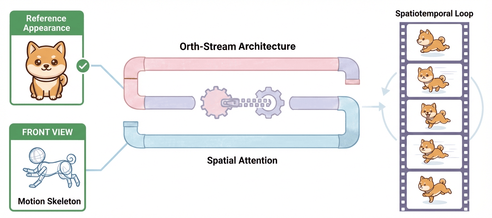

> 图 26：多条件解耦架构。图示说明了用于数字人动画的双流架构。它描绘了参考外观（静态肖像）和运动骨架（火柴人）的正交解耦，并通过空间注意力“拉链”融合，以生成时空一致的视频循环。

(i)  **外观-运动双流（Appearance-Motion Two-Stream）** 。这是当前数字人动画的主流范式 [siarohin2019first, zhao2022thin]。面对保持身份（外观）与驱动复杂动作（运动）之间的固有冲突，该范式主张摒弃单流处理，转而在架构层面采用双流解耦机制。即分别提取静态纹理特征和动态姿态特征，然后通过特定模块进行正交融合。这包括： **显式空间解耦（Explicit Spatial Decoupling）** 。针对单流网络随时间推移丢失外观特征的问题，Animate Anyone [hu2024animate] 和 MagicAnimate [seedance2025] 引入了一个独立的 ReferenceNet 作为“外观流”。该分支不参与去噪过程，而是专门从参考图像中提取高保真特征，然后通过空间注意力逐层注入到负责动作生成的主 UNet（运动流）中。形式上，这实现了对生成特征 $\boldsymbol{z}_{gen}$ 的显式分解：

$$
\boldsymbol{z}_{\textrm{gen}}=\underbrace{\mathcal{F}_{\textrm{motion}}(\boldsymbol{z}_{t},\boldsymbol{c}_{\textrm{pose}})}_{\text{运动流}}+\lambda\cdot\underbrace{\mathcal{F}_{\textrm{app}}(\boldsymbol{I}_{\textrm{ref}})}_{\text{外观流}},(25)
$$

其中 $\boldsymbol{z}_{\textrm{gen}}$ 表示合成特征图，$\boldsymbol{c}_{\textrm{pose}}$ 表示姿态控制信号，$\boldsymbol{I}_{\textrm{ref}}$ 是经外观编码器 $\mathcal{F}_{\textrm{app}}$ 处理的参考源图像，$\lambda$ 是融合系数。这种双塔设计强制分离纹理编码和运动推理，确保了大幅动态运动过程中细节的一致性 [zhu2024champ, zhang2022motiondiffuse]。 **隐式注意力解耦（Implicit Attention Disentanglement）** 。超越物理上的双网络结构，Moonshot [moonshot] 和 CCEdit [ccedit] 探索了单个网络内的“逻辑双流”。他们认为传统的交叉注意力容易混淆结构信号（姿态/形状）与内容信号（纹理/身份）。因此，这些工作提出了一种解耦注意力机制，将键/值映射拆分为独立的结构分支和外观分支。通过正交梯度反向传播，强制模型确保运动流的变化不会干扰外观流的特征分布。该机制在微观层面实现了外观与运动的零干扰，解决了因动作变化导致身份漂移的长期难题 [epstein2023diffusion]。

(ii)  **时空互补循环（Spatiotemporal Complementary Loop）** 。TATS [longvideogeneration] 和 Swap Attention [swapattention] 探索了时空维度的解耦。Swap Attention 利用 3D 窗口内的角色交换机制，构建了一个“空间引导时间，时间反馈空间”的循环。该设计在数学上强制模型沿空间轴保持纹理一致性，沿时间轴保持光流 $\mathcal{O}_{flow}$ 的连贯性，有效解决了自回归生成中常见的“无限循环”或“运动冻结”现象。

#### 3.3.3 统一理解与生成共生架构（Unified Comprehension and Generation Symbiosis Architecture）

传统的计算机视觉研究将“理解（判别式）”和“生成（生成式）”视为对立的二元任务：前者建模条件概率 $p(y|\boldsymbol{x}_{img})$，后者建模 $p(\boldsymbol{x}_{img}|y)$ [rombach2022high, ho2020denoising]。然而， **统一理解与生成共生架构（Unified Comprehension and Generation Symbiosis Architecture）**  旨在构建一个统一的概率模型 $p(\boldsymbol{x}_{img},y)$，以打破感知与模拟之间的壁垒 [meta2024chameleon, unifieddiscretediffusion, wu2024janus]。如图 [27](#figure-27) 所示，该范式的核心假设是： **一个完美的生成器应隐式地包含一个完美的判别器** 。

``

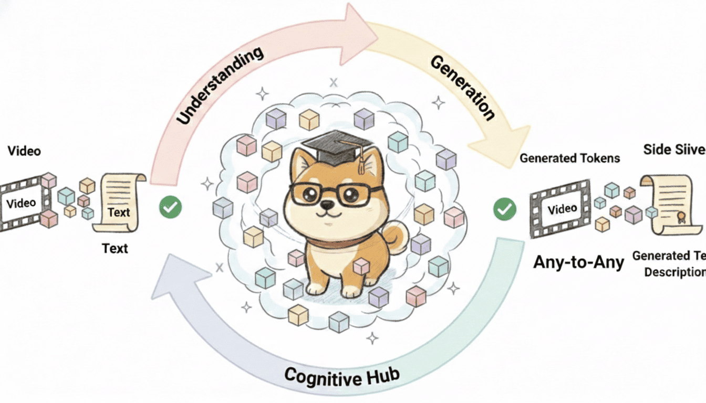

> 图 27：统一理解与生成共生架构。其核心是一个中央大语言模型（LLM），将多模态输入转换为统一的离散词元云，从而实现无缝的“任意到任意”转换（例如，视频到文本，反之亦然）。

### 目录

- [(1) 共享表征双向协同](#1-shared-representation-bidirectional-synergy)
- [(2) 预训练驱动的协同适应](#2-pre-training-driven-synergistic-adaptation)

##### (1) 共享表征双向协同

该方向旨在通过构建 **全模态同构表征（Omni-modal Isomorphic Representation）** ，将异质信号映射到同一流形空间，从而在单一模型参数集内实现“任意到任意（Any-to-Any）”的转换。具体而言，为打破感知与生成之间的鸿沟，该范式确立了 **离散词元（discrete tokens）** 作为通用交互基元的统治地位，并探索了 **几何表征（geometric representations）** 在具身场景中作为物理锚点的独特价值。由此衍生出基于符号统一与几何共生的两条主要技术路线。

(i)  **基于词元的世界建模** 。受大语言模型（Large Language Models, LLMs）成功经验的启发，离散化词元已成为统一理解与生成的“通用货币”。 **全离散自回归** 。Gaia-1 [gaia1] 和 Phenaki [phenaki] 提出了基于 C-ViViT 的视频编码方案，将驱动视频、控制信号和文本描述的编码统一为离散词元序列 $\boldsymbol{z}_{1:L}$。模型的训练目标被统一为标准的 **下一词元预测（Next-Token Prediction）** ：

$$
\mathcal{L}_{\textrm{uni}}=-\sum_{i=1}^{L}\log p_{\boldsymbol{\theta}}(\boldsymbol{z}_{i}\mid\boldsymbol{z}_{<i},\text{TaskToken}),(26)
$$

其中 $\boldsymbol{z}_{1:L}$ 表示融合视觉与文本信息的统一离散词元序列，TaskToken 作为提示标记用于切换理解与生成模式。该范式使模型能够通过简单的“任务提示（Task Prompting）”切换功能：输入视频词元预测文本词元即为“理解”，反之则为“生成”。 **统一离散扩散** 。统一离散扩散（Unified Discrete Diffusion）[unifieddiscretediffusion] 和 Show-O [xie2024show] 挑战了“自回归是唯一解决方案”的观点。它们设计了 **统一转移矩阵（Unified Transition Matrix）** ，使图像词元和文本词元能在同一扩散过程中进行双向去噪。Show-O 进一步利用 **混合注意力机制（Hybrid Attention Mechanism）** ，对文本部分施加因果掩码（Causal Mask），对视觉部分施加全掩码（Full Mask），从而在单一Transformer权重中实现了理解与生成的无缝共存。

(ii)  **领域特定几何共生** 。在 **具身智能（Embodied AI）** 领域，HERMES [hermesflow] 提出使用 **鸟瞰图（Bird's-Eye-View, BEV）特征** 作为共享中枢。它利用 **世界查询（World Queries）** 机制，将来自多视角相机的二维图像压缩为三维BEV特征。这不仅支持下游的路径规划（理解），还能通过BEV特征的解码器生成未来预测视频（生成），证明了三维几何约束是连接感知与仿真的强有力桥梁。

##### (2) 预训练驱动的协同适应

与从头训练统一多模态模型不同 [wang2024neurips, meta2024chameleon]，该范式倡导一种“站在巨人肩膀上（Shoulders of Giants）”的策略：使用冻结的 **多模态大语言模型（Multimodal Large Language Model, MLLM）** （如 GPT-4V 或 LLaVA）作为认知中枢（Brain），通过轻量级适配器（adapters）连接视觉生成解码器（Eyes/Hands）。其目标是以低成本将LLM的通用推理能力迁移到视频生成任务中 [zhang2023video, li2023videochat]。在此架构下，核心技术挑战转变为构建连接认知空间与生成空间的高带宽接口，旨在通过以LLM为中心的投影机制，将高层推理精确映射为低层生成条件。

(i)  **以LLM为中心的投影** 。核心挑战在于实现LLM语义空间与视频生成像素空间之间的“零损失”接口。 **输入-输出双向适配** 。Omni-Video [omnivideo] 和 NExT-GPT [next_gpt] 建立了“任意到任意”转换的通用桥接框架。在输入侧，使用线性投影（linear projections）或 Q-Former 将视觉信号与LLM嵌入空间对齐；在输出侧，模型通过预测特殊的 `[IMG]` 词元触发视觉头（Vision Head），将LLM的隐藏状态投影为扩散模型的条件输入 $\boldsymbol{c}_{diff}$，实现了从“文本思维”到视觉信号的显式翻译。 **编码器混合** 。MERV [merv2025] 指出，单一视觉编码器难以平衡语义理解与纹理细节。它引入可学习的交叉注意力机制，并行连接多个冻结的编码器，如 CLIP（强语义）、DINOv2（强结构）和 VideoMAE（强动作）。通过LLM注意力机制进行动态加权，模型在处理复杂指令时能自动选择最优的视觉特征源，实现了视觉感知的“众长兼收”。

#### 3.3.4 模态-时间对齐的强化学习

引入 **强化学习（Reinforcement Learning, RL）** 技术旨在解决传统 **监督微调（Supervised Fine-Tuning, SFT）** 在处理“模态语义”与“时间动态”时遇到的非凸性问题 [christiano2017deep, ouyang2022training]。SFT倾向于平均分布，常导致生成结果陷入“高语义保真度但静态”或“高动态但崩溃”的二元困境。RL范式通过构建 **多维奖励流形（Multi-dimensional Reward Manifold）**  $\mathcal{R}$ [xu2023imagereward, wu2023human]，将离散的模态对齐目标与连续的时间演化目标转化为联合优化问题，引导模型向“语义-时间”权衡的 **帕累托前沿（Pareto Frontier）** 收敛。在此目标驱动下，为精确刻画并优化这一复杂流形，技术演进正沿着基于偏好的联合对齐、基于自我精炼的迭代演化以及通用奖励模型的逻辑重构三个维度展开，旨在全面提升模型对异质模态与动态序列的协同控制能力。

- [(1) 基于偏好的联合对齐](#1-preference-based-joint-alignment)
- [(2) 基于自我精炼的迭代对齐](#2-iterative-alignment-via-self-refinement)
- [(3) 通用奖励建模](#3-universal-reward-modeling)
- [(4) 基于VLA-RL的具身动作对齐](#4-embodied-action-alignment-via-vla-rl)

##### (1) 基于偏好的联合对齐

该路径利用 **直接偏好优化（Direct Preference Optimization, DPO）**  [rafailov2023direct] 及其变体，将“语义理解”与“时间演化”之间的隐式依赖关系编码为偏好排序，迫使模型在保持文本/图像语义精度的同时，学习符合物理规律的时间动态。

(i)  **动态偏好与静态惩罚** 。VideoDPO [liu2025videodpo] 首次指出直接应用图像级DPO会导致“运动崩溃”（即模型为迎合语义分数而牺牲时间动态）。它构建了一个涵盖“语义对齐 vs. 运动幅度”权衡的偏好数据集。通过KL散度约束，从数学上推动概率密度向高动态且高保真区域移动，实现了模态指令与时间运动的联合校准。(ii)  **混合奖励蒸馏** 。T2V-Turbo [li2024t2vturbo] 提出了一种多路径信号融合策略。它并非仅依赖单一偏好模型，而是整合来自 HPSv2（衡量模态美学）和 InternVideo2（衡量时间一致性）的奖励信号 $\mathcal{R}$。通过奖励加权回归，将“模态美学”与“时间流畅度”的评估指标“蒸馏”到基于一致性模型的学生网络中，从而快速逼近语义与动态的联合最优分布。

##### (2) 基于自我精炼的迭代对齐

该方向借鉴了LLM中的自我博弈（self-play）理念，构建了一个反馈闭环，使模型在“生成-评估-修正”的循环中自主找到模态指令与时间演化的最优平衡点。

(i)  **语义-动态分层奖励** 。分层优化框架 [cheng2025vpo] 设计了分层奖励机制 $\mathcal{R}$，专门解决首帧语义与后续帧动作之间的脱节问题。它对首帧施加“图像质量”奖励（模态层面），对后续帧序列施加基于运动矢量的“连贯性”惩罚（时间层面）。这相当于在 **近端策略优化（Proximal Policy Optimization, PPO）**  [schulman2017proximal] 更新中引入了“时间梯度反向传播”，使模型在生成首帧语义时能“预见”时间轴上的动态后果。(ii)  **指令遵循的自我进化** 。Video-STaR [zohar2025videostar] 提出了一个基于拒绝采样的自我进化框架。它利用MLLM（如 GPT-4V）作为判别器，筛选出既“指令遵循准确（模态）”又“动作自然流畅（时间）”的高质量样本，用于微调生成器。该机制过滤掉了“图文匹配但时间崩溃”或“时间流畅但语义丢失”的噪声数据，显著增强了模型理解复杂时空指令的能力。

##### (3) 通用奖励建模（Universal Reward Modeling）

强化学习（Reinforcement Learning, RL）的上界取决于 **奖励模型（Reward Model, RM）**  $\mathcal{R}$ 能否精确解耦并度量模态与时间的贡献。2024–2025年的研究焦点已转向构建能够同时理解语义逻辑与物理因果的通用RM。

(i) 分解-融合评估系统（Decomposition-Fusion Evaluation System）。VPO [cheng2025vpo] 提出将奖励函数 $\mathcal{R}$ 显式分解为 **语义对齐（semantic alignment）** （Video-LLM）和 **时间平滑性（temporal smoothness）** （光流 $\mathcal{O}_{flow}$）。通过在扩散去噪轨迹上对这两个正交目标进行加权优化，模型学习在 $\mathcal{O}_{flow}$ 约束下消除帧间闪烁而不损害文本语义，从而实现模态内容与时间连续性的深度融合。 (ii) 从名词对齐到因果逻辑（From Noun Alignment to Causal Logic）。VideoScore [he2024videoscore] 挑战了传统的  **CLIP-Score**  [radford2021clip]，构建了基于  **Video-LMM**  的通用自动评估指标。它不仅捕捉静态像素级质量，还捕捉深层“ **时间因果逻辑（temporal causal logic）** ”（例如，若指令要求“杯子碎裂”，则碎裂动作必须发生在掉落之后，而非之前）。将 VideoScore 作为 RL 的直接优化目标，可使模型超越简单的基于名词的模态对齐，真正掌握时间逻辑与模态语义的因果一致性。

##### (4) 基于 VLA-RL 的具身动作对齐（Embodied Action Alignment via VLA-RL）

当对齐扩展到 **视觉-语言-动作（Vision-Language-Action, VLA）** 领域时，VLA模型面临更具挑战性的 **功能时间对齐（functional temporal alignment）** 。在此背景下，时间演化不再仅仅是视觉帧的连贯性，而是由语言指令驱动的物理干预序列 $\boldsymbol{a}_{1:T}$ [kim2024openvla]。

传统 VLA 训练主要依赖基于人类演示的 **监督微调（Supervised Fine-Tuning, SFT）** 。然而，从统计学角度看，SFT本质上是对已知数据分布的重新加权 [guan2026rl, brohan2023rt2]。其目标函数 $\min_{\theta}-\log P_{\theta}(a|s,\mathcal{D}_{demo})$ 迫使模型拟合演示数据的平均行为，导致有效搜索空间被限制在人类专家的局部最优附近。一旦环境状态发生 **分布外偏移（Out-of-Distribution, OOD）** ，模型往往会因缺乏探索能力而陷入由 **协变量偏移（covariate shift）** 引发的级联错误。

为突破这一理论瓶颈，TwinRL-VLA [xu2026twinrlvla] 和 RL-VLA^3 [guan2026rl] 等工作开创性地实现了从 **被动模仿（passive imitation）** 到 **主动探索（active exploration）** 的范式转变。其核心机制在于将优化目标从最小化模仿损失转变为最大化长期累积奖励 $J(\theta)=\mathbb{E}_{\tau\sim\pi_{\theta}}[\sum_{t}\gamma^{t}r(s_{t},a_{t})]$。 (i) 数字孪生验证机制（Digital Twin Verification Mechanism）。与隐式奖励模型不同，TwinRL 引入 **数字孪生（Digital Twin）** 作为显式物理验证器。该系统利用 **3D高斯泼溅（3D Gaussian Splatting, 3DGS）** 重建高保真场景 [lu2024manigaussian]，并在物理引擎中并行执行策略生成的动作序列 $\boldsymbol{a}_{1:T}$。该机制提供确定性的物理反馈作为稀疏奖励信号，迫使模型不仅在时间上与语言指令的语义意图对齐，而且满足物理交互的可行性约束 [ma2406dreureka, zhang2025safevla]。 (ii) 探索边界扩展（Exploration Boundary Expansion）。通过在零成本的仿真环境中进行大规模试错，RL 智能体能够到达人类演示数据未覆盖的长尾状态空间，例如极端物理接触或罕见物体姿态 [wang2023robogen]。理论上，该机制扩展了策略的有效支撑集，使 VLA 模型从有限样本上的 **插值能力（interpolation capability）** 跃升至未知环境中的 **外推能力（extrapolation capability）** 。

``

### 3.4 空间与时间一致性的融合（Integration of Spatial and Temporal Consistency）

空间与时间一致性的融合标志着生成模型从 **逐帧绘画（Frame-wise Painting）** 向 **世界构建（World Construction）** 的终极飞跃 [openai2024sora, ha2018world]。如图 [28](#figure-28) 所示，该维度的核心效用在于建立 **动态物体恒存性（Dynamic Object Permanence）** ：具体而言，在时空演化过程中，物体不仅必须保持其几何形态的刚性，还必须遵循符合物理定律的运动轨迹。即使发生遮挡或剧烈的视角变化，其内在属性也不得发生漂移 [qiu2024freenoise, liu2024video]。这种融合将时间流逝从单纯的像素变化提升为 **3D流形（3D manifold）** 的拓扑演化，构成了 **4D生成技术栈（4D generation technology stack）** 的物理基石 [singer2022make, 4dgaussiansplatting]。

``

> 图 28：时间 + 空间一致性：遮挡下的动态物体恒存性。模型结合时间与空间一致性，实现了遮挡过程中的动态物体恒存性：主体（Doge）在被遮挡时通过潜在记忆保持一致的特征（例如太阳镜、骨头），并在重新出现时属性不变，确保了物体的连续性。

在此愿景下，技术演进呈现出一条从表示构建到价值对齐的四阶段演化谱系，如图 [29](#figure-29) 所示： **隐式时空学习（Implicit Spatiotemporal Learning）** 采用解构策略，通过 **分数蒸馏（score distillation）** 将2D视频先验映射至4D场的概率分布，以统计灵活性换取生成泛化性 [UBC_ViVid, nvssolver]； **显式几何锚定（Explicit Geometric Anchoring）** 引入点云和相机轨迹作为刚性骨架，将时间轴参数化为 $SE(3)$ 变换，以几何为约束实现精确控制 [NVIDIA_GEN3C, Apple_WVD, HKUST_DaS]； **统一时空表示（Unified Spatiotemporal Representation）** 利用4D高斯基元或混合张量场建立连续数学场，原生支持形变与光照，结合稠密轨迹场的全局关联，实现了时空维度的同构表示 [4dynamic, cat4d, wang2024vggsfm]；最后， **强化学习对齐（Reinforcement Learning Alignment）** 旨在克服 SFT 的 **暴露偏差（exposure bias）** ，通过构建整合显式物理成本的复合奖励函数，迫使模型求解空间保真度与时间连贯性的 **帕累托优化（Pareto optimization）** ，实现从概率拟合到物理价值对齐的范式转变 [li2025t2vturbov2, yuan2024instructvideo]。这四个阶段共同定义了当前4D世界模型迈向物理真实感的演进路径。

``

> 图 29：空间一致性与时间一致性的演进。

- [3.4.1 隐式时空学习（Implicit Spatiotemporal Learning）](#341-implicit-spatiotemporal-learning)
- [3.4.2 显式几何锚定（Explicit Geometric Anchoring）](#342-explicit-geometric-anchoring)
- [3.4.3 统一时空表示（Unified Spatiotemporal Representation）](#343-unified-spatiotemporal-representation)
- [3.4.4 用于时空对齐的强化学习（Reinforcement Learning for Spatial-Temporal Alignment）](#344-reinforcement-learning-for-spatial-temporal-alignment)

#### 3.4.1 隐式时空学习（Implicit Spatiotemporal Learning）

超越显式几何表示（如 3DGS）， **隐式时空学习**  代表了一种另类的极简主义解构范式。特别是， **视频先验蒸馏（Video Prior Distillation）**  方向从根本上否定了基于大规模 3D 数据进行全参数微调的必要性，转而开创了一条基于后验调制的免训练路径。该范式的理论基础建立在 **分数蒸馏采样（Score Distillation Sampling, SDS）**  [poole2022dreamfusion] 和 **分数雅可比链（Score Jacobian Chaining, SJC）**  [wang2023sjc] 之上，将 4D 场景生成重新构建为两个正交概率流形之间的交集问题： **几何流形（geometric manifold）**  $\mathcal{M}_{geo}$ 和 **动态流形（dynamics manifold）**  $\mathcal{M}_{dyn}$。

- [视频先验蒸馏（Video Prior Distillation）](#video-prior-distillation)

##### 视频先验蒸馏（Video Prior Distillation）

其核心逻辑在于利用  **Tweedie 公式（Tweedie formula）**  [efron2011tweedie, kim2022refining]，将生成的去噪步骤 $\epsilon_{\theta}$ 建模为两个异质梯度场的线性组合。这迫使潜在变量 $\boldsymbol{z}_{t}$ 在逆扩散过程中向两个先验分布的重叠高密度区域收敛 [du2023reduce]：

$$
\nabla_{\boldsymbol{z}_{t}}\log p(\boldsymbol{z}_{t}\mid\boldsymbol{c})\approx\omega_{s}(t)\cdot\underbrace{\nabla_{\boldsymbol{z}_{t}}\log p_{\textrm{MVD}}(\boldsymbol{z}_{t}\mid\boldsymbol{c}_{\textrm{view}})}_{\text{几何约束（Geometric Constraint）}}+\omega_{t}(t)\cdot\underbrace{\nabla_{\boldsymbol{z}_{t}}\log p_{\textrm{VDM}}(\boldsymbol{z}_{t}\mid\boldsymbol{c}_{\textrm{motion}})}_{\text{动态引导（Dynamic Guidance）}},(27)
$$

其中，$\boldsymbol{z}_{t}$ 表示时间步 $t$ 处的潜在变量，$\omega_{s}(t)$ 和 $\omega_{t}(t)$ 是时间相关的加权系数，$p_{\textrm{MVD}}$ 和 $p_{\textrm{VDM}}$ 分别代表多视角（Multi-View）和视频扩散（Video Diffusion）先验的概率密度。该过程本质上是在高维空间中满足 $P(\boldsymbol{x})\propto P_{MVD}(\boldsymbol{x})\cdot P_{VDM}(\boldsymbol{x})$ [liu2022compositional] 的 **最大后验估计（Maximum A Posteriori, MAP）** 。然而，面对由异质先验直接叠加引发的梯度冲突和分布不匹配问题，学术界已从四个维度演化出系统性解决方案： **扫描生成与轨迹映射、方差缩减与 SDE 求解器、频率解耦与渐进调制、以及深度流形对齐** 。

 **(i) 扫描生成与轨迹映射（Scanning Generation & Trajectory Mapping）** 。为实现上述概率框架，VIVID-1-to-3 [UBC_ViVid] 开创性地将 **新视角合成（Novel View Synthesis, NVS）**  任务同构为“沿轨迹移动相机的视频生成”问题。该方法利用视频扩散模型（如 ZeroScope 或 SVD）作为动态引擎。通过将相机外参 $\boldsymbol{P}_{t}\in SE(3)$ 的变化显式地映射到视频时间戳 $t$，迫使 VDM 将几何视差解释为光流运动。为抑制单帧生成中的几何畸变，VIVID-1-to-3 引入了 **对极注意力偏置（Epipolar Attention Bias）** ，利用多视角扩散模型（如 Zero-1-to-3 [liu2023zero1to3]）在关键帧处锚定几何结构。这种双扩散协同策略有效利用了 VDM 强大的帧间平滑先验，抑制了独立视图合成中常见的闪烁伪影 [wang2024dreamvideo, he2024videocrafter]。

 **(ii) 方差缩减与 SDE 求解器（Variance Reduction & SDE Solver）** 。尽管分数组合提供了一个统一框架，但在高维潜在空间中直接叠加异质先验常会导致严重的梯度冲突。NVS-Solver [nvssolver] 从 **随机微分方程（Stochastic Differential Equations, SDEs）**  的数值求解角度出发，指出简单的分数相加违反了扩散过程的伊藤积分条件，导致采样轨迹的漂移项发生偏离。为解决此问题，NVS-Solver 引入了基于泰勒展开的高阶近似和方差缩减采样策略。通过在 SDE 求解器内显式校正由异质梯度引起的方差膨胀，该方法在数学上保证了生成轨迹能够平滑地穿越两个流形之间的边界。实验结果表明，采样过程中的随机抖动减少了约 40%，显著提升了生成结果的清晰度和时空一致性 [lu2022dpm, zhao2023unipc, song2021scorebased]。

 **(iii) 频率解耦与渐进调制（Frequency Decoupling & Progressive Modulation）** 。对生成过程的动力学分析揭示，扩散模型遵循“先全局结构（低频），后纹理细节（高频）”的 **谱偏置（spectral bias）**  [zhuang2024hifa, yang2024freeu]。基于此观察，VividZoo [vividzoo] 提出了 **时变调制（time-variant modulation）** 。该机制用动态退火调度取代了固定的权重分配：在早期去噪阶段（高噪声 $t$），为 MVD 分配更高的梯度权重 $\omega_{s}>\omega_{t}$，以利用其强大的几何先验建立物体的主要拓扑结构，防止变形。在后期去噪阶段（低噪声 $t$），则反转权重（$\omega_{t}>\omega_{s}$），利用 VDM 的时间平滑特性消除高频闪烁。这种与生成谱演化规律相契合的设计，有效解决了由先验竞争引起的结构畸变和纹理模糊问题 [Wang2023_Prolific, li2024sweetdreamer]。

 **(iv) 深度流形对齐（Deep Manifold Alignment）** 。前述大多数方法仍停留在输出侧（像素/噪声空间）的分数混合层面，忽略了模型内部表示的语义鸿沟。Diffusion^2 [Fudan_Diffusion2] 提出了一种深度融合架构来解决 VDM 与 MVD 潜在空间之间的分布不匹配问题。该方法并非简单地混合噪声，而是在两个扩散模型的 U-Net 之间插入可学习的 3D-2D 交叉注意力适配器。通过在特征层面最小化 **切片 Wasserstein 距离（Sliced Wasserstein Distance）** ，模型迫使 $\boldsymbol{z}_{MVD}$ 和 $\boldsymbol{z}_{VDM}$ 在中间层共享相同的表示流形。这种设计使模型能够感知对方的特征分布，从根本上消除了由域间隙引起的重影现象，实现了真正的特征级协同 [zhang2024controlvideo, hu2024animate, mou2024t2i]。

#### 3.4.2 显式几何锚定（Explicit Geometric Anchoring）

如果说隐式学习是对时空统计规律的软拟合，那么 **显式几何锚定** 则代表了一种将视频生成从概率预测重构为 3D 渲染的激进尝试。该范式拒绝将空间和时间视为深度网络中纠缠的潜在变量；相反，通过引入显式的 3D 点云 [NVIDIA_GEN3C, realcami2v] 和相机轨迹 [cameractrl, postcam]，它将时间参数化为连续的 $SE(3)$ 位姿序列，并将空间固定为静态的几何结构。其核心理念是：时空一致性不应通过网络对历史帧的记忆来实现，而应自然地源于底层几何代理的刚性 [motionctrl]。

- [(1) 点云条件化](#1-point-cloud-conditioning)
- [(2) 几何嵌入注入](#2-geometric-embedding-injection)
- [(3) 轨迹参数化控制](#3-trajectory-parametric-control)

##### (1) 点云条件化（Point Cloud Conditioning）

该方向将视频生成建模为带有几何代理的神经渲染问题。其数学本质在于构建一个静态世界模型 $\mathcal{W}$，并通过相机参数 $\boldsymbol{P}_{t}$ 将其投影到视觉特征流中。这个过程并非简单的图像处理，而是严格遵循针孔相机模型的刚性变换：

$$
\boldsymbol{c}_{t}=\Pi(\mathcal{W},\boldsymbol{P}_{t}),(28)
$$

其中，$\boldsymbol{c}_{t}$ 表示时间 $t$ 处的投影视觉特征，$\Pi$ 代表将静态世界 $\mathcal{W}$ 在相机位姿 $\boldsymbol{P}_{t}$ 下映射到图像平面的透视投影函数。为了在概率扩散模型中实现这种物理刚性，当前研究探索了两个维度： **表示构建（representation construction）**  和 **推理控制（inference control）** 。

 **基础设施与表示（Infrastructure & Representation）** 。为克服纯生成模型的记忆瓶颈，Gen-3C [NVIDIA_GEN3C] 和 RealCamI2V [realcami2v] 基于 **运动恢复结构（Structure from Motion, SfM）**  建立了度量尺度空间。Gen-3C 利用单目深度估计的反投影构建 3D 缓存 $\mathcal{C}$，将时间维度的演化转化为静态点云中的相机漫游。RealCamI2V 进一步引入了尺度对齐损失，以强制生成的局部几何与全局 SfM 点云在欧几里得空间中保持一致，从而解决了长序列生成（分钟级）中常见的尺度漂移问题 [schonberger2016colmap, teed2021droidslam]。

 **内生一致性与推理驱动（系统 2 生成）（Endogenous Consistency & Inference-Driven (System 2 Generation)）** 。与端到端模式的单次推理不同，这一流派强调推理阶段的显式计算。ViewCrafter [viewcrafter] 采用密集立体匹配来重建高精度点云，并将渲染结果 $\hat{\boldsymbol{x}}_{render}$ 作为视频 LDM 的硬视觉锚点。这种设计将一致性的来源从网络权重的黑盒统计转移到输入侧的白盒几何。EPIC [epic] 提出了一种动态掩码策略：通过计算点云投影的遮挡图 $\boldsymbol{m}_{occ}$，仅对可见区域施加轻量级的 ControlNet 约束，同时允许在不可见区域进行生成性自由发挥。这种显式的 $XYZ\to UV$ 几何投影有效避免了由深度误差引起的纹理错位 [Yu2020]。

##### (2) 几何嵌入注入（Geometric Embedding Injection）

好的，作为专业的科技论文翻译专家，我将严格遵循您的要求，对提供的文本进行翻译。

以下是翻译结果：

---

虽然  **点云条件化（point cloud conditioning）**  是显式渲染，但 **几何嵌入注入（geometric embedding injection）**  则是其在 Transformer 潜在空间中的隐式映射。如图 [30](#figure-30) 所示，该方法旨在将 3D 空间坐标信息编码为与 **视觉词元（visual tokens）**  同构的 **几何词元（geometric tokens）** [omniview]，这些词元被直接注入 **自注意力机制（self-attention mechanism）**  中，以建立一个跨帧共享的世界坐标系 [motionctrl]。为了实现这种深度的 3D-2D 对齐，社区重点关注了坐标表示和动态关联方面的架构设计：

``

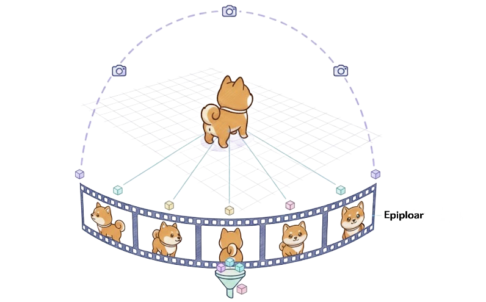

> 图 30：几何嵌入注入（Geometric Embedding Injection）。其特征是在一个带有轨迹的透视网格上有一只“神烦狗”（Doge），将物理光线转换为几何词元，以强制跨帧的对极约束。

 **世界坐标的词元化（Tokenization of World Coordinates）。**  VD3D [Toronto_VD3D] 和 ViewDiff [viewdiff] 引入了  **Plücker 坐标编码（Plücker coordinate encoding）** ，将每条相机光线 $\boldsymbol{r}=(\boldsymbol{o},\boldsymbol{d})$ 映射到一个高维嵌入向量 $\boldsymbol{e}_{geo}$。

通过将这些向量注入到 $\text{Attention}(\boldsymbol{Q},\boldsymbol{K}_{img}+\boldsymbol{K}_{geo},\boldsymbol{V}_{img}+\boldsymbol{V}_{geo})$ 中，模型不再简单地预测像素的统计分布，而是学习像素与 3D 空间位置 ($\boldsymbol{p}$) 之间的对应关系。这种机制本质上是向注意力矩阵中注入了一种 **对极先验（epipolar inductive bias）** ，使得在帧 $t$ 的查询（query）能够精确地关注到对应相同物理坐标的帧 $t-k$ 的键（key），从而实现了“时间自然地从空间中涌现”这一概念 [mildenhall2020nerf, suhail2022generalizable]。

 **时空接口与自关联机制（Spatiotemporal Interface & Self-Association Mechanism）。**  为了将静态锚定转化为动态一致性，PostCam [postcam] 和 CameraCtrl [cameractrl] 设计了 **轨迹参数化模块（trajectory parameterization modules）** ，将相机姿态序列 ($\boldsymbol{P}_{1:T}$) 注入到时间 Transformer 块中。OmniView [omniview] 和 MotionCtrl [motionctrl] 进一步提出了 **几何相似性门控（geometric similarity gating）** ，利用隐式 3D 对应图来构建跨帧点之间的自关联。在此机制下，物体的运动不再是网络产生的幻觉纹理流，而是由几何词元的空间推理引导的物理运动，标志着从数据拟合到物理约束的飞跃 [ni2023conditional, zhang2024controlvideo]。

##### (3) 轨迹参数化控制（Trajectory Parametric Control）

对于动态场景， **轨迹参数化控制（trajectory parametric control）**  方向将 3D 运动显式地建模为一个可微函数 $\boldsymbol{T}(t)$，实现了物体运动规律的物理级解耦 [tc4d]。研究工作主要集中在运动表示机制和优化约束上：

 **运动提升与身份标识（Motion Elevation & Identity）。**  该范式将离散的像素位移提升为连续的 **欧拉-拉格朗日流（Eulerian-Lagrangian flow）** 。TC4D [tc4d] 采用 **全局-局部分解策略（global-local decomposition strategy）** ，将场景运动分解为刚性相机运动 $\boldsymbol{P}_{t}$ 和局部物体变形场 $\Psi(\boldsymbol{p},t)$ 的叠加。DiffusionShader [HKUST_DaS] 为世界坐标系中的每个像素分配一个 3D 身份标识（ID），将复杂的动态预测简化为沿时间轴的 ID 匹配问题，从根本上消除了纹理闪烁。

 **显式物理约束（Explicit Physical Constraints）。**  3DTrajMaster [3dtrajmaster] 将轨迹视为受物理定律支配的实体，在损失函数中显式地添加了加速度正则化项：

$$
\mathcal{L}_{smooth}=\sum_{t}||\boldsymbol{p}_{t+1}-2\boldsymbol{p}_{t}+\boldsymbol{p}_{t-1}||^{2},(29)
$$

其中 $\boldsymbol{p}_{t}$ 表示时间步 $t$ 的位置向量，该表达式最小化了二阶差分（加速度的近似值），有效抑制了高频抖动以确保运动平滑。结合 **时间步退火策略（timestep annealing strategy）** ，模型在去噪早期阶段拟合低频轨迹骨架，在后期阶段填充高频形变，有效防止了误差累积。SV3D [Stability_SV3D] 进一步采用了“先生成一致观测，再优化统一表示”的流程，通过在推理过程中动态调整轨迹控制强度，使得生成模型在释放创造力的同时保持物理合理性 [Stability_SV3D, zeng2023makeit3d]。

#### 3.4.3 统一时空表示（Unified Spatiotemporal Representation）

 **统一时空表示（Unified Spatiotemporal Representation）**  范式通过构建一个 4D 物理表示空间 [cao2023hexplane, 4dgaussiansplatting, liu2025trace]，将视频生成从像素插值提升到时空流形重建。

- [(1) 混合体积表示：低秩张量分解与混合场](#1-hybrid-volumetric-representation-low-rank-tensor-decomposition-hybrid-fields)
- [(2) 显式结构化表示](#2-explicit-structured-representation)
- [(3) 以轨迹为中心的基础模型](#3-trajectory-centric-foundation-models)

##### (1) 混合体积表示：低秩张量分解与混合场（Hybrid Volumetric Representation: Low-Rank Tensor Decomposition & Hybrid Fields）

 **混合体积表示（Hybrid Volumetric Representation）**  旨在解决高维时空建模与高频动态捕捉之间的固有矛盾，应对维数灾难。该范式摒弃了昂贵的密集 4D 体素网格，转而采用 **紧凑分解策略（compact factorization strategies）** ，将复杂的 4D 场解耦为低维子空间的张量积，同时嵌入显式的物理运动约束。这种方法使得模型能够在保持神经表示连续性的同时，实现基于网格方法的高效查询能力。为此，当前的研究在三个递进层面上推进了架构创新：混合体积表示 [yu2022plenoxels]、时空分解 [cao2023hexplane] 以及动态耦合与轨迹集成 [dynibar]。

(i) 混合体积表示。通过显式结构编码和隐式神经解码的协同设计，研究人员寻求网格查询效率与神经网络紧凑性之间的 **帕累托最优（Pareto optimality）**  [yu2022plenoxels, tang2022compressible]。为了解决纯隐式 NeRF 在捕捉高频动态方面的局限性 [mildenhall2020nerf]，这一方向引入了 **低秩张量分解理论（low-rank tensor decomposition theory）** ，将 4D 时空场分解为多个低维子空间的张量积，如公式 [10](#S2.E10) 所示 [cao2023hexplane]。

(ii)  **时空分解（Spatiotemporal Factorization）** 。K-Planes [Fridovich2023KPlanes] 和 HexPlane [cao2023hexplane] 提出了基于六个平面的分解策略，将4D空间中的特征查询转化为六个2D平面上的特征插值和 Hadamard 乘积。这种设计不仅将表示的空间复杂度从 $O(N^{4})$ 降低到 $O(N^{2})$，更重要的是引入了一个关键的 **归纳偏置（inductive bias）** ：空间平面（如 $xy$-平面）强制了视觉外观的3D一致性，而时空平面（如 $xt$-平面）则显式约束了像素随时间变化的连续演化轨迹。在此基础上，Tensor4D [shao2024tensor4d] 引入了 **分层张量分解（hierarchical tensor decomposition）** ，利用多尺度特征网格来捕获从粗略动作到精细纹理的全谱信息，从而解决了快速运动场景中的伪影问题 [fastdynamicradiancefields]。

(iii)  **动力学耦合与轨迹集成（Dynamics Coupling & Trajectory Integration）** 。由于静态分解难以处理复杂的拓扑变化，必须引入动态约束。DynIBaR [dynibar] 创新性地通过基于轨迹的渲染将时间维度集成到体渲染方程中。该方法并非沿光线在固定点采样，而是根据速度场 $\boldsymbol{v}_{t}$ 将采样点扭曲到其在相邻帧中的对应位置：

$$
\boldsymbol{C}(\boldsymbol{r})=\sum_{i}T_{i}\alpha_{i}\boldsymbol{c}\left(\boldsymbol{p}_{i}+\int_{t}^{t^{\prime}}\boldsymbol{v}_{\tau}(\boldsymbol{p}_{i})d\tau,\boldsymbol{d}\right),(30)
$$

其中 $T_{i}$ 是累积透射率，$\alpha_{i}$ 表示第 $i$ 个采样点处的不透明度，$\boldsymbol{v}_{\tau}$ 表示瞬时速度场。这种设计将时间一致性内化为渲染方程中的一个积分项，实现了跨帧信息在物理层面的聚合。SV4D [Ren2024_SV4D] 采用3D骨架锁定空间结构，并在潜在空间内构建多帧多视图注意力。通过稀疏的3D关键点引导稠密的4D生成，有效缓解了长序列生成过程中的几何崩溃问题 [4dfy, wu2024sc4d]。

##### (2) 显式结构化表示（Explicit Structured Representation）

显式结构化表示主要基于 **3D高斯泼溅（3D Gaussian Splatting）** ，标志着从欧拉视角（Eulerian perspective）到拉格朗日视角（Lagrangian perspective）的范式转变 [zwicker2001surface, lassner2021pulsar]。其核心逻辑是将场景建模为一组具有特定属性（位置 $\boldsymbol{p}/\mu$、协方差 $\Sigma$、球谐系数 $SH$ 和不透明度 $\alpha$）的离散基元，从而通过可微分光栅化实现实时渲染 [dreamgaussian4d]。当前研究在三个维度上建立了技术框架： **规范-变形分解（canonical-deformation decomposition）** 、 **多源先验与物理引导（multi-source priors & physical guidance）**  以及 **拓扑约束与几何驱动（topological constraints & geometric driving）** 。

(i)  **规范-变形分解（Canonical-Deformation Decomposition）** 。为处理非刚性运动，主流方法采用规范空间和变形场建模。4D高斯泼溅（4D Gaussian Splatting）[4dgaussiansplatting] 和可变形3DGS（Deformable 3DGS）[Yang2024_Deformable3DGS] 定义了一个静态的规范空间来存储几何拓扑，并利用一个以时间 $t$ 为条件的、基于 **多层感知机（MLP）** 的变形场 $\Delta(\boldsymbol{p},t)$ 来预测每个高斯球在特定时刻的位移和旋转：

$$
\boldsymbol{\mu}_{t}=\boldsymbol{\mu}_{0}+\Delta_{\boldsymbol{\mu}}(\boldsymbol{\mu}_{0},t),\quad\boldsymbol{\Sigma}_{t}=f\left(\boldsymbol{\Sigma}_{0},\Delta_{r}(\boldsymbol{\mu}_{0},t)\right),(31)
$$

其中 $\boldsymbol{\mu}_{0}$ 和 $\boldsymbol{\Sigma}_{0}$ 分别表示规范空间中第 $k$ 个高斯 $\mathcal{G}_{k}$ 的均值和协方差，$\Delta_{\boldsymbol{\mu}}$ 是预测的位置偏移量，$\Delta_{r}$ 表示旋转更新。H3D-DGS [h3ddgs] 进一步将变形场分解为可观测的刚性部分和不可观测的补全部分，引入硬编码先验以限制自由度，防止过拟合高频噪声。DreamGaussian4D [dreamgaussian4d] 结合 HexPlane 分解来参数化高斯变形，显著降低了4D优化的显存占用 [luiten2024dynamic]。

(ii)  **多源先验与物理引导（Multi-source Priors & Physical Guidance）** 。为了从2D视频中构想出合理的4D结构，此范式依赖于强大的生成先验。STAG4D [stag4d] 提出在 **得分蒸馏采样（Score Distillation Sampling, SDS）** 优化过程中注入首帧时间锚点，强制后续帧的生成严格遵循首帧建立的几何标准。Ling 等人 (2024) [aligngaussians] 采用 **组合式得分蒸馏（compositional score distillation）** ，同时利用文本到图像、文本到视频和3D感知扩散模型提供多源梯度监督，从而实现跨模态的物理约束。Diffusion4D [diffusion4d] 引入了一种革命性的显式4D扩散模型，直接在体素化的高斯参数空间中进行去噪，使得结果可以反向投影到显式4D场中，从根本上保证了时空逻辑的内生一致性 [huang2024scgs]。

(iii)  **拓扑约束与几何驱动（Topological Constraints & Geometric Driving）** 。对于复杂的动作控制，简单的基于MLP的变形往往难以维持人体等铰接物体的拓扑结构。CT4D [ct4d] 引入了一种 **高斯聚类机制（Gaussian clustering mechanism）** ，自动发现场景中的刚性部件并分配伪骨架权重，从而通过视频扩散信号实现类似骨架驱动的运动。Cat4D [cat4d] 提出了 **流形蒸馏（manifold distillation）** ，将预训练视频生成模型（如 SVD）的特征流形映射到4D高斯空间。这确保了生成过程不仅仅是盲目的参数拟合，而是隐式地受到体积守恒、运动连续性等物理定律的约束，标志着从统计相关性到物理可解释性的飞跃。

##### (3) 以轨迹为中心的基础模型（Trajectory-Centric Foundation Models）

与第 [§3.4.2](#S3.SS4.SSS2.Px3) 节讨论的轨迹参数化控制（其中轨迹作为参数化约束）不同，本节探讨的范式（图 [31](#figure-31)）将轨迹重新定义为连接2D视觉流与4D物理空间的核心数据表示。随着混合体素和显式高斯架构的成熟，学术焦点正从逐场景优化转向可泛化的4D推理。为克服原生4D数据稀缺的瓶颈，近期工作 [liu2025trace, wang2023omnimotion, xiao2024spatialtracker, leroy2024mast3r, portenier2024cotracker3] 提出使用 **稠密轨迹场（dense trajectory fields）** 作为通用的中间表示，旨在通过自动化的视频到轨迹转换，构建具有物理一致性的统一世界模型。研究遵循两个主要方向：轨迹提升策略和端到端泛化。

``

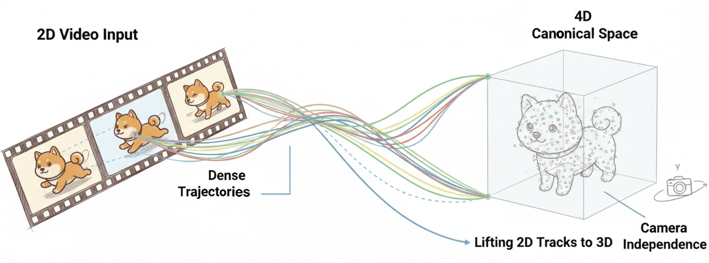

> 图 31：以轨迹为中心的基础模型（Trajectory-Centric Foundation Models）。该图展示了将2D视频输入转换为稠密轨迹场（含遮挡处理），并随后将其提升到4D规范空间进行体素重建的过程。

(i)  **轨迹场：连接2D像素与4D物理的通用桥梁（Trajectory Field: A Universal Bridge Between 2D Pixels and 4D Physics）** 。传统的4D建模通常依赖于昂贵的多视角捕获或稀疏的离线 COLMAP 计算，难以利用海量的互联网视频。新一代方法主张将视频视为一组随时间演化的连续3D轨迹流 $\tau$ 的集合，而非 $T$ 个独立的帧图像。将2D轨迹提升至3D（Lifting 2D Tracks to 3D）。诸如 Trace Anything [liu2025trace] 和 SpatialTracker [xiao2024spatialtracker] 的工作重新定义了4D重建的输入信号。通过利用 CoTracker3 [portenier2024cotracker3] 或 TAPIR 等基础模型提取的长程、抗遮挡的2D点轨迹，并结合单目深度估计与解耦的刚性/非刚性优化，它们将2D像素流 $\boldsymbol{u}(t)$ 显式地提升为3D空间轨迹 $\boldsymbol{T}(t)$ / $\boldsymbol{X}(t)$。这种方法的革命性在于，它允许将任意单目视频转换为带有物理属性的4D伪真值，为训练通用世界模型提供无限的数据燃料。体运动表示（Volumetric Motion Representation）。OmniMotion [wang2023omnimotion] 进一步提出了一种准3D全局运动表示。与仅捕获相邻帧间关系的传统光流 $\mathcal{O}_{flow}$ 不同，OmniMotion 构建了一个连续的双射映射，将视频中的所有像素投影到一个规范的3D空间中。这意味着模型可以跟踪可见点，并为遮挡物体预测物理上合理的全生命周期轨迹，打破了传统4D建模中可见性断裂的限制。

(ii)  **用于可泛化4D的基础模型（Foundation Models for Generalizable 4D）** 。在统一数据格式的基础上，具备零样本泛化能力的4D基础模型正在涌现，消除了对每个视频进行测试时优化的需要。端到端动态几何匹配（End-to-End Dynamic Geometric Matching）。MASt3R [leroy2024mast3r] 将视频生成和3D重建统一在单个 Transformer 架构中。通过学习图像对之间的稠密对应关系和3D几何变换，它可以直接输出动态场景的3D点云和相机运动，而无需相机参数。这标志着从基于优化的流水线到基于学习的端到端模型的转变。全局一致结构恢复（Globally Consistent Structure Recovery）。为解决长视频中的累积误差，VGGSfM [wang2024vggsfm] 提出了一种完全可微的全局 **运动恢复结构（Structure from Motion, SfM）** 框架。通过使用提取的稠密轨迹作为约束，它在深度学习框架内以端到端的方式求解相机姿态 $\boldsymbol{P}_{t}$ 和场景几何。这确保了世界模型在处理长达数小时的视频时仍能保持3D结构一致性，克服了传统方法在动态物体干扰下的失效模式。

#### 3.4.4 用于时空对齐的强化学习（Reinforcement Learning for Spatial-Temporal Alignment）

传统的 **监督微调（Supervised Fine-Tuning）** 受限于教师强制模式 [Villegas2017]，通常难以纠正长序列生成中的曝光偏差 [bengio2015scheduled]。这经常导致推理后期出现空间结构崩溃或时间因果关系断裂 [villegas2017learning]。为应对这一挑战，近期前沿工作引入了 **强化学习（Reinforcement Learning, RL）** 作为时空融合的粘合剂 [black2023training]。与仅关注文本响应质量的大语言模型（LLMs）不同，RL在视频生成中的核心在于构建一个复合奖励函数 $\mathcal{R}$。这迫使模型在潜在空间中解决图像保真度（空间）和运动连贯性（时间）之间的帕累托优化问题 [yuan2024instructvideo]。当前研究主要探索两个维度：强调宏观统计平衡的 **全局混合奖励反馈（Global Mixed-Reward Feedback）** ，以及关注微观物理修复的 **显式物理代价（Explicit Physical Costs）** 。

- [ **全局混合奖励反馈与动态对齐（Global Mixed-Reward Feedback & Dynamic Alignment）** 。](#global-mixed-reward-feedback-dynamic-alignment)
- [ **层次化结构解耦与显式代价（Hierarchical Structural Decoupling & Explicit Costs）** 。](#hierarchical-structural-decoupling-explicit-costs)

##### 全局混合奖励反馈与动态对齐（Global Mixed-Reward Feedback & Dynamic Alignment）

针对 **监督式微调（Supervised Fine-Tuning, SFT）** 难以平衡质量与运动性的缺陷，该范式通过引入 **解耦奖励模型（decoupled reward models）** 在宏观层面建立了时空价值平衡。(i)  **多维价值蒸馏（Multi-dimensional Value Distillation）** 。T2V-Turbo-v2 [li2025t2vturbov2] 设计了一种 **时空解耦混合奖励机制（spatially and temporally decoupled mixed reward mechanism）** 。它利用 HPSv2 对单帧美学进行评分，并利用 InternVideo2 对动态连贯性进行评分，通过 **一致性蒸馏（consistency distillation）** 统一这两个相互约束的目标。这有效缓解了传统 **均方误差（Mean Squared Error, MSE）** 损失导致的运动平均化现象。(ii)  **深度奖励调优（Deep Reward Tuning）** 。DR-Tune [zhou2023drtune] 进一步指出，简单的奖励加权会导致过大的梯度方差。它提出了一种 **深度奖励调优（Deep Reward Tuning）** 策略，该策略沿扩散模型的去噪路径动态调整时空梯度的权重。这确保了模型在增强时间一致性的同时，不会牺牲单帧的空间保真度。

##### 层次化结构解耦与显式代价（Hierarchical Structural Decoupling & Explicit Costs）

与全局反馈的黑盒优化不同，该学派主张将时空一致性分解为可微分的显式物理代价，用于像素级和结构级的微观修复。(i)  **3D 层次化对齐（3D Hierarchical Alignment）** 。VistaDPO [huang2025vistadpo] 提出了一种细粒度的 **层次化对齐框架（hierarchical alignment framework）** 。它将优化目标分解为三个正交维度： **实例级（instance-level）** （语义保真度）、 **时间级（temporal-level）** （运动流形 $\mathcal{M}_{dyn}$）和 **感知级（perceptual-level）** （空间结构）。这种设计使得模型能够在时间轴上精确修复跳帧问题，同时不损害空间纹理的完整性。(ii)  **光流一致性约束（Flow Consistency Constraint）** 。InstructVideo [yuan2024instructvideo] 提供了具体的数学实现手段。它摒弃了通用偏好模型，转而采用 **奖励加权微调（reward-weighted fine-tuning）** ，显式引入 **闪烁惩罚（flickering penalty）** 和 **光流一致性（optical flow consistency）**  $\mathcal{O}_{flow}$ 作为代价函数。该方法将物理定律转化为直接的梯度信号，迫使像素流在时间演化过程中保持平滑，从而解决了长视频生成中常见的高频抖动问题。

``

### 3.5 世界模型的初步涌现（Preliminary Emergence of World Models）

随着统一多模态模型架构的成熟和多模态预训练技术的突破， **世界模型（World Model）** 已超越了单一维度独立建模的阶段，开始逐渐显现出 **模态-空间-时间一致性协同涌现的三位一体（Modal-Spatial-Temporal Trinity of Consistency Synergistic Emergence）** 的雏形，如图 [32](#figure-32) 所示。此阶段的核心特征是，模型不再是单纯的像素生成器，而是演变为一个具备演绎能力的内部模拟器。具体而言，模态一致性提供了多源交互接口，空间一致性构建了静态几何骨架，时间一致性则注入了因果演化引擎。这种协同机制已通过基准测试得到定量验证，并展现出对物理世界的深层理解。

``

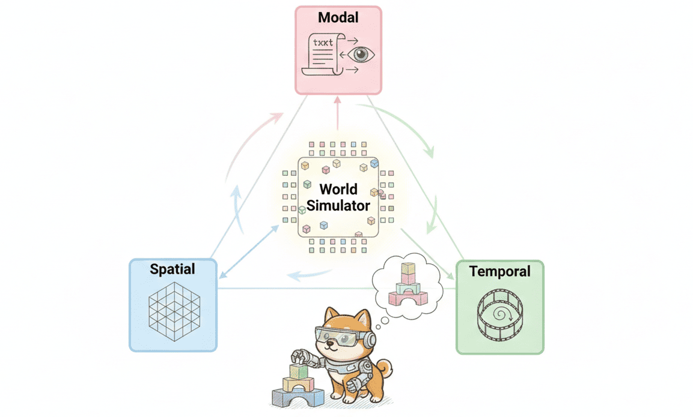

> 图 32：一致性三位一体（The Trinity of Consistency）。它描绘了一个机器人 Doge 在反事实推理（可视化为预测气泡）的指导下执行具身任务（搭积木）。

- [3.5.1 从基准建立到多样化演进（From Benchmark Establishment to Diverse Evolution）](#351-from-benchmark-establishment-to-diverse-evolution)
- [3.5.2 三种一致性的协同循环（Combat Loop of Three Consistencies）](#352-combat-loop-of-three-consistencies)

#### 3.5.1 从基准建立到多样化演进（From Benchmark Establishment to Diverse Evolution）

在这一演进过程中，Sora [sun2024sora] 和 Open-Sora [opensora] 分别代表了闭源商业级和开源学术界的双重里程碑。它们共同确立了 **时空块化（Spacetime Patchification）** 与  **DiT 架构（DiT Architecture）** 的主流范式，而其他模型则作为丰富技术图景的横向验证。

- [Sora：世界模拟器的范式建立（Sora: Paradigm Establishment of World Simulator）。](#sora-paradigm-establishment-of-world-simulator)
- [Open-Sora：技术民主化与架构验证（Open-Sora: Technology Democratization &amp; Architecture Verification）。](#open-sora-technology-democratization-architecture-verification)
- [从被动观察到主动交互的转变（Transition from Passive Observation to Active Interaction）。](#transition-from-passive-observation-to-active-interaction)
- [多样化技术路径的协同印证（Synergistic Corroboration of Diverse Technical Paths）。](#synergistic-corroboration-of-diverse-technical-paths)

##### Sora：世界模拟器的范式建立（Sora: Paradigm Establishment of World Simulator）

Sora [sun2024sora] 无疑是三位一体协同的杰作。它不依赖显式的 3D 归纳偏置，而是利用大规模时空块训练，令人信服地验证了视频生成中 **缩放定律（Scaling Law）** 所触发的能力涌现 [kaplan2020scaling, wei2022emergent, peebles2023scalable]。通过在潜在空间中将视频压缩为时空块，模型以类似于语言词元的方式处理高维视觉数据，实现了时空与模态间的深度互操作性 [williams2023neurips]。这种机制不仅打破了长视频生成中的模态一致性瓶颈，而且在海量数据的驱动下，促进了隐式物理世界理解的自发涌现。即使在缺乏显式几何约束的情况下，Sora 也能在复杂相机运动过程中保持空间结构的视角恒常性，并展现出符合时间因果律的物理交互（如碰撞、遮挡）。这表明生成模型已开始具备世界模拟器的演绎特性 [lecun2022path, ha2018world]。

##### Open-Sora：技术民主化与架构验证（Open-Sora: Technology Democratization & Architecture Verification）

作为开源社区的先锋， **Open-Sora**  [opensora] 成功复现并验证了 **视频扩散Transformer（Video DiT）** 的核心逻辑，为“三元一致性”的学术探索提供了一个透明且高效的试验平台。其核心创新在于采用了 **时空扩散Transformer（Spatial-Temporal Diffusion Transformer）**  [ma2024latte] 架构，该架构利用巧妙设计的空间与时间注意力交替计算机制。这种解耦与协同设计显著降低了计算复杂度，同时有效平衡了单帧内的空间保真度与跨帧的时间连贯性。辅以级联训练策略和高效的 **视频变分自编码器（Video VAE）**  编码器/解码器 [rombach2022high, gu2023reuse]，Open-Sora 进一步证实了分钟级长序列生成的稳定性。这表明，三元的高效协同并非仅仅依赖于算力堆叠；相反，合理的架构设计对于实现与物理世界的一致性同样至关重要。

##### 从被动观察到主动交互的转变。

如果说 Sora 确立了基于大规模观察的物理常识涌现，那么以  **Genie 1/2/3**  [bruce2024genie]、 **LingBot-World**  [lingbotworld2026] 和  **GameNGen**  [valevski2024gamengen] 为代表的交互式世界模型，则标志着三元一致性从被动的电影放映到主动交互模拟的根本性飞跃。这些模型的核心突破在于将 **动作算子 $\boldsymbol{a}_{t}$**  显式地引入时空生成逻辑，将概率建模从 $P(\boldsymbol{x}_{future}\mid\boldsymbol{x}_{past})$ 转变为受控的状态转移 $P(\boldsymbol{s}_{t+1}\mid\boldsymbol{s}_{t},\boldsymbol{a}_{t})$ [ha2018world]。具体而言，Genie-3 [bruce2024genie] 利用无监督的 **潜在动作模型（Latent Action Model）** ，从海量未标记视频中解耦出离散的动作词元，并将其作为时空Transformer的条件输入，以确保在特定指令下的时间因果性（例如，按下特定按键后角色跳跃的因果反馈）。LingBot-World [lingbotworld2026] 则进一步构建了一个统一的 **认知-动作流形（Cognition-Action Manifold）** ，将高层语义指令与碰撞检测、力反馈等底层物理属性耦合在同一潜在空间内。该架构不仅保持了宏观的模态一致性，还通过引入时空一致性正则化，在以60 FPS的生成速率下，保留了复杂边界条件下的空间保真度。这些可编程世界的出现证明，三元协同可以演化为一个可微分、可预测、可交互的 **世界应用程序接口（World API）** ，为具身智能体提供了一个近乎真实的心理沙盘模拟环境 [bruce2024genie, menapace2024playable]。

##### 多元技术路径的协同印证。

除了上述模型，其他系统也从不同维度丰富了世界模型的技术图景，共同印证了三元融合的必然趋势：

(i)  **3D因果与显式建模** 。 **CogVideoX**  [cogvideox] 和  **Wan2.1**  [wan2025] 都强调了 **3D变分自编码器（3D VAE）** 的作用。CogVideoX 通过  **3D旋转位置编码（3D RoPE）**  增强了帧间依赖性，而 Wan2.1 的 **因果3D变分自编码器（Causal 3D VAE）**  在潜在空间内强制了时间维度的单向流动，显著提升了动态演化的物理合理性。

(ii)  **高保真度与细粒度控制** 。 **Gen-3**  [runway2024gen3alpha] 和  **HailuoAI**  [hailuoai2024hailuo] 专注于工业级的一致性表现。Gen-3 展示了电影级的照明维持和复杂的物理交互模拟，而 HailuoAI 则利用专用引擎优化，解决了复杂动态场景中的结构崩溃问题。

(iii)  **架构探索与多模态对齐** 。 **HunyuanVideo**  [hunyuan2024]、 **VideoCrafter**  [he2024videocrafter] 和  **LTX-Video**  [ltx2025] 在多模态嵌入空间和注意力机制方面进行了深入探索。这些工作进一步加强了文本指令与视觉内容之间的语义对齐，为指令驱动的世界模拟奠定了坚实基础。

#### 3.5.2 三元一致性的战斗循环

当生成式模型想象世界时，具身人工智能（Embodied AI）则在三元一致性的指导下物理地干预世界。在此背景下，一致性不再仅仅是视觉感官指标，而是智能体决策安全与任务成功的基石。除了  **RT-2**  [brohan2023rt2] 和  **GAIA-1**  [gaia1]，学术界和工业界已从简单的视觉-语言映射，演进到基于物理模拟和潜在空间规划的深度闭环范式。

- [交互式世界模拟器：物理、逻辑与3D保真度的融合。](#interactive-world-simulators-the-convergence-of-physics-logic-and-3d-fidelity)
- [统一认知-动作流形：从操作到导航。](#unified-cognition-action-manifolds-from-manipulation-to-navigation)
- [基于物理因果性的时空约束](#spatio-temporal-constraints-based-on-physical-causality)

##### 交互式世界模拟器：物理、逻辑与3D保真度的融合。

构建具有交互式物理动态的通用模拟器，是具身智能体进行低成本试错的前提。新一代世界模型正从单一的视频预测向全维度的 **数字孪生（Digital Twins）**  演进。谷歌的 Genie 系列（1-3）[bruce2024genie] 和  **Matrix-Game 2.0**  [yan2025] 率先解决了动作-逻辑一致性问题：Genie 通过其潜在动作模型实现了无监督的动作空间离散化，而 Matrix-Game 2.0 引入了多智能体博弈论逻辑，使模拟环境能够处理复杂的社会交互和因果仲裁。在空间构建层面， **混元3D世界模型1.0（Hunyuan 3D World Model 1.0）**  [hunyuanworld2025tencent] 和  **NVIDIA Cosmos**  [agarwal2025cosmos] 填补了高保真物理属性的空白。混元3D 用生成的显式3D资产替代传统的2D纹理，以确保智能体多视角探索时的几何一致性；Cosmos 则将刚体/流体动力学方程嵌入到Transformer掩码中，实现了工业级的物理模拟。在此基础上， **TwinRL-VLA**  [xu2026twinrlvla] 进一步验证了数字孪生的实际效用：通过引入 **探索空间扩展（Exploration Space Expansion）**  策略，它使智能体能够在数字孪生环境中进行大规模并行的在线强化学习（Online RL），有效解决了现实世界训练中固有的“冷启动”和数据分布受限的挑战。同时，为解决生成模型常产生的高频纹理噪声问题， **V-JEPA**  [assran2023ijepa, bardes2024vjepa] 和  **DreamerV3**  [hafner2024mastering] 坚持非生成式预测范式。它们在抽象表示空间中建模状态转移——$Pred(Enc(x_{t}),z)\approx Enc(x_{t+1})$——为智能体提供了一个去噪的、专注于基本规律的高效规划空间 [lecun2022path]。

##### 统一认知-动作流形：从操作到导航。

在真实物理环境部署中，核心挑战在于将高维语义认知与低维动作执行在统一流形上对齐。该范式已从早期的简单指令映射，发展到大规模、全模态的闭环控制。在操作领域， **WorldVLA**  [cen2025WorldVLA] 和  **LingBot-World**  [lingbotworld2026] 代表了当前最优（SOTA）的演进方向。WorldVLA 通过大规模数据缩放证明，世界模型可以作为通用的 **动作编译器（action compilers）** ，直接将模糊的语言意图转化为精确的关节控制流。LingBot-World 则进一步提出了 **认知-动作统一流形（Cognition-Action Unified Manifold）** ，利用非对称双流架构将语义指令与触觉/力反馈信号耦合。结合  **3D-VLA**  [zhen20243dvla] 的中间几何生成能力，这显式地解决了操作过程中的空间模糊性和物理约束问题。在导航领域， **UniAD**  [hu2023uniad] 和  **DriveVLM**  [tian2024drivevlm] 将这一逻辑扩展到自动驾驶。UniAD 通过构建全栈统一的特征流，打破了感知与规划之间的壁垒；而 DriveVLM 则利用大语言模型（LLMs）展示了类似人类的 **反事实推理（counterfactual reasoning）**  能力。这本质上类似于 Matrix-Game 2.0 的逻辑：在世界模型内进行因果模拟，实现从被动避障到主动博弈的鲁棒决策演化。

##### 基于物理因果性的时空约束

在具身AI的物理世界中，时空对齐必须超越单纯的视觉合理性，满足严格的物理因果性。纯粹的生成式视频模型常受困于物理幻觉，例如物体相互穿透或悬浮，而数字孪生正成为解决此问题的终极时空锚点。以  **TwinRL-VLA**  [xu2026twinrlvla] 和  **RoboGen**  [wang2023robogen] 为代表的研究提出了一种基于显式建模的解决方案：利用物理引擎的状态演化来替代神经网络的像素预测。 **显式状态重建（Explicit State Reconstruction）** 。这类方法构建了一个与现实世界同构的 **孪生世界（Twin World）** 。在此空间中，时空演化不再从概率分布 $P(x_{t+1}|x_{t})$ 中采样，而是遵循刚体动力学方程 $s_{t+1}=f_{physics}(s_{t},a_{t})$ [Xie2024]。这为时空流形施加了不可违反的硬约束；任何违反物理定律的生成时空轨迹都将在模拟阶段被直接截断或惩罚。 **模拟到现实迁移中的一致性保证（Consistency Assurance in Sim-to-Real Transfer）** 。实证研究表明，这种基于物理引擎的时空对齐具有极强的迁移鲁棒性。 **SimplerEnv**  [li2024evaluating] 和  **ManiSkill2**  [gu2023maniskill2] 证明，在经过严格物理验证的模拟时空中训练的策略，可以以最小的适应成本迁移到现实世界（Sim-to-Real Gap）。这从机理上证明，通过模拟自动搜索实现的时空对齐，比单纯通过视觉模仿更具泛化能力，因为它捕获了底层的因果动态结构，而不仅仅是像素级的表面相关性 [wang2023gensim]。

总之，世界模型的发展正处在一个关键的拐点，向着模态-空间-时间三元一致性的协同涌现迈进 [lecun2022path]。从 Sora 等生成模型对物理规律的隐式学习，到 3D-VLA 和 DreamerV3 等具身智能体在潜在空间中的因果演绎，这一系列的理论验证和实现揭示了一个核心趋势：通用人工智能（AGI）的下一阶段在于构建一个能够 **内化物理规律** 并具备 **反事实推理能力** 的 **通用世界模拟器（General World Simulator）**  [pearl2009causality, bengio2019system, firoozi2023foundation]。这种三元协同不仅解决了视频生成中的时空幻觉问题 [ji2023survey]，而且通过赋予模型对物理世界的深刻理解，弥合了从数字生成到物理交互的最后一公里。它为AGI建立对客观世界的统一认知奠定了坚实的架构基础 [goertzel2014artificial]。

``

## 4 挑战、基准测试与展望（Challenges, Benchmarks, and Outlook）

- [4.1 从初步融合到真正统一的核心挑战](#41-core-challenges-from-preliminary-fusion-to-true-unification)
- [4.2 构建全面的评估基准](#42-constructing-comprehensive-evaluation-benchmarks)
- [4.3 终极展望：通用世界模拟器](#43-ultimate-outlook-general-world-simulator)

``

### 4.1 从初步融合到真正统一的核心挑战（Core Challenges from Preliminary Fusion to True Unification）

尽管模态、空间和时间维度一致性的三位一体已在 MM-DiT 和 LMM 框架内开始显现协同效应，但构建 **世界模型（world model）** 的终极愿景仍面临显著的理论鸿沟 [lecun2022path]。这一挑战超越了简单的生成质量优化；其本质在于当前模型在 **物理本体论（physical ontology）** 的完整性和 **因果认识论（causal epistemology）** 的鲁棒性方面存在根本性的缺失 [marcus2020next]。

(i) 首要差距在于物理真实性的不可微性。现有的扩散模型和自回归架构仍将像素级或词元级似然最大化奉为最高目标 [rombach2022high, esser2021taming]。这导致生成结果陷入视觉逼真性的陷阱——刚体无支撑悬浮、流体动量不守恒、弹性系数随姿态漂移 [bear2021physion]。模型仅仅学习了物理现象的统计纹理，而非底层的矢量力学。未来的挑战在于如何将 **哈密顿量（Hamiltonians）** 、守恒律或微分方程作为软约束甚至可微算子嵌入损失函数，迫使网络从“画皮”转向“画骨” [raissi2019physics]。

(ii) 长期因果链的蝴蝶效应脆弱性仍未解决。当前的 **时空注意力机制（spatiotemporal attention mechanisms）** 仅能维持数十秒的短程记忆 [ho2022imagen]。一旦进入小时至天的时间尺度， **物体恒等一致性（object identity consistency）** 和事件逻辑便会因误差累积而出现雪崩式失效 [villegas2017learning]。解决方案可能在于引入分层隐式动力学：宏观层通过符号叙事或 **场景图（scene graphs）**  [mao2019neuro] 维持抽象因果性，中观层利用稀疏 4D 表示压缩事件节点，微观层则借助高维注意力完成纹理细节，从而实现慢变量保真、快变量采样的多时钟机制 [bengio2019system, saxena2021clockwork]。

(iii) 可控性与交互性的范式转变势在必行。将提示词升级为 API 意味着用户不再是被动的描述者，而是主动的 **世界编辑器（World Editors）**  [pan2023draggan, brooks2023instructpix2pix]。用户应能在任意时空坐标处施加力 $\boldsymbol{F}_{force}$，修改材质，重置边界条件，并获得符合物理定律的实时反馈 [hu2020difftaichi]。这意味着生成网络必须嵌入 **神经代理模型（neural surrogate models）** ，使得梯度能够穿透用户动作 $\boldsymbol{a}_{t}\to$ 状态演化 $\mathcal{T}(\boldsymbol{s}_{t+1}\mid\dots)\to$ 感官观测 $\boldsymbol{x}_{img}$ 的完整链条，将盲盒式生成转变为可拖拽、可脚本化、可编程的在线仿真 [bruce2024genie, menapace2024playable]。

(iv) 最后，将视野拓展至 **智能体演化（agentic evolution）** 与数字生态系统。世界模型的最终形态不应止步于物理沙盒，而应成为容纳自主智能体演化与博弈的矩阵 [park2023generative, wang2023voyager]。首先，多智能体博弈的引入要求模型从建模物理因果性升级为建模 **社会因果性（social causality）**  [leibo2017multi]。在复杂的非零和博弈中，世界模型必须能够模拟多个智能体的意图和策略行为，推演出不同策略 $\pi_{i}$ 交互下的 **纳什均衡（Nash Equilibrium）** 动力学，而非局限于单智能体的物理反馈 [shoham2008multiagent, silver2018general]。其次， **GUI 智能体（GUI agents）** 的兴起要求世界模型具备跨领域泛化能力——从模拟 3D 物理世界扩展到模拟 2D 数字环境（数字世界）[hong2023cogagent]。模型需要理解屏幕布局的功能语义以及 API 调用的状态转移逻辑 $P(\boldsymbol{S}^{\text{screen}}_{t+1}\mid\boldsymbol{S}^{\text{screen}}_{t},\boldsymbol{a}_{\text{ui}})$，从而支持智能体在操作系统虚拟世界中实现从感知到行动的端到端闭环。这标志着世界模型从纯粹的物理模拟器演变为涵盖物理与数字属性的 **通用世界操作系统（General World OS）**  [xi2023rise, wang2023survey]。

``

### 4.2 构建全面的评估基准（Constructing Comprehensive Evaluation Benchmarks）

随着世界模型 $\mathcal{W}$ 从短视频生成向物理模拟器飞跃 [sun2024sora]，以 FID 和 FVD 为代表的分布统计指标已无法捕捉深层的逻辑断裂 [heusel2017gans, unterthiner2018towards, borji2019pros]。继续依赖此类感知指标将导致模型优化停滞在视觉逼真但因果扭曲的局部最优。为了推动该领域走向可演绎、可验证的方向，学界针对三位一体的核心需求引入了一系列评估基准，如图 [33](#figure-33) 所示 [huang2024vbench, rover]，旨在建立从符号逻辑到物理仿真的完整验证闭环。

- [4.2.1 模态一致性：从符号映射到知识协同](#421-modal-consistency-from-symbol-mapping-to-knowledge-synergy)
- [4.2.2 空间一致性：从视觉相似性到拓扑与物理验证](#422-spatial-consistency-from-visual-similarity-to-topological-physical-verification)
- [4.2.3 时间一致性：从帧间平滑性到逻辑因果演化](#423-temporal-consistency-from-inter-frame-smoothness-to-logical-causal-evolution)
- [4.2.4 现有基准的局限性及本基准的设计原理](#424-limitations-of-existing-benchmarks-design-rationale-of-our-benchmark)

#### 4.2.1 模态一致性：从符号映射到知识协同（Modal Consistency: From Symbol Mapping to Knowledge Synergy）

传统的模态一致性评估主要依赖 CLIP 分数进行浅层语义共现计算。当前的演进方向已转向 **知识内化（knowledge internalization）** 与 **跨模态推理（cross-modal reasoning）** 。

- [知识驱动对齐](#knowledge-driven-alignment)
- [理解与生成之间的执行鸿沟](#execution-gap-between-understanding-and-generation)

##### 知识驱动对齐（Knowledge-driven Alignment）

WISE [wise] 引入了一个覆盖自然科学的 **结构化提示库（structured prompt library）** ，利用 WiScore 量化模型将世界知识内化为视觉表征的能力；通过构建 **反事实负样本（counterfactual negative samples）** ，填补了符号与感知之间的评估空白。ROVER [rover] 通过互逆推理验证了双向生成链（Text $\leftrightarrow$ Pixel）的闭环一致性。

##### 理解与生成之间的执行鸿沟（Execution Gap between Understanding and Generation）

UniSandbox [unisandbox] 揭示了理解正确但生成错误的非对称现象。该基准量化了模型在复杂属性迁移和数学可视化中的执行鸿沟，证明引入显式的 **思维链（Chain of Thought, CoT）** 是弥合这一鸿沟的关键机制。

#### 4.2.2 空间一致性：从视觉相似性到拓扑与物理验证（Spatial Consistency: From Visual Similarity to Topological & Physical Verification）

空间维度的评估已从感知性视觉评分转向严格的 3D 拓扑结构与物理排斥性验证。我们将相关工作分为两个层次： **语义逻辑验证（semantic logic verification）** 和 **物理动力学验证（physical dynamics verification）** 。

- [拓扑逻辑与交互推理](#topological-logic-interactive-reasoning)
- [物理仿真与穿透检测](#physical-simulation-penetration-detection)

##### 拓扑逻辑与交互推理（Topological Logic & Interactive Reasoning）

VR-Bench [huang2024vbench] 聚焦于复杂的空间关系推理，特别是遮挡、透视和路径规划任务。其研究揭示了显著的模态依赖性，即现有模型在纯视觉空间推理上的表现远逊于文本辅助推理。VBench [huang2024vbench] 进一步提出了解耦的评估标准，利用 VLM-as-a-judge 将空间一致性细化为 **物体恒常性（object constancy）** 和 **空间关系（spatial relations）** 。关键在于，通过计算生成场景图与提示场景图之间的 **图编辑距离（graph edit distance）** ，精确量化了空间布局的逻辑准确性。

##### 物理仿真与穿透检测（Physical Simulation & Penetration Detection）

为弥补纯视觉评估中动态约束的缺失，PhysBench [fan2024physbench] 和 PhysDreamer [zhang2024physdreamer] 引入物理引擎作为 **地面真值裁判（ground-truth referees）** 。它们通过深度估计重建伪 3D 点云，并计算物体间的最小欧氏距离 $\min||\boldsymbol{p}_{i}-\boldsymbol{p}_{j}||_{2}$ 作为惩罚项。该方法严格检测空间穿透和悬浮伪影，建立了牛顿力学约束下刚体的空间评估标准。

#### 4.2.3 时间一致性：从帧间平滑到逻辑因果演化（Temporal Consistency: From Inter-frame Smoothness to Logical Causal Evolution）

在时间一致性的评估中，发生了一种深刻的范式转变：从关注视频帧之间的视觉连续性，转向生成过程背后的逻辑时序。我们将其分为 **视觉物理时序** 和 **符号逻辑时序** 两类。

- [(1) 静态时间语义（时间作为属性）](#1-static-temporal-semantics-time-as-attribute)
- [(2) 视觉物理时序（视频化思维）](#2-visual-physical-chronology-thinking-in-video)
- [(3) 符号逻辑时序与过程可验证性](#3-symbolic-logical-chronology-process-verifiability)
- [(4) 长程缺陷与恒常性失效](#4-long-range-defects-constancy-failure)

##### (1) 静态时间语义（时间作为属性）（Static Temporal Semantics (Time-as-Attribute)）

时间一致性的物理基础在于模型对实体随时间演化状态（如季节、衰老、历史时期）的感知能力。为弥补以往仅关注视频动态的局限，TempViz [holtermann2026tempviz] 提出了一种针对时间知识的静态评估范式。通过构建包含 7.9k 个提示词的数据集，该工作量化了 **文生图模型（text-to-image models）** 理解时间变化属性的能力。研究表明，即使是 **最先进的模型（state-of-the-art models）** 在生成上下文相关图像（例如区分春景与冬景）时，也表现出显著的知识缺口，并证明了 CLIP 等自动化指标无法捕捉此类时间细微差异。

##### (2) 视觉物理时序（视频化思维）（Visual Physical Chronology (Thinking-in-Video)）

TiViBench [tivibench] 引入了 **视频化思维（Think-in-Video）** 概念，通过要求模型生成视频来展示物理任务（如流体运动、迷宫导航）的求解过程。其核心目标是验证中间状态轨迹 $\tau=\{\boldsymbol{s}_{1},\dots,\boldsymbol{s}_{T}\}$ 是否符合 **马尔可夫动力学（Markov dynamics）** 。V-ReasonBench [vreasonbench] 进一步引入了 **光流算子（optical flow operator）**  $\mathcal{O}_{flow}$ 以监测运动突变，有效避免了 VLM 裁判的视觉幻觉。

##### (3) 符号逻辑时序与过程可验证性（Symbolic Logical Chronology & Process Verifiability）

尽管 GGBench [ggbench] 面向几何推理，但其核心机制是利用 GeoGebra 作为可执行环境，验证多模态推理的逐步构建序列 $S_{1}\rightarrow S_{2}\rightarrow\dots\rightarrow S_{n}$。几何构建本质上是在时间轴上构建因果链。GGBench 不仅检查最终图像的正确性，还通过代码执行验证构建步骤中的时间依赖性（例如，必须先定义点 A 和点 B，才能构建线段 AB）。这种对 **逻辑时间（logical time）** 的评估，揭示了 **世界模型（world model）** 在处理长程依赖任务时是否具备与物理时间同构的推理鲁棒性。

##### (4) 长程缺陷与恒常性失效（Long-range Defects & Constancy Failure）

针对长序列生成中常见的 **灾难性遗忘（catastrophic forgetting）** 问题，MME-COF [mmecof] 和 WEAVE [weave] 系统地揭示了 SOTA 模型中的物理幻觉（例如刚体碰撞违反反射定律）以及 **物体恒常性（object permanence）** 的失效。值得注意的是，Thinking with Video [thinkingwithvideo] 指出，模型强大的时间推理能力往往依赖于来自 **大语言模型（Large Language Models, LLMs）** 的文本先验，而非原生视觉因果发现能力。

#### 4.2.4 现有基准的局限性与本基准的设计原理（Limitations of Existing Benchmarks & Design Rationale of Our Benchmark）

尽管现有评估系统在验证单点能力上有效，但以通用世界模拟器的标准来衡量，其评估范式存在显著的结构性缺陷。这些缺陷导致评估结果与模型的实际物理能力严重脱节，主要体现在四个务实层面：

- [(1) 指标的软上限与裁判幻觉](#1-soft-ceiling-of-metrics-judge-hallucination)
- [(2) 分布内记忆掩盖了分布外泛化缺陷](#2-in-distribution-memory-masks-ood-generalization-shortcomings)
- [(3) 长程生成中的误差累积与过程验证缺失](#3-error-accumulation-in-long-range-generation-lack-of-process-verification)
- [(4) 缺乏主动干预的因果探针](#4-lack-of-causal-probes-for-active-invention)

##### (1) 指标的软上限与裁判幻觉（Soft Ceiling of Metrics & Judge Hallucination）

当前主流基准（如 TiViBench [tivibench]、V-ReasonBench [vreasonbench]）过度依赖 GPT-4o 或 Gemini 等 **多模态大语言模型（Multimodal Large Language Models, MLLMs）** 作为裁判。这种“模型评估模型”的方法存在固有缺陷： **视觉语言模型（Vision-Language Models, VLMs）** 自身对细粒度物理属性（如摩擦系数、流体粘度）的感知精度极低 [tong2024eyes]，常因视觉遮蔽逻辑导致误判——只要生成视频的帧画面流畅，即便违反牛顿第三定律，也可能获得高分。尽管近期工作尝试引入 **自我反思/批评模型（self-reflection/critic models）**  [shao2025deepseekmathv2] 或设计复杂的细粒度评估准则以降低方差，但这些打补丁式的修正并未解决核心矛盾：缺乏基于 **仿真引擎真值（simulation engine ground truth）** 的硬性验证 [bear2021physion]。纯视觉裁判永远无法区分物理模拟与视觉欺骗，导致评估停留在表面语义层面，无法触及物理本质。

##### (2) 分布内记忆掩盖了分布外泛化缺陷（In-Distribution Memory Masks OOD Generalization Shortcomings）

现有数据集 [huang2024vbench, mmecof] 大多从真实世界视频或标准游戏录像中收集，这常导致大模型陷入对训练数据的死记硬背陷阱 [carlini2023extracting]。这种拟合效应在 **分布外（out-of-distribution, OOD）** 场景中完全失效，表现为：超长时间序列中的因果链断裂（例如物体被遮挡一分钟后消失）[piloto2022intuitive]；多物体复杂交互中的属性混淆（例如三个物体碰撞后颜色互换）[yi2020clevrer]；以及反直觉物理环境中的推理失败（例如负重力或非欧几何空间）。正如 UniSandbox [unisandbox] 中的隔离实验所示，当剥离常见的视觉背景，迫使模型在不熟悉的组合下进行物理预测时，其性能显著下降。这证明当前的高分往往源于对特定分布的过拟合，而非真正学习了可迁移的世界规律。

##### (3) 长程生成中的误差累积与过程验证缺失（Error Accumulation in Long-range Generation & Lack of Process Verification）

绝大多数基准仅测试短序列（<10 秒）生成，掩盖了世界模型在长程模拟中的 **状态漂移（state drift）** 问题 [voleti2022mcvd]。该问题的深层技术症结在于，现有生成架构（无论是自回归模型还是扩散模型）内在地缺乏在线过程验证器和物理约束修正模块 [lightman2023arxiv]。与传统物理引擎逐帧求解方程不同，生成模型主要依赖概率采样。在没有微分方程硬约束的情况下，微小的物理误差（如碰撞穿透、轻微动量不守恒）会随着时间步 $t$ 推进而呈指数级放大（蝴蝶效应），最终导致整个世界的逻辑崩溃 [karniadakis2021physics, raissi2019physics]。现有基准缺乏对这种生成过程可验证性的深入探针，无法量化模型在长序列中对抗熵增的能力。

##### (4) 缺乏主动干预的因果探针（Lack of Causal Probes for Active Intervention）

现有评估采用静态旁观者模式，仅要求模型预测接下来会发生什么。真正的世界认知必须经历干预者模式的考验，即 **反事实推理（counterfactual reasoning）**  [pearl2009causality]。例如，“如果此时移除支撑物，物体轨迹 $\tau$ 将如何变化？”[ahmed2021causalworld]。当前基准缺乏支持此类参数化干预的评估接口，无法验证模型是构建了结构化的因果图，还是仅仅在进行像素级的概率补全。

面对评估主观性、场景温室化、时间短视和交互静态化这四重困境，构建以硬核物理标准、动态长程演化、支持因果干预为特征的下一代评估基准已成为当务之急。为系统地解耦并评估世界模型的三个核心一致性—— **模态一致性（modality consistency）** 、 **空间一致性（spatial consistency）** 和 **时间一致性（temporal consistency）** ——及其两两融合关系，本文的后续工作引入了 CoW-Bench。与以往依赖静态图像或模糊语义评分（如 CLIP 分数）[hessel2021acl] 的数据集不同，CoW-Bench 围绕从这三个一致性及其交叉点衍生出的六个任务类别组织评估，共计包含 18 个子任务。每个子任务都配有精心设计的五项人工检查清单，从而形成一个全面的、任务驱动的评估协议，具备细粒度标准，以精确定位互补的失效模式，并实现更精确、可解释的量化。

``

### 4.3 终极展望：通用世界模拟器（Ultimate Outlook: General World Simulator）

随着前述挑战被逐一克服， **世界模型（World Model）**  $\mathcal{W}$ 将褪去内容生成工具的外衣，实现维度跃升，成为 **通用世界模拟器（General World Simulator）**  [sun2024sora, lecun2022path]——一个能够按需实例化任意物理定律和叙事规则的数字宇宙。对于科学探索，它是验证复杂假设的虚拟实验室；对于 **具身人工智能（Embodied AI）** ，它是取之不尽的安全训练场和实时在线的脑前庭——机器人可在其中以毫秒级速度进行极限试错，并通过 **零样本迁移（zero-shot transfer）** 将提炼后的策略 $\pi$ 迁移至现实 [tobin2017domain, hafner2024mastering, ma2024eureka]。

此外，当世界模型能够自洽地模拟物理、社会和情感的多重纠缠时 [park2023generative, wang2023voyager]，我们将首次拥有一个能够镜像人类智能所有外部性的终极测试平台。在那个领域，构建世界模型与理解智能本质将合二为一：世界提供约束，智能生成假设，两者在可微分时空中不断协商、汇聚与演化 [silver2021reward]。

``

## 5 CoW-Bench

- [5.1 数据集](#51-数据集)
- [5.2 评估指标](#52-评估指标)
- [5.3 与现有基准的比较](#53-与现有基准的比较)
- [5.4 主要结果](#54-主要结果)
- [5.5 单轴一致性](#55-单轴一致性)
- [5.6 跨轴一致性](#56-跨轴一致性)
- [5.7 样本分析](#57-样本分析)

``

### 5.1 数据集

- [5.1.1 数据集构建](#511-数据集构建)
- [5.1.2 数据集分析](#512-数据集分析)

#### 5.1.1 数据集构建

 **以一致性为中心的任务蓝图设计**  我们围绕 **世界模型（world models）** 的三种核心一致性——模态一致性（modal consistency）、空间一致性（spatial consistency）和时间一致性（temporal consistency）——及其两两整合，构建了 CoW-Bench 的总体任务框架。每个任务类别进一步分解为三个子任务，旨在刻画同一一致性维度内不同但互补的失败模式（见表 [5.1.1](#S5.SS1.SSS1)）。为确保评估信号可解释且可归因，我们在任务设计阶段引入 **单一致性变量控制协议（Single-Consistency Variable Control Protocol）** ：对于每个子任务，仅允许与目标一致性直接相关的变量发生变化，而其他潜在混杂因素（如实体数量、背景复杂度、相机运动、运动幅度和遮挡条件）均被明确约束。这种设计避免了不同一致性因素之间的耦合干扰，使模型行为能够稳定地归因于目标能力。

``

> 表 4：CoW-Bench 中的任务分类。该基准涵盖三个基础维度：M（模态一致性）、S（空间一致性）和 T（时间一致性）。关键的是，它探索了世界模拟所需的深层协同：M$\times$S、M$\times$T 和 S$\times$T。每个任务族进一步分解为三个具体子任务，以隔离不同的失败模式。

| 任务                               | 子任务          |                |                  |
| ---------------------------------- | --------------- | -------------- | ---------------- |
| I. 基础/原子                       | II. 结构化/动态 | III. 复杂/约束 |                  |
| \rowcolor[HTML]EFEFEF 单一致性维度 |                 |                |                  |
| M                                  | 风格/材质迁移   | 精细控制       | 多约束组合       |
| S                                  | 平面布局        | 层次遮挡       | 多视图3D结构     |
| T                                  | 世界线持久性    | 规则引导演化   | 有序阶段转换     |
| \rowcolor[HTML]EFEFEF 跨一致性协同 |                 |                |                  |
| M$\times$S                       | 语义平面绑定    | 语义层次控制   | 语义3D视图一致性 |
| M$\times$T                       | 长程锚定        | 属性动态对齐   | 触发事件符合性   |
| S$\times$T                       | 平面迷宫轨迹    | 遮挡动态       | 3D循环导航连贯性 |

#### 5.1.2 数据集分析

``

> 表 5：CoW-Bench 的综合统计信息。

| 模式         | 任务         | 子任务   | $N$ | 场景 | 难度 | 复杂度指标（平均值） |      |      |     |
| ------------ | ------------ | -------- | ----- | ---- | ---- | -------------------- | ---- | ---- | --- |
| 提示         | 图像参考     | 动作     | 元素  |      |      |                      |      |      |     |
| 单轴         | 模态         | 主体属性 | 91    | 物体 | 简单 | 7.1                  | 13.3 | 22.0 | 2.1 |
| 精细控制     | 87           | 物体     | 中等  | 37.4 | 37.4 | 37.1                 | 1.6  |      |     |
| 多请求       | 81           | 混合     | 困难  | 74.8 | 13.6 | 64.7                 | 1.6  |      |     |
| 空间         | 2D分层       | 89       | 混合  | 中等 | 38.2 | 24.7                 | 32.8 | 2.4  |     |
| 2D关系       | 91           | 物体     | 简单  | 42.7 | 17.1 | 52.8                 | 1.7  |      |     |
| 3D           | 91           | 房间     | 困难  | 47.1 | 35.0 | 57.4                 | 2.2  |      |     |
| 时间         | 一致性       | 88       | 物体  | 中等 | 16.4 | 33.8                 | 38.6 | 2.1  |     |
| 缓慢演化     | 81           | 物体     | 简单  | 3.3  | 33.3 | 40.1                 | 2.9  |      |     |
| 状态         | 85           | 混合     | 困难  | 8.0  | 31.4 | 77.7                 | 2.0  |      |     |
| 跨轴         | M$\times$S | 2D分层   | 69    | 房间 | 中等 | 46.1                 | 35.5 | 27.1 | 2.1 |
| 2D关系       | 76           | 物体     | 中等  | 48.7 | 33.6 | 44.6                 | 1.6  |      |     |
| 3D视角       | 80           | 室外     | 困难  | 65.4 | 33.5 | 38.5                 | 2.4  |      |     |
| M$\times$T | 事件响应     | 86       | 混合  | 中等 | 44.7 | 22.7                 | 36.4 | 2.7  |     |
| 属性一致性   | 91           | 物体     | 中等  | 47.2 | 28.4 | 37.7                 | 1.8  |      |     |
| 属性变化     | 78           | 混合     | 困难  | 51.6 | 26.3 | 50.7                 | 2.3  |      |     |
| T$\times$S | 3D重建       | 80       | 室外  | 困难 | 35.4 | 63.4                 | 43.6 | 2.1  |     |
| 二维迷宫     | 50           | 平面     | 困难  | 12.5 | 15.0 | 35.5                 | 3.0  |      |     |
| 相机遮罩     | 91           | 混合     | 困难  | 10.0 | 27.3 | 57.2                 | 2.2  |      |     |

为了证明 CoW-Bench 作为评估世界模型的严谨且非平凡基准，我们对其统计分布、细粒度复杂度和语义多样性进行了全面分析。所有报告的统计数据均基于表 [5](#table-5) 中经过审核的数据。

- [统计与层次本体](#统计与层次本体)
- [细粒度复杂度分析](#细粒度复杂度分析)

##### 统计与层次本体

CoW-Bench 包含  **1,485 个**  精心构建的样本，组织成两层层次结构： **模态层级（Modal Level）** （单轴 vs. 跨轴）和 **任务层级（Task Level）** （涵盖模态、空间、时间维度及其交叉）。与以往常因长尾分布而导致评估偏差的基准不同，CoW-Bench 保持了严格的分布平衡。如表 [5](#table-5) 所示，18 个细粒度子任务每个包含 69 到 91 个样本（特别包含 50 个困难迷宫案例）。这种均匀性确保了在所有能力维度上进行公平、无偏的评估，防止模型通过过拟合简单或频繁的任务类型获得虚高的分数。

##### 细粒度复杂度分析

CoW-Bench 的一个核心设计原则是覆盖全面的难度梯度。我们从三个互补维度论证任务的非平凡性。（1） **指令长度与语义深度** 。数据集在指令复杂度上表现出显著差异。从原子级任务如模态-主体属性（平均 7.1 词）到组合级任务如模态-多请求（平均 74.8 词），这一巨大跨度（7.1–74.8 词）挑战了世界模型在语言理解方面的鲁棒性，要求它们既能处理明确简短的指令，也能处理长上下文、多约束的指令。（2） **视觉与认知负荷** 。我们使用每个样本的平均元素数量来量化视觉复杂度。定量分析表明，跨模态任务通常施加更高的认知负荷（例如，3D 重建平均涉及 2.1 个复杂元素，显著高于单模态任务的 1.6）。这证实了跨模态任务能有效探测模型在视觉密集和结构复杂场景中的保持能力。（3） **动态演化复杂度** 。除静态元素外， **动作复杂度（Action Complexity）**  指标凸显了基准的时间丰富性。诸如时间-状态等任务表现出极高的动作复杂度（平均 77.7 词），表明生成的视频包含复杂的动态演化，而非简单的静态场景变换。

值得注意的是，上述数据并非仅仅是自动化输出，而是经过了严格的 **多源审核过程** （参见第 [5.1.1](#S5.SS1.SSS1) 节）。通过人机协同验证，我们纠正了指标偏差并确认了语义对齐，使 CoW-Bench 成为社区中可靠且可复现的黄金标准。

``

### 5.2 评估指标

 **一致性能力评估** 。CoW-Bench 通过将任务形式化为一个约束满足问题来评估世界模型的一致性能力：给定文本条件、参考图像或初始状态，生成的输出必须满足这些条件中隐含或明确陈述的约束，并在时间和空间维度上保持稳定。与 FID/IS 等整体相似性或感知质量指标不同，世界模型中的关键失败通常并非表现为缺乏真实感，而是表现为对约束的违反或隐性放松。典型场景包括：将稀有材质恢复为常见材质、将局部编辑扩散为全局漂移、在时间序列中逐帧重新初始化同一世界线、在遮挡期间反转前景-背景关系，或在多视图条件下重绘不同世界。由于这些失败在人眼看来可能看似合理，核心评估信号必须是约束是否真正得到满足。

 **原子分解（Atomic Decomposition）** 。为了获得可归因、可诊断且可复用的评估信号，我们采用 **原子分解（atomic decomposition）** 方法：将跨任务中反复出现的失败模式抽象为一组可观测的 **原子检查（atomic checks）** ，并将每个任务族（task family）的评估指标定义为若干原子检查的组合。该设计实现了两个核心目标：(1)  **可诊断性（Diagnosability）** ：每个原子检查对应一个特定的失败机制（例如，身份漂移、属性重绑定、边界泄露、世界线漂移或遮挡矛盾），使得评分结果能够精确定位问题根源；(2)  **模块化复用（Modular Reuse）** ：同一原子在不同任务族中保持相同的语义，确保跨任务比较在统一的度量坐标系中进行。需要强调的是， **CoW-Bench**  包含  **18 个指标族（M1–ST3）** ，而原子库包含  **16 个原子检查（A1–A16）** 。

 **指标族与子指标（Metric Families and Sub-metrics）** 。关于每个任务族具体测量什么，我们首先提供其五个对应子指标的名称（见表 [6](#table-6)）。这些子指标在任务族层面提供人类可读的描述，并与后续的原子库实现语义上的一一对应：子指标捕获任务内部的关注点，而原子检查提供跨任务的一致性标准，从而在可读性与严谨性之间取得平衡。

``

> 表 6：CoW-Bench 中的指标族及其五个子指标。缩写：Id+Attr = 身份与属性一致性；Min-change = 最小变化；Inter-state = 中间状态有效性；Persp/Scale = 视角与尺度一致性；Occ-update = 遮挡更新合理性；Geo-self = 几何自一致性；Excl. = 互斥性；Env-stab = 环境稳定性。

| 指标族 | 关注点        | 子指标      |            |             |             |             |
| ------ | ------------- | ----------- | ---------- | ----------- | ----------- | ----------- |
| Sub1   | Sub2          | Sub3        | Sub4       | Sub5        |             |             |
| M1     | Subj-Attr     | Id+Attr     | Backoff    | Dominance   | Clarity     | Excl.       |
| M2     | Local-Edit    | Target      | Min-change | Leakage     | Clarity     | No-extra    |
| M3     | Multi-Const   | Complete    | Attr-corr  | Rel-corr    | Omission    | No-extra    |
| T1     | Worldline     | Subj-cons   | Attr-stab  | Env-stab    | Visual      | Evol-cont   |
| T2     | Slow-Evol     | Subj-lock   | Trend      | Time-scale  | Inter-state | Rule        |
| T3     | Stage-Order   | Order       | Identif.   | Timing      | Process     | Worldline   |
| S1     | Sem-Planar    | Dir         | Count      | Rule        | Boundary    | Layout      |
| S2     | Occ/Contain   | Occl.       | Boundary   | Visible     | Rel-stab    | Layer       |
| S3     | MV-3D         | Struct      | Surface    | Persp/Scale | Occ-update  | Geo-self    |
| MS1    | Sem-Planar    | Ent-match   | Act-align  | NT-stab     | Attr-bind   | Global      |
| MS2    | Sem-Hier      | Pos-rel     | Neg-rel    | Excl.       | Vis+Layer   | Id-stab     |
| MS3    | Sem-MV        | Anchor      | View-stab  | Lateral     | Scene       | Marker      |
| MT1    | Long-Horizon  | Init-anchor | Long-stab  | Cross-scene | Attr-bind   | No-unexp    |
| MT2    | Attr-Dyn      | Target(E,A) | Follow     | Smooth      | Rate        | Env-stab    |
| MT3    | Trigger-Event | Pre-hold    | Trigger    | Post-comp   | State-stab  | Env-stab    |
| ST1    | Maze-2D       | Start/Goal  | Traj-cont  | Legal       | Correct     | Struct-stab |
| ST2    | Occ-Motion    | Occ-move    | Parallax   | Rigid       | Natural     | Env-stab    |
| ST3    | 3D-Loop       | Struct      | Rel        | View-smooth | Physical    | Entity-stab |

 **原子库（Atomic Library）：跨任务共享的统一标准** 。表 [7](#table-7) 展示了原子检查库。每个原子检查采用操作性定义（operational definition），确保评估不依赖于审美偏好，而是基于可验证的现象；此外，原子库在不同任务族之间共享，为跨任务比较提供了一致的语义基础。

``

> 表 7：CoW-Bench 的原子库。每个原子检查定义了一个可复用、可观测的评估标准，并附有简洁的操作性单句定义，用于系统化的一致性评估。

| ID  | 原子检查                  | 操作性定义                                                     |
| --- | ------------------------- | -------------------------------------------------------------- |
| A1  | Identity lock             | 目标实体保持不变；不发生身份交换、复制或替换。                 |
| A2  | Attribute binding         | 关键属性保持绑定到同一实体；不发生属性迁移。                   |
| A3  | Constraint non-relaxation | 指定的约束不被削弱或替换为更常见但不等价的变体。               |
| A4  | Evidence clarity          | 支持每个约束判断的证据清晰且无歧义。                           |
| A5  | Mutual exclusivity        | 互斥的属性不会同时出现在同一目标上。                           |
| A6  | Locality of change        | 变化局限于指定区域或属性，无边界溢出。                         |
| A7  | Non-target invariance     | 非目标实体或区域保持稳定，除非明确允许变化。                   |
| A8  | No spurious additions     | 超出指令范围，不出现额外的实体、对象或部件。                   |
| A9  | Set completeness          | 所需实体构成一个完整集合，且基数正确。                         |
| A10 | Relation correctness      | 指定的关系或动作得到满足，不发生角色互换。                     |
| A11 | Multi-constraint coverage | 多个约束同时满足，不发生选择性遗漏。                           |
| A12 | Worldline stability       | 输出描绘单一一致的世界，而非逐帧重新初始化或场景漂移。         |
| A13 | Temporal continuity       | 允许的变化平滑演进，不发生突变或振荡回溯。                     |
| A14 | Stage structure           | 当指定离散阶段时，这些阶段可识别并按正确顺序出现，无虚假步骤。 |
| A15 | Occlusion & layering      | 深度顺序与遮挡正确且无矛盾；可见边界更新合理。                 |
| A16 | 3D geometric coherence    | 多视角输出可解释为单一 3D 场景的投影，具有一致的视角与遮挡。   |

 **组合式定义（Compositional Definition）：通过原子库构建指标族** 。基于原子库，我们以组合方式将每个指标族定义为所调用原子检查的结构化聚合。表 [8](#table-8) 展示了 A1–A16 各指标族的调用矩阵。该矩阵在结构层面显式展现了模块化复用：同一原子在不同任务族中承担相同的测量语义，从而避免了为每个任务族重复定义近似指标，并确保评估结果能够沿共享的测量维度进行比较和归因。

``

> 表 8：通过原子库对指标族进行组合式定义。勾选标记表示该指标族调用了对应的原子检查。

| 指标族                                | A1 | A2 | A3 | A4 | A5 | A6 | A7 | A8 | A9 | A10 | A11 | A12 | A13 | A14 | A15 | A16 |
| ------------------------------------- | -- | -- | -- | -- | -- | -- | -- | -- | -- | --- | --- | --- | --- | --- | --- | --- |
| Attribute Fidelity (M1)               | ✓ | ✓ | ✓ | ✓ | ✓ |    |    |    |    |     |     |     |     |     |     |     |
| Local Edit Precision (M2)             |    |    |    | ✓ |    | ✓ | ✓ | ✓ |    |     |     |     |     |     |     |     |
| Multi-constraint Satisfaction (M3)    |    | ✓ |    |    |    |    |    | ✓ | ✓ | ✓  | ✓  |     |     |     |     |     |
| Worldline Persistence (T1)            | ✓ | ✓ |    | ✓ |    |    | ✓ |    |    |     |     | ✓  | ✓  |     |     |     |
| Evolutionary Dynamics (T2)            | ✓ |    |    | ✓ |    |    | ✓ |    |    |     |     | ✓  | ✓  |     |     |     |
| Ordered Stage Transitions (T3)        |    |    |    | ✓ |    |    |    |    |    |     |     | ✓  | ✓  | ✓  |     |     |
| Planar Layout Correctness (S1)        |    |    |    | ✓ |    | ✓ |    |    | ✓ |     |     |     |     |     |     |     |
| Hierarchical Occlusion (S2)           |    |    |    | ✓ |    |    |    |    |    |     |     |     |     |     | ✓  |     |
| Multi-view 3D Coherence (S3)          |    |    |    | ✓ |    |    |    |    |    |     |     |     |     |     | ✓  | ✓  |
| Semantic Role Binding (MS1)           | ✓ | ✓ | ✓ | ✓ |    |    | ✓ | ✓ |    | ✓  |     |     |     |     |     |     |
| Semantic Hierarchy Compliance (MS2)   |    | ✓ | ✓ | ✓ |    |    |    |    |    | ✓  | ✓  |     |     |     | ✓  |     |
| Semantic Multi-view Stability (MS3)   | ✓ | ✓ |    | ✓ |    |    | ✓ |    |    |     |     |     |     |     |     | ✓  |
| Long-horizon Anchoring (MT1)          | ✓ | ✓ |    | ✓ |    |    | ✓ |    |    |     |     | ✓  |     |     |     |     |
| Attribute Dynamics Alignment (MT2)    | ✓ | ✓ |    | ✓ |    |    | ✓ |    |    |     |     | ✓  | ✓  |     |     |     |
| Triggered Event Compliance (MT3)      | ✓ | ✓ |    | ✓ |    |    | ✓ |    |    |     |     | ✓  | ✓  | ✓  |     |     |
| Planar Maze Trajectory (ST1)          |    |    |    | ✓ |    | ✓ |    |    |    |     |     |     | ✓  |     |     |     |
| Occlusion Dynamics Under Motion (ST2) |    |    |    | ✓ |    |    | ✓ |    |    |     |     | ✓  | ✓  |     | ✓  |     |
| 3D Loop Navigation Coherence (ST3)    |    | ✓ |    | ✓ |    |    | ✓ |    |    |     |     | ✓  | ✓  |     | ✓  | ✓  |

 **评分量表（Scoring Scale, 0–2）** 。对于每个样本，我们对其对应指标族所调用的每个评估维度提供一个 0–2 的序数评分：0 表示明显违反或失败；1 表示部分满足但存在歧义、偏差或证据不清晰；2 表示清晰、稳定且无争议地满足。这种离散量表与约束满足解释一致，减少了连续评分引入的主观噪声，同时保持了对失败模式的诊断分辨率。在评估与结果聚合中，首先使用样本级别的 0–2 分数形成任务内每个子指标的平均分；随后，同一指标族下各子任务的平均分以等权重聚合，得到最终分数。

 **评估协议（Evaluation Protocol）：2$\times$2 网格时序采样** 。对于视频任务，我们按时间顺序从整个序列中均匀采样 4 帧。对于图像任务，我们按时间顺序生成四张关键图像。这四帧或图像排列成一个 2$\times$2 网格（从左到右，从上到下）。评估者必须逐帧分析序列，不得跳过，并根据与指标族对齐的五问题链（five-question chain）为每个项目提供理由和 0–2 评分。该协议将时序一致性的关键证据（如连续性、中间状态、阶段结构和世界线稳定性）显式暴露为可验证的现象，从而减少选择性观察带来的偏差。评估提示模板如下所示。

``

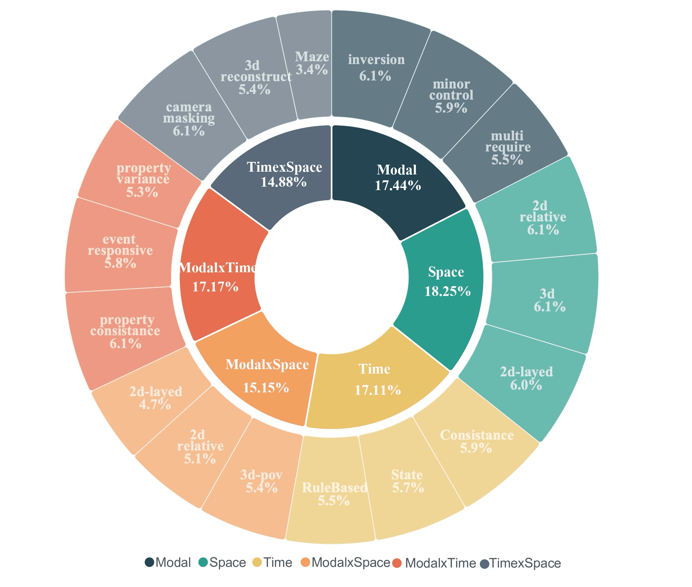

> 图 34：CoW-Bench 的层次分类法。内环代表主要的一致性维度（模态、空间、时间），外环详细展示了 18 个细粒度子任务。均匀的扇区大小在视觉上确认了数据集严格均衡的分布。

``

> 表 9：CoW-Bench 在 18 个子任务上的主要结果（数值越高越好）；MEAN 为所有子任务的平均值。缩写：SUAT=Subj-Attr，LCED=Local-Edit，MCON=Multi-Const；WLIN=Worldline，SLEV=Slow-Evol，STOR=Stage-Order；SEPL=Sem-Planar，OCCO=Occ/Contain；MV3D=MV-3D；TREV=Trigger-Event；LOHO=Long-Horizon，ATDY=Attr-Dyn；SEMV=Sem-MV；3DLO=3D-Loop；OCMO=Occ-Motion；MAZE=Maze-2D。AVG 已从原始 [0, 10] 范围重新缩放至 [0, 100] 的百分比尺度。

| Model                                     | Modal            | Temporal | Spatial | Modal-Temporal | Modal-Spatial | Temporal-Spatial | AVG  |      |      |      |      |      |      |      |      |      |      |      |       |
| ----------------------------------------- | ---------------- | -------- | ------- | -------------- | ------------- | ---------------- | ---- | ---- | ---- | ---- | ---- | ---- | ---- | ---- | ---- | ---- | ---- | ---- | ----- |
| SUAT                                      | LCED             | MCON     | WLIN    | SLEV           | STOR          | SEPL             | OCCO | MV3D | TREV | LOHO | ATDY | SEPL | OCCO | SEMV | 3DLO | OCMO | MAZE |      |       |
| \rowcolor[rgb] .941, 1, 1                 | 闭源视频生成模型 |          |         |                |               |                  |      |      |      |      |      |      |      |      |      |      |      |      |       |
| Sora [openai2024sora]                     | 5.16             | 8.35     | 8.38    | 9.32           | 5.80          | 6.22             | 8.41 | 6.19 | 8.51 | 6.96 | 8.12 | 5.25 | 8.64 | 5.97 | 9.49 | 8.40 | 9.25 | 4.17 | 73.66 |
| Kling [kling]                             | 4.11             | 8.19     | 5.63    | 9.10           | 5.17          | 5.53             | 8.72 | 7.88 | 9.32 | 7.08 | 8.71 | 6.58 | 8.20 | 6.79 | 9.44 | 8.08 | 9.30 | 5.30 | 73.96 |
| \rowcolor[rgb] .941, 1, 1                 | 闭源图像生成模型 |          |         |                |               |                  |      |      |      |      |      |      |      |      |      |      |      |      |       |
| GPT-image-1 [openai_gpt_image_1_2025]     | 7.37             | 8.96     | 7.96    | 9.14           | 7.75          | 5.68             | 8.09 | 7.43 | 9.26 | 6.95 | 9.28 | 7.22 | 9.00 | 6.83 | 9.79 | 8.46 | 8.22 | 7.24 | 80.35 |
| Seedream-4-0 [seedream2025seedream]       | 5.73             | 7.57     | 6.73    | 8.63           | 6.25          | 6.27             | 6.09 | 6.84 | 8.82 | 6.70 | 8.63 | 6.77 | 8.12 | 7.36 | 9.50 | 8.13 | 6.78 | 3.48 | 71.33 |
| Seedream-4-5 [seedream2025seedream]       | 6.69             | 7.78     | 6.91    | 8.77           | 7.46          | 6.76             | 6.27 | 7.21 | 9.06 | 7.17 | 9.11 | 6.77 | 8.04 | 7.27 | 9.59 | 8.23 | 7.51 | 2.28 | 73.82 |
| Nano Banana [comanici2025gemini]          | 7.19             | 8.47     | 5.63    | 8.87           | 7.86          | 6.71             | 7.64 | 7.84 | 9.34 | 7.33 | 9.66 | 6.67 | 8.68 | 7.95 | 9.20 | 8.13 | 8.76 | 5.16 | 78.38 |
| Nano Banana Pro [comanici2025gemini]      | 7.39             | 8.81     | 6.98    | 8.88           | 8.39          | 7.48             | 8.10 | 8.48 | 9.61 | 7.84 | 9.56 | 7.36 | 9.51 | 9.17 | 9.10 | 8.86 | 8.65 | 4.46 | 82.57 |
| GPT-image-1.5 [openai_gpt_image_1_5_2025] | 7.75             | 8.99     | 8.34    | 9.23           | 8.65          | 7.14             | 8.32 | 8.53 | 9.32 | 8.13 | 9.74 | 8.05 | 9.45 | 8.69 | 9.79 | 8.54 | 8.20 | 7.26 | 85.62 |
| \rowcolor[rgb] .941, 1, 1                 | 开源视频生成模型 |          |         |                |               |                  |      |      |      |      |      |      |      |      |      |      |      |      |       |
| Allegro [mroczkowski2021herbert]          | 1.97             | 5.79     | 4.41    | 7.03           | 1.91          | 3.33             | 6.82 | 5.75 | 7.89 | 4.72 | 7.67 | 4.80 | 4.22 | 5.30 | 7.19 | 6.87 | 7.27 | 1.86 | 52.67 |
| HunyuanVideo [hunyuan2025]                | 2.91             | 6.89     | 2.41    | 8.62           | 3.06          | 2.94             | 6.52 | 5.67 | 6.04 | 4.01 | 9.52 | 3.66 | 5.83 | 4.78 | 9.64 | 6.97 | 6.79 | 2.08 | 54.63 |
| LTX-Video [ltx2025]                       | 3.59             | 6.78     | 4.54    | 8.53           | 3.67          | 3.20             | 6.83 | 6.17 | 6.49 | 4.76 | 7.34 | 4.95 | 5.48 | 5.13 | 8.77 | 6.73 | 8.67 | 1.24 | 57.15 |
| CogVideoX [cogvideox]                     | 3.75             | 5.90     | 5.82    | 8.29           | 4.13          | 3.72             | 6.61 | 5.55 | 5.70 | 5.15 | 8.66 | 5.29 | 6.44 | 5.01 | 8.93 | 6.37 | 8.23 | 2.04 | 58.66 |
| Easy Animate [xu2024easyanimate]          | 3.78             | 7.11     | 5.10    | 8.70           | 4.33          | 3.59             | 7.35 | 6.36 | 7.81 | 4.94 | 7.85 | 5.29 | 6.01 | 5.58 | 7.95 | 6.78 | 8.71 | 2.98 | 61.23 |
| Wan2.2-I2V-14B [wan2025]                  | 3.32             | 7.61     | 6.57    | 8.54           | 4.00          | 3.80             | 7.37 | 6.10 | 6.27 | 5.33 | 8.37 | 5.24 | 6.69 | 6.17 | 9.51 | 7.11 | 6.84 | 2.46 | 61.83 |
| SkyReels-V2 [li2026skyreels]              | 3.16             | 7.45     | 5.29    | 8.89           | 4.03          | 3.74             | 7.92 | 5.80 | 7.93 | 5.39 | 8.87 | 5.66 | 7.70 | 6.75 | 9.07 | 8.18 | 8.18 | 3.66 | 65.37 |
| \rowcolor[rgb] .941, 1, 1                 | 开源图像生成模型 |          |         |                |               |                  |      |      |      |      |      |      |      |      |      |      |      |      |       |
| Qwen-Image [wu2025qwen]                   | 0.72             | 2.21     | 7.73    | 2.10           | 0.41          | 1.64             | 1.89 | 1.70 | 1.35 | 1.72 | 0.84 | 1.61 | 1.69 | 0.61 | 1.71 | 2.96 | 0.77 | 0.32 | 17.77 |
| BAGEL [deng2025emerging]                  | 5.01             | 5.86     | 5.53    | 6.27           | 5.01          | 3.96             | 5.33 | 6.43 | 7.68 | 4.45 | 8.60 | 4.91 | 7.08 | 5.22 | 8.89 | 5.51 | 6.00 | 5.08 | 59.34 |
| UniVideo [wei2025univideo]                | 4.07             | 7.27     | 4.14    | 8.58           | 3.87          | 3.08             | 6.84 | 6.15 | 6.81 | 4.29 | 8.72 | 5.69 | 6.26 | 5.09 | 9.08 | 7.34 | 7.49 | 3.16 | 59.96 |
| Emu3.5 [cui2025emu3]                      | 6.15             | 8.76     | 8.61    | 8.77           | 5.31          | 4.72             | 8.81 | 8.62 | 8.77 | 5.70 | 9.42 | 6.10 | 8.47 | 8.61 | 9.76 | 8.58 | 9.22 | 5.58 | 77.76 |

``

### 5.3 与现有基准的比较（Comparison with Existing Benchmarks）

现有的多模态评估系统主要围绕 **多模态大语言模型（Multimodal Large Language Models, MLLMs）** 的理解能力构建，形成了以 UniBench [unibench2024] 和 MANBench [zhou2025manbench] 为代表的标准化范式。然而，在 **生成式世界模型（generative world models）** 的评估方面仍然存在显著的维度差距。我们从三个关键维度界定了 CoW-Bench 与现有工作之间的本质区别：

- [判别式感知 vs. 生成式模拟（Discriminative Perception vs. Generative Simulation）](#discriminative-perception-vs-generative-simulation)
- [评估信号：问答准确性 vs. 动态约束满足（Evaluation Signals: QA Accuracy vs. Dynamic Constraint Satisfaction）](#evaluation-signals-qa-accuracy-vs-dynamic-constraint-satisfaction)
- [复杂性来源：认知深度 vs. 时空纠缠（Complexity Sources: Cognitive Depth vs. Spatiotemporal Entanglement）](#complexity-sources-cognitive-depth-vs-spatiotemporal-entanglement)

##### 判别性感知 vs. 生成性模拟（Discriminative Perception vs. Generative Simulation）

 **UniBench**  通过整合超过 50 个现有数据集，全面评估模型在 **视觉感知（visual perception）** 、 **属性推理（attribute reasoning）**  和 **空间关系理解（spatial relationship understanding）**  方面的判别能力，从而解决了多模态评估的碎片化问题 [unibench2024]。该评估范式隐含地假设模型扮演着 **被动观察者（passive observer）**  的角色，其任务是解构所提供的静态图像或视频输入。相比之下， **CoW-Bench**  则针对 **世界模型（world models）**  的生成性模拟能力，将其视为 **主动模拟器（active simulators）** 。与 MANBench [zhou2025manbench] 侧重于评估模型是否表现出卓越的问答能力不同，我们的重点在于评估模型能否在动态世界演化过程中主动保持物理约束和因果一致性。从这个意义上说，CoW-Bench 填补了评估模型感知和推理世界的能力与其持续构建和模拟世界的能力之间的关键评估空白。

##### 评估信号：问答准确率 vs. 动态约束满足（Evaluation Signals: QA Accuracy vs. Dynamic Constraint Satisfaction）

MANBench 的核心贡献在于建立了一个 **人类表现参考框架（human performance reference frame）** ，其评估信号源自根据静态 **真实值（ground truth）**  测量的 **视频问答（Video Question Answering, VQA）**  准确率 [zhou2025manbench]。然而，这种离散的二元判断（正确与错误）不足以捕捉生成式设定中经常出现的连续、非二元的物理失效。CoW-Bench 则将评估形式化为一个 **多因素约束满足问题（multi-factor constraint satisfaction problem）** 。正如 UniBench 将 **幻觉（hallucination）**  识别为 **多模态大语言模型（Multimodal Large Language Models, MLLMs）**  的主要瓶颈 [unibench2024]，在生成式场景中，这种幻觉通常表现为 **时空一致性（spatio-temporal consistency）**  的崩溃，例如物体在遮挡后消失。为解决此局限性，我们采用细粒度的原子化检查，明确量化模型在长程生成中关于模态、空间和时间约束的鲁棒性，而非仅仅依赖语义对齐。

##### 复杂性来源：认知深度 vs. 时空纠缠（Complexity Sources: Cognitive Depth vs. Spatiotemporal Entanglement）

MANBench 主要评估模型的高阶认知能力，其任务难度主要归因于达到超越人类水平表现所需的逻辑推理深度和知识调用广度 [zhou2025manbench]。相比之下，CoW-Bench 的难度源于 **时空动力学（spatiotemporal dynamics）**  的内在纠缠。实验结果表明，即使是像 GPT-4V 这样具有强大认知推理能力的模型，在跨一致性任务上，特别是涉及模态-时间耦合（例如 $M\times T$）的任务中，也表现出明显的失效。这些发现表明，世界模型的核心挑战不在于抽象的 **问题解决能力（problem-solving capacity）** ，而在于多个相互作用的物理约束下维持连贯的动态推理。

``

### 5.4 主要结果（Main Results）

[表 9](#table-9) 报告了 CoW-Bench 的任务级得分，涵盖了横跨模态、时间、空间和跨一致性领域的 18 个子任务。总体排名凸显了一个清晰趋势： **闭源图像生成模型（closed-source image generation models）**  在平均得分上占据主导地位，而 **开源视频生成器（open-source video generators）**  在大多数对一致性敏感的任务上仍大幅落后。特别是， **GPT-image-1.5**  取得了最佳总体表现，其次是  **Nano Banana Pro**  和  **GPT-image-1** 。这一差距表明，当前最强的统一多模态先验已经编码了丰富的静态世界规律，但当一致性约束需要长程、多因素强制执行时，它们仍然面临系统性的失效模式。

- [(1) 时间控制是瓶颈，而非连贯性。](#1-temporal-control-is-the-bottleneck-rather-than-coherence)
- [(2) 空间一致性在单视图3D中很强，但跨视角锚定仍然会崩溃。](#2-spatial-consistency-is-strong-in-single-view-3d-but-cross-view-anchoring-still-breaks)
- [(3) 融合任务揭示了真实的世界模型差距：动态下的持久语义。](#3-fusion-tasks-reveal-the-real-world-model-gap-persistent-semantics-under-dynamics)
- [(4) 开源模型暴露了与 CoW-Bench 动机一致的失效模式。](#4-open-source-models-expose-failure-modes-aligned-with-cow-benchs-motivation)
- [要点（Takeaway）。](#takeaway)

##### (1) 时间控制是瓶颈，而非连贯性。

在多个模型家族中，即使是一些视频模型（例如，Sora 达到了 9.32）， **T-WL（世界线持久性）**  也持续较高，这表明生成视觉上连续的片段已不再是最大的难点。然而，需要基于规则的演化或结构化状态推进的时间任务则显示出更不均匀的分布（例如， **T-Rule**  和  **T-Stage-Order**  在不同模型间差异显著）。这种分离支持了 CoW-Bench 的一个核心论点：世界模型需要的是随时间推移的约束满足，而不仅仅是视觉平滑性。一个模型可能在时间上看起来合理，但同时又违反了因果约束。

##### (2) 空间一致性在单视图3D中很强，但跨视角锚定仍然会崩溃。

大多数顶级模型在  **S-3D（单场景3D合理性）**  上得分很高，有几个超过了 9.0（例如，Nano Banana Pro 达到了 9.61）。然而，跨一致性任务揭示了一个更紧的瓶颈：虽然  **MS-3D（文本到3D视点控制）**  对于领先模型仍然很高（通常 $\geq 9$），但  **TS-Maze-2D**  和一些时空设置仍然低得多。这种模式表明，局部几何合理性比在运动和类似决策轨迹下维持全局锚定的空间结构更容易实现。

##### (3) 融合任务揭示了真实的世界模型差距：动态下的持久语义。

最先进的模型与其他模型之间最强的区分度出现在跨一致性家族（ **MT** ，  **MS** ，  **TS** ）中。例如，领先模型在  **MT-PropKeep（时间演化下的属性持久性）**  上获得了接近上限的性能，但在  **MT-PropChange（属性变化对齐）**  上表现下降，尤其是在  **TS-Maze-2D（导航式结构保持）**  上。值得注意的是，一些高平均分的模型在  **TS-Maze-2D**  上仍然表现出明显的弱点（例如，Nano Banana Pro 报告了 4.46 分），这表明即使在每帧保真度极佳的情况下，全局世界状态维护和轨迹级约束执行仍然是未解决的问题。这正是 **统一多模态模型（Unified Multimodal Models, UMMs）**  必须从感知生成器进化为真正内部模拟器的领域。

##### (4) 开源模型暴露了与 CoW-Bench 动机一致的失效模式。

开源视频生成器通常在 **模态基础（M-Subj-Attr）**  和跨一致性任务上表现不佳，这与定性观察结果一致，即它们要么 (i) 将罕见约束放松为常见默认值，要么 (ii) 在保持运动的同时，身份/属性发生漂移。同时，开源图像模型显示出巨大的方差： **Emu3.5**  在许多列上具有竞争力，但在以时间为中心和时空设置上仍然下降，这强化了 CoW-Bench 的目标是单次合理性与多步一致性之间的差距。

##### 要点（Takeaway）。

##### 要点（Takeaway）。

``

### 5.5 单轴一致性（Single-Axis Consistency）

- [5.5.1 模态一致性结果](#551-modal-consistency-results)
- [5.5.2 时间一致性结果](#552-temporal-consistency-results)
- [5.5.3 空间一致性结果](#553-spatial-consistency-results)

#### 5.5.1 模态一致性结果（Modal Consistency Results）

``

> **表 10：CoW-Bench 上的模态一致性结果（0–2 分制；越高越好）** ，分为三个指标族： **M1 主体–属性保真度** （IDAT, BKOF, DOMN, CLAR, EXCL）、 **M2 局部编辑精度** （TARG, MNCH, LEAK, CLAR, NEXA）和  **M3 多约束满足度** （CMPL, ATCO, RLCO, OMIS, NEXA）。缩写含义请参考表 [9](#table-9)。BKOF 衡量罕见约束被常见默认值替代的程度，而 NEXA 则惩罚指令之外的虚假添加。

| Model                                     | Subj-Attr (SUAT) | Local-Edit (LCED) | Multi-Const (MCON) |      |      |      |      |      |      |      |      |      |      |      |      |
| :---------------------------------------- | :--------------- | :---------------- | :----------------- | :--- | :--- | :--- | :--- | :--- | :--- | :--- | :--- | :--- | :--- | :--- | :--- |
| IDAT                                      | BKOF             | DOMN              | CLAR               | EXCL | TARG | MNCH | LEAK | CLAR | NEXA | CMPL | ATCO | RLCO | OMIS | NEXA |      |
| \rowcolor[rgb] .941, 1, 1                 | 闭源视频生成模型 |                   |                    |      |      |      |      |      |      |      |      |      |      |      |      |
| Sora [openai2024sora]                     | 0.40             | 1.48              | 0.91               | 1.15 | 1.22 | 1.12 | 1.96 | 1.82 | 1.45 | 2.00 | 1.96 | 1.67 | 1.32 | 1.59 | 1.84 |
| Kling [kling]                             | 0.33             | 1.32              | 0.58               | 0.95 | 0.93 | 1.23 | 1.82 | 1.74 | 1.49 | 1.91 | 1.36 | 1.14 | 0.74 | 0.86 | 1.53 |
| \rowcolor[rgb] .941, 1, 1                 | 闭源图像生成模型 |                   |                    |      |      |      |      |      |      |      |      |      |      |      |      |
| GPT-image-1 [openai_gpt_image_1_2025]     | 0.96             | 1.71              | 1.69               | 1.26 | 1.75 | 1.40 | 1.98 | 1.91 | 1.73 | 1.95 | 1.89 | 1.45 | 1.34 | 1.47 | 1.80 |
| GPT-image-1.5 [openai_gpt_image_1_5_2025] | 1.19             | 1.76              | 1.77               | 1.35 | 1.68 | 1.50 | 1.94 | 1.92 | 1.73 | 1.90 | 1.89 | 1.51 | 1.49 | 1.66 | 1.79 |
| Seedream-4-0 [seedream2025seedream]       | 0.94             | 1.44              | 1.35               | 0.89 | 1.10 | 1.25 | 1.77 | 1.70 | 1.54 | 1.31 | 1.78 | 1.44 | 1.28 | 1.44 | 0.78 |
| Seedream-4-5 [seedream2025seedream]       | 1.10             | 1.53              | 1.52               | 1.16 | 1.38 | 1.43 | 1.84 | 1.78 | 1.54 | 1.20 | 1.82 | 1.41 | 1.24 | 1.45 | 0.99 |
| Nano Banana [comanici2025gemini]          | 1.17             | 1.59              | 1.62               | 1.22 | 1.59 | 1.36 | 1.79 | 1.77 | 1.67 | 1.89 | 1.38 | 1.04 | 0.89 | 1.09 | 1.23 |
| Nano Banana Pro [comanici2025gemini]      | 1.25             | 1.68              | 1.72               | 1.22 | 1.52 | 1.55 | 1.80 | 1.81 | 1.71 | 1.95 | 1.63 | 1.42 | 1.21 | 1.32 | 1.40 |
| \rowcolor[rgb] .941, 1, 1                 | 开源视频生成模型 |                   |                    |      |      |      |      |      |      |      |      |      |      |      |      |
| Allegro [mroczkowski2021herbert]          | 0.10             | 0.60              | 0.24               | 0.47 | 0.56 | 0.70 | 1.31 | 1.28 | 0.83 | 1.67 | 1.19 | 0.82 | 0.59 | 0.70 | 1.11 |
| Easy Animate [xu2024easyanimate]          | 0.13             | 1.23              | 0.55               | 0.90 | 0.97 | 0.71 | 1.76 | 1.67 | 1.11 | 1.86 | 1.51 | 0.95 | 0.68 | 0.87 | 1.09 |
| CogVideoX [cogvideox]                     | 0.09             | 1.29              | 0.53               | 0.98 | 0.86 | 0.70 | 1.53 | 1.26 | 0.77 | 1.64 | 1.69 | 1.22 | 0.65 | 0.95 | 1.31 |
| Wan2.2-I2V-14B [wan2025]                  | 0.11             | 1.10              | 0.40               | 0.81 | 0.90 | 0.83 | 1.87 | 1.77 | 1.32 | 1.82 | 1.68 | 1.38 | 1.11 | 1.32 | 1.08 |
| SkyReels-V2 [li2026skyreels]              | 0.14             | 1.00              | 0.38               | 0.76 | 0.88 | 0.77 | 1.80 | 1.63 | 1.34 | 1.91 | 1.20 | 1.05 | 0.67 | 0.93 | 1.44 |
| HunyuanVideo [hunyuan2025]                | 0.01             | 1.23              | 0.31               | 0.76 | 0.60 | 0.30 | 1.97 | 1.64 | 0.98 | 2.00 | 0.28 | 0.23 | 0.09 | 0.12 | 1.69 |
| LTX-Video [ltx2025]                       | 0.15             | 1.20              | 0.49               | 0.93 | 0.82 | 0.62 | 1.80 | 1.48 | 0.97 | 1.91 | 1.38 | 0.96 | 0.52 | 0.69 | 0.99 |
| \rowcolor[rgb] .941, 1, 1                 | 开源图像生成模型 |                   |                    |      |      |      |      |      |      |      |      |      |      |      |      |
| BAGEL [deng2025emerging]                  | 0.73             | 1.13              | 1.16               | 0.63 | 1.36 | 1.01 | 1.30 | 1.14 | 0.79 | 1.62 | 1.53 | 1.01 | 0.75 | 0.85 | 1.39 |
| UniVideo [wei2025univideo]                | 0.27             | 1.09              | 0.77               | 0.74 | 1.20 | 0.79 | 1.90 | 1.57 | 1.07 | 1.94 | 0.79 | 0.65 | 0.35 | 0.89 | 1.46 |
| Emu3.5 [cui2025emu3]                      | 0.81             | 1.37              | 1.25               | 1.03 | 1.69 | 1.41 | 1.90 | 1.86 | 1.70 | 1.89 | 1.87 | 1.79 | 1.68 | 1.74 | 1.53 |
| Qwen-Image [wu2025qwen]                   | 0.00             | 0.18              | 0.04               | 0.02 | 0.48 | 0.10 | 0.40 | 0.29 | 0.09 | 1.33 | 1.84 | 1.66 | 1.49 | 1.60 | 1.14 |

表 [10](#table-10) 报告了三个指标族上的模态一致性性能： **主体属性保真度（M1）** 、 **局部编辑精度（M2）**  和 **多约束满足度（M3）** 。总体而言，该表强化了  **CoW-Bench**  的核心动机：即使生成结果看起来合理，模型也经常削弱、错误绑定或悄然重新解释指定的条件，这正是 **世界模型接口（world-model interface）** 无法容忍的失效模式。

- [(1) 身份与属性绑定是最难的模态接口原语。](#1-identity-and-attribute-binding-is-the-hardest-modal-interface-primitive)
- [(2) 约束回退普遍存在，且往往看似合理。](#2-constraint-backoff-is-widespread-and-often-looks-reasonable)
- [(3) 局部编辑将保留背景与命中目标分离开来。](#3-local-editing-separates-preserve-the-background-from-hit-the-target)
- [(4) 多约束满足强调完整性和角色绑定，而不仅仅是更多文本。](#4-multi-constraint-fulfillment-stresses-completeness-and-role-binding-not-just-more-text)
- [总结。](#takeaway)

##### (1) 身份与属性绑定是最难的模态接口原语。

在几乎所有模型组中， **身份与属性（Id+Attr）**  的得分仍明显低于其他 M1 维度。即使是最顶尖的闭源图像模型，在 Id+Attr 上也远未饱和（例如，GPT-image-1.5: 1.19；Nano Banana Pro: 1.25），而许多视频生成器则几乎归零（例如，HunyuanVideo: 0.01）。这种模式表明，主要的瓶颈并非生成视觉上一致的输出，而是在提示包含多个约束时，如何将目标实体及其关键属性牢固地锁定在一起。从语言到感知状态的语义通道仍然受到不稳定的 **变量绑定（variable binding）** 的困扰。

##### (2) 约束回退普遍存在，且往往看似合理。

 **回退（Backoff）** 列揭示了一种系统性趋势：用更常见的默认值替换不寻常或严格的约束。闭源图像模型减少了这种行为（通常 $\sim$1.6–1.8），但影响仍然不容忽视；几个开源模型对回退的抵抗力明显较弱。这正是 CoW-Bench 所针对的失效模式：模型可以生成逼真的图像，同时悄然放宽指令，而基于相似度的指标不会对此进行惩罚。

##### (3) 局部编辑将保留背景与命中目标分离开来。

对于 M2，许多模型在 **最小变化（Min-change）** 和 **泄漏（Leakage）** 上得分很高，这表明它们通常能保持非目标区域稳定，并避免全局破坏。然而， **目标（Target）** 得分可能低得多——这在某些开源视频模型上最为明显（例如，HunyuanVideo：Target=0.30 而 Min-change=1.97）。这一差距表明了一种常见的失效模式：模型保留了场景，但未能定位到预期的编辑，从而产生了视觉上轻微但语义上不正确的变化。

##### (4) 多约束满足强调完整性和角色绑定，而不仅仅是更多文本。

M3 揭示了另一种不同的瓶颈。像 Emu3.5 这样的强模型在 Complete/Attr-corr/Rel-corr 指标上始终保持较高水平（1.87/1.79/1.68），而一些系统则呈现出不均衡的表现：例如，Qwen-Image 在 Complete 以及属性和关系得分上相对较高，但在 M1 身份绑定（identity binding）上表现极差。这种不匹配表明，如果模型无法为这些约束维持稳定的指代对象（referent），那么仅仅满足多个列出的约束是不够的。同时，多个模型在 M3 下的 No-extra 得分有所下降（例如 Seedream 系列变体），这表明在组合压力下，它们可能会引入虚假实体——这种错误对下游规划和验证尤其有害。

##### 要点（Takeaway）。

##### 要点（Takeaway）。

#### 5.5.2 时间一致性结果（Temporal Consistency Results）

``

> 表 11：CoW-Bench 上的时间一致性结果（0–2 分制；分数越高越好）。我们报告三个指标族：T1 世界线持续性（Worldline Persistence）（SBJC, ATST, ENST, VISU, EVCT）、T2 规则引导的缓慢演化（Rule-guided Slow Evolution）（SBJL, TREN, TSCL, INTS, RULE）和 T3 有序阶段转换（Ordered Stage Transitions）（ORDR, IDEN, TIME, PROC, WLIN）。缩写含义请参考表 [9](#table-9)。INTS 评估合理中间状态（plausible intermediate states）的可见性，而 TSCL 衡量演化速度是否与提示指定的过程相匹配。

| 模型                                      | 世界线 (WLIN)    | 缓慢演化 (SLEV) | 阶段顺序 (STOR) |      |      |      |      |      |      |      |      |      |      |      |      |
| ----------------------------------------- | ---------------- | --------------- | --------------- | ---- | ---- | ---- | ---- | ---- | ---- | ---- | ---- | ---- | ---- | ---- | ---- |
| SBJC                                      | ATST             | ENST            | VISU            | EVCT | SBJL | TREN | TSCL | INTS | RULE | ORDR | IDEN | TIME | PROC | WLIN |      |
| \rowcolor[rgb] .941, 1, 1                 | 闭源视频生成模型 |                 |                 |      |      |      |      |      |      |      |      |      |      |      |      |
| Sora [openai2024sora]                     | 1.87             | 1.84            | 1.94            | 1.91 | 1.76 | 1.95 | 0.96 | 0.99 | 0.91 | 0.99 | 0.93 | 0.91 | 1.12 | 1.42 | 1.84 |
| Kling [kling]                             | 1.85             | 1.82            | 1.93            | 1.86 | 1.64 | 1.98 | 0.80 | 0.73 | 0.70 | 0.96 | 0.94 | 0.81 | 0.76 | 1.13 | 1.89 |
| \rowcolor[rgb] .941, 1, 1                 | 闭源图像生成模型 |                 |                 |      |      |      |      |      |      |      |      |      |      |      |      |
| GPT-image-1 [openai_gpt_image_1_2025]     | 1.75             | 1.84            | 1.93            | 1.91 | 1.71 | 1.98 | 1.49 | 1.43 | 1.49 | 1.38 | 0.79 | 0.86 | 1.06 | 1.19 | 1.79 |
| GPT-image-1.5 [openai_gpt_image_1_5_2025] | 1.77             | 1.86            | 1.91            | 1.93 | 1.76 | 1.98 | 1.66 | 1.69 | 1.70 | 1.62 | 1.26 | 1.18 | 1.35 | 1.45 | 1.90 |
| Seedream-4-0 [seedream2025seedream]       | 1.70             | 1.66            | 1.85            | 1.84 | 1.59 | 1.75 | 1.14 | 1.14 | 1.05 | 1.17 | 1.14 | 1.13 | 1.05 | 1.24 | 1.71 |
| Seedream-4-5 [seedream2025seedream]       | 1.71             | 1.76            | 1.89            | 1.78 | 1.63 | 1.85 | 1.49 | 1.40 | 1.40 | 1.32 | 1.29 | 1.20 | 1.12 | 1.32 | 1.83 |
| Nano Banana [comanici2025gemini]          | 1.71             | 1.72            | 1.84            | 1.84 | 1.76 | 1.88 | 1.54 | 1.51 | 1.53 | 1.41 | 1.20 | 1.23 | 1.12 | 1.35 | 1.80 |
| Nano Banana Pro [comanici2025gemini]      | 1.74             | 1.73            | 1.83            | 1.89 | 1.69 | 1.90 | 1.65 | 1.65 | 1.64 | 1.54 | 1.40 | 1.37 | 1.41 | 1.48 | 1.83 |
| \rowcolor[rgb] .941, 1, 1                 | 开源视频生成模型 |                 |                 |      |      |      |      |      |      |      |      |      |      |      |      |
| Allegro [mroczkowski2021herbert]          | 1.38             | 1.37            | 1.57            | 1.45 | 1.26 | 0.90 | 0.27 | 0.23 | 0.19 | 0.32 | 0.64 | 0.29 | 0.36 | 0.74 | 1.30 |
| Easy Animate [xu2024easyanimate]          | 1.69             | 1.69            | 1.90            | 1.82 | 1.60 | 1.98 | 0.60 | 0.54 | 0.49 | 0.72 | 0.50 | 0.33 | 0.26 | 0.70 | 1.80 |
| CogVideoX [cogvideox]                     | 1.63             | 1.56            | 1.90            | 1.67 | 1.53 | 1.85 | 0.59 | 0.49 | 0.46 | 0.74 | 0.69 | 0.30 | 0.27 | 0.63 | 1.83 |
| Wan2.2-I2V-14B [wan2025]                  | 1.76             | 1.70            | 1.86            | 1.78 | 1.44 | 1.88 | 0.56 | 0.43 | 0.38 | 0.75 | 0.71 | 0.42 | 0.26 | 0.65 | 1.76 |
| SkyReels-V2 [li2026skyreels]              | 1.79             | 1.74            | 1.84            | 1.90 | 1.62 | 1.86 | 0.57 | 0.48 | 0.48 | 0.64 | 0.61 | 0.35 | 0.26 | 0.71 | 1.81 |
| HunyuanVideo [hunyuan2025]                | 1.87             | 1.77            | 1.86            | 1.86 | 1.26 | 2.00 | 0.22 | 0.21 | 0.11 | 0.52 | 0.50 | 0.08 | 0.06 | 0.48 | 1.82 |
| LTX-Video [ltx2025]                       | 1.76             | 1.67            | 1.85            | 1.76 | 1.49 | 1.65 | 0.53 | 0.49 | 0.40 | 0.60 | 0.52 | 0.18 | 0.18 | 0.55 | 1.77 |
| \rowcolor[rgb] .941, 1, 1                 | 开源图像生成模型 |                 |                 |      |      |      |      |      |      |      |      |      |      |      |      |
| BAGEL [deng2025emerging]                  | 1.31             | 1.13            | 1.57            | 1.20 | 1.06 | 1.49 | 1.01 | 0.81 | 0.91 | 0.79 | 0.69 | 0.59 | 0.67 | 0.96 | 1.05 |
| UniVideo [wei2025univideo]                | 1.82             | 1.74            | 1.90            | 1.79 | 1.33 | 1.99 | 0.48 | 0.41 | 0.32 | 0.67 | 0.31 | 0.19 | 0.17 | 0.60 | 1.81 |
| Emu3.5 [cui2025emu3]                      | 1.66             | 1.72            | 1.91            | 1.85 | 1.63 | 1.95 | 0.84 | 0.74 | 0.78 | 1.00 | 0.54 | 0.59 | 0.73 | 1.13 | 1.73 |
| Qwen-Image [wu2025qwen]                   | 0.22             | 0.22            | 0.58            | 0.70 | 0.38 | 0.28 | 0.07 | 0.04 | 0.00 | 0.02 | 0.26 | 0.08 | 0.02 | 0.44 | 0.84 |

表 [11](#table-11) 报告了三个指标族的时间一致性表现：T1 世界线持续性（Worldline Persistence）、T2 规则引导的缓慢演化（Rule-guided Slow Evolution）和 T3 有序阶段转换（Ordered Stage Transitions）。出现了两个与 CoW-Bench 核心论点一致的一致模式： **时间合理性（temporal plausibility）不等同于时间约束满足（temporal constraint satisfaction）** ，并且最严重的失败发生在模型必须强制执行结构化动态而非仅仅维持视觉连续性时。

- [世界线持续性相对较强，即使对许多视频生成器也是如此。](#worldline-persistence-is-comparatively-strong-even-for-many-video-generators)
- [主要瓶颈是遵循规则的演化，而非连续性。](#the-main-bottleneck-is-rule-following-evolution-not-continuity)
- [要点（Takeaway）。](#takeaway)
- [在明确的多步骤结构下，阶段排序仍然脆弱。](#stage-ordering-remains-fragile-under-explicit-multi-step-structure)

##### 世界线持续性相对较强，即使对许多视频生成器也是如此（Worldline persistence is comparatively strong, even for many video generators）。

大多数闭源视频模型在 T1 上的得分接近上限（例如，Sora 在环境稳定性和视觉一致性方面得分很高），并且几个开源视频模型也取得了坚实的 T1 表现（例如 SkyReels-V2 和 Wan2.2-I2V）。这表明，维持稳定的场景布局并避免逐帧重新初始化，对于高容量生成器来说正成为一个基本已解决的能力。

##### 主要瓶颈是遵循规则的演化，而非连续性（The main bottleneck is rule-following evolution, not continuity）。

相比之下，T2 揭示了许多视频模型在趋势（Trend）、时间尺度（Time-scale）和状态间（Inter-state）指标上的急剧下降（通常低于 0.6），即使主体锁定（Subj-lock）得分很高。这一差距表明了一种常见的失败模式：模型保持了相同的主体和背景，但未能实现具有可识别中间状态的、单调且节奏正确的过程。值得注意的是，强大的闭源图像模型显示出明显更高的 T2 分数（例如，GPT-image-1.5 在趋势/时间尺度/状态间指标上保持高值），这表明当时间约束以语义方式表达且必须在整个序列中得到遵守时，更强的指令遵循先验会有所帮助。

##### 要点（Takeaway）

##### 要点（Takeaway）

##### 在显式多步结构下，阶段排序（Stage-ordering）仍然脆弱。

对于 T3，最弱的列集中在  **顺序（Order）**  和  **可辨识性（Identif.）**  上，尤其是 **开源视频模型** （通常接近 0.3 或更低）。即使 T3 末尾的  **世界线（Worldline）**  保持较高水平，较低的  **顺序/可辨识性**  也意味着序列可能仍停留在一个世界中，但未能可靠地实现预期的离散阶段结构。这一发现促使了  **CoW-Bench**  的分解：一个模型可能在时间上保持稳定，同时仍然违反高层时间逻辑。

#### 5.5.3 空间一致性结果（Spatial Consistency Results）

``

> 表 12：CoW-Bench 上的空间一致性结果（0–2 分制；分数越高越好）。我们报告三个指标族：S1 语义平面（Sem-Planar）（DIRC, COUNT, RULE, BNDY, LAYT），S2 遮挡/包含（Occlusion/Containment）（OCCL, BNDY, VISB, RSTB, LAYR），以及 S3 多视图 3D 一致性（Multi-view 3D coherence）（STRC, SURF, PSCL, OUPD, GEOS）。VISB 评估可见区域是否与隐含的遮挡关系一致，而 OUPD 则衡量在视角变化下遮挡边界是否合理更新。

| 模型                                      | 语义平面（SEPL） | 遮挡-包含（OCCO） | 多视图3D（MV-3D） |      |      |      |      |      |      |      |      |      |      |      |      |
| ----------------------------------------- | ---------------- | ----------------- | ----------------- | ---- | ---- | ---- | ---- | ---- | ---- | ---- | ---- | ---- | ---- | ---- | ---- |
| DIRC                                      | COUNT            | RULE              | BNDY              | LAYT | OCCL | BNDY | VISB | RSTB | LAYR | STRC | SURF | PSCL | OUPD | GEOS |      |
| \rowcolor[rgb] .941, 1, 1                 | 闭源视频生成模型 |                   |                   |      |      |      |      |      |      |      |      |      |      |      |      |
| Sora [openai2024sora]                     | 0.64             | 1.22              | 1.00              | 1.47 | 1.88 | 1.51 | 1.49 | 1.74 | 1.76 | 1.91 | 1.77 | 1.72 | 1.56 | 1.67 | 1.79 |
| Kling [kling]                             | 1.10             | 1.52              | 1.53              | 1.82 | 1.91 | 1.67 | 1.62 | 1.70 | 1.78 | 1.95 | 1.93 | 1.85 | 1.80 | 1.86 | 1.88 |
| \rowcolor[rgb] .941, 1, 1                 | 闭源图像生成模型 |                   |                   |      |      |      |      |      |      |      |      |      |      |      |      |
| GPT-image-1 [openai_gpt_image_1_2025]     | 0.81             | 1.58              | 1.45              | 1.66 | 1.92 | 1.54 | 1.37 | 1.55 | 1.75 | 1.89 | 1.91 | 1.85 | 1.77 | 1.86 | 1.88 |
| GPT-image-1.5 [openai_gpt_image_1_5_2025] | 1.36             | 1.70              | 1.62              | 1.87 | 1.98 | 1.59 | 1.46 | 1.57 | 1.83 | 1.87 | 1.92 | 1.89 | 1.81 | 1.85 | 1.85 |
| Seedream-4-0 [seedream2025seedream]       | 0.96             | 1.31              | 1.28              | 1.51 | 1.79 | 1.07 | 0.91 | 1.05 | 1.30 | 1.77 | 1.90 | 1.78 | 1.59 | 1.77 | 1.78 |
| Seedream-4-5 [seedream2025seedream]       | 1.13             | 1.40              | 1.37              | 1.66 | 1.66 | 1.22 | 1.00 | 1.06 | 1.31 | 1.69 | 1.87 | 1.78 | 1.77 | 1.82 | 1.82 |
| Nano Banana [comanici2025gemini]          | 1.23             | 1.59              | 1.41              | 1.71 | 1.89 | 1.35 | 1.36 | 1.43 | 1.69 | 1.82 | 1.96 | 1.90 | 1.75 | 1.87 | 1.87 |
| Nano Banana Pro [comanici2025gemini]      | 1.54             | 1.56              | 1.66              | 1.79 | 1.93 | 1.52 | 1.46 | 1.58 | 1.70 | 1.84 | 1.94 | 1.94 | 1.92 | 1.90 | 1.91 |
| \rowcolor[rgb] .941, 1, 1                 | 开源视频生成模型 |                   |                   |      |      |      |      |      |      |      |      |      |      |      |      |
| Allegro [mroczkowski2021herbert]          | 0.69             | 1.14              | 0.91              | 1.26 | 1.75 | 1.29 | 1.18 | 1.26 | 1.39 | 1.70 | 1.58 | 1.65 | 1.48 | 1.59 | 1.59 |
| Easy Animate [xu2024easyanimate]          | 0.44             | 1.41              | 1.12              | 1.53 | 1.86 | 1.34 | 1.26 | 1.37 | 1.47 | 1.91 | 1.68 | 1.52 | 1.54 | 1.56 | 1.51 |
| CogVideoX [cogvideox]                     | 0.48             | 1.10              | 0.95              | 1.18 | 1.84 | 1.30 | 1.16 | 1.13 | 1.26 | 1.76 | 1.42 | 1.23 | 1.08 | 1.01 | 0.96 |
| Wan2.2-I2V-14B [wan2025]                  | 0.29             | 1.41              | 1.03              | 1.48 | 1.89 | 1.44 | 1.16 | 1.34 | 1.54 | 1.89 | 1.58 | 1.25 | 1.09 | 1.20 | 1.15 |
| SkyReels-V2 [li2026skyreels]              | 0.37             | 1.27              | 0.98              | 1.38 | 1.80 | 1.40 | 1.43 | 1.49 | 1.66 | 1.94 | 1.67 | 1.67 | 1.46 | 1.62 | 1.51 |
| HunyuanVideo [hunyuan2025]                | 0.15             | 1.34              | 0.92              | 1.38 | 1.88 | 1.15 | 0.81 | 1.18 | 1.44 | 1.94 | 1.75 | 1.15 | 0.89 | 0.98 | 1.27 |
| LTX-Video [ltx2025]                       | 0.64             | 1.35              | 1.14              | 1.30 | 1.74 | 1.30 | 1.08 | 1.29 | 1.37 | 1.79 | 1.57 | 1.33 | 1.21 | 1.13 | 1.25 |
| \rowcolor[rgb] .941, 1, 1                 | 开源图像生成模型 |                   |                   |      |      |      |      |      |      |      |      |      |      |      |      |
| BAGEL [deng2025emerging]                  | 0.56             | 1.52              | 1.10              | 1.47 | 1.78 | 1.17 | 0.98 | 0.85 | 0.90 | 1.43 | 1.68 | 1.58 | 1.42 | 1.49 | 1.51 |
| UniVideo [wei2025univideo]                | 0.36             | 1.38              | 1.10              | 1.42 | 1.89 | 1.29 | 1.18 | 1.34 | 1.28 | 1.75 | 1.74 | 1.38 | 1.12 | 1.23 | 1.34 |
| Emu3.5 [cui2025emu3]                      | 1.41             | 1.63              | 1.81              | 1.81 | 1.96 | 1.78 | 1.64 | 1.67 | 1.81 | 1.91 | 1.82 | 1.78 | 1.72 | 1.72 | 1.73 |
| Qwen-Image [wu2025qwen]                   | 0.02             | 0.15              | 0.08              | 0.15 | 1.30 | 0.24 | 0.17 | 0.15 | 0.21 | 1.12 | 0.54 | 0.26 | 0.12 | 0.25 | 0.18 |

表 [12](#table-12) 报告了 S1 语义平面（Sem-Planar）、S2 遮挡/包含（Occlusion/Containment）和 S3 多视图 3D 一致性（Multi-view 3D coherence）的空间一致性结果。这些结果呼应了  **CoW-Bench**  的核心观点：空间世界建模不仅关乎在单帧中生成合理的几何结构，更在于维持那些在遮挡、包含和视角变化等交互下仍可验证的结构性约束。

- [(1) 平面布局是入门级测试，但方向性定位仍然脆弱。](#1-planar-layout-is-the-entry-level-test-yet-directional-grounding-remains-fragile)
- [(2) 遮挡/包含在很大程度上已被掌握，但可见部分证据是薄弱环节。](#2-occlusioncontainment-is-largely-learned-but-visible-part-evidence-is-the-weak-link)
- [(3) 多视图 3D 一致性将几何合理性与世界状态不变性区分开来。](#3-multi-view-3d-coherence-separates-geometry-plausibility-from-world-state-invariance)
- [要点（Takeaway）](#takeaway)

##### (1) 平面布局是入门级测试，但方向性定位仍然脆弱。

大多数模型在  **布局（Layout）**  上得分相对较高（通常 $\geq$1.8），这表明生成全局一致的二维构图正变得越来越可靠。相比之下， **方向性（Dir）**  始终是各模型家族中最低的子指标（例如，Sora：0.64；多个开源视频模型 $\leq$0.5；Qwen-Image：0.02）。这一差距表明，模型能够维持视觉上稳定的布局，同时仍无法以高保真度执行显式的方向性约束（左/右/内/外）。对于一个世界模型而言， **方向性定位（directional grounding）**  是一个核心接口要求，因为它将语言转化为可测试的空间关系。

##### (2) 遮挡/包含关系（Occlusion/containment）主要是学习得到的，但可见部分证据是薄弱环节。

闭源模型在  **层次关系（Layer）**  和  **关系稳定性（Rel-stab）**  上表现强劲（通常 $\sim$1.8–1.95），这表明它们通常能保持一致的深度排序，没有明显的矛盾。然而， **可见性（Visible）**  得分分布更广，尤其是对于开源图像模型（例如，BAGEL: 0.85；Qwen-Image: 0.15）。这种模式表明，模型可能捕获了粗略的分层意图，但在操作性证据上失败了——即实际可见的部分是否与隐含的遮挡边界相匹配。这正是那种“看似合理但违反了可检查约束”的失败，而  **CoW-Bench**  正是为此设计的。

##### (3) 多视图3D一致性（Multi-view 3D coherence）将几何合理性（geometry plausibility）与世界状态不变性（world-state invariance）区分开来。

顶尖的闭源图像模型在  **结构（Struct）**  和  **透视/尺度（Persp/Scale）**  上取得了接近满分的成绩（例如，Nano Banana Pro: 1.94/1.92；GPT-image-1.5: 1.92/1.81），这表明其单物体3D合理性很强。然而，一些开源视频模型在  **遮挡更新（Occ-update）**  和  **几何自一致性（Geo-self）**  上得分大幅下降（例如，CogVideoX: 1.01/0.96），这表明它们难以更新遮挡信息并在不同视图间维持自洽的3D解释。这支持了一个关键的世界模型含义： **生成一个合理的视图比维持一个能经受视角变化的持久3D场景假设更容易** 。

##### 要点（Takeaway）。

##### 要点（Takeaway）。

``

### 5.6 跨轴一致性（Cross-Axis Consistency）

- [5.6.1 模态-空间一致性结果：语义到几何的绑定（Modal–Space Consistency Results: Semantic-to-Geometry Binding）](#561-modalspace-consistency-results-semantic-to-geometry-binding)
- [5.6.2 模态-时间一致性结果：执行时序程序（Modal–Time Consistency Results: Executing a Temporal Program）](#562-modaltime-consistency-results-executing-a-temporal-program)
- [5.6.3 时间-空间一致性结果：导航揭示了缺失的世界状态（Time-Space Consistency Results: Navigation Exposes the Missing World State）](#563-time-space-consistency-results-navigation-exposes-the-missing-world-state)

#### 5.6.1 模态-空间一致性结果：语义到几何的绑定（Modal–Space Consistency Results: Semantic-to-Geometry Binding）

图 [35](#figure-35) 可视化了  **模态-空间一致性（Modal–Space consistency）** ，其中模型必须将语言约束（实体、属性、关系）映射为可执行的空间角色，并在布局和视角变化下保持这些约束的可验证性。该图支持  **CoW-Bench**  的核心目标：区分空间中的“看似合理”与“忠实于约束”的语义基础。

``

> 图 35：CoW-Bench 上的模态-空间一致性，以热力图形式展示子指标（行）和模型（列），分数范围为 0–2（越高越好）。行分组为： **语义-平面（Sem-Planar）** （实体匹配（Ent-match）、动作对齐（Act-align）、命名跟踪稳定性（NT-stab）、属性绑定（Attr-bind）、全局（Global））、 **语义-层次（Sem-Hier）** （正关系（Pos-rel）、负关系（Neg-rel）、排他性（Excl.）、可见性+层次（Vis+Layer）、身份稳定性（Id-stab））和  **语义-多视图（Sem-MV）** （锚点（Anchor）、视图稳定性（View-stab）、横向（Lateral）、场景（Scene）、标记（Marker））。

 **语义角色绑定（Semantic role binding）**  是主要的瓶颈。在许多模型中，最一致的性能下降出现在  **动作对齐（Act-align）**  和  **正关系（Pos-rel）**  上。这表明频繁出现以下失败：(i) 将指令中的动作/关系绑定到正确的实体，以及 (ii) 精确地实现一个建设性的正空间关系。重要的是，这些失败可以与几何倾向线索（例如，身份稳定性（Id-stab）、场景（Scene））上的高分共存，产生一种典型的“看似合理但绑定错误”的结果：场景是连贯的，但约束被附加到了错误的物体上，或者只是被微弱地反映出来。

 **避免违规通常比构建精确关系更容易。**  对于广泛的中等模型， **负关系（Neg-rel）**  和  **排他性（Excl.）**  明显强于  **正关系（Pos-rel）** 。这种不对称性表明，模型更可靠地避免了禁止的配置，而不是强制执行一个精确的所需放置。对于世界模型的使用来说，这个差距很重要，因为规划和验证依赖于建设性满足（将正确的实体置于正确的角色中），而不仅仅是避免明显的违规。

 **顶尖模型的多视图语义稳定性很强，但仍然暴露出尾部风险失败。**   **语义-多视图（Sem-MV）**  块（锚点（Anchor）、视图稳定性（View-stab）、横向（Lateral）、场景（Scene）、标记（Marker））对于领先的闭源图像模型和有竞争力的系统通常很高，表明在视角变化下，稳定的参考框架和身份标记越来越可实现。然而，热力图也显示，较弱的模型在这些锚点上可能会灾难性地失败，这使得多视图稳定性成为测试模型是否维持一个不变场景状态（而非每视图重绘一个新世界）的敏感探针。

#### 5.6.2 模态-时间一致性结果：执行时序程序（Modal–Time Consistency Results: Executing a Temporal Program）

图 [36](#figure-36) 可视化了  **模态-时间一致性（Modal–Time consistency）** ，其中模型必须 (i) 在长时间跨度内保持语言指定的锚点稳定，(ii) 执行提示指定的属性动态变化，以及 (iii) 响应离散的触发事件而不打破世界线（worldline）。该热力图支持  **CoW-Bench**  的核心目标：将视觉上合理的时间输出与忠实于约束的时间执行区分开来。

``

> 图 36：CoW-Bench 上的模态-时间一致性，以热力图形式展示子指标（行）和模型（列），分数范围为 0–2（越高越好）。行涵盖： **长时程锚定（Long-Horizon anchoring）** （初始锚点（Init-anchor）、长期稳定性（Long-stab）、跨场景（Cross-scene）、属性绑定（Attr-bind）、无意外（No-unexp））、 **属性动态对齐（Attr-Dyn alignment）** （目标(E,A)（Target(E,A)）、跟随（Follow）、平滑（Smooth）、速率（Rate）、环境稳定性（Env-stab））和  **触发事件遵从（Trigger-Event compliance）** （触发前保持（Pre-hold）、触发（Trigger）、触发后完成（Post-comp）、状态稳定性（State-stab）、环境稳定性（Env-stab））。

 **锚定通常很强；主要方差集中在最弱的系统中。**   **长时程（Long-Horizon）**  块在领先的闭源图像模型中持续高分，并且在许多视频生成器中仍具竞争力，这表明一旦锚点可观测，持久的身份/属性锚定通常是可实现的。最显著的失败表现为孤立的低分列（例如，最弱模型的初始锚点（Init-anchor）/长期稳定性（Long-stab）非常低），然后这些失败与下游的时间控制崩溃相关联。

 **动态属性（Dynamics attribute）**  是主要瓶颈，受限于指令遵循和速率控制。在  **属性动态（Attr-Dyn）**  中， **环境稳定性（Env-stab）**  对大多数模型来说保持在较高范围，而  **跟随（Follow）**  和  **速率（Rate）**  则显著较低——尤其是对于视频生成器。这种模式表明了一种常见的失败模式：模型保持场景稳定，但未能可靠地执行指令规定的演变（方向/时间表/节奏），产生的序列看起来平滑，但违反了语义上的时间承诺。

 **触发事件暴露了时序和事件后持久性的失败。**  在  **触发事件（Trigger-Event）**  中， **触发前保持（Pre-hold）**  通常相对较强，但  **触发（Trigger）**  和  **触发后完成（Post-comp）**  在许多视频模型中明显下降，揭示了两个耦合的问题：事件未在正确的时间点凸显，且触发后的状态未能持久。这些错误对于规划型应用尤其有害，因为离散事件充当了因果检查点。

#### 5.6.3 时间-空间一致性结果：导航揭示了缺失的世界状态（Time-Space Consistency Results: Navigation Exposes the Missing World State）

 **时间-空间一致性（Time-Space consistency）**  评估模型在执行时间上延展的运动时，是否能维持一个不变的空间结构。图 [37](#figure-37) 可视化了在 ST1–ST3 上的性能，并强调了一个与  **CoW-Bench**  动机一致的核心信息：模型能够实现很强的局部运动合理性，甚至稳定的环境，但当任务需要一个持久的、目标导向的世界状态时，模型就会失败。

``

> 图 37：CoW-Bench 上的时间-空间一致性，以热力图形式展示子指标（行）和模型（列），分数范围为 0–2（越高越好）。行涵盖三个指标族： **ST1 迷宫-2D（Maze-2D）** （起点/终点（Start/Goal）、轨迹连续性（Traj-cont）、合法性（Legal）、正确性（Correct）、结构稳定性（Struct-stab））、 **ST2 运动下的遮挡动态（Occlusion Dynamics under Motion）** （遮挡移动（Occ-move）、视差（Parallax）、刚性（Rigid）、自然（Natural）、环境稳定性（Env-stab））和  **ST3 3D循环导航（3D Loop Navigation）** （结构（Struct）、关系（Rel）、视图平滑（View-smooth）、物理（Physical）、实体稳定性（Entity-stab））。

(1)  **迷宫-2D（Maze-2D）**  仍然是最尖锐的区分器。在 ST1 中，许多视频生成器在  **合法性（Legal）**  上得分可观，有时在  **结构稳定性（Struct-stab）**  上也不错，但在  **起点/终点（Start/Goal）**  和  **正确性（Correct）**  上仍然接近零（例如，Sora 和 Kling 尽管  **合法性（Legal）**  中等，但  **正确性（Correct）**  较低）。这种模式表明，核心失败不在于生成看似合理的迷宫运动，而在于维持一条单一的、可识别的轨迹，该轨迹从正确的锚点开始并到达正确的目标，且没有隐式重置或走捷径。相比之下，更强的以图像为中心的模型获得了显著更高的 ST1 正确性，这表明明确的目标条件状态跟踪仍然是视频式生成的限制因素。

(2)  **运动下的遮挡（Occlusion-under-motion）**  相对成熟，剩余错误集中在深度图层更新上。对于 ST2，许多模型在  **刚性（Rigid）** 、 **自然（Natural）**  和  **环境稳定性（Env-stab）**  上得分较高，这表明分层运动和全局时间稳定性越来越被处理得很好。剩余的差异集中在  **遮挡移动（Occ-move）**  和  **视差（Parallax）**  上，这意味着最困难的情况涉及运动下一致的深度排序和可见性更新，而非整体平滑度。

(3)  **3D循环导航（3D loop navigation）**  强调视点连续性和关系稳定性。在 ST3 中，领先的模型保持较强的  **结构（Struct）**  和  **实体稳定性（Entity-stab）** ，但较弱的系统在  **视图平滑（View-smooth）**  和  **关系（Rel）**  上得分下降。这与“视点重置”失败模式一致：逐帧看，几何结构可能看起来合理，但整个序列无法被解释为沿着连续相机路径遍历的单一3D场景。因此， **CoW-Bench**  将循环导航视为一个探针，用于测试模型在变换下是否保持状态，而不仅仅是单视图的真实感。

``

### 5.7 样本分析（Sample Analysis）

为了深入分析模型在多维约束下的推理机制，我们在  **CoW-Bench**  中基于先前定义的六项核心一致性挑战，构建了一套新的评估标准。该基准超越了传统仅关注视觉质量的评估，利用逐帧的  **物理状态真值（Physical State Ground Truth）** ，从数据集构建和模型能力边界两个角度，精确量化了“ **生成器（Generator）** ”与“ **世界模拟器（World Simulator）** ”之间的根本差异。

- [5.7.1 单一一致性任务（Single Consistency Tasks）](#571-single-consistency-tasks)
- [5.7.2 复合一致性任务（Compound Consistency Tasks）](#572-compound-consistency-tasks)

#### 5.7.1 单一一致性任务（Single Consistency Tasks）

 **单一一致性任务** 的设计理念是隔离复杂干扰，利用模拟数据的纯净性为模型的基础推理建立基线。每个子任务的具体效果如图 [38](#figure-38)–[40](#figure-40) 所示。

``

> 图 40：时间子任务（Temporal sub-tasks）示例图。

``

> 图 38：模态子任务（Modal sub-tasks）示例图。

- [模态一致性任务（Modal Consistency Tasks）](#modal-consistency-tasks)
- [空间一致性任务（Spatial Consistency Tasks）](#spatial-consistency-tasks)
- [时间一致性任务（Temporal Consistency Tasks）](#temporal-consistency-tasks)

##### 模态一致性任务（Modal Consistency Tasks）

该任务考察模型能否清晰区分来自不同模态的约束，避免信息混淆。在 **主体属性保真度（Subject Attribute Fidelity）** 中，模型表现出强大的特征解耦能力，成功从参考图像中提取“蝴蝶”的纹理和材质，并将其映射到“鱼”的几何结构上。生成的生物具有明显的鳞片和光泽特征，而未融入蝴蝶的翅膀形态。对于更细粒度的 **局部编辑精度（Local Edit Precision）** ，模型在时钟编辑任务中展现出精确的像素控制，仅根据指令修改时针和分针，而背景墙壁和钟框则被严格“锁定”。此外，在 **多约束满足（Multi-constraint Satisfaction）** 的复杂指令下，模型准确捕捉了多个角色的服装、动作和位置属性，没有出现角色分配错误或属性泄露，证明了其在解析长文本约束方面的精度。

##### 空间一致性任务（Spatial Consistency Tasks）

该任务评估模型建立的场景在几何上是否自洽，而不仅仅是在二维图像中“看起来合理”。在 **语义平面（Sem-Planar）** 中，模型正确理解非遮挡场景中的相对位置，两只猫分别向左和向右移动，不会混淆方向语义。对于更复杂的 **遮挡/包含（Occlusion/Containment）** ，当抽屉缓慢关闭时，模型正确渲染了内部书本逐渐进入黑暗的过程；书本遵循物理遮挡规律，而非突然消失，体现了对“容器”概念的理解。在 **多视角三维（MV-3D）** 测试中，随着视角缓慢移动，台灯自然消失在视野边缘，而床的布局逐渐显现。在此过程中，房间内物体的相对位置保持不变，光照环境保持稳定。

##### 时间一致性任务（Temporal Consistency Tasks）

我们将时间一致性从“视觉平滑度”提升到“规则支配的演化”，考察模型是否遵循世界的隐含规律。在 **世界线持久性（Worldline Persistence）** 中，电风扇在长时间旋转中保持其叶片的物理完整性，没有出现叶片断裂或突然的材质突变。 **规则引导的缓慢演化（Rule-guided Slow Evolution）** 进一步展示了模型对物理熵的理解：在模拟的一小时时长内，蜡烛根据燃烧规律逐渐变短，而不是违反常识保持不变。在 **有序阶段转换（Ordered Stage Transitions）** 的房屋倒塌任务中，模型清晰地展示了从结构完整到废墟的连续状态。倒塌顺序遵循重力逻辑，废墟在倒塌后保持静止，避免了诸如“倒塌后复原”等非因果抖动。

#### 5.7.2 复合一致性任务（Compound Consistency Tasks）

 **复合一致性任务** 模拟现实世界的复杂性，考察模型在多维约束相互制约（甚至冲突）时的权衡与推理能力。每个子任务的具体效果如图 [41](#figure-41)–[43](#figure-43) 所示。

``

> 图 43：空间与时间子任务（spatial and temporal sub-tasks）示例图。

``

> 图 41：模态与空间子任务（modal and spatial sub-tasks）示例图。

 **模态-空间一致性任务（Modal-Spatial Consistency Tasks）** 评估模型将语义信息转化为可执行空间约束的能力，实现“语义-空间耦合”。模型不仅要理解物体是什么，还必须精确执行关于物体在哪里的几何指令，确保语义指代在空间维度上的准确落地。如图 [41](#figure-41) 所示，在 **语义平面（Sem-Planar）** 中，模型成功在复杂车流中识别出带有“蓝色车顶”的特定车辆，并仅控制该车辆向右移动，实现了精确的语义-空间绑定。在 **语义层级（Sem-Hier）** 任务中，模型准确生成了“苹果在碗里”和“梨在碗外”的场景，严格遵守包含与排除的空间语义。然而， **语义多视角（Sem-MV）** 暴露了当前的弱点：在视角转换过程中，虽然路标本身的视角变化保持合理，但书本和笔相对于路标的遮挡关系发生了错误漂移（从后方移动到侧面），表明模型在动态视角下维持微观空间语义的能力仍有待提升。

 **模态-时间一致性任务（Modal-Temporal Consistency Tasks）** 评估模型在长序列生成过程中对指令的忠实度。核心是考察模型是否将提示词视为高优先级的“时间宪法”，在整个视频中贯彻语义元素和逻辑约束，以抵抗随时间推移的语义漂移和遗忘。如图 [42](#figure-42) 所示，在 **长时程（Long Horizon）** 任务中，车辆的车身颜色、图案和相对位置在长距离移动中保持高度稳定，没有出现模糊或纹理变化。 **属性动态（Attribute Dynamic）** 进一步测试了时间编程能力，模型成功控制球体的颜色按照“红 $\to$ 橙 $\to$ 绿 $\to$ 蓝 $\to$ 红”的复杂序列变化，步骤清晰，无颜色渗漏。在 **触发事件（Trigger Event）** 中，模型展示了对因果逻辑的敏锐捕捉：手机屏幕在按钮按下前保持黑色，仅在动作触发后瞬间亮起，与事件的触发点精确对齐。

``

> 图 42：模态与时间子任务（modal and temporal sub-tasks）示例图。

 **空间-时间一致性任务（Spatial-Temporal Consistency Tasks）** 评估模型在弱模态约束下是否具备“内置物理引擎”的原型。重点在于模型能否在动态演化过程中保持空间拓扑和运动视差的自洽性，而非仅仅依赖像素级的平滑插值。如图 [43](#figure-43) 所示，在 **二维迷宫（Maze-2D）** 中，尽管模型保持了迷宫墙壁的静态结构，但主体最终未能正确规划出通往目标的路径，表明空间推理存在局限。相比之下， **运动中的遮挡动力学（Occlusion Dynamics under Motion）** 完美再现了运动视差：近处的树木高速移动产生运动模糊，而背景缓慢移动，车辆保持相对静止，实现了时空双重自洽。最后， **三维闭环导航（3D Loop Navigation）** 实现了从卧室到城市再返回的闭环漫游，结构连续性平滑，无空间坍塌，展示了在长时间漫游中潜在的参考框架稳定性。

为了全面验证这些机制，我们使用 CoW-Bench 测试了主流世界模型，包括 Sora [openai2024sora]、Kling [kling]、GPT-Image-1.5 [openai_gpt_image_1_5_2025]、Seedream-4-5 [seedream2025seedream]、Nano Banana Pro [comanici2025gemini]、Wan2.2-I2V-14B [wan2025]、SkyReels-V2 [li2026skyreels]、HunyuanVideo [hunyuan2025]、BAGEL [deng2025emerging] 和 Emu3.5 [cui2025emu3]。我们展示了部分结果：单一一致性比较如图 [44](#figure-44)（模态）、图 [45](#figure-45)（空间）和图 [46](#figure-46)（时间）所示；复合一致性结果如图 [47](#figure-47)（模态-空间）、图 [48](#figure-48)（模态-时间）和图 [49](#figure-49)（空间-时间）所示。

``

> 图 49：不同模型在空间与时间一致性任务上的比较。

``

> 图 48：不同模型在模态与时间一致性任务上的比较。

``

> 图 47：不同模型在模态与空间一致性任务上的比较。

``

> 图 46：不同模型在时间一致性任务上的比较。

``

> 图 45：不同模型在空间一致性任务上的比较。

``

> 图 44：不同模型在模态一致性任务上的比较。

``

## 6 结论（Conclusion）

本综述通过 **一致性三元组（Trinity of Consistency）**  的视角重新审视了生成式人工智能的发展轨迹，为 **世界模型（World Model）**  的构成建立了一个通用框架。通过将能力空间解构为 **模态（Modality）** 、 **空间（Spatial）**  和 **时间（Temporal）**  三个维度，我们认为真正的物理理解并非源于单一维度的性能，而是来自跨维度交互的鲁棒性。我们的分析强调，当前系统最关键的失败并非视觉伪影，而是 **一致性的断裂** ：无法将语义指令绑定到几何角色（模态-空间断裂）、无法在长时间演化中维持身份一致性（模态-时间断裂）、以及在导航过程中丢失环境的持久性（时间-空间断裂）。

为了严格诊断这些跨维度断裂，我们引入了 **CoW-Bench** ，这是一个全面的基准测试，在统一协议下整合了对主流视频生成模型和 **统一多模态模型（Unified Multimodal Models, UMMs）**  的评估。CoW-Bench采用了一种精心设计的、源自人类专家推理的多帧评估协议。通过将时间采样网格与细粒度的原子化检查清单进行对比分析，我们将一致性操作化为一个严格的 **约束满足问题（constraint-satisfaction problem）** 。这种严谨的方法揭示了一种普遍存在的 **约束退缩（constraint-backoff）**  现象：模型在生成看似合理的纹理的同时，却悄无声息地违反了逻辑承诺。这提供了必要的诊断分辨率，以区分视觉模仿与真正的物理模拟。

至关重要的是，我们的发现表明，约束退缩不仅仅是训练数据或模型规模不足的后果，而是当前模型表示交互方式的一种结构性产物。当动作空间要么不可解释，要么被严格预定义时，模型缺乏将语义承诺锚定在物理动力学中的表达能力。在此类约束下，一致性违反不再是偶然错误，而几乎是不可避免的结果。因此，解决这一局限性需要在世界模型内部对交互本身的形式化方式进行范式转变。

为了系统性地描述这一转变，我们根据交互动作空间的表达能力，组织了世界模型范式的演进过程（图 [50](#figure-50)）。如图所示，左侧部分展示了早期的探索，如 **JEPA**  [lecun2022path]，其在 **向量即动作（Vector-as-Action）**  层面运作。虽然实现了潜在空间预测，但其交互机制仍然不透明，缺乏语义可解释性。中间部分展示了以 **Genie系列**  [bruce2024genie, parker2024genie, deepmind2025genie3] 为代表的 **键即动作（Key-as-Action）**  范式。尽管引入了有限的交互性，但这些模型仍然局限于狭窄、离散且预定义的动作空间中。

``

> 图 50：基于交互动作空间的世界模型范式演化谱系。该图展示了该领域从早期的“向量即动作”范式（左：例如 JEPA，依赖于不可解释的潜在空间预测），经过中间的“键即动作”范式（中：例如 Genie 系列，受限于预定义的离散控制空间），最终迈向“提示即动作（Prompt-as-Action）”范式的轨迹。在后者中，一个语义编译器将自然语言意图转化为通用的时空动态模拟。

该图的右侧部分展示了一个前瞻性的范式：一个 **提示即动作** 范式，其中具有模态一致性的 UMMs 和具有时空一致性的视频生成模型被统一起来。配备了内部语义编译器后，此类模型能够解释高维的自然语言提示，并将其转化为遵循一致性三元组的通用时空模拟。最近如 **PixVerse-R1**  [pixverseR1_2026] 等系统提供了这一方向的早期雏形，展示了能够即时响应用户输入并在自回归架构内统一多种模态的实时世界建模。通过超越预定义的动作抽象，这一范式开始弥合人类语义意图与物理世界底层动力学之间的鸿沟。

因此，本综述的核心信念简单而坚定： **一致性不是世界模型的可选属性，而是其存在的准则** 。一个能生成视觉上令人信服的像素，但无法维持跨维度一致性的系统，无论规模多大，本质上仍然是一个纹理合成器，而非世界的模拟器。因此，一致性三元组所勾勒的不仅仅是一个分析框架；它标志着一个边界——一个介于生成像世界的图像与构建理解世界的模型之间的范式分水岭。

``

## 7 贡献（Contributions）

 **主要作者（Leading Authors）**

Jingxuan Wei^2, Siyuan Li^3, Cheng Tan^1

 **核心贡献者（Core Contributors）**

Yuhang Xu^2, Zheng Sun^2, Junjie Jiang^2, Hexuan Jin^2, Caijun Jia^2, Honghao He^2, Xinglong Xu^2, Xi Bai^2

 **其他贡献者（Other Contributors）**

Chang Yu^3, Yumou Liu^5, Junnan Zhu^2, Xuanhe Zhou^5, Jintao Chen^6, Xiaobin Hu^4, Shancheng Pang^7, Bihui Yu^2, Ran He^2, Zhen Lei^2, Stan Z. Li^3,

``

> 图 39：空间子任务示例图。

 **通讯作者（Corresponding Authors）**

Conghui He^1, Shuicheng Yan^4, Cheng Tan^1

- [所属单位（Affiliation）](#affiliation)

### 所属单位（Affiliation）

^1上海人工智能实验室（Shanghai Artificial Intelligence Laboratory）

^2中国科学院大学（University of Chinese Academy of Sciences）

^3西湖大学（Westlake University）

^4新加坡国立大学（National University of Singapore）

^5上海交通大学（Shanghai Jiaotong University）

^6浙江大学（Zhejiang University）

^7中国石油大学（华东）（China University of Petroleum (East China)）
