# Title: Chain of World: World Model Thinking in Latent Motion（世界之链：潜在运动中的世界模型思维）

- ArXiv: 2603.03195
- 作者：杨福祥（Fuxiang Yang）， 邸东林（Donglin Di）， 唐璐璐（Lulu Tang）， 张轩诚（Xuancheng Zhang）， 范磊（Lei Fan）， 李浩（Hao Li）， 陈伟（Wei Chen）， 苏同华（Tonghua Su）， 马宝瑞（Baorui Ma）， 哈尔滨工业大学（Harbin Institute of Technology）， 理想汽车（Li Auto）， 北京智源人工智能研究院（Beijing Academy of Artificial Intelligence, BAAI）， 新南威尔士大学（University of New South Wales）， 哈尔滨工业大学重庆研究院（Chongqing Research Institute of HIT）， 北京大学（Peking University）
- 章节：27
- 预估词元数：19.9k

## 目录

- 1 引言
- 2 相关工作
- 3 方法
  - 3.1 整体框架
  - 3.2 潜在运动提取器
  - 3.3 潜在运动思维预训练
  - 3.4 潜在动力学与动作策略对齐的协同微调
- 4 实验
  - 4.1 基准测试
  - 4.2 实现细节
  - 4.3 与最先进方法的比较
  - 4.4 潜在运动分析
  - 4.5 消融与效率分析
- 5 结论
- 6 致谢
- 参考文献
- 1 实现细节
  - 1.1 数据集
  - 1.2 训练细节
  - 1.3 世界模型与潜在运动链的解释
- 2 补充结果
  - 2.1 关键帧与动作块大小分析
  - 2.2 与其他视频变分自编码器的比较
  - 2.3 CALVIN
  - 2.4 SimplerEnv-Google Robot
  - 2.5 更多可视化结果
- 3 真实机器人实验

## Abstract

###### Abstract

**视觉-语言-动作模型（Vision-Language-Action models, VLA）** 是实现 **具身智能（Embodied Intelligence）** 的一条有前景的路径，然而它们常常忽视了视觉动态背后所蕴含的 **预测性与时序因果结构（Predictive and Temporal-Causal Structure）** 。
**世界模型 VLA（World-model VLAs）** 通过预测未来帧来解决这一问题，但会浪费模型容量去重建冗余的背景。
**潜在动作 VLA（Latent-action VLAs）** 以紧凑的方式编码帧间转换，但缺乏 **时序连续的动态建模（Temporally Continuous Dynamic Modeling）** 和世界知识。
为了克服这些局限性，我们提出了 **CoWVLA（Chain-of-World VLA）** ，这是一种新的 **“世界链（Chain of World）”** 范式，它将世界模型的时序推理与 **解耦的潜在运动表示（Disentangled Latent Motion Representation）** 统一起来。
首先，一个预训练好的 **视频变分自编码器（Video Variational Autoencoder, Video VAE）** 作为潜在运动提取器，显式地将视频片段分解为 **结构潜在变量（Structure Latents）** 和 **运动潜在变量（Motion Latents）** 。
然后，在预训练阶段，VLA 模型根据一条指令和一个初始帧，学习推断一个连续的潜在运动链，并预测该片段的终止帧。
最后，在 **协同微调（Co-fine-tuning）** 阶段，通过在一个统一的 **自回归解码器（Autoregressive Decoder）** 中联合建模稀疏的关键帧和动作序列，将这种潜在动态与离散的动作预测对齐。
这种设计保留了世界模型在时序推理和世界知识方面的优势，同时保持了潜在动作的紧凑性和可解释性，从而实现了高效的 **视觉运动学习（Visuomotor Learning）** 。
在机器人仿真基准测试上进行的大量实验表明，CoWVLA 优于现有的世界模型和潜在动作方法，并实现了适中的计算效率，突显了其作为一种更有效的 VLA 预训练范式的潜力。
项目网站地址为：https://fx-hit.github.io/cowvla-io。

## 1 引言（Introduction）

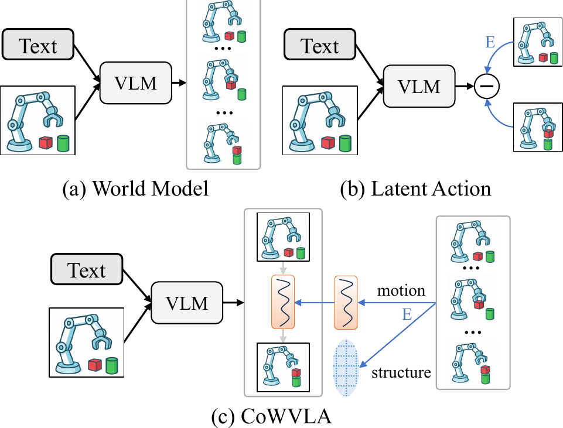

> 图 1 | VLA（Vision-Language-Action）预训练策略对比。(a) **世界模型（World Model）** ：预测未来的视觉帧，导致冗余的背景重建。(b) **潜在动作（Latent Action）** ：使用视觉编码器 $E$ 学习帧间转换，但缺乏时间上的连续推理。(c) **CoWVLA（Chain-of-World VLA）** ：我们的方法首先使用视频编码器 $E$ 将每个视频片段分解为运动和结构潜在表示，然后训练 VLM（Vision-Language Model）在给定指令和初始帧的情况下，推断潜在运动并预测片段的终止帧。

**具身智能（Embodied Intelligence）** 旨在构建能够在物理世界中感知、理解和行动的智能体。
**视觉-语言-动作模型（Vision-Language-Action Models, VLA）** 是实现这一目标的重要一步，它将多模态感知和运动控制统一到端到端的 **变换器（Transformer）** 中 [61, 24, 3, 34]。
尽管标准 VLA 模型在将视觉观察和语言指令直接映射到动作以完成许多任务方面是有效的，但它们缺乏人类所具备的未来预测能力，这激发了人们用 **预测性世界模型（Predictive World Models）** 来增强它们的兴趣 [1, 5]。

一种主流方法通过预测未来的视觉帧，将世界模型集成到 VLA 中，以显式地建模环境动态，如图 [1](#S1.F1) (a) 所示。
诸如 WorldVLA [7]、UniVLA [50] 和 FlowVLA [58] 等方法，通常基于大规模自回归变换器构建，学习预测未来状态，从而有益于动作策略学习。
虽然有效，但这种范式存在根本性的局限。
它需要对包含大量静态和冗余背景像素的整个视觉帧进行建模，导致近乎琐碎的像素复制，而非专注于有意义的运动和动态变化。
此外，将图像 [15] **量化（Quantizing）** 为离散的 **词元（Tokens）** ，在使用多帧时会导致序列过长和严重的训练效率低下。

从认知角度看，这种帧预测与人类对世界的建模方式不符：我们推理的是运动和交互，而不是在记忆中重建每一个像素。
这一观察引出了一个重要问题： **我们能否构建一种更紧凑、更抽象、更具动态性的世界建模形式？**
**潜在动作范式（Latent Action Paradigm）** [54, 12, 6, 11] 提供了引人注目的启发。
如图 [1](#S1.F1) (b) 所示，它将帧间转换编码为潜在动作，作为世界建模的抽象运动载体，从而能够利用从视频构建的伪动作标签进行大规模预训练。

然而，与世界模型相比，我们发现了当前潜在动作范式的两个关键局限。
第一，世界模型执行时间上连续的动态建模，而现有的潜在动作通常只关注两帧之间的变化 [54, 12, 6]。
第二，世界模型通过未来帧预测，学习用于任务执行的可泛化知识以及关于世界的常识。
相比之下，潜在动作仅编码“如何移动”，但缺乏对“什么在移动”、“运动发生在哪里”或“运动后场景应如何演变”的理解。

为了解决这些局限，我们提出了 **世界链 VLA（Chain-of-World VLA, CoWVLA）** ，它建立了一个统一两种方法优势的新范式，如图 [1](#S1.F1) (c) 所示。
我们的核心见解是： **有效的世界建模既需要运动表示的紧凑性，也需要帧预测的时间连续性和世界知识。**
我们认为，从视频片段中提取连续且紧凑的运动表示是可能的，这表明需要一个能够解耦视频中内容结构和运动的模型。
这种运动表示作为感知关键动态变化的载体，并进一步使模型能够推理时间演化后的关键帧，从而保留关键的视觉地标。

具体来说，我们的方法采用一个预训练的视频 **变分自编码器（Variational Autoencoder, VAE）** 作为潜在运动提取器，它显式地将每个视频片段解耦为结构和运动表示，为下游的视觉运动学习提供紧凑且可解释的监督。
然后，我们通过两个阶段训练一个统一的 VLA 解码器。
在 **预训练阶段（Pre-training Stage）** ，模型学习在给定指令和初始帧的情况下，推断潜在动态并预测视频片段的终止帧，从而在潜在运动空间中建立一个 **动态感知的世界先验（Dynamics-aware World Prior）** 。
在随后的 **协同微调阶段（Co-fine-tuning Stage）** ，通过以统一的自回归方式联合建模稀疏关键帧和动作序列，这个先验进一步与离散动作预测对齐。
这种设计结合了潜在运动的可解释性和紧凑性，以及世界模型的时间推理和世界知识，实现了高效且鲁棒的视觉运动学习，而无需重建冗余的中间帧。

总而言之，我们的贡献如下：

- 我们提出了 CoWVLA，建立了“世界链”范式，通过连续的潜在运动序列和终止关键帧预测，统一了世界建模和潜在动作学习。
- 我们引入了一种 **结构-运动解耦的潜在先验（Structure-Motion Disentangled Latent Prior）** ，它产生了可解释、连续且有效的动态表示。
- 我们进行了广泛的实验，证明 CoWVLA 在多个基准测试中达到了最先进的性能，超越了现有的世界模型和潜在动作方法。

## 2 相关工作（Related Work）

**视觉-语言-动作模型（Vision-Language-Action Models）** 。
深度学习已被广泛应用于各种工业场景，例如 **视觉异常检测（visual anomaly detection）** [17, 16]。
近期的 **视觉-语言-动作（Vision-Language-Action, VLA）模型** 在统一框架内直接从视觉和语言输入生成动作方面取得了快速进展 [61, 24, 34, 25, 36, 35, 22, 3, 18, 41, 46]。
RT-2 [61] 开创了这一方向，它将机器人控制视为一个序列建模问题，通过在机器人数据上微调预训练的视觉-语言模型来输出离散化的 **动作词元（action tokens）** 。
RT-X [34] 扩大了这一方法的规模，展示了跨不同机器人平台和任务进行联合训练的优势。OpenVLA [24, 25] 通过开源实现进一步普及了这项工作。
FAST [35] 引入了一种统一的频域公式来离散化动作，增强了离散控制中的时间相关性。
与此同时，另一研究方向探索 **连续轨迹生成（continuous trajectory generation）** [13, 3, 28, 21]。
它们利用 **扩散模型（diffusion models）** 或 **流匹配模型（flow-matching models）** 来生成连续的高频动作序列。
然而，大多数现有方法主要关注动作空间建模，捕获环境如何演化的能力有限。

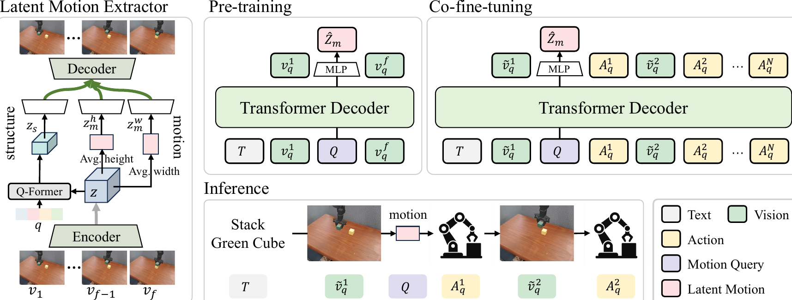

> 图 2 | CoWVLA 框架概览。CoWVLA 由两个核心组件组成：一个 **潜在运动提取器（latent motion extractor）** 和一个 **VLA解码器（VLA decoder）** 。潜在运动提取器实现为一个 **视频变分自编码器（video VAE）** ，它将每个视频片段解耦为一个结构潜在变量 $z_{s}$ 和两个方向性运动潜在变量 $z_{m}^{h}$ 与 $z_{m}^{w}$，这些变量被拼接成一个统一的潜在运动向量 $z_{m}$。VLA解码器对多模态序列执行统一的 **自回归建模（autoregressive modeling）** 。在预训练期间，模型以指令和初始帧作为输入，并使用一个可学习的 **运动查询（motion query）** $Q$ 来预测潜在运动 $\hat{z}_{m}$，同时重建视频片段的终止帧。在协同微调期间，输入扩展为交替的 **关键帧-动作对（keyframe–action pairs）** ；$Q$ 继续聚合时间连续的潜在动态，在稀疏的视觉观测下指导多步动作生成。

**机器人世界模型（World Models for Robotics）** 。
**世界模型（World models）** 通常用于捕获环境状态及其未来演化，并已广泛应用于 **自动驾驶（autonomous driving）** [48, 51]、图像和视频生成 [5, 31, 53, 45, 42, 14] 以及机器人学 [50, 7, 1, 38, 19, 56] 等领域。
当与 VLA 模型结合时，大多数方法 [52, 8, 57, 7, 50, 58] 依赖于预测未来的视觉状态来提供隐式的世界知识，并在机器人操作中展示了改进的性能。
UVA [29] 进一步使用扩散模型联合优化视频预测和动作预测，从而提高了视觉推理和控制推断的效率。
然而，这些方法需要重建完整的视觉帧序列，导致计算成本高、资源消耗大。

**机器人潜在动作（Latent Actions for Robotics）** 。
**潜在动作（Latent-action）** 方法学习两帧之间的紧凑潜在转换来建模环境动态。
LAPA [54] 引入了一个三阶段框架（包括潜在动作量化、潜在预训练和动作微调），利用大规模伪动作监督来改进现实世界机器人控制的学习。MoTo [12] 遵循这一范式，并在运动量化和真实动作质量方面进行了增强。
TLA [6] 进一步解耦了 **任务相关（task-relevant）** 和 **任务无关（task-irrelevant）** 的运动因素。
然而，这些方法通常将潜在动作建模限制在帧对之间，限制了其捕获长程时间动态的能力。尽管 Villa-X [11] 将潜在动作扩展到多帧设置，但它仍然为每个局部帧对生成一个潜在动作，导致时间一致性有限。
此外，潜在动作表示不可避免地编码了静态外观和上下文细节。
虽然 TLA [6] 通过解耦任务相关性来缓解这个问题，但理想的潜在空间应该明确地将结构与运动分离，从而产生更清晰、更可解释的动作表示。

**视频压缩与解耦（Video Compression and Decoupling）** 。
视频表示学习中的最新方法越来越关注将视觉信息压缩到解耦的潜在空间中，这些空间分别编码空间结构和时间运动 [53, 40, 26, 55, 49]。
我们潜在运动空间的设计灵感来源于这些进展。
像 CMD [55] 和 VidTwin [49] 这样的模型已经成功地在高度压缩的潜在空间中解耦了整体内容和动态信息。
这种分解提供了场景如何演化的紧凑、连续且有意义的表示。
虽然这些模型是为视频生成而开发的，但我们首次提出并证明了它们的预训练潜在运动空间可以作为机器人世界模型的强大动态先验。

## 3 方法（Method）

### 3.1 整体框架（Overall Framework）

我们考虑一个机器人操作任务，该任务涉及根据语言指令和视觉观察执行一系列动作。
指令记为 $T$。
原始动作序列为 $\mathbf{A}_{1:t}=\{a_{1},\ldots,a_{t}\}$。
为了实现离散序列建模，将动作序列 $\mathbf{A}_{1:t}$ 划分为固定长度 $l_{a}$ 的连续块，即：
$$\mathbf{A}_{1:t}=\bigcup_{j=1}^{N}\mathbf{A}^{j},\quad\mathbf{A}^{j}=\{a_{(j-1)l_{a}+1},\ldots,a_{jl_{a}}\},$$
然后使用 **FAST（Fully Adaptive Sequential Tokenization）** [35] 算法将每个块 $\mathbf{A}^{j}$ 量化为离散的词元序列 $\mathbf{A}_{q}^{j}$。
原始对应的视觉观察序列表示为 $\mathbf{V}_{1:t}=\{v_{1},\ldots,v_{t}\}$，其中每一帧 $v_{i}\in\mathbb{R}^{H\times W\times 3}$。
我们提取每个动作块的第一帧作为 **关键帧（Keyframe）** ：
$$\tilde{\mathbf{V}}=\{\tilde{v}_{j}\}_{j=1}^{N}=\{v_{(j-1)l_{a}+1}\}_{j=1}^{N},$$
其中每个 $\tilde{v}_{j}$ 随后使用 **VQGAN（Vector Quantized Generative Adversarial Network）** [15] 量化为一个视觉词元 $\tilde{v}_{q}^{j}$。
此外，引入一个可学习的 **运动查询词元（Motion Query Token）** $Q\in\mathbb{R}^{D_{Q}}$ 作为世界动态查询，其隐藏表示总结了过去的上下文，并为生成后续的视觉或动作词元提供了一个未来动态感知的条件信号。

整体框架包含两个模型和三个训练阶段。
第一个模型是 **潜在运动提取器（Latent Motion Extractor）** （视频 VAE 范式），它将视频子序列 $\mathbf{V}_{1:f}$ 编码为一个中间潜在表示 $z\in\mathbb{R}^{d_{z}\times f\times h\times w}$，并将其分解为一个结构特征 $z_{s}$ 和两个方向性运动特征 $z_{m}^{h}$ 和 $z_{m}^{w}$。
这两个运动分量被拼接起来形成一个统一的潜在运动向量 $z_{m}\in\mathbb{R}^{D_{m}}$，作为真实监督信号。
第二个模型是 **VLA（Vision-Language-Action）解码器** （Transformer-decoder 范式），它执行跨模态的统一自回归下一词元预测。
在预训练期间，输入序列组织为 $[T,v_{q}^{1},Q,v_{q}^{f}]$。
将从 VLA 解码器获得的、对应于查询词元 $Q$ 的最终隐藏表示输入到一个 **MLP（Multilayer Perceptron）** 中，以预测潜在运动 $\hat{z}_{m}$。
这个阶段使模型能够从语言和初始视觉输入中推断潜在动态和未来观察。
在协同微调期间，我们使用交替的关键帧和动作词元，例如 $[T,\tilde{v}_{q}^{1},Q,\mathbf{A}_{q}^{1},\tilde{v}_{q}^{2},\mathbf{A}_{q}^{2},\ldots]$。
模型继续在 $Q$ 位置预测一个潜在运动向量 $\hat{z}_{m}$。因此，该模型在稀疏关键帧观察下保持显式的动态推理，并从紧凑的潜在表示中生成稳定的多步动作。

### 3.2 潜在运动提取器（Latent Motion Extractor）

为了在紧凑的潜在空间中编码时序动态，我们采用一个预训练的视频变分自编码器（Video Variational Autoencoder, VAE）[49] 作为潜在运动提取器。如图 [2](#S2.F2) 所示，该提取器通过两个专用分支实现 **结构-运动解耦（Structure-Motion Disentanglement）** 。给定一个视频片段 $\mathbf{V}_{1:f}$，编码器产生一个潜在张量 $z\in\mathbb{R}^{d_{z}\times f\times h\times w}$。

- **结构分支（Structure branch）** 采用一个 Q-Former [27] 模块，该模块包含一组可学习的查询（Learnable Queries） $\{q_{i}\}_{i=1}^{n_{q}}$，用于沿时间维度聚合全局语义和低频动态，生成 $z_{s}\in\mathbb{R}^{d_{s}\times n_{q}\times h_{s}\times w_{s}},n_{q}\leq f$。
- **运动分支（Motion branch）** 沿空间维度操作：若干卷积层降低 $z$ 的维度，并生成 $z^{\prime}\in\mathbb{R}^{d_{m}\times f\times h_{m}\times w_{m}}$。随后，沿高度和宽度轴独立应用空间平均 $\mu(\cdot)$ 以提取方向性运动嵌入（Directional Motion Embeddings）：
  $z_{m}^{h}=\mu_{h}(z^{\prime})\in\mathbb{R}^{d_{m}\times f\times w_{m}},z_{m}^{w}=\mu_{w}(z^{\prime})\in\mathbb{R}^{d_{m}\times f\times h_{m}}$。

这两个运动分量被拼接（Concatenated）并展平（Flattened），形成一个统一的潜在运动表示：
$z_{m}\in\mathbb{R}^{D_{m}},D_{m}=f\times d_{m}\times(h_{m}+w_{m})$。

在解码器阶段，三个潜在分量 $(z_{s},z_{m}^{h},z_{m}^{w})$ 通过卷积层和 **多层感知机（Multilayer Perceptron, MLP）** 层上采样至相同的空间和时间尺寸，求和后输入解码器以重建 $\hat{\mathbf{V}}_{1:f}$。训练目标遵循原始 VAE 设计 [49]，结合 **重建损失（Reconstruction Loss）** $\mathcal{L}_{\text{rec}}$、 **感知损失（Perceptual Loss）** $\mathcal{L}_{p}$、 **对抗损失（Adversarial Loss）** $\mathcal{L}_{\text{GAN}}$ 和 **KL 散度正则化损失（KL-divergence Regularization Loss）** $\mathcal{L}_{\text{KL}}$，以保持时序一致性和视觉真实感：

$$
\mathcal{L}_{vae}=\mathcal{L}_{\text{rec}}+\lambda_{p}\mathcal{L}_{p}+\lambda_{\text{GAN}}\mathcal{L}_{\text{GAN}}+\lambda_{\text{KL}}\mathcal{L}_{\text{KL}}.(1)
$$

通过显式的结构-运动解耦和温和的适配，该提取器产生了一个紧凑、可解释且可迁移的潜在表示，非常适合机器人场景，为下游的 **视觉语言动作模型（Vision-Language-Action, VLA）** 预训练和协同微调提供了有效的监督。

### 3.3 在潜在运动中思考的预训练（Pre-training to Think in Latent Motion）

预训练阶段旨在将语言和初始视觉观测与潜在运动表示对齐，使模型能够在潜在空间中推理连续的时序动态，并预测视频片段的最后一帧。给定一个连续视频片段 $\mathbf{V}_{1:f}=\{v_{1},\ldots,v_{f}\}$，潜在运动提取器产生一个潜在运动监督信号 $z_{m}$。其首帧和末帧被量化为离散的视觉词元（Visual Tokens），分别记为 $v_{q}^{1}$ 和 $v_{q}^{f}$。

基于此，我们将输入到 VLA 解码器的序列组织为：$[T,v_{q}^{1},Q,v_{q}^{f}]$。其中 $T$ 表示指令，$v_{q}^{1}$ 代表初始观测，$Q$ 是一个可学习的运动查询词元（Motion Query Token），而 $v_{q}^{f}$ 对应于从 $v_{1}$ 出发，通过 $z_{m}$ 所蕴含的基础运动后将会达到的视觉状态。在前向传播过程中，查询位置处的隐藏状态被送入一个 MLP，以预测潜在运动 $\hat{z}_{m}$。

为防止信息泄露，应用了 **因果掩码（Causal masking）** ，使得 $Q$ 仅能关注 $\{T,v_{q}^{1}\}$，同时被屏蔽于 $v_{q}^{f}$ 之外。
训练目标包含 **潜在运动监督（Latent motion supervision）** 和 **终端帧视觉一致性（Terminal-frame visual consistency）** ：

$$
\mathcal{L}_{\text{pretrain}}=\|\hat{z}_{m}-z_{m}\|_{2}^{2}+\sum_{x\in\{1,f\}}\mathrm{CE}(\hat{v}_{q}^{x},v_{q}^{x}),(2)
$$

其中，第一项强制要求从 $Q$ 提取的潜在表示能准确概括从 $v_{1}$ 到 $v_{f}$ 的连续运动，而第二项则确保模型能对最终的未来状态形成连贯的预测。
通过此阶段，模型学会直接从语言和初始帧推断潜在的时间动态，从而为后续的动作建模建立了一个 **动态感知先验（Dynamics-aware prior）** 。

### 3.4 用于对齐潜在动态与动作策略的协同微调（Co-Fine-Tuning for Aligning Latent Dynamics with Action Policies）

在预训练阶段于潜在运动空间建立了动态感知先验之后，协同微调阶段进一步在一个统一的自回归框架内，将潜在运动推理与离散动作建模对齐，从而在稀疏关键帧观测下实现稳定的多步控制。
给定一个连续视频序列 $\mathbf{V}_{1:f}$ 及其对应的动作序列 $\mathbf{A}_{1:f}$，我们提取 $N=f/l_{a}$ 个关键帧并将其量化为视觉词元：
$\tilde{\mathbf{V}}_{q}=\{\tilde{v}_{q}^{1},\ldots,\tilde{v}_{q}^{N}\},$
其中 $\tilde{v}_{q}^{j}=v_{q}^{(j-1)l_{a}+1}$。
我们进一步使用 FAST [35] 对动作序列进行量化：
$\mathbf{A}_{1:f}\ \xrightarrow{\text{FAST}}\ \{\mathbf{A}_{q}^{1},\ldots,\mathbf{A}_{q}^{N}\}.$
输入序列采用“ **单 $Q$ 覆盖全窗口（single-$Q$ for the full window）** ”的设计：
$[T,\ \tilde{v}_{q}^{1},\ Q,\ \mathbf{A}_{q}^{1},\ \tilde{v}_{q}^{2},\ \mathbf{A}_{q}^{2},\ \ldots,\ \mathbf{A}_{q}^{N}],$
其中查询词元 $Q$ 仅在第一个关键帧之后出现一次，并作为整个时间范围的 **潜在动态聚合器（Latent dynamics aggregator）** 。解码器以自回归方式同时预测动作和视觉词元；$Q$ 处的隐藏状态通过一个 **多层感知机（Multilayer Perceptron, MLP）** 传递，以生成单个潜在运动向量 $\hat{z}_{m}$，从而强制潜在动态与后续预测之间的一致性。
与预训练阶段一样，因果掩码阻止 $Q$ 关注未来的关键帧和动作，迫使模型基于潜在动态进行推理，而非直接窥视未来状态。

**联合微调目标（The co-fine-tuning objective）** 由三项组成：

$$
\displaystyle\mathcal{L}_{\text{finetune}}= \displaystyle\sum_{j=1}^{N}\mathrm{CE}\!\left(\hat{\mathbf{A}}_{q}^{j},\ \mathbf{A}_{q}^{j}\right)+\lambda_{1}\left\|\hat{z}_{m}-z_{m}(\mathbf{V}_{1:f})\right\|_{2}^{2} (3) \displaystyle+\lambda_{2}\sum_{j=1}^{N}\mathrm{CE}\!\left(\hat{\tilde{v}}_{q}^{j},\ \tilde{v}_{q}^{j}\right).
$$

其中，$z_{m}(\mathbf{V}_{1:f})$ 是由预训练提取器生成的连续潜在运动监督信号（continuous latent motion supervision signal）。

- **第一项** 确保离散动作的准确执行。
- **第二项** 鼓励查询词元（query token）处的潜在表示（latent representation）能够忠实地捕捉从 $v_{1}$ 到 $v_{f}$ 的连续动态。
- **第三项** 将运动预测锚定在稀疏的视觉检查点（sparse visual checkpoints）上，以保持由预测动态驱动的、一致的状态转移。

> 表 1 | 不同方法在 LIBERO [32] 和 SimplerEnv-WidowX [30] 基准测试上的比较。每个指标的最佳值和次佳值分别以 **粗体** 和<u>下划线</u>标出。

| 模型                     | LIBERO    | SimplerEnv-WidowX |           |           |             |            |           |              |           |           |
| ------------------------ | --------- | ----------------- | --------- | --------- | ----------- | ---------- | --------- | ------------ | --------- | --------- |
| SPATIAL                  | OBJECT    | GOAL              | LONG      | Avg.      | Stack Block | Put Carrot | Put Spoon | Put Eggplant | Avg.      |           |
| OpenVLA [24]             | 0.849     | 0.884             | 0.792     | 0.537     | 0.765       | 0.000      | 0.000     | 0.000        | 0.041     | 0.010     |
| SpatialVLA [36]          | 0.882     | 0.899             | 0.786     | 0.555     | 0.781       | 0.292      | 0.250     | 0.167        | 1.000     | 0.427     |
| CogACT [28]              | 0.960     | 0.874             | 0.868     | 0.846     | 0.887       | 0.150      | 0.508     | 0.717        | 0.675     | 0.513     |
| Dita [21]                | 0.842     | 0.963             | 0.854     | 0.638     | 0.824       | –          | –         | –            | –         | –         |
| $\pi_{0}$ [3]            | 0.968     | 0.988             | 0.958     | 0.852     | 0.942       | 0.167      | 0.000     | 0.291        | 0.625     | 0.401     |
| $\pi_{0}$-FAST [35]      | 0.964     | 0.968             | 0.886     | 0.602     | 0.855       | 0.108      | 0.219     | 0.291        | 0.666     | 0.483     |
| GR00T N1 [2]             | 0.944     | 0.976             | 0.930     | 0.906     | 0.939       | 0.167      | 0.458     | 0.625        | 0.208     | 0.495     |
| w/ Latent Actions        |           |                   |           |           |             |            |           |              |           |           |
| LAPA [54]                | –         | –                 | –         | –         | –           | 0.542      | 0.458     | 0.708        | 0.583     | 0.573     |
| villa-X [11]             | 0.975     | 0.970             | 0.915     | 0.745     | 0.901       | 0.613      | 0.463     | 0.779        | 0.646     | 0.625     |
| TLA [6]                  | 0.965     | 0.968             | 0.956     | 0.920     | 0.952       | 0.028      | 0.556     | 0.528        | 0.806     | 0.480     |
| w/ World Model           |           |                   |           |           |             |            |           |              |           |           |
| WorldVLA [7]             | 0.856     | 0.890             | 0.826     | 0.590     | 0.791       | –          | –         | –            | –         | –         |
| CoT-VLA [57]             | 0.875     | 0.916             | 0.876     | 0.690     | 0.811       | –          | –         | –            | –         | –         |
| UniVLA [50]              | 0.960     | 0.992             | 0.932     | 0.914     | 0.950       | 0.292      | 0.625     | 0.833        | 1.000     | 0.687     |
| FlowVLA [58]             | 0.932     | 0.950             | 0.916     | 0.726     | 0.881       | 0.625      | 0.625     | 0.708        | 1.000     | 0.740     |
| \rowcolorgray!20 Ours | **0.972** | **0.978**         | **0.946** | **0.928** | **0.956**   | **0.625**  | **0.667** | **0.792**    | **0.958** | **0.760** |

## 4 实验（Experiments）

### 4.1 基准测试（Benchmarks）

**LIBERO（LIBERO）** 。
LIBERO [32] 基准测试旨在研究多任务和终身机器人学习中的知识迁移，它要求模型同时具备关于物体和空间关系的 **陈述性知识（Declarative knowledge）** 以及关于运动和行为的 **程序性知识（Procedural knowledge）** 。
它包含四个任务套件：

- **LIBERO-Spatial** ：通过根据位置放置碗来强调 **空间推理（Spatial reasoning）** 。
- **LIBERO-Object** ：通过拾取和放置不同的物体来专注于 **物体识别（Object recognition）** 。
- **LIBERO-Goal** ：在固定物体下，通过变化的任务目标来测试 **程序性学习（Procedural learning）** 。
- **LIBERO-Long** ：包含十个 **长视野任务（Long-horizon tasks）** ，涉及多样化的物体、布局和目标。

**SimplerEnv（SimplerEnv）** 。
SimplerEnv [30] 是一个针对常见真实世界机器人设置的 **操作评估环境（Manipulation evaluation environments）** 集合，其表现与真实机器人性能有很强的相关性。它能够评估基于真实世界视频数据训练的模型的 **可迁移性（Transferability）** 和 **泛化能力（Generalization）** 。我们使用一个 7 自由度（7-DoF）的 WidowX 机器人手臂在四个任务上进行评估。

### 4.2 实现细节（Implementation Details）

我们的 **潜在运动提取器（Latent motion extractor）** 基于一个预训练的视频 VAE（VidTwin [49]），并在一个包含 237k 个视频的以机器人为中心的数据集上进行了进一步的 **微调（Fine-tuning）** （细节在附录中提供）。
每个视频片段被均匀采样为 16 帧，并调整大小为 $224\times 224$。
**结构潜在变量（Structure latent）** $z_{s}$ 的形状为 $4\times 16\times 7\times 7$，
而 **方向运动嵌入（Directional motion embeddings）** $z_{m}^{h}$ 和 $z_{m}^{w}$ 的形状为 $8\times 16\times 7$。
**运动潜在维度（Motion latent dimension）** 为 $D_{m}=1792$。

我们的 **VLA 模型（Vision-Language-Action model）** 的 **主干网络（Backbone）** 遵循 UniVLA [50] 的设计，并基于拥有 85 亿参数的 **VLM（Vision-Language Model）** Emu3 [47]。
视觉观测使用 VQGAN [15] 量化为离散的 **词元（Tokens）** ，而动作则被分割成块，并使用 FAST 算法 [35] 离散化为词元。
在 **预训练阶段（Pre-training stage）** ，我们使用上述 237k 个视频，并以预训练的 Emu3 初始化来训练模型。
从每个视频中，我们提取长度为 $f=16$ 的帧序列，其中首尾帧的词元监督视觉建模，而从 VidTwin 提取的潜在运动提供监督。
我们使用 256 的 **批大小（Batch size）** 训练了 10k 步。
在 **协同微调阶段（Co-fine-tuning stage）** ，我们从预训练的检查点初始化，并在特定于基准测试的数据集上进行训练。
对于 LIBERO 基准测试，我们使用了由 OpenVLA [24] 整理的来自四个任务套件的混合数据，包括 **第三人称视角（Third-person views）** 和 **腕戴视角（Wrist-mounted views）** 。
我们以 128 的批大小训练模型 8k 次迭代，将所有图像调整大小为 $200\times 200$，设置 **动作块长度（Action chunk length）** 为 $l_{a}=10$，并使用 $\lambda_{1}=0.1$ 和 $\lambda_{2}=0.01$。
对于 SimplerEnv，我们在 Bridge V2 数据集 [43] 上以 128 的批大小训练模型 12k 次迭代。
单视角图像被调整大小为 $256\times 256$，动作块长度设置为 $l_{a}=5$，我们使用 $\lambda_{1}=0.1$ 和 $\lambda_{2}=0$。
在协同微调阶段，我们设置 $N=2$，即使用两个视觉观测和两个对应的 **真实动作块（Ground-truth action chunks）** 。

进一步的训练细节和补充结果在附录中提供。

> 表 2 | 在 SimplerEnv-WidowX [30] 上对 VAE 重建视频和下游微调性能的评估。

| Model          | Reconstruction Metrics | Simulation Evaluation |             |            |           |              |         |       |
| -------------- | ---------------------- | --------------------- | ----------- | ---------- | --------- | ------------ | ------- | ----- |
| PSNR$\uparrow$ | SSIM$\uparrow$         | LPIPS$\downarrow$     | Stack Block | Put Carrot | Put Spoon | Put Eggplant | Average |       |
| Pretrain       | 32.7                   | 0.923                 | 0.122       | 0.458      | 0.750     | 0.792        | 0.917   | 0.729 |
| Finetune       | 33.4                   | 0.934                 | 0.123       | 0.625      | 0.667     | 0.792        | 0.958   | 0.760 |

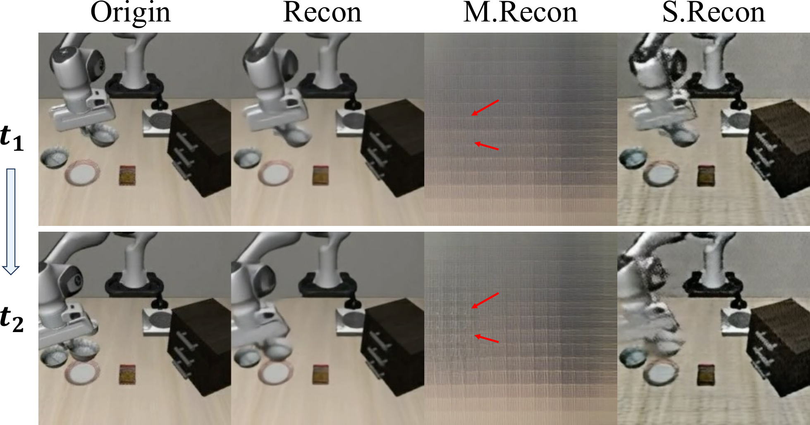

> 图 3 | 解耦运动与结构潜在表示的可视化。我们选取两帧（$t_{1}$ 和 $t_{2}$）并展示原始（Orig.）与重建（Recon.）帧。“M. Recon.”和“S. Recon.”分别表示仅使用运动潜在表示或仅使用结构潜在表示解码得到的重建结果。结构潜在表示保留了全局场景布局，而运动潜在表示则捕捉了运动及细粒度的时间细节。

### 4.3 与 SOTA 方法的比较（Comparison with SOTA Methods）

我们将 CoWVLA（Compositional World-model-based Vision-Language-Action）与三类代表性方法进行了比较： **VLA 基线方法（VLA baselines）** （OpenVLA [24]、SpatialVLA [36]、CogACT [28]、DiTA [21]、$\pi_{0}$ [3]、$\pi_{0}$-FAST [35]、GR00T-N1 [2]）、 **潜在动作方法（Latent-action approaches）** （LAPA [54]、villa-X [11]、TLA [6]）以及 **世界模型方法（World-model approaches）** （WorldVLA [7]、CoT-VLA [57]、UniVLA [50]、FlowVLA [58]）。
这些方法分别建模：（i）直接的动作，（ii）帧到帧的潜在状态转移，以及（iii）像素/词元级别的未来帧。
它们共同代表了当前 VLA 预训练的主要范式，并提供了有力且公平的比较基准。
结果如表 [1](#S3.T1) 所示。

总体而言，我们的 CoWVLA 实现了 **最先进（State-Of-The-Art, SOTA）** 的性能，并具有卓越的跨领域鲁棒性。
我们观察到，TLA 在 LIBERO 上取得了 0.952 的优异成绩，但在 SimplerEnv 上显著下降至 0.480；而 FlowVLA 在 SimplerEnv 上表现强劲（0.740），但在 LIBERO 上明显较弱（0.881）。UniVLA 则展现出更均衡的性能（0.950/0.698）。
相比之下，CoWVLA 在两个基准测试上分别取得了 0.956/0.760 的成绩，在两项上都超越了 UniVLA，展示了更高的绝对性能和更强的跨领域稳定性。

### 4.4 潜在运动分析（Latent Motion Analysis）

在本小节中，我们从三个角度分析所提出的解耦潜在空间的有效性：结构与运动因子的分离、在机器人数据上微调后运动潜在表示适应性的提升，以及建模未来动态能力的增强。这些结果共同验证了我们的潜在运动表示提供了更清晰的物理先验和更强的动作推理能力。

**结构与运动潜在表示的有效解耦（Effective decoupling of structure and motion latent）** 。
如图 [3](#S4.F3) 所示，我们仅使用运动潜在表示（M. Recon.）或仅使用结构潜在表示（S. Recon.）来重建帧。
结构潜在表示保留了全局场景布局和物体外观，而运动潜在表示则捕捉了机械臂轨迹和细粒度的时间动态。
图 [4](#S4.F4) 通过交叉重建提供了进一步的证据。
由于运动线索在单帧图像中较为细微，我们可视化了逐像素差异，这突出了受运动影响的区域，并表明注入运动潜在表示仅改变动态部分，同时保持静态结构完好无损。
这些可视化结果表明，我们的潜在空间有效地分离了内容结构和动态信息，为下游的视觉运动推理提供了更具可解释性的表示。

**在机器人数据上微调提升了运动潜在表示质量（Fine-tuning on robot data improves motion latent quality）** 。
如表 [2](#S4.T2) 所示，在机器人数据上微调潜在运动提取器不仅提高了重建质量（更高的 PSNR 和 SSIM），还提升了下游性能。在 SimplerEnv-WidowX 评估中，平均任务成功率从 0.729 提高到了 0.760。这证实了适应机器人领域的运动潜在表示包含了更高质量的动态线索，有利于策略学习。

| Model          | Reconstruction Metrics | Simulation Evaluation |             |            |           |              |         |       |
| -------------- | ---------------------- | --------------------- | ----------- | ---------- | --------- | ------------ | ------- | ----- |
| PSNR$\uparrow$ | SSIM$\uparrow$         | LPIPS$\downarrow$     | Stack Block | Put Carrot | Put Spoon | Put Eggplant | Average |       |
| Pretrain       | 32.7                   | 0.923                 | 0.122       | 0.458      | 0.750     | 0.792        | 0.917   | 0.729 |
| Finetune       | 33.4                   | 0.934                 | 0.123       | 0.625      | 0.667     | 0.792        | 0.958   | 0.760 |

> 图 3 | 解耦运动与结构潜在表示的可视化。我们选取两帧（$t_{1}$ 和 $t_{2}$）并展示原始（Orig.）与重建（Recon.）帧。“M. Recon.”和“S. Recon.”分别表示仅使用运动潜在表示或仅使用结构潜在表示解码得到的重建结果。结构潜在表示保留了全局场景布局，而运动潜在表示则捕捉了运动及细粒度的时间细节。

### 4.3 与 SOTA 方法的比较（Comparison with SOTA Methods）

我们将 CoWVLA 与三类代表性方法进行了比较： **VLA 基线方法（VLA baselines）** （OpenVLA [24]、SpatialVLA [36]、CogACT [28]、DiTA [21]、$\pi_{0}$ [3]、$\pi_{0}$-FAST [35]、GR00T-N1 [2]）、 **潜在动作方法（Latent-action approaches）** （LAPA [54]、villa-X [11]、TLA [6]）以及 **世界模型方法（World-model approaches）** （WorldVLA [7]、CoT-VLA [57]、UniVLA [50]、FlowVLA [58]）。
这些方法分别建模：（i）直接的动作，（ii）帧到帧的潜在状态转移，以及（iii）像素/词元级别的未来帧。
它们共同代表了当前 VLA 预训练的主要范式，并提供了有力且公平的比较基准。
结果如表 [1](#S3.T1) 所示。

总体而言，我们的 CoWVLA 实现了 **最先进（State-Of-The-Art, SOTA）** 的性能，并具有卓越的跨领域鲁棒性。
我们观察到，TLA 在 LIBERO 上取得了 0.952 的优异成绩，但在 SimplerEnv 上显著下降至 0.480；而 FlowVLA 在 SimplerEnv 上表现强劲（0.740），但在 LIBERO 上明显较弱（0.881）。UniVLA 则展现出更均衡的性能（0.950/0.698）。
相比之下，CoWVLA 在两个基准测试上分别取得了 0.956/0.760 的成绩，在两项上都超越了 UniVLA，展示了更高的绝对性能和更强的跨领域稳定性。

### 4.4 潜在运动分析（Latent Motion Analysis）

在本小节中，我们从三个角度分析所提出的解耦潜在空间的有效性：结构与运动因子的分离、在机器人数据上微调后运动潜在表示适应性的提升，以及建模未来动态能力的增强。这些结果共同验证了我们的潜在运动表示提供了更清晰的物理先验和更强的动作推理能力。

**结构与运动潜在表示的有效解耦（Effective decoupling of structure and motion latent）** 。
如图 [3](#S4.F3) 所示，我们仅使用运动潜在表示（M. Recon.）或仅使用结构潜在表示（S. Recon.）来重建帧。

**运动潜变量（Motion latent）增强未来帧预测的动态建模能力。**
如图 [5](#figure-5) 所示，我们可视化了不同预训练策略下的未来帧预测结果。
在每个子图中，从上到下的任务分别是：
i) 从桌子中央拿起黑色碗并将其放在盘子上，
ii) 扫成一堆。
基于 **世界模型（World model）** 的方法会重建冗余的背景像素，因此难以专注于交互运动；而 **单目标帧预测（Single-goal-frame prediction）** 则缺乏对时间演化的监督，常常产生不稳定的目标帧。
这导致两种策略都容易生成没有变化的结果，例如图 [5](#figure-5) (b) 中的任务 i。
相比之下，我们的模型在推理过程中利用运动潜变量作为“世界链（chain of world）”，实现了物理上合理且更符合指令的未来状态。

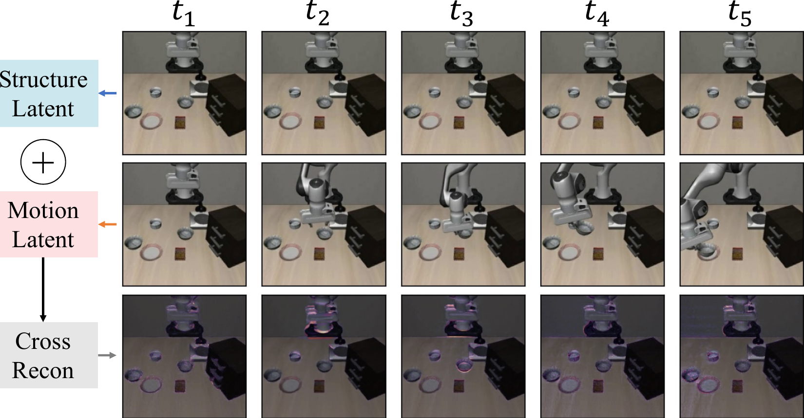

> 图 4 | 交叉重建可视化。我们从第一行的静态视频中提取 **结构潜变量（Structure latent）** ，从第二行的机械臂运动视频中提取运动潜变量。通过结合这两个潜变量，我们重建了第三行所示的视频。我们计算交叉重建帧与静态帧之间的差异以突出显示变化区域，这些区域对应机械臂的运动。

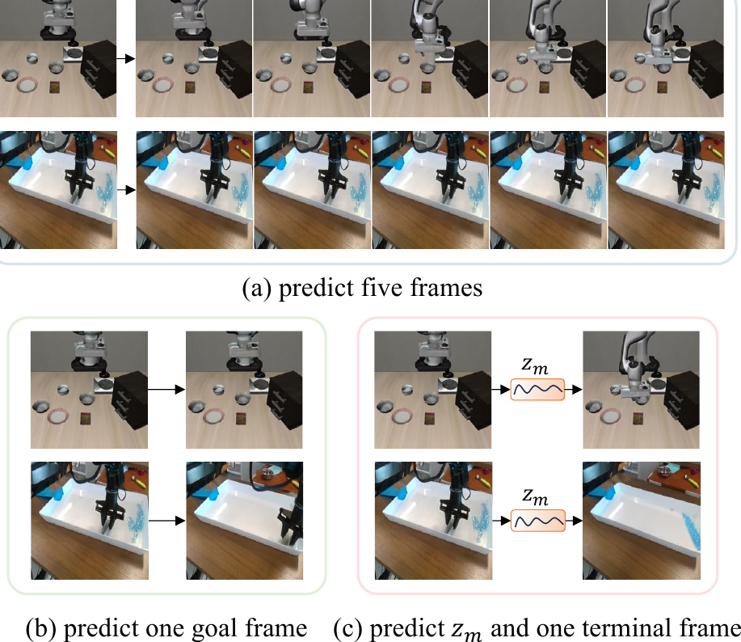

> 图 5 | 未来帧预测策略的比较可视化。展示了两个任务：i) 从桌子中央拿起黑色碗并将其放在盘子上，以及 ii) 扫成一堆。(a) 世界模型方法预测五个未来帧。(b) 单目标帧方法预测一个目标帧。(c) 我们的方法通过学习到的运动潜变量 $z_{m}$ 进行推理，产生更合理且与指令对齐的帧。

### 4.5 消融与效率分析（Ablation and Efficiency Analysis）

在本节中，我们对关键模块、超参数设置和训练效率进行了深入分析。
表 [3](#table-3) 和表 [4](#table-4) 中的实验遵循统一的数据集和训练配置，预训练阶段批次大小为 256，训练 10k 步；协同微调（Co-fine-tuning）阶段批次大小为 128，训练 8k 步。
在表 [3](#table-3) 中，我们统一比较了 **潜动作（Latent action）** 、世界模型和我们提出的方法的有效性。
在表 [4](#table-4) 中，我们分析了协同微调策略期间， **潜运动损失（Latent motion loss）** ($\lambda_{1}$) 与 **视觉词元损失（Visual token loss）** ($\lambda_{2}$) 之间的损失权重比对任务成功率的影响。
此外，我们在图 [6](#S4.F6) 中分析了不同方法的预训练成本和任务成功率。
主要结论如下。

> 表 3 | 在 LIBERO [32] 基准测试上的消融研究。

表 4 | 在 LIBERO [32] 基准上的损失权重消融研究。
| 配置（Config） | 变体（Variant） | 空间（Spatial） | 物体（Object） | 目标（Goal） | 长序列（Long） | 平均（Average） |
| :--- | :--- | :---: | :---: | :---: | :---: | :---: |
| **潜在动作（Latent Action）** | w/o LA | 0.622 | 0.146 | 0.694 | 0.328 | 0.448 |
| | LAPA 风格（LAPA style） | 0.718 | 0.852 | 0.804 | 0.488 | 0.716 |
| | villa-X 风格（villa-X style） | 0.840 | 0.904 | 0.834 | 0.668 | 0.812 |
| | 结构潜在（structure latent） | 0.856 | 0.898 | 0.822 | 0.692 | 0.817 |
| | 运动潜在（motion latent） | 0.916 | 0.932 | 0.886 | 0.774 | 0.877 |
| **世界模型（World Model）** | UniVLA 风格（UniVLA Style） | 0.958 | 0.978 | 0.932 | 0.898 | 0.942 |
| | CoT-VLA 风格（CoT-VLA style） | 0.942 | 0.964 | 0.950 | 0.838 | 0.924 |
| **我们的方法（Ours）** | 运动（motion） | 0.960 | 0.980 | 0.922 | 0.882 | 0.936 |
| | 运动与链式思考（motion & cot） | 0.948 | 0.974 | 0.958 | 0.906 | 0.947 |

i) **我们的潜在运动建模显著优于现有的潜在动作方法。**
表 [3](#S4.T3) 的“潜在动作（Latent Action）”部分比较了几种基线方法。跳过预训练、直接在 LIBERO 数据上进行微调的“w/o LA”变体取得了最低的平均成功率（0.448）。“LAPA 风格（LAPA style）”（0.716）和“villa-X 风格（villa-X style）”（0.812）均优于“w/o LA”变体，其中“villa-X 风格”通过建模更丰富的多帧信息取得了更强的性能。我们的方法将潜在表示分离为捕获内容和纹理的“结构潜在（structure latent）”（0.817）以及编码动态信息的“运动潜在（motion latent）”（0.877）。使用更纯净的运动进行建模显著提高了任务成功率。

ii) **世界模型方法展现出比潜在动作方法更强的整体性能。**
在表 [3](#S4.T3) 的“世界模型（World Model）”部分，“UniVLA 风格（UniVLA style）”（使用六帧预训练）和“CoT-VLA 风格（CoT-VLA style）”（使用初始帧和目标帧预训练）都取得了比“潜在动作”类别方法更高的成功率（分别为 0.942 和 0.924）。值得注意的是，使用更多帧的“UniVLA 风格”表现更好，这表明世界模型方法在时序建模和学习环境演化知识方面具有明显优势。

iii) **我们的方法取得了优于潜在动作和世界模型的性能。**
表 [3](#S4.T3) 的“我们的方法（Ours）”部分展示了我们方法的两种配置。两者均在预训练阶段使用潜在运动监督，并在微调阶段设置 $\lambda_{1}=0.1,\lambda_{2}=0$（即仅使用真实动作和潜在运动损失）。“运动（motion）”配置在预训练时不使用最终帧 $v_{f}$，取得了 0.936 的成功率。相比之下，“运动与链式思考（motion & cot）”配置在预训练时增加了来自 $v_{f}$ 的监督，并将成功率提升至 0.947。这得出两个结论：首先，在微调阶段引入潜在运动能有效指导真实动作的推断；其次，在预训练阶段引入 $v_{f}$ 作为演化目标，显著增强了模型对环境演化的感知和理解能力。

表 4 | 基于同一预训练模型，在协同微调阶段对损失权重 $\lambda_{1}$（潜在运动）和 $\lambda_{2}$（视觉词元）进行的消融研究。
| $\lambda_{1}$ | $\lambda_{2}$ | Spatial | Object | Goal | Long | Average |
| :-----------: | :-----------: | :-----: | :----: | :---: | :---: | :-----: |
| 0.0 | 0.0 | 0.922 | 0.962 | 0.862 | 0.742 | 0.872 |
| 0.1 | 0.0 | 0.960 | 0.980 | 0.922 | 0.882 | 0.936 |
| 1.0 | 0.0 | 0.958 | 0.970 | 0.950 | 0.902 | 0.945 |
| 0.1 | 0.05 | 0.954 | 0.972 | 0.944 | 0.914 | 0.946 |
| 0.1 | 0.01 | 0.970 | 0.964 | 0.958 | 0.926 | 0.955 |
| 1.0 | 0.01 | 0.970 | 0.956 | 0.934 | 0.922 | 0.946 |

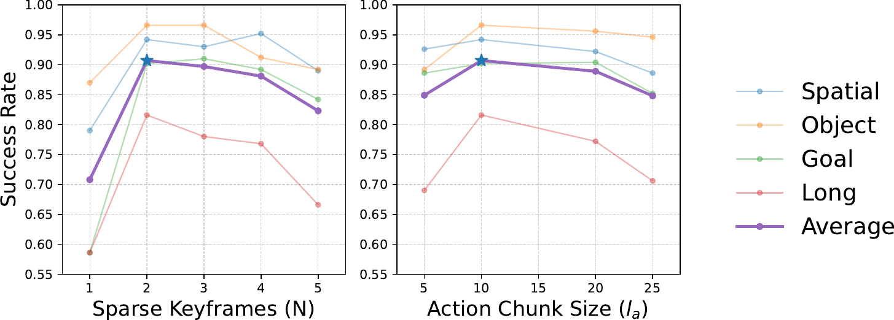

> 图 6 | 不同方法在 LIBERO [32] 上的预训练效率与任务性能对比。蓝色和橙色圆圈分别表示世界模型和潜在动作基线，绿色圆圈表示我们的配置。圆圈大小表示训练时的 GPU 内存使用量。我们的方法平衡了预训练效率与性能，以适中的计算效率实现了更高的成功率。

iv) **在协同微调期间平衡潜在运动与视觉词元损失可进一步提升性能。**
表 [4](#S4.T4) 展示了基于同一预训练模型，在协同微调阶段对损失权重 $\lambda_{1}$（潜在运动）和 $\lambda_{2}$（视觉词元）进行的消融研究。
首先，我们固定 $\lambda_{2}=0$ 来分析 $\lambda_{1}$ 的影响。当 $\lambda_{1}=0$（无潜在运动损失）时，成功率仅为 0.872。随着 $\lambda_{1}$ 从 0.1 增加到 1.0，成功率从 0.936 提升至 0.945，表明潜在运动的引导作用在增强。
接下来，我们引入视觉词元损失 $\lambda_{2}$。
通过比较 ($\lambda_{1}=0.1,\lambda_{2}=0.05$) 的 0.946 和 ($\lambda_{1}=0.1,\lambda_{2}=0.01$) 的 0.955，我们发现视觉词元预测的权重不应设置过高。
然后我们调整 $\lambda_{1}=1.0$ 和 $\lambda_{2}=0.01$，获得了 0.946 的平均成功率。
这证明在微调阶段同时引入潜在运动 ($\lambda_{1}=0.1$) 和低权重的视觉词元预测 ($\lambda_{2}=0.01$) 能最有效地引导真实动作的推断。

v) **我们的方法平衡了预训练效率与性能。**
如图 [6](#S4.F6) 所示，我们从训练速度、GPU 内存使用量和任务成功率（每个 GPU 的批次大小 = 4）方面比较了表 [3](#S4.T3) 中的几种方法。
UniVLA 速度最慢且内存消耗最大，而 LAPA 速度最快但成功率较低。
我们的方法有两种配置：不含 $v_{f}$ 的“motion”配置速度第二快，性能略低于 UniVLA；而包含 $v_{f}$ 的“motion & cot”配置在效率与性能之间取得了更好的平衡，在两方面均超越了 UniVLA。

## 5 结论（Conclusion）

在本工作中，我们提出了 **CoWVLA** ，它首次将 **世界模型（World models）** 的时间推理能力与解耦的潜在运动表示相结合，从而能够在结构-运动分离的潜在空间中直接进行世界建模。通过引入 **世界链（Chain-of-World）** 范式，我们的方法能够根据指令和初始观测，预测一个连续的潜在运动链和一个终止关键帧，从而紧凑地捕捉时间演化和物理动态，而无需重建中间像素。在 LIBERO 和 SimplerEnv 基准测试上进行的大量实验表明， **CoWVLA** 的性能优于世界模型和潜在动作方法，同时提供了改进的动态一致性和视觉运动基础，从而为通用机器人操作提供了一条更高效的预训练路径。

**局限性（Limitations）** 。
尽管取得了有希望的结果，我们的方法仍然存在局限性。潜在运动空间仍然依赖于预训练视频 **变分自编码器（Variational Autoencoder, VAE）** 的质量和领域覆盖范围，这可能会在新环境中引入分布不匹配。此外，该模型依赖于一个大型的 **视觉语言动作模型（Vision-Language-Action, VLA）** 主干和大量的计算资源。我们相信，探索更轻量级和可扩展的架构，以及进一步增强潜在动态与动作学习之间的耦合，将拓宽我们方法在现实世界机器人技术中的适用性。

## 6 Acknowledgments（致谢）

本研究得到了以下项目的资助：国家自然科学基金（项目批准号：62277011）、重庆市经济和信息化委员会项目（项目批准号：YJX-2025001001009），以及 CAAI-CANN 开放基金。本研究在 OpenI 社区平台上完成。

## 参考文献（References）

- Assran 等人 [2025]
  Mido Assran, Adrien Bardes, David Fan, 等人。
  V-JEPA 2：自监督视频模型实现理解、预测与规划。
  _arXiv 预印本 arXiv:2506.09985_, 2025。
- Bjorck 等人 [2025]
  Johan Bjorck, Fernando Castañeda, Nikita Cherniadev, Xingye Da, Runyu Ding, 等人。
  Gr00t n1：一个用于通用人形机器人的开放基础模型。
  _arXiv 预印本 arXiv:2503.14734_, 2025。
- Black 等人 [2024]
  Kevin Black, Noah Brown, Danny Driess, 等人。
  $\pi_{0}$：用于通用机器人控制的视觉-语言-动作流模型。
  _arXiv 预印本 arXiv:2410.24164_, 2024。
- Brohan 等人 [2022]
  Anthony Brohan, Noah Brown, 等人。
  RT-1：用于大规模现实世界控制的机器人变换器。
  _arXiv 预印本 arXiv:2212.06817_, 2022。
- Bruce 等人 [2024]
  Jake Bruce, Michael D Dennis, Ashley Edwards, Jack Parker-Holder, 等人。
  Genie：生成式交互环境。
  发表于 _ICML（国际机器学习大会）_, 2024。
- Bu 等人 [2025]
  Qingwen Bu, Yanting Yang, Jisong Cai, 等人。
  学习以任务为中心的潜在动作在任何地方行动。
  发表于 _RSS（机器人科学与系统大会）_, 2025。
- Cen 等人 [2025]
  Jun Cen, Chaohui Yu, Hangjie Yuan, Yuming Jiang, Siteng Huang, 等人。
  WorldVLA：迈向自回归动作世界模型。
  _arXiv 预印本 arXiv:2506.21539_, 2025。
- Cheang 等人 [2024]
  Chi-Lam Cheang, Guangzeng Chen, Ya Jing, Tao Kong, 等人。
  GR-2：一个具备网络规模知识、用于机器人操作的生成式视频-语言-动作模型。
  _arXiv 预印本 arXiv:2410.06158_, 2024。
- Chen 等人 [2023]
  Lili Chen, Shikhar Bahl, 和 Deepak Pathak。
  Playfusion：通过基于语言标注演示的扩散进行技能获取。
  发表于 _CoRL（机器人学习大会）_, 第 2012–2029 页, 2023。
- Chen 等人 [2024]
  Lawrence Yunliang Chen, Simeon Adebola, 和 Ken Goldberg。
  伯克利 UR5 演示数据集, 2024。
- Chen 等人 [2025a]
  Xiaoyu Chen, Hangxing Wei, Pushi Zhang, Chuheng Zhang, Kaixin Wang, 等人。
  villa-X：增强视觉-语言-动作模型中的潜在动作建模。
  _arXiv 预印本 arXiv:2507.23682_, 2025a。
- Chen 等人 [2025b]
  Yi Chen, Yuying Ge, Yizhuo Li, Yixiao Ge, Mingyu Ding, Ying Shan, 和 Xihui Liu。
  Moto：作为机器人操作桥梁语言的潜在运动词元。
  发表于 _ICCV（国际计算机视觉大会）_, 2025b。
- Chi 等人 [2023]
  Cheng Chi, Siyuan Feng, Yilun Du, Zhenjia Xu, 等人。
  扩散策略：通过动作扩散进行视觉运动策略学习。
  发表于 _RSS（机器人科学与系统大会）_, 2023。
- Di 等人 [2025]
  Donglin Di, He Feng, Wenzhang Sun, Yongjia Ma, Hao Li, Wei Chen, Lei Fan, Tonghua Su, 和 Xun Yang。
  DH-FaceVid-1K：一个用于人脸视频生成的大规模高质量数据集。
  发表于 _ICCV（国际计算机视觉大会）_, 第 12124–12134 页, 2025。
- Esser 等人 [2021]
  Patrick Esser, Robin Rombach, 和 Bjorn Ommer。
  驯服变换器用于高分辨率图像合成。
  发表于 _CVPR（计算机视觉与模式识别会议）_, 第 12873–12883 页, 2021。
- Fan 等人 [2025a]
  Lei Fan, Dongdong Fan, Zhiguang Hu, Yiwen Ding, Donglin Di, Kai Yi, Maurice Pagnucco, 和 Yang Song。
  Manta：一个用于微小物体的大规模多视角和视觉-文本异常检测数据集。
  发表于 _CVPR（计算机视觉与模式识别会议）_, 第 25518–25527 页, 2025a。
- Fan 等人 [2025b]
  Lei Fan, Junjie Huang, Donglin Di, Anyang Su, Tianyou Song, Maurice Pagnucco, 和 Yang Song。
  挽救被忽视的：利用类别感知对比学习进行多类别异常检测。
  发表于 _ICCV（国际计算机视觉大会）_, 第 21419–21428 页, 2025b。
- Gao 等人 [2025a]
  Chongkai Gao, Zixuan Liu, Zhenghao Chi, Junshan Huang, Xin Fei, Yiwen Hou, Yuxuan Zhang, Yudi Lin, Zhirui Fang, 和 Lin Shao。
  VLA-OS：在视觉-语言-动作模型中构建和解构规划表示与范式。
  发表于 _NeurIPS（神经信息处理系统大会）_, 2025a。
- Gao 等人 [2025b]
  Shenyuan Gao, Siyuan Zhou, Yilun Du, Jun Zhang, 和 Chuang Gan。
  AdaWorld：使用潜在动作学习适应性世界模型。
  发表于 _ICML（国际机器学习大会）_, 2025b。
- Gu 等人 [2023]
  Jiayuan Gu, Fanbo Xiang, Xuanlin Li, Zhan Ling, Xiqiang Liu, Tongzhou Mu, Yihe Tang, Stone Tao, Xinyue Wei, Yunchao Yao, 等人。
  ManiSkill2：一个用于可泛化操作技能的统一基准。
  _arXiv 预印本 arXiv:2302.04659_, 2023。
- Hou 等人 [2025]
  Zhi Hou, Tianyi Zhang, Yuwen Xiong, Haonan Duan, 等人。
  Dita：扩展扩散变换器用于通用视觉-语言-动作策略。
  发表于 _ICCV（国际计算机视觉大会）_, 2025。
- Intelligence 等人 [2025]
  Physical Intelligence, Kevin Black, Noah Brown, 等人。
  $\pi_{0.5}$：一个具备开放世界泛化能力的视觉-语言-动作模型。
  _arXiv 预印本 arXiv:2504.16054_, 2025。
- Kalashnikov 等人 [2018]
  Dmitry Kalashnikov, Alex Irpan, Peter Pastor, Julian Ibarz, 等人。
  用于基于视觉的机器人操作的可扩展深度强化学习。
  发表于 _CoRL（机器人学习大会）_, 第 651–673 页, 2018。
- Kim 等人 [2024]
  Moo Jin Kim, Karl Pertsch, Siddharth Karamcheti, Ted Xiao, Ashwin Balakrishna, 等人。
  OpenVLA：一个开源的视觉-语言-动作模型。
  发表于 _CoRL（机器人学习大会）_, 2024。
- Kim 等人 [2025]
  Moo Jin Kim, Chelsea Finn, 和 Percy Liang。
  微调视觉-语言-动作模型：优化速度与成功率。
  发表于 _RSS（机器人科学与系统大会）_, 2025。
- Lew 等人 [2025]
  Jaihyun Lew, Jooyoung Choi, Chaehun Shin, Dahuin Jung, 和 Sungroh Yoon。
  用于视频帧插值的解耦运动建模。
  发表于 _AAAI（人工智能促进协会会议）_, 第 4607–4615 页, 2025。
- Li 等人 [2023]
  Junnan Li, Dongxu Li, Silvio Savarese, 和 Steven Hoi。
  BLIP-2：使用冻结图像编码器和大型语言模型引导语言-图像预训练。
  发表于 _ICML（国际机器学习大会）_, 第 19730–19742 页。PMLR, 2023。
- Li 等人 [2024a]
  Qixiu Li, Yaobo Liang, Zeyu Wang, Lin Luo, 等人。
  CogACT：一个用于在机器人操作中协同认知与动作的基础视觉-语言-动作模型。
  _arXiv 预印本 arXiv:2411.19650_, 2024a。
- Li 等人 [2025]
  Shuang Li, Yihuai Gao, Dorsa Sadigh, 和 Shuran Song。
  统一视频动作模型。
  发表于 \_RSS（机器人科学与系统大会）

- Open-sora plan: Open-source large video generation model.
  _arXiv preprint arXiv:2412.00131_, 2024.
- Liu 等人 [2023]
  Bo Liu, Yifeng Zhu, Chongkai Gao, Yihao Feng, Qiang Liu, Yuke Zhu, and Peter Stone.
  LIBERO: 终身机器人学习中知识迁移的基准测试。
  In _NeurIPS_, 2023.
- Mees 等人 [2022]
  Oier Mees, Lukas Hermann, Erick Rosete-Beas, and Wolfram Burgard.
  Calvin: 面向长视野机器人操作任务的语言条件策略学习的基准。
  _RA-L_, 7(3):7327–7334, 2022.
- O’Neill 等人 [2024]
  Abby O’Neill, Abdul Rehman, Abhiram Maddukuri, Abhishek Gupta, Abhishek Padalkar, et al.
  Open x-embodiment: 机器人学习数据集与 rt-x 模型：Open x-embodiment 协作。
  In _ICRA_, pages 6892–6903, 2024.
- Pertsch 等人 [2025]
  Karl Pertsch, Kyle Stachowicz, Brian Ichter, Danny Driess, et al.
  Fast: 面向视觉-语言-动作模型的高效动作标记化。
  _arXiv preprint arXiv:2501.09747_, 2025.
- Qu 等人 [2025]
  Delin Qu, Haoming Song, Qizhi Chen, Yuanqi Yao, Xinyi Ye, et al.
  Spatialvla: 探索视觉-语言-动作模型的空间表征。
  In _RSS_, 2025.
- Rosete-Beas 等人 [2023]
  Erick Rosete-Beas, Oier Mees, Gabriel Kalweit, Joschka Boedecker, and Wolfram Burgard.
  面向任务无关离线强化学习的潜在规划。
  In _CoRL_, pages 1838–1849, 2023.
- Routray 等人 [2026]
  Sandeep Routray, Hengkai Pan, Unnat Jain, Shikhar Bahl, and Deepak Pathak.
  Vipra: 面向机器人动作的视频预测。
  In _ICLR_, 2026.
- Shah 等人 [2023]
  Rutav Shah, Roberto Martín-Martín, and Yuke Zhu.
  Mutex: 从多模态任务规范中学习统一策略。
  _arXiv preprint arXiv:2309.14320_, 2023.
- Shi 等人 [2024]
  Xiaoyu Shi, Zhaoyang Huang, Fu-Yun Wang, et al.
  Motion-i2v: 通过显式运动建模实现一致且可控的图像到视频生成。
  In _ACM SIGGRAPH_, pages 1–11, 2024.
- Sun 等人 [2025]
  Shibo Sun, Xue Li, Donglin Di, Mingjie Wei, Lanshun Nie, Wei-Nan Zhang, Dechen Zhan, Yang Song, and Lei Fan.
  Llapa: 一个面向反事实感知过程规划的视觉-语言模型框架。
  In _ACM MM_, pages 5020–5029, 2025.
- Sun 等人 [2024]
  Zhenhong Sun, Junyan Wang, Zhiyu Tan, Daoyi Dong, Hailan Ma, Hao Li, and Dong Gong.
  Eggen: 通过实体引导进行多实体先验学习的图像生成。
  In _ACM MM_, pages 6637–6645, 2024.
- Walke 等人 [2023]
  Homer Rich Walke, Kevin Black, Tony Z Zhao, et al.
  Bridgedata v2: 一个用于大规模机器人学习的数据集。
  In _CoRL_, pages 1723–1736, 2023.
- Wan 等人 [2025]
  Team Wan, Ang Wang, Baole Ai, Bin Wen, Chaojie Mao, et al.
  Wan: 开放且先进的大规模视频生成模型。
  _arXiv preprint arXiv:2503.20314_, 2025.
- Wang 等人 [2024a]
  Junyan Wang, Zhenhong Sun, Zhiyu Tan, Xuanbai Chen, Weihua Chen, Hao Li, Cheng Zhang, and Yang Song.
  在基于文本的人体图像生成的扩散模型中有效利用以人为中心的先验。
  In _CVPR_, pages 8446–8455, 2024a.
- Wang 等人 [2026a]
  Kun Wang, Xiao Feng, Mingcheng Qu, and Tonghua Su.
  Hmvla: 面向视觉-语言-动作模型的 **双曲多模态融合（Hyperbolic multimodal fusion）** 。
  _arXiv preprint arXiv:2602.02533_, 2026a.
- Wang 等人 [2024b]
  Xinlong Wang, Xiaosong Zhang, Zhengxiong Luo, Quan Sun, et al.
  Emu3: **下一词元预测（Next-token prediction）** 即你所需。
  _arXiv preprint arXiv:2409.18869_, 2024b.
- Wang 等人 [2024c]
  Yuqi Wang, Jiawei He, Lue Fan, Hongxin Li, Yuntao Chen, and Zhaoxiang Zhang.
  驶向未来：用于自动驾驶的基于世界模型的多视角视觉预测与规划。
  In _CVPR_, pages 14749–14759, 2024c.
- Wang 等人 [2025]
  Yuchi Wang, Junliang Guo, Xinyi Xie, Tianyu He, Xu Sun, and Jiang Bian.
  Vidtwin: 具有解耦结构与动态的视频 VAE。
  In _CVPR_, pages 22922–22932, 2025.
- Wang 等人 [2026b]
  Yuqi Wang, Xinghang Li, Wenxuan Wang, Junbo Zhang, Yingyan Li, Yuntao Chen, Xinlong Wang, and Zhaoxiang Zhang.
  统一的视觉-语言-动作模型。
  In _ICLR_, 2026b.
- Wei 等人 [2024]
  Julong Wei, Shanshuai Yuan, Pengfei Li, Qingda Hu, Zhongxue Gan, and Wenchao Ding.
  Occllama: 用于自动驾驶的占用-语言-动作生成世界模型。
  _arXiv preprint arXiv:2409.03272_, 2024.
- Wu 等人 [2024a]
  Hongtao Wu et al.
  释放大规模视频生成预训练用于视觉机器人操作。
  In _ICLR_, 2024a.
- Wu 等人 [2024b]
  Jialong Wu, Shaofeng Yin, Ningya Feng, Xu He, Dong Li, Jianye Hao, and Mingsheng Long.
  iVideoGPT: 交互式 VideoGPT 是可扩展的世界模型。
  In _NeurIPS_, pages 68082–68119, 2024b.
- Ye 等人 [2025]
  Seonghyeon Ye, Joel Jang, Byeongguk Jeon, Sejune Joo, Jianwei Yang, et al.
  从视频中进行潜在动作预训练。
  In _ICLR_, 2025.
- Yu 等人 [2024]
  Sihyun Yu, Weili Nie, De-An Huang, Boyi Li, Jinwoo Shin, and Anima Anandkumar.
  通过内容-帧-运动-潜在分解实现高效视频扩散模型。
  In _ICLR_, 2024.
- Zhang 等人 [2025]
  Wenyao Zhang, Hongsi Liu, Zekun Qi, Yunnan Wang, et al.
  Dreamvla: 一个蕴含全面世界知识的视觉-语言-动作模型。
  In _NeurIPS_, 2025.
- Zhao 等人 [2025]
  Qingqing Zhao, Yao Lu, Moo Jin Kim, Zipeng Fu, Zhuoyang Zhang, Yecheng Wu, et al.
  Cot-VLA: 面向视觉-语言-动作模型的视觉思维链推理。
  In _CVPR_, pages 1702–1713, 2025.
- Zhong 等人 [2025]
  Zhide Zhong, Haodong Yan, Junfeng Li, Xiangchen Liu, Xin Gong, et al.
  Flowvla: 面向视觉-语言-动作模型的基于思维链的运动推理。
  _arXiv preprint arXiv:2508.18269_, 2025.
- Zhou 等人 [2023]
  Gaoyue Zhou, Victoria Dean, Mohan Kumar Srirama, Aravind Rajeswaran, Jyothish Pari, Kyle Hatch, Aryan Jain, Tianhe Yu, Pieter Abbeel, Lerrel Pinto, et al.
  离线训练，在线测试：一个真实的机器人学习基准。
  _arXiv preprint arXiv:2306.00942_, 2023.
- Zhu 等人

- Zhu 等人 [2023]
  Yifeng Zhu, Abhishek Joshi, Peter Stone, and Yuke Zhu.
  Viola: 基于视觉操作的模仿学习与物体提议先验。
  收录于 _CoRL_，第 1199–1210 页，2023年。
- Zitkovich 等人 [2023]
  Brianna Zitkovich, Tianhe Yu, Sichun Xu, Peng Xu, et al.
  RT-2: 视觉-语言-动作模型将网络知识迁移至机器人控制。

## 1 实现细节

### 1.1 数据集

我们收集了高质量的机器人操作数据，用于微调 **潜在运动提取器（Latent Motion Extractor, LME）** 和训练 **视觉语言动作模型（Vision-Language-Action model, VLA）** ，所用数据集总结于表 [1](#S1.T1)。大部分数据来自 OXE [34] 数据集，我们还额外加入了 Calvin [33] 和 Libero [32] 仿真数据集。对于 LME 微调，我们仅使用情节帧。在 VLA 预训练阶段，我们同时使用情节帧和文本指令。遵循 UniVLA [50] 的做法，我们为每个数据集采用不同的采样间隔，以确保关键帧之间的时间间隔大约为一秒。然后，我们从六个关键帧覆盖的连续帧中均匀采样 16 帧用于预训练。在整个此阶段，仅使用第三人称视角数据，排除腕部摄像头视角。

在 VLA 协同微调阶段，我们使用文本指令、帧和动作，在特定基准测试的训练集上进行训练。例如，BridgeV2 数据集 [43] 用于 SimplerEnv-Bridge 评估 [30]，而 Libero [32] 评估则使用由 OpenVLA [24] 处理过的四个 Libero 任务套件的混合数据。此外，附录中包含了使用 Fractal 数据集 [4] 进行 Simpler-Google Robot [30] 评估和使用 Calvin 数据集 [33] 进行 Calvin 评估的扩展实验，涵盖了 ABCD$\rightarrow$D 和 ABC$\rightarrow$D 两种任务设置。在所有协同微调实验中，Bridge 和 Google Robot 的训练仅使用第三人称视角，而 Libero 和 Calvin 则同时使用第三人称和腕部视角。

### 1.2 训练细节

对于 LME 微调，我们从 VidTwin [49] 预训练模型开始，并在表 [1](#S1.T1) 所列数据集的视频数据上对其进行微调。
我们使用 4 块 A800 GPU，每 GPU 的批大小为 4，每个视频随机采样 16 帧。
每帧被调整为 224$\times$224 大小。
**KL 散度损失（KL loss）** 权重设置为 1e-6，并且 **重建损失（reconstruction loss）** 使用所有元素的平均值进行缩减，而非默认的仅对批次维度进行缩减。
我们从训练集中随机采样 1000 个视频作为验证集，并选择重建损失最低的检查点。
最终模型对应于训练了一个周期外加 20k 次迭代的检查点。

对于 VLA 预训练，我们从 85 亿参数的 Emu3 [47] 预训练检查点初始化，并在表 [1](#S1.T1) 的数据集上进行训练。
训练在 32 块 A800 GPU 上进行，每 GPU 批大小为 8。
图像观测被调整为 256$\times$256 大小。
我们使用每个视频片段的起始帧和结束帧以及一个可学习的运动查询，最大序列长度设置为 2500 个词元。
我们总共训练 10k 次迭代，大约需要 24 小时。

对于 VLA 协同微调，我们遵循 UniVLA [50] 为每个基准测试制定的评估方案。
我们加载 VLA 预训练阶段的检查点，并使用 16 块 A800 GPU 进行训练，每 GPU 批大小为 8，并进行全参数微调。
最大序列长度设置为 3200 个词元。
对于 SimplerEnv-Windowx [30]，我们使用 BridgeV2 [43] 数据，图像调整为 256$\times$256 大小，训练 12k 次迭代。
对于 SimplerEnv-Google Robot [30]，Fractal [4] 图像调整为 240$\times$192 大小，训练持续 16k 次迭代。
对于 Libero [32]，图像调整为 200$\times$200 大小，训练运行 8k 次迭代。
对于 Calvin [33]，第三人称视角调整为 200$\times$200 大小，腕部视角调整为 80$\times$80 大小，训练进行 12k 次迭代。
这些配置下每次迭代的训练时间相似；例如，Libero 训练 8k 次迭代大约需要 25 小时。
总体而言，每种配置大约需要一到两天的训练时间。

> 表 1 | 训练数据集。

| Dataset Name              | Count  |
| ------------------------- | ------ |
| Berkeley Autolab Ur5 [10] | 892    |
| Bridgev2 [43]             | 24879  |
| Cmu Play Fusion [9]       | 576    |
| Fractal [4]               | 65530  |
| Kuka [23]                 | 84202  |
| Maniskill [20]            | 30029  |
| Taco Play [37]            | 3242   |
| Toto [59]                 | 899    |
| Utaustin Mutex [39]       | 1500   |
| Viola [60]                | 135    |
| Calvin [33]               | 22966  |
| Libero [32]               | 1693   |
| Total                     | 236543 |

> 表 2 | 在 CALVIN [33] 基准测试上的长视野机器人操作评估。标有 ${\dagger}$ 的方法来自我们的重新实现。

| Method        | Task               | Tasks Completed in a Row | Avg. Len $\uparrow$ |       |       |       |       |
| ------------- | ------------------ | ------------------------ | ------------------- | ----- | ----- | ----- | ----- |
| 1             | 2                  | 3                        | 4                   | 5     |       |       |       |
| UniVLA^† [50] | ABCD$\rightarrow$D | 0.988                    | 0.934               | 0.883 | 0.829 | 0.764 | 4.398 |
| Ours          | 0.972              | 0.939                    | 0.894               | 0.859 | 0.809 | 4.473 |       |
| TLA [6]       | ABC$\rightarrow$D  | 0.955                    | 0.858               | 0.754 | 0.669 | 0.565 | 3.800 |
| Dita [21]     | 0.945              | 0.825                    | 0.728               | 0.613 | 0.500 | 3.610 |       |
| UniVLA^† [50] | 0.972              | 0.902                    | 0.826               | 0.741 | 0.661 | 4.102 |       |
| Ours          | 0.968              | 0.912                    | 0.844               | 0.779 | 0.708 | 4.211 |       |

> 表 3 | 在 SimplerEnv-Google Robot [30] 上跨多种操作任务的评估。

| Model                    | Pick  | Move  | Drawer | Place | Average |
| ------------------------ | ----- | ----- | ------ | ----- | ------- |
| OpenVLA [24]             | 0.180 | 0.563 | 0.630  | 0.000 | 0.343   |
| SpatialVLA [36]          | 0.860 | 0.779 | 0.574  | 0.090 | 0.576   |
| MoTo [12]                | 0.740 | 0.604 | 0.431  | 0.000 | 0.444   |
| villa-X [11]             | 0.987 | 0.750 | 0.593  | 0.056 | 0.597   |
| UniVLA [50]              | 0.870 | 0.565 | 0.194  | 0.167 | 0.449   |
| \rowcolorgray!20 Ours | 0.923 | 0.676 | 0.428  | 0.407 | 0.609   |

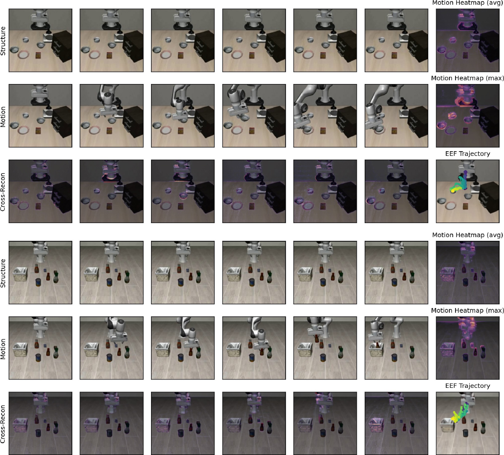

**图 1（Figure 1）** ：在 LIBERO 数据集上对 $N$ 和 $l_{a}$ 进行的敏感性分析。

**表 4（Table 4）** ：在 LIBERO 数据集上，我们的潜在运动表示与 Wan 2.1 VAE 潜在 $\mathbf{z}$ 的对比。

| 变体（Variant）    | 预训练（Pre-training）     | 协同微调（Co-fine-tuning） | 空间（Spatial） | 物体（Object） | 目标（Goal） | 长序列（Long） | 平均（Average） |
| :----------------- | :------------------------- | :------------------------- | :-------------- | :------------- | :----------- | :------------- | :-------------- |
| 我们的方法（Ours） | 潜在运动 + 终止帧          | + 潜在运动                 | 0.948           | 0.974          | 0.958        | 0.906          | 0.947           |
| Wan2.1 VAE [44]    | 潜在 $\mathbf{z}$ + 终止帧 | + 潜在 $\mathbf{z}$        | 0.938           | 0.950          | 0.922        | 0.868          | 0.920           |

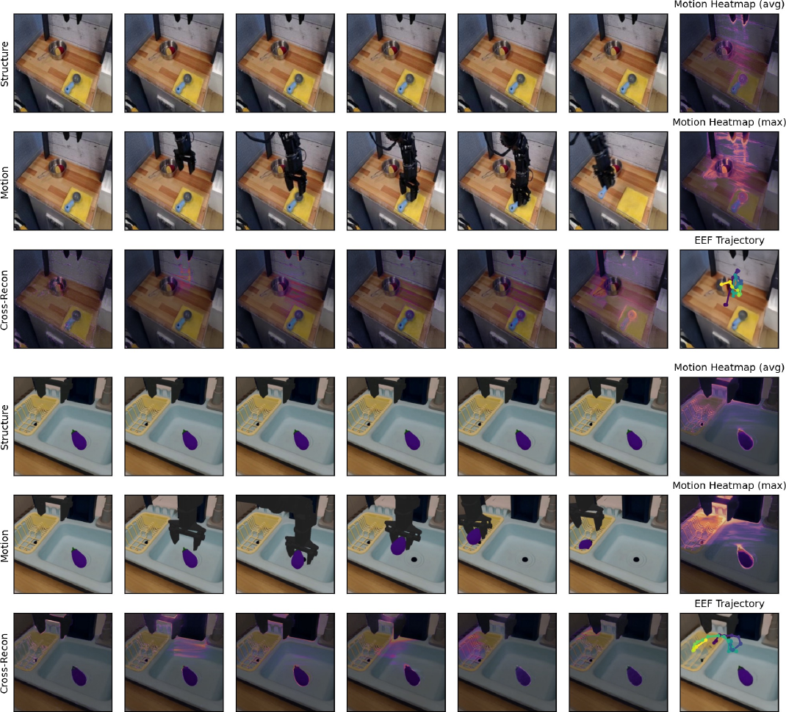

> **图 2（Figure 2）** ：在 LIBERO [32] 数据集上的跨模态重建可视化。前六列显示了来自三行的时序采样帧：结构（顶部）、运动（中部）和跨模态重建（底部）。跨模态重建视频是通过将结构视频中的静态外观与从运动视频中提取的运动表示相结合而生成的，揭示了被转移的运动模式。每个跨模态重建帧都叠加了运动热力图，以突出动态区域。最后一列展示了三个汇总图：通过对跨模态重建与结构之间的逐帧绝对差值进行平均和最大化得到的运动热力图，以及从运动区域估计出的末端执行器轨迹。

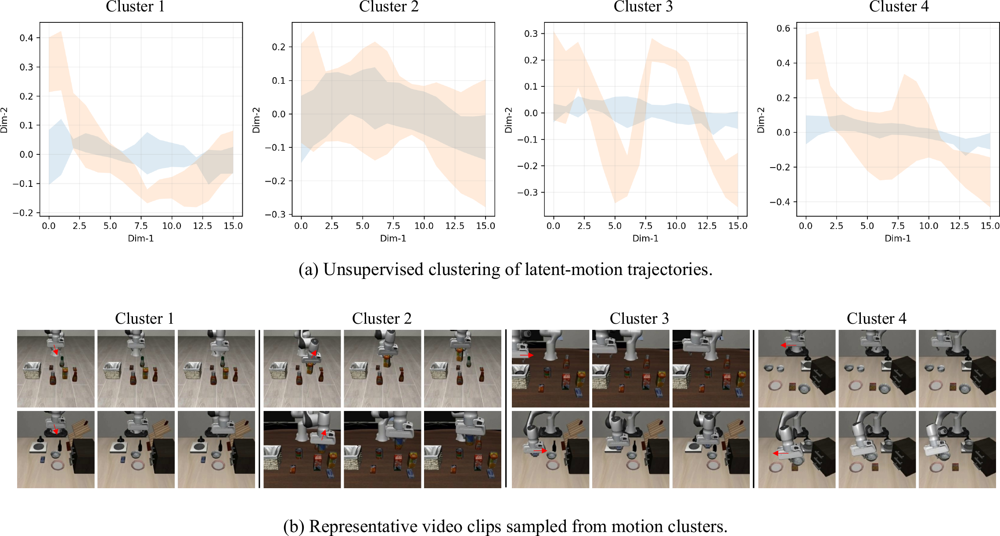

> **图 3（Figure 3）** ：在 SimplerEnv [30] 和 Bridgev2 [43] 数据集上的跨模态重建可视化。

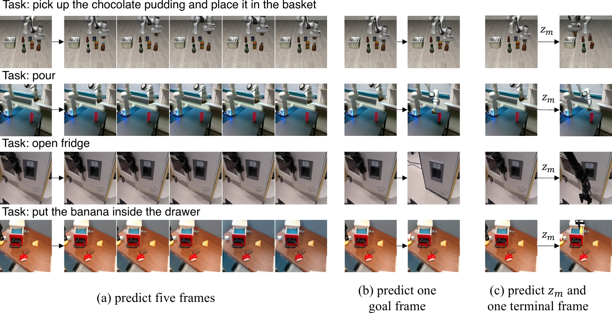

> **图 4（Figure 4）** ：潜在运动聚类及相应视频示例的可视化。(a) 片段级运动轨迹的无监督聚类结果。每个子图显示了一个聚类的平均二维运动轨迹（由累积的逐帧运动增量的前两个主成分分析（Principal Component Analysis, PCA）分量获得）。(b) 来自各聚类的代表性视频示例。聚类 1 和 2 对应于单调的类向下或类向上运动，而聚类 3 和 4 则表现出类向右或类向左的行为。

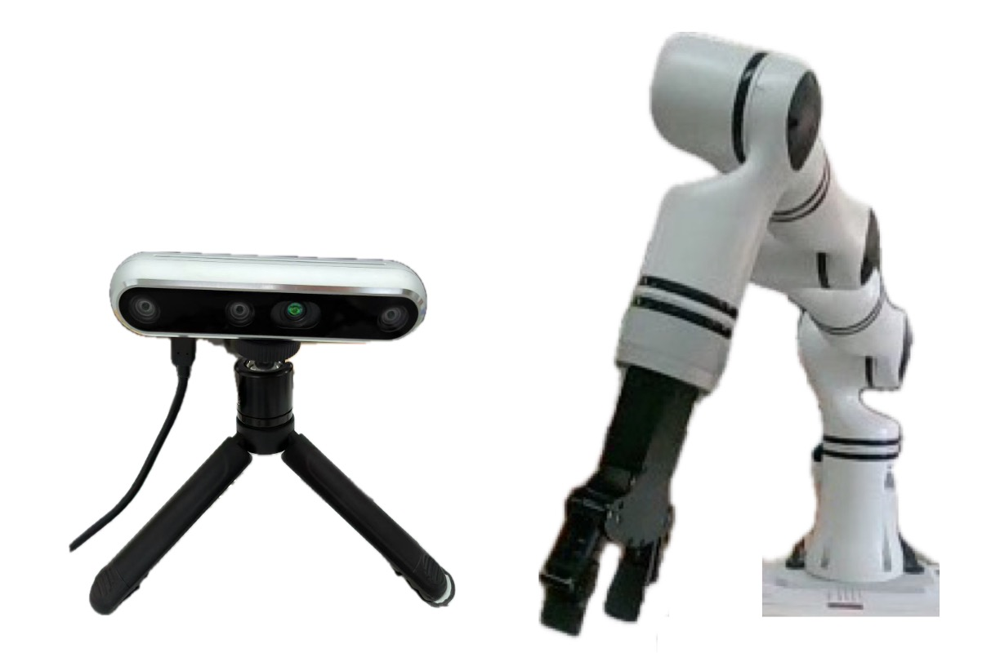

> **图 5（Figure 5）** ：未来帧预测策略的比较可视化。

### 1.3 世界模型与潜在运动链的解读

我们的方法将 **世界模型（world model）** 的公式化与 **潜在动作建模（latent action modeling）** 相结合。
世界模型组件包含两个阶段： **预训练（pre-training）** 和 **协同微调（co-fine-tuning）** 。
在预训练期间，世界模型不是 **动作条件化（action-conditioned）** 的。
这遵循了 UniVLA [50] 和 FlowVLA [58] 所采用的表示方法，即世界模型在给定语言指令和初始状态的情况下预测未来环境演化，而非依赖于显式动作。
在协同微调阶段，我们引入了动作条件化的公式：$p(v^{t+1}\mid v^{t},A^{t})$。

我们的潜在运动并不显式地执行多步推演。相反，它在一个时间窗口上提供了连续且解耦的运动编码，这可以被解释为一种 **隐式运动链（implicit motion chain）** 。

## 2 补充结果（Additional Results）

### 2.1 关键帧与动作块大小分析（Analysis of keyframes and action chunk size）

我们在 LIBERO 上评估了稀疏关键帧数量 $N\!\in\!\{1,2,3,4,5\}$ 和动作块大小 $l_{a}\!\in\!\{5,10,20,25\}$，以理解潜在运动推理所需的时间粒度。
如图 [1](#S1.F1a) 所示，这两个超参数都表现出明显的倒 U 型趋势。最佳性能出现在 $(N=2,l_{a}=10)$ 处，对应约 20 帧（约 2 秒）的时间跨度。

当仅使用一个关键帧 ($N=1$) 时，所有任务套件的性能均显著下降，尤其是在长时程任务上，这表明潜在运动变得约束不足。将 $N$ 增加到 2 提供了足够的视觉锚点，并带来了最大的性能提升。然而，进一步增加 $N$ 会逐渐降低性能。在密集观测下，模型可以依赖短期视觉匹配，而不是推断运动动态，从而削弱了潜在时间推理的益处。

对于动作块大小也出现了类似的现象。较小的块 ($l_{a}=5$) 减少了时间抽象，使策略更接近于逐步模仿。较大的块 ($l_{a}\geq 20$) 在未来的演化中引入了高度的不确定性，尤其损害长时程任务。中间大小的块 ($l_{a}=10$) 在可预测性和抽象性之间实现了最佳权衡。

总的来说，结果表明，当稀疏观测提供部分约束，同时仍要求模型推断连续演化时，所提出的模型表现最佳。这支持了我们的设计动机： **潜在运动标记（latent motion token）** 充当中等时间窗口内的动态聚合器，而不是密集帧跟踪或单步预测。

### 2.2 与其他视频变分自编码器的比较（Comparison with other Video VAE）

为了进一步分析潜在运动表示的作用，我们用 Wan 2.1 [44] 中的 **变分自编码器（Variational Autoencoder, VAE）** 替换 VidTwin，并进行对照比较。具体来说，我们在预训练和协同微调阶段，都使用 Wan 2.1 VAE 提取的潜在变量 $\mathbf{z}$ 作为辅助监督。

Wan 2.1 VAE 在大规模视频数据上训练，因此包含了丰富的通用视频先验。如表 [4](#S1.T4) 所示，该变体在 LIBERO 上实现了 0.920 的平均成功率。虽然具有竞争力，但仍逊色于我们的潜在运动设计（0.947）。

### 2.3 CALVIN

**CALVIN** [33] 是一个基于 PyBullet 构建的开源模拟基准，旨在学习长时程、语言条件化的机器人操作任务。
它提供了一个桌面模拟环境，包含 23 种操作技能，例如提起、推动、旋转和物体重新定位。
这些技能必须按顺序执行以完成多步骤任务，这引入了大量的不确定性和随机性，使得 CALVIN 成为一个极具挑战性的评估基准。
该数据集包含大量专家演示，并被组织成多个子集。
在我们的实验中，我们使用 ABCD$\rightarrow$D 和 ABC$\rightarrow$D 子集，并且在训练期间，我们仅使用包含动作自然语言描述的演示。
遵循官方评估协议，所有测试包含 1000 个回合，每个回合包含一系列由自然语言指令指定的五个子任务。

主要结果如表 [2](#S1.T2) 所示。我们的方法在 ABCD$\rightarrow$D 任务上实现了 4.473 的平均成功长度，在 ABC$\rightarrow$D 任务上实现了 4.211 的平均成功长度。
为了公平比较，我们使用表 [1](#S1.T1) 中列出的训练集复现了 **UniVLA** [50]，并遵循了使用 16 块 A800 GPU 且每 GPU 批大小为 8 的微调设置。
在相同的训练配置下，我们的方法优于 UniVLA [50]。

### 2.4 SimplerEnv-Google Robot（SimplerEnv-Google Robot 基准）

我们也在 **SimplerEnv-Google Robot** 基准上评估了我们的方法。
评估主要遵循 **视觉匹配协议（visual matching protocol）** ，该协议通过将真实世界图像叠加到模拟背景上，并调整模拟器中前景物体和机器人的纹理，来评估真实与模拟视觉外观之间的对齐程度。
该基准包含四项任务：拾取可乐罐、靠近、打开/关闭抽屉，以及放入关闭的抽屉。

主要结果如表 [3](#S1.T3) 所示。
我们的方法取得了 **0.609** 的平均成功率，优于 UniVLA [50]、villa-x [11]、MoTo [12] 及其他基线方法。
此处的 UniVLA 指的是我们复现的版本。
我们的方法在所有四项任务上都超越了 UniVLA，并且在“放入关闭的抽屉”任务上显示出特别大的提升。

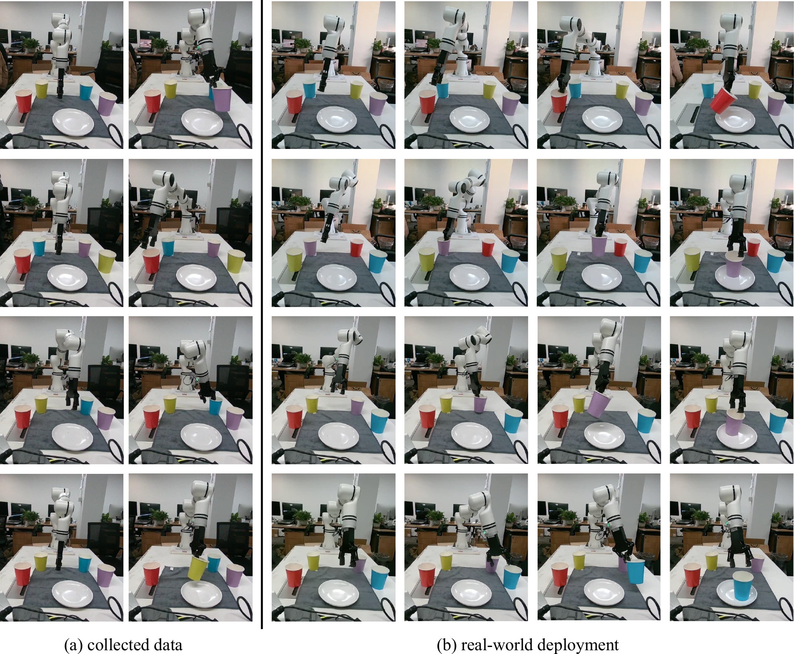

> 图 6 | 一台英特尔实感（Intel RealSense）相机和一个 Realman RM75B 机器人。

图：图 7 | 测试期间数据收集与真实世界部署的对比。
参考标题：2603.03195v1/x12.png

### 2.5 更多可视化（More Visualization）

我们为第 4.4 节中提出的 **潜在运动分析（latent motion analysis）** 提供了扩展的可视化，主要结果展示在图 [2](#S1.F2)、[3](#S1.F3)、[4](#S1.F4) 和 [5](#S1.F5) 中。

**结构与运动潜在变量的有效解耦。**
图 [2](#S1.F2) 和图 [3](#S1.F3) 分析了来自 **Libero** 和 **Bridge** 数据集的代表性样本。前六列展示了三行的时间采样帧：结构（顶部）、运动（中部）和交叉重建（底部）。 **交叉重建（Cross-Recon）** 视频是通过将结构视频的静态外观与从运动视频中提取的运动表示相结合而合成的，从而揭示了转移的运动模式。
每个交叉重建帧都叠加了 **运动热力图（motion heatmap）** 以突出动态区域。
最后一列总结了三种诊断图：通过平均和最大化交叉重建与结构之间逐帧绝对差计算得到的运动热力图，以及从激活的运动区域估计出的 **末端执行器轨迹（end-effector trajectory）** 。如图所示，高亮区域始终跟随运动视频中机器人手臂的移动。
在视频结果中，这些区域随时间波动；为了在静态可视化中保持清晰，我们在图中展示了聚合的高亮区域。

我们进一步分析了运动潜在变量的分布，如图 [4](#S1.F4) 所示。为了从高维运动潜在变量中推导出可解释的轨迹表示，我们首先从每个视频片段中提取逐帧运动特征，并累积帧间差异以获得描述该片段整体运动趋势的时间序列。然后，我们对所有片段的这些序列进行重采样至固定长度并进行全局标准化。随后，我们对序列特征应用 **主成分分析（Principal Component Analysis, PCA）** ，并取前两个主成分作为每个片段的二维轨迹。这种表示保留了潜在空间中编码的动态结构，同时实现了跨片段的清晰比较。

图 [4](#S1.F4) (a) 展示了在二维 PCA 空间中所有运动轨迹的 **无监督聚类（unsupervised clustering）** 。为了获得簇级别的规范形状，我们通过重采样对每个簇内的轨迹进行时间对齐，并绘制其平均曲线以及 95% 的置信区间。不同簇之间出现了明显的轨迹模式——例如单调上升、两阶段反转和多阶段往复运动——这表明模型的运动潜在变量捕获了高级别的运动语义。
为了进一步验证每个簇内的语义一致性，我们为每个簇随机采样两个视频片段，并可视化每个片段中三个均匀采样的帧，如图 [4](#S1.F4) (b) 所示。同一簇内的片段在视觉上表现出高度相似的运动趋势，证实了运动潜在空间的结构能够对不同动作模式进行有意义的区分。

**运动潜在变量增强未来帧预测的动态建模。**
如图 [5](#S1.F5) 所示，我们进一步可视化了不同预训练策略下的未来帧预测。从上到下，示例对应四个任务：
i) 拿起巧克力布丁并放入篮子，
ii) 倾倒，
iii) 打开冰箱，以及
iv) 将香蕉放入抽屉。
在图 [5](#S1.F5) (a) 中，基于 **世界模型（world-model）** 的方法在重建冗余背景像素方面存在问题，这可能会分散对关键交互和运动线索的注意力。因此，预测的未来帧有时几乎保持不变，例如在任务 (ii) 和 (iii) 中。
图 [5](#S1.F5) (b) 显示，仅预测目标帧常常由于缺乏中间演化步骤而导致生成不稳定：在任务 (i) 中，目标帧几乎坍缩回初始帧；在任务 (iii) 中，只生成了冰箱的一扇门。
相比之下，我们的方法利用运动潜在变量 $z_{m}$ 作为运动的 **思维链（chain-of-thought）** ，为未来帧预测提供了更强的指导。生成的最终帧更准确地与预期的任务指令对齐。

## 3 真实机器人实验（Real-Robot Experiments）

**实验设置（Experimental Setup）** 。
如图 [6](#S2.F6) 所示，我们使用 **Realman RM75B** 机器人，该机器人配备有 **7个自由度（7 degrees of freedom）** 和一个单夹持器。
使用一台 **英特尔实感（Intel RealSense）** 相机来捕捉 **RGB图像（RGB images）** 。
我们设置了一个抓取杯子的实验，共收集了 **127个回合（episodes）** ，包含 **65,382帧（frames）** 及对应的动作。
每个回合平均包含 **515帧** ，对应于现实世界中大约 **20秒** 。
数据集主要包括抓取四种不同颜色的杯子，每种颜色的回合数如下：红色 31，蓝色 39，黄色 24，紫色 33。
图 [7](#S2.F7) (a) 展示了一些收集到的数据。

在训练过程中，所有图像都被裁剪并调整大小为 **256×256** 。 **动作块大小（action chunk size）** 设置为 **10** 。我们使用 **16块GPU** ，每块GPU的 **批大小（batch size）** 为 **8** ，对模型进行了 **2k步（2k steps）** 的训练。
数据在下午和晚上收集，然后用于模型训练。
测试在次日进行。
如图 [7](#S2.F7) 所示，数据收集时的光照条件与真实世界部署时的光照条件存在一些差异。
我们发现，模型在不同光照条件下仍能正确执行指令。
图 [7](#S2.F7) (b) 的前两行展示了两个测试案例：抓取一个红色/紫色杯子并将其放在盘子上。它们的背景光照与训练数据不同，但模型仍能成功执行任务。
