<a id="appendix-a"></a>

## 附录 A SIGReg

**SIGReg** 提出将嵌入的分布匹配到 **各向同性高斯（isotropic Gaussian）** 目标分布。在高维空间中实现这种匹配，可以通过结合两个统计组件优雅地完成：(i) **克拉默-沃尔德定理（Cramér–Wold theorem）** ，以及 (ii) **单变量埃普斯-普利检验统计量（univariate Epps-Pulley test-statistic）** 。简而言之，SIGReg 首先生成 $M$ 个单位范数方向 ${\bm{u}}^{(m)}$，并将嵌入 ${\bm{Z}}$ 投影到这些方向上，如下所示：

$$
\displaystyle{\bm{h}}^{(m)} \displaystyle\triangleq{\bm{Z}}{\bm{u}}^{(m)},{\bm{u}}^{(m)}\in\mathbb{S}^{D-1},(6)
$$

其中方向在超球面上均匀采样。然后，SIGReg 执行单变量分布匹配：

$$
\displaystyle{\rm SIGReg}({\bm{Z}})\triangleq\frac{1}{M}\sum_{m=1}^{M}T^{(m)}, (SIGReg)
$$

其中 $T$ 是单变量埃普斯-普利检验统计量：

$$
T^{(m)}=\int_{-\infty}^{\infty}w(t)\left|\phi_{N}(t;{\bm{h}}^{(m)})-\phi_{0}(t)\right|^{2}dt, (EP)
$$

其中 **经验特征函数（empirical characteristic function, ECF）** 定义为 $\phi_{N}(t;{\bm{h}})=\frac{1}{N}\sum_{n=1}^{N}e^{it{\bm{h}}_{n}}$，$w$ 是一个加权函数，例如 $w(t)=e^{-\frac{t^{2}}{2\lambda^{2}}}$。最后，因为目标是 $\mathbb{R}^{D}$ 中的各向同性高斯分布，通过 ${\bm{u}}^{(m)}$ 的单变量投影使得单变量目标分布 $\phi_{0}$ 成为标准高斯分布 $N(0,1)$。根据克拉默-沃尔德定理，匹配所有一维边际分布意味着匹配联合分布，即，在 $M$ 趋于无穷的渐近极限下，我们有如下弱收敛结果：

$$
\displaystyle{\rm SIGReg}({\bm{Z}})\rightarrow 0\iff\mathbb{P}_{\bm{Z}}\rightarrow N(0,{\bm{I}}). (Cramer-Wold)
$$

在实际计算中，方程 [EP](#A1.Ex4) 中的积分采用数值积分方案，例如，在 $[0.2,4]$ 区间内均匀分布 $T$ 个节点的梯形法则。

<a id="appendix-b"></a>

## 附录 B 交叉熵方法

**交叉熵方法（Cross-Entropy Method, CEM）** [48] 是一种基于采样（零阶）的优化算法。直观上，CEM 是一种迭代采样过程，它在每次迭代中逐步优化一个计划（定义为一系列动作）。

在每次迭代中，算法从一个分布（通常是高斯分布，初始参数为 $\mu=\mathbf{0}$ 和 $\sigma=\mathbf{I}$）中采样一组候选计划。接着，使用世界模型评估每个候选计划，并为其关联一个成本。然后，算法选择成本最低的前 $k$ 个计划，称为 **精英（elites）** 。这些精英用于计算统计量，以更新下一次迭代的采样分布参数。通过这个迭代过程，该方法探索动作空间，同时逐渐将采样分布集中在与较低成本相关的区域。最终的动作计划是从最后一次迭代的采样分布的均值中获得的。

然而，在非凸设置中，无法保证 CEM 收敛到的解是全局最优解。此外，CEM 受到 **维度灾难（curse of dimensionality）** 的影响，当动作空间很大时，应用变得越来越困难。

在我们的实验中，我们使用一个 CEM 求解器，每次迭代采样 $300$ 个动作序列，并执行 $30$ 个优化步骤。在每一步中，选择前 $30$ 个候选作为精英来更新采样分布。我们在算法 [2](#alg2) 中提供了算法伪代码。

<a id="algorithm-2"></a>

**算法 2 用于动作序列优化的交叉熵方法（CEM）**

```text

1:世界模型 $f$，规划时域 $H$，采样数量 $N$，精英数量 $K$，迭代次数 $T$

2:初始化采样分布参数 $\mu_{0}=\mathbf{0}$, $\Sigma_{0}=I$

3:for $t=1$ to $T$ do

4:  从 $\mathcal{N}(\mu_{t-1},\Sigma_{t-1})$ 中采样 $N$ 个候选动作序列 $\{a_{1:H}^{(i)}\}_{i=1}^{N}$

5:  for $i=1$ to $N$ do

6:   在世界模型 $f$ 中执行 $a_{1:H}^{(i)}$

7:   计算成本 $J^{(i)}$

8:  end for

9:  选择成本最低的 $K$ 个序列（精英）

10:  使用精英集更新分布参数：

11:  $\mu_{t}\leftarrow\frac{1}{K}\sum_{i\in\mathcal{E}}a_{1:H}^{(i)}$

12:  $\Sigma_{t}\leftarrow\text{Var}_{i\in\mathcal{E}}\left(a_{1:H}^{(i)}\right)$

13:end for

14:返回找到的最佳动作序列或 $\mu_{T}$ 的第一个动作
```

<a id="appendix-c"></a>

## 附录 C 基线方法（Appendix C Baselines）

### C.1 DINO 世界模型（C.1 DINO-WM）

**DINO 世界模型（DINO World Model, DINO-WM）** 侧重于通过利用 **DINOv2** 冻结的预训练表示来学习一个预测器，以避免表征坍缩。由于不是端到端训练的，其损失函数仅是最小化预测的下一个嵌入与 DINOv2 生成的真实下一个状态嵌入之间的差异。

$$
\mathcal{L}_{\text{DINO-WM}}=\frac{1}{BT}\sum_{i}^{B}\sum_{t}^{T}\|\hat{{\bm{z}}}^{(i)}_{t+1}-{\bm{z}}^{(i)}_{t+1}\|_{2}^{2}(7)
$$

我们采用了与原始论文 [55] 相同的设置（架构、超参数等）。

### C.2 PLDM

**PLDM** [50] 提出了一种用于学习端到端联合嵌入预测架构（Joint-Embedding Predictive Architecture, JEPA）的方法。为避免坍缩，其方法从 **方差-不变性-协方差正则化（Variance-Invariance-Covariance Regularization, VICReg）** [10] 中汲取灵感，并增加了额外的项以考虑下一状态预测的时间性。PLDM 的目标函数如下：

$$
\mathcal{L}_{\text{PLDM}}=\mathcal{L}_{\text{pred}}+\alpha\mathcal{L}_{\text{var}}+\beta\mathcal{L}_{\text{cov}}+\gamma\mathcal{L}_{\text{time-sim}}+\zeta\mathcal{L}_{\text{time-var}}+\nu\mathcal{L}_{\text{time-cov}}+\mu\mathcal{L}_{\text{IDM}}(8)
$$

其中，

$$
\mathcal{L}_{\text{pred}}=\frac{1}{BT}\sum_{i}^{B}\sum_{t}^{T}\|\hat{{\bm{z}}}^{(i)}_{t+1}-{\bm{z}}^{(i)}_{t+1}\|_{2}^{2}
$$

$$
\mathcal{L}_{\text{var}}=\frac{1}{TD}\sum_{t}^{T}\sum_{d}^{D}\max\left(0,1-\sqrt{\text{Var}({\bm{z}}^{(:)}_{t,d})}+\epsilon\right)
$$

$$
\mathcal{L}_{\text{cov}}=\frac{1}{T}\sum_{t}^{T}\frac{1}{D}\sum_{i\neq j}^{D}\left[\text{Cov}({\bm{Z}}_{t})\right]_{ij}
$$

$$
\mathcal{L}_{\text{time-sim}}=\frac{1}{BT}\sum_{i}^{B}\sum_{t}^{T}\|{\bm{z}}^{(i)}_{t}-{\bm{z}}^{(i)}_{t+1}\|_{2}^{2}
$$

$$
\mathcal{L}_{\text{time-var}}=\frac{1}{BD}\sum_{i}^{B}\sum_{d}^{D}\max\left(0,1-\sqrt{\text{Var}({\bm{z}}^{(i)}_{:,d})}+\epsilon\right)
$$

$$
\mathcal{L}_{\text{time-cov}}=\frac{1}{B}\sum_{b}^{B}\frac{1}{D}\sum_{i\neq j}^{D}\left[\text{Cov}({\bm{Z}})\right]_{ij}
$$

$$
\mathcal{L}_{\text{IDM}}=\frac{1}{BT}\sum_{i}^{B}\sum_{t}^{T}\|\hat{{\bm{a}}}^{(i)}_{t}-{\bm{a}}^{(i)}_{t}\|_{2}^{2}
$$

其中 ${\bm{z}}^{(i)}_{t}\in\mathbb{R}^{D}$ 对应于轨迹 $i\in[B]$ 在时间步 $t\in[T]$ 的表示，$T$ 为轨迹长度，$B$ 为批次大小。${\bm{Z}}_{t}\in\mathbb{R}^{B\times D}$ 表示其第 $i$ 行为 ${\bm{z}}_{t}^{(i)}$ 的矩阵，即：

$$
{\bm{Z}}_{t}=\begin{bmatrix}({\bm{z}}_{t}^{(1)})^{\top}\\ \vdots\\ ({\bm{z}}_{t}^{(B)})^{\top}\end{bmatrix},
$$

令 $\bar{{\bm{Z}}}_{t}$ 为 ${\bm{Z}}_{t}$ 的行中心化版本：

$$
\bar{{\bm{Z}}}_{t}={\bm{Z}}_{t}-\frac{1}{B}\mathbf{1}\mathbf{1}^{\top}{\bm{Z}}_{t}.
$$

那么，对于每个时间步 $t$ 和特征维度 $d$，批次间的方差为

$$
\mathrm{Var}({\bm{z}}^{(:)}_{t,d})=\frac{1}{B-1}\sum_{i=1}^{B}\left(z^{(i)}_{t,d}-\frac{1}{B}\sum_{i^{\prime}=1}^{B}z^{(i^{\prime})}_{t,d}\right)^{2},
$$

特征维度间的协方差矩阵为

$$
\mathrm{Cov}({\bm{Z}}_{t})=\frac{1}{B-1}\bar{{\bm{Z}}}_{t}^{\top}\bar{{\bm{Z}}}_{t}\in\mathbb{R}^{D\times D}.
$$

类似地，对于时间正则化项，令 ${\bm{Z}}^{(i)}\in\mathbb{R}^{T\times D}$ 表示其第 $t$ 行为 ${\bm{z}}_{t}^{(i)}$ 的矩阵，并令 $\bar{{\bm{Z}}}^{(i)}$ 为其行中心化版本：

$$
\bar{{\bm{Z}}}^{(i)}={\bm{Z}}^{(i)}-\frac{1}{T}\mathbf{1}\mathbf{1}^{\top}{\bm{Z}}^{(i)}.
$$

那么时间维度上的方差为

$$
\mathrm{Var}({\bm{z}}^{(i)}_{:,d})=\frac{1}{T-1}\sum_{t=1}^{T}\left(z^{(i)}_{t,d}-\frac{1}{T}\sum_{t^{\prime}=1}^{T}z^{(i)}_{t^{\prime},d}\right)^{2},
$$

时间协方差矩阵为

$$
\mathrm{Cov}({\bm{Z}}^{(i)})=\frac{1}{T-1}(\bar{{\bm{Z}}}^{(i)})^{\top}\bar{{\bm{Z}}}^{(i)}\in\mathbb{R}^{D\times D}.
$$

$\hat{{\bm{z}}}^{(i)}_{t}\in\mathbb{R}^{d}$ 是使用预测器对轨迹 $i$ 在时间步 $t$ 的预测嵌入。${\bm{a}}^{(i)}_{t}\in\mathbb{R}^{A}$ 是与时间步 $t$ 关联的动作，$\hat{{\bm{a}}}^{(i)}_{t}\in\mathbb{R}^{A}$ 是 **逆动力学模型（Inverse Dynamic Model, IDM）** $\text{idm}({\bm{z}}_{t},{\bm{z}}_{t+1})$ 预测的动作。

我们通过对损失系数进行网格搜索来选择 PLDM 的超参数。由于整体目标函数包含六个可调权重（$\alpha$, $\beta$, $\gamma$, $\zeta$, $\nu$, $\mu$），对所有组合进行穷举搜索是不可行的（$\mathcal{O}(n^{6})$）。此外，原始的 PLDM 研究报告了针对每个环境和数据集进行大量调优的系数，这限制了其可迁移性。我们从其开源代码库提供的配置中的超参数集出发。我们选择此方案的原因是，原始论文中并未提及时间方差（time-var）和时间协方差（time-cov）正则化项。随后，我们在 Push-T 任务上对每个初始损失系数进行了 256 种配置的网格搜索，并保留在验证集上表现最佳的一组。我们在表 [2](#A3.T2) 中报告了找到的最佳超参数。我们在所有训练中固定使用这些系数。

<a id="table-2"></a>

> 表 2：通过网格搜索找到的最佳系数。

| 损失系数 | 初始值 |
| -------- | ------ |
| $\alpha$ | 18.0   |
| $\beta$  | 12     |
| $\gamma$ | 0.2    |
| $\zeta$  | 0.7    |
| $\nu$    | 0.0    |
| $\mu$    | 0.0    |

### C.3 目标条件强化学习（GC-RL）

为了评估下游控制性能，我们采用离线训练的目标条件强化学习（Goal-Conditioned Reinforcement Learning, GC-RL）。具体而言，我们考虑了隐式 Q 学习（Implicit Q-Learning, IQL）和隐式价值学习（Implicit Value Learning, IVL）的目标条件变体。在这两种情况下，观测值和目标均使用 DINOv2 图像块嵌入进行编码，策略则从离线数据集中训练。训练分为两个阶段：首先学习一个价值函数（以及可选的 Q 函数），然后通过优势加权回归进行策略提取。

#### 目标条件隐式 Q 学习（GCIQL）

隐式 Q 学习（IQL）[33] 是一种离线强化学习算法，它通过期望分位数回归学习价值函数，从而避免查询分布外动作。在目标条件设定下，该算法学习一个 Q 函数 $Q_{\psi}(s_{t},a_{t},g)$ 和一个价值函数 $V_{\theta}(s_{t},g)$，两者均以目标 $g$ 为条件。

Q 函数通过贝尔曼回归进行训练，并从目标价值网络 $V_{\bar{\theta}}$ 进行自举：

$$
\mathcal{L}_{Q}=\mathbb{E}_{(s_{t},a_{t},s_{t+1},g)\sim\mathcal{D}}\left[\left(Q_{\psi}(s_{t},a_{t},g)-\left(r(s_{t},g)+\gamma m_{t}V_{\bar{\theta}}(s_{t+1},g)\right)\right)^{2}\right],
$$

其中，若 $s_{t}=g$（终止转移）则 $m_{t}=0$，否则 $m_{t}=1$。

价值网络通过期望分位数回归，以目标 Q 网络 $Q_{\bar{\psi}}$ 的输出为目标进行训练：

$$
\mathcal{L}_{V}=\mathbb{E}_{(s_{t},a_{t},g)\sim\mathcal{D}}\left[L_{\tau}^{2}\left(Q_{\bar{\psi}}(s_{t},a_{t},g)-V_{\theta}(s_{t},g)\right)\right],
$$

其中期望分位数损失定义为

$$
L_{\tau}^{2}(u)=|\tau-\mathbbm{1}(u<0)|u^{2}.
$$

评论家总损失为

$$
\mathcal{L}_{\text{critic}}=\mathcal{L}_{Q}+\mathcal{L}_{V}.
$$

#### 目标条件隐式价值学习（GCIVL）

隐式价值学习（IVL）[43] 简化了 IQL，它移除了 Q 函数，直接通过自举目标学习价值函数。价值网络 $V_{\theta}(s_{t},g)$ 通过期望分位数回归，以目标网络 $V_{\bar{\theta}}$ 为目标进行训练：

$$
\mathcal{L}_{V}=\mathbb{E}_{(s_{t},s_{t+1},g)\sim\mathcal{D}}\left[L_{\tau}^{2}\left(r(s_{t},g)+\gamma V_{\bar{\theta}}(s_{t+1},g)-V_{\theta}(s_{t},g)\right)\right].
$$

与 IQL 相同，$L_{\tau}^{2}$ 表示非对称期望分位数损失，$\gamma$ 是折扣因子。

#### 策略提取。

对于 GCIQL 和 GCIVL，策略 $\pi_{\theta}(s_{t},g)$ 均通过优势加权回归（Advantage-Weighted Regression, AWR）进行训练。策略目标为

$$
\mathcal{L}_{\pi}=\mathbb{E}_{(s_{t},a_{t},g)\sim\mathcal{D}}\left[\exp\left(\beta A(s_{t},a_{t},g)\right)\|\pi_{\theta}(s_{t},g)-a_{t}\|_{2}^{2}\right],
$$

其中优势值计算如下

$$
A(s_{t},a_{t},g)=r(s_{t},g)+\gamma V(s_{t+1},g)-V(s_{t},g),
$$

$\beta$ 是控制优势加权强度的逆温度参数。

### C.4 目标条件行为克隆（GCBC）

作为一个简单的模仿学习基线，我们考虑目标条件行为克隆（Goal-Conditioned Behavioral Cloning, GCBC）[19]。GCBC 训练一个目标条件策略 $\pi_{\theta}(s_{t},g)$，使其在给定当前观测 $s_{t}$ 和目标观测 $g$ 时，能够复现专家动作。在我们的实现中，观测值和目标在提供给策略网络之前，都使用 DINOv2 图像块嵌入进行编码。

策略在状态-动作-目标元组的离线数据集 $\mathcal{D}$ 上通过监督学习进行训练。具体而言，其目标是最小化预测动作与数据集中所采取动作之间的均方误差：

$$
\mathcal{L}_{\text{GCBC}}=\mathbb{E}_{(s_{t},a_{t},g)\sim\mathcal{D}}\left[\|\pi_{\theta}(s_{t},g)-a_{t}\|_{2}^{2}\right],
$$

其中 $s_{t}$ 表示观测嵌入，$g$ 表示目标嵌入，$a_{t}$ 表示对应的专家动作。

<a id="appendix-d"></a>

## 附录 D 实现细节

我们应用帧跳数为 5 的设置，将帧之间的连续动作分组为单个动作块。这一选择能够在保持信息丰富的时间转移的同时，实现计算高效的更长视野预测。我们使用 128 的批次大小，子轨迹大小为 4，对应于 4 帧和 4 个包含 5 个动作的块。每帧为 $224\times 224$ 像素。所有训练脚本均使用 stable-pretraining [5] 库编写。

#### 编码器架构。

编码器采用来自 Hugging Face 库的 Vision Transformer Tiny（ViT-Tiny）模型，图像块大小为 14。

#### 预测器架构。

预测器实现为一个 ViT-S 主干网络，具有学习得到的位置嵌入，并对观测历史应用因果掩码。对于 PushT 和 OGBench-Cube 环境，历史长度设置为 3；对于 TwoRoom 环境，设置为 1。在规划过程中，预测器以自回归方式用于生成未来潜在状态的推演。

#### 解码器（仅用于可视化）。

为了可视化，我们使用一个轻量级 Transformer 解码器将来自编码器最后一层的 [CLS] 词元嵌入（192 维）解码为图像。[CLS] 表示首先被投影到一个隐藏维度，并用作交叉注意力中的键和值。一组固定的可学习查询词元（目标图像的每个图像块对应一个）通过多个带有残差 MLP 块的交叉注意力层与这个全局表示进行交互。对于一个大小为 $224\times 224$、图像块大小为 $16$ 的图像，这对应 $P=(224/16)^{2}=196$ 个可学习查询词元。得到的图像块嵌入随后被线性投影到 $16\times 16\times 3$ 像素块，并重新排列以生成 $224\times 224$ 的 RGB 图像。该解码器仅用作诊断工具，以可视化 [CLS] 表示中保留了哪些视觉信息。

#### 规划求解器。

对于规划，我们使用交叉熵方法（Cross-Entropy Method, CEM）。在每个规划步骤，CEM 采样 300 个候选动作序列，并在 PushT 环境中最多优化 30 次迭代，在其他环境中最多优化 10 次迭代。每次迭代中，保留前 30 条轨迹以更新采样分布，初始采样方差设置为 1。规划视野设置为 5 步，由于使用了帧跳数 5，这对应于 25 个环境时间步。我们采用滚动视野模型预测控制（Model Predictive Control, MPC）方案，视野为 5，这意味着在执行整个优化后的动作序列后才重新规划。此配置遵循 [55] 中使用的设置。

#### 实现与硬件。

所有实验均使用 [stable-worldmodel](https://github.com/rbalestr-lab/stable-worldmodel) [36] 框架实现。训练依赖于 [stable-pretraining](https://github.com/rbalestr-lab/stable-pretraining) [5] 库，而评估则使用 PyTorch [44] 和 Gymnasium [53] 进行。训练和规划均在单个 NVIDIA L40S GPU 上执行。

<a id="appendix-e"></a>

## 附录 E 环境与数据集

- a) **TwoRoom** 是由 Sobal 等人 [50] 引入的一个简单的连续二维导航任务。环境由两个房间组成，中间由一堵墙隔开，墙上有一扇门连接两个房间。智能体（表示为一个红点）必须从一个房间的随机起始位置导航到另一个房间的随机采样目标位置，这需要穿过门。我们收集了 10,000 条轨迹，平均轨迹长度为 92 步。数据是使用一个简单的带噪声启发式策略生成的，该策略首先引导智能体沿直线路径向门移动，一旦智能体进入另一个房间，再引导其向目标位置移动。每个世界模型在此数据集上训练 10 个轮次。
- b) **PushT** 是一个连续的二维操作任务，其中智能体（表示为一个蓝点）必须推动一个 T 形块以匹配目标配置，交互仅限于推动动作。我们遵循 Zhou 等人 [55] 相同的设置和数据集，其中包含 20,000 条专家轨迹，平均长度为 196 步。然而，我们只训练每个世界模型 10 个轮次。经验上，我们观察到 10 个轮次足以达到最佳性能，这与 DINO-WM 论文中报告的结果一致。
- c) **OGBench-Cube** 是一个连续的三维机器人操作任务，其中带有末端执行器的机械臂必须拾取一个立方体并将其放置到目标位置。该任务最初由 Park 等人 [43] 引入，我们仅考虑单立方体变体。我们收集了 10,000 条轨迹，每条包含 200 步。数据是使用基准库中提供的数据收集启发式方法生成的。每个世界模型在此数据集上训练 10 个轮次。
- d) **Reacher** 是来自 DeepMind 控制套件 [51] 的一个连续控制环境。任务包括控制一个双关节机械臂以到达二维平面中的目标位置。遵循 DINO-WM 中使用的设置，我们考虑成功定义为机械臂关节与到达目标位置所需的目标配置完美对齐的变体。我们在一个包含 10,000 条轨迹（每条 200 步）的数据集上训练每个世界模型 10 个轮次。数据是使用软演员-评论家（Soft Actor-Critic）策略收集的。

<a id="appendix-f"></a>

## 附录 F 评估细节

<a id="figure-11"></a>

<div align="center">
  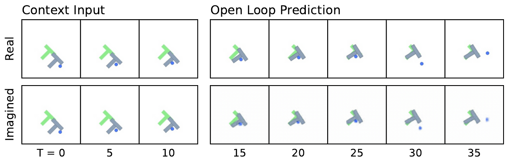
  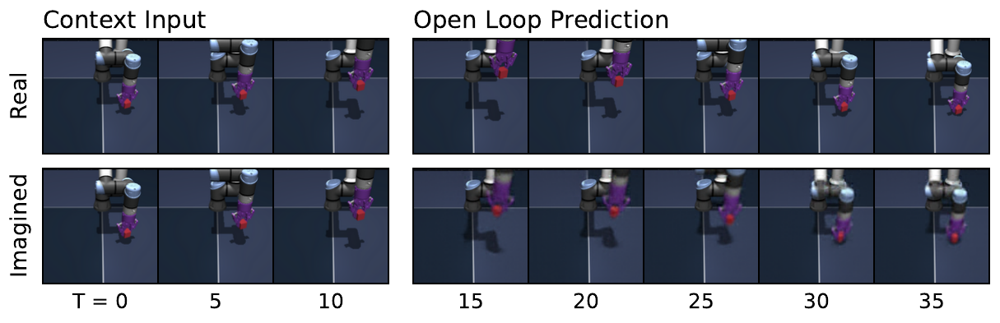
</div>

> **图 11** ：在 PushT（上图）和 OGBench-Cube（下图）上的额外预测器推演。设置与图 [7](#S5.F7) 相同：三个上下文帧被编码为潜在表示，预测器在给定动作序列的条件下自回归地生成未来的潜在状态。所有预测均使用一个在训练期间未使用过的解码器进行解码。在 PushT 上，想象的轨迹紧密跟踪真实轨迹，准确地捕捉了智能体和方块的运动。在 OGBench-Cube 上，模型保留了整体场景布局和方块位移，但在更长的时间范围内丢失了更精细的细节，例如末端执行器的朝向，这与表 [4](#A6.T4) 中报告的关于旋转量的较低探测精度一致。

### F.1 控制

我们在之前介绍的三个环境中评估 **LeWM** 在目标条件控制任务上的表现。控制性能使用两个参数来衡量：评估预算和到目标的距离。评估预算对应于允许智能体在环境中执行的最大动作数量。目标距离决定了相对于初始状态，目标状态在未来的采样距离。在评估期间，轨迹从离线数据集中采样。初始状态通过从数据集中的轨迹随机采样一个状态来选择，而目标状态则对应于同一轨迹中在之后若干时间步出现的状态。这确保了目标是可达的，并且与数据集动态一致。在 TwoRoom 中，评估预算设置为 150 步，目标状态在未来的 100 个时间步采样。在 PushT 中，评估预算为 50 步，目标在未来的 25 个时间步采样。在 OGBench-Cube 和 Reacher 中，评估预算为 50 步，目标在未来的 25 个时间步采样。

### F.2 探测

我们使用 **探测（Probing）** 来分析在三个环境中学习到的潜在表示所包含的信息。具体来说，我们训练线性和非线性 **探针（Probe）** ，以从潜在嵌入中预测物理量。线性探针评估信息在潜在空间中是否线性可及，而非线性探针则评估信息是否存在但可能纠缠在一起。

对于每个探针，我们报告预测值与真实值之间的 **均方误差（Mean Squared Error, MSE）** 和 **皮尔逊相关系数（Pearson correlation coefficient）** 。

被探测的变量因环境而异。在 TwoRoom 中，我们探测智能体的 2D 位置（表 [3](#A6.T3)）。在 PushT 中，我们同时探测智能体的状态和方块的状态（表 [1](#S5.T1)）。在 OGBench-Cube 中，我们探测方块的位置和机器人末端执行器的位置（表 [4](#A6.T4)）。

<a id="table-3"></a>

> **表 3** ：TwoRoom 上的物理潜在探测结果。尽管 LeWM 在该环境的下游规划任务上表现不如 PLDM，但它在所有探测指标上都与 PLDM 相当或更优，并且两种方法在线性探针上都显著优于 DINO-WM。这表明学习到的潜在空间同样好地捕捉了底层物理状态，并且规划性能的差距并非源于信息量较少的表示，而是源于其他因素，例如动力学模型或规划过程本身。

|         | 智能体位置       |              |                  |              |
| ------- | ---------------- | ------------ | ---------------- | ------------ |
|         | 线性             | MLP          |                  |              |
| 模型    | MSE $\downarrow$ | r $\uparrow$ | MSE $\downarrow$ | r $\uparrow$ |
| DINO-WM | $0.488\pm 0.451$ | $0.824$      | $0.000\pm 0.000$ | $0.999$      |
| PLDM    | $0.008\pm 0.041$ | $0.996$      | $0.000\pm 0.000$ | $1.000$      |
| LeWM    | $0.008\pm 0.018$ | $0.996$      | $0.000\pm 0.000$ | $1.000$      |

<a id="table-4"></a>

> **表 4** ：OGBench-Cube 上的物理潜在探测结果。LeWM 在大多数属性上与 PLDM 相当或更优，并在位置量（如方块位置和末端执行器位置）上取得了最佳结果。DINO-WM 在动态和旋转属性（关节速度、末端执行器偏航角）上仍保持明显优势，这可能是因为此类量受益于大规模预训练期间学到的更丰富的视觉先验。所有三种方法在恢复方块朝向（四元数和偏航角）方面都存在困难，这表明无论采用何种训练策略，细粒度的旋转信息都难以编码到紧凑的潜在空间中。

|                  |         | 线性              | MLP          |                   |              |
| ---------------- | ------- | ----------------- | ------------ | ----------------- | ------------ |
| 属性             | 模型    | MSE $\downarrow$  | r $\uparrow$ | MSE $\downarrow$  | r $\uparrow$ |
| 关节位置         | DINO-WM | $0.960\pm 1.150$  | $0.808$      | $0.200\pm 0.967$  | $0.870$      |
|                  | PLDM    | $0.372\pm 1.172$  | $0.695$      | $0.340\pm 1.164$  | $0.728$      |
|                  | LeWM    | $0.352\pm 1.173$  | $0.706$      | $0.330\pm 1.157$  | $0.742$      |
| 关节速度         | DINO-WM | $0.792\pm 0.748$  | $0.763$      | $0.263\pm 0.683$  | $0.852$      |
|                  | PLDM    | $1.016\pm 0.905$  | $0.115$      | $0.661\pm 0.830$  | $0.536$      |
|                  | LeWM    | $1.021\pm 0.902$  | $0.095$      | $0.818\pm 0.899$  | $0.386$      |
| 末端执行器位置   | DINO-WM | $0.024\pm 0.010$  | $0.996$      | $0.004\pm 0.003$  | $0.999$      |
|                  | PLDM    | $0.052\pm 0.073$  | $0.974$      | $0.013\pm 0.029$  | $0.993$      |
|                  | LeWM    | $0.018\pm 0.025$  | $0.991$      | $0.003\pm 0.004$  | $0.998$      |
| 末端执行器偏航角 | DINO-WM | $3.317\pm 1.016$  | $0.828$      | $0.167\pm 0.168$  | $0.917$      |
|                  | PLDM    | $0.996\pm 0.165$  | $0.056$      | $0.985\pm 0.207$  | $0.117$      |
|                  | LeWM    | $0.980\pm 0.295$  | $0.124$      | $0.952\pm 0.369$  | $0.213$      |
| 夹爪             | DINO-WM | $0.114\pm 0.095$  | $0.943$      | $0.038\pm 0.060$  | $0.982$      |
|                  | PLDM    | $0.234\pm 0.169$  | $0.876$      | $0.066\pm 0.111$  | $0.967$      |
|                  | LeWM    | $0.121\pm 0.111$  | $0.938$      | $0.048\pm 0.079$  | $0.976$      |
| 方块位置         | DINO-WM | $0.085\pm 0.029$  | $0.991$      | $0.007\pm 0.007$  | $0.998$      |
|                  | PLDM    | $0.031\pm 0.023$  | $0.985$      | $0.003\pm 0.004$  | $0.999$      |
|                  | LeWM    | $0.007\pm 0.010$  | $0.997$      | $0.002\pm 0.003$  | $0.999$      |
| 方块四元数       | DINO-WM | $1.596\pm 10.457$ | $0.257$      | $0.769\pm 8.046$  | $0.411$      |
|                  | PLDM    | $1.021\pm 12.600$ | $0.066$      | $0.989\pm 12.140$ | $0.218$      |
|                  | LeWM    | $1.019\pm 12.596$ | $0.087$      | $0.963\pm 11.450$ | $0.224$      |
| 方块偏航角       | DINO-WM | $4.223\pm 2.530$  | $0.176$      | $0.916\pm 0.278$  | $0.304$      |
|                  | PLDM    | $0.996\pm 0.088$  | $0.061$      | $0.989\pm 0.140$  | $0.106$      |
|                  | LeWM    | $0.996\pm 0.094$  | $0.062$      | $0.973\pm 0.199$  | $0.164$      |
| 总体             | DINO-WM | $1.162\pm 1.579$  | $0.725$      | $0.290\pm 1.202$  | $0.799$      |
|                  | PLDM    | $0.611\pm 1.875$  | $0.464$      | $0.503\pm 1.809$  | $0.600$      |
|                  | LeWM    | $0.592\pm 1.874$  | $0.477$      | $0.525\pm 1.714$  | $0.584$      |

### F.3 期望违背

我们使用 **期望违背（Violation-of-Expectation, VoE）** 框架在三个环境中评估物理理解。在每个环境中，我们生成三种类型的轨迹：一条未受扰动的参考轨迹、一条包含视觉扰动的轨迹，以及一条包含物理扰动的轨迹。视觉扰动对应于物体颜色的突然变化，而物理扰动对应于将物体 **传送（teleport）** 到随机位置，从而违反物理连续性。轨迹示例如图 [12](#figure-12) 所示。

#### 双室环境（TwoRoom）。

在双室环境中，智能体由一个朝向目标位置导航的专家策略控制。我们生成三条轨迹：(1) 一条未受扰动的轨迹，(2) 一条智能体颜色在回合中途发生变化的轨迹，以及 (3) 一条智能体在同一时间步被传送到随机位置的轨迹。PLDM 和 DINO-WM 产生的 **惊奇信号（surprise signal）** 分别显示在图 [13](#figure-13) 和图 [14](#figure-14) 的左面板中。

#### 推块环境（PushT）。

在推块环境中，智能体由一个偏向于与方块交互的随机策略控制。如前所述，我们构建三条轨迹：(1) 一条未受扰动的轨迹，(2) 一条方块颜色在回合中突然变化的轨迹，以及 (3) 一条在扰动时间步将智能体和方块都传送到随机位置的轨迹。PLDM 和 DINO-WM 对应的惊奇信号分别显示在图 [13](#figure-13) 和图 [14](#figure-14) 的中心面板中。

#### OGBench-Cube 环境。

在 OGBench-Cube 环境中，智能体遵循一个拾取立方体并将其放置到目标位置的专家策略。我们同样考虑三条轨迹：(1) 一条未受扰动的轨迹，(2) 一条立方体颜色在回合中发生变化的轨迹，以及 (3) 一条立方体在轨迹中途被传送到随机位置的轨迹。PLDM 和 DINO-WM 产生的惊奇信号分别显示在图 [13](#figure-13) 和图 [14](#figure-14) 的右面板中。

<a id="figure-12"></a>

<div align="center">
  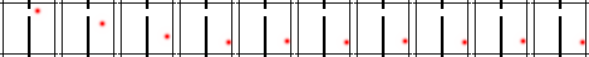
  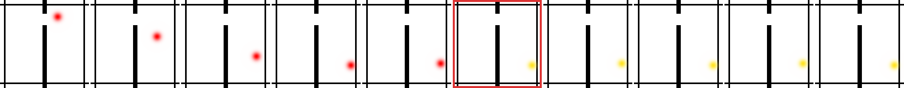
  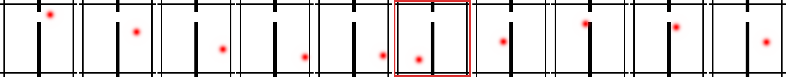
  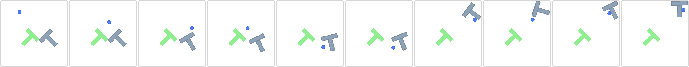
  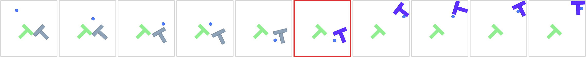
  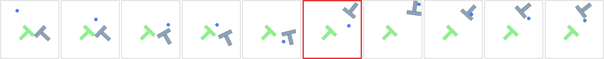
  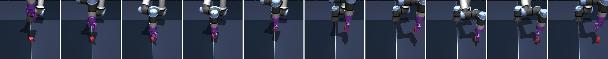
  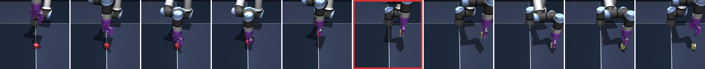
  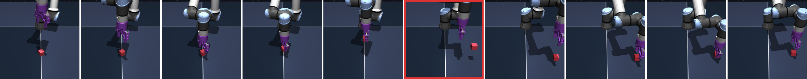
</div>

> 图 12：用于期望违背实验的轨迹示例（第 [5.2](#S5.SS2) 节）。对于每个环境，第一行对应于未受扰动的轨迹，第二行对应于发生视觉扰动的轨迹，第三行显示在轨迹中途系统状态被随机重置的轨迹。发生扰动的帧用红色高亮显示。

<a id="figure-13"></a>

<div align="center">
  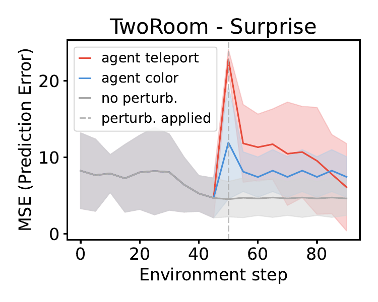
  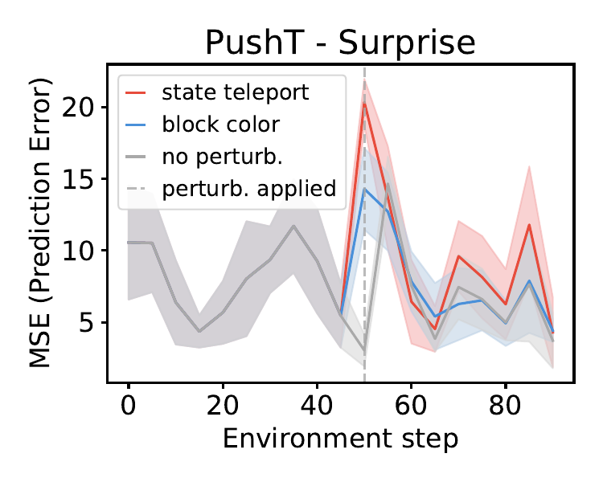
  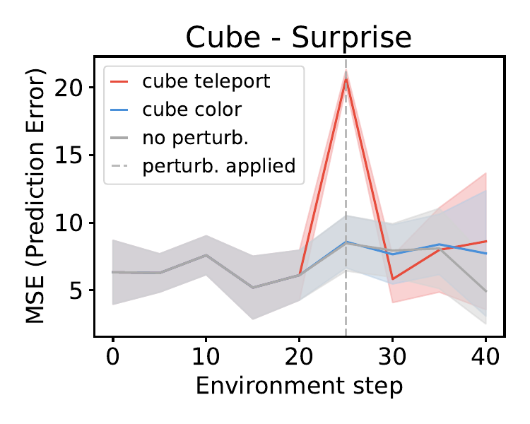
</div>

> 图 13：使用 PLDM 进行的期望违背评估。从左到右：双室环境、推块环境和 OGBench-Cube 环境。图中绘制了未受扰动、视觉扰动和物理扰动轨迹随时间变化的惊奇值。在双室环境和推块环境中，模型对视觉和物理扰动均分配了显著更高的惊奇值。在 OGBench-Cube 环境中，惊奇值的增加较弱且并不持续显著。

<a id="figure-14"></a>

<div align="center">
  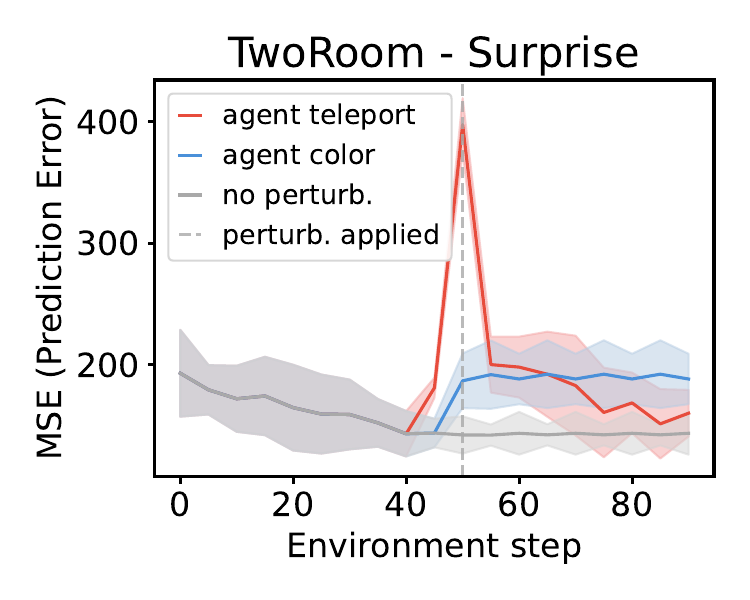
  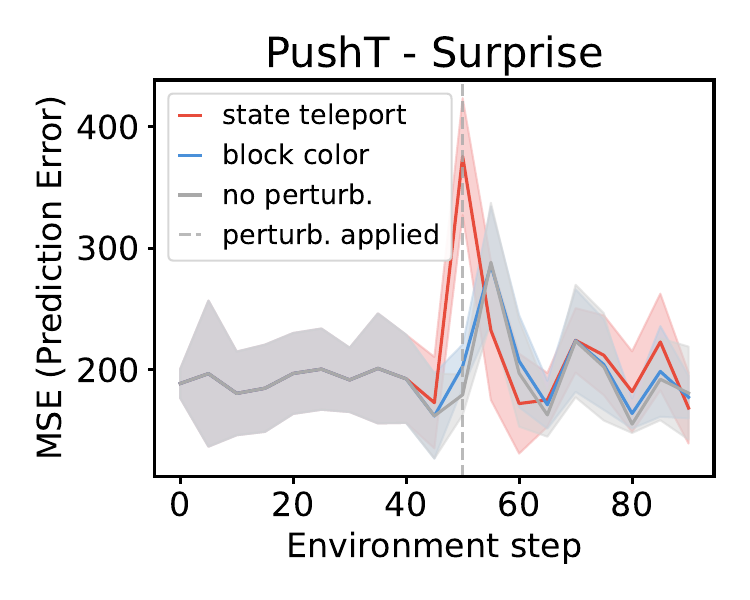
  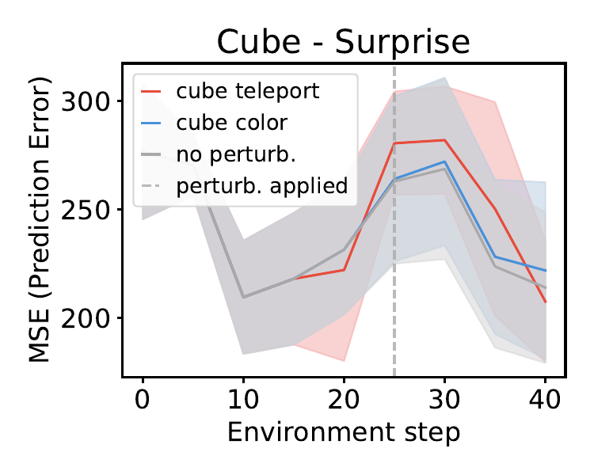
</div>

> 图 14：使用 DINO-WM 进行的期望违背评估。从左到右：双室环境、推块环境和 OGBench-Cube 环境。图中绘制了未受扰动、视觉扰动和物理扰动轨迹随时间变化的惊奇值。虽然该模型在双室环境和推块环境中检测到了两种扰动，但在 OGBench-Cube 环境中，对于任一扰动，惊奇值均未显著增加。

<a id="appendix-g"></a>

## 附录 G 消融实验（Appendix G Ablations）

<a id="figure-15"></a>

<div align="center">
  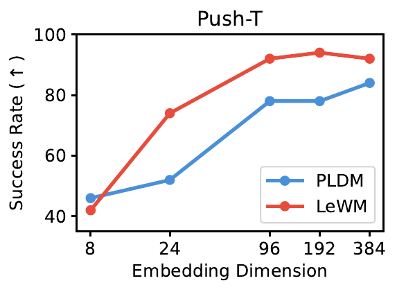
  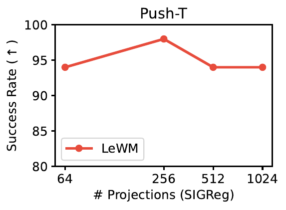
  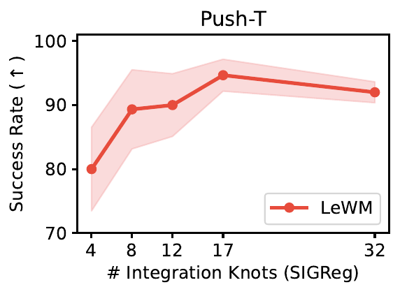
</div>

> **图 15：** LeWM 中关键设计选择的消融研究。 **左图：** 嵌入维度的影响；性能随嵌入维度增大而提升，但超过某个阈值后迅速饱和。 **中图：** SIGReg 中使用的随机投影数量的影响；性能保持稳定，表明该参数不关键。 **右图：** 用于计算 SIGReg 损失的积分节点数量的影响；结果对此参数同样不敏感。

#### 训练方差（Training variance）

为了评估训练的稳定性，我们使用多个随机种子重新训练模型。如表 [5](#A7.T5) 所示，所得性能在不同运行中均表现出高成功率且方差较低，表明训练过程稳定且可复现。

<a id="table-5"></a>

> **表 5：** 训练方差。我们报告了三个训练种子的平均成功率及相应方差，评估基于 Push-T 环境中的同一组 50 条轨迹。目标配置在 25 步内可达，我们允许 50 步的规划预算。与 DINO-WM 和 LeWM 相比，PLDM 表现出更高的方差。

| 模型        | Push-T (SR $\uparrow$)  |
| ----------- | ----------------------- |
| DINO-WM     | $92.0\pm 1.63$          |
| PLDM        | $78.0\pm 5.0$           |
| LeWM (ours) | $\bm{96.0}\pm\bm{2.83}$ |

#### 嵌入维度（Embedding dimensions）

我们研究了嵌入维度对性能的影响。如图 [15](#A7.F15) 所示，当嵌入维度低于某个阈值（约 184）时，性能会下降；而超过该值后增加维度则收益递减，并导致性能饱和。

#### SIGReg 中的投影数量（Number of projections in SIGReg）

我们研究了 SIGReg 中使用的投影数量的影响。如图 [15](#A7.F15) 所示，改变投影数量对下游控制任务的性能影响甚微。这表明该方法对此超参数基本不敏感，因此无需精细调优。实践中，这使得 $\lambda$ 成为唯一需要优化的有效超参数。

#### SIGReg 正则化权重（Weight of SIGReg regularization）

我们分析了 SIGReg 正则化权重 $\lambda$ 的影响。如图 [16](#A7.F16) 所示，该方法在 $\lambda$ 的很大取值范围内都能实现高性能。具体而言，对于 $\lambda\in[0.01,0.2]$，成功率保持在 80% 以上。这表明该方法对此参数的选择具有鲁棒性。此外，由于 $\lambda$ 是唯一的有效超参数，可以高效地进行调优，例如通过简单的二分搜索。

<a id="figure-16"></a>

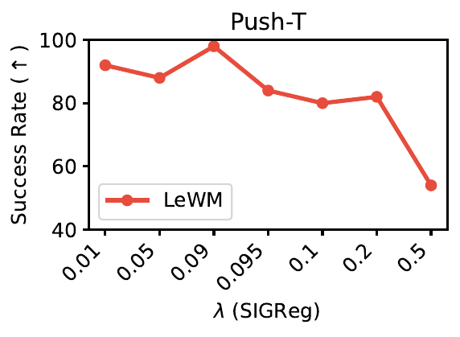

> **图 16：** SIGReg 正则化权重 $\lambda$ 对 Push-T 规划性能的影响。在很宽的取值范围内（$\lambda\in[0.01,0.2]$），成功率保持在 80% 以上，在 $\lambda=0.09$ 附近达到峰值。性能仅在 $\lambda=0.5$ 时急剧下降，此时正则项主导了预测损失，阻碍了动力学建模。由于 $\lambda$ 是 LeWM 唯一的有效超参数，SIGReg 损失系数可通过简单的二分搜索轻松调优。

#### 预测器大小（Predictor Size）

我们分析了预测器大小对性能的影响。如表 [6](#A7.T6) 所示，使用 ViT-S 预测器获得了最佳结果。将预测器减小为 ViT-T 模型会导致性能下降，而将尺寸增加到 ViT-B 则不会带来额外增益，反而略微降低性能。这表明对于此任务，ViT-S 在模型容量和优化稳定性之间提供了最佳权衡。

<a id="table-6"></a>

> **表 6：** 预测器大小对 Push-T 环境中规划性能的影响。我们报告了成功率（SR）。ViT-S 预测器实现了最佳性能。

| 预测器大小 | Push-T (SR $\uparrow$)  |
| ---------- | ----------------------- |
| tiny       | $80.67\pm 6.54$         |
| small      | $\bm{96.0}\pm\bm{2.83}$ |
| base       | $86.7\pm 3.06$          |

#### 解码器（Decoder）

我们研究了在训练期间添加重建损失的影响。如表 [7](#A7.T7) 所示，加入解码器和重建目标并未改善下游控制性能。事实上，与未使用解码器训练的模型相比，性能略有下降。这表明 JEPA 训练目标已经捕获了规划所需的信息，而重建损失可能会鼓励模型编码与控制无关的额外视觉细节。

<a id="table-7"></a>

> **表 7：** 训练期间添加重建损失的影响。我们报告了 Push-T 规划任务上的成功率（SR）。未使用解码器损失训练的模型获得了更高的性能。

| 模型配置               | Push-T (SR $\uparrow$)  |
| ---------------------- | ----------------------- |
| LeWM w/o decoder loss  | $\bm{96.0}\pm\bm{2.83}$ |
| LeWM with decoder loss | $86.0\pm 7.54$          |

#### 架构（Architecture）

我们通过将 ViT 编码器替换为 ResNet-18 主干网络，研究了编码器架构对 LeWM 性能的影响。如表 [8](#A7.T8) 所示，LeWM 在两种架构下都取得了有竞争力的性能，这表明它对训练期间使用的视觉编码器选择是无关的，尽管 ViT 仍保持微弱的优势。

<a id="table-8"></a>

> **表 8：** 编码器架构的影响。我们报告了 Push-T 规划任务上的成功率（SR）。LeWM 在不同编码器架构上均取得了有竞争力的性能，ViT 略有优势。

| 模型架构       | Push-T (SR $\uparrow$)  |
| -------------- | ----------------------- |
| LeWM ViT       | $\bm{96.0}\pm\bm{2.83}$ |
| LeWM ResNet-18 | $94.0\pm 3.27$          |

#### 预测器 Dropout（Predictor Dropout）

我们分析了在训练期间对预测器应用 dropout 的影响。如表 [9](#A7.T9) 所示，引入少量 dropout 能显著提高下游控制性能。具体而言，dropout 率为 $0.1$ 时获得了最高的成功率，而更低或更高的值都会导致性能下降。这表明适度的 dropout 有助于正则化预测器并提高泛化能力，而过度的 dropout 则会降低所学动力学的质量。

<a id="table-9"></a>

> **表 9：** 训练期间预测器 dropout 对 Push-T 规划性能的影响。我们报告了成功率（SR）。少量 dropout（$p=0.1$）产生了最佳结果。

| $p$   | Push-T (SR $\uparrow$)  |
| ----- | ----------------------- |
| $0.0$ | $78\pm 6.54$            |
| $0.1$ | $\bm{96.0}\pm\bm{2.83}$ |
| $0.2$ | $85.33\pm 5.74$         |
| $0.5$ | $66.67\pm 4.11$         |

<a id="appendix-h"></a>

## 附录 H 时间潜在路径拉直（Appendix H Temporal Latent Path Straightening）

Hénaff 等人 [29] 提出的 **时间拉直假设（temporal straightening hypothesis）** 认为，我们在表示空间中将复杂的时间动力学表示为平滑、近似笔直的轨迹。这一原理此后在神经科学之外也找到了应用：Internò 等人 [31] 利用从 DINOv2 特征测量的时间拉直度来区分 AI 生成的视频与真实视频，证明了这种几何特性携带了关于底层动力学性质的有意义信号；Wang 等人 [54] 则表明它可能有益于规划。

出于好奇，我们在 PushT 训练期间记录了 LeWM 潜在轨迹的时间拉直度。给定一个潜在嵌入序列 $\mathbf{z}_{1:T}\in\mathbb{R}^{B\times T\times D}$，我们将时间速度向量定义为 $\mathbf{v}_{t}=\mathbf{z}_{t+1}-\mathbf{z}_{t}$。路径拉直度度量定义为连续速度之间的平均成对余弦相似度：

$$
\mathcal{S}_{\text{straight}}=\frac{1}{B(T-2)}\sum_{i=1}^{B}\sum_{t=1}^{T-2}\frac{\langle\mathbf{v}_{t}^{(i)},\,\mathbf{v}_{t+1}^{(i)}\rangle}{\|\mathbf{v}_{t}^{(i)}\|\,\|\mathbf{v}_{t+1}^{(i)}\|}.(9)
$$

$\mathcal{S}_{\text{straight}}$ 的值接近 $1$ 表示连续速度几乎共线，意味着潜在轨迹接近一条直线。有趣的是，我们观察到时间拉直现象在训练过程中自然出现，而没有任何训练项明确鼓励它（图 [17](#A8.F17)）。

我们假设这之所以出现，是因为 SIGReg 在每个时间步独立应用，但未跨时间维度应用，使得时间结构不受约束。这使得编码器能够收敛到一种 **时间坍缩（temporal collapse）** 的形式，其中连续的嵌入沿着越来越线性的路径演化。如图 [6](#S4.F6) 所示，这种隐式偏置似乎有益于下游性能，而非有害。值得注意的是，LeWM 尽管没有明确的鼓励时间拉直的正则项，却实现了比 PLDM 更高的时间拉直度，而 PLDM 使用了针对连续潜在状态的正则项来直接促进时间平滑性。

<a id="figure-17"></a>

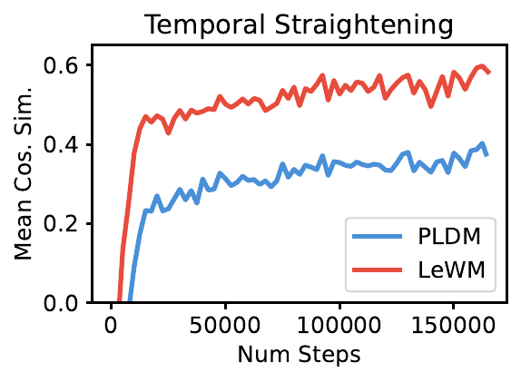

> **图 17：** Push-T 上的时间潜在拉直。训练过程中连续潜在速度向量之间的平均余弦相似度（公式 [9](#A8.E9)）。值越高表示潜在轨迹越直。PLDM 通过专用的时间平滑损失（$\mathcal{L}_{\text{time-sim}}$）明确鼓励时间规律性，而 LeWM 则作为一种纯粹的涌现现象，在其目标中没有任何时间正则项的情况下，实现了显著更直的潜在路径。

<a id="appendix-i"></a>

## 附录 I 训练曲线（Appendix I Training Curves）

我们可视化了几条训练曲线，比较了 LeWM（图 [18](#A9.F18)）和 PLDM（图 [19](#A9.F19)）的优化动态。与目标函数包含多个正则项的 PLDM 不同，LeWM 除了预测损失外仅使用一个正则项，这使得训练动态更易于解释和分析。

<a id="figure-18"></a>

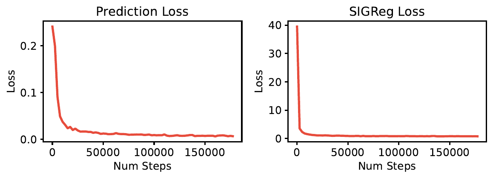

> **图 18：** LeWM 在 Push-T 上的训练曲线。

<a id="figure-19"></a>

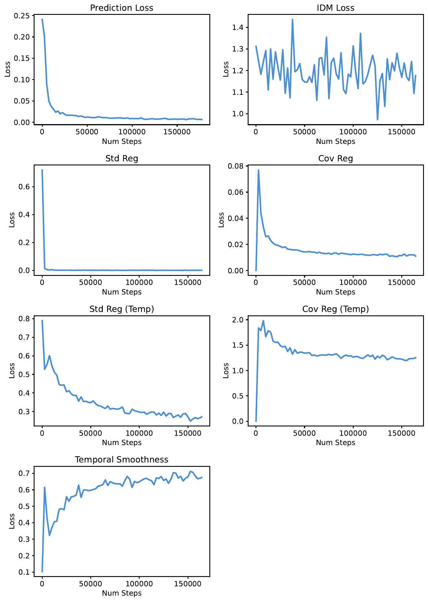

> **图 19：** PLDM 在 Push-T 上的训练曲线。
