# Title: LeWorldModel: Stable End-to-End Joint-Embedding Predictive Architecture from Pixels

- ArXiv: 2603.19312
- Authors: Lucas Maes*, Quentin Le Lidec*, Damien Scieur, Yann LeCun, Randall Balestriero, Mila & Université de Montréal, New York University, Samsung SAIL, Brown University
- Sections: 61
- Estimated tokens: 26.5k

## Contents

- 1 Introduction
- 2 Related Work
- 3 Method: LeWorldModel
  - 3.1 Learning the Latent World Model
    - Offline Dataset.
    - Model Architecture.
    - Training Objective.
  - 3.2 Latent Planning
- 4 Latent Planning Performance
  - 4.1 Planning evaluation setup
    - Environments.
    - Baselines.
  - 4.2 Towards Efficient Planning with WMs
  - 4.3 Towards Stable Training of World Models
    - Ablations.
    - Training Curves.
- 5 Quantifying Physical Understanding in LeWM
  - 5.1 Physical Structure of the Latent Space
    - Probing physical quantities.
    - Decoding Latent Space.
    - Visualizing Latent Space.
    - Temporal Latent Path Straightening.
  - 5.2 Violation-of-expectation Framework
- 6 Conclusion
  - Limitations & Future Work.

## Abstract

###### Abstract

Joint Embedding Predictive Architectures (JEPAs) offer a compelling framework for learning world models in compact latent spaces, yet existing methods remain fragile, relying on complex multi-term losses, exponential moving averages, pre-trained encoders, or auxiliary supervision to avoid representation collapse. In this work, we introduce LeWorldModel (LeWM), the first JEPA that trains stably end-to-end from raw pixels using only two loss terms: a next-embedding prediction loss and a regularizer enforcing Gaussian-distributed latent embeddings. This reduces tunable loss hyperparameters from six to one compared to the only existing end-to-end alternative. With 15M parameters trainable on a single GPU in a few hours, LeWM plans up to $48\times$ faster than foundation-model-based world models while remaining competitive across diverse 2D and 3D control tasks. Beyond control, we show that LeWM’s latent space encodes meaningful physical structure through probing of physical quantities. Surprise evaluation confirms that the model reliably detects physically implausible events.

[Website](https://le-wm.github.io) [Code](https://github.com/lucas-maes/le-wm)

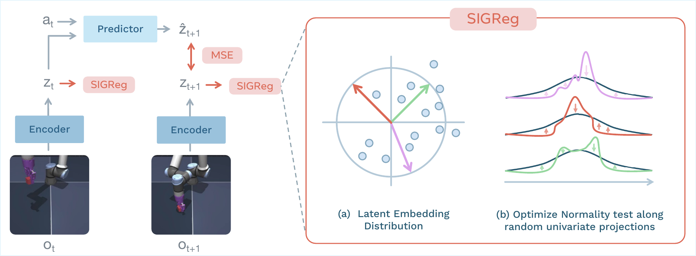

> Figure 1: LeWorldModel Training Pipeline. Given frame observations ${\bm{o}}_{1:T}$ and actions ${\bm{a}}_{1:T}$, the encoder maps frames into low-dimensional latent representations ${\bm{z}}_{1:T}$. The predictor models the environment dynamics by autoregressively predicting the next latent state ${\bm{z}}_{t+1}$ from the current latent state ${\bm{z}}_{t}$ and action ${\bm{a}}_{t}$. The encoder and predictor are jointly optimized using a mean-squared error (MSE) prediction loss. LeWM does not rely on any training heuristics, such as stop-gradient, exponential moving averages, or pre-trained representations. To prevent trivial collapse, the SIGReg regularization term enforces Gaussian-distributed latent embeddings, promoting feature diversity. More specifically, latent embeddings are projected onto multiple random directions, and a normality test is applied to each one-dimensional projection. Aggregating these statistics encourages the full embedding distribution to match an isotropic Gaussian.

## 1 Introduction

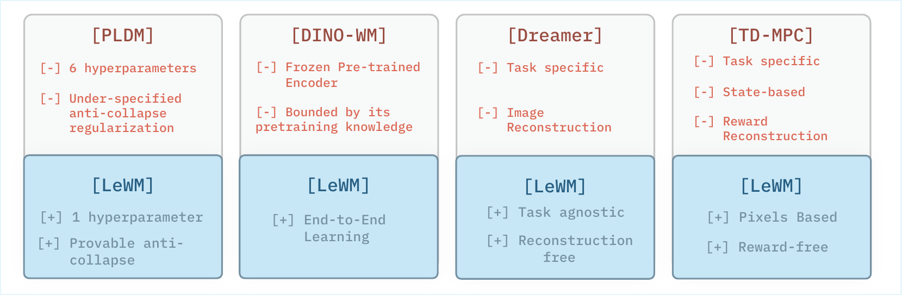

> Figure 2: Characteristics of latent world model approaches. Methods are grouped by training paradigm. End-to-end methods (PLDM) learn both the encoder and predictor jointly from pixels without relying on pre-trained representations or heuristic tricks such as stop-gradient or exponential moving averages, but require many hyperparameters and lack formal collapse guarantees. Foundation-based methods (DINO-WM) avoid collapse by freezing a pre-trained foundation vision encoder, forgoing end-to-end learning. Task-specific methods (Dreamer, TD-MPC) require reward signals or privileged state access during training. LeWM addresses the limitations of each category: it is end-to-end, task-agnostic, pixel-based, reconstruction- and reward-free, and requires only a single hyperparameter with provable anti-collapse guarantees.

A central goal of artificial intelligence is to develop agents that acquire skills across diverse tasks and environments using a single, unified learning paradigm—one that operates directly from sensory inputs of its surroundings–without hand-engineered state representations or domain-specific calibration. Vision is ideally suited for this aim: cameras are inexpensive and scalable, and learning from pixels enables fully end-to-end training from raw sensory input to action [35]. World Models (WMs) are a powerful family of methods [22] that learn to predict the consequences of actions in the environment. When successful, WMs allows agents to plan and to improve themselves solely form their model of the world, i.e., in imagination space. This is particularly valuable in the offline setting, where agents must learn from fixed datasets without environment interaction—leveraging the model to generate synthetic experience and evaluate counterfactual action sequences [38, 26].

A recent popular approach for learning world models is the Joint Embedding Predictive Architecture (JEPA) [34]. Instead of attempting to model every aspect of the environment, JEPA focuses on capturing the most relevant features needed to predict future states. Concretely, JEPA learns to encode observations into a compact, low-dimensional latent space and models temporal dynamics by predicting the latent representation of future observations.

However, despite their conceptual simplicity, existing JEPA methods are highly prone to collapse. In this failure mode, the model maps all inputs to nearly identical representations to trivially satisfy the temporal prediction objective leading to unusable representations. Preventing collapse is therefore one of the central challenges in training JEPA models. Many influential works have proposed methods to address this issue. Yet, these approaches typically rely on heuristic regularization, multi-objective loss functions, external sources of information, or architectural simplifications such as pre-trained encoders. In practice, these strategies often introduce additional instability or significantly increase training complexity.

To overcome these limitations, we propose LeWorldModel (LeWM), the first method to learn a stable JEPA end-to-end from raw pixels without heuristic, principled, and simple (cf. Fig [2](#S1.F2)). Furthermore, LeWM can be trained on a single GPU, lowering the barrier to entry for research. We evaluate LeWM across a diverse set of manipulation, navigation, and locomotion tasks in both 2D and 3D environments. In addition, we probe its intuitive physical understanding through targeted probing and surprise-quantification evaluations in latent space. Overall, our key findings and contributions are:

- We propose an end-to-end JEPA method for learning a latent world model from raw pixels on a single GPU. The method relies on a simple and stable two-term objective that remains robust across architectures and hyperparameter choices, while enabling efficient logarithmic-time hyperparameter search.
- LeWM achieves strong control performance across diverse 2D and 3D tasks with a compact 15M-parameter model, surpassing existing end-to-end JEPA-based approach while remaining competitive with foundation-model-based world models at substantially lower cost, enabling planning up to $48\times$ faster.
- We evaluate physical understanding in the latent space through probing of physical quantities and a violation-of-expectation test for detecting unphysical trajectories.

## 2 Related Work

  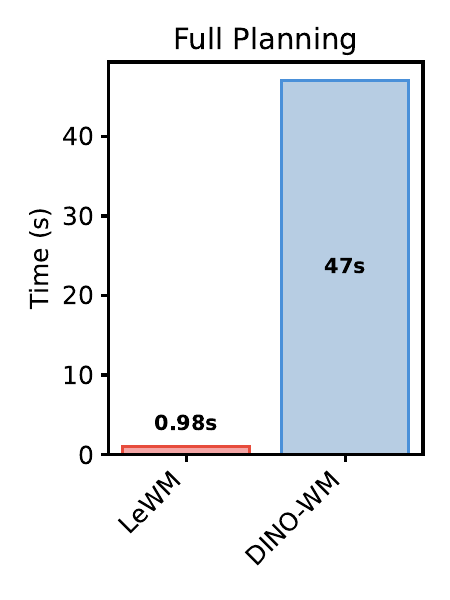
  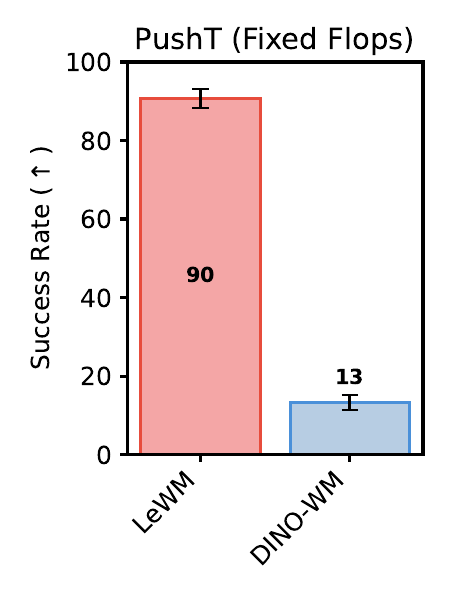
  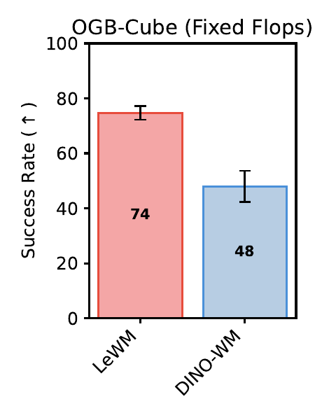

> Figure 3: Planning time and performance under fixed compute. Left: Planning time comparison averaged over 50 runs. Encoding observations with $\sim 200\times$ fewer tokens than DINO-WM allows LeWM to achieve planning speeds comparable to PLDM while being up to $\sim 50\times$ faster than DINO-WM. Center–Right: Planning performance under the same computational budget (fixed FLOPs). LeWM significantly outperforms DINO-WM on Push-T (center) and OGBench-Cube (right). See App. [D](#A4) for planning setup details.

World Models aim to learn predictive models of environment dynamics from data, enabling agents to reason about future states in imagination. A prominent class of WMs consists of _generative_ approaches that explicitly model environment dynamics in pixel space. These action-conditioned generative models act as learned simulators by producing future observations conditioned on past states and actions. Generative world models have been successfully applied to simulate existing game-like environments. For example, IRIS [38], DIAMOND [1], $\Delta$-IRIS [39], OASIS [14], and DreamerV4 [26] model environments such as Minecraft, Counter-Strike, and Crafter, improving policy sample efficiency in reinforcement learning. Other methods generate entirely new interactive simulators, e.g., Genie [12] and HunyuanWorld [30], while learned simulators have also been applied to robot policy evaluation [47]. Importantly, many generative WMs assume access to datasets containing reward signals, enabling joint modeling of dynamics and value-relevant information for downstream reinforcement learning. In contrast, we focus on the reward-free setting, corresponding to the setup considered in the JEPA line of work, which aims at learning generic, task-agnostic world models from observational data without relying on reward supervision.

JEPA is a framework for learning world models that predict the dynamic evolution of a system in a compact, low-dimensional latent space. Since their introduction by LeCun [34], JEPA methods have evolved considerably, differing mainly in their target tasks and in the strategies used to learn non-collapsing representations. One prominent line of work applies JEPA to self-supervised representation learning by predicting the latent embeddings of masked input patches. Examples include I-JEPA [2] for images, V-JEPA [9, 3] for videos, and Echo-JEPA and Brain-JEPA [15, 40] for medical data. These approaches typically employ an exponential moving average (EMA) of the target encoder together with stop-gradient (SG) updates to stabilize training and prevent representation collapse. However, the theoretical understanding of EMA and SG remains limited, as they do not in general correspond to the minimization of a well-defined objective [46]. A second line of work uses the JEPA recipe for action-conditioned latent world modeling. Some approaches rely on pretrained encoders to obtain representations [3, 55, 20, 41]. This avoids collapse but limits the expressivity of representation to the pretrained encoder used. In contrast, PLDM [49, 50] learns representations end-to-end using VICReg [10] with additional regularization terms, at the cost of known training instabilities and scalability limitations [6]. Several works further improve stability by incorporating auxiliary signals or architectural components, such as proprioceptive inputs or action decoders [55, 20]. In this work, we propose a stable method for training end-to-end JEPAs directly from raw pixels using a simple two-term loss: a predictive objective on future embeddings and a regularization objective that enforces Gaussian-distributed embeddings [7].

Planning with Latent Dynamics. World Models [21] pioneered learning policies directly from compact latent representations of high-dimensional observations. Some works leverage learned latent dynamics models to train policies using reinforcement learning [23, 24, 25, 26]. In these approaches, the generative world model acts as a simulator in which trajectories are rolled out in imagination, allowing policy optimization to occur largely in imagination in latent space. Once training is complete, the policy is executed directly, and the world model is no longer required at test time.

More recent works instead perform planning directly in the latent space at test time using Model Predictive Control (MPC) [52, 28, 27, 8, 55, 50]. In contrast to imagination-based policy learning, these methods use the world model online to predict the outcomes of candidate action sequences and iteratively optimize them during execution. The model therefore remains part of the control loop at runtime, enabling adaptive decision-making but increasing computational requirements.

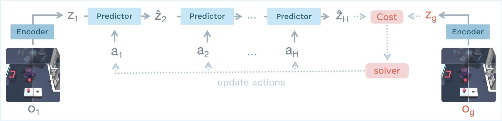

> Figure 4: LeWorldModel Latent Planning. Given an initial observation ${\bm{o}}_{1}$ and a goal ${\bm{o}}_{g}$, the world model learned in Fig. 2 performs planning in the LeWM latent space. The initial state embedding ${\bm{z}}_{1}$ and the goal embedding ${\bm{z}}_{g}$ are obtained from the encoder. The predictor then rolls out future latent states up to a horizon $H$. A latent cost between the final predicted state and the goal embedding guides a solver to optimize the action sequence. This prediction–optimization loop is repeated until convergence to a good plan candidate.

## 3 Method: LeWorldModel

In this section, we introduce LeWorldModel (LeWM). We first describe the streamlined training procedure used to learn the latent world model from offline data, including the dataset, model architecture, and training objective. We then explain how the learned model can be leveraged for decision making through latent planning using model predictive control (MPC).

### 3.1 Learning the Latent World Model

#### Offline Dataset.

We consider a fully offline and reward-free setting. LeWorldModel is trained solely from unannotated trajectories of observations and actions, without access to reward signals or task specifications. This setup aligns with the JEPA line of work [55, 3], which aims to learn generic, task-agnostic world models from observational data. Our objective is not to optimize behavior for a specific task, but to learn representations that capture environment dynamics and can later be controlled or adapted to a diverse set of tasks.

The training data consists of trajectories of length $T$ composed of raw pixel observations ${\bm{o}}_{1:T}$ and associated actions ${\bm{a}}_{1:T}$. Trajectories are collected offline from behavior policies with no optimality requirements; they may be pseudo-expert or exploratory, as long as they sufficiently cover the environment dynamics. Additional implementation details (batch size, resolution, and sub-trajectory construction) are provided in App. [D](#A4).

#### Model Architecture.

LeWM is built upon two components: an encoder and a predictor. The encoder maps a given frame observation ${\bm{o}}_{t}$ into a compact, low-dimensional latent representation ${\bm{z}}_{t}$. The predictor models the environment dynamics in latent space by predicting the embedding of the next frame observation $\hat{{\bm{z}}}_{t+1}$ given the latent embedding ${\bm{z}}_{t}$ and an action ${\bm{a}}_{t}$.

$$
Encoder: \displaystyle{\bm{z}}_{t}={\rm enc}_{\theta}({\bm{o}}_{t}) (LeWM) Predictor: \displaystyle\hat{{\bm{z}}}_{t+1}={\rm pred}_{\phi}({\bm{z}}_{t},{\bm{a}}_{t})
$$

The encoder is implemented as a Vision Transformer (ViT) [16]. Unless otherwise specified, we use the tiny configuration ($\sim$5M parameters) with a patch size of 14, 12 layers, 3 attention heads, and hidden dimensions of 192. The observation embedding ${\bm{z}}_{t}$ is constructed from the [CLS] token embedding of the last layer, followed by a projection step. The projection step maps the [CLS] token embedding into a new representation space using a 1-layer MLP with Batch Normalization [32]. This step is necessary because the final ViT layer applies a Layer Normalization [4], which prevents our anti-collapse objective from being optimized effectively.

The predictor is a transformer with 6 layers, 16 attention heads, and 10% dropout ($\sim$10M parameters). Actions are incorporated into the predictor through Adaptive Layer Normalization (AdaLN) [45] applied at each layer. The AdaLN parameters are initialized to zero to stabilize training and ensure that action conditioning impacts the predictor training progressively. The predictor takes as input a history of $N$ frame representations and predicts the next frame representation auto-regressively with temporal causal masking to avoid looking at future embeddings. The predictor is also followed by a projector network with the same implementation as the one used for the encoder. All components of our world model are learned jointly using the loss described in the following paragraph.

#### Training Objective.

Our objective is to learn latent representations useful for predicting the future, i.e., modeling the environment dynamics. LeWorldModel training objective is the sum of two terms: a prediction loss and a regularization loss. The prediction loss $\mathcal{L}_{\rm pred}$ (teacher-forcing) computes the error between the predicted embedding of consecutive time-steps:

$$
\mathcal{L}_{\rm pred}\triangleq\|\hat{{\bm{z}}}_{t+1}-{{\bm{z}}}_{t+1}\|^{2}_{2},\quad\quad\hat{{\bm{z}}}_{t+1}={\rm pred}_{\phi}({\bm{z}}_{t},{\bm{a}}_{t}).(1)
$$

Through the prediction loss, the encoder is incentivized to learn a predictable representation for the predictor.

However, this loss alone leads to representation collapse, yielding a trivial solution in which the encoder maps all inputs to a constant representation. To prevent this behavior, we introduce an anti-collapse regularization term that promotes feature diversity in the embedding space. Specifically, we adopt the Sketched-Isotropic-Gaussian Regularizer (SIGReg) [7] due to its simplicity, scalability, and stability. SIGReg encourages the latent embeddings to match an isotropic Gaussian target distribution.

Let ${\bm{Z}}\in\mathbb{R}^{N\times B\times d}$ denote the tensor of latent embeddings collected over the history length $N$, the batch size $B$, and where $d$ demotes the embedding dimension. Assessing normality directly in high-dimensional spaces is challenging, as most classical normality tests are designed for univariate data and do not scale reliably with dimensionality. SIGReg circumvents this limitation by projecting embeddings onto $M$ random unit-norm directions ${\bm{u}}^{(m)}\in\mathbb{S}^{d-1}$ and optimizing the univariate Epps–Pulley [17] test statistic $T(\cdot)$ along the resulting one-dimensional projections ${\bm{h}}^{(m)}={\bm{Z}}{\bm{u}}^{(m)}$, as illustrated in Fig.[1](#S0.F1). By the Cramér–Wold theorem [13], matching all one-dimensional marginals is equivalent to matching the full joint distribution.

$$
{\rm SIGReg}({\bm{Z}})\triangleq\frac{1}{M}\sum_{m=1}^{M}T({\bm{h}}^{(m)}).(2)
$$

Additional details on SIGReg and the definition of the Epps–Pulley statistical test are provided in appendix [A](#A1).

The complete LeWM training objective is defined as:

$$
{\mathcal{L}}_{\rm LeWM}\triangleq{\mathcal{L}}_{\rm pred}+\lambda\,{\rm SIGReg}({\bm{Z}}).(3)
$$

The method introduces only two training hyperparameters: the number of random projections $M$ used in SIGReg and the regularization weight $\lambda$. Unless otherwise specified, we use $M=1024$ projections and $\lambda=0.1$. In practice, we observe that the number of projections has negligible impact on downstream performance (see Sec. [4](#S4) and App. [G](#A7)), making $\lambda$ the only effective hyperparameter to tune. This greatly simplifies hyperparameter selection, as $\lambda$ can be efficiently optimized using a simple bisection search with logarithmic complexity. We do not employ stop-gradient, exponential moving averages, or additional stabilization heuristics. Gradients are propagated through all components of the loss, and all parameters are optimized jointly in an end-to-end manner, resulting in a streamlined and easy-to-implement training procedure. The training logic is summarized in Alg. [5](#S3.F5).

> Figure 5: Algorithm 5. Pseudo-code for the training procedure of LeWorldModel. Pixel observations are encoded into latent embeddings, and a predictor estimates the dynamics by predicting the next-step embedding conditioned on actions. The model is optimized end-to-end using a next-embedding prediction loss together with a step-wise SIGReg regularization term to prevent representation collapse.

### 3.2 Latent Planning

At inference time, we perform trajectory optimization in our world model latent space, as illustrated in Fig.[4](#S2.F4). Given an initial observation ${\bm{o}}_{1}$, we initialize a candidate action sequence randomly and iteratively rollout predicted latent states up to a planning horizon $H$. The model predicts latent transitions according to

$$
\hat{{\bm{z}}}_{t+1}={\rm pred}_{\phi}(\hat{{\bm{z}}}_{t},{\bm{a}}_{t}),\quad\hat{{\bm{z}}}_{1}={\rm enc}_{\theta}({\bm{o}}_{1}),
$$

Planning is performed by optimizing the action sequence to minimize a terminal latent goal-matching objective:

$$
{\mathcal{C}}(\hat{{\bm{z}}}_{H})=\|\hat{{\bm{z}}}_{H}-{\bm{z}}_{g}\|_{2}^{2},\quad{\bm{z}}_{g}={\rm enc}_{\theta}({\bm{o}}_{g}),(4)
$$

where $\hat{{\bm{z}}}_{H}$ is the predicted latent state at the end of the rollout and ${\bm{z}}_{g}$ is the latent embedding of the goal observation ${\bm{o}}_{g}$. The world model parameters remain fixed during planning. This procedure corresponds to a finite-horizon optimal control problem:

$$
{\bm{a}}^{*}_{1:H}=\arg\min_{{\bm{a}}_{1:H}}{\mathcal{C}}(\hat{{\bm{z}}}_{H}),(5)
$$

which we solve using the Cross-Entropy Method (CEM) [48], a sampling method that iteratively selects the best plan and updates the parameters of the sampling distribution with the statistics of the best plans. The planning horizon $H$ trades off long-term lookahead against increased computational cost and model bias. In particular, auto-regressive rollouts accumulate prediction errors as the horizon grows, which can deteriorate the quality of the optimized action sequence. To mitigate this effect, we adopt a Model Predictive Control (MPC) strategy: only the first $K$ planned actions are executed before replanning from the updated observation. We provide more details on the planning strategy in appendix [D](#A4).

## 4 Latent Planning Performance

### 4.1 Planning evaluation setup

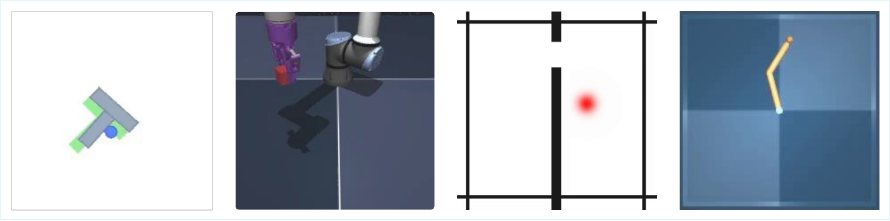

> Figure 5: Environments used for evaluation. Left: Push-T, a 2D manipulation task where the agent must push a block toward a target configuration, commonly used as a robotics benchmark. Center (1): OGBench-Cube, a visually richer 3D manipulation environment where a robotic arm interacts with a cube to reach a target position. Center (2): Two-Room, a simple 2D navigation environment where an agent moves between rooms to reach target positions. Right: Reacher, a task where a 2-joint arm needs to reach a target configuration in a 2D plane. All environments have a continuous action space. More details on environment and datasets are available in appendix [E](#A5).

#### Environments.

We evaluate LeWM on a diverse set of tasks, including navigation, motion planning and manipulation, in both two- and three-dimensional environments, all illustrated in Fig. [5](#S4.F5). We provide more details on dataset generation and environments in App. [E](#A5).

#### Baselines.

We compare the performance of LeWM against several baselines: DINO-WM and PLDM, two state-of-the-art JEPA-based methods; a goal-conditioned behavioral cloning policy (GCBC); and two goal-conditioned offline reinforcement learning algorithms, GCIVL and GCIQL. Among these baselines, PLDM is the closest to our setup, as it also learns a world model end-to-end directly from pixel observations. However, it relies on a seven-term training objective derived from the VICReg criterion, which introduces training instability and increases the complexity of hyperparameter tuning. DINO-WM, in contrast, models dynamics using DINOv2 [42] as feature encoder to mitigate representation collapse, but its original formulation additionally incorporates other modalities, such as proprioceptive inputs; for a fair comparison, unless specified otherwise, we exclude proprioceptive information from DINO-WM. Additional implementation details for the baselines (App. [C](#A3)) and evaluation settings (App. [F.1](#A6.SS1)) are provided in the appendix. For each method, we keep the hyperparameters fixed across all environments.

### 4.2 Towards Efficient Planning with WMs

We report planning performance in Fig. [6](#S4.F6). LeWM improves over PLDM on the more challenging planning tasks, achieving an 18% higher success rate on PushT while remaining competitive with DINO-WM. Notably, on PushT, LeWM (pixels-only) surpasses DINO-WM, even when DINO-WM has access to additional proprioceptive information, demonstrating LeWM’s ability to capture underlying task-relevant quantities. Moreover, when comparing planning speedups (Fig. [3](#S2.F3)), LeWM achieves a 48× faster planning time, with the full planning completing in under one second while preserving competitive performance across tasks. This planning time is consistent across environments for a fixed planning setup, narrowing gap with real-time control.

We report planning performance in Fig. [6](#S4.F6). LeWM outperforms PLDM on the more challenging planning tasks, achieving an 18% higher success rate on PushT, while remaining competitive with DINO-WM. Notably, on PushT, LeWM (pixels-only) surpasses DINO-WM even when DINO-WM has access to additional proprioceptive information, demonstrating LeWM’s ability to capture underlying task-relevant quantities. Interestingly, LeWM performs worse on the simplest environment, Two-Room. A possible explanation is that the low diversity and low intrinsic dimensionality of this dataset make it difficult for the encoder to match the isotropic Gaussian prior enforced by SIGReg in a high-dimensional latent space, which may lead to a less structured latent representation. This highlights a potential limitation of the SIGReg regularization in very low-complexity environments.

Moreover, when comparing planning speedups (Fig. [3](#S2.F3)), LeWM achieves a $48\times$ faster planning time, with the full planning completing in under one second while preserving competitive performance across tasks. This planning time remains consistent across environments for a fixed planning setup, narrowing the gap toward real-time control.

### 4.3 Towards Stable Training of World Models

#### Ablations.

We perform ablations on several design choices of LeWM. First, we analyze the sensitivity of SIGReg to its internal parameters, namely the number of random projections and the number of integration knots. The performance is largely unaffected by these quantities, indicating that they do not require careful tuning. As a result, the regularization weight $\lambda$ remains the only effective hyperparameter. Since only a single hyperparameter needs to be tuned, grid search can be performed efficiently using a simple bisection strategy ($\mathcal{O}(\log n)$), whereas PLDM requires search in polynomial time ($\mathcal{O}(n^{6})$). We also study the effect of the embedding dimensionality. While the representation dimension must be sufficiently large for the method to perform well, performance quickly saturates beyond a certain threshold, suggesting that the approach is robust to the precise choice of encoder capacity. Additionally, we examine the impact of the encoder architecture by replacing the default ViT encoder with a ResNet-18 backbone (Tab. [8](#A7.T8)). LeWM achieves competitive performance with both architectures, indicating that it is largely agnostic to the choice of vision encoder. Details on all ablations are available in App. [G](#A7).

#### Training Curves.

We report the training loss curves on PushT for LeWM in Fig. [18](#A9.F18) and PLDM in Fig. [19](#A9.F19). The two-term objective of LeWM exhibits smooth and monotonic convergence: the prediction loss decreases steadily while the SIGReg regularization term drops sharply in the early phase of training before plateauing, indicating that the latent distribution quickly approaches the isotropic Gaussian target. In contrast, PLDM’s seven-term objective displays noisy and non-monotonic behavior across several of its loss components. These observations highlight a key advantage of LeWM: by reducing the training objective to only two well-behaved terms, the training becomes significantly more stable, removing the need to balance competing gradients from multiple regularizers.

  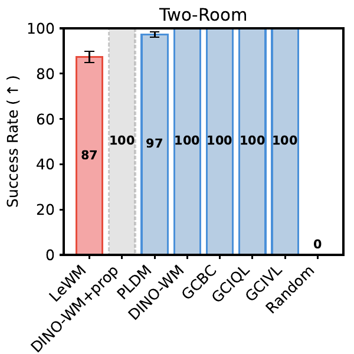
  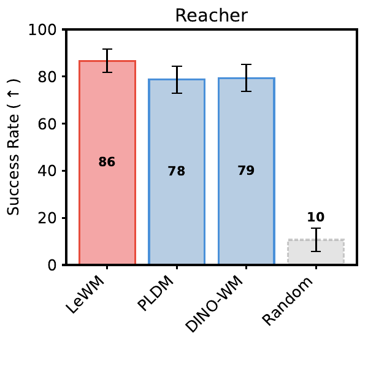
  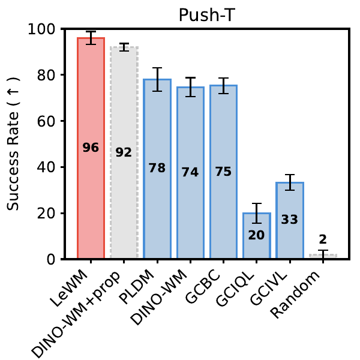
  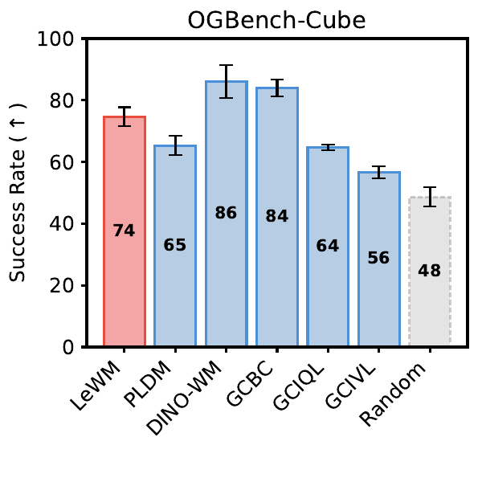

> Figure 6: Planning performance across environments. Results are shown for Two-Room (left), Reacher (center 1), PushT (center-2) and OGBench-Cube (right). LeWM consistently outperforms PLDM and DINO-WM on Push-T and Reacher. On OGBench-Cube, DINO-WM slightly outperforms LeWM, possibly due to the higher visual complexity and the 3D nature of the environment, which makes encoder training more challenging. In the simpler Two-Room environment, PLDM and DINO-WM outperform LeWM, which may be explained by the SIGReg regularization encouraging a Gaussian distribution in a high-dimensional latent space, while the intrinsic dimensionality of the environment is much lower.

## 5 Quantifying Physical Understanding in LeWM

In this section, we evaluate the quality of the dynamics captured by LeWM’s latent space, either by learning to extract physical quantities from latent embeddings or by measuring the world model’s ability to detect changes in physics.

### 5.1 Physical Structure of the Latent Space

#### Probing physical quantities.

As a first measure of physical understanding, we evaluate which physical quantities are recoverable from LeWM’s latent representations. We train both linear and non-linear probes to predict physical quantities of interest from a given embedding. Results on the Push-T environment are reported in Tab. [1](#S5.T1). Our method consistently outperforms PLDM while remaining competitive with representations produced by large pretrained models such as DINOv2. We provide probing results on other environments in App. [F.2](#A6.SS2).

> Table 1: Physical latent probing results on Push-T. LeWM consistently outperforms PLDM while remaining competitive with DINO-WM. The strong probing performance of DINO-WM on certain properties may stem from its foundation-model pretraining: the DINOv2 encoder is trained on two orders of magnitude more data ($\sim$124M images) spanning a far more diverse distribution, which likely allows it to capture some physical properties in its embeddings by default.

|                |                           | Linear                    | MLP                       |                           |                  |
| -------------- | ------------------------- | ------------------------- | ------------------------- | ------------------------- | ---------------- |
| Property       | Model                     | MSE $\downarrow$          | r $\uparrow$              | MSE $\downarrow$          | r $\uparrow$     |
| Agent Location | DINO-WM                   | $1.888\pm 0.500$          | $\mathbf{0.977}$          | $\mathbf{0.003\pm 0.022}$ | $\mathbf{0.999}$ |
| PLDM           | $0.090\pm 0.311$          | $0.955$                   | $0.014\pm 0.119$          | $0.993$                   |                  |
| LeWM           | $\mathbf{0.052\pm 0.149}$ | $0.974$                   | $0.004\pm 0.056$          | $0.998$                   |                  |
| Block Location | DINO-WM                   | $\mathbf{0.006\pm 0.007}$ | $\mathbf{0.997}$          | $0.002\pm 0.003$          | $\mathbf{0.999}$ |
| PLDM           | $0.122\pm 0.341$          | $0.938$                   | $0.011\pm 0.066$          | $0.994$                   |                  |
| LeWM           | $0.029\pm 0.073$          | $0.986$                   | $\mathbf{0.001\pm 0.006}$ | $\mathbf{0.999}$          |                  |
| Block Angle    | DINO-WM                   | $\mathbf{0.050\pm 0.101}$ | $\mathbf{0.979}$          | $\mathbf{0.009\pm 0.052}$ | $\mathbf{0.995}$ |
| PLDM           | $0.446\pm 0.625$          | $0.745$                   | $0.056\pm 0.184$          | $0.972$                   |                  |
| LeWM           | $0.187\pm 0.359$          | $0.902$                   | $0.021\pm 0.139$          | $0.990$                   |                  |

  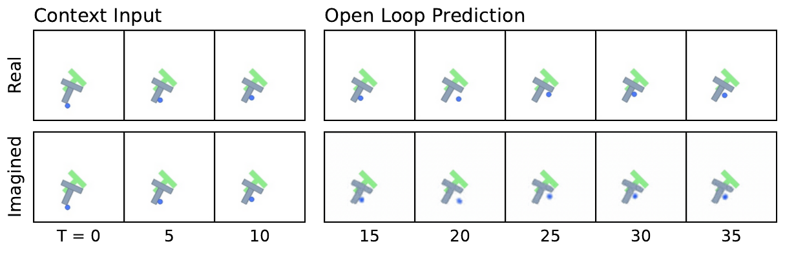
  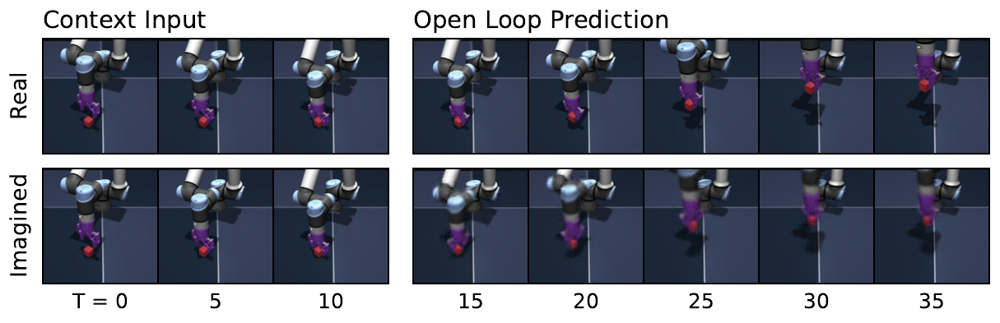

> Figure 7: Predictor rollouts on PushT and OGBench-Cube. We visualize decoded latent plans produced by LeWM given a context and an action sequence. Each rollout uses three image observations as context, which are encoded into latent representations. Conditioned on the action sequence, the predictor autoregressively generates future latent states in an open-loop manner. All predicted latents are decoded into images using a decoder that was not used during training. The resulting imagined rollouts closely match the real observations, demonstrating that the latent representation effectively captures the overall scene structure and essential environment dynamics. Some finer details, however, are not fully captured by LeWM; for instance, the angle of the end-effector in OGBench-Cube. Additional rollouts are provided in Fig. [11](#A6.F11).

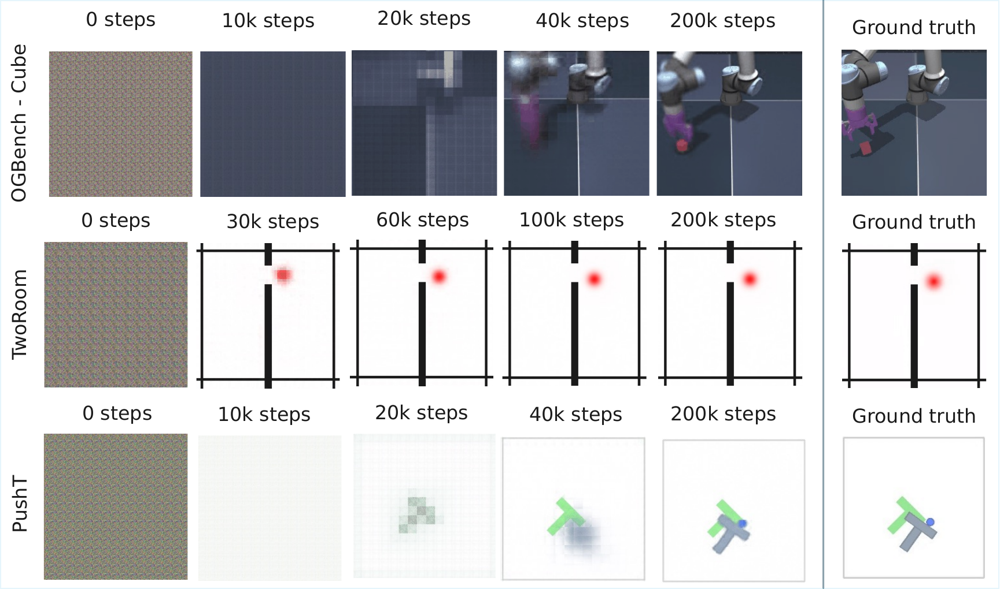

> Figure 8: Decoder visualization during training. As training progresses, the latent representation increasingly captures the information required to reconstruct the visual scene, even though no reconstruction loss is used during training. Early in training, the decoded images correspond to slow features, a phenomenon previously reported [49].

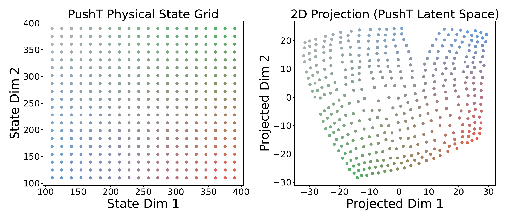

> Figure 9: Visualization of the latent space obtained with LeWM for the PushT environment. On the left, the grid of states is obtained by moving the agent and the block in the x-y plane. On the right, the embeddings of these states are visualized using a t-SNE.

#### Decoding Latent Space.

To further assess the information captured in the latent representation, we report in Fig. [8](#S5.F8) images produced by a decoder trained to reconstruct pixel observations from a single latent embedding (192 dim) during training. Although reconstruction is never used during training, the decoder is able to recover the visual scene from the learned representation, confirming that the low-dimensional and compact latent space retains sufficient information about the underlying physical state. Details on the decoder architecture are provided in App. [D](#A4).

#### Visualizing Latent Space.

We further visualize the structure of the latent space using t-SNE. Fig. [9](#S5.F9) provides a qualitative visualization of the latent space in the PushT environment. The visualization suggests that the learned representation captures the spatial structure of the environment, preserving neighborhood relationships and relative positions in the latent space.

#### Temporal Latent Path Straightening.

Inspired by the temporal straightening hypothesis from neuroscience [29], we measure the cosine similarity between consecutive latent velocity vectors throughout training (Eq. [9](#A8.E9)). We find that LeWM’s latent trajectories become increasingly straight on PushT over training as a purely emergent phenomenon, without any explicit regularization encouraging this behavior, cf. Fig. [17](#A8.F17). Remarkably, LeWM achieves higher temporal straightness than PLDM, despite PLDM employing a dedicated temporal smoothness regularization term. We detail our findings in App. [H](#A8).

### 5.2 Violation-of-expectation Framework

  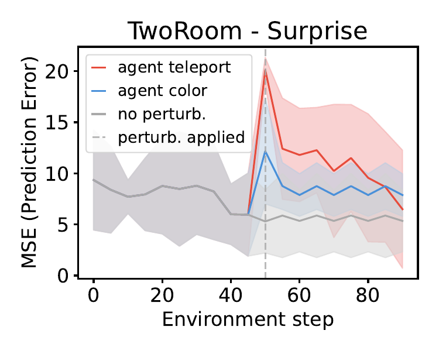
  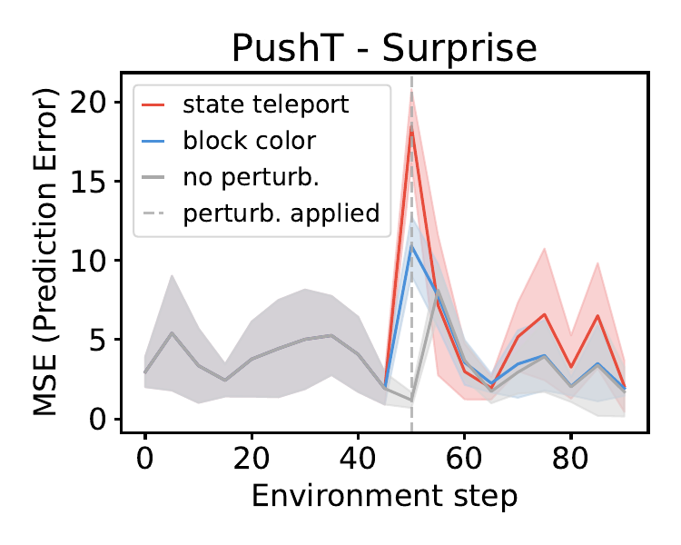
  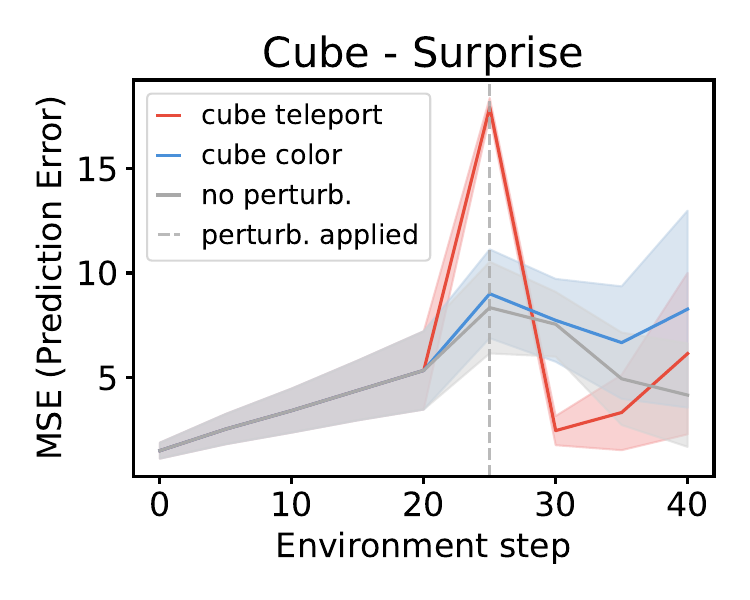

> Figure 10: Violation-of-expectation evaluation across three environments. Each plot shows the model’s surprise along three trajectories: an unperturbed reference trajectory, a visually perturbed trajectory where an object’s color changes abruptly, and a physically perturbed trajectory where one or more objects are teleported to a random position. The teleportation violates physical continuity and produces a pronounced spike in surprise, while the unperturbed trajectory maintains a low baseline. Surprise is significantly higher for teleportation perturbations across all three environments (paired t-test, $p<0.01$), whereas for the cube color perturbation the increase is weaker and not significant, indicating that the model is more sensitive to physical perturbations than to visual ones. From left to right, the environments are TwoRoom, PushT, and OGBench Cube.

Another approach to quantifying physical understanding is the ability to detect violations of the learned world model. Inspired by the violation-of-expectation (VoE) paradigm used in developmental psychology and recently adopted in machine learning [37, 18, 11], this framework evaluates whether a model assigns higher surprise to events that contradict learned physical regularities.

Following prior work, we quantify surprise by measuring the discrepancy between the model’s predicted future observations and the actual observed future. We evaluate this framework across three environments: TwoRoom, PushT, and OGBench Cube. For each environment, we introduce two types of perturbations. The first is a visual perturbation, where the color of an object changes abruptly during the trajectory. The second is a physical perturbation, where one or more objects are teleported to a random location, violating the expected physical continuity of the scene. Fig. [10](#S5.F10) shows that LeWM consistently assigns higher surprise to frames containing physical violations compared to their unperturbed counterparts. We provide more details on VoE in App. [F.3](#A6.SS3).

## 6 Conclusion

This work introduced LeWorldModel (LeWM), a stable end-to-end method for learning latent world models of environments. LeWM is a Joint-Embedding Predictive Architecture that uses an encoder to map image observations into a latent space and a predictor that models temporal dynamics in the embedding space by predicting future embeddings conditioned on actions. Across a variety of continuous control environments and using only raw pixel inputs, LeWM outperforms previous approaches in data efficiency, planning time, training time, and stability while maintaining competitive final task performance. The stability and simplicity of training arise from explicitly encouraging latent embeddings to follow an isotropic Gaussian distribution to avoid collapse. Overall, LeWM provides a scalable alternative to existing latent world model methods, offering principled training dynamics alongside interpretable and emergent representation properties.

#### Limitations & Future Work.

Despite these promising results, several limitations highlight important research directions. First, planning with current latent world models remains restricted to short horizons. Hierarchical world modeling represents a promising direction to address long-horizon reasoning and planning. Second, our approach still relies on offline datasets with sufficient interaction coverage, which can be costly or difficult to collect. In particular, limited data diversity can affect the effectiveness of the SIGReg regularization in very simple environments with low intrinsic dimensionality, where matching the isotropic Gaussian prior in a high-dimensional latent space becomes challenging. Pre-training on large and diverse natural video datasets could provide strong representation priors and reduce reliance on domain-specific data. Finally, current end-to-end latent world models depend on action labels to predict future states, which can also be costly to obtain. A promising direction is to learn future action representations through inverse dynamics modeling, potentially reducing the need for explicit action annotations.
