# 标题：V-JEPA 2.1：解锁视频自监督学习中的密集特征

- ArXiv：2603.14482
- 作者：Lorenzo Mur-Labadia, Matthew Muckley, Amir Bar, Mido Assran, Koustuv Sinha, Mike Rabbat, Yann LeCun, Nicolas Ballas, Adrien Bardes, [
- 章节：80
- 估计词元数：74.4k

## 目录

- 1 引言
- 2 方法
  - 2.1 预备知识：联合嵌入预测架构
  - 2.2 V-JEPA 特征在密集视觉任务中的分析
    - 观察与假设。
    - 上下文自监督。
  - 2.3 V-JEPA 2.1：改进密集视频 SSL 特征
    - VJEPA 2.1 架构。
    - 实现细节。
    - 实证评估。
    - 2.3.1 密集预测损失
    - 2.3.2 深度自监督
    - 2.3.3 扩展图像数据。
    - 2.3.4 多模态分词器
    - 2.3.5 将模型规模扩展至 ViT-G (2B) 及高分辨率冷却
    - 2.3.6 模型蒸馏
- 3 结果
  - 3.1 短期物体交互预测
    - 任务。
    - 评估协议。
    - 结果。
  - 3.2 动作预测
    - 任务。
    - 评估协议。
    - 结果。
  - 3.3 机械臂规划
  - 3.4 导航规划
  - 3.5 深度估计与语义分割
    - 任务。
    - 评估协议。
    - 结果。
  - 3.6 视频物体分割
    - 任务。
    - 评估协议。
    - 结果。
  - 3.7 视频与图像分类
    - 任务。
    - 评估协议。
    - 结果。
  - 3.8 视频问答
    - 任务。
    - 评估协议。
    - 结果。
  - 3.9 V-JEPA 2.1 密集特征的定性结果
  - 3.10 蒸馏模型家族
- 4 相关工作
  - 自监督学习。
  - 视频模型。
  - 学习密集特征。
- 5 结论与未来工作
  - 未来工作。
- 参考文献
- 6 预训练细节
- 7 蒸馏细节
- 8 评估协议
  - 8.1 深度估计
    - 数据集与指标。
    - 评估协议。
  - 8.2 语义分割
    - 数据集与指标。
    - 评估协议。
  - 8.3 视频物体分割跟踪
    - 数据集与指标。
    - 评估协议。
  - 8.4 短期物体交互预测
    - 数据集与指标。
    - 评估协议。
    - 探针架构。
    - 优化。
  - 8.5 视频与图像分类
    - 数据集与指标。
    - 探针架构。
    - 评估协议。
    - 优化。
  - 8.6 动作预测
    - 数据集与指标。
    - 评估协议。
- 9 额外消融实验
  - 9.1 多尺度评估
  - 9.2 预训练空间分辨率

## Abstract

###### Abstract

我们提出了 V-JEPA 2.1，这是一个 **自监督模型（Self-supervised models）** 系列，能够为图像和视频中的视觉场景学习 **密集（dense）** 、高质量的表征，同时保持强大的 **全局（global）** 场景理解能力。V-JEPA 2.1 结合了四个关键要素：

1.  **密集预测损失（Dense Predictive Loss）** ：一种基于掩码的目标函数，其中 **所有** 词元（token）——无论是可见的上下文词元还是被掩码的词元——都对训练损失有贡献，从而鼓励显式的空间和时间基础化。
2.  **深度自监督（Deep Self-Supervision）** ：将自监督目标分层应用于多个中间编码器层，以提高表征质量。
3.  **多模态分词器（Multi-Modal Tokenizers）** ：支持图像和视频的统一训练。
4.  有效的模型和数据扩展。

这些设计选择显著提高了密集特征的质量，产生了空间结构清晰、语义连贯且时间一致的表征。

实证结果表明，V-JEPA 2.1 在一系列基准测试中取得了最先进的结果：

- 在 Ego4D 数据集上，短期物体交互预测（short-term object-interaction anticipation）的 mAP（Mean Average Precision）达到 7.71。
- 在 EPIC-KITCHENS 数据集上，高级动作预测（high-level action anticipation）的 Recall@5 达到 40.8。
- 与 VJEPA-2 AC 相比，真实机器人抓取成功率提高了 20%。

该模型还在机器人导航（Tartan Drive 数据集上 ATE（Absolute Trajectory Error）为 5.687）、深度估计（NYUv2 数据集上使用线性探针的 RMSE（Root Mean Square Error）为 0.307）和全局识别（Something-Something-V2 数据集上准确率为 77.7%）方面展示了最先进的性能。

我们的结果表明，V-JEPA 2.1 在密集视觉理解和世界建模方面推动了技术前沿。

\metadata[代码][https://github.com/facebookresearch/vjepa2](https://github.com/facebookresearch/vjepa2)

<a id="figure-1"></a>

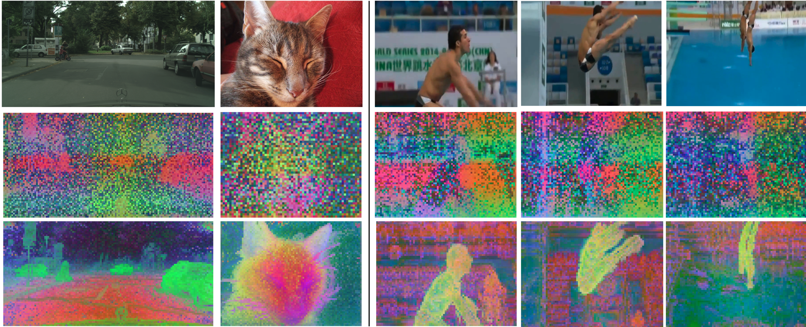

> 图 1：V-JEPA 2.1 解锁了高质量的密集特征。我们对从同一图像或视频中提取的 **图像块特征（patch features）** 进行 **主成分分析（Principal Component Analysis, PCA）** ，并将前三个主成分映射到 RGB 通道，分别针对 V-JEPA 2（ViT-g）和 V-JEPA 2.1（ViT-G）。我们新颖的 V-JEPA 2.1 产生了具有强大空间和时间一致性的密集表征，学习到了语义连贯的特征，其中相似的对象映射到相同的 PCA 成分。

<a id="section-1"></a>

## 1 Introduction（引言）

**世界模型（World models）** 有望使智能体（agents）能够在物理世界中有效地感知、预测和规划（Sutton, 1981; Ha and Schmidhuber, 2018; Assran et al., 2023）。这些模型的核心在于 **状态估计（state-estimation）** 问题：学习能够从低层次、含噪声的感知输入中可靠地总结当前世界状态的 **表征（representations）** 。来自视频的 **自监督学习（Self-Supervised Learning, SSL）** 最近已成为实现这一目标的有力途径（Caron et al., 2021; Assran et al., 2025），因为它可以利用大规模、无标签的数据来学习捕捉场景几何、动态和内在物理属性的表征（Siméoni et al., 2025; Garrido et al., 2025）。

<a id="figure-2"></a>

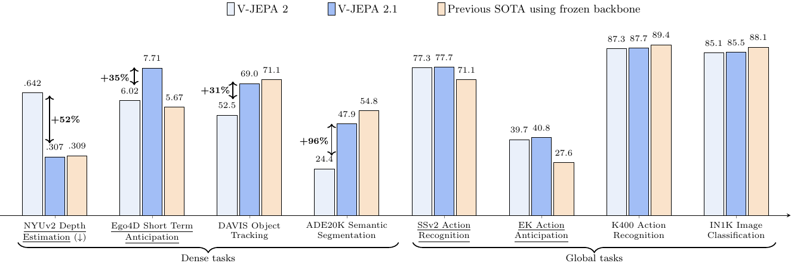

> 图 2：V-JEPA 2.1 ViT-G 在密集和全局预测任务上的性能。我们展示了 V-JEPA 2.1 相较于之前的 V-JEPA 2 ViT-g 模型（Assran et al., 2025）的相对改进。我们还报告了使用冻结骨干网络评估的先前 SOTA（State-Of-The-Art）模型的性能：DINOv3（Siméoni et al., 2025）是深度估计、目标跟踪、语义分割、SSv2 动作识别和图像分类的参考模型；InternVideo2s（Wang et al., 2024b）用于 K400 动作识别，STAformer（Mur-Labadia et al., 2024）用于短期目标交互预测，PlausiVL（Mittal et al., 2024）用于动作预测。V-JEPA 2.1 ViT-G 在冻结骨干网络评估中获得 SOTA 的任务已加下划线。

尽管进展迅速，但学习能够同时保留 **密集（dense）** 时空结构（定位、几何和跟踪所需），又能捕捉 **动态（dynamics）** 并支持 **全局（global）** 理解（高层次识别所需）的表征，仍然是一个开放的挑战。
在最近的进展中， **联合嵌入预测架构（Joint Embedding Predictive Architectures, JEPA）** （LeCun, 2022）——特别是 **V-JEPA（Video-JEPA）** 系列（Bardes et al., 2024; Assran et al., 2025）——已展现出强大的全局视频理解能力，尤其是在需要对运动和动态进行建模的场景中，并显示出在具身智能体（embodied agents）中实现预测和规划的潜力（Assran et al., 2025）。然而，如图 [1](#S0.F1) 所示，它们学习到的表征可能不太适合提取细粒度的局部空间结构。相比之下，其他 SSL 方法，如 **DINO（Distillation with NO labels）** （Caron et al., 2021; Oquab et al., 2023; Siméoni et al., 2025），能为检测和分割任务生成高质量的密集特征，但主要基于图像，因此无法直接从视频中学习时间动态。

在本工作中，我们研究了一种基于 **潜在掩码去噪目标（latent mask-denoising objective）** 的自监督学习，其中模型直接在学到的表示空间中预测图像或视频的掩码片段。我们的核心发现是：当预测损失仅应用于掩码区域时，高质量的 **密集（dense）** 时空特征——即保留细粒度空间布局和运动动态的特征——并不能可靠地涌现。相反，将预测损失扩展到 **整个（entire）** 输入（包括掩码和未掩码的片段），能显著改善低级（密集）表示。

基于这一洞见，我们提出了 **V-JEPA 2.1** ，一种用于学习统一图像和视频表示的自监督方法。V-JEPA 2.1 使用一种应用于 **所有词元（all tokens）** （包括可见上下文词元和掩码词元）的 **密集预测损失（dense predictive loss）** ，将每个词元锚定在其时空位置，并防止可见词元充当全局聚合器——这种效应是 **提升（improving）** 密集特征质量的关键（图 [3](#S2.F3)）。此外，我们发现 **深度自监督（deep self-supervision）** ——在多个中间编码器层分层应用损失，以在整个网络中提供训练信号——能在密集和全局下游任务上带来一致的性能提升。为了实现跨模态的原生联合训练，我们在一个共享编码器内为图像和视频使用了模态特定的学习型分词器。最后，我们展示了这些改进会随数据和模型规模扩展：使用 VisionMix-163M 将图像组件从 100 万扩展到 1.42 亿张图像，并将模型参数从 3 亿扩展到 20 亿，带来了系统性的下游性能增益。

我们训练并发布了一系列 V-JEPA 2.1 模型（ViT-g/G， 10亿/20亿参数），以及两个经过蒸馏的较小变体（ViT-B/L， 8000万/3亿参数）。实证表明，V-JEPA 2.1 在涵盖细粒度和语义预测的 **预测性（predictive）** 视频基准测试中达到了最先进的性能：它在 Ego4D 短期物体交互预测任务上达到了 7.71 mAP，该任务需要预测交互将 **在何处（where）** 以及 **何时（when）** 发生（定位交互区域和交互时间）；在 EPIC-KITCHENS-100 动作预测任务上达到了 40.8 Recall@5，该任务评估了从部分时间上下文预测即将发生动作的能力。

我们进一步证明，更好的密集特征也能提升世界建模任务的性能。当我们在新环境中零样本部署我们的模型到真实的 Franka 机械臂上进行抓取任务时，V-JEPA 2.1 的密集特征相比 VJEPA-2 AC (Assran et al., 2025) 带来了 +20% 的成功率。V-JEPA 2.1 也适用于机器人导航，它实现了最先进的性能（在 Tartan Drive 数据集上 ATE 为 5.687），同时规划速度比先前工作 (Bar et al., 2025) 快 10 倍。

除了预测和规划，V-JEPA 2.1 在 **密集（dense）** 和 **全局（global）** 理解任务上也表现出色。对于密集任务，V-JEPA 2.1 ViT-G 在单目深度估计的线性探测任务上创造了新的最佳记录（在 NYUv2 数据集上 RMSE 为 0.307），在语义分割的线性探测任务上达到了有竞争力的水平（在 Pascal VOC 数据集上 mIoU 为 85.0），并为视频目标分割任务生成了时间一致的特征（在 YouTube-VOS 数据集上 $\mathcal{J}\&\mathcal{F}$-Mean 为 72.7）。在全局层面，它也在动作识别任务上达到了最先进的准确率（在 Something-Something-v2 数据集上为 77.7%），并在视频问答（Video Question Answering, VQA）任务中取得了有竞争力的性能（在 PerceptionTest 数据集上准确率为 83.1）。

我们希望这些贡献能促进为物理世界建模学习强大表示的研究，同时赋能视频理解领域的众多应用。我们公开了代码和预训练模型，以促进进一步的研究和应用。

<a id="section-2"></a>

## 2 方法论

<a id="section-2-1"></a>

### 2.1 预备知识：联合嵌入预测架构

**联合嵌入预测架构（Joint-Embedding Predictive Architecture, JEPA）** (LeCun, 2022) 是一种 **自监督学习（self-supervised learning）** 框架，旨在通过在已学习的 **潜在空间（latent space）** 中进行预测来学习数据的 **表征（representations）** ，而不是直接在 **观测（输入）空间（observation (input) space）** 中进行。

JEPA 模型的工作原理是：对同一输入的 **噪声污染版本（noise-corrupted version）** 和 **未污染（干净）版本（uncorrupted (clean) version）** 都进行编码。然后，训练一个 **预测器网络（predictor network）** ，使其能够根据被污染输入的 **表征（representation）** 来预测干净输入的 **表征（representation）** 。

被污染和干净的输入由 **编码器（encoder）** $E_{\theta}(\cdot)$ 处理，该编码器产生 **潜在表征（latent representations）** 。随后， **预测器（predictor）** $P_{\phi}(\cdot)$ 被用来将污染输入的 **表征（representation）** 映射到干净输入的 **表征（representation）** 。鉴于编码器和预测器是同时学习的，系统存在一个平凡且无信息的解，即无论输入如何，编码器 $E_{\theta}(\cdot)$ 都输出一个恒定向量。为了避免这种 **表征坍塌（representation collapse）** ，需要使用 **显式（explicit）** (Bardes 等人, 2021; Balestriero 和 LeCun, 2025; Mo 和 Tong, 2024) 或 **隐式（implicit）** (Grill 等人, 2020a; Assran 等人, 2023) 的 **正则化（regularization）** 来促进保留输入信息的表征。

在本工作中，我们基于 **V-JEPA（Video-JEPA）** 模型家族展开，该家族通过 **表征空间（representation space）** 中的 **掩码去噪目标（mask-denoising objective）** 来学习视频表征 (Bardes 等人, 2024; Assran 等人, 2025)。V-JEPA 的目标是：从一个经过 **掩码（masking）** （即随机丢弃了 **图像块（patches）** ）而受损的该视频的另一个视角 $x$，来预测视频 $y$ 的 **表征（representation）** 。

编码器 $E_{\theta}(\cdot)$ 处理 **掩码视频（masked video）** $x$，并为每个可见的图像块输出一个 **嵌入向量（embedding vector）** ，或称 **上下文词元（context tokens）** 。编码器的输出与一组 **可学习的掩码词元（learnable mask tokens）** $\Delta_{y}$ 拼接，这些掩码词元指定了被掩码图像块的 **时空位置（spatio-temporal position）** 。预测器网络处理拼接后的词元序列，并为每个输入词元输出一个嵌入向量。

编码器和预测器通过最小化以下目标函数进行训练：

$$
\mathcal{L_{\text{predict}}}=\frac{1}{|M|}\sum_{i\in M}\|P_{\phi}(E_{\theta}(x),\Delta_{y})_{i}-\mathrm{sg}(E_{\overline{\theta}}(y)_{i})\|_{1},(1)
$$

其中 $M$ 是一个包含来自 $x$ 视角的被掩码图像块索引的集合。该损失函数使用了一个 **停止梯度算子（stop-gradient operator）** $\mathrm{sg}$ 来防止表征坍塌 (Grill 等人, 2020b)，并使用 $\theta$ 的 **指数移动平均（exponential moving average）** $\overline{\theta}$ 来更新处理视频 $y$ 的编码器 $E_{\overline{\theta}}(y)$ 的权重。$\mathcal{L_{\text{predict}}}$ 仅应用于被掩码的词元，而不应用于上下文词元。

编码器 $E_{\theta}(\cdot)$ 和预测器 $P_{\phi}(\cdot)$ 均采用 **视觉变换器（Vision Transformer）** [Dosovitskiy, 2020] 进行参数化，并且我们采用了与 Assran 等人 [Assran et al., 2025] 相同的掩码策略。更多细节请参阅附录 [6](#S6)。

<a id="section-2-2"></a>

### 2.2 V-JEPA 特征在密集视觉任务中的分析（Analysis of V-JEPA Features for Dense Vision Tasks）

尽管 V-JEPA 已被证明是从视频中理解全局语义信息、预测未来动作以及规划以实现特定目标的有效方法 [Bardes et al., 2024; Assran et al., 2025]，但先前的工作尚未研究 V-JEPA 2 特征对于 **密集视觉任务（dense vision tasks）** 的适用性。为了填补这一空白，我们通过 **定性可视化（qualitative visualizations）** 和 **密集下游任务评估（dense downstream tasks evaluation）** 来分析 V-JEPA 2 的特征图。

对于定性可视化，我们计算从 V-JEPA 2 编码器提取的 **图像块特征（patch features）** 的 **主成分分析（Principal Component Analysis, PCA）** ，并将前三个主成分映射到 RGB 颜色通道。
我们使用 **线性探测协议（linear probing protocol）** 来评估编码器在密集任务上的性能，即在冻结的编码器特征之上训练一个单一的线性层。我们使用 ADE20K 数据集 [Zhou et al., 2017a] 在 **语义分割（semantic segmentation）** 任务上评估 V-JEPA 2，并在 NYUv2 数据集 [Silberman et al., 2012b] 上进行 **深度估计（depth estimation）** 评估。有关评估设置的更多细节，请参阅附录 [8](#S8)。

##### 观察与假设（Observations and Hypothesis）。

<a id="figure-3"></a>

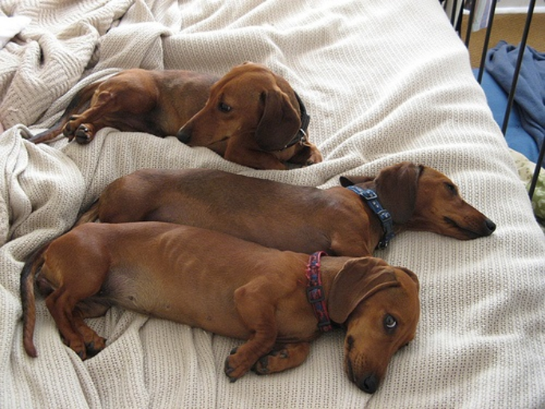

> 图片描述。

**图 3：上下文损失 $\mathcal{L}_{ctx}$ 的影响。** 我们展示了使用 V-JEPA 2 学习的特征图表示，以及使用 V-JEPA 2 加上我们的 $\mathcal{L}_{ctx}$ 损失训练的模型所学习的特征图表示的 PCA（主成分分析）可视化结果。虽然 V-JEPA 的特征仅显示出零散的局部空间结构，但使用 $\mathcal{L}_{ctx}$ 显式监督未掩码区域，会使得特征图呈现出连贯的空间结构。相似的语义部分（例如，狗的头部、汽车的轮子）被映射到相同的 PCA 成分上。

V-JEPA 2 的特征图可视化结果如图 [1](#S0.F1) 和图 [3](#S2.F3) 所示。我们观察到特征图存在噪声，并且仅显示出零散的局部空间结构。此外，如表 [2.3](#S2.SS3.SSS0.Px3) 所报告，当使用简单的线性探测协议时，V-JEPA 2 特征在密集预测任务上表现有限，例如语义分割（在 ADE20K 数据集上为 22.2 mIoU）或深度估计（在 NYUv2 数据集上为 0.682 RMSE）。总体而言，这些结果支持了以下结论： **从 V-JEPA 2 的表征中不易提取出关于视觉场景的局部信息** 。

我们假设特征图中局部结构的缺失是由于对未掩码的 **图像块（patches）** ，即 **上下文图像块（context patches）** ，缺乏自监督所致。预测器 $P_{\phi}(\cdot)$ 的输入是由 $E_{\theta}(x)$ 计算出的上下文 **词元（tokens）** 与一组指定待预测掩码位置的掩码词元 $\Delta_{y}$ 的拼接。预测器为每个输入（即，同时为上下文词元和掩码词元）输出一个词元。然而，如公式 [1](#S2.E1) 所示，来自 V-JEPA 2（Assran 等人，2025）的原始损失仅应用于掩码词元。因此，模型没有动机在上下文词元中编码局部信息，反而可以将这部分计算资源用于聚合全局信息以最小化 $\mathcal{L_{\text{prediction}}}$，这与 **寄存器词元（register tokens）** （Darcet 等人，2023）的做法类似。

##### 上下文自监督（Context Self-Supervision）。

为了验证这一假设，我们提出对掩码图像块和上下文图像块都进行自监督，并引入一个 **上下文损失（context loss）** $\mathcal{L}_{\text{ctx}}$，它是应用于上下文词元上的 $\mathcal{L}_{\text{predict}}$ 的加权版本：

$$
\mathcal{L_{\text{context}}}=\frac{1}{|C|}\sum_{i\in C}\lambda_{i}\|P_{\phi}(E_{\theta}(x),\Delta_{y})_{i}-\mathrm{sg}(E_{\overline{\theta}}(y)_{i})\|_{1},(2)
$$

其中 $C$ 是索引化上下文词元的集合，$\lambda_{i}$ 是一个特定于图像块的加权参数，将在下一节描述。模型被训练以最小化 $\mathcal{L}_{\text{predict}}+\mathcal{L}_{\text{ctx}}$。图 [3](#S2.F3) 显示，添加 $\mathcal{L}_{\text{ctx}}$ 对学习到的特征图有显著影响。在上下文损失的作用下，局部结构现在清晰地出现在特征图中，并且相似的语义部分（例如，狗的头部、汽车的轮子）被映射到相同的 PCA 成分上。此外，添加 $\mathcal{L}_{\text{ctx}}$ 显著提升了密集预测任务的性能，在 ADE20K 数据集上达到了 $33.9$ mIoU（从 $22.2$ 提升），在 NYUv2 数据集上达到了 $0.473$ RMSE（从 $0.682$ 下降）。因此，这些结果验证了： **通过显式监督上下文词元，模型能够学习到编码了连贯局部结构的特征** 。

<a id="section-2-3"></a>

### 2.3 V-JEPA 2.1: Improving Dense Video SSL Features（V-JEPA 2.1：改进密集视频自监督学习特征）

基于先前的观察，我们提出了 **V-JEPA 2.1** （Video Joint-Embedding Predictive Architecture 2.1），这是一种用于学习表征的自监督训练方案，该方案将高质量的密集局部特征与全局语义理解相结合。
我们的关键算法创新是：（1） **密集预测损失（Dense Prediction loss）** ，该损失对掩码（masked）和未掩码（unmasked）的词元（tokens）均施加自监督（第 [2.3.1](#S2.SS3.SSS1) 节）；（2）通过 **多级预测器（multi-level predictor）** 对编码器中间层进行 **深度自监督（Deep Self-Supervision）** （第 [2.3.2](#S2.SS3.SSS2) 节）。
此外，我们还探索了：（3）一个 **多模态分词器（Multi-Modal Tokenizer）** ，为图像和视频提供模态特定的 **图像块嵌入（patch embeddings）** （第 [2.3.4](#S2.SS3.SSS4) 节）；（4）通过更多样化和平衡的图像-视频训练分布进行 **数据扩展（Data Scaling）** （第 [2.3.3](#S2.SS3.SSS3) 节）；以及将模型扩展到 **ViT-G** （Vision Transformer Giant）（第 [2.3.5](#S2.SS3.SSS5) 节），从而实现最先进的下游性能，并能有效地将知识蒸馏（distillation）到更小的模型（ViT-L, ViT-B，第 [3.10](#S3.SS10) 节）。

<a id="figure-4"></a>


> 图 4：V-JEPA 2.1 详细架构。图像和视频分别通过 2D 或 3D 卷积图像块嵌入进行处理。然后，添加 3D 旋转位置编码（3D Rotational Positional Encoding, RoPE）和可学习的模态嵌入（modality embedding）。$x-$编码器处理可见词元，并输出通过拼接（concatenating）中间编码器块的归一化输出形成的多级嵌入。然后，一个多层感知机（MLP）融合这个多级表征并降低其维度。这些上下文词元（context tokens）与携带了掩码图像块时空位置信息的可学习掩码词元（learnable mask tokens）拼接在一起。预测器处理组合后的序列，并为掩码词元生成多级预测。训练使用两种不同的损失：（i）对掩码词元预测的 L1 损失（原始的 V-JEPA 目标），以及（ii）对附近上下文词元的距离加权 L1 损失，两者均使用 $y$-编码器的多级输出作为监督信号。

##### VJEPA 2.1 架构（VJEPA 2.1 Architecture）。

我们在图 [4](#S2.F4) 中展示了 V-JEPA 2.1 的架构。
输入（无论是图像还是视频）通过一个模态特定的图像块嵌入，被投影成一个嵌入向量（或词元）序列。然后，通过随机丢弃图像块词元对序列应用掩码破坏（mask corruption）。
$x$-编码器处理剩余的可见上下文词元，并输出来自多个编码器层级（除了最终输出）的表征。这些多级表征随后沿通道轴（channel axis）拼接，并馈送到一个 MLP 中以降低其维度。上下文词元沿序列轴（sequence axis）与携带了被掩码图像块时空位置信息的可学习掩码词元拼接。预测器处理组合后的序列，并为每个词元生成多级预测。
训练使用两种不同的损失：（i）对掩码词元预测的 L1 损失（原始的 V-JEPA 目标），以及（ii）对上下文词元的距离加权 L1 损失。两者都使用 $y$-编码器的输出作为目标，该编码器处理来自输入图像或视频的未掩码图像块序列。损失被应用于编码器输出之外的几个中间表征层级。

##### 实现细节（Implementation Details）。

我们遵循 V-JEPA 2 的预热-恒定学习率调度策略，并将模型训练 135,000 次迭代。我们保持教师指数移动平均（Teacher Exponential Moving Average, EMA）系数和权重衰减为固定值。每个视频样本是一个 16 帧的片段，分辨率为 $256\times 256$，每个图像样本的分辨率为 $256\times 256$。
此外，在第二阶段，我们探索了应用冷却阶段的效果，即降低学习率并提高输入图像和视频的分辨率。在此冷却阶段，我们进一步训练模型 12,000 次迭代，同时提高输入分辨率：视频片段现在为 64 帧，分辨率为 $384\times 384$，图像的分辨率为 $512\times 512$。
消融实验的结果在第一个训练阶段后报告，而最终的下游任务结果则使用完整的预热-恒定-冷却调度策略。
更多细节和所有超参数见附录 [6](#S6)。

##### 实证评估（Empirical Evaluation）

为了评估我们的设计选择，我们依据一组密集视觉任务（ADE20K 和 NYUv2）和全局识别任务（用于动作识别的 Something-Somethingv2 和用于物体识别的 ImageNet）进行评估。密集视觉任务采用 Siméoni 等人 (2025) 的线性探测评估协议，全局识别任务采用 Assran 等人 (2025) 的注意力探测评估协议。
我们在图 [5](#S2.F5) 和表 [2.3](#S2.SS3.SSS0.Px3) 中对每个架构组件的影响进行了消融研究。
下文我们将更详细地描述每个组件及其对下游性能的影响。

<a id="figure-5"></a>

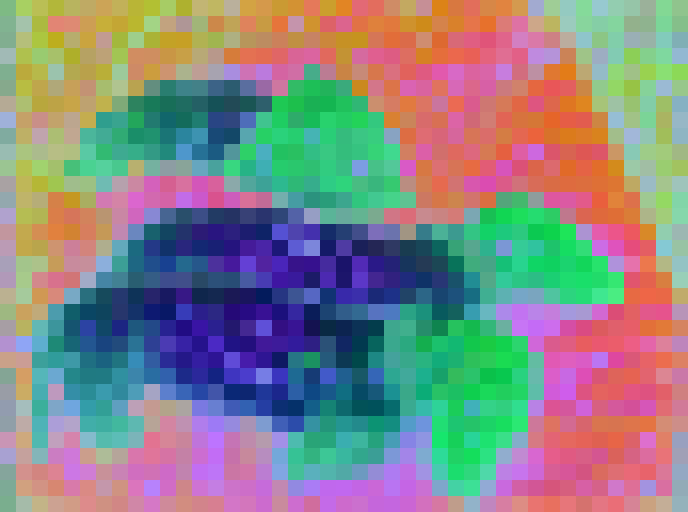

> 图 5：我们新颖的 V-JEPA 2.1 训练方案中各个组件的影响。消融实验基于 ViT-L 架构，在 ADE20k 的单图像语义分割和 SSv2 的动作分类上进行。引入带有上下文损失（Context Loss）的加权上下文自监督（Weighted-Context Self-Supervision）显著改善了分割性能，但以分类性能为代价。深度自监督（Deep Self-Supervision）能够恢复分类性能，并进一步改善分割。使用 VisionMix 163M 数据集扩展图像数据，结合多模态分词器（Multi-Modal Tokenizer）进一步改善了结果。最后，该方案随模型大小和高分辨率冷却阶段而扩展。

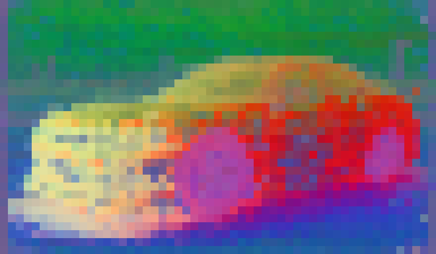

> 表 1：我们新颖的 V-JEPA 2.1 训练方案中各个组件的影响。结果涉及图像分类（IN1K）、视频分类（SSv2）、深度估计（NYU）和语义分割（ADE20K）。引入上下文损失（Context Loss）改善了密集任务，但降低了在 SSv2 上的分类性能。结合我们的深度自监督（Deep Self-Supervision）恢复了分类性能。VisionMix 163M 数据集、多模态分词器（Multi-Modal Tokenizer）以及扩展模型规模进一步改善了结果。

#### 2.3.1 密集预测损失（Dense Prediction Loss）

我们提出通过最小化 $\mathcal{L_{\text{dense}}}=\mathcal{L}_{\text{predict}}+\mathcal{L}_{\text{ctx}}$，将我们的自监督损失应用于被遮蔽（masked）和可见（visible）的图像块（patches），其中 $\mathcal{L}_{\text{predict}}$ 在公式 [1] 中定义，$\mathcal{L}_{\text{ctx}}$ 在公式 [2] 中定义。简单地应用 $\mathcal{L}_{\text{ctx}}$ 损失会导致在全局语义任务上性能不佳，因为系统可能会找到平凡的解决方案，例如复制上下文特征。

因此，我们探索了公式 [2] 中的各种加权系数 $\lambda_{i}$。表 [2.3] 展示了不同加权方案的消融研究。首先，我们尝试固定值，将所有 $\lambda_{i}$ 设置为一个常数 $\lambda$，并尝试 $\lambda=[0.0,0.05,0.2,0.5,1.0]$ 范围内的值。我们观察到，随着 $\lambda$ 的增加，在 ADE20k 数据集上的语义分割性能在达到某一点之前显著提升，但代价是 SSv2 数据集上的动作识别性能下降。

随后，我们引入了 $\lambda$ 的渐进式预热（progressive warm-up）以恢复动作识别性能，预热计划从第 50 个训练周期（epoch）持续到第 100 个周期。我们根据经验发现，这极大地稳定了训练。

接着，我们引入了一种动态加权方案，其中对于给定图像块 $i$ 的 $\mathcal{L}_{\text{ctx}}$ 损失，由其到视频序列中任何被遮蔽标记（masked token）的最小时空距离的平方根的倒数进行加权：即在公式 [2] 的 $\mathcal{L}_{\text{ctx}}$ 中设置

$$
\lambda_{i}=\frac{\lambda}{\sqrt{\text{d}_{\text{min}}(i,M)}}(3)
$$

其中 $\text{d}_{\text{min}}$ 是一个上下文标记（context token）与其最近的遮蔽标记之间以块（blocks）数计的距离。这种加权通过强制被遮蔽区域和上下文区域之间的局部连续性，强调了靠近被遮蔽区域的图像块，从而在分割和动作识别性能之间取得了良好的权衡。

引入我们新颖的上下文损失 $\mathcal{L}_{ctx}$ 及其加权方案，改善了密集视觉任务的性能（在 ADE20k 上，mIoU 从 22.2 提升至 33.9；在 NYUv2 上，RMSE 从 0.682 降至 0.473）。从定性角度看，该损失通过去除噪声伪影（noisy artifacts）平滑了特征图，如图 [3] 所示。
然而，表 [2.3] 显示，在视频理解（在 SSv2 上从 72.8 降至 62.5）和图像分类（在 IN1K 上从 82.2 降至 72.6）方面仍然存在性能下降。

#### 2.3.2 深度自监督（Deep Self-Supervision）

我们不仅在输出层，还在多个中间层对编码器表示进行自监督。我们首先沿通道维度（channel dimension）拼接三个中间 $x$-编码器块（encoder blocks）以及输出层的输出。然后，一个轻量级多层感知机（Multilayer Perceptron, MLP）融合这些多层级表示并在送入预测器（predictor）之前降低其维度。预测器处理融合后的上下文标记和遮蔽标记的多层级序列，并产生对应于四个编码器层的四个输出。随后，预测损失和上下文损失在这四个层级中的每一个上分别应用。

如图 [5] 所示， **深度自监督** 显著提升了全局任务和密集任务的下游性能。
此外，它允许局部信息流向最终层，从而有效地消除了在密集下游任务中对中间层的需求，正如我们在附录 [9.1] 中所展示的那样。
**深度自监督** 使得我们能够恢复 V-JEPA 2 的全局理解能力（在 SSv2 上为 72.0，在 IN1K 上为 80.8），同时通过上下文损失改进了密集任务的性能（在 ADE20K 上 mIoU 为 38.6，在 NYU 上 RMSE 为 0.463）。

#### 2.3.3 图像数据扩展（Scaling Image Data）

DINOv2（Oquab 等人，2023）引入了一种基于聚类的检索策略，从海量原始互联网数据中筛选图像，最终整理出一个包含 1.42 亿张图像的精选数据集，称为 LVD-142M 数据集。
采用类似的方法，V-JEPA 2（Assran 等人，2025）从 YT1B 视频（Zellers 等人，2022）中收集并筛选视频场景，并结合其他公开可用的视频数据集，构建了一个来自互联网的大规模视频样本集合，包含 1900 万个视频样本，对应 $1.6$ 百万小时。这两项工作都证明了数据扩展对 **自监督学习（Self-Supervised Learning, SSL）** 预训练的积极影响。

基于这些见解，我们构建了我们的 VisionMix163M 数据集，整合了来自这两项先前工作的大规模精选数据源。如表 LABEL:tab:\_datasets 所示，我们用 LVD-142M 替换了 VJEPA-2 预训练数据中的 100 万张图像的 ImageNet 子集，从而提供了更广泛、更多样的外观分布。
由于这个庞大的图像集合已经涵盖了许多静态视觉概念，我们将视频采样策略转向更具动态性、运动丰富的内容，将 SSv2 的采样权重从 0.056 提高到 0.170。
我们还发现，将 YT-1B 的贡献从 0.188 增加到 0.720 是有益的，因为它包含了更多异构的视频样本。

我们没有在同一训练批次中混合图像和视频，而是通过为每种模态分配独立的工作节点来利用 **分布式训练（Distributed Training）** 。每次迭代后，来自纯视频节点和纯图像节点的梯度会在更新模型之前进行聚合。
图像/视频的比例通过每种模态的批次大小来控制。
根据经验，我们发现当每个全局批次包含 128 个视频片段（每个片段 16 帧）和 2,304 张图像时，性能达到最优。如表 [2.3](#S2.SS3.SSS0.Px3) 所示，在更多样化和扩展的数据库上进行训练对所有任务都有益（SSv2 上 72.1 $\rightarrow$ 72.6，ImageNet 上 80.8 $\rightarrow$ 81.6，ADE20K 上 38.6 $\rightarrow$ 40.8，NYUv2 上 RMSE 0.463 $\rightarrow$ 0.418）。

<a id="table-3"></a>

> 表 3: VideoMix22M 与 VisionMix163M 的对比。我们通过增加图像数量、用 LVD-142M 替换 ImageNet 以及更新 YT-1B 的采样权重来提升预训练数据集的视觉多样性，从而促进具有更高视觉多样性的数据源。

| 数据源（Source）                      | 样本数（Samples） | 类型（Type）             | 总时长（Total Hours） | V-JEPA2<br>权重（V-JEPA2<br>weights） | V-JEPA2.1<br>权重（V-JEPA2.1<br>weights） |
| :------------------------------------ | :---------------- | :----------------------- | :-------------------- | :------------------------------------ | :---------------------------------------- |
| **SSv2** （Goyal 等人， 2017）        | 168K              | 第一人称视频（EgoVideo） | 168                   | 0.056                                 | 0.170                                     |
| **Kinetics** （Carreira 等人， 2019） | 733K              | 第三人称视频（ExoVideo） | 614                   | 0.188                                 | 0.010                                     |
| **Howto100M** （Miech 等人， 2019）   | 1.1M              | 第三人称视频（ExoVideo） | 134K                  | 0.318                                 | 0.100                                     |
| **ImageNet** （Deng 等人， 2009）     | 1M                | 图像（Images）           | 不适用（n/a）         | 0.250                                 | 0.                                        |

#### 2.3.4 多模态分词器（Multi-Modal Tokenizer）

先前探索图像和视频联合训练的工作，例如 V-JEPA 2，并非最优：它采用单一的 **三维卷积（3D convolution）** 作为 **图像块嵌入层（patch-embedding layer）** 。图像在时间维度上被复制，并被当作一个 16 帧的静态视频处理，这显著增加了其计算成本，并引入了错误的表征偏差（即，图像被解释为静态视频）。
相反，我们引入了一个 **多模态分词器（Multi-modal tokenizer）** ，它应用 $16\times 16\times 2$ 的三维卷积处理视频，并应用 $16\times 16$ 的 **二维卷积（2D convolution）** 处理图像。
我们还在编码器和预测器的输入中添加了一个 **模态可学习词元（modality-learnable token）** ，它明确编码了输入是来自图像路径还是视频路径。这些可学习词元根据输入模态来调节处理过程，帮助模型在图像中分离出更强的静态外观线索，并在视频中分离出时间运动信息。

这种设计允许每种模态以其原生形式进行处理，消除了对图像进行时间复制的需要，并提高了计算效率。此外，我们观察到使用 **多模态分词器（Multi-Modal Tokenizer）** 对密集任务性能有积极影响：它将 ADE20K 上的 **平均交并比（mean Intersection over Union, mIoU）** 从 $40.8$ 提升到 $41.4$，而动作或物体识别的性能保持稳定。

#### 2.3.5 模型规模扩展至 ViT-G (2B) 与高分辨率冷却（High-Resolution Cool-Down）

接下来，我们探讨模型规模扩展和高分辨率冷却的效果。将 V-JEPA 编码器从具有 3 亿参数的 ViT-L 扩展到具有 20 亿参数的 ViT-G，在所有下游任务上都带来了显著改进（SSv2 上 72.6 $\rightarrow$ 76.1，ImageNet 上准确率 81.6 $\rightarrow$ 84.8，ADE20K 上 mIoU 41.4 $\rightarrow$ 47.1，NYUv2 上 **均方根误差（Root Mean Square Error, RMSE）** 0.415 $\rightarrow$ 0.365）。

此外，引入一个学习率的 **冷却阶段（cool-down phase）** ，在此期间我们同时提高图像的空间分辨率（从 $256\times 256$ 到 $512\times 512$）和视频的时空分辨率（从 $256\times 256$ 的 16 帧到 $384\times 384$ 的 64 帧），进一步提升了所有任务的性能。
这实现了在 SSv2 上 $77.7$ 的准确率，ImageNet 上 $85.5$ 的准确率，ADE20K 上 $47.9$ 的 mIoU，以及 NYUv2 上 $0.307$ 的 RMSE，从而得到了我们性能最佳的模型。
冷却训练阶段带来的益处，在深度估计任务中尤为显著（NYUv2 上 RMSE 从 0.365 $\rightarrow$ 0.307）。

#### 2.3.6 模型蒸馏（Model Distillation）

我们扩展模型规模不仅是为了达到顶级性能，也是为了能够通过 **蒸馏（Distillation）** Hinton 等人 (2015) 有效地压缩模型。我们将 ViT-G (2B) 模型蒸馏到更小的变体（ViT-B, 80M；ViT-L, 300M）。蒸馏方案改编自我们的预训练配方，主要区别在于：i) 我们用一个冻结的教师模型替换了目标编码器的 **指数移动平均（Exponential-Moving-Average, EMA）** ；ii) 我们保留了学生编码器的一个 EMA 副本，该副本不用于损失计算，但作为最终模型；iii) 蒸馏损失与我们的预训练损失相同，只是它仅在教师编码器的最后一层计算，并且不使用深度自监督；iv) 我们使用一个仅包含 12 个块且最终线性层与教师嵌入维度匹配的预测器。所有其他超参数——包括掩码比率、冷却计划、学习率和数据增强——均与原始预训练配方保持一致。我们在附录 [7](#S7) 中提供了关于蒸馏方案的更多细节。

<a id="section-3"></a>

## 3 结果（Results）

在本节中，我们评估 V-JEPA 2.1（Video Joint-Embedding Predictive Architecture 2.1）在多种下游任务上的性能。在所有实验中，我们均将 V-JEPA 2.1 用作 **冻结编码器（frozen encoder）** ，以展示其特征的通用性。

我们首先在两个预测任务中展示 V-JEPA 2.1 的预测能力： **短期物体交互预测（short-term object interaction anticipation）** （第 [3.1](#S3.SS1) 节）和 **动作预测（action anticipation）** （第 [3.2](#S3.SS2) 节）。

接着，我们证明可以利用 V-JEPA 2.1 学习一个 **动作条件世界模型（action-condition world model）** ，并在 **零样本（zero-shot）** 设置下执行机器人操作（第 [3.3](#S3.SS3) 节）和导航任务（第 [3.4](#S3.SS4) 节）。

然后，我们通过评估 V-JEPA 2.1 在单图像深度估计和语义分割任务上的性能（第 [3.5](#S3.SS5) 节），来评估所学 **密集特征（dense features）** 的质量。

随后，我们通过视频物体分割任务（第 [3.5](#S3.SS5) 节）分析 V-JEPA 2.1 表征的 **时间一致性（temporal consistency）** 。

我们还分析了 V-JEPA 2.1 在两个高级理解任务上的 **全局理解（global understanding）** 能力：基于探针的视频分类和图像分类（第 [3.7](#S3.SS7) 节）。

最后，我们展示了我们较小的 **蒸馏模型（distilled models）** 的结果（第 [3.10](#S3.SS10) 节）。

关于实验设置和所有预训练超参数的更多细节，请参见附录 [6](#S6) 和 [8](#S8)。

<a id="section-3-1"></a>

### 3.1 短期物体交互预测（Short-Term Object Interaction Anticipation）

<a id="figure-6"></a>

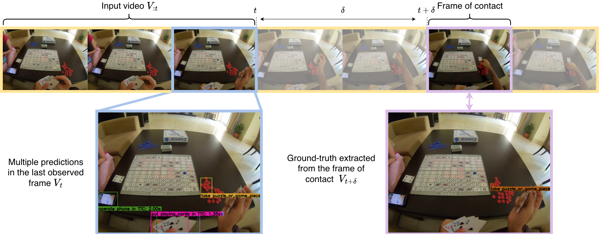

> 图 6：短期预测任务。给定观察到时间 $t$ 为止的视频（记为 $V_{:t}$），模型预测一组未来的物体-交互事件。每个预测包括：(i) 定位将被交互物体的 **边界框（bounding box）** ，(ii) 该物体的 **名词类别（noun class）** ，(iii) 描述即将发生的交互的 **动词类别（verb class）** ，以及 (iv) **预测时间 $\delta$（anticipation time $\delta$）** ，即当前帧与交互开始之间的秒数。 **真实标签（ground-truth labels）** 来源于 **接触帧（contact frame）** $V_{t+\delta}$，但表示在最后观察到的帧 $V_{t}$ 的坐标系中。

<a id="table-4"></a>

**表 4：Ego4D 上的短期物体交互预测（Short-Term Object Interaction Anticipation on Ego4D）** 。遵循 Grauman 等人（2022）的方法，我们报告了不同的 Top-5 平均精度（Average Precision, AP）和平均精度均值（mean Average Precision, mAP）指标，其中获胜分数为 mAP All。我们比较了文献中报道的使用不同冻结 **自监督学习（Self-Supervised Learning, SSL）** 编码器（DINOv2、DINOv2、V-JEPA 2 以及我们的 V-JEPA 2.1）并扩展了基于注意力的预测头（attentive-based predicted head）所得到的结果。得益于其高质量的密集特征和预测能力，V-JEPA 2.1 取得了 **最先进的（state-of-the-art）** 性能。

| 模型（Model）                                              | AP<br>b | AP<br>b+N | AP<br>b+V | AP<br>b+$\delta$ | AP<br>b+N+V | AP<br>b+$\delta$+N | AP<br>b+$\delta$+V | AP<br>All | mAP<br>N | mAP<br>N+V | mAP<br>N+$\delta$ | mAP<br>All |
| :--------------------------------------------------------- | :-----: | :-------: | :-------: | :--------------: | :---------: | :----------------: | :----------------: | :-------: | :------: | :--------: | :---------------: | :--------: |
| 模型（Model）                                              | AP<br>b | AP<br>b+N | AP<br>b+V | AP<br>b+$\delta$ | AP<br>b+N+V | AP<br>b+$\delta$+N | AP<br>b+$\delta$+V | AP<br>All | mAP<br>N | mAP<br>N+V | mAP<br>N+$\delta$ | mAP<br>All |
| 模型（Model）                                              | AP<br>b | AP<br>b+N | AP<br>b+V | AP<br>b+$\delta$ | AP<br>b+N+V | AP<br>b+$\delta$+N | AP<br>b+$\delta$+V | AP<br>All | mAP<br>N | mAP<br>N+V | mAP<br>N+$\delta$ | mAP<br>All |
| 模型（Model）                                              | AP<br>b | AP<br>b+N | AP<br>b+V | AP<br>b+$\delta$ | AP<br>b+N+V | AP<br>b+$\delta$+N | AP<br>b+$\delta$+V | AP<br>All | mAP<br>N | mAP<br>N+V | mAP<br>N+$\delta$ | mAP<br>All |
| 模型（Model）                                              | AP<br>b | AP<br>b+N | AP<br>b+V | AP<br>b+$\delta$ | AP<br>b+N+V | AP<br>b+$\delta$+N | AP<br>b+$\delta$+V | AP<br>All | mAP<br>N | mAP<br>N+V | mAP<br>N+$\delta$ | mAP<br>All |
| 模型（Model）                                              | AP<br>b | AP<br>b+N | AP<br>b+V | AP<br>b+$\delta$ | AP<br>b+N+V | AP<br>b+$\delta$+N | AP<br>b+$\delta$+V | AP<br>All | mAP<br>N | mAP<br>N+V | mAP<br>N+$\delta$ | mAP<br>All |
| 模型（Model）                                              | AP<br>b | AP<br>b+N | AP<br>b+V | AP<br>b+$\delta$ | AP<br>b+N+V | AP<br>b+$\delta$+N | AP<br>b+$\delta$+V | AP<br>All | mAP<br>N | mAP<br>N+V | mAP<br>N+$\delta$ | mAP<br>All |
| 模型（Model）                                              | AP<br>b | AP<br>b+N | AP<br>b+V | AP<br>b+$\delta$ | AP<br>b+N+V | AP<br>b+$\delta$+N | AP<br>b+$\delta$+V | AP<br>All | mAP<br>N | mAP<br>N+V | mAP<br>N+$\delta$ | mAP<br>All |
| 模型（Model）                                              | AP<br>b | AP<br>b+N | AP<br>b+V | AP<br>b+$\delta$ | AP<br>b+N+V | AP<br>b+$\delta$+N | AP<br>b+$\delta$+V | AP<br>All | mAP<br>N | mAP<br>N+V | mAP<br>N+$\delta$ | mAP<br>All |
| 模型（Model）                                              | AP<br>b | AP<br>b+N | AP<br>b+V | AP<br>b+$\delta$ | AP<br>b+N+V | AP<br>b+$\delta$+N | AP<br>b+$\delta$+V | AP<br>All | mAP<br>N | mAP<br>N+V | mAP<br>N+$\delta$ | mAP<br>All |
| 模型（Model）                                              | AP<br>b | AP<br>b+N | AP<br>b+V | AP<br>b+$\delta$ | AP<br>b+N+V | AP<br>b+$\delta$+N | AP<br>b+$\delta$+V | AP<br>All | mAP<br>N | mAP<br>N+V | mAP<br>N+$\delta$ | mAP<br>All |
| 模型（Model）                                              | AP<br>b | AP<br>b+N | AP<br>b+V | AP<br>b+$\delta$ | AP<br>b+N+V | AP<br>b+$\delta$+N | AP<br>b+$\delta$+V | AP<br>All | mAP<br>N | mAP<br>N+V | mAP<br>N+$\delta$ | mAP<br>All |
| 模型（Model）                                              | AP<br>b | AP<br>b+N | AP<br>b+V | AP<br>b+$\delta$ | AP<br>b+N+V | AP<br>b+$\delta$+N | AP<br>b+$\delta$+V | AP<br>All | mAP<br>N | mAP<br>N+V | mAP<br>N+$\delta$ | mAP<br>All |
| **文献中报告的结果（Results Reported in the Literature）** |         |           |           |                  |             |                    |                    |           |          |            |                   |            |
| StillFast (Ragusa 等人, 2023)                              |    -    |     -     |     -     |        -         |      -      |         -          |         -          |     -     |   20.2   |    10.3    |       7.17        |    3.96    |
| StillFast (Ragusa 等人, 2023)                              |    -    |     -     |     -     |        -         |      -      |         -          |         -          |     -     |   20.2   |    10.3    |       7.17        |    3.96    |
| StillFast (Ragusa 等人, 2023)                              |    -    |     -     |     -     |        -         |      -      |         -          |         -          |     -     |   20.2   |    10.3    |       7.17        |    3.96    |
| StillFast (Ragusa 等人, 2023)                              |    -    |     -     |

| -                                    | -    | -    | -    | -     | -    | 20.2 | 10.3 | 7.17 | 3.96 |
| :----------------------------------- | :--- | :--- | :--- | :---- | :--- | :--- | :--- | :--- | :--- | :--- |
| StillFast (Ragusa et al., 2023)      | -    | -    | -    | -     | -    | -    | 20.2 | 10.3 | 7.17 | 3.96 |
| StillFast (Ragusa et al., 2023)      | -    | -    | -    | -     | -    | -    | 20.2 | 10.3 | 7.17 | 3.96 |
| StillFast (Ragusa et al., 2023)      | -    | -    | -    | -     | -    | -    | 20.2 | 10.3 | 7.17 | 3.96 |
| StillFast (Ragusa et al., 2023)      | -    | -    | -    | -     | -    | -    | 20.2 | 10.3 | 7.17 | 3.96 |
| StillFast (Ragusa et al., 2023)      | -    | -    | -    | -     | -    | -    | 20.2 | 10.3 | 7.17 | 3.96 |
| StillFast (Ragusa et al., 2023)      | -    | -    | -    | -     | -    | -    | 20.2 | 10.3 | 7.17 | 3.96 |
| StillFast (Ragusa et al., 2023)      | -    | -    | -    | -     | -    | -    | 20.2 | 10.3 | 7.17 | 3.96 |
| StillFast (Ragusa et al., 2023)      | -    | -    | -    | -     | -    | -    | 20.2 | 10.3 | 7.17 | 3.96 |
| StillFast (Ragusa et al., 2023)      | -    | -    | -    | -     | -    | -    | 20.2 | 10.3 | 7.17 | 3.96 |
| STAformer (Mur-Labadia et al., 2024) | 38.3 | 28.3 | 16.6 | 12.27 | 12.8 | 8.89 | 5.47 | 4.06 | 29.4 | 15.3 |
| STAformer (Mur-Labadia et al., 2024) | 38.3 | 28.3 | 16.6 | 12.27 | 12.8 | 8.89 | 5.47 | 4.06 | 29.4 | 15.3 |
| STAformer (Mur-Labadia et al., 2024) | 38.3 | 28.3 | 16.6 | 12.27 | 12.8 | 8.89 | 5.47 | 4.06 | 29.4 | 15.3 |
| STAformer (Mur-Labadia et al., 2024) | 38.3 | 28.3 | 16.6 | 12.27 | 12.8 | 8.89 | 5.47 | 4.06 | 29.4 | 15.3 |
| STAformer (Mur-Labadia et al., 2024) | 38.3 | 28.3 | 16.6 | 12.27 | 12.8 | 8.89 | 5.47 | 4.06 | 29.4 | 15.3 |
| STAformer (Mur-Labadia et al., 2024) | 38.3 | 28.3 | 16.6 | 12.27 | 12.8 | 8.89 | 5.47 | 4.06 | 29.4 | 15.3 |
| STAformer (Mur-Labadia et al., 2024) | 38.3 | 28.3 | 16.6 | 12.27 | 12.8 | 8.89 | 5.47 | 4.06 | 29.4 | 15.3 |
| STAformer (Mur-Labadia et al., 2024) | 38.3 | 28.3 | 16.6 | 12.27 | 12.8 | 8.89 | 5.47 | 4.06 | 29.4 | 15.3 |
| STAformer (Mur-Labadia et al., 2024) | 38.3 | 28.3 | 16.6 | 12.27 | 12.8 | 8.89 | 5.47 | 4.06 | 29.4 | 15.3 |

| 模型（Model）                                                | 列 1 | 列 2 | 列 3 | 列 4  | 列 5 | 列 6 | 列 7 | 列 8 | 列 9 | 列 10 | 列 11 | 列 12 |
| :----------------------------------------------------------- | :--: | :--: | :--: | :---: | :--: | :--: | :--: | :--: | :--: | :---: | :---: | :---: |
| STAformer (Mur-Labadia et al., 2024)                         | 38.3 | 28.3 | 16.6 | 12.27 | 12.8 | 8.89 | 5.47 | 4.06 | 29.4 | 15.3  | 9.94  | 5.67  |
| GANO (Thakur et al., 2023)                                   | 45.3 | 27.0 | 12.2 | 16.6  | 6.54 | 9.0  | 4.18 | 2.47 |  -   |   -   |   -   |   -   |
| 使用我们相同协议的编码器（Encoders using our same protocol） |      |      |      |       |      |      |      |      |      |       |       |       |

| DINOv2 ViT-L (Oquab et al., 2023) | 45.1 | 37.8 | 21.9 | 14.4 | 17.6 | 10.6 | 7.27 | 5.25 | 28.3 | 15.2 | 9.22 | 5.25 |
| DINOv2 ViT-L (Oquab et al., 2023) | 45.1 | 37.8 | 21.9 | 14.4 | 17.6 | 10.6 | 7.27 | 5.25 | 28.3 | 15.2 | 9.22 | 5.25 |
| DINOv2 ViT-L (Oquab et al., 2023) | 45.1 | 37.8 | 21.9 | 14.4 | 17.6 | 10.6 | 7.27 | 5.25 | 28.3 | 15.2 | 9.22 | 5.25 |
| DINOv2 ViT-L (Oquab et al., 2023) | 45.1 | 37.8 | 21.9 | 14.4 | 17.6 | 10.6 | 7.27 | 5.25 | 28.3 | 15.2 | 9.22 | 5.25 |
| DINOv2 ViT-L (Oquab et al., 2023) | 45.1 | 37.8 | 21.9 | 14.4 | 17.6 | 10.6 | 7.27 | 5.25 | 28.3 | 15.2 | 9.22 | 5.25 |
| DINOv2 ViT-L (Oquab et al., 2023) | 45.1 | 37.8 | 21.9 | 14.4 | 17.6 | 10.6 | 7.27 | 5.25 | 28.3 | 15.2 | 9.22 | 5.25 |
| DINOv2 ViT-L (Oquab et al., 2023) | 45.1 | 37.8 | 21.9 | 14.4 | 17.6 | 10.6 | 7.27 | 5.25 | 28.3 | 15.2 | 9.22 | 5.25 |
| DINOv2 ViT-L (Oquab et al., 2023) | 45.1 | 37.8 | 21.9 | 14.4 | 17.6 | 10.6 | 7.27 | 5.25 | 28.3 | 15.2 | 9.22 | 5.25 |
| DINOv2 ViT-L (Oquab et al., 2023) | 45.1 | 37.8 | 21.9 | 14.4 | 17.6 | 10.6 | 7.27 | 5.25 | 28.3 | 15.2 | 9.22 | 5.25 |
| DINOv2 ViT-L (Oquab et al., 2023) | 45.1 | 37.8 | 21.9 | 14.4 | 17.6 | 10.6 | 7.27 | 5.25 | 28.3 | 15.2 | 9.22 | 5.25 |
| DINOv2 ViT-L (Oquab et al., 2023) | 45.1 | 37.8 | 21.9 | 14.4 | 17.6 | 10.6 | 7.27 | 5.25 | 28.3 | 15.2 | 9.22 | 5.25 |
| DINOv2 ViT-L (Oquab et al., 2023) | 45.1 | 37.8 | 21.9 | 14.4 | 17.6 | 10.6 | 7.27 | 5.25 | 28.3 | 15.2 | 9.22 | 5.25 |
| DINOv2 ViT-L (Oquab et al., 2023) | 45.1 | 37.8 | 21.9 | 14.4 | 17.6 | 10.6 | 7.27 | 5.25 | 28.3 | 15.2 | 9.22 | 5.25 |
| DINOv2 ViT-g (Oquab et al., 2023) | 47.8 | 38.1 | 23.6 | 14.1 | 19.1 | 10.9 | 7.29 | 5.73 | 30.6 | 16.8 | 9.37 | 5.44 |
| DINOv2 ViT-g (Oquab et al., 2023) | 47.8 | 38.1 | 23.6 | 14.1 | 19.1 | 10.9 | 7.29 | 5.73 | 30.6 | 16.8 | 9.37 | 5.44 |
| DINOv2 ViT-g (Oquab et al., 2023) | 47.8 | 38.1 | 23.6 | 14.1 | 19.1 | 10.9 | 7.29 | 5.73 | 30.6 | 16.8 | 9.37 | 5.44 |
| DINOv2 ViT-g (Oquab et al., 2023) | 47.8 | 38.1 | 23.6 | 14.1 | 19.1 | 10.9 | 7.29 | 5.73 | 30.6 | 16.8 | 9.37 | 5.44 |
| DINOv2 ViT-g (Oquab et al., 2023) | 47.8 | 38.1 | 23.6 | 14.1 | 19.1 | 10.9 | 7.29 | 5.73 | 30.6 | 16.8 | 9.37 | 5.44 |
| DINOv2 ViT-

| DINOv2 ViT-g（Oquab 等人，2023） | 47.8 | 38.1 | 23.6 | 14.1 | 19.1 | 10.9 | 7.29 | 5.73 | 30.6 | 16.8 | 9.37 | 5.44 |
| DINOv2 ViT-g（Oquab 等人，2023） | 47.8 | 38.1 | 23.6 | 14.1 | 19.1 | 10.9 | 7.29 | 5.73 | 30.6 | 16.8 | 9.37 | 5.44 |
| DINOv2 ViT-g（Oquab 等人，2023） | 47.8 | 38.1 | 23.6 | 14.1 | 19.1 | 10.9 | 7.29 | 5.73 | 30.6 | 16.8 | 9.37 | 5.44 |
| DINOv2 ViT-g（Oquab 等人，2023） | 47.8 | 38.1 | 23.6 | 14.1 | 19.1 | 10.9 | 7.29 | 5.73 | 30.6 | 16.8 | 9.37 | 5.44 |
| DINOv2 ViT-g（Oquab 等人，2023） | 47.8 | 38.1 | 23.6 | 14.1 | 19.1 | 10.9 | 7.29 | 5.73 | 30.6 | 16.8 | 9.37 | 5.44 |
| DINOv2 ViT-g（Oquab 等人，2023） | 47.8 | 38.1 | 23.6 | 14.1 | 19.1 | 10.9 | 7.29 | 5.73 | 30.6 | 16.8 | 9.37 | 5.44 |
| DINOv2 ViT-g（Oquab 等人，2023） | 47.8 | 38.1 | 23.6 | 14.1 | 19.1 | 10.9 | 7.29 | 5.73 | 30.6 | 16.8 | 9.37 | 5.44 |
| DINOv2 ViT-g（Oquab 等人，2023） | 47.8 | 38.1 | 23.6 | 14.1 | 19.1 | 10.9 | 7.29 | 5.73 | 30.6 | 16.8 | 9.37 | 5.44 |
| DINOv3 ViT-H+（Siméoni 等人，2025） | 48.9 | 40.2 | 23.4 | 13.6 | 19.4 | 10.8 | 6.71 | 5.45 | 32.4 | 17.2 | 9.53 | 5.20 |
| DINOv3 ViT-H+（Siméoni 等人，2025） | 48.9 | 40.2 | 23.4 | 13.6 | 19.4 | 10.8 | 6.71 | 5.45 | 32.4 | 17.2 | 9.53 | 5.20 |
| DINOv3 ViT-H+（Siméoni 等人，2025） | 48.9 | 40.2 | 23.4 | 13.6 | 19.4 | 10.8 | 6.71 | 5.45 | 32.4 | 17.2 | 9.53 | 5.20 |
| DINOv3 ViT-H+（Siméoni 等人，2025） | 48.9 | 40.2 | 23.4 | 13.6 | 19.4 | 10.8 | 6.71 | 5.45 | 32.4 | 17.2 | 9.53 | 5.20 |
| DINOv3 ViT-H+（Siméoni 等人，2025） | 48.9 | 40.2 | 23.4 | 13.6 | 19.4 | 10.8 | 6.71 | 5.45 | 32.4 | 17.2 | 9.53 | 5.20 |
| DINOv3 ViT-H+（Siméoni 等人，2025） | 48.9 | 40.2 | 23.4 | 13.6 | 19.4 | 10.8 | 6.71 | 5.45 | 32.4 | 17.2 | 9.53 | 5.20 |
| DINOv3 ViT-H+（Siméoni 等人，2025） | 48.9 | 40.2 | 23.4 | 13.6 | 19.4 | 10.8 | 6.71 | 5.45 | 32.4 | 17.2 | 9.53 | 5.20 |
| DINOv3 ViT-H+（Siméoni 等人，2025） | 48.9 | 40.2 | 23.4 | 13.6 | 19.4 | 10.8 | 6.71 | 5.45 | 32.4 | 17.2 | 9.53 | 5.20 |
| DINOv3 ViT-H+（Siméoni 等人，2025） | 48.9 | 40.2 | 23.4 | 13.6 | 19.4 | 10.8 | 6.71 | 5.45 | 32.4 | 17.2 | 9.53 | 5.20 |
| DINOv3 ViT-H+（Siméoni 等人，2025） | 48.9 | 40.2 | 23.4 | 13.6 | 19.4 | 10.8 | 6.71 | 5.45 | 32.4 | 17.2 | 9.53 | 5.20 |
| DINOv3 ViT-H+（Siméoni 等人，2025） | 48.9 | 40.2 | 23.4 | 13.6 | 19.4 | 10.8 | 6.71 | 5.45 | 32.4 | 17.2 | 9.53 | 5.20 |
| DINOv3 ViT-H+（Siméoni 等人，2025） | 48.9 | 40.2 | 23.4 |

| 模型（Model）                        | 指标1 | 指标2 | 指标3 | 指标4 | 指标5 | 指标6 | 指标7 | 指标8 | 指标9 | 指标10 | 指标11 | 指标12 |
| :----------------------------------- | :---: | :---: | :---: | :---: | :---: | :---: | :---: | :---: | :---: | :----: | :----: | :----: |
| DINOv3 ViT-H+ (Siméoni et al., 2025) | 48.9  | 40.2  | 23.4  | 13.6  | 19.4  | 10.8  | 6.71  | 5.45  | 32.4  |  17.2  |  9.53  |  5.20  |
| DINOv3 ViT-H+ (Siméoni et al., 2025) | 48.9  | 40.2  | 23.4  | 13.6  | 19.4  | 10.8  | 6.71  | 5.45  | 32.4  |  17.2  |  9.53  |  5.20  |
| DINOv3 ViT-7B (Siméoni et al., 2025) | 50.2  | 40.9  | 23.8  | 14.2  | 19.8  | 11.5  | 7.33  | 5.82  | 33.8  |  17.4  |  10.3  |  5.68  |
| DINOv3 ViT-7B (Siméoni et al., 2025) | 50.2  | 40.9  | 23.8  | 14.2  | 19.8  | 11.5  | 7.33  | 5.82  | 33.8  |  17.4  |  10.3  |  5.68  |
| DINOv3 ViT-7B (Siméoni et al., 2025) | 50.2  | 40.9  | 23.8  | 14.2  | 19.8  | 11.5  | 7.33  | 5.82  | 33.8  |  17.4  |  10.3  |  5.68  |
| DINOv3 ViT-7B (Siméoni et al., 2025) | 50.2  | 40.9  | 23.8  | 14.2  | 19.8  | 11.5  | 7.33  | 5.82  | 33.8  |  17.4  |  10.3  |  5.68  |
| DINOv3 ViT-7B (Siméoni et al., 2025) | 50.2  | 40.9  | 23.8  | 14.2  | 19.8  | 11.5  | 7.33  | 5.82  | 33.8  |  17.4  |  10.3  |  5.68  |
| DINOv3 ViT-7B (Siméoni et al., 2025) | 50.2  | 40.9  | 23.8  | 14.2  | 19.8  | 11.5  | 7.33  | 5.82  | 33.8  |  17.4  |  10.3  |  5.68  |
| DINOv3 ViT-7B (Siméoni et al., 2025) | 50.2  | 40.9  | 23.8  | 14.2  | 19.8  | 11.5  | 7.33  | 5.82  | 33.8  |  17.4  |  10.3  |  5.68  |
| DINOv3 ViT-7B (Siméoni et al., 2025) | 50.2  | 40.9  | 23.8  | 14.2  | 19.8  | 11.5  | 7.33  | 5.82  | 33.8  |  17.4  |  10.3  |  5.68  |
| DINOv3 ViT-7B (Siméoni et al., 2025) | 50.2  | 40.9  | 23.8  | 14.2  | 19.8  | 11.5  | 7.33  | 5.82  | 33.8  |  17.4  |  10.3  |  5.68  |
| DINOv3 ViT-7B (Siméoni et al., 2025) | 50.2  | 40.9  | 23.8  | 14.2  | 19.8  | 11.5  | 7.33  | 5.82  | 33.8  |  17.4  |  10.3  |  5.68  |
| DINOv3 ViT-7B (Siméoni et al., 2025) | 50.2  | 40.9  | 23.8  | 14.2  | 19.8  | 11.5  | 7.33  | 5.82  | 33.8  |  17.4  |  10.3  |  5.68  |
| DINOv3 ViT-7B (Siméoni et al., 2025) | 50.2  | 40.9  | 23.8  | 14.2  | 19.8  | 11.5  | 7.33  | 5.82  | 33.8  |  17.4  |  10.3  |  5.68  |
| DINOv3 ViT-7B (Siméoni et al., 2025) | 50.2  | 40.9  | 23.8  | 14.2  | 19.8  | 11.5  | 7.33  | 5.82  | 33.8  |  17.4  |  10.3  |  5.68  |
| V-JEPA 2 ViT-g (Assran et al., 2025) | 45.7  | 34.4  | 22.2  | 16.7  | 16.9  | 12.1  | 8.56  | 6.26  | 27.2  |  14.9  |  10.4  |  6.02  |
| V-JEPA 2 ViT-g (Assran et al., 2025) | 45.7  | 34.4  | 22.2  | 16.7  | 16.9  | 12.1  | 8.56  | 6.26  | 27.2  |  14.9  |  10.4  |  6.02  |
| V-JEPA 2 ViT-g (Assran et al., 2025) | 45.7  | 34.4  | 22.2  | 16.7  | 16.9  | 12.1  | 8.56  | 6.26  | 27.2  |  14.9  |  10.4  |  6.02  |

| V-JEPA 2 ViT-g (Assran et al., 2025) | 45.7 | 34.4 | 22.2 | 16.7 | 16.9 | 12.1 | 8.56 | 6.26 | 27.2 | 14.9 | 10.4 | 6.02 |
| V-JEPA 2 ViT-g (Assran et al., 2025) | 45.7 | 34.4 | 22.2 | 16.7 | 16.9 | 12.1 | 8.56 | 6.26 | 27.2 | 14.9 | 10.4 | 6.02 |
| V-JEPA 2 ViT-g (Assran et al., 2025) | 45.7 | 34.4 | 22.2 | 16.7 | 16.9 | 12.1 | 8.56 | 6.26 | 27.2 | 14.9 | 10.4 | 6.02 |
| V-JEPA 2 ViT-g (Assran et al., 2025) | 45.7 | 34.4 | 22.2 | 16.7 | 16.9 | 12.1 | 8.56 | 6.26 | 27.2 | 14.9 | 10.4 | 6.02 |
| V-JEPA 2 ViT-g (Assran et al., 2025) | 45.7 | 34.4 | 22.2 | 16.7 | 16.9 | 12.1 | 8.56 | 6.26 | 27.2 | 14.9 | 10.4 | 6.02 |
| V-JEPA 2 ViT-g (Assran et al., 2025) | 45.7 | 34.4 | 22.2 | 16.7 | 16.9 | 12.1 | 8.56 | 6.26 | 27.2 | 14.9 | 10.4 | 6.02 |
| V-JEPA 2 ViT-g (Assran et al., 2025) | 45.7 | 34.4 | 22.2 | 16.7 | 16.9 | 12.1 | 8.56 | 6.26 | 27.2 | 14.9 | 10.4 | 6.02 |
| V-JEPA 2 ViT-g (Assran et al., 2025) | 45.7 | 34.4 | 22.2 | 16.7 | 16.9 | 12.1 | 8.56 | 6.26 | 27.2 | 14.9 | 10.4 | 6.02 |
| V-JEPA 2 ViT-g (Assran et al., 2025) | 45.7 | 34.4 | 22.2 | 16.7 | 16.9 | 12.1 | 8.56 | 6.26 | 27.2 | 14.9 | 10.4 | 6.02 |
| V-JEPA 2 ViT-g (Assran et al., 2025) | 45.7 | 34.4 | 22.2 | 16.7 | 16.9 | 12.1 | 8.56 | 6.26 | 27.2 | 14.9 | 10.4 | 6.02 |
| V-JEPA 2.1 ViT-g | 47.3 | 36.5 | 23.6 | 18.1 | 18.2 | 13.5 | 9.55 | 7.21 | 28.7 | 15.5 | 11.4 | 6.75 |
| V-JEPA 2.1 ViT-g | 47.3 | 36.5 | 23.6 | 18.1 | 18.2 | 13.5 | 9.55 | 7.21 | 28.7 | 15.5 | 11.4 | 6.75 |
| V-JEPA 2.1 ViT-g | 47.3 | 36.5 | 23.6 | 18.1 | 18.2 | 13.5 | 9.55 | 7.21 | 28.7 | 15.5 | 11.4 | 6.75 |
| V-JEPA 2.1 ViT-g | 47.3 | 36.5 | 23.6 | 18.1 | 18.2 | 13.5 | 9.55 | 7.21 | 28.7 | 15.5 | 11.4 | 6.75 |
| V-JEPA 2.1 ViT-g | 47.3 | 36.5 | 23.6 | 18.1 | 18.2 | 13.5 | 9.55 | 7.21 | 28.7 | 15.5 | 11.4 | 6.75 |
| V-JEPA 2.1 ViT-g | 47.3 | 36.5 | 23.6 | 18.1 | 18.2 | 13.5 | 9.55 | 7.21 | 28.7 | 15.5 | 11.4 | 6.75 |
| V-JEPA 2.1 ViT-g | 47.3 | 36.5 | 23.6 | 18.1 | 18.2 | 13.5 | 9.55 | 7.21 | 28.7 | 15.5 | 11.4 | 6.75 |
| V-JEPA 2.1 ViT-g | 47.3 | 36.5 | 23.6 | 18.1 | 18.2 | 13.5 | 9.55 | 7.21 | 28.7 | 15.5 | 11.4 | 6.75 |

表 1 | 表格描述。
| 列 1 | 列 2 | 列 3 |
| :-----: | :-----: | :-----: |
| 数据 1 | 数据 2 | 数据 3 |
| 数据 4 | 数据 5 | 数据 6 |

**短期物体交互预测（Short-Term object-interaction Anticipation, STA）** 的任务是在以自我为中心的场景中预测未来的物体交互，具体预测内容包括：下一个活跃物体的边界框 $b$、物体的名词类别 $N$、动作动词 $V$ 以及距离接触的时间 ($\delta$)。此任务设定旨在评估模型的细粒度二维定位能力、对物体的语义理解、对视频动态的时间推理能力以及预测用户意图的能力。基于 Ego-4D STA 基准测试（Grauman 等人，2022）的实验表明，得益于其高质量密集特征和预测能力，V-JEPA 2.1 模型以显著优势超越了先前的最先进性能。

##### 任务（Task）。

**短期物体交互预测（Short-Term object-interaction Anticipation, STA）** 的任务是在以自我为中心的场景中预测未来的物体交互，具体预测内容包括：下一个活跃物体的边界框 $b$、物体的名词类别 $N$、动作动词 $V$ 以及距离接触的时间 ($\delta$)。此任务设定旨在评估模型的细粒度二维定位能力、对物体的语义理解、对视频动态的时间推理能力以及预测用户意图的能力。基于 Ego-4D STA 基准测试（Grauman 等人，2022）的实验表明，得益于其高质量密集特征和预测能力，V-JEPA 2.1 模型以显著优势超越了先前的最先进性能。

我们在 Ego4D（Grauman 等人，2022）的 STA v2 划分上评估 V-JEPA 2.1。该数据集包含 243 小时的带标注视频片段，涵盖 128 个名词类别和 81 个动词类别，总计 98,276 个训练样本和 47,395 个验证样本。
我们与最先进的方法（Ragusa 等人，2023；Mur-Labadia 等人，2024；Thakur 等人，2023）进行比较，并进一步使用我们提出的 **注意力探针（attentive probe）** 评估 DINOv2（Darcet 等人，2023）和 DINOv3（Siméoni 等人，2025）图像编码器的性能。
遵循 Grauman 等人（2022）的评估协议，我们报告 **Top-5 平均精度（Average Precision, AP）** 和 **Top-5 平均精度均值（mean Average Precision, mAP）** 指标。与标准 mAP 一样，预测结果通过与真实边界框的交并比（Intersection over Union, IoU）> 0.5 以及额外的类别特定标准进行匹配。例如， **Top-5 mAP All** 变体要求预测包含正确的名词、正确的动词、IoU 高于 0.5，并且预测的接触时间 $\delta$ 在 0.25 秒的容差范围内。为了应对未来预测任务固有的多模态特性——即可能存在多个合理的下一个活动物体——该指标对每个样本中得分最高的四个误报进行折扣，从而避免对合理但未标注的预测进行惩罚。
此外，我们还报告了用于评估任务的时间（$\delta$）、空间（边界框）和语义（名词和动词）维度的独立指标。

<a id="figure-7"></a>

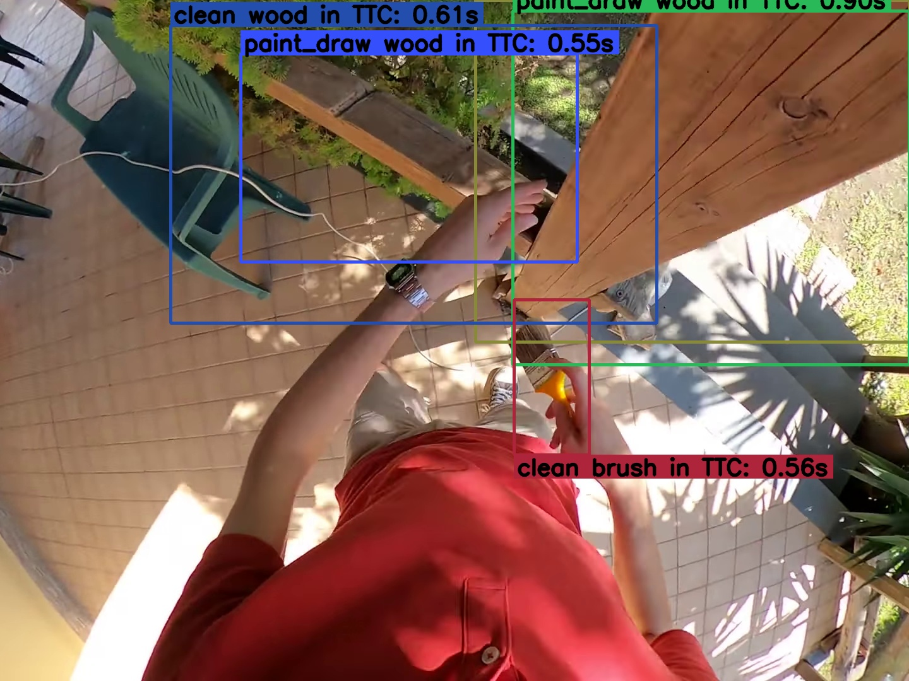

> 图 7：短期预测（Short-Term Anticipation, STA）定性结果。我们将模型预测与真实数据进行比较。V-JEPA 2.1 预测了多种场景，其中预测的物体和动词类别与合理的人-物交互相对应。

##### **评估协议（Evaluation protocol）**

模型接收一个低分辨率视频片段（384 像素，8 帧，时长 0.5 秒）和一个对应于该片段最后一帧的高分辨率图像（1080 像素）作为输入。我们使用 V-JEPA 2.1 的冻结编码器，通过各自的 **分块器（patchifier）** （对高分辨率图像使用 2D 卷积，对视频使用 3D 卷积）并添加相应的模态嵌入，独立地从两个输入中提取最高层特征。

对于视频特征，我们训练了一个四层注意力探针，其后接 Mur-Labadia 等人（2024）提出的 **帧引导时序池化模块（frame-guided temporal pooling module）** 。该模块将 3D 视频令牌聚合为一个 2D 表示，该表示在空间上与最后一帧的空间参考对齐。

随后，将池化后的视频特征与图像特征相加，并将得到的融合表示重新缩放为四个多尺度特征图，作为检测头的输入。

为了确保与最先进方法（Ragusa 等人，2023；Mur-Labadia 等人，2024；Thakur 等人，2023）进行公平比较，我们采用了这些方法中使用的相同检测头（Ragusa 等人，2023）。该检测头通过添加线性层来扩展 Faster R-CNN，以额外预测动词类别和接触时间。

##### **结果（Results）**

表 [4](#S3.T4) 展示了在 **短期预测任务（Short Term Anticipation task）** 上与最先进方法的比较。V-JEPA 2.1 展示了其性能，以 7.71 的总体 mAP 取得了绝对的最先进性能。这相对于之前的最佳方法（Mur-Labadia 等人，2024）实现了约 35% 的相对提升，而该方法引入了任务特定的训练组件。

如各项指标所示，这一增益主要源于对 **下一动作（next action）** （25.8 APb+V）和 **接触时间（time to contact）** （20.20 APb+$\delta$, 12.9 mAP b+$\delta$）理解的改进。此外，高质量的 V-JEPA 2.1 密集特征实现了对 **下一活动对象边界框（next-active object bounding boxes）** 的精确 2D 检测，达到了 50.7 AP，并在此类别中超越了 DINOv3 ViT-7B。

定性结果如图 [7](#S3.F7) 所示。V-JEPA 2.1 预测了合理的短期交互，具有准确的边界框定位、对对象类别的稳健理解以及对用户下一动作意图的合理推断。

<a id="section-3-2"></a>

### **3.2 动作预测（Action Anticipation）**

**动作预测（Action anticipation）** 是指在给定一个在动作发生前一段时间内的上下文视频片段的情况下，预测未来的动作。使用 Epic-Kitchens-100 (EK100) 基准测试（Damen 等人，2022），我们展示了 V-JEPA 2.1 超越了 V-JEPA 2 的动作预测性能，并为该任务设定了新的最先进水平。

##### **任务（Task）**

##### **评估协议（Evaluation protocol）**

模型接收一个低分辨率视频片段（384 像素，8 帧，时长 0.5 秒）和一个对应于该片段最后一帧的高分辨率图像（1080 像素）作为输入。我们使用 V-JEPA 2.1 的冻结编码器，通过各自的 **分块器（patchifier）** （对高分辨率图像使用 2D 卷积，对视频使用 3D 卷积）并添加相应的模态嵌入，独立地从两个输入中提取最高层特征。

对于视频特征，我们训练了一个四层注意力探针，其后接 Mur-Labadia 等人（2024）提出的 **帧引导时序池化模块（frame-guided temporal pooling module）** 。该模块将 3D 视频令牌聚合为一个 2D 表示，该表示在空间上与最后一帧的空间参考对齐。

随后，将池化后的视频特征与图像特征相加，并将得到的融合表示重新缩放为四个多尺度特征图，作为检测头的输入。

为了确保与最先进方法（Ragusa 等人，2023；Mur-Labadia 等人，2024；Thakur 等人，2023）进行公平比较，我们采用了这些方法中使用的相同检测头（Ragusa 等人，2023）。该检测头通过添加线性层来扩展 Faster R-CNN，以额外预测动词类别和接触时间。

##### **结果（Results）**

表 [4](#S3.T4) 展示了在 **短期预测任务（Short Term Anticipation task）** 上与最先进方法的比较。V-JEPA 2.1 展示了其性能，以 7.71 的总体 mAP 取得了绝对的最先进性能。这相对于之前的最佳方法（Mur-Labadia 等人，2024）实现了约 35% 的相对提升，而该方法引入了任务特定的训练组件。

如各项指标所示，这一增益主要源于对 **下一动作（next action）** （25.8 APb+V）和 **接触时间（time to contact）** （20.20 APb+$\delta$, 12.9 mAP b+$\delta$）理解的改进。此外，高质量的 V-JEPA 2.1 密集特征实现了对 **下一活动对象边界框（next-active object bounding boxes）** 的精确 2D 检测，达到了 50.7 AP，并在此类别中超越了 DINOv3 ViT-7B。

定性结果如图 [7](#S3.F7) 所示。V-JEPA 2.1 预测了合理的短期交互，具有准确的边界框定位、对对象类别的稳健理解以及对用户下一动作意图的合理推断。

<a id="section-3-2"></a>

### **3.2 动作预测（Action Anticipation）**

**动作预测（Action anticipation）** 是指在给定一个在动作发生前一段时间内的上下文视频片段的情况下，预测未来的动作。使用 Epic-Kitchens-100 (EK100) 基准测试（Damen 等人，2022），我们展示了 V-JEPA 2.1 超越了 V-JEPA 2 的动作预测性能，并为该任务设定了新的最先进水平。

##### **任务（Task）**

**EK100 数据集（The EK100 dataset）** 包含从 **第一人称视角（Egocentric perspective）** 在 45 个厨房环境中录制的 100 小时烹饪活动视频。EK100 中的每个视频都标注了动作片段，每个片段包含一个开始时间戳、一个结束时间戳和一个动作标签。共有 3,568 个独特的动作标签，每个标签由一个动词类别和一个名词类别组成，总计有 97 个动词类别和 300 个名词类别。EK100 的动作预测任务涉及从一个视频片段（称为 **上下文（Context）** ）中预测名词、动词和动作（即同时预测动词和名词），该上下文发生在动作片段的开始时间戳之前。
上下文结束与动作片段开始之间的间隔是 **预测时间（Anticipation time）** ，默认设置为 1 秒。鉴于从给定上下文中可能预测出不同的未来动作，因此采用 **平均类别召回率@5（Mean-class recall-at-5）** 作为衡量性能的指标 (Damen et al., 2022)。

##### **评估协议（Evaluation protocol）** 。

我们采用与 V-JEPA 2 相同的协议，并使用在冻结的 V-JEPA 2.1 编码器和预测器之上训练的 **注意力探针（Attentive probe）** 来预测未来动作。具体来说，我们采样一个在动作开始前 1 秒结束的视频片段。这个视频上下文被输入到编码器。预测器接收编码器的表征，以及对应于未来 1 秒帧的 **掩码令牌（Mask tokens）** ，并预测未来视频帧的表征。预测器和编码器的输出沿令牌维度拼接，并输入到一个注意力探针，该探针的架构与我们基于探针的视频分类协议中使用的类似，不同之处在于： **预测探针（Anticipation probe）** 的最终 **交叉注意力层（Cross-attention layer）** 学习三个 **查询令牌（Query tokens）** （而不是一个），并且每个查询输出被送入不同的线性分类器，分别预测动作类别、动词类别和名词类别。 **焦点损失（Focal loss）** (Lin et al., 2017b) 被独立地应用于每个分类器，然后在通过探针的共享注意力块进行反向传播之前求和。

<a id="table-5"></a>

**表 5：EK100 上的动作预测（Action Anticipation on EK100）** 。与 EK100 动作预测基准（EK100 Action Anticipation benchmark）上的最先进方法进行比较。我们报告了 EK100 验证集上动词、名词和动作的 **平均类别召回率@5（mean-class recall-at-5）** 。对于 ViT-g（Vision Transformer-g） 1B 模型，V-JEPA（Video Joint-Embedding Predictive Architecture） 2.1 提供了与 V-JEPA 2 相当的性能，但对于 ViT-G 2B 模型，其性能有所提升，为该任务设定了新的 **最先进水平（state-of-the-art）** 。

表 5 | EK100 上的动作预测。
| 方法 | 参数量 | 动作预测 | | |
| :--- | :---: | :---: | :---: | :---: |
| | | 动词 | 名词 | 动作 |
| InAViT (Roy et al., 2024) | 160M | 51.9 | 52.0 | 25.8 |
| Video-LLaMA (Zhang et al., 2023) | 7B | 52.9 | 52.0 | 26.0 |
| PlausiVL (Mittal et al., 2024) | 8B | 55.6 | 54.2 | 27.6 |
| V-JEPA 2 ViT-g (Assran et al., 2025) | 1B | 63.6 | 57.1 | 39.7 |
| V-JEPA 2.1 ViT-g | 1B | 63.6 | 56.2 | 38.4 |
| V-JEPA 2.1 ViT-G | 2B | 64.3 | 59.9 | 40.8 |

##### 结果（Results）.

表 [5](#S3.T5) 总结了在 EK100 动作预测（action anticipation）基准验证集上的结果。我们将 V-JEPA 2.1 的 ViT-g 1B 和 ViT-G 2B 编码器与 V-JEPA 2 的 ViT-g 1B 编码器进行了比较。两者均利用分辨率为 384 × 384、每秒 8 帧的 32 帧作为视频上下文。在相同的 10 亿（1B）模型规模下，V-JEPA 2.1 与 V-JEPA 2 性能相当，但展示了性能向 20 亿（2B）模型规模的扩展，创造了 **40.8 Action Recall@5** 的新的绝对最优性能，相当于 $+2.8\%$ 的提升。

<a id="section-3-3"></a>

### 3.3 机械臂规划（Robotic Arm Planning）

接下来，我们评估 V-JEPA 2.1 在机器人操作任务上的表现。为此，我们按照 Assran 等人（2025）的方案，训练了一个 **帧因果动作条件预测器（frame-causal action-conditioned predictor）** 。具体而言，我们使用了 Assran 等人（2025）的公开代码库，并对其进行修改，以使用我们的 V-JEPA 2.1 视频编码器来计算特征；该预测器是一个相同的 24 层 Transformer 网络，包含约 3 亿个参数，并在 Droid 原始数据集（Khazatsky 等人，2024）上使用 **教师强制（teacher-forcing）** 和 **两步展开损失（two-step rollout loss）** 进行训练。

随后，该模型在我们的实验室中以 **零样本（zero-shot）** 方式部署在一台桌面型 Franka Panda 机械臂（配备平行夹爪）上，并通过 **模型预测控制（model-predictive control）** ，在具有视觉目标指定的 **到达（reach）** 、 **抓取（grasp）** 和 **拾放（pick-and-place）** 任务上进行评估。我们使用了 Assran 等人（2025）提供的完全相同的任务配置文件，以及相似的规划超参数。

<a id="table-6"></a>

**表 6：规划性能（Planning Performance）** 。比较使用 MPC（Model Predictive Control，模型预测控制）与 VJEPA 2 及 VJEPA 2.1 对杯子进行的闭环机器人操作。在两种情况下，我们都利用 **交叉熵方法（Cross-Entropy Method）** (Rubinstein, 1997) [1] 在单个 A100 GPU 上优化动作序列。对于每项机器人技能，我们在 10 个任务上评估每个模型并取结果的平均值。VJEPA 2.1 改进的深度理解和密集特征使得 **抓取（Grasp）** 的成功率提高了 20%。此外，从定性角度看，我们发现任何在 **拾取与放置（Pick-and-Place）** 和 **抓取（Grasp）** 上的失败，都是由于对夹爪动作的规划不佳所致，而非空间理解上的失败（例如，夹爪闭合过早导致无法抓取物体，或在运输过程中夹爪轻微张开导致物体掉落）。

[1] Rubinstein, R. Y. (1997). Optimization of computer simulation models with rare events. _European Journal of Operational Research_, 99(1), 89-112.

| 表 1                          | 规划细节。             |
| :---------------------------- | :--------------------- | :-------------------- | :---------------------- | :--------------- | :---------------------- | :---------------------- | :----------------------------- |
| **方法（Method）**            | **样本数（#Samples）** | **迭代次数（Iter.）** | **规划时域（Horizon）** | **时间（Time）** | **到达成功率（Reach）** | **抓取成功率（Grasp）** | **抓放成功率（Pick-&-Place）** |
| VJEPA 2 (Assran et al., 2025) | 800                    | 10                    | 1                       | 3 秒             | 100%                    | 60%                     | 80%                            |
| VJEPA 2.1 (ours)              | 800                    | 10                    | 1                       | 3 秒             | 100%                    | 70%                     | 80%                            |
|                               | 300                    | 15                    | 8                       | 14 秒            | 100%                    | 80%                     | 80%                            |

| 100% | 80% | 80% |         |
| :--- | :-- | :-- | :------ |
| 300  | 15  | 8   | 14 秒。 |

| 100% | 80% | 80% |         |
| :--- | :-- | :-- | :------ |
| 300  | 15  | 8   | 14 秒。 |

成功率数据详见表 [6](#S3.T6)。
**VJEPA 2.1** 展现出改进的深度理解能力，使其在 **Grasp** 任务上的成功率相比 **VJEPA 2** 提升了 10%（参见图 [8](#S3.F8)）。
此外，我们发现 VJEPA 2.1 模型能够解锁在 **稍长序列展开（slightly longer rollouts）** 中进行规划的优势，这或许得益于我们模型所提供的 **稠密特征（dense features）** 的改进。
具体而言，通过减少 **交叉熵方法（Cross-Entropy Method, CEM）** 的采样数量并在 8 个步骤上进行规划，我们观察到 Grasp 任务的成功率得到了额外提升。
相比之下，我们实际上观察到 VJEPA 2 在更长的规划视野上进行规划时，成功率反而有所下降。
从定性角度看，我们进一步观察到，使用 VJEPA 2.1 模型在 **Pick-and-Place** 和 **Grasp** 任务上的失败，源于对 **夹爪动作（gripper actions）** 的规划不佳，而非空间理解上的失败；例如，夹爪闭合过早导致无法抓取物体，或在移动过程中轻微张开夹爪导致物体掉落。

<a id="figure-8"></a>


> 图 8：VJEPA 2 和 VJEPA 2.1 模型在配备平行夹爪的桌面 Franka Panda 机械臂上的零样本评估，展示了通过模型预测控制（Model-Predictive Control）进行视觉目标指定来实现的杯子抓取。VJEPA 2.1 的特征能更好地编码深度信息，从而在抓取杯子涉及沿相机深度轴的动作推理时，改进了机器人操作性能。

<a id="section-3-4"></a>

### 3.4 导航规划（Navigation Planning）

<a id="figure-9"></a>

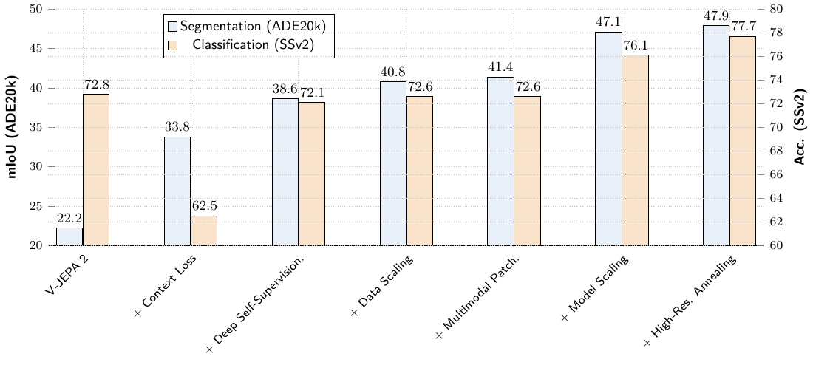

> 图 9：在潜在空间中规划导航轨迹。与 (Bar 等人, 2025) 相比，V-JEPA 2.1 实现了 $10\times$ 更快、更准确的导航规划。我们展示了在起始帧和目标帧之间规划出的潜在轨迹经过 8 个去噪步骤的主成分分析（Principal Component Analysis, PCA）可视化。

接下来，我们评估 V-JEPA 2.1 的表征在短期机器人导航任务中的效用。具体来说，给定智能体最近的一次观察和一个由图像指定的目标位置，我们预测一条朝向该目标的 2 秒导航轨迹。我们采用了 NWM（Bar 等人, 2025）的导航规划设置，并在 V-JEPA 2.1 表征之上训练了一个潜在世界模型（Latent World Model）。我们发现，V-JEPA 2.1 能够实现更准确的规划，同时规划速度比之前使用的 SD-VAE（Rombach 等人, 2022）快 $10\times$。结果报告在表 [7](#S3.T7) 中，定性示例如图 [9](#S3.F9) 所示。

我们基于 **V-JEPA 2.1** 表示训练了一个 **条件扩散变换器（Conditional Diffusion Transformer, CDiT）** ，方法与 **NWM** 类似。我们的初步实验表明，直接在 V-JEPA 2.1 的高维嵌入空间中训练扩散模型具有挑战性：因为其表示是高维的（至少比 **SD-VAE** 的表示大 $80$ 倍），在任意方向上注入噪声很容易使样本偏离数据流形。为了提高鲁棒性，我们引入了两项修改。首先，我们训练模型预测干净的表示而非噪声（Li and He, 2025）[1]。其次，我们使用 **DDIM 采样（DDIM sampling）** （Song et al., 2020）[2]，它比 **DDPM** （Ho et al., 2020）[3] 的随机性更低，并且经验上提高了稳定性。

对于规划任务，给定一个初始上下文嵌入和一个目标，我们使用 **交叉熵方法（Cross-Entropy Method）** 以 $4$ FPS 的帧率采样 $N=480$ 条长度为 $2$ 秒的候选轨迹。我们通过在 **世界模型（world model）** 中模拟这些轨迹，并选择与目标嵌入距离最小的轨迹来筛选出最佳候选。为了简化搜索，我们在一个简化的 **3 自由度（3-DoF）** 动作空间（平移和偏航旋转）中进行规划。使用 V-JEPA 2.1 表示时，我们仅需要 $8$ 步去噪，而最优的 SD-VAE 设置至少需要 $128$ 步。这在验证集上实现了更低的 **绝对轨迹误差（Absolute Trajectory Error, ATE）** 和 **相对轨迹误差（Relative Trajectory Error, RTE）** ，同时将规划时间减少了 $10$ 倍。

<a id="table-7"></a>

> 表 7：开环导航规划。我们在机器人导航数据集上微调 V-JEPA 2.1，并将其开环规划性能与 NWM 进行比较。报告平均规划时间（秒）、归一化的平均轨迹误差（ATE）和相对轨迹误差（RTE）。V-JEPA 2.1 表示在不牺牲性能的情况下实现了 $10$ 倍的加速。

我们基于 **V-JEPA 2.1** 表示训练了一个 **条件扩散变换器（Conditional Diffusion Transformer, CDiT）** ，方法与 **NWM** 类似。我们的初步实验表明，直接在 V-JEPA 2.1 的高维嵌入空间中训练扩散模型具有挑战性：因为其表示是高维的（至少比 **SD-VAE** 的表示大 $80$ 倍），在任意方向上注入噪声很容易使样本偏离数据流形。为了提高鲁棒性，我们引入了两项修改。首先，我们训练模型预测干净的表示而非噪声（Li and He, 2025）[1]。其次，我们使用 **DDIM 采样（DDIM sampling）** （Song et al., 2020）[2]，它比 **DDPM** （Ho et al., 2020）[3] 的随机性更低，并且经验上提高了稳定性。

对于规划任务，给定一个初始上下文嵌入和一个目标，我们使用 **交叉熵方法（Cross-Entropy Method）** 以 $4$ FPS 的帧率采样 $N=480$ 条长度为 $2$ 秒的候选轨迹。我们通过在 **世界模型（world model）** 中模拟这些轨迹，并选择与目标嵌入距离最小的轨迹来筛选出最佳候选。为了简化搜索，我们在一个简化的 **3 自由度（3-DoF）** 动作空间（平移和偏航旋转）中进行规划。使用 V-JEPA 2.1 表示时，我们仅需要 $8$ 步去噪，而最优的 SD-VAE 设置至少需要 $128$ 步。这在验证集上实现了更低的 **绝对轨迹误差（Absolute Trajectory Error, ATE）** 和 **相对轨迹误差（Relative Trajectory Error, RTE）** ，同时将规划时间减少了 $10$ 倍。

<a id="table-7"></a>

> 表 7：开环导航规划。我们在机器人导航数据集上微调 V-JEPA 2.1，并将其开环规划性能与 NWM 进行比较。报告平均规划时间（秒）、归一化的平均轨迹误差（ATE）和相对轨迹误差（RTE）。V-JEPA 2.1 表示在不牺牲性能的情况下实现了 $10$ 倍的加速。

表 1 | 模型在多个数据集上的性能比较。
| 模型（Model） | 时间（Time） | Recon | Tartan Drive | Scand | Sacson | 平均值（Average） | | | | | |
| :------------ | :---------- | :---- | :----------- | :---- | :----- | :---------------- | :---- | :---- | :---- | :---- | :---- |
| | | **绝对轨迹误差（Absolute Trajectory Error, ATE）** | **相对轨迹误差（Relative Trajectory Error, RTE）** | **绝对轨迹误差（ATE）** | **相对轨迹误差（RTE）** | **绝对轨迹误差（ATE）** | **相对轨迹误差（RTE）** | **绝对轨迹误差（ATE）** | **相对轨迹误差（RTE）** | **绝对轨迹误差（ATE）** | **相对轨迹误差（RTE）** |
| NWM (Bar et al., 2025) | $103.2$ (s) | 1.146 | 0.339 | 5.831 | 1.219 | 1.113 | 0.297 | 4.037 | 0.928 | 3.032 | 0.696 |

| 1.219                  | 1.113       | 0.297 | 4.037 | 0.928 | 3.032 | 0.696 |
| :--------------------- | :---------- | :---- | :---- | :---- | :---- | :---- | :---- | ----- | ----- | ----- | ----- |
| NWM (Bar et al., 2025) | $103.2$ (s) | 1.146 | 0.339 | 5.831 | 1.219 | 1.113 | 0.297 | 4.037 | 0.928 | 3.032 | 0.696 |
| V-JEPA 2.1 ViT-g       | 10.6 (s)    | 1.146 | 0.338 | 5.758 | 1.200 | 1.094 | 0.299 | 3.904 | 0.921 | 2.975 | 0.690 |
| V-JEPA 2.1 ViT-g       | 10.6 (s)    | 1.146 | 0.338 | 5.758 | 1.200 | 1.094 | 0.299 | 3.904 | 0.921 | 2.975 | 0.690 |
| V-JEPA 2.1 ViT-g       | 10.6 (s)    | 1.146 | 0.338 | 5.758 | 1.200 | 1.094 | 0.299 | 3.904 | 0.921 | 2.975 | 0.690 |
| V-JEPA 2.1 ViT-g       | 10.6 (s)    | 1.146 | 0.338 | 5.758 | 1.200 | 1.094 | 0.299 | 3.904 | 0.921 | 2.975 | 0.690 |
| V-JEPA 2.1 ViT-g       | 10.6 (s)    | 1.146 | 0.338 | 5.758 | 1.200 | 1.094 | 0.299 | 3.904 | 0.921 | 2.975 | 0.690 |
| V-JEPA 2.1 ViT-g       | 10.6 (s)    | 1.146 | 0.338 | 5.758 | 1.200 | 1.094 | 0.299 | 3.904 | 0.921 | 2.975 | 0.690 |
| V-JEPA 2.1 ViT-g       | 10.6 (s)    | 1.146 | 0.338 | 5.758 | 1.200 | 1.094 | 0.299 | 3.904 | 0.921 | 2.975 | 0.690 |
| V-JEPA 2.1 ViT-g       | 10.6 (s)    | 1.146 | 0.338 | 5.758 | 1.200 | 1.094 | 0.299 | 3.904 | 0.921 | 2.975 | 0.690 |
| V-JEPA 2.1 ViT-g       | 10.6 (s)    | 1.146 | 0.338 | 5.758 | 1.200 | 1.094 | 0.299 | 3.904 | 0.921 | 2.975 | 0.690 |
| V-JEPA 2.1 ViT-g       | 10.6 (s)    | 1.146 | 0.338 | 5.758 | 1.200 | 1.094 | 0.299 | 3.904 | 0.921 | 2.975 | 0.690 |
| V-JEPA 2.1 ViT-g       | 10.6 (s)    | 1.146 | 0.338 | 5.758 | 1.200 | 1.094 | 0.299 | 3.904 | 0.921 | 2.975 | 0.690 |
| V-JEPA 2.1 ViT-g       | 10.6 (s)    | 1.146 | 0.338 | 5.758 | 1.200 | 1.094 | 0.299 | 3.904 | 0.921 | 2.975 | 0.690 |
| V-JEPA 2.1 ViT-G       | 10.6 (s)    | 1.179 | 0.340 | 5.687 | 1.187 | 1.038 | 0.285 | 4.054 | 0.938 | 2.990 | 0.688 |
| V-JEPA 2.1 ViT-G       | 10.6 (s)    | 1.179 | 0.340 | 5.687 | 1.187 | 1.038 | 0.285 | 4.054 | 0.938 | 2.990 | 0.688 |
| V-JEPA 2.1 ViT-G       | 10.6 (s)    | 1.179 | 0.340 | 5.687 | 1.187 | 1.038 | 0.285 | 4.054 | 0.938 | 2.990 | 0.688 |
| V-JEPA 2.1 ViT-G       | 10.6 (s)    | 1.179 | 0.340 | 5.687 | 1.187 | 1.038 | 0.285 | 4.054 | 0.938 | 2.990 | 0.688 |
| V-JEPA 2.1 ViT-G       | 10.6 (s)    | 1.179 | 0.340 | 5.687 | 1.187 | 1.038 | 0.285 | 4.054 | 0.938 | 2.990 | 0.688 |
| V-JEPA 2.1 ViT-G       | 10.6 (s)    | 1.179 | 0.340 | 5.687 | 1.187 | 1.038 | 0.285 | 4.054 | 0.938 | 2.990 | 0.688 |
| V-JEPA 2.1 ViT-G       | 10.6 (s)    | 1.179 | 0.340 | 5.687 | 1.187 | 1.038 | 0.285 | 4.054 | 0.938 | 2.990 | 0.688 |
| V-JEPA 2.1 ViT-G       | 10.6 (s)    | 1.179 | 0.340 | 5.687 | 1.187 | 1.038 | 0.285 | 4.054 | 0.938 | 2.990 | 0.688 |
| V-JEPA 2.1 ViT-G       | 10.6 (s)    | 1.179 | 0.340 | 5.687 | 1.187 | 1.038 | 0.285 | 4.054 | 0.938 | 2.990 | 0.688 |
| V-JEPA 2.1 ViT-G       | 10.6 (s)    | 1.179 | 0.340 | 5.687 | 1.187 | 1.038 | 0.285 | 4.054 | 0.938 | 2.990 | 0.688 |
| V-JEPA 2.1 ViT-G       | 10.6 (s)    | 1.179 | 0.340 | 5.687 | 1.187 | 1.038 | 0.285 | 4.054 | 0.938 | 2.990 | 0.688 |
| V-JEPA 2.1 ViT-G       | 10.6 (s)    | 1.179 | 0.340 | 5.687 | 1.187 | 1.038 | 0.285 | 4.054 | 0.938 | 2.990 | 0.688 |
| V-JEPA 2.1 ViT-G       | 10.6 (s)    | 1.179 | 0.340 | 5.687 | 1.187 | 1.038 | 0.285 | 4.054 | 0.938 | 2.990 | 0.688 |

| 1.219                  | 1.113       | 0.297 | 4.037 | 0.928 | 3.032 | 0.696 |
| :--------------------- | :---------- | :---- | :---- | :---- | :---- | :---- | ----- | --- |
| NWM (Bar et al., 2025) | $103.2$ (s) | 1.146 | 0.339 | 5.831 | 1.219 | 1.113 | 0.297 | 4.  |

<a id="table-8"></a>

表 8：密集视觉任务性能。我们报告了深度估计（NYUv2、KITTI）的 **均方根误差（Root Mean Squared Error, RMSE）** 、语义分割（ADE20K、Cityscapes、VOC12）的 **平均交并比（mean Intersection-over-Union, mIoU）** ，以及视频目标分割（DAVIS、YouTube-VOS）的 $\mathcal{J}\&\mathcal{F}$-Mean。遵循 Siméoni 等人（2025）的方法，对于 **块大小（patch size）** 为 14 的模型，ADE20K 和 VOC12 在输入分辨率为 $448\times 448$ 下进行评估；对于块大小为 16 的模型，则在 $512\times 512$ 分辨率下评估。Cityscapes、NYUv2 和 KITTI 使用其默认评估分辨率。对于 DAVIS 和 YouTube-VOS，我们评估时将图像的较短边设置为 480 像素（块大小 16）或 420 像素（块大小 14）。 **V-JEPA 2.1 VIT G** 在密集视觉任务上表现出强大的性能。值得注意的是，它在 NYUv2 深度估计上取得了 **最先进（state-of-art）** 的性能，超越了拥有 70 亿参数的 **DINOv3** 骨干网络。

| 方法（Method）    | 参数量（Param.）  | 深度估计（Depth） | 语义分割（Segmentation） | 视频目标分割（VOS） |         |          |     |     |
| :---------------- | :---------------- | :---------------- | :----------------------- | :------------------ | :------ | :------- | :-- | :-- |
| 方法（Method）    | 参数量（Param.）  | 深度估计（Depth） | 语义分割（Segmentation） | 视频目标分割（VOS） |         |          |     |     |
| 方法（Method）    | 参数量（Param.）  | 深度估计（Depth） | 语义分割（Segmentation） | 视频目标分割（VOS） |         |          |     |     |
| 方法（Method）    | 参数量（Param.）  | 深度估计（Depth） | 语义分割（Segmentation） | 视频目标分割（VOS） |         |          |     |     |
| 方法（Method）    | 参数量（Param.）  | 深度估计（Depth） | 语义分割（Segmentation） | 视频目标分割（VOS） |         |          |     |     |
| NYUv2$\downarrow$ | KITTI$\downarrow$ | ADE20k            | Citysc.                  | VOC                 | DAVIS-S | YT VOS-S |     |     |
| NYUv2$\downarrow$ | KITTI$\downarrow$ | ADE20k            | Citysc.                  | VOC                 | DAVIS-S | YT VOS-S |     |     |
| NYUv2$\downarrow$ | KITTI$\downarrow$ | ADE20k            | Citysc.                  | VOC                 | DAVIS-S | YT VOS-S |     |     |
| NYUv2$\downarrow$ | KITTI$\downarrow$ | ADE20k            | Citysc.                  | VOC                 | DAVIS-S | YT VOS-S |     |     |
| NYUv2$\downarrow$ | KITTI$\downarrow$ | ADE20k            | Citysc.                  | VOC                 | DAVIS-S | YT VOS-S |     |     |
| NYUv2$\downarrow$ | KITTI$\downarrow$ | ADE20k            | Citysc.                  | VOC                 | DAVIS-S | YT VOS-S |     |     |
| NYUv2$\downarrow$ | KITTI$\downarrow$ | ADE20k            | Citysc.                  |                     |         |          |     |     |

<a id="figure-10"></a>


> **图 10（Figure 10）** ：在 NYU 和 KITTI 数据集上的深度估计对比。虽然 V-JEPA 2 捕捉到了整体场景几何结构，但其预测结果缺乏局部一致性和精确的边界结构。相比之下，我们的 V-JEPA 2.1 生成了更清晰、更连贯、更细粒度的深度图。

<a id="figure-11"></a>


> **图 11（Figure 11）** ：在 VOC12 和 Cityscapes 数据集上的语义分割定性结果。由于存在噪声特征图，先前版本 V-JEPA 2 生成了稀疏的语义掩码。然而，V-JEPA 2.1 实现了与 DINOv3 ViT-H+ 等最先进方法相媲美的性能。

<a id="section-3-5"></a>

### 3.5 深度估计与语义分割（Depth Estimation and Semantic Segmentation）

我们通过 **语义分割（Semantic segmentation）** 和 **深度估计（Depth estimation）** 这两个需要对图像空间结构进行细粒度理解的任务，来评估所学表征的质量。

##### **任务（Task）**

**语义分割（Semantic segmentation）** 探究模型捕捉类别级语义和物体边界的能力。我们在 PASCAL VOC12 (Everingham et al., 2015)、ADE20K (Zhou et al., 2017b) 和 Cityscapes (Cordts et al., 2016) 数据集上评估我们的模型，并报告 **平均交并比（mean Intersection over Union, mIoU）** 。按照 Siméoni 等人 (2025) 的做法，输入图像的分辨率被调整为 1024 个 **图像块词元（patch tokens）** （即，对于 **图像块大小（patch size）** 为 16 的情况，分辨率为 $512\times 512$；对于 **图像块大小（patch size）** 为 14 的情况，分辨率为 $448\times 448$）。
另一方面， **深度估计（Depth estimation）** 评估模型对场景几何结构的理解。对于此任务，我们使用 NYUv2 (Silberman et al., 2012a) 和 KITTI (Geiger et al., 2013b) 基准数据集，并报告 **均方根误差（Root Mean Squared Error, RMSE）** 。

<a id="figure-12"></a>

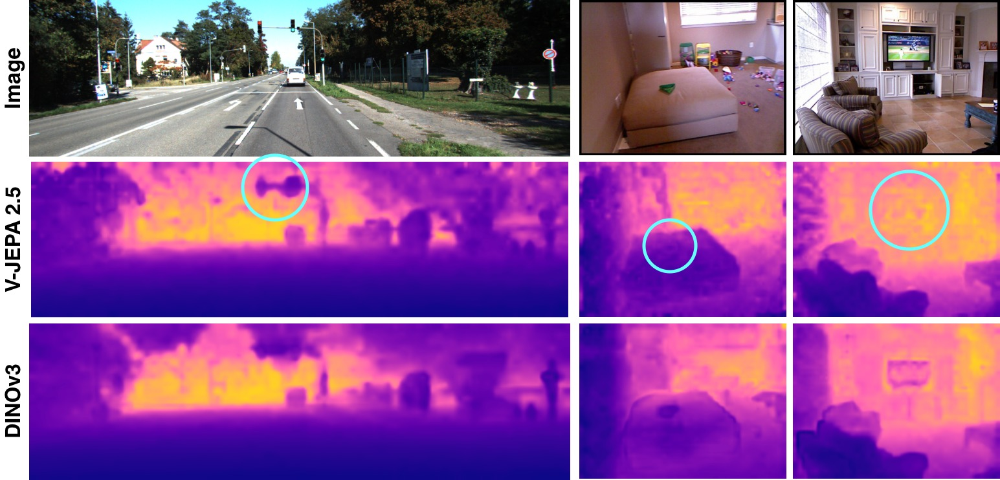

> **图 12（Figure 12）** ：V-JEPA 2.1 ViT-G 与 DINOv3 ViT-H$+$ 的定性比较。V-JEPA 2.1 捕捉到了细粒度细节（即交通灯的轮廓）并获得了更好的尺度一致性。在最右侧的两列中，DINOv3 错误地标注了床上绿色物体和电视的深度，并将它们检测为比实际位置更靠近相机。

##### **评估协议（Evaluation protocol）**

遵循 DINOv3 (Siméoni et al., 2025) 的协议，我们使用 **图像分块器（image patchifier）** 在 V-JEPA 2.1 编码器的冻结最后一层特征之上训练一个 **密集线性投影（dense linear projection）** 。
重要的是，我们 **不** 使用编码器的中间层。
由于 V-JEPA 2.1 采用了 **三维旋转位置编码（3D Rotary Position Embedding, 3D RoPE）** 进行 **位置编码（positional encoding）** ，其频率会根据图像分辨率进行插值。

##### 结果（Results）

表 [8](#S3.T8) 总结了 V-JEPA 2.1（Visual Joint-Embedding Predictive Architecture 2.1）与其他视觉编码器在深度估计和单图像语义分割上的性能。

V-JEPA 2.1 ViT-G（Vision Transformer Giant）在 **线性探测单目深度估计（Linear-probe monocular depth estimation）** 上取得了最先进的结果，在 NYUv2 数据集上达到 0.307 的 **均方根误差（Root Mean Square Error, RMSE）** ，在 KITTI 数据集上以 2.461 RMSE 表现出强劲性能，在参数量小于 20 亿的模型中表现最佳。
在 NYUv2 上，V-JEPA 2.1 超越了先前的图像编码器，包括 DINOv3 ViT-7B（在 NYU 上为 0.309 RMSE）和 PEspatial-G（在 NYU 上为 0.362 RMSE），并且相较于视频编码器如 InternVideo2-1B（0.471 RMSE）和 V-JEPA 2（0.642 RMSE）有显著提升。
图 [10](#S3.F10) 对 V-JEPA 2 和 V-JEPA 2.1 预测的深度图进行了定性比较。虽然 V-JEPA 2 捕捉到了整体场景几何结构，但其局部特征的不一致性导致了噪声较多的深度图。相比之下，我们新颖的 V-JEPA 2.1 能生成更清晰、更连贯且具有明确物体边界的深度图。
我们还在图 [12](#S3.F12) 中展示了与 DINOv3 ViT-H+ 更详细的定性比较。

在语义分割方面，V-JEPA 2.1 也与最先进的模型高度竞争，在 VOC12 上获得 85.0 的 **平均交并比（mean Intersection over Union, mIoU）** ，在 Cityscapes 上获得 73.5 mIoU，在 ADE20K 上获得 47.9 mIoU。与其前代版本 V-JEPA 2 相比，在所有数据集上都有显著提升：在 ADE20K 上提升 +23.4 分，在 Cityscapes 上提升 +27.6 分，在 VOC12 上提升 +20.7 分；这显示了 **显式监督上下文标记（explicitly supervising the context tokens）** 和 **融入多级预测器（incorporating the multi-level predictor）** 带来的益处。

在 ADE20K 和 Cityscapes 上的性能仍略微落后于最佳图像编码器。这些数据集包含大量跨越巨大尺度变化的物体类别，以及杂乱的场景布局，这对细粒度分割提出了严格要求。我们假设 VisionMix 数据集包含的相对高度杂乱的场景较少，限制了模型接触此类基准测试所需的粒度水平。
图 [11](#S3.F11) 展示了在 Cityscapes 和 VOC12 上的分割预测结果。V-JEPA 2.1 生成了详细且空间准确的掩码，高保真地捕捉了多尺度结构和精细的物体轮廓，显示出与 DINOv3 ViT-H+（Siméoni 等人，2025）等最先进方法相竞争的性能。

<a id="section-3-6"></a>

### 3.6 视频目标分割（Video Object Segmentation）

我们在 **视频目标分割（Video Object Segmentation, VOS）** 任务上评估 V-JEPA 2.1，以评估其学习特征的时间一致性。

<a id="figure-13"></a>

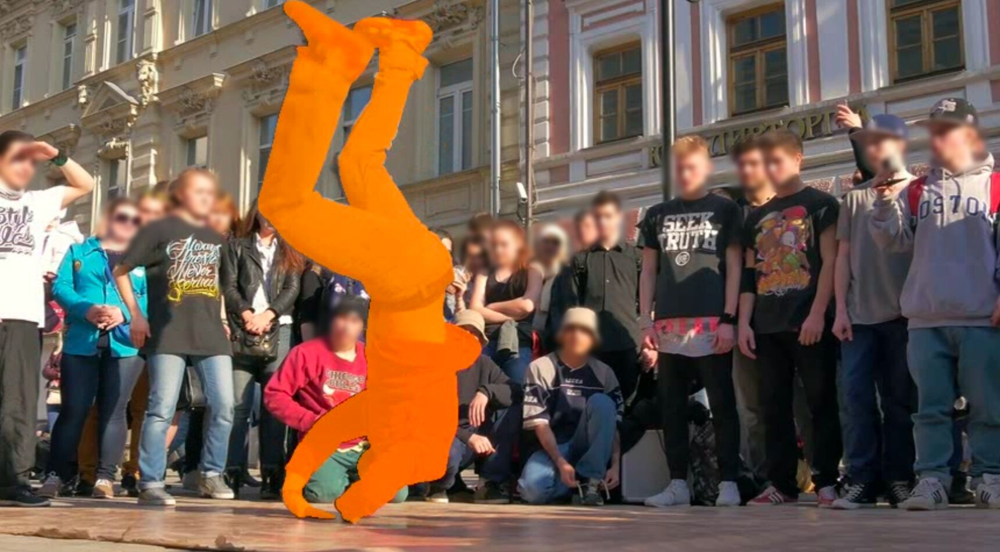

> 图 13：视频目标分割（Video Object Segmentation）定性示例。给定初始帧的 **真实目标掩码（ground-truth object masks）** ，我们基于 V-JEPA 2.1 嵌入空间内的 **图像块相似度（patch similarity）** 将 **实例掩码（instance masks）** 传播到后续帧。所有视频均以较短边设置为 480 像素的分辨率进行处理。

##### **任务（Task）** 。

**视频目标分割（Video Object Segmentation）** 的任务是，给定第一帧的真实目标掩码，在所有后续帧中准确地传播此掩码。该任务评估模型在保持对相机运动、目标形变和视觉干扰鲁棒性的同时，维持 **长程对应关系（long-range correspondences）** 的能力。
我们在 DAVIS 2017（Pont-Tuset 等人，2017）和 YouTube-VOS（Xu 等人，2018）数据集上进行评估，报告标准的 $\mathcal{J}\&\mathcal{F}$-mean 指标（Perazzi 等人，2016），该指标联合衡量区域相似性和轮廓精度。

##### **评估协议（Evaluation protocol）** 。

我们采用一种 **非参数标签传播方法（non-parametric label propagation approach）** （Jabri 等人，2020），该方法在嵌入空间中使用 **余弦相似度（cosine similarity）** 来匹配跨帧的局部图像块特征。此过程不引入任何可学习参数，使其成为对表示 **时序稳定性（temporal stability）** 的直接探测。
遵循 Siméoni 等人（2025）的方法，我们对输入视频进行尺寸调整，以产生一致数量的 **图像块标记（patch tokens）** （对于图像块大小为 14 的情况，短边为 420 像素；对于图像块大小为 16 的情况，短边为 480 像素）。
在每个数据集的训练集上，我们系统性地搜索最佳超参数：最大上下文长度、邻域掩码大小、 **前 K 个最近邻（top-K nearest neighbors）** 的数量以及相似度计算中使用的 **温度参数（temperature parameter）** 。在 DAVIS-S 上得到的最佳配置（15 个上下文帧，大小为 12 的圆形掩码，前 5 个最近邻，温度 = 0.2）被应用于所有验证集。

##### **结果（Results）** 。

V-JEPA 2.1 在 DAVIS-17 数据集上取得了 69.0 的 $\mathcal{J}\&\mathcal{F}$ 分数，在 YouTube-VOS 数据集上取得了 72.7 的 $\mathcal{J}\&\mathcal{F}$ 分数，获得了第二佳的性能，并超越了除 DINOv3 之外的所有先前编码器，DINOv3 取得了略高的分数。
这些结果突显了 V-JEPA 2.1 特征的 **时序一致性（temporal consistency）** ，这使得即使在帧间出现显著的外观变化时，也能实现稳定的目标跟踪。
图 [13](#S3.F13) 展示了两个定性示例：即使在快速运动和显著的视觉变化下，V-JEPA 2.1 也能在整个序列中保持一致的 **目标分割掩码（object segmentation masks）** 。

<a id="section-3-7"></a>

### 3.7 视频与图像分类（Video and Image Classification）

<a id="table-9"></a>

> 表 9：全局任务性能。我们报告了在动作识别基准（SSv2、Diving-48 和 K400）和图像分类（IN1K）上的 Top-1 分类准确率。我们的默认协议使用 $256\times 256$ 的分辨率，对于 V-JEPA 2 ViT-g 和 V-JEPA 2.1 则使用 $384\times 384$ 的分辨率；对于 SSv2 使用 $16\times 2\times 3$ 的输入（16 帧片段，2 个时间裁剪，3 个空间裁剪），对于 K400 使用 $16\times 8\times 3$，对于 Diving-48 使用 $32\times 4\times 3$。 **V-JEPA 2.1 ViT-G 在 SSv2 动作识别任务上取得了最先进的性能，同时在外观理解任务上也具有竞争力。**

| 方法（Method） | 参数量（Param.） | 运动理解（Motion Understanding） | 外观理解（Appearance Understanding） |     |     |
| :------------- | :--------------: | :------------------------------: | :----------------------------------: | :-: | :-: |
| 方法（Method） | 参数量（Param.） | 运动理解（Motion Understanding） | 外观理解（Appearance Understanding） |     |     |
| 方法（Method） | 参数量（Param.） | 运动理解（Motion Understanding） | 外观理解（Appearance Understanding） |     |     |
| 方法（Method） | 参数量（Param.） |                                  |                                      |     |     |

| 方法（Method） | 参数量（Param.） | 运动理解（Motion Understanding） | 外观理解（Appearance Understanding） |     |     |
| :------------- | :--------------: | :------------------------------: | :----------------------------------: | :-: | :-: |
| 方法（Method） | 参数量（Param.） | 运动理解（Motion Understanding） | 外观理解（Appearance Understanding） |     |     |
| 方法（Method） | 参数量（Param.） | 运动理解（Motion Understanding） | 外观理解（Appearance Understanding） |     |     |
| 方法（Method） | 参数量（Param.） |                                  |                                      |     |     |

现实世界的视频理解需要识别静态视觉线索（即物体、纹理、场景布局）以及动态模式（即手势、手-物交互、相机运动、长期时序演变）。
为捕捉这种双重特性，我们在四个互补的分类数据集上评估预训练期间学习到的表征。
**Something-Something v2（Goyal 等人，2017）** 和 **Diving-48（Li 等人，2018）** 评估以运动为中心的理解能力，因为它们的标签要求对多帧动态进行建模才能正确识别动作。
相比之下， **Kinetics-400（Kay 等人，2017）** 和 **ImageNet-1K（Deng 等人，2009）** 主要衡量基于外观的识别能力，因为它们的许多类别即使标签描述的是动作，也可以从单帧图像中预测出来。

##### **任务（Task）**

我们将 **V-JEPA 2.1** 的视频分类性能与一系列广泛的视觉编码器进行比较。
对于基于图像的自监督模型，我们纳入了带寄存器的 **DINOv2（DINOv2 with registers）** （Darcet 等人，2023）以及更新的 **DINOv3** （Siméoni 等人，2025），两者都代表了纯图像预训练领域的最先进水平。
我们进一步评估了领先的图像-文本对比方法，包括 **SigLIP2** （Tschannen 等人，2025）和 **感知编码器 PEcoreG（Perception Encoder PEcoreG）** （Bolya 等人，2025）。对于视频模型，我们以先前的 **V-JEPA** （Bardes 等人，2024）和 **V-JEPA 2** （Assran 等人，2025）为基准，同时也与 **InternVideo2s2-1B** （Wang 等人，2024b）进行比较，后者是一个主要通过视觉-文本对比目标训练的最先进视频编码器。

此外，我们报告了与文献中已有结果的比较，包括 VideoMAEv2（Wang 等人，2023）、InternVideo2-1B（Wang 等人，2024b）、VideoPrism（Zhang 等人，2024）和 DINOv3（Siméoni 等人，2025）。请注意，这些模型是在类似的 **冻结探针（frozen-probe）** 协议下进行评估的，但它们的注意力头（attentive heads）与我们的不同。例如，DINOv3 为其探针增加了显式的空间和时间位置嵌入（positional embeddings），并在其注意力块（attention blocks）中应用了 **三维分解 RoPE（3D factorized RoPE）** 。相比之下，我们的 V-JEPA 2.1 编码器（encoder）已经在其特征中编码了时空结构，这使得我们的探针无需此类额外组件即可工作。

##### 评估协议（Evaluation protocol）。

遵循 Assran 等人（2025）提出的协议，我们在冻结编码器特征之上，使用每个任务各自的训练数据，训练了一个 **4 层注意力探针（4-layers attentive probe）** 。
该注意力探针由四个 **Transformer 块（transformer blocks）** 组成，其后是一个使用可学习查询令牌（learnable query token）的最终 **交叉注意力机制（cross-attention mechanism）** 。
在推理时，我们从视频中采样了多个具有固定帧数的片段，并对所有片段的分类逻辑值（classification logits）进行了平均。

##### 结果（Results）。

表 [9](#S3.T9) 总结了 V-JEPA 2.1、先前的 V-JEPA 模型以及其他强大视觉编码器的全局视频理解性能。V-JEPA 2.1 ViT-G 在 SSv2 上实现了 77.7 的 top-1 准确率，与此任务上 InternVideo2 全微调（full fine-tuning）的 77.5、V-JEPA 2 的 77.3、DINOv3 ViT-7B 的 70.1 以及使用相同协议的 InternVideo2 的 69.7 相比，创造了新的绝对最先进水平，展示了对视频动态的强大理解能力。我们的模型在基于外观的任务中也极具竞争力，在 K400 上达到 87.7，在 IN1K 上达到 85.5。
这些结果表明， **在上下文令牌（context tokens）上合理设计损失函数，并结合深度自监督（deep self-supervision），能够产生细粒度的密集特征（fine-grained dense features），这些特征同样能捕捉到强大的全局场景理解能力。**
我们还观察到，从 ViT-g 到 ViT-G 的模型缩放带来了持续的性能提升，平均提升了 +0.6 个百分点。

<a id="section-3-8"></a>

### 3.8 视频问答（Video Question Answering）

在本节中，我们通过遵循 Assran 等人（2025）提出的方案，使用 V-JEPA 2.1 编码器和 Llama 3.1 8B LLM 作为骨干网络，训练一个 **视频大语言模型（Video Large Language Model, VidLLM）** ，来评估 V-JEPA 2.1 在 **视频问答（Video Question Answering, VidQA）** 上的性能。

<a id="table-10"></a>

> 表 10：视频问答（VideoQA）结果。我们报告了使用 Llama 3.1 8B 骨干网络训练的 VJEPA 2.1 在多个流行的时序视频理解数据集上的性能。我们在 PerceptionLM（Cho 等人，2025）数据的一个修改子集上进行训练，并通过在相同数据机制下训练 VJEPA 2（Assran 等人，2025）来进行比较。在多个需要丰富视觉信息和时序理解能力的视频理解任务上，VJEPA 2.1 取得了比 VJEPA 2 相对更好的性能。对于 PerceptionTest（Pătrăucean 等人，2023），我们报告的是验证集准确率，因为用于计算测试集准确率（由 \* 表示）的测试服务器已不再可用。

| 方法（Method） | 参数量<br>编码器 / 大型语言模型（Params<br>Enc / LLM） | 平均（Avg.） | 感知测试<br>测试准确率（PerceptionTest<br>Test Acc） | MVP<br>配对准确率（MVP<br>Paired-Acc） | TempCompass<br>多选（TempCompass<br>multi-choice） | TemporalBench<br>（MBA-简短问答）（TemporalBench<br>(MBA-short QA)） | TOMATO<br>准确率（TOMATO<br>Acc） | TVBench<br>准确率（TVBench<br>Acc） | MVBench<br>准确率（MVBench<br>Acc） |
| -------------- | ------------------------------------------------------ | ------------ | ---------------------------------------------------- | -------------------------------------- | -------------------------------------------------- | -------------------------------------------------------------------- | --------------------------------- | ----------------------------------- | ----------------------------------- |
| 方法（Method） | 参数量<br>编码器 / 大型语言模型（Params<br>Enc / LLM） | 平均（Avg.） | 感知测试<br>测试准确率（PerceptionTest<br>Test Acc） | MVP<br>配对准确率（MVP<br>Paired-Acc） | TempCompass<br>多选（TempCompass<br>multi-choice） | TemporalBench<br>（MBA-简短问答）（TemporalBench<br>(MBA-short QA)） | TOMATO<br>准确率（TOMATO<br>Acc） | TVBench<br>准确率（TVBench<br>Acc） | MVBench<br>准确率（MVBench<br>Acc） |
| 方法（Method） | 参数量<br>编码器 / 大型语言模型（Params<br>Enc / LLM） | 平均（Avg.） | 感知测试<br>测试准确率（PerceptionTest<br>Test Acc） | MVP<br>配对准确率（MVP<br>Paired-Acc） | TempCompass<br>多选（TempCompass<br>multi-choice） | TemporalBench<br>（MBA-简短问答）（TemporalBench<br>(MBA-short QA)） | TOMATO<br>准确率（TOMATO<br>Acc） | TVBench<br>准确率（TVBench<br>Acc） | MVBench<br>准确率（MVBench<br>Acc） |
| 方法（Method） | 参数量<br>编码器 / 大型语言模型（Params<br>Enc / LLM） | 平均（Avg.） | 感知测试<br>测试准确率（PerceptionTest<br>Test Acc） | MVP<br>配对准确率（MVP<br>Paired-Acc） | TempCompass<br>多选（TempCompass<br>multi-choice） | TemporalBench<br>（MBA-简短问答）（TemporalBench<br>(MBA-short QA)） | TOMATO<br>准确率（TOMATO<br>Acc） | TVBench<br>准确率（TVBench<br>Acc） | MVBench<br>准确率（MVBench<br>Acc） |
| 方法（Method） | 参数量<br>编码器 / 大型语言模型（Params<br>Enc / LLM） | 平均（Avg.） | 感知测试<br>测试准确率（PerceptionTest<br>Test Acc） | MVP<br>配对准确率（MVP<br>Paired-Acc） | TempCompass<br>多选（TempCompass<br>multi-choice） | TemporalBench<br>（MBA-简短问答）（TemporalBench<br>(MBA-short QA)） | TOMATO<br>准确率（TOMATO<br>Acc） | TVBench<br>准确率（TVBench<br>Acc） | MVBench<br>准确率（MVBench<br>Acc） |
| 方法（Method） | 参数量<br>编码器 / 大型语言模型（Params<br>Enc / LLM） | 平均（Avg.） | 感知测试<br>测试准确率（PerceptionTest<br>Test Acc） | MVP<br>配对准确率（MVP<br>Paired-Acc） | TempCompass<br>多选（TempCompass<br>multi-choice） | TemporalBench<br>（MBA-简短问答）（TemporalBench<br>(MBA-short QA)） | TOMATO<br>准确率（TOMATO<br>Acc） | TVBench<br>准确率（TVBench<br>Acc） | MVBench<br>准确率（MVBench<br>Acc） |
| 方法（Method） | 参数量<br>编码器 / 大型语言模型（Params<br>Enc / LLM） | 平均（Avg.） | 感知测试<br>测试准确率（PerceptionTest<br>Test Acc） | MVP<br>配对准确率（MVP<br>Paired-Acc） | TempCompass<br>多选（TempCompass<br>multi-choice） | TemporalBench<br>（MBA-简短问答）（TemporalBench<br>(MBA-short QA)） | TOMATO<br>准确率（TOMATO<br>Acc） | TVBench<br>准确率（TVBench<br>Acc） | MVBench<br>准确率（MVBench<br>Acc） |
| 方法（Method） | 参数量<br>编码器 / 大型语言模型（Params<br>Enc / LLM） | 平均（Avg.） | 感知测试<br>测试准确率（PerceptionTest<br>Test Acc） | MVP<br>配对准确率（MVP<br>Paired-Acc） | TempCompass<br>多选（TempCompass<br>multi-choice） | TemporalBench<br>（MBA-简短问答）（TemporalBench<br>(MBA-short QA)） | TOMATO<br>准确率（TOMATO<br>Acc） | TVBench<br>准确率（TVBench<br>Acc） | MVBench<br>准确率（MVBench<br>Acc） |
| 方法（Method） | 参数量<br>编码器 / 大型语言模型（Params<br>Enc / LLM） | 平均（Avg.） | 感知测试<br>测试准确率（PerceptionTest<br>Test Acc） | MVP<br>配对准确率（MVP<br>Paired-Acc） | TempCompass<br>多选（TempCompass<br>multi-choice） | TemporalBench<br>（MBA-简短问答）（TemporalBench<br>(MBA-short QA)） | TOMATO<br>准确率（TOMATO<br>Acc） | TVBench<br>准确率（TVBench<br>Acc） | MVBench<br>准确率（MVBench<br>Acc） |
| 方法（Method） | 参数量<br>编码器 / 大型语言模型（Params<br>Enc / LLM） | 平均（Avg.） | 感知测试<br>测试准确率（PerceptionTest<br>Test Acc） | MVP<br>配对准确率（MVP<br>Paired-Acc） | TempCompass<br>多选（TempCompass<br>multi-choice） | TemporalBench<br>（MBA-简短问答）（TemporalBench<br>(MBA-short QA)） | TOMATO<br>准确率（TOMATO<br>Acc） | TVBench<br>准确率（TVBench<br>Acc） | MVBench<br>准确率（MVBench<br>Acc） |
| 方法（Method） | 参数量<br>编码器 / 大型语言模型（Params<br>Enc / LLM） | 平均（Avg.） | 感知测试<br>测试准确率（PerceptionTest<br>Test Acc） | MVP<br>配对准确率（MVP<br>Paired-Acc） | TempCompass<br>多选（TempCompass<br>multi-choice） | TemporalBench<br>（MBA-简短问答）（TemporalBench<br>(MBA-short QA)） | TOMATO<br>准确率（TOMATO<br>Acc） | TVBench<br>准确率（TVBench<br>Acc） | MVBench<br>准确率（MVBench<br>Acc） |
| 方法（Method） | 参数量<br>编码器 / 大型语言模型（Params<br>Enc / LLM） | 平均（Avg.） | 感知测试<br>测试准确率（PerceptionTest<br>Test Acc） | MVP<br>配对准确率（MVP<br>Paired-Acc） | TempCompass<br>多选（TempCompass<br>multi-choice） | TemporalBench<br>（MBA-简短问答）（TemporalBench<br>(MBA-short QA)） | TOMATO<br>准确率（TOMATO<br>Acc） | TVBench<br>准确率（TVBench<br>Acc） | MVBench<br>准确率（MVBench<br>Acc） |
| 方法（Method） | 参数量<br>编码器 / 大型语言模型（Params<br>Enc / LLM） | 平均（Avg.） | 感知测试<br>测试准确率（PerceptionTest<br>Test Acc） | MVP<br>配对准确率（MVP<br>Paired-Acc） | TempCompass<br>多选（TempCompass<br>multi-choice） | TemporalBench<br>（MBA-简短问答）（TemporalBench<br>(MBA-short QA)） |

##### 任务（Task）.

我们将 V-JEPA 2.1 的 **视频问答（Video Question Answering, VidQA）** 性能与文献中报道的、 **大型语言模型（Large Language Model, LLM）** 骨干规模 $\leq$ 8B 的流行开源多模态模型进行比较。遵循 Assran 等人（2025）设定的协议，我们在需要丰富视觉和时间理解的视频理解基准测试上报告性能，例如 **感知测试（PerceptionTest）** （Pătrăucean 等人，2023）、 **最小视频对（Minimal Video Pairs, MVP）** （Krojer 等人，2024）、 **时间罗盘（TempCompass）** （Liu 等人，2024）、 **时间基准（TemporalBench）** （Cai 等人，2024）、 **TOMATO** （Shangguan 等人，2024）和 **MVBench** （Li 等人，2024）。

##### 评估协议（Evaluation protocol）。

我们使用公开可用的 **PerceptionLM** （Cho 等人，2025）的一个子集来训练我们的 **视频-大型语言模型（Video-LLM）** 。
基于此数据，我们使用领域过滤器、视觉-文本错位过滤器以及一个外部多模态大型语言模型 **Qwen3VL** 作为数据质量评判器进行数据质量过滤，为每个数据样本分配分数。此过程导致我们筛选并移除了 18% 的训练数据。
需要重点注意的是， **我们并未使用此设置对来自 PerceptionLM（Cho 等人，2025）的任何数据进行改写——我们仅基于模型的判断对数据进行过滤** 。

我们在新数据上复现了 VJEPA 2 的 LLM 对齐，并将我们的模型 VJEPA 2.1 与之比较。我们遵循 Assran 等人（2025）相同的三阶段训练流程来训练 VJEPA 2.1 LLM，从图像-文本描述开始，逐步在更高质量的图像和视频-文本描述以及问答数据上进行训练。我们进一步增加了第四阶段的对齐，在此阶段我们扩展了基础 LLM 的上下文长度，以支持 64 帧的视频输入，而 VJEPA 2（Assran 等人，2025）仅支持 32 帧。
在我们的实验中，我们主要使用 VJEPA 2.1 的纯视频模式，以便更好地与 VJEPA 2 进行比较。有趣的是，我们发现使用 PerceptionTest 训练集增加一个最终的训练后阶段，可以进一步提升所有下游任务的性能。

##### 结果（Results）。

表 [10](#S3.T10) 总结了在 VidQA（Video Question Answering，视频问答）评估任务上的结果。在相同数据上比较 V-JEPA（Video Joint-Embedding Predictive Architecture，视频联合嵌入预测架构） 2 和 V-JEPA 2.1，我们发现平均而言 V-JEPA 2.1 表现略好，在 PerceptionTest、Minimal Video Pairs 上取得了显著提升，并且 **关键的是** ，在需要丰富视觉语义的数据集——MVBench 和 TVBench 上也有所改进。我们观察到 V-JEPA 2.1 在 TemporalBench 和 TOMATO 上表现较差——这两个数据集都需要理解运动事件，但处理的视频较短。

与文献中报告的结果相比，V-JEPA 2.1 的表现略逊于 Assran 等人（2025）报告的结果，后者使用了显著更多的对齐数据（Assran 等人（2023）使用了 8850 万个样本，而 V-JEPA 2.1 使用了 7250 万个样本）。尽管如此，V-JEPA 2.1 仍与 **最先进技术（state-of-the-art）** 具有竞争力，在模型规模相近的情况下，其性能优于大多数开源多模态大型语言模型（Multimodal Large Language Models, MLLMs）。

<a id="figure-14"></a>

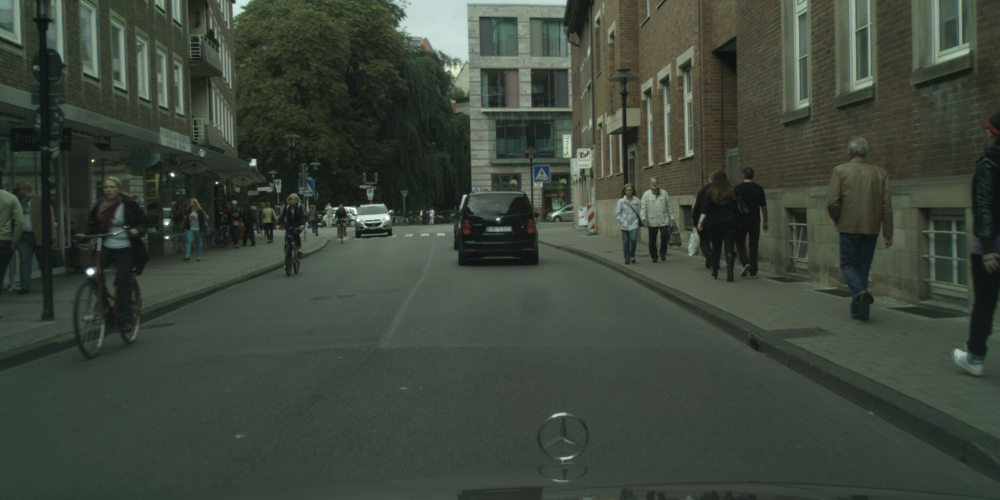

> 图 14：不同自监督学习（Self-Supervised Learning, SSL）方法在单张图像上生成的密集特征对比。我们将 DINOv2 ViT-g（Oquab 等人，2023）、DINOv3 ViT-H+（Siméoni 等人，2025）和 V-JEPA 2 ViT-g（Assran 等人，2025）与 V-JEPA 2.1 ViT-G 进行对比。图像被调整大小，使其短边设置为 1024 像素，然后使用二维卷积图像分词器（2D convolution image tokenizer）进行处理。

<a id="figure-15"></a>

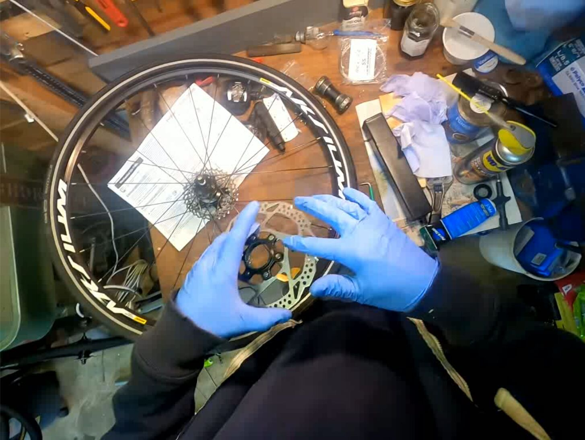

> 图 15：V-JEPA 2.1 从视频中解锁了密集特征。在 Ego4D（1080px）、Cityscapes（1080px）、Diving48（768px）和 MOCA（768px）上的定性结果展示了我们的 ViT-G 模型生成的密集特征具有很强的时间一致性，尤其是在动态物体上。由于我们处理的是整个视频序列，因此采用了三维卷积视频分词器（3D convolutional video tokenizer）。

<a id="section-3-9"></a>

### 3.9 V-JEPA 2.1 密集特征的定性结果（Qualitative results of V-JEPA 2.1 Dense Features）

图 [14](#S3.F14) 展示了使用 V-JEPA 2.1 ViT-G、DINOv2 ViT-g（Oquab 等人，2023）、DINOv3 ViT-H+（Siméoni 等人，2025）和 V-JEPA 2 ViT-g（Assran 等人，2025）从单张图像获得的密集特征图（dense feature maps）的比较。我们使用主成分分析（Principal Component Analysis, PCA）将每个编码器的特征空间投影到三维。遵循 Siméoni 等人（2025）的方法，我们在六种可能的 RGB 通道排列中对三个分量进行排列，并展示视觉效果最佳的一种。图 [14](#S3.F14) 中的定性结果说明了从单张图像获得的 V-JEPA 2.1 密集特征图的高质量，它们展示了对物体（如猫的毛发细节或 Cityscapes 场景中的行人）的细粒度且精确的识别。图 [15](#S3.F15) 进一步将这种比较扩展到 64 帧的完整视频序列，展示了在不同场景下具有时间一致性的密集特征图，包括来自 Ego4D（Grauman 等人，2022）的自我中心视频、Cityscapes 序列（Cordts 等人，2016）、Diving48 视频（Li 等人，2018）以及来自 MOC（Lamdouar 等人，2020）的动物伪装镜头。

<a id="section-3-10"></a>

### 3.10 蒸馏模型家族（Family of distilled models）

我们遵循相同的协议来评估我们蒸馏得到的 ViT-L 和 ViT-B 模型。表 LABEL:tab:distill_vs_scratch 展示了我们的结果，我们观察到从零开始训练的 ViT-L 与从 ViT-G 蒸馏得到的 ViT-L 之间，在所有基准测试中都有显著提升，几乎弥合了与 ViT-G 性能的差距。在 SSv2 上的动作识别任务中，性能从 74.2% 提升至 76.5%，几乎达到了 ViT-G 的 77.7%。在 ADE20k 上的图像分割任务中，性能从 42.0 mIoU（Mean Intersection over Union，平均交并比）提升至 46.7 mIoU。在深度估计和视频分割任务中，蒸馏得到的 ViT-L 甚至更接近 ViT-G，在 KITTI 数据集上的均方根误差（Root Mean Square Error, RMSE）为 2.490，接近 ViT-G 的 2.461；在 DAVIS 数据集上的 $\mathcal{J}\&\mathcal{F}$-Mean 为 68.7，接近 ViT-G 的 67.0。最后，我们的 ViT-B 模型提供了与我们从头开始训练的 ViT-L 相竞争的性能。

<a id="section-4"></a>

## 4 相关工作（Related work）

##### 自监督学习（Self-Supervised Learning）。

视觉领域的早期 **自监督学习（Self-Supervised Learning, SSL）** 方法侧重于简单的 **前置任务（pretext tasks）** ，例如预测图像块（image patches）的相对位置（Doersch 等人，2015）、对打乱的图像块进行重新排序（Noroozi 和 Favaro，2016；Misra 和 Maaten，2020）、修复缺失区域（Pathak 等人，2016）、为灰度图像重新着色（Zhang 等人，2016）或预测施加的图像变换（Gidaris 等人，2018）。除了手工设计的任务之外， **视图不变方法（view-invariant approaches）** 提出使用 **联合嵌入架构（joint-embedding architecture）** 来学习对视觉变换的不变性，这推动了自监督学习的重大进展，包括 **对比方法（contrastive approaches）** （Hénaff 等人，2019；He 等人，2020；Chen 等人，2020）、 **非对比方法（non-contrastive approaches）** （Chen 和 He，2020；Grill 等人，2020b；Bardes 等人，2021）或 **基于聚类的技术（clustering-based techniques）** （Caron 等人，2018，2020）。后来， **视觉变换器（Vision Transformers, ViT）** （Dosovitskiy，2020）的采用成为自监督学习的标准，首先是重新审视现有的视图不变方法（Chen 等人，2021；Caron 等人，2021），然后是 **掩码图像建模（Masked Image Modeling, MIM）** 方法，这些方法可以在像素空间（Xie 等人，2021b；Wei 等人，2021）或变换器的潜在空间（latent space）中操作（Bao 等人，2021）。最强大的方法结合使用了视图不变和掩码图像建模技术（Zhou 等人，2021；Oquab 等人，2023）。通过在潜在空间中预测缺失信息来学习表示的概念由 **联合嵌入预测架构（Joint-Embedding Predictive Architecture, JEPA）** （LeCun，2022）形式化，该架构已成功应用于多种模态，包括音频（Baevski 等人，2022）、图像（Assran 等人，2023；Bar 等人，）和视频（Bardes 等人，2024）。

##### 视频模型（Video Models）。

来自视频的运动线索启发了许多早期的视频前置任务。早期方法预测图像对之间的相机变换（Agrawal 等人，2015）或基于 **自运动（ego-motion）** 的未来帧（Jayaraman 和 Grauman，2015）。其他方法将连续帧的块在特征空间中拉近（Wang 和 Gupta，2015）或使用无监督对象检索进行分割（Pathak 等人，2017）。大型标注视频数据集（如 **Kinetics** （Carreira 和 Zisserman，2017））的兴起，将研究界的焦点转向了 **监督视频模型（supervised video models）** 。早期方法使用图像序列配合 **后期融合（late fusion）** （Donahue 等人，2015）或 **3D 卷积（3D convolutions）** （Tran 等人，2015），但 3D 卷积网络计算成本高昂。近期工作通过 **2D 空间和 1D 时间卷积（2D spatial and 1D temporal convolutions）** （Tran 等人，2018；Xie 等人，2018）、 **双通路（dual-pathways）** （Feichtenhofer 等人，2019）以及为视频适配的视觉变换器（Arnab 等人，2021；Bertasius 等人，2021）来提高效率。尽管进展迅速，但监督学习需要大量标注数据，且可能无法充分利用时间信息，因此焦点又回到了自监督学习上。

早期的 **自监督学习（Self-supervised Learning）** 方法主要关注 **时序顺序验证（Temporal Order Verification）** （Misra 等人，2016；Xu 等人，2019）、 **对比学习（Contrastive Learning）** （Han 等人，2020；Dave 等人，2022）和 **未来预测（Future Prediction）** （Han 等人，2019）。近期的 **掩码建模（Masked Modeling）** 方法，如 VideoMAE（Tong 等人，2022；Feichtenhofer 等人，2022），将基于图像的掩码技术扩展到了视频领域。其他进展包括在 CLIP 空间中进行掩码建模（Li 等人，2023）、联合图像-视频训练（OmniMAE（Girdhar 等人，2023）），以及架构创新，如 **分层变换器（Hierarchical Transformers）** （Ryali 等人，2023）和 **解耦编码器/解码器（Decoupled Encoders/Decoders）** （Gupta 等人，2023）。尽管取得了进展，但定义最优的 **前置任务（Pretext Task）** 和实现高效的视频处理仍然是悬而未决的挑战。

在数据和模型规模上扩展现有方法已经证明，可以通过自监督学习从海量视频观察数据集中学习到通用的视频编码器（Carreira 等人，2024；Wang 等人，2023；Rajasegaran 等人，2025）。特别是，与生成式方法相比， **联合嵌入预测架构（Joint-Embedding Predictive Architectures）** 在大规模下显示出有前景的效率提升（Bardes 等人，2024），并为 **世界建模（World Modeling）** 的应用打开了大门（Assran 等人，2025）。自监督模型也可以融入 **弱语言监督（Weak Language Supervision）** （Zhao 等人，2024；Wang 等人，2024b；Bolya 等人，2025），从而解锁基于语言的任务。

##### 学习密集特征（Learning dense features）。

学习密集特征通常通过设计局部损失函数和目标来实现，例如利用视频中的 **时空一致性（Spatio-temporal Consistency）** （Jabri 等人，2020）、图像裁剪之间的 **空间对齐（Spatial Alignment）** （Pinheiro 等人，2020；Bardes 等人，2022）以及 **图像块一致性（Patch Consistency）** （Yun 等人，2022）。对比学习方法如 DetCon（Hénaff 等人，2021）和 ORL（Xie 等人，2021a）使用 **区域提议（Region Proposals）** ，而较新的方法放宽了这一要求（Hénaff 等人，2022；Wen 等人，2022）。近期基于 **蒸馏（Distillation）** 的方法结合了多个编码器的优势，例如 AM-RADIO（Ranzinger 等人，2024）、 **感知编码器（Perception Encoder）** （Bolya 等人，2025）和 DINOv3（Siméoni 等人，2025），它们使用 **余弦相似度（Cosine Similarity）** 和 **格拉姆矩阵正则化（Gram Matrix Regularization）** 等目标来改进密集特征。一些工作专注于 **事后改进（Post-hoc Improvements）** ，包括使用 **聚类目标（Clustering Objectives）** 进行微调（Ziegler 和 Asano，2022）、 **图像块对齐（Patch Alignment）** （Salehi 等人，2023）和 **图像块排序（Patch-sorting）** （Pariza 等人，2025）。其他方法则无需微调即可增强特征，例如 STEGO（Hamilton 等人，2022）和 **特征增强（Feature Augmentation）** （Simoncini 等人，2024）。

除了在损失函数上做文章，标准的 **视觉变换器（Vision Transformer, ViT）** （Dosovitskiy 等人，2021）也可以被改造用于密集预测任务。Ranftl 等人（2021）提出了 **密集预测变换器（Dense Prediction Transformer, DPT）** ，这源于他们先前基于 **卷积神经网络（Convolutional Neural Network, CNN）** 的 MiDaS 工作（Ranftl 等人，2020）。DPT 通过一个“重组（Reassemble）”操作解决了 **词元到像素（Token-to-Pixel）** 的映射问题，该操作将一维 ViT 序列转换为多尺度的二维特征图，然后由一个改编自 RefineNet（Lin 等人，2017a）的卷积解码器进行融合。这种设计利用了变换器骨干网络的 **全局感受野（Global Receptive Field）** ，被证明在获得结构连贯性方面是有效的，超越了纯分层 CNN 的局限性。这项工作也催生了并行研究，包括开发纯基于变换器的解码器，如 Segmenter（Strudel 等人，2021），以及分层变换器骨干网络，如 **Swin 变换器（Swin Transformer）** （Liu 等人，2021）和 **多尺度视觉变换器（Multiscale Vision Transformer）** （Fan 等人，2021）。DPT 架构框架已被证明是扩展时最具影响力的设计，为当前最先进的 **基础模型（Foundation Models）** 如 Depth Anything（Yang 等人，2024）奠定了基础。

<a id="section-5"></a>

## 5 结论与未来工作（Conclusion and Future work）

本工作展示了 **联合嵌入预测架构（Joint-Embedding Predictive Architectures, JEPA）** 与基于视频的 **自监督学习（Self-Supervised Learning, SSL）** 如何协同作用，解锁兼具高质量密集局部特征和强大全局语义理解能力的模型。我们的核心贡献是一种新颖的深度时空自监督方法，它由一个 **加权上下文损失（weighted context loss）** 和一个 **多级预测器（multi-level predictor）** 组成，能够在编码器的中间层实现监督。这一设计解锁了高质量、空间结构清晰、语义连贯且时间一致的密集特征，主成分分析（Principal Component Analysis, PCA）可视化结果证实了这一点。

除了训练目标，我们还论证了 **模态特定分词器（modality-specific tokenizers）** 、大规模且均衡的图像-视频数据整理，以及扩展到 **视觉Transformer巨型模型（Vision Transformer Giant, ViT-G）** 的重要性，这些因素共同促成了向紧凑模型的有效知识蒸馏。我们的 **V-JEPA 2.1 ViT-G** 模型在短期物体交互预测、动作预测和动作识别任务中取得了绝对领先的性能，展示了其卓越的预测和运动理解能力。此外，其生成的密集特征图在单目深度估计任务中达到了线性探测（linear-probe）的顶尖性能，并在语义分割和视频目标跟踪任务中取得了强劲结果。我们希望这些发现能激励对 **预测性物理世界建模（predictive physical world modeling）** 的进一步研究。

##### 未来工作（Future work）。

未来的工作将聚焦于几个有前景的方向。首先，沿着两个维度进行扩展：

1.  **模型规模** ：我们观察到从 10 亿参数（1B）扩展到 20 亿参数（2B）带来了非常积极的趋势，其他工作（如 DINOv3）也表明在视觉领域扩展到 70 亿参数（7B）是有益的。
2.  **数据规模** ：我们在数据整理方面的工作强调了视频自监督学习确实受益于大规模数据集。

其次，本工作的重点是学习更好的表征，而 V-JEPA 2 展示了在这些表征之上构建世界模型的潜力。该方向的未来工作将通过 **学习密集预测能力（learning dense prediction capabilities）** 的视角来探索世界建模的各个方面（Karypidis 等人，2024；Bojanowski，2025）。

最后，具备密集理解和预测能力的世界模型将为 **机器人学（robotics）** 和 **自主智能体（autonomous agents）** 领域解锁许多应用，这些应用需要对状态进行精确到像素级的估计，例如在具有挑战性的真实世界环境中进行导航，或执行精细的操作任务。

## 参考文献（References）

- Agrawal et al. (2015)
  Pulkit Agrawal, Joao Carreira, and Jitendra Malik.
  Learning to see by moving.
  In _ICCV_, 2015.
- Arnab et al. (2021)
  Anurag Arnab, Mostafa Dehghani, Georg Heigold, Chen Sun, Mario Lucic, and Cordelia Schmid.
  Vivit: A video vision transformer.
  In _ICCV_, 2021.
- Assran et al. (2023)
  Mahmoud Assran, Quentin Duval, Ishan Misra, Piotr Bojanowski, Pascal Vincent, Michael Rabbat, Yann LeCun, and Nicolas Ballas.
  Self-supervised learning from images with a joint-embedding predictive architecture.
  In _Proceedings of the IEEE/CVF Conference on Computer Vision and Pattern Recognition_, pages 15619–15629, 2023.
- Assran et al. (2025)
  Mido Assran, Adrien Bardes, David Fan, Quentin Garrido, Russell Howes, Matthew Muckley, Ammar Rizvi, Claire Roberts, Koustuv Sinha, Artem Zholus, et al.
  V-jepa 2: Self-supervised video models enable understanding, prediction and planning.
  _arXiv preprint arXiv:2506.09985_, 2025.
- Baevski et al. (2022)
  Alexei Baevski, Wei-Ning Hsu, Qiantong Xu, Arun Babu, Jiatao Gu, and Michael Auli.
  Data2vec: A general framework for self-supervised learning in speech, vision and language.
  _arXiv preprint arXiv:2202.03555_, 2022.
- Balestriero and LeCun (2025)
  Randall Balestriero and Yann LeCun.
  Lejepa: Provable and scalable self-supervised learning without the heuristics.
  _arXiv preprint arXiv:2511.08544_, 2025.
- Bao et al. (2021)
  Hangbo Bao, Li Dong, and Furu Wei.
  Beit: Bert pre-training of image transformers.
  _arXiv preprint arXiv:2106.08254_, 2021.
- (8)
  Amir Bar, Florian Bordes, Assaf Shocher, Mido Assran, Pascal Vincent, Nicolas Ballas, Trevor Darrell, Amir Globerson, and Yann LeCun.
  Stochastic positional embeddings improve masked image modeling.
  In _Forty-first International Conference on Machine Learning_.
- Bar et al. (2025)
  Amir Bar, Gaoyue Zhou, Danny Tran, Trevor Darrell, and Yann LeCun.
  Navigation world models.
  In _Proceedings of the IEEE/CVF Conference on Computer Vision and Pattern Recognition (CVPR)_, pages 15791–15801, June 2025.
- Bardes et al. (2021)
  Adrien Bardes, Jean Ponce, and Yann LeCun.
  Vicreg: Variance-invariance-covariance regularization for self-supervised learning.
  _arXiv preprint arXiv:2105.04906_, 2021.
- Bardes et al. (2022)
  Adrien Bardes, Jean Ponce, and Yann LeCun.
  Vicregl: Self-supervised learning of local visual features.
  _NeurIPS_, 2022.
- Bardes et al. (2024)
  Adrien Bardes, Quentin Garrido, Jean Ponce, Xinlei Chen, Michael Rabbat, Yann LeCun, Mahmoud Assran, and Nicolas Ballas.
  Revisiting feature prediction for learning visual representations from video.
  _arXiv preprint arXiv:2404.08471_, 2024.
- Bertasius et al. (2021)
  Gedas Bertasius, Heng Wang, and Lorenzo Torresani.
  Is space-time attention all you need for video understanding?
  In _ICML_, 2021.
- Bojanowski (2025)
  Federico Baldassarre Marc Szafraniec Basile Terver Vasil Khalidov Francisco Massa Yann LeCun Patrick Labatut Maximilian Seitzer Piotr Bojanowski.
  Back to the features: Dino as a foundation for video world models.
  _arXiv preprint arXiv:2507.19468_, 2025.
- Bolya et al. (2025)
  Daniel Bolya, Po-Yao Huang, Peize Sun, Jang Hyun Cho, Andrea Madotto, Chen Wei, Tengyu Ma, Jiale Zhi, Jathushan Rajasegaran, Hanoona Rasheed, et al.
  Perception encoder: The best visual embeddings are not at the output of the network.
  _arXiv preprint arXiv:2504.13181_, 2025.
- Cai et al. (2024)
  Mu Cai, Reuben Tan, Jianrui Zhang, Bocheng Zou, Kai Zhang, Feng Yao, Fangrui Zhu, Jing Gu, Yiwu Zhong, Yuzhang Shang, Yao Dou, Jaden Park, Jianfeng Gao, Yong Jae Lee, and Jianwei Yang.
  Temporalbench: Benchmarking fine-grained temporal understanding for multimodal video models.
  _arXiv preprint arXiv:2410.10818_, 2024.
- Caron et al. (2018)
  Mathilde Caron, Piotr Bojanowski, Armand Joulin, and Matthijs Douze.
  Deep clustering for unsupervised learning.
  In _ECCV_, 2018.
- Caron et al.

(2020)
Mathilde Caron, Ishan Misra, Julien Mairal, Priya Goyal, Piotr Bojanowski, and Armand Joulin.
Unsupervised learning of visual features by contrasting cluster assignments.
In _NeurIPS_, 2020.

- Caron et al. (2021)
  Mathilde Caron, Hugo Touvron, Ishan Misra, Herve Jegou, and Julien Mairal Piotr Bojanowski Armand Joulin.
  Emerging properties in self-supervised vision transformers.
  In _ICCV_, 2021.
- Carreira et al. (2019)
  Joao Carreira, Eric Noland, Chloe Hillier, and Andrew Zisserman.
  A short note on the kinetics-700 human action dataset.
  _arXiv preprint arXiv:1907.06987_, 2019.
- Carreira and Zisserman (2017)
  João Carreira and Andrew Zisserman.
  Quo vadis, action recognition? a new model and the kinetics dataset.
  In _CVPR_, 2017.
- Carreira et al. (2024)
  João Carreira, Dilara Gokay, Michael King, Chuhan Zhang, Ignacio Rocco, Aravindh Mahendran, Thomas Albert Keck, Joseph Heyward, Skanda Koppula, Etienne Pot, Goker Erdogan, Yana Hasson, Yi Yang, Klaus Greff, Guillaume Le Moing, Sjoerd van Steenkiste, Daniel Zoran, Drew A. Hudson, Pedro Vélez, Luisa Polanía, Luke Friedman, Chris Duvarney, Ross Goroshin, Kelsey Allen, Jacob Walker, Rishabh Kabra, Eric Aboussouan, Jennifer Sun, Thomas Kipf, Carl Doersch, Viorica Pătrăucean, Dima Damen, Pauline Luc, Mehdi S. M. Sajjadi, and Andrew Zisserman.
  Scaling 4d representations.
  _arXiv preprint arXiv:2412.15212_, 2024.
- Chen et al. (2020)
  Ting Chen, Simon Kornblith, Mohammad Norouzi, and Geoffrey E. Hinton.
  A simple framework for contrastive learning of visual representations.
  In _ICML_, 2020.
- Chen and He (2020)
  Xinlei Chen and Kaiming He.
  Exploring simple siamese representation learning.
  In _CVPR_, 2020.
- Chen et al. (2021)
  Xinlei Chen, Saining Xie, and Kaiming He.
  An empirical study of training self-supervised vision transformers.
  In _ICCV_, 2021.
- Chen et al. (2024)
  Zhe Chen, Weiyun Wang, Yue Cao, Yangzhou Liu, Zhangwei Gao, Erfei Cui, Jinguo Zhu, Shenglong Ye, Hao Tian, Zhaoyang Liu, Lixin Gu, Xuehui Wang, Qingyun Li, Yimin Ren, Zixuan Chen, Jiapeng Luo, Jiahao Wang, Tan Jiang, Bo Wang, Conghui He, Botian Shi, Xingcheng Zhang, Han Lv, Yi Wang, Wenqi Shao, Pei Chu, Zhongying Tu, Tong He, Zhiyong Wu, Huipeng Deng, Jiaye Ge, Kai Chen, Kaipeng Zhang, Limin Wang, Min Dou, Lewei Lu, Xizhou Zhu, Tong Lu, Dahua Lin, Yu Qiao, Jifeng Dai, and Wenhai Wang.
  Expanding performance boundaries of open-source multimodal models with model, data, and test-time scaling.
  _arXiv preprint arXiv:2412.05271_, 2024.
- Cho et al. (2025)
  Jang Hyun Cho, Andrea Madotto, Effrosyni Mavroudi, Triantafyllos Afouras, Tushar Nagarajan, Muhammad Maaz, Yale Song, Tengyu Ma, Shuming Hu, Suyog Jain, Miguel Martin, Huiyu Wang, Hanoona Rasheed, Peize Sun, Po-Yao Huang, Daniel Bolya, Nikhila Ravi, Shashank Jain, Tammy Stark, Shane Moon, Babak Damavandi, Vivian Lee, Andrew Westbury, Salman Khan, Philipp Krähenbühl, Piotr Dollár, Lorenzo Torresani, Kristen Grauman, and Christoph Feichtenhofer.
  Perceptionlm: Open-access data and models for detailed visual understanding.
  _arXiv preprint arXiv:2504.13180_, 2025.
- Cordts et al. (2016)
  Marius Cordts, Mohamed Omran, Sebastian Ramos, Timo Rehfeld, Markus Enzweiler, Rodrigo Benenson, Uwe Franke, Stefan Roth, and Bernt Schiele.
  The cityscapes dataset for semantic urban scene understanding.
  In _Proceedings of the IEEE conference on computer vision and pattern recognition_, pages 3213–3223, 2016.
- Damen et al. (2022)
  Dima Damen, Hazel Doughty, Giovanni Maria Farinella, Antonino Furnari, Jian Ma, Evangelos Kazakos, Davide Moltisanti, Jonathan Munro, Toby Perrett, Will Price, and Michael Wray.
  Rescaling egocentric vision: Collection, pipeline and challenges for epic-kitchens-100.
  _International Journal of Computer Vision (IJCV)_, 2022.
- Darcet et al. (2023)
  Timothée Darcet, Maxime Oquab, Julien Mairal, and Piotr Bojanowski.
  Vision transformers need registers.
  _arXiv preprint arXiv:2309.16588_, 2023.

- Dave 等人 (2022)
  Ishan Dave, Rohit Gupta, Mamshad Nayeem Rizve, 和 Mubarak Shah.
  TCLR：用于视频表示的时序对比学习。
  《计算机视觉与图像理解（Computer Vision and Image Understanding）》，2022。
- Deng 等人 (2009)
  Jia Deng, Wei Dong, Richard Socher, Li-Jia Li, Kai Li, 和 Li Fei-Fei.
  ImageNet：一个大规模分层图像数据库。
  载于《2009年IEEE计算机视觉与模式识别会议（2009 IEEE conference on computer vision and pattern recognition）》，第248–255页。IEEE，2009。
- Doersch 等人 (2015)
  Carl Doersch, Abhinav Gupta, 和 Alexei A. Efros.
  通过上下文进行无监督视觉表示学习。
  载于《国际计算机视觉大会（ICCV）》，2015。
- Donahue 等人 (2015)
  Jeff Donahue, Lisa Anne Hendricks, Sergio Guadarrama, Marcus Rohrbach, Subhashini Venugopalan, 和 Kate Saenko.
  用于视觉识别与描述的长时循环卷积网络。
  载于《IEEE计算机视觉与模式识别会议（CVPR）》，2015。
- Dosovitskiy (2020)
  Alexey Dosovitskiy.
  一张图像值16x16个词：用于大规模图像识别的Transformer。
  《arXiv预印本 arXiv:2010.11929》，2020。
- Dosovitskiy 等人 (2021)
  Alexey Dosovitskiy, Lucas Beyer, Alexander Kolesnikov, Dirk Weissenborn, Xiaohua Zhai, Thomas Unterthiner, Mohammad Dehghani, Matthias Minderer, Georg Heigold, Sylvain Gelly, Jakob Uszkoreit, 和 Neil Houlsby.
  一张图像值16x16个词：用于大规模图像识别的Transformer。
  载于《国际学习表征大会（ICLR）》，2021。
- Everingham 等人 (2015)
  Mark Everingham, SM Ali Eslami, Luc Van Gool, Christopher KI Williams, John Winn, 和 Andrew Zisserman.
  PASCAL视觉对象分类挑战：回顾。
  《国际计算机视觉杂志（International journal of computer vision）》，111(1):98–136，2015。
- Fan 等人 (2025)
  David Fan, Shengbang Tong, Jiachen Zhu, Koustuv Sinha, Zhuang Liu, Xinlei Chen, Michael Rabbat, Nicolas Ballas, Yann LeCun, Amir Bar, 和 Saining Xie.
  扩展无语言视觉表示学习。
  《arXiv预印本 arXiv:2504.01017》，2025。
- Fan 等人 (2021)
  Haoqi Fan, Bo Xiong, Karttikeya Mangalam, Yanghao Li, Zhicheng Yan, 和 Jitendra Malik.
  多尺度视觉Transformer。
  载于《国际计算机视觉大会（ICCV）》，2021。
- Feichtenhofer 等人 (2019)
  Christoph Feichtenhofer, Haoqi Fan, Jitendra Malik, 和 Kaiming He.
  用于视频识别的SlowFast网络。
  载于《国际计算机视觉大会（ICCV）》，2019。
- Feichtenhofer 等人 (2022)
  Christoph Feichtenhofer, Haoqi Fan, Yanghao Li, 和 Kaiming He.
  作为时空学习器的掩码自编码器。
  载于《神经信息处理系统大会（NeurIPS）》，2022。
- Garrido 等人 (2025)
  Quentin Garrido, Nicolas Ballas, Mahmoud Assran, Adrien Bardes, Laurent Najman, Michael Rabbat, Emmanuel Dupoux, 和 Yann LeCun.
  直观物理理解从自然视频的自监督预训练中涌现。
  《arXiv预印本 arXiv:2502.11831》，2025。
- Geiger 等人 (2013a)
  Andreas Geiger, Philip Lenz, Christoph Stiller, 和 Raquel Urtasun.
  视觉遇见机器人学：KITTI数据集。
  载于《国际机器人学研究杂志（The International Journal of Robotics Research）》，2013a。
- Geiger 等人 (2013b)
  Andreas Geiger, Philip Lenz, Christoph Stiller, 和 Raquel Urtasun.
  视觉遇见机器人学：KITTI数据集。
  《国际机器人学研究杂志（The international journal of robotics research）》，32(11):1231–1237，2013b。
- Gidaris 等人 (2018)
  S. Gidaris, P. Singh, 和 N. Komodakis.
  通过预测图像旋转进行无监督表示学习。
  载于《国际学习表征大会（ICLR）》，2018。
- Girdhar 等人 (2023)
  Rohit Girdhar, Alaaeldin El-Nouby, Mannat Singh, Kalyan Vasudev Alwala, Armand Joulin, 和 Ishan Misra.
  OmniMAE：在图像和视频上的单模型掩码预训练。
  载于《IEEE计算机视觉与模式识别会议（CVPR）》，2023。
- Girshick (2015)
  Ross Girshick.
  快速R-CNN。
  载于《IEEE国际计算机视觉会议论文集（Proceedings of the IEEE international conference on computer vision）》，第1440–1448页，2015。
- Goyal 等人 (2017)
  Raghav Goyal, Samira Ebrahimi Kahou, Vincent Michalski, Joanna Materzynska, Susanne Westphal, Heuna Kim, Valentin Haenel, Ingo Fruend, Peter Yianilos, Moritz Mueller-Freitag, 等。
  用于学习和评估视觉常识的“Something Something”视频数据库。
  载于《IEEE国际计算机视觉会议论文集（Proceedings of the IEEE international conference on computer vision）》，第5842–5850页，2017。

- Grauman 等人（2022）
  Kristen Grauman, Andrew Westbury, Eugene Byrne, Zachary Chavis, Antonino Furnari, Rohit Girdhar, Jackson Hamburger, Hao Jiang, Miao Liu, Xingyu Liu, 等人。
  Ego4d：通过 3,000 小时的第一人称视角视频环游世界。
  载于《IEEE/CVF 计算机视觉与模式识别会议论文集》，第 18995–19012 页，2022 年。
- Grill 等人（2020a）
  Jean-Bastien Grill, Florian Strub, Florent Altché, Corentin Tallec, Pierre Richemond, Elena Buchatskaya, Carl Doersch, Bernardo Avila Pires, Zhaohan Guo, Mohammad Gheshlaghi Azar, 等人。
  引导你自己的潜在变量——一种自监督学习的新方法。
  《神经信息处理系统进展》，33:21271–21284，2020a。
- Grill 等人（2020b）
  Jean-Bastien Grill, Florian Strub, Florent Altché, Corentin Tallec, Pierre H. Richemond, Elena Buchatskaya, Carl Doersch, Bernardo Avila Pires, Zhaohan Daniel Guo, Mohammad Gheshlaghi Azar, Bilal Piot, Koray Kavukcuoglu, Rémi Munos, 和 Michal Valko。
  引导你自己的潜在变量：一种自监督学习的新方法。
  载于《NeurIPS》，2020b。
- Gupta 等人（2023）
  Ankush Gupta, Viorica Patraucean, Lucas Smaira, Larisa Markeeva, Menglin Chen, Teli He, Dylan Banarse, Antoine Miech, Alex Frechette, Raphael Koster, 等人。
  解耦视频编码与解耦视频预测。
  《arXiv 预印本 arXiv:2307.13532》，2023 年。
- Ha 和 Schmidhuber（2018）
  David Ha 和 Jürgen Schmidhuber。
  世界模型。
  《arXiv 预印本 arXiv:1803.10122》，2(3)，2018 年。
- Hamilton 等人（2022）
  Mark Hamilton, Zhoutong Zhang, Bharath Hariharan, Noah Snavely, 和 William T. Freeman。
  通过蒸馏特征对应关系进行无监督语义分割。
  载于《ICLR》，2022 年。
- Han 等人（2019）
  Tengda Han, Weidi Xie, 和 Andrew Zisserman。
  通过密集预测编码进行视频表示学习。
  载于《大规模整体视频理解研讨会，ICCV》，2019 年。
- Han 等人（2020）
  Tengda Han, Weidi Xie, 和 Andrew Zisserman。
  用于视频表示学习的自监督协同训练。
  载于《NeurIPS》，2020 年。
- He 等人（2020）
  Kaiming He, Haoqi Fan, Yuxin Wu, Saining Xie, 和 Ross Girshick。
  用于无监督视觉表示学习的动量对比。
  载于《CVPR》，2020 年。
- Hinton 等人（2015）
  Geoffrey Hinton, Oriol Vinyals, 和 Jeff Dean。
  蒸馏神经网络中的知识。
  《arXiv 预印本 arXiv:1503.02531》，2015 年。
- Ho 等人（2020）
  Jonathan Ho, Ajay Jain, 和 Pieter Abbeel。
  去噪扩散概率模型。
  《神经信息处理系统进展》，33:6840–6851，2020 年。
- Hénaff 等人（2019）
  Olivier J. Hénaff, Aravind Srinivas, Jeffrey De Fauw, Ali Razavi, Carl Doersch, S. M. Ali Eslami, 和 Aäron van den Oord。
  使用对比预测编码进行数据高效的图像识别。
  载于《ICML》，2019 年。
- Hénaff 等人（2021）
  Olivier J. Hénaff, Skanda Koppula, Jean-Baptiste Alayrac, Aaron van den Oord, Oriol Vinyals, 和 João Carreira。
  使用对比检测进行高效的视觉预训练。
  《arXiv 预印本 arXiv:2103.10957》，2021 年。
- Hénaff 等人（2022）
  Olivier J. Hénaff, Skanda Koppula, Evan Shelhamer, Daniel Zoran, Andrew Jaegle, Andrew Zisserman, João Carreira, 和 Relja Arandjelović。
  对象发现与表示网络。
  载于《ECCV》，2022 年。
- Jabri 等人（2020）
  Allan Jabri, Andrew Owens, 和 Alexei Efros。
  时空对应关系作为一种对比随机游走。
  《神经信息处理系统进展》，33:19545–19560，2020 年。
- Jayaraman 和 Grauman（2015）
  D. Jayaraman 和 K. Grauman。
  学习与自我运动绑定的图像表示。
  载于《ICCV》，2015 年。
- Karypidis 等人（2024）
  Efstathios Karypidis, Ioannis Kakogeorgiou, Spyros Gidaris, , 和 Nikos Komodakis。
  Dino-foresight：用 DINO 展望未来。
  《arXiv 预印本 arXiv:2412.11673》，2024 年。
- Kay 等人

- (2017)
  Will Kay（威尔·凯）, Joao Carreira（若昂·卡雷拉）, Karen Simonyan（卡伦·西蒙尼扬）, Brian Zhang（布莱恩·张）, Chloe Hillier（克洛伊·希利尔）, Sudheendra Vijayanarasimhan（苏迪恩德拉·维贾亚纳拉西姆汉）, Fabio Viola（法比奥·维奥拉）, Tim Green（蒂姆·格林）, Trevor Back（特雷弗·巴克）, Paul Natsev（保罗·纳采夫）, et al.（等）
  The kinetics human action video dataset（Kinetics 人类动作视频数据集）。
  _arXiv preprint arXiv:1705.06950_, 2017.
- Khazatsky et al. (2024)
  Alexander Khazatsky（亚历山大·卡扎茨基）, Karl Pertsch（卡尔·佩奇）, Suraj Nair（苏拉杰·奈尔）, Ashwin Balakrishna（阿什温·巴拉克里希纳）, Sudeep Dasari（苏迪普·达萨里）, Siddharth Karamcheti（悉达多·卡拉姆切蒂）, Soroush Nasiriany（索鲁什·纳西里亚尼）, Mohan Kumar Srirama（莫汉·库马尔·斯里拉马）, Lawrence Yunliang Chen（劳伦斯·云亮·陈）, Kirsty Ellis（柯斯蒂·埃利斯）, Peter David Fagan（彼得·大卫·费根）, Joey Hejna（乔伊·海纳）, Masha Itkina（玛莎·伊特金娜）, Marion Lepert（马里恩·莱珀特）, Yecheng Jason Ma（马业成·杰森）, Patrick Tree Miller（帕特里克·特里·米勒）, Jimmy Wu（吉米·吴）, Suneel Belkhale（苏尼尔·贝尔卡莱）, Shivin Dass（希文·达斯）, Huy Ha（胡伊·哈）, Arhan Jain（阿尔汉·贾因）, Abraham Lee（亚伯拉罕·李）, Youngwoon Lee（李永云）, Marius Memmel（马吕斯·梅梅尔）, Sungjae Park（朴成宰）, Ilija Radosavovic（伊利贾·拉多萨沃维奇）, Kaiyuan Wang（王开元）, Albert Zhan（阿尔伯特·詹）, Kevin Black（凯文·布莱克）, Cheng Chi（程驰）, Kyle Beltran Hatch（凯尔·贝尔特兰·哈奇）, Shan Lin（林杉）, Jingpei Lu（卢景培）, Jean Mercat（让·梅尔卡）, Abdul Rehman（阿卜杜勒·雷曼）, Pannag R Sanketi（潘纳格·R·桑克蒂）, Archit Sharma（阿尔奇特·夏尔马）, Cody Simpson（科迪·辛普森）, Quan Vuong（全·武）, Homer Rich Walke（霍默·里奇·沃克）, Blake Wulfe（布莱克·沃尔夫）, Ted Xiao（泰德·肖）, Jonathan Heewon Yang（乔纳森·希元·杨）, Arefeh Yavary（阿雷费·亚瓦里）, Tony Z. Zhao（托尼·Z·赵）, Christopher Agia（克里斯托弗·阿贾）, Rohan Baijal（罗汉·拜贾尔）, Mateo Guaman Castro（马特奥·瓜曼·卡斯特罗）, Daphne Chen（达芙妮·陈）, Qiuyu Chen（陈秋雨）, Trinity Chung（崔妮蒂·钟）, Jaimyn Drake（杰明·德雷克）, Ethan Paul Foster（伊桑·保罗·福斯特）, Jensen Gao（詹森·高）, Vitor Guizilini（维托尔·吉齐利尼）, David Antonio Herrera（大卫·安东尼奥·埃雷拉）, Minho Heo（许珉镐）, Kyle Hsu（凯尔·许）, Jiaheng Hu（胡嘉恒）, Muhammad Zubair Irshad（穆罕默德·祖拜尔·伊尔沙德）, Donovon Jackson（多诺万·杰克逊）, Charlotte Le（夏洛特·乐）, Yunshuang Li（李云爽）, Kevin Lin（凯文·林）, Roy Lin（罗伊·林）, Zehan Ma（马泽涵）, Abhiram Maddukuri（阿比拉姆·马杜库里）, Suvir Mirchandani（苏维尔·米尔昌达尼）, Daniel Morton（丹尼尔·莫顿）, Tony Nguyen（托尼·阮）, Abigail O’Neill（阿比盖尔·奥尼尔）, Rosario Scalise（罗萨里奥·斯卡利斯）, Derick Seale（德里克·西尔）, Victor Son（维克多·孙）, Stephen Tian（斯蒂芬·田）, Emi Tran（艾米·陈）, Andrew E. Wang（安德鲁·E·王）, Yilin Wu（吴依霖）, Annie Xie（安妮·谢）, Jingyun Yang（杨景云）, Patrick Yin（帕特里克·殷）, Yunchu Zhang（张云初）, Osbert Bastani（奥斯伯特·巴斯塔尼）, Glen Berseth（格伦·伯塞斯）, Jeannette Bohg（珍妮特·博格）, Ken Goldberg（肯·戈德堡）, Abhinav Gupta（阿比纳夫·古普塔）, Abhishek Gupta（阿布舍克·古普塔）, Dinesh Jayaraman（迪内什·贾亚拉曼）, Joseph J Lim（约瑟夫·J·林）, Jitendra Malik（吉滕德拉·马利克）, Roberto Martín-Martín（罗伯托·马丁-马丁）, Subramanian Ramamoorthy（苏布拉马尼安·拉马穆尔蒂）, Dorsa Sadigh（多萨·萨迪）, Shuran Song（宋书冉）, Jiajun Wu（吴佳俊）, Michael C. Yip（迈克尔·C·叶）, Yuke Zhu（朱玉可）, Thomas Kollar（托马斯·科拉尔）, Sergey Levine（谢尔盖·莱文）, and Chelsea Finn（切尔西·芬恩）。
  Droid: A large-scale in-the-wild robot manipulation dataset（Droid：一个大规模真实世界机器人操作数据集）。
  _arXiv preprint arXiv:2403.12945_, 2024.
- Krojer et al. (2024)
  Benno Krojer（本诺·克罗耶）, Mojtaba Komeili（莫杰塔巴·科梅利）, Candace Ross（坎迪斯·罗斯）, Quentin Garrido（昆汀·加里多）, Koustuv Sinha（库斯图夫·辛哈）, Nicolas Ballas（尼古拉斯·巴拉斯）, and Mido Assran（米多·阿斯拉姆）。
  A shortcut-aware video-qa benchmark for physical understanding via minimal video pairs（一个通过最小视频对进行物理理解的捷径感知视频问答基准）。
  _preprint_, 2024.
- Lamdouar et al. (2020)
  Hala Lamdouar（哈拉·拉姆杜阿尔）, Charig Yang（杨查理）, Weidi Xie（谢伟迪）, and Andrew Zisserman（安德鲁·齐瑟曼）。
  Betrayed by motion: Camouflaged object discovery via motion segmentation（被运动出卖：通过运动分割发现伪装物体）。
  In _Proceedings of the Asian conference on computer vision_（亚洲计算机视觉会议论文集）, 2020.
- LeCun (2022)
  Yann LeCun（杨立昆）。
  A path towards autonomous machine intelligence version 0.9. 2, 2022-06-27（迈向自主机器智能之路 版本 0.9. 2, 2022-06-27）。
  _Open Review_, 62(1):1–62, 2022.
- Li et al. (2023)
  Kai Li（李凯）, Yulin Liu（刘玉林）, Lei Li（李磊）, et al.（等）
  Unmasked teacher: Towards training-efficient video foundation models（无遮掩教师：迈向训练高效的视频基础模型）。
  _arXiv preprint arXiv:2303.16035_, 2023.
- Li et al. (2024)
  Kunchang Li（李坤昌）, Yali Wang（王雅丽）, Yinan He（何一楠）, Yizhuo Li（李一卓）, Yi Wang（王毅）, Yi Liu（刘毅）, Zun Wang（王尊）, Jilan Xu（徐纪兰）, Guo Chen（陈果）, Ping Luo（罗平）, Limin Wang（王利民）, and Yu Qiao（乔宇）。
  Mvbench: A comprehensive multi-modal video understanding benchmark（Mvbench：一个全面的多模态视频理解基准）。
  In _Proceedings of the IEEE/CVF Conference on Computer Vision and Pattern Recognition_（IEEE/CVF 计算机视觉与模式识别会议论文集）, pages 22195–22206, 2024.
- Li and He (2025)
  Tianhong Li（李天宏） and Kaiming He（何恺明）。
  Back to basics: Let denoising generative models denoise（回归基础：让去噪生成模型去噪）。
  _arXiv preprint arXiv:2511.13720_, 2025.
- Li et

**TempCompass: Do video LLMs really understand videos?（TempCompass：视频大语言模型真的理解视频吗？）**
_arXiv preprint arXiv:2403.00476_, 2024.

- Liu 等人 (2021)
  刘泽（Ze Liu），林宇彤（Yutong Lin），曹越（Yue Cao），胡瀚（Han Hu），魏亦轩（Yixuan Wei），张政（Zheng Zhang），林思德（Stephen Lin），郭百宁（Baining Guo）。
  **Swin Transformer（Swin Transformer）** ：使用移位窗口的分层视觉 Transformer。
  发表于 _ICCV（国际计算机视觉大会）_, 2021。
- Miech 等人 (2019)
  安托万·米赫（Antoine Miech），迪米特里·茹科夫（Dimitri Zhukov），让-巴蒂斯特·阿拉拉克（Jean-Baptiste Alayrac），马卡兰德·塔帕斯维（Makarand Tapaswi），伊万·拉普捷夫（Ivan Laptev），约瑟夫·西维奇（Josef Sivic）。
  **Howto100m（Howto100m）** ：通过观看一亿个带旁白的视频片段学习文本-视频嵌入。
  发表于 _IEEE/CVF 国际计算机视觉会议论文集_, 第 2630–2640 页, 2019。
- Misra 和 Maaten (2020)
  伊尚·米斯拉（Ishan Misra），劳伦斯·范德马滕（Laurens van der Maaten）。
  前置任务不变表示的自监督学习。
  发表于 _CVPR（IEEE 计算机视觉与模式识别会议）_, 2020。
- Misra 等人 (2016)
  伊尚·米斯拉（Ishan Misra），C. 劳伦斯·齐特尼克（C. Lawrence Zitnick），马夏尔·赫伯特（Martial Hebert）。
  洗牌与学习：利用时序顺序验证的无监督学习。
  发表于 _ECCV（欧洲计算机视觉会议）_, 2016。
- Mittal 等人 (2024)
  希曼吉·米塔尔（Himangi Mittal），纳库尔·阿加瓦尔（Nakul Agarwal），罗绍元（Shao-Yuan Lo），李权俊（Kwonjoon Lee）。
  不破不立：利用大型视频-语言模型进行合理的动作预测。
  发表于 _IEEE/CVF 计算机视觉与模式识别会议论文集_, 第 18580–18590 页, 2024。
- Mo 和 Tong (2024)
  莫申彤（Shentong Mo），童圣邦（Shengbang Tong）。
  连接联合嵌入预测架构与对比自监督学习。
  _神经信息处理系统进展_, 37:2348–2377, 2024。
- Mur-Labadia 等人 (2024)
  洛伦佐·穆尔-拉巴迪亚（Lorenzo Mur-Labadia），鲁本·马丁内斯-坎廷（Ruben Martinez-Cantin），何塞·J·格雷罗（Jose J Guerrero），乔瓦尼·玛丽亚·法里内拉（Giovanni Maria Farinella），安东尼诺·富尔纳里（Antonino Furnari）。
  Aff-ttention！用于短期物体交互预测的可用性与注意力模型。
  发表于 _欧洲计算机视觉会议_, 第 167–184 页。Springer, 2024。
- Noroozi 和 Favaro (2016)
  M. 诺鲁齐（M. Noroozi），P. 法瓦罗（P. Favaro）。
  通过解决拼图游戏进行视觉表示的无监督学习。
  发表于 _ECCV（欧洲计算机视觉会议）_, 2016。
- Oquab 等人 (2023)
  马克西姆·奥卡布（Maxime Oquab），蒂莫泰·达塞（Timothée Darcet），泰奥·穆塔卡尼（Théo Moutakanni），胡伊·沃（Huy Vo），马克·萨弗兰涅克（Marc Szafraniec），瓦西尔·哈利多夫（Vasil Khalidov），皮埃尔·费尔南德斯（Pierre Fernandez），丹尼尔·哈齐扎（Daniel Haziza），弗朗西斯科·马萨（Francisco Massa），阿拉埃尔丁·埃尔-努比（Alaaeldin El-Nouby）等。
  **Dinov2（Dinov2）** ：无需监督学习鲁棒的视觉特征。
  _arXiv 预印本 arXiv:2304.07193_, 2023。
- Pariza 等人 (2025)
  瓦伦蒂诺斯·帕里扎（Valentinos Pariza），穆罕默德礼萨·萨利希（Mohammadreza Salehi），格特扬·J·伯格豪茨（Gertjan J. Burghouts），弗朗切斯科·洛卡特洛（Francesco Locatello），浅野幸生（Yuki M. Asano）。
  近处，远处：补丁排序增强视觉基础模型的场景理解。
  发表于 _ICLR（国际学习表征会议）_, 2025。
- Pathak 等人 (2016)
  迪帕克·帕塔克（Deepak Pathak），菲利普·克拉亨布尔（Philipp Krahenbuhl），杰夫·多纳休（Jeff Donahue），特雷弗·达雷尔（Trevor Darrell），阿列克谢·A·埃弗罗斯（Alexei A. Efros）。
  上下文编码器：通过修复进行特征学习。
  发表于 _CVPR（IEEE 计算机视觉与模式识别会议）_, 2016。
- Pathak 等人 (2017)
  迪帕克·帕塔克（Deepak Pathak），罗斯·吉尔希克（Ross Girshick），彼得·多拉尔（Piotr Dollár），特雷弗·达雷尔（Trevor Darrell），巴拉特·哈里哈兰（Bharath Hariharan）。
  通过观察物体运动学习特征。
  发表于 _CVPR（IEEE 计算机视觉与模式识别会议）_, 2017。
- Perazzi 等人 (2016)
  费德里科·佩拉齐（Federico Perazzi），霍尔迪·蓬特-图塞特（Jordi Pont-Tuset），布莱恩·麦克威廉姆斯（Brian McWilliams），吕克·范·古尔（Luc Van Gool），马库斯·格罗斯（Markus Gross），亚历山大·索金-霍农（Alexander Sorkine-Hornung）。
  视频物体分割的基准数据集与评估方法。
  发表于 _IEEE 计算机视觉与模式识别会议论文集_, 第 724–732 页, 2016。
- Pinheiro 等人 (2020)
  佩德罗·O·皮涅罗（Pedro O. Pinheiro），阿姆贾德·阿尔马海里（Amjad Almahairi），瑞安·Y·本马莱克（Ryan Y. Benmaleck），弗洛里安·戈莱莫（Florian Golemo），亚伦·库维尔（Aaron Courville）。
  密集视觉表示的无监督学习。
  发表于 _NeurIPS（神经信息处理系统大会）_, 2020。
- Pont-Tuset 等人 (2017)
  霍尔迪·蓬特-图塞特（Jordi Pont-Tuset），费德里科·佩拉齐（Federico Perazzi），塞尔吉·卡耶斯（Sergi Caelles），巴勃罗·阿韦拉埃斯（Pablo Arbeláez），亚历克斯·索金-霍农（Alex Sorkine-Hornung），吕克·范·古尔（Luc Van Gool）。
  2017 年 DAVIS 视频物体分割挑战赛。
  _arXiv 预印本 arXiv:1704.00675_, 2017。
- Pătrăucean 等人

* Pătrăucean 等人（2023）
  Viorica Pătrăucean, Lucas Smaira, Ankush Gupta, Adrià Recasens Continente, Larisa Markeeva, Dylan Banarse, Skanda Koppula, Joseph Heyward, Mateusz Malinowski, Yi Yang, Carl Doersch, Tatiana Matejovicova, Yury Sulsky, Antoine Miech, Alex Frechette, Hanna Klimczak, Raphael Koster, Junlin Zhang, Stephanie Winkler, Yusuf Aytar, Simon Osindero, Dima Damen, Andrew Zisserman, and João Carreira.
  **感知测试（Perception test）** ：多模态视频模型的诊断基准。
  _Advances in Neural Information Processing Systems_, 36:42748–42761, 2023.
* Qwen 团队 等人（2025）
  Qwen Team, Shuai Bai, Keqin Chen, Xuejing Liu, Jialin Wang, Wenbin Ge, Sibo Song, Kai Dang, Peng Wang, Shijie Wang, Jun Tang, Humen Zhong, Yuanzhi Zhu, Mingkun Yang, Zhaohai Li, Jianqiang Wan, Pengfei Wang, Wei Ding, Zheren Fu, Yiheng Xu, Jiabo Ye, Xi Zhang, Tianbao Xie, Zesen Cheng, Hang Zhang, Zhibo Yang, Haiyang Xu, Junyang Lin, An Yang, Binyuan Hui, Bowen Yu, Chen Cheng, Dayiheng Liu, Fan Hong, Fei Huang, Jiawei Liu, Jin Xu, Jianhong Tu, Jianyuan Zeng, Jie Zhang, Jinkai Wang, Jianwei Zhang, Jingren Zhou, Kexin Yang, Mei Li, Ming Yan, Na Ni, Rui Men, Songtao Jiang, Xiaodong Deng, Xiaoming Huang, Ximing Zhou, Xingzhang Ren, Yang Fan, Yichang Zhang, Yikai Zhu, Yuqiong Liu, and Zhifang Guo.
  Qwen2.5-VL 技术报告。
  _arXiv preprint arXiv:2502.13923_, 2025.
* Ragusa 等人（2023）
  Francesco Ragusa, Giovanni Maria Farinella, and Antonino Furnari.
  StillFast：一种用于短期物体交互预测的端到端方法。
  In _Proceedings of the IEEE/CVF Conference on Computer Vision and Pattern Recognition (CVPR) Workshops_, 2023.
* Rajasegaran 等人（2025）
  Jathushan Rajasegaran, Ilija Radosavovic, Rahul Ravishankar, Yossi Gandelsman, Christoph Feichtenhofer, and Jitendra Malik.
  视频自回归预训练的实证研究。
  _arXiv preprint arXiv:2501.05453_, 2025.
* Ranftl 等人（2020）
  René Ranftl, Katrin Lasinger, and Vladlen Koltun.
  迈向鲁棒的单目深度估计：混合数据集以实现零样本跨数据集迁移。
  In _ECCV_, 2020.
  2022年发表于 TPAMI。
* Ranftl 等人（2021）
  René Ranftl, Alexey Bochkovskiy, and Vladlen Koltun.
  用于密集预测的视觉变换器。
  In _ICCV_, 2021.
* Ranzinger 等人（2024）
  Mike Ranzinger, Greg Heinrich, Jan Kautz, and Pavlo Molchanov.
  AM-Radio：凝聚式视觉基础模型将所有领域归为一体。
  In _CVPR_, 2024.
* Rombach 等人（2022）
  Robin Rombach, Andreas Blattmann, Dominik Lorenz, Patrick Esser, and Björn Ommer.
  基于潜在扩散模型的高分辨率图像合成。
  In _Proceedings of the IEEE/CVF conference on computer vision and pattern recognition_, pages 10684–10695, 2022.
* Roy 等人（2024）
  Debaditya Roy, Ramanathan Rajendiran, and Basura Fernando.
  用于第一人称动作预测的交互区域视觉变换器。
  In _Proceedings of the IEEE/CVF Winter Conference on Applications of Computer Vision_, pages 6740–6750, 2024.
* Rubinstein（1997）
  Reuven Y. Rubinstein.
  具有稀有事件的计算机仿真模型优化。
  _European Journal of Operations Research_, 99:89–112, 1997.
* Ryali 等人（2023）
  Chaitanya Ryali, Yuan-Ting Hu, Daniel Bolya, Chen Wei, Haoqi Fan, Po-Yao Huang, Vaibhav Aggarwal, Arkabandhu Chowdhury, Omid Poursaeed, Judy Hoffman, et al.
  Hiera：一个没有花哨功能的层次化视觉变换器。
  _arXiv preprint arXiv:2306.00989_, 2023.
* Salehi 等人（2023）
  Mohammadreza Salehi, Efstratios Gavves, Cees G. M. Snoek, and Yuki M. Asano.
  时间确实重要：密集图像表示的自监督时间调优。
  In _ICCV_, 2023.
* Shangguan 等人（2024）
  Ziyao Shangguan, Chuhan Li, Yuxuan Ding, Yanan Zheng, Yilun Zhao, Tesca Fitzgerald, and Arman Cohan.
  Tomato：评估多模态基础模型中的视觉时序推理能力。
  _arXiv preprint arXiv:2410.23266_, 2024.
* Silberman 等人

- (2012a)
  内森·西尔伯曼（Nathan Silberman）、德里克·霍伊姆（Derek Hoiem）、普什米特·科利（Pushmeet Kohli）和罗布·弗格斯（Rob Fergus）。
  **基于 RGBD 图像的室内分割与支撑推理（Indoor segmentation and support inference from rgbd images）** 。
  载于《欧洲计算机视觉会议（European conference on computer vision）》，第 746–760 页。斯普林格出版社（Springer），2012a。
- 西尔伯曼等人（Silberman et al.） (2012b)
  内森·西尔伯曼（Nathan Silberman）、德里克·霍伊姆（Derek Hoiem）、普什米特·科利（Pushmeet Kohli）和罗布·弗格斯（Rob Fergus）。
  **基于 RGBD 图像的室内分割与支撑推理（Indoor segmentation and support inference from rgbd images）** 。
  载于《欧洲计算机视觉会议（ECCV）》，2012b。
- 西梅奥尼等人（Siméoni et al.） (2025)
  奥里安·西梅奥尼（Oriane Siméoni）、胡伊·V·沃（Huy V Vo）、马克西米利安·赛策（Maximilian Seitzer）、费德里科·巴尔达萨雷（Federico Baldassarre）、马克西姆·奥卡布（Maxime Oquab）、西乔·何塞（Cijo Jose）、瓦西尔·哈利多夫（Vasil Khalidov）、马克·萨弗兰涅克（Marc Szafraniec）、李承恩（Seungeun Yi）、迈克尔·拉马蒙吉索阿（Michaël Ramamonjisoa）等。
  **Dinov3** 。
  《arXiv 预印本 arXiv:2508.10104》，2025。
- 西蒙奇尼等人（Simoncini et al.） (2024)
  沃尔特·西蒙奇尼（Walter Simoncini）、安德烈·布尔苏克（Andrei Bursuc）、斯皮里东·吉达里斯（Spyridon Gidaris）和安达创（Yuki Asano）。
  **无需训练，全是增益：自监督梯度改进深度冻结表示（No train, all gain: Self-supervised gradients improve deep frozen representations）** 。
  载于《神经信息处理系统大会（NeurIPS）》，2024。
- 宋等人（Song et al.） (2020)
  宋嘉明（Jiaming Song）、孟辰霖（Chenlin Meng）和斯特凡诺·埃尔蒙（Stefano Ermon）。
  **去噪扩散隐式模型（Denoising diffusion implicit models）** 。
  《arXiv 预印本 arXiv:2010.02502》，2020。
- 斯特鲁德尔等人（Strudel et al.） (2021)
  罗宾·斯特鲁德尔（Robin Strudel）、里卡多·加西亚（Ricardo Garcia）、伊万·拉普捷夫（Ivan Laptev）和科迪莉亚·施密德（Cordelia Schmid）。
  **Segmenter：用于语义分割的 Transformer（Segmenter: Transformer for semantic segmentation）** 。
  载于《国际计算机视觉大会（ICCV）》，2021。
- 萨顿（Sutton） (1981)
  理查德·S·萨顿（Richard S Sutton）。
  **一种构建并使用其世界内部模型的自适应网络（An adaptive network that constructs and uses and internal model of its world）** 。
  《认知与大脑理论（Cognition and Brain Theory）》，4(3):217–246，1981。
- 塔库尔等人（Thakur et al.） (2023)
  桑凯特·塔库尔（Sanket Thakur）、奇格德姆·贝扬（Cigdem Beyan）、彼得罗·莫雷里奥（Pietro Morerio）、维托里奥·穆里诺（Vittorio Murino）和阿莱西奥·德尔布埃（Alessio Del Bue）。
  **引导注意力用于下一活动对象@ Ego4D STA 挑战（Guided attention for next active object@ ego4d sta challenge）** 。
  《arXiv 预印本 arXiv:2305.16066》，2023。
- 童等人（Tong et al.） (2022)
  童展（Zhan Tong）、宋一冰（Yibing Song）、王珏（Jue Wang）和王利民（Limin Wang）。
  **VideoMAE：掩码自编码器是用于自监督视频预训练的数据高效学习器（Videomae: Masked autoencoders are data-efficient learners for self-supervised video pre-training）** 。
  《神经信息处理系统进展（Advances in neural information processing systems）》，35:10078–10093，2022。
- 陈等人（Tran et al.） (2015)
  陈杜（Du Tran）、卢博米尔·布尔杰夫（Lubomir Bourdev）、罗布·弗格斯（Rob Fergus）、洛伦佐·托雷萨尼（Lorenzo Torresani）和马诺哈尔·帕卢里（Manohar Paluri）。
  **使用 3D 卷积网络学习时空特征（Learning spatiotemporal features with 3d convolutional networks）** 。
  载于《国际计算机视觉大会（ICCV）》，2015。
- 陈等人（Tran et al.） (2018)
  陈杜（Du Tran）、王恒（Heng Wang）、洛伦佐·托雷萨尼（Lorenzo Torresani）、杰米·雷（Jamie Ray）、扬·勒昆（Yann LeCun）和马诺哈尔·帕卢里（Manohar Paluri）。
  **审视用于动作识别的时空卷积（Look at spatiotemporal convolutions for action recognition）** 。
  载于《IEEE/CVF 计算机视觉与模式识别会议（CVPR）》，2018。
- 查能等人（Tschannen et al.） (2025)
  迈克尔·查能（Michael Tschannen）、阿列克谢·格里岑科（Alexey Gritsenko）、王小（Xiao Wang）、穆罕默德·费尔贾德·纳伊姆（Muhammad Ferjad Naeem）、易卜拉欣·阿卜杜勒穆赫辛（Ibrahim Alabdulmohsin）、尼希尔·帕塔萨拉西（Nikhil Parthasarathy）、塔尔凡·埃文斯（Talfan Evans）、卢卡斯·拜尔（Lucas Beyer）、夏晔（Ye Xia）、巴兹尔·穆斯塔法（Basil Mustafa）等。
  **SigLIP 2：具有改进的语义理解、定位和密集特征的多语言视觉-语言编码器（Siglip 2: Multilingual vision-language encoders with improved semantic understanding, localization, and dense features）** 。
  《arXiv 预印本 arXiv:2502.14786》，2025。
- 王等人（Wang et al.） (2023)
  王利民（Limin Wang）、黄炳坤（Bingkun Huang）、赵志宇（Zhiyu Zhao）、童展（Zhan Tong）、何一楠（Yinan He）、王毅（Yi Wang）、王雅丽（Yali Wang）和乔宇（Yu Qiao）。
  **VideoMAE v2：通过双重掩码扩展视频掩码自编码器（Videomae v2: Scaling video masked autoencoders with dual masking）** 。
  载于《IEEE/CVF 计算机视觉与模式识别会议论文集（Proceedings of the IEEE/CVF conference on computer vision and pattern recognition）》，第 14549–14560 页，2023。
- 王等人（Wang et al.） (2024a)
  王鹏（Peng Wang）、白帅（Shuai Bai）、谭思南（Sinan Tan）、王世杰（Shijie Wang）、范志豪（Zhihao Fan）、白金泽（Jinze Bai）、陈可钦（Keqin Chen）、刘雪静（Xuejing Liu）、王佳林（Jialin Wang）、葛文斌（Wenbin Ge）、范阳（Yang Fan）、党凯（Kai Dang）、杜梦飞（Mengfei Du）、任宣丞（Xuancheng Ren）、门瑞（Rui Men）、刘大衡（Dayiheng Liu）、周畅（Chang Zhou）、周靖人（Jingren Zhou）和林俊旸（Junyang Lin）。
  **Qwen2-VL：增强视觉-语言模型在任何分辨率下对世界的感知（Qwen2-vl: Enhancing vision-language model’s perception of the world at any resolution）** 。
  《arXiv 预印本 arXiv:2409.12191》，2024a。
- 王和古普塔（Wang and Gupta） (2015)
  王晓龙（Xiaolong Wang）和阿比纳夫·古普塔（Abhinav Gupta）。
  **使用视频进行视觉表示的无监督学习（Unsupervised learning of visual representations using videos）** 。
  载于《国际计算机视觉

* Ziegler and Asano (2022)
  Adrian Ziegler and Yuki M. Asano.
  **Self-supervised learning of object parts for semantic segmentation（用于语义分割的物体部件自监督学习）** .
  In _NeurIPS_, 2022.
* Xie et al. (2021a)
  Jiahao Xie, Xiaohang Zhan, Ziwei Liu, Yew Soon Ong, and Chen Change Loy.
  **Unsupervised object-level representation learning from scene images（从场景图像中进行无监督物体级表征学习）** .
  In _NeurIPS_, 2021a.
* Xie et al. (2018)
  Saining Xie, Chen Sun, Jonathan Huang, Zhuowen Tu, and Kevin Murphy.
  **Rethinking spatiotemporal feature learning: Speed-accuracy trade-offs in video classification（重新思考时空特征学习：视频分类中的速度-精度权衡）** .
  In _ECCV_, 2018.
* Xie et al. (2021b)
  Zhenda Xie, Zheng Zhang, Yue Cao, Yutong Lin, Jianmin Bao, Zhuliang Yao, Qi Dai, and Han Hu.
  **Simmim: A simple framework for masked image modeling（Simmim：一个简单的掩码图像建模框架）** .
  _arXiv preprint arXiv:2111.09886_, 2021b.
* Xu et al. (2019)
  Dejing Xu, Jun Xiao, Zhou Zhao, Jian Shao, Di Xie, and Yueting Zhuang.
  **Self-supervised spatiotemporal learning via video clip order prediction（通过视频片段顺序预测进行自监督时空学习）** .
  In _CVPR_, 2019.
* Xu et al. (2018)
  Ning Xu, Linjie Yang, Yuchen Fan, Jianchao Yang, Dingcheng Yue, Yuchen Liang, Brian Price, Scott Cohen, and Thomas Huang.
  **Youtube-vos: Sequence-to-sequence video object segmentation（Youtube-vos：序列到序列的视频目标分割）** .
  In _Proceedings of the European conference on computer vision (ECCV)_, pages 585–601, 2018.
* Yang et al. (2024)
  Lihe Yang, Binghui Kang, Zhiwen Huang, Xiaoxiao Xu, Jonathan Feng, and Hengshuang Zhao.
  **Depth anything: Unleashing the power of large-scale unlabeled data（Depth anything：释放大规模无标注数据的力量）** .
  In _CVPR_, 2024.
* Yun et al. (2022)
  Sukmin Yun, Hankook Lee, Jaehyung Kim, and Jinwoo Shin.
  **Patch-level representation learning for self-supervised vision transformers（用于自监督视觉变换器的补丁级表征学习）** .
  In _CVPR_, 2022.
* Zellers et al. (2022)
  Rowan Zellers, Jiasen Lu, Ximing Lu, Youngjae Yu, Yanpeng Zhao, Mohammadreza Salehi, Aditya Kusupati, Jack Hessel, Ali Farhadi, and Yejin Choi.
  **Merlot reserve: Neural script knowledge through vision and language and sound（Merlot reserve：通过视觉、语言和声音的神经脚本知识）** .
  In _Proceedings of the IEEE/CVF conference on computer vision and pattern recognition_, pages 16375–16387, 2022.
* Zhang et al. (2023)
  Hang Zhang, Xin Li, and Lidong Bing.
  **Video-llama: An instruction-tuned audio-visual language model for video understanding（Video-llama：一个用于视频理解的指令调优视听语言模型）** .
  _arXiv preprint arXiv:2306.02858_, 2023.
* Zhang et al. (2016)
  Richard Zhang, Phillip Isola, and Alexei A. Efros.
  **Colorful image colorization（彩色图像上色）** .
  In _ECCV_, 2016.
* Zhang et al. (2024)
  Yuanhan Zhang, Jinming Wu, Wei Li, Bo Li, Zejun Ma, Ziwei Liu, and Chunyuan Li.
  **Video instruction tuning with synthetic data（使用合成数据进行视频指令调优）** .
  _arXiv preprint arXiv:2410.02713_, 2024.
* Zhao et al. (2024)
  Long Zhao, Nitesh B Gundavarapu, Liangzhe Yuan, Hao Zhou, Shen Yan, Jennifer J Sun, Luke Friedman, Rui Qian, Tobias Weyand, Yue Zhao, et al.
  **Videoprism: A foundational visual encoder for video understanding（Videoprism：一个用于视频理解的基础视觉编码器）** .
  _arXiv preprint arXiv:2402.13217_, 2024.
* Zhou et al. (2017a)
  Bolei Zhou, Hang Zhao andXavier Puig, Sanja Fidler, Adela Barriuso, and Antonio Torralba.
  **Scene parsing through ade20k dataset（通过 ADE20K 数据集进行场景解析）** .
  In _CVPR_, 2017a.
* Zhou et al. (2017b)
  Bolei Zhou, Hang Zhao, Xavier Puig, Sanja Fidler, Adela Barriuso, and Antonio Torralba.
  **Scene parsing through ade20k dataset（通过 ADE20K 数据集进行场景解析）** .
  In _Proceedings of the IEEE conference on computer vision and pattern recognition_, pages 633–641, 2017b.
* Zhou et al. (2021)
  Jinghao Zhou, Chen Wei, Huiyu Wang, Wei Shen, Cihang Xie, Alan Yuille, and Tao Kong.
  **ibot: Image bert pre-training with online tokenizer（ibot：使用在线分词器进行图像 BERT 预训练）** .
  _arXiv preprint arXiv:2111.07832_, 2021.
* Ziegler and Asano (2022)
  Adrian Ziegler and Yuki M. Asano.
  **Self-supervised learning of object parts for semantic segmentation（用于语义分割的物体部件自监督学习）** .
  In _NeurIPS_, 2022.

<a id="section-6"></a>

## 6 预训练细节（Pretraining details）

<a id="table-11"></a>

**表 11：主要阶段与冷却阶段的预训练超参数（Pretraining hyperparameters for the Primary and Cooldown phases）。** 所有我们的 ViT 架构（ViT-L、-g 和 -G）的超参数均相同。

```markdown
表 11 | 主要阶段与冷却阶段的预训练超参数。
| 超参数 | 主要阶段 | 冷却阶段 |
| :--- | :--- | :--- |
| 优化器 | AdamW | AdamW |
| 学习率 | 1e-3 | 1e-4 |
| 权重衰减 | 0.05 | 0.05 |
| 批次大小 | 4096 | 4096 |
| 预热步数 | 10000 | 2000 |
| 总步数 | 500000 | 50000 |
| 学习率调度器 | 余弦衰减 | 余弦衰减 |
```

| 参数（Parameter）                                 | 主要阶段（Primary Phase） | 冷却阶段（Cooldown Phase） |
| :------------------------------------------------ | :------------------------ | :------------------------- |
| 帧数（Number of frames）                          | 16                        | 64                         |
| 每秒帧数（Frames per Second）                     | 4.0                       | 4.0                        |
| 视频裁剪尺寸（Video Crop Size）                   | 256                       | 384                        |
| 图像裁剪尺寸（Image Crop Size）                   | 256                       | 512                        |
| 随机调整长宽比（Random Resize Aspect Ratio）      | [0.75, 1.35]              | [0.75, 1.35]               |
| 随机调整缩放比例（Random Resize Scale）           | [0.3, 1.0]                | [0.3, 1.0]                 |
| 步数（Steps）                                     | 135,000                   | 12,000                     |
| 预热步数（Warmup Steps）                          | 12,000                    | 不适用（N/A）              |
| 图像批次大小（全局）（Image batch Size (global)） | 2,304                     | 2,304                      |
| 视频批次大小（全局）（Video batch Size (global)） | 128                       | 128                        |
| 起始学习率（Starting Learning Rate）              | 1e-4                      | 6e-4                       |
| 最终学习率（Final Learning Rate）                 | 5.25e-4                   | 1e-6                       |

| 超参数（Hyperparameter）                                       | 视频（Video）                | 图像（Image）                  |
| :------------------------------------------------------------- | :--------------------------- | :----------------------------- |
| 批量大小（Batch Size）                                         | 4096                         | 4096                           |
| 批量大小（Batch Size）                                         | 4096                         | 4096                           |
| 批量大小（Batch Size）                                         | 4096                         | 4096                           |
| 预热学习率（Warmup Learning Rate）                             | 1e-6                         | 1e-6                           |
| 预热学习率（Warmup Learning Rate）                             | 1e-6                         | 1e-6                           |
| 预热学习率（Warmup Learning Rate）                             | 1e-6                         | 1e-6                           |
| 最终学习率（Final Learning Rate）                              | 5.25e-4                      | 1e-6                           |
| 最终学习率（Final Learning Rate）                              | 5.25e-4                      | 1e-6                           |
| 最终学习率（Final Learning Rate）                              | 5.25e-4                      | 1e-6                           |
| 权重衰减（Weight Decay）                                       | 0.04                         | 0.04                           |
| 权重衰减（Weight Decay）                                       | 0.04                         | 0.04                           |
| 权重衰减（Weight Decay）                                       | 0.04                         | 0.04                           |
| 指数移动平均（Exponential Moving Average, EMA）                | 0.99925                      | 0.99925                        |
| 指数移动平均（Exponential Moving Average, EMA）                | 0.99925                      | 0.99925                        |
| 指数移动平均（Exponential Moving Average, EMA）                | 0.99925                      | 0.99925                        |
| 空间掩码尺度（Spatial Mask Scale）                             | [0.15, 0.7]                  | [0.15, 0.7]                    |
| 空间掩码尺度（Spatial Mask Scale）                             | [0.15, 0.7]                  | [0.15, 0.7]                    |
| 空间掩码尺度（Spatial Mask Scale）                             | [0.15, 0.7]                  | [0.15, 0.7]                    |
| 时序掩码尺度（Temporal Mask Scale）                            | [1.0, 1.0]                   | [1.0, 1.0]                     |
| 时序掩码尺度（Temporal Mask Scale）                            | [1.0, 1.0]                   | [1.0, 1.0]                     |
| 时序掩码尺度（Temporal Mask Scale）                            | [1.0, 1.0]                   | [1.0, 1.0]                     |
| 掩码宽高比（Mask Aspect Ratio）                                | [0.75, 1.5]                  | [0.75, 1.5]                    |
| 掩码宽高比（Mask Aspect Ratio）                                | [0.75, 1.5]                  | [0.75, 1.5]                    |
| 掩码宽高比（Mask Aspect Ratio）                                | [0.75, 1.5]                  | [0.75, 1.5]                    |
| 管块大小（Tubelet Size）                                       | 2                            | 2                              |
| 管块大小（Tubelet Size）                                       | 2                            | 2                              |
| 管块大小（Tubelet Size）                                       | 2                            | 2                              |
| 图像块大小（Patch Size）                                       | 16                           | 16                             |
| 图像块大小（Patch Size）                                       | 16                           | 16                             |
| 图像块大小（Patch Size）                                       | 16                           | 16                             |
| 预测器块数（Predictor Blocks）                                 | 24                           | 24                             |
| 预测器块数（Predictor Blocks）                                 | 24                           | 24                             |
| 预测器块数（Predictor Blocks）                                 | 24                           | 24                             |
| 预测器嵌入大小（Predictor Embedding Size）                     | 384                          | 384                            |
| 预测器嵌入大小（Predictor Embedding Size）                     | 384                          | 384                            |
| 预测器嵌入大小（Predictor Embedding Size）                     | 384                          | 384                            |
| 编码器中间块数（ViT-G）（Encoder Intermediate Blocks (ViT-G)） | [12, 24, 36, 48]             | [12, 24, 36, 48]               |
| 编码器中间块数（ViT-G）（Encoder Intermediate Blocks (ViT-G)） | [12, 24, 36, 48]             | [12, 24, 36, 48]               |
| 编码器中间块数（ViT-G）（Encoder Intermediate Blocks (ViT-G)） | [12, 24, 36, 48]             | [12, 24, 36, 48]               |
| 上下文损失 $\lambda$（Context Loss $\lambda$）                 | 0.5 for video, 0.7 for image | 0.5 for videos, 0.7 for images |
| 上下文损失 $\lambda$（Context Loss $\lambda$）                 | 0.5 for video, 0.7 for image | 0.5 for videos, 0.7 for images |
| 上下文损失 $\lambda$（Context Loss $\lambda$）                 | 0.5 for video, 0.7 for image | 0.5 for videos, 0.7 for images |

在本节中，我们将详细说明我们的预训练方案并提供超参数。我们所有的 ViT 架构（ViT-L、-g 和 -G）均使用相同的超参数。遵循 Assran 等人（2025）的做法，预训练包含两个阶段：1） **主要阶段（Primary phase）** ，持续 135k 次迭代，其中学习率在前 12k 次迭代中进行 **预热（Warmup）** （从 1e-4 到 5.25e-4），随后保持恒定调度（5.25e-4）；以及 2） **冷却阶段（Cooldown phase）** ，持续 12k 次迭代，其中学习率衰减至一个较小的值（从 6e-4 到 1e-6）。

在主要阶段，视频样本由以每秒 4 帧采样的 16 帧片段组成，视频和图像的分辨率均为 $256\times 256$。冷却阶段较短，允许在可管理的计算资源下使用更高的输入分辨率，视频样本由分辨率为 $384\times 384$ 的 64 帧片段组成，图像则以 $512\times 512$ 的分辨率进行采样。在这两个阶段中， **掩码策略（Masking strategy）** 均遵循 Bardes 等人（2024）提出的方法，图像和视频的 **批量大小（Batch size）** 分别设置为 2304 和 128， **权重衰减（Weight-decay）** 设置为 0.04， **指数移动平均系数（EMA coefficient）** 设置为 0.99925。

我们使用标准的 ViT 架构，图像和视频的 **补丁大小（Patch size）** 均为 16，视频的 **管块大小（Tubelet size）** 为 2。我们的 **预测器（Predictor）** 有 24 个块（V-JEPA 2 中为 12 个）， **嵌入维度（Embedding size）** 为 384。对于我们的 **深度自监督损失（Deep self-supervision loss）** ，我们使用编码器的 4 个中间块，其索引均匀分布。我们用于公式 [3](#S2.E3) 的参数 $\lambda$ 对于视频和图像是不同的，视频取值为 0.5，图像取值为 0.7。

<a id="section-7"></a>

## 7 蒸馏细节（Distillation details）

我们的蒸馏方案改编自预训练方案，保持了相同的 **联合嵌入预测架构损失（Joint-Embedding Predictive Architecture loss, JEPA loss）** 、掩码策略、架构和超参数，仅做了几处关键修改： **指数移动平均（Exponential Moving Average, EMA）** 编码器被替换为一个冻结的教师网络（Teacher network）。预测器（Predictor）的最后一层嵌入维度被调整以匹配教师网络的维度，从而能够计算损失。我们在蒸馏中不使用深度自监督（Deep-self-supervision）：预测器仅在编码器的最后一层上操作，损失也仅在这一层上计算。我们不使用预训练的权重来初始化预测器，而是重新训练一个新的预测器，该预测器包含 12 个块（而非预训练时的 24 个），这极大地提高了蒸馏的稳定性。在整个训练过程中，会维护一个独立的上下文编码器（Context encoder）的 EMA，这对应于 **Polyak 平均（Polyak averaging）** ，它从不用于损失计算，但作为最终发布用于下游任务的高性能模型。

蒸馏遵循与预训练类似的多阶段训练方法。 **阶段 1（主阶段，Primary Phase）** 采用先预热后恒定的学习率调度，并使用低分辨率数据（16 帧，$256\times 256$ 像素），以预冷却（Pre-cooldown）的低分辨率 **V-JEPA 2.1 ViT-G** 作为教师。 **阶段 2（冷却阶段，Cooldown Phase）** 采用短期的退火调度，并使用高分辨率数据（64 帧，$384\times 384$ 像素），以对应的后冷却（Post-cooldown）的高分辨率 **V-JEPA 2.1 ViT-G** 作为教师。阶段 2 的学生网络（Student network）使用来自阶段 1 的 EMA 学生网络进行初始化。与单阶段方法或始终从最终的高分辨率 V-JEPA 2.1 教师模型蒸馏等替代方案相比，这种两阶段策略被证明能产生性能最佳的模型。

<a id="section-8"></a>

## 8 评估协议（Evaluation protocols）

<a id="section-8-1"></a>

### 8.1 深度估计（Depth Estimation）

##### 数据集与评估指标（Datasets and Metrics）。

我们在 NYUv2 (Silberman 等人, 2012b) 和 KITTI (Geiger 等人, 2013a) 数据集上，通过深度估计任务评估了 V-JEPA 2.1 密集特征的几何质量，报告指标为 **均方根误差（Root Mean Square Error, RMSE）** 。

##### 评估协议（Evaluation Protocol）。

为了与 **最先进（state-of-the-art）** 方法进行公平比较，我们采用了 Siméoni 等人 (2025) 报告中的相同协议，在每个数据集的训练集上训练一个对应的线性分类器。
该线性层仅应用于冻结的 V-JEPA 2.1 视觉编码器输出的 **图像块特征（patch features）** 之上，并进一步使用一个可学习的 **批量归一化（BatchNorm）** 层进行归一化。
请注意，我们训练和评估的都是单图像分类器，因为我们使用第 [2.3.4](#S2.SS3.SSS4) 节描述的 **二维卷积图像分词器（2D Convolution image tokenizer）** 处理单个图像。
我们对学习率 $\{1.5\!\times\!10^{-3},1\!\times\!10^{-3},8\!\times\!10^{-4},3\!\times\!10^{-4},1\!\times\!10^{-4},8\!\times\!10^{-5},3\!\times\!10^{-5}\}$ 和权重衰减 $\{10^{-3},10^{-4}\}$ 进行了网格搜索。

<a id="section-8-2"></a>

### 8.2 语义分割（Semantic Segmentation）

##### 数据集与评估指标（Datasets and Metrics）。

我们在图像语义分割数据集 ADE20K (Zhou 等人, 2017a)、Pascal VOC12 (Everingham 等人, 2015) 和 Cityscapes (Cordts 等人, 2016) 上，通过 **线性探测（linear probing）** 评估语义分割性能，报告指标为 **平均交并比（mean Intersection-over-Union, mIoU）** 。

##### 评估协议（Evaluation Protocol）。

类似地，我们也遵循 DINOv3 (Siméoni 等人, 2025) 报告中相同的协议。
我们在冻结编码器输出的最后一个模块的图像块特征（已通过 **层归一化（LayerNorm）** 归一化）之上训练一个线性分类器。
与深度估计评估协议类似，我们训练和评估的都是单图像分类器。
线性探测器使用 AdamW 优化器进行优化，学习率取 $\{1.5\!\times\!10^{-3},8\!\times\!10^{-4},5\!\times\!10^{-4},8\!\times\!10^{-5}\}$，权重衰减取 $\{0.1,0.01,10^{-4}\}$。
对于 ADE20K 和 VOC12，我们使用 $512$ 像素的分辨率；对于 Cityscapes，我们使用 $1024$ 像素的高度。

<a id="section-8-3"></a>

### 8.3 视频目标分割跟踪（Video Object Segmentation Tracking）

##### 数据集与评估指标（Dataset and Metrics）。

我们在 DAVIS 2017 (Pont-Tuset 等人, 2017) 和 YouTube-VOS (Xu 等人, 2018) 数据集上进行评估。DAVIS 为训练/验证集（60/30 个视频）提供了密集标注。对于 YouTube-VOS，由于只有训练集是公开可用的，我们将该集合划分为训练（80$\%$）和验证（20$\%$）视频。

##### 评估协议（Evaluation Protocol）。

遵循 (Rajasegaran 等人, 2025) 和 Siméoni 等人 (2025) 的方法，我们实现了一种基于冻结主干网络提取的图像块特征之间 **余弦相似度（cosine similarity）** 的 **非参数化标签传播（non-parametric label-propagation）** 方法。
第一帧的分割标签被编码为 **独热（one-hot）** 图像块分配。对于后续的每一帧，我们计算其与第一帧以及一小部分过去帧的图像块之间的相似度，并通过空间邻域内的加权 $k$ **-最近邻（$k$-Nearest Neighbors, $k$-NN）** 方案传播标签。

我们对多个超参数进行了网格搜索，包括上下文长度 $\{4,7,10,15\}$、邻域大小 $\{12,24,36\}$、邻域形状 $\{\text{square},\text{circle}\}$、前 $k$ 个邻居 $\{3,5,10\}$ 以及相似度温度 $\{0.01,0.1,0.2,0.7\}$。
超参数在 DAVIS 训练集上进行选择，并应用于所有测试划分。我们使用的输入分辨率为 480 像素。

<a id="section-8-4"></a>

### 8.4 短期目标交互预测（Short Term Object Interaction Anticipation）

##### 数据集与评估指标（Dataset and Metrics）。

我们在 Ego4D（Grauman 等人，2022）的 STA v2 划分上评估 V-JEPA 2.1。该数据集包含 243 小时的标注视频片段，涵盖 128 个名词类别和 81 个动词类别，总计 98,276 个训练样本和 47,395 个验证样本。
遵循既定的评估协议（Grauman 等人，2022），我们报告 **Top-5 平均精度（Top-5 Average Precision, AP）** 和 **Top-5 平均精度均值（Top-5 mean Average Precision, mAP）** 指标。与标准 mAP 一样，预测结果通过与真实边界框的交并比（Intersection over Union, IoU）> 0.5 以及额外的类别特定标准进行匹配。例如， **Top-5 mAP All** 变体要求预测包含正确的名词、正确的动词、IoU 高于 0.5，并且预测的接触时间 $\delta$ 在 0.25 秒的容差范围内。为了应对未来预测任务固有的多模态特性——即可能存在多个合理的下一个活动对象——该指标对每个样本中得分最高的四个误报（False Positives）进行折扣，从而避免对合理但未标注的预测进行惩罚。
此外，我们还报告了用于评估任务的时间（$\delta$）、空间（边界框）和语义（名词和动词）维度的独立指标。

##### 评估协议（Evaluation Protocol）。

为了与先前的最先进方法进行公平比较，我们遵循官方的 StillFast 基线实现（Ragusa 等人，2023），该实现扩展了 Faster R-CNN（Girshick，2015）。
我们的注意力探针（Attentive Probe）由四个注意力块（Attention Blocks）和（Mur-Labadia 等人，2024）提出的帧引导时序池化机制（Frame-guided Temporal Pooling Mechanism）组成，因为 STA 预测必须在空间上与最后一帧视频帧对齐。
该池化机制在全视频片段的 3D 词元（Tokens）与最后一帧的 2D 词元之间采用了一个残差交叉注意力模块（Residual Cross-attention Module）。查询（Queries）通过线性投影从最后一帧词元计算得出，而键（Keys）和值（Values）则使用相应的投影从视频词元中获取。
一旦视频词元在 2D 空间中被池化，我们应用双线性插值（Bilinear Interpolation）以匹配高分辨率图像词元的分辨率。两种表示通过一个 2D 卷积层进行求和与融合。最后，我们对这一表示进行上采样，生成一个多尺度金字塔，其尺度分别为图像输入分辨率的 $1/4$、$1/8$、$1/16$、$1/32$ 和 $1/64$。该金字塔构成了预测头（Prediction Head）的输入，其设计遵循了先前工作（Ragusa 等人，2023；Mur-Labadia 等人，2024；Thakur 等人，2023）的思路。

##### 探针架构（Probe Architecture）。

在这个预测头中，首先，一个区域提议网络（Region Proposal Network, RPN）从特征金字塔生成提议（Proposals），然后 RoIAlign 提取相应的局部特征。
为了用场景级上下文丰富这些特征，我们将来自 4 层注意力探针的池化后词元（Pooled Token）与每个局部的 RoI 特征进行拼接。
融合后的表示由两个全连接层（Fully Connected Layers）处理，并通过一个残差连接（Residual Connection）加回到局部特征中，使得全局线索能够调节——而非替代——局部信息。
名词、动词和接触时间 $\delta$ 使用各自的线性层（Linear Layers）从融合的 RoI 特征中预测。对 $\delta$ 输出应用 Softplus 激活层以获得正值预测。
训练是端到端（End-to-end）的，结合了标准的 Faster R-CNN 损失、一个额外的动词损失 $\mathcal{L}_{v}$ 和一个 Smooth-$L_{1}$ TTC 损失 $\mathcal{L}_{\text{ttc}}$，权重分别为 0.1 和 0.5。

##### 优化（Optimization）。

模型使用 **自适应矩估计（Adam）** 优化器进行优化，学习率在 $\{1\!\times\!10^{-5},\,8\!\times\!10^{-5},\,1.2\!\times\!10^{-4},\,2\!\times\!10^{-4},\,5\!\times\!10^{-4}\}$ 范围内选取。此外，我们探索了不同的输入配置，包括采样率 $\{16,8,4,2\}\,\text{fps}$、片段长度 $\{32,16,8,4\}$ 帧以及空间分辨率 $\{256\text{px},\,384\text{px}\}$，以覆盖不同时间跨度的视频。我们遵循 **Faster R-CNN** 的多尺度训练策略，从 $\{640,672,704,736,768,800\}$ 中均匀采样图像的短边，最大长边为 1333 像素。我们最终的最佳配置为：384 像素分辨率、采样率 2 fps 的 16 帧视频，并使用 $1.2\!\times\!10^{-4}$ 的学习率。我们将相同的协议应用于 **DINOv2** Oquab 等人 (2023)、 **DINOv3** Siméoni 等人 (2025) 和 **V-JEPA 2** Assran 等人 (2025) 模型，并报告各自的最佳性能。

<a id="section-8-5"></a>

### 8.5 视频与图像分类（Video and Image Classification）

##### 数据集与评估指标（Dataset and Metrics）。

我们使用 **V-JEPA 2** 的评估基准，在 **ImageNet** Deng 等人 (2009) 上进行图像分类评估，并在 **Kinetics-400** Kay 等人 (2017)、 **Something-Something-v2** Goyal 等人 (2017) 和 **Diving-48** Li 等人 (2018) 上进行视频分类评估。

##### 探针架构（Probe Architecture）。

模型使用 **自适应矩估计（Adam）** 优化器进行优化，学习率在 $\{1\!\times\!10^{-5},\,8\!\times\!10^{-5},\,1.2\!\times\!10^{-4},\,2\!\times\!10^{-4},\,5\!\times\!10^{-4}\}$ 范围内选取。此外，我们探索了不同的输入配置，包括采样率 $\{16,8,4,2\}\,\text{fps}$、片段长度 $\{32,16,8,4\}$ 帧以及空间分辨率 $\{256\text{px},\,384\text{px}\}$，以覆盖不同时间跨度的视频。我们遵循 **Faster R-CNN** 的多尺度训练策略，从 $\{640,672,704,736,768,800\}$ 中均匀采样图像的短边，最大长边为 1333 像素。我们最终的最佳配置为：384 像素分辨率、采样率 2 fps 的 16 帧视频，并使用 $1.2\!\times\!10^{-4}$ 的学习率。我们将相同的协议应用于 **DINOv2** Oquab 等人 (2023)、 **DINOv3** Siméoni 等人 (2025) 和 **V-JEPA 2** Assran 等人 (2025) 模型，并报告各自的最佳性能。

<a id="section-8-5"></a>

### 8.5 视频与图像分类（Video and Image Classification）

##### 数据集与评估指标（Dataset and Metrics）。

我们使用 **V-JEPA 2** 的评估基准，在 **ImageNet** Deng 等人 (2009) 上进行图像分类评估，并在 **Kinetics-400** Kay 等人 (2007)、 **Something-Something-v2** Goyal 等人 (2017) 和 **Diving-48** Li 等人 (2018) 上进行视频分类评估。

##### 探针架构（Probe Architecture）。

我们使用每个下游任务的训练数据，在冻结的编码器输出之上训练一个 **注意力探针（Attentive Probe）** 。我们的注意力探针由四个 **Transformer块（Transformer blocks）** 组成，每个块的注意力层使用 16 个头。前三个块使用标准的 **自注意力（Self-attention）** ；最后一个块使用一个带有可学习查询令牌的 **交叉注意力层（Cross-attention layer）** 。在应用该块其余部分（层归一化（LayerNorm），后接带有单个 GeLU 激活的 **多层感知机（Multilayer Perceptron, MLP）** ）之前，最后一个块中交叉注意力层的输出会作为 **残差连接（Residual connection）** 加回到查询令牌上。Transformer块之后是一个最终的线性分类器层。

##### **评估协议（Evaluation Protocol）**

我们遵循 V-JEPA 2 的评估协议。对于视频评估，我们从每个输入视频中采样多个片段。在验证期间，我们还从每个片段中提取三个空间视图（训练期间则只提取一个视图）。片段数量、帧步长参数和全局批次大小因每个评估而异。对于 SSv2，我们使用 $64\times 2\times 3$ 的输入（16 帧片段，2 个时间裁剪，3 个空间裁剪）；对于 K400，使用 $16\times 8\times 3$；对于 Diving-48，使用 $32\times 4\times 3$。对于所有基准测试，我们使用 $384\times 384$ 的空间分辨率。对于图像和视频基准测试，我们分别使用 2D 或 3D **分词器（Tokenizer）** 。除了 ImageNet 使用 1024 的批次大小外，我们使用 256 的批次大小。对于 ImageNet，我们每个样本不使用多个片段或视图。对于 Diving-48，我们采用 **多层策略（Multilayer strategy）** 。我们不是只关注编码器最后一层的令牌，而是从四个编码器层（最后一层和三个中间层）提取令牌，并关注所有这些令牌。

##### **优化（Optimization）**

对于每次评估，我们同时训练具有不同超参数（学习率和权重衰减）的多个分类器头，并报告性能最佳的分类器的准确率。对于我们的大多数评估（Kinetics、SSv2 和 ImageNet），我们训练 20 个周期并使用 20 个头，每个头使用五个学习率值和四个权重衰减值中的一个，并且学习率根据余弦调度衰减。对于受益于更长训练的 Diving-48，我们训练 50 个周期。

<a id="section-8-6"></a>

### 8.6 动作预测（Action Anticipation）

##### 数据集与评估指标（Dataset and Metrics）。

我们在 Epic-Kitchen-100 基准测试 [Damen et al., 2022] 的 **动作预测（Action Anticipation）** 任务上评估了 **V-JEPA 2.1** 。 **EK100 数据集（EK100 dataset）** 包含 100 小时的烹饪活动视频，这些视频以 **第一人称视角（egocentric perspective）** 在 45 个厨房环境中录制。EK100 中的每个视频都标注了 **动作片段（action segments）** ，每个片段包含一个开始时间戳、一个结束时间戳和一个动作标签。共有 3,568 个独特的动作标签，每个标签由一个动词类别和一个名词类别组成，总计有 97 个动词类别和 300 个名词类别。EK100 动作预测任务涉及从一个视频片段（称为 **上下文（context）** ）中预测名词、动词和动作（即联合预测动词和名词），该上下文片段出现在一个动作片段的开始时间戳之前。
上下文结束与动作片段开始之间的间隔是 **预测时间（anticipation time）** ，默认设置为 1 秒。鉴于从给定上下文出发可能存在多种不同的未来动作，因此使用名词、动词和动作的 **类别平均召回率@5（mean-class recall-at-5）** 作为衡量性能的指标 [Damen et al., 2022]。

##### 评估协议（Evaluation Protocol）。

我们遵循 V-JEPA 2 中引入的相同评估协议，并在训练 **探针（probe）** 时使用 **焦点损失（focal loss）** [Lin et al., 2017b]，其中 $\alpha$ = 0.25，$\gamma$ = 2.0。我们使用的上下文为 32 帧，帧率为每秒 8 帧，分辨率为 $384\times 384$。在探针训练期间，我们随机采样一个介于 0.25 到 1.75 秒之间的预测时间，以及一个介于 0.0 到 0.25 之间的 **预测点（anticipation point）** 。我们用于动作预测的探针架构遵循 V-JEPA 2 中引入并在附录 [8.5](#S8.SS5) 中描述的架构，由四个 **Transformer 块（transformer blocks）** 组成，其中包括一个带有 **一组可学习的查询词元（a set of learnable query tokens）** 的最后一层 **交叉注意力层（cross-attention layer）** ，随后是为每个查询词元设置的最终 **线性分类器层（linear classifier layer）** 。

<a id="section-9"></a>

## 9 补充消融实验

<a id="section-9-1"></a>

### 9.1 多尺度评估（Multi-scale evaluation）

我们评估了 **深度自监督（Deep Self-Supervision）** 对多尺度评估需求的影响，即使用编码器的多个层作为评估探针（evaluation probe）的输入。表 [12](#S9.T12) 比较了使用深度自监督训练的模型与未使用该技术训练的模型，并测量了在 ADE20k 数据集上的图像分割、NYU 数据集上的深度估计以及 Diving-48 数据集上的动作识别性能。评估时分别采用：a) 仅使用编码器的最后一层作为探针输入（Last-Layer）；或 b) 使用编码器中 4 个等间距的中间层（4-Layers）。我们观察到， **未使用深度自监督训练的模型** 在使用 Last-Layer 和 4-Layers 时性能差距很大，并且从多尺度评估中获益良多。另一方面， **使用深度自监督训练的模型** 仅使用 Last-Layer 时已经表现更强，并且从使用 4-Layers 中获益甚微。

<a id="table-12"></a>

> 表 12：深度自监督对多尺度评估需求的影响。我们使用从头开始训练的 V-JEPA 2.1 ViT-L 模型进行实验。Last-Layer 表示评估时仅使用编码器的最后一层作为探针的输入。4-Layers 表示评估时通过拼接编码器的 4 个中间层并将其输入探针来进行。

表 12 | 深度自监督对多尺度评估需求的影响。
| 任务 | 模型 | Last-Layer | 4-Layers |
| :--- | :--- | :---: | :---: |
| ADE20k 分割 | 无深度自监督 | 45.2 | 48.7 |
| ADE20k 分割 | 有深度自监督 | 49.8 | 50.1 |
| NYU 深度估计 | 无深度自监督 | 0.78 | 0.82 |
| NYU 深度估计 | 有深度自监督 | 0.85 | 0.86 |
| Diving-48 动作识别 | 无深度自监督 | 72.1 | 75.9 |
| Diving-48 动作识别 | 有深度自监督 | 78.3 | 78.5 |

| 深度自监督（Deep Self-Supervision） | ADE20k                 | NYU              | Diving-48              |                  |                        |                  |
| :---------------------------------- | :--------------------- | :--------------- | :--------------------- | :--------------- | :--------------------- | :--------------- |
|                                     | 最后一层（Last-Layer） | 4 层（4-Layers） | 最后一层（Last-Layer） | 4 层（4-Layers） | 最后一层（Last-Layer） | 4 层（4-Layers） |
| ✗                                   | 34.9                   | 39.1             | 0.513                  | 0.463            | 85.8                   | 86.9             |
| ✔                                   | 42                     | 43.9             | 0.381                  | 0.370            | 87.2                   | 88.1             |

<a id="section-9-2"></a>

### 9.2 预训练空间分辨率（Pretraining Spatial Resolution）

| 深度自监督（Deep Self-Supervision） | ADE20k                 | NYU              | Diving-48              |                  |                        |                  |
| :---------------------------------- | :--------------------- | :--------------- | :--------------------- | :--------------- | :--------------------- | :--------------- |
|                                     | 最后一层（Last-Layer） | 4 层（4-Layers） | 最后一层（Last-Layer） | 4 层（4-Layers） | 最后一层（Last-Layer） | 4 层（4-Layers） |
| ✗                                   | 34.9                   | 39.1             | 0.513                  | 0.463            | 85.8                   | 86.9             |
| ✔                                   | 42                     | 43.9             | 0.381                  | 0.370            | 87.2                   | 88.1             |

表 [13](#S9.T13) 展示了在预训练的冷却阶段（Cooldown phase）所使用的分辨率对我们大多数下游任务性能的影响。我们将使用 $256\times 256$ 视频空间分辨率训练的模型，与主论文中提出的、使用 $384\times 384$ 视频空间分辨率训练的模型进行了比较。 **V-JEPA 2.1** 在所有下游任务中均受益于更高分辨率的预训练。

<a id="table-13"></a>

**表 13：预训练空间分辨率的影响。** 我们比较了在冷却阶段（cooldown phase）分别以 $256\times 256$ 和 $384\times 384$ 空间分辨率训练的模型。

| Model | Res | SSv2 | D-48 | K400 | IN1K | EK100 | ADE20k | Citys. | VOC | NYU | KITTI | DAVIS | YT-VOS |
| :---: | :-: | :--: | :--: | :--: | :--: | :---: | :----: | :----: | :-: | :-: | :---: | :---: | :----: |
| Model | Res | SSv2 | D-48 | K400 | IN1K | EK100 | ADE20k | Citys. | VOC | NYU | KITTI | DAVIS | YT-VOS |
| Model | Res | SSv2 | D-48 | K400 | IN1K | EK100 | ADE20k | Citys. | VOC | NYU | KITTI | DAVIS | YT-VOS |
| Model | Res | SSv2 | D-48 | K400 | IN1K | EK100 | ADE20k | Citys. | VOC | NYU | KITTI | DAVIS | YT-VOS |
| Model | Res | SSv2 | D-48 | K400 | IN1K | EK100 | ADE20k | Citys. | VOC | NYU | KITTI | DAVIS | YT-VOS |
| Model | Res | SSv2 | D-48 | K400 | IN1K | EK100 | ADE20k | Citys. | VOC | NYU | KITTI | DAVIS | YT-VOS |
| Model | Res | SSv2 | D-48 | K400 | IN1K | EK100 | ADE20k | Citys. | VOC | NYU | KITTI | DAVIS | YT-VOS |
| Model | Res | SSv2 | D-48 | K400 | IN1K | EK100 | ADE20k | Citys. | VOC | NYU | KITTI | DAVIS | YT-VOS |
| Model | Res | SSv2 | D-48 | K400 | IN1K | EK100 | ADE20k | Citys. | VOC | NYU | KITTI | DAVIS | YT-VOS |
| Model | Res | SSv2 | D-48 | K400 | IN1K | EK100 | ADE20k | Citys. | VOC | NYU | KITTI | DAVIS | YT-VOS |
| Model | Res | SSv2 | D-48 | K400 | IN1K | EK100 | ADE20k | Citys. | VOC | NYU | KITTI | DAVIS | YT-VOS |
| Model | Res | SSv2 | D-48 | K400 | IN1K | EK100 | ADE20k | Citys. | VOC | NYU | KITTI | DAVIS | YT-VOS |
| Model | Res | SSv2 | D-48 | K400 | IN1K | EK100 | ADE20k | Citys. | VOC | NYU | KITTI | DAVIS | YT-VOS |
| Model | Res | SSv2 | D-48 | K400 | IN1K | EK100 | ADE20k | Citys. | VOC | NYU | KITTI | DAVIS | YT-VOS |

| Model | Res | SSv2 | D-48 | K400 | IN1K | EK100 | ADE20k | Citys. | VOC | NYU | KITTI | DAVIS | YT-VOS |
| :---: | :-: | :--: | :--: | :--: | :--: | :---: | :----: | :----: | :-: | :-: | :---: | :---: | :----: |
| Model | Res | SSv2 | D-48 | K400 | IN1K | EK100 | ADE20k | Citys. | VOC | NYU | KITTI | DAVIS | YT-VOS |
| Model | Res | SSv2 | D-48 | K400 | IN1K | EK100 | ADE20k | Citys. | VOC | NYU | KITTI | DAVIS | YT-VOS |
| Model | Res | SSv2 | D-48 | K400 | IN1K | EK100 | ADE20k | Citys. | VOC | NYU | KITTI | DAVIS | YT-VOS |
| Model | Res | SSv2 | D-48 | K400 | IN1K | EK100 | ADE20k | Citys. | VOC | NYU | KITTI | DAVIS | YT-VOS |
| Model | Res | SSv2 | D-48 | K400 | IN1K | EK100 | ADE20k | Citys. | VOC | NYU | KITTI | DAVIS | YT-VOS |
| Model | Res | SSv2 | D-48 | K400 | IN1K | EK100 | ADE20k | Citys. | VOC | NYU | KITTI | DAVIS | YT-VOS |
| Model | Res | SSv2 | D-48 | K400 | IN1K | EK100 | ADE20k | Citys. | VOC | NYU | KITTI | DAVIS | YT-VOS |
| Model | Res | SSv2 | D-48 | K400 | IN1K | EK100 | ADE20k | Citys. | VOC | NYU | KITTI | DAVIS | YT-VOS |
| Model | Res | SSv2 | D-48 | K400 | IN1K | EK100 | ADE20k | Citys. | VOC | NYU | KITTI | DAVIS | YT-VOS |
| Model | Res | SSv2 | D-48 | K400 | IN1K | EK100 | ADE20k | Citys. | VOC | NYU | KITTI | DAVIS | YT-VOS |
| Model | Res | SSv2 | D-48 | K400 | IN1K | EK100 | ADE20k | Citys. | VOC | NYU | KITTI | DAVIS | YT-VOS |
| Model | Res | SSv2 | D-48 | K400 | IN1K | EK100 | ADE20k | Citys. | VOC | NYU | KITTI | DAVIS | YT-VOS |
| Model | Res | SSv2 | D-48 | K400 | IN1K | EK100 | ADE20k | Citys. | VOC | NYU | KITTI | DAVIS | YT-VOS |
