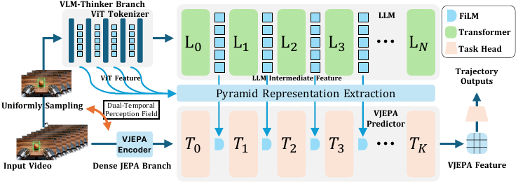
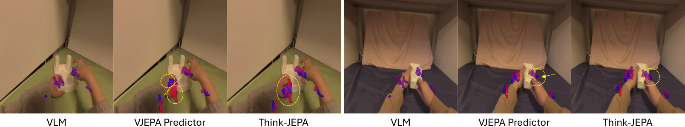

# Title: ThinkJEPA: Empowering Latent World Models with Large Vision-Language Reasoning Model

- ArXiv: 2603.22281
- Authors: Haichao Zhang, Yijiang Li, Shwai He, Tushar Nagarajan, Mingfei Chen, Jianglin Lu, Ang Li, Yun Fu
- Sections: 60
- Estimated tokens: 27.8k

## Contents

- 1 Introduction
- 2 Related Works
  - 2.1 Latent World Models and Predictive Representation Learning
  - 2.2 Vision-Language Models for Multimodal Understanding
  - 2.3 Multimodal Fusion and Language-Guided Prediction
- 3 Methodology
  - 3.1 Problem Definition
    - 3.1.1 Basic Settings
    - 3.1.2 Long-Horizon Latent Forecasting via Recursion
  - 3.2 Dual-Temporal Perception Field Sampling Architecture
    - 3.2.1 Large temporal perception field sampling for the VLM thinker branch.
    - 3.2.2 Dense frame sampling for the JEPA branch.
    - 3.2.3 Why dual-temporal sampling matters.
  - 3.3 JEPA-style latent tokenization and forecasting
    - 3.3.1 Rollout of the JEPA branch
  - 3.4 VLM Thinker: Hierarchical Pyramid Representation Extraction
    - 3.4.1 Complementarity via injecting VLM guidance into JEPA
    - 3.4.2 Hierarchical pyramid representation extraction
    - 3.4.3 Layer-wise guidance injection
    - 3.4.4 Joint prediction for downstream regression
  - 3.5 Implementation Details
- 4 Experiments
  - 4.1 Datasets
  - 4.2 Evaluation Metrics
  - 4.3 Baselines and Variants
  - 4.4 Training and Experimental Settings
  - 4.5 Long-Horizon Rollout Evaluation
  - 4.6 Quantitative Comparison
  - 4.7 Trajectory prediction baselines
  - 4.8 Ablation on VLM Token Sources
  - 4.9 Ablation on VLM Layer Selection
  - 4.10 Recursive Rollout: Trajectory Errors vs Horizon
  - 4.11 Qualitative Results
- 5 Conclusion
- 6 Supplementary Materials
  - 6.1 Prompt + Video to VLM-Conditioned Features
    - Experimental setting.
    - Experimental details.
    - Analysis.
  - 6.2 Temporal Stride Ablation
    - Experimental setting.
    - Experimental details.
    - Analysis.
  - 6.3 Conditioning Mechanism Ablation
    - Experimental setting.
    - Experimental details.
    - Analysis.
  - 6.4 Direct Visual Conditioning and Deepstack-Token Removal
    - Experimental setting.
    - Experimental details.
    - Analysis.
    - Why FiLM as the default conditioning operator.
  - 6.5 Pure Prompt-Only VLM Baseline
    - Experimental setting.
    - Experimental details.
    - Analysis.
    - Implication for the main-paper VLM-only baseline.
- 7 Implementation Details
  - Shared implementation setting.

## Abstract

###### Abstract

Recent progress in latent world models (e.g., V-JEPA2) has shown promising capability in forecasting future world states from video observations. Nevertheless, dense prediction from a short observation window limits temporal context and can bias predictors toward local, low-level extrapolation, making it difficult to capture long-horizon semantics and reducing downstream utility. Vision–language models (VLMs), in contrast, provide strong semantic grounding and general knowledge by reasoning over uniformly sampled frames, but they are not ideal as standalone dense predictors due to compute-driven sparse sampling, a language-output bottleneck that compresses fine-grained interaction states into text-oriented representations, and a data-regime mismatch when adapting to small action-conditioned datasets. We propose a VLM-guided JEPA-style latent world modeling framework that combines dense-frame dynamics modeling with long-horizon semantic guidance via a dual-temporal pathway: a dense JEPA branch for fine-grained motion and interaction cues, and a uniformly sampled VLM _thinker_ branch with a larger temporal stride for knowledge-rich guidance. To transfer the VLM’s progressive reasoning signals effectively, we introduce a hierarchical pyramid representation extraction module that aggregates multi-layer VLM representations into guidance features compatible with latent prediction. Experiments on hand-manipulation trajectory prediction show that our method outperforms both a strong VLM-only baseline and a JEPA-predictor baseline, and yields more robust long-horizon rollout behavior.

## 1 Introduction

World models aim to learn predictive abstractions of the environment that support forecasting, planning, and control. Among them, _latent_ world models are particularly appealing: by predicting in representation space, they avoid generating photorealistic pixels or detailed 3D geometry, which can be computationally expensive and often unnecessary for downstream decision making. This paradigm, exemplified by JEPA-style methods (e.g., V-JEPA2 [4]), promises improved efficiency and encourages the model to emphasize higher-level structure (e.g., dynamics and physical constraints) rather than overfitting to appearance.

Despite strong progress in V-JEPA2 [4] and its variants, existing JEPA-style latent world models still face two key limitations. (1) Limited temporal perspective for prediction. Most approaches rely on a short observation window consisting of densely sampled frames to predict future latents. While dense sampling captures fine-grained motion, it restricts temporal context and can bias the predictor toward local dynamics, missing longer-horizon semantics and event-level cues that are critical for robust forecasting. (2) Weak semantic grounding and general knowledge alignment. The latent space is typically learned via self-supervised visual representation learning (often related to masked reconstruction/prediction objectives), which yields motion-sensitive features but provides limited alignment to open-vocabulary concepts and compositional knowledge. As a result, the predictor may model _how_ things move without understanding _what_ the entities are and _which attributes or relations_ matter, limiting generalization beyond a narrow domain (e.g., a single manipulation dataset).

A natural alternative is to leverage modern vision-language models (VLMs), which excel at high-level video understanding [30, 7] and reasoning due to large-scale pretraining and multimodal alignment. When applied to uniformly sampled frames with a larger temporal stride, VLMs can capture long-range context, recognize entities and their attributes, and draw upon general world knowledge [33] that is often missing from purely visual latent predictors. This complementary capability motivates a promising direction: _using a VLM as a thinker to guide latent world modeling._ However, directly using VLMs as standalone dense predictors is often impractical and can be suboptimal in representation for fine-grained dynamics. Compute-driven sparsity. Video VLMs operate under quadratic attention cost and GPU memory constraints, and thus typically process only a small number of uniformly sampled frames. This design provides long-horizon context but makes it difficult to model high-FPS, fine-grained dynamics crucial for physical interaction and manipulation. Language-output bottleneck. [26] Most VLM pipelines ultimately produce _language_ outputs (e.g., captions, rationales, or action descriptions). To generate text, visual information is progressively transformed through stacked transformer layers toward language-generation objectives and discrete token prediction. This induces an output bottleneck: fine-grained spatial details and continuous interaction states (e.g., contact, precise trajectories, fast motions) are compressed into a language-compatible representation, which is effective for semantic recognition but often inadequate for accurate physical forecasting. Consequently, language-based planning with VLM outputs can be coherent in text yet physically inconsistent. Data regime mismatch. [31] Moreover, deploying VLMs for domain-specific prediction or control often requires adaptation to relatively small, domain-specific datasets, where naïve fine-tuning can hurt general knowledge and semantic capabilities (e.g., catastrophic forgetting [32]).

These observations suggest that VLMs are best used as _semantic and knowledge-guidance providers_, rather than standalone dense predictors. We therefore propose to _integrate a VLM-thinker branch into a JEPA-style latent world model_, combining dense-frame dynamics modeling with long-horizon semantic guidance in a unified framework. Specifically, we retain the dense-frame observation pathway of V-JEPA-style models to preserve fine-grained motion and interaction cues, while introducing a second branch that feeds uniformly sampled frames to a VLM to obtain long-horizon, knowledge-rich guidance. These VLM signals are injected into the JEPA predictor to improve semantic grounding and enhance the generalization of future latent prediction.

A further challenge is _how_ to extract useful guidance from a VLM. Using only the final-layer VLM features is often suboptimal: deeper layers are increasingly shaped toward language-generation objectives, while intermediate layers can contain richer visual reasoning signals with better spatial sensitivity. Motivated by this observation, we introduce a hierarchical pyramid representation extraction module that aggregates multi-depth VLM representations and distills them into guidance features compatible with the JEPA predictor, enabling the predictor to benefit from the VLM’s progressive reasoning process rather than a single terminal representation.

Our contributions are summarized as follows:

- We propose a VLM-guided JEPA-style latent world model that integrates a VLM as a _thinker_ to provide semantic grounding and general knowledge guidance for future latent prediction.
- We design a dual-temporal pathway: (i) a dense-frame JEPA pathway for fine-grained dynamics modeling, and (ii) a uniformly sampled VLM pathway with a larger temporal stride to capture long-horizon context and high-level concepts.
- We introduce a hierarchical pyramid representation extraction module that aggregates multi-layer VLM features to better preserve visual reasoning cues and inject them effectively into the JEPA predictor.
- Extensive experiments demonstrate improved representation quality and stronger downstream performance compared to both a V-JEPA predictor baseline and a state-of-the-art open-source VLM baseline (Qwen3-VL (Thinking)), with particularly large gains on hand-manipulation trajectory prediction.

## 2 Related Works

### 2.1 Latent World Models and Predictive Representation Learning

Latent world models [9, 10, 11] aim to learn predictive abstractions of the environment that support forecasting, planning, and control. By modeling dynamics in a learned representation space, these approaches enable efficient prediction of future states without explicitly generating high-dimensional observations. Recent advances in predictive representation learning further strengthen this paradigm. In particular, JEPA-style approaches [16, 3] learn representations through predictive objectives that encourage models to capture higher-level structure such as motion patterns and physical interactions. Recent systems such as V-JEPA2 demonstrate the scalability of this approach and show promising results for video understanding and world modeling tasks.

Despite these advances, most latent world models are learned solely from visual signals and lack alignment with open-vocabulary semantics or external knowledge, which can limit their ability to incorporate higher-level cues for complex forecasting scenarios.

### 2.2 Vision-Language Models for Multimodal Understanding

Vision-language models (VLMs) have achieved remarkable progress in multimodal representation learning by aligning visual and textual modalities using large-scale image–text data [27, 19, 18, 35, 34]. Early approaches focus on joint representation learning and multimodal understanding tasks such as image captioning and visual question answering. More recent multimodal large language models (MLLMs) extend pretrained language models to process visual tokens, enabling instruction following and multimodal reasoning capabilities [2, 14, 20]. Representative systems such as LLaVA series [22, 17] integrate vision encoders with large language models through projection layers or cross-attention mechanisms.

While these models demonstrate strong semantic reasoning and multimodal understanding capabilities, they are primarily designed for perception and reasoning tasks, and are not optimized for modeling structured physical dynamics.

### 2.3 Multimodal Fusion and Language-Guided Prediction

Language has increasingly been used as a high-level control signal for visual generation and decision-making systems. Text-conditioned generative models enable natural language prompts to guide image synthesis and editing, as demonstrated by diffusion-based approaches such as DALL·E, Imagen, and Diffusion Transformers (DiT) [28, 29, 24]. Language guidance has also been explored in embodied decision-making frameworks, where large language models provide high-level instructions or goals for perception and action [1]. These works highlight the potential of language as a flexible interface for controlling visual and embodied systems. However, leveraging language signals to guide structured physical forecasting remains relatively underexplored. JEPA-style predictors with VLMs. Recent work has explored combining language models with JEPA-style representations, but largely in directions that differ from latent world modeling. For example, VL-JEPA [6] incorporates language signals into a joint-embedding predictive framework, and other approaches use V-JEPA representations as inputs to large language models for video understanding [4]. While effective for multimodal understanding, these designs often shift the primary output interface toward language generation or do not explicitly maintain a latent forecasting interface for downstream world-model tasks. In contrast, ThinkJEPA retains JEPA-style latent forecasting and leverages VLM semantics as _guidance_ by injecting VLM-derived features into the JEPA predictor, preserving dense latent prediction while adding long-horizon semantic cues.

> Figure 1: Overall Architecture of ThinkJEPA. ThinkJEPA couples a dense JEPA branch for fine-grained latent dynamics modeling with a uniformly sampled VLM-_thinker_ branch that provides long-horizon semantic guidance. The VLM guidance—including visual tokens from the ViT visual tokenizer and intermediate hidden states from the language model—is distilled by a _pyramidal representation extraction_ module and injected into the V-JEPA predictor via layer-wise modulation. Concretely, guidance derived from language-model layers $\{L_{0},\dots,L_{N}\}$ is mapped to modulation parameters for predictor layers $\{T_{0},\dots,T_{K}\}$. The predicted future latents are concatenated with past teacher latents to form the full latent sequence, which is then fed into a task head to produce downstream trajectory predictions.

## 3 Methodology

### 3.1 Problem Definition

#### 3.1.1 Basic Settings

Given a video clip $v$ with $N$ frames, our goal is to forecast future latent representations that support downstream tasks; in this work, we focus on 3D hand trajectory prediction. We adopt a JEPA-style latent world modeling paradigm: a visual backbone encodes video frames into latent tokens, and a transformer predictor forecasts future latent tokens from past observations. To improve semantic grounding and long-horizon reasoning, we further condition the predictor on cached features from a video VLM _thinking_ model (we use Qwen3-VL (Thinking) in our implementation), which serves as a _thinker_ providing knowledge-rich guidance.

#### 3.1.2 Long-Horizon Latent Forecasting via Recursion

For long videos where the forecasting horizon exceeds the clip length supported by a single forward pass, we adopt the standard recursive rollout strategy commonly used in JEPA-style predictors. Concretely, the predictor takes the latent tokens forecast in the previous step as input for the next step, enabling iterative rollout of future latents beyond the original window. Although recursion allows arbitrarily long-horizon forecasting, it is susceptible to error accumulation over time. Accordingly, we evaluate both one-shot forecasting and recursive rollouts in our experiments, and analyze robustness under long-horizon prediction.

### 3.2 Dual-Temporal Perception Field Sampling Architecture

A central challenge in combining VLM reasoning with latent world modeling is the mismatch between (i) the _dense temporal signal_ required for accurate dynamics forecasting and (ii) the _long-horizon temporal context_ required for semantic understanding and event-level reasoning. Dense sampling preserves high-frequency motion and interaction cues but typically covers only a short time span, whereas sparse uniform sampling covers a long time span but discards dense motion details. To reconcile this trade-off under practical compute and memory budgets, ThinkJEPA adopts a dual-temporal perception-field design that explicitly assigns these two roles to two complementary branches.

Given an input video clip $v=\{I_{t}\}_{t=1}^{N}$ with $N$ frames, we construct two temporally sampled inputs: (i) a uniformly sampled clip $v_{u}$ for the VLM-_thinker_ branch, providing a large temporal perception field for global context and semantics; and (ii) a densely sampled clip $v_{d}$ for the JEPA branch, providing high-frequency temporal cues for fine-grained latent forecasting. The two branches are synchronized at the sample level (derived from the same $v$) and later fused through layer-wise guidance injection (Sec. [3](#S3)).

#### 3.2.1 Large temporal perception field sampling for the VLM thinker branch.

Video VLMs are powerful for semantic grounding because they can identify entities, attributes, and event-level relationships by leveraging large-scale multimodal pretraining. However, applying transformer-based VLMs to long videos is constrained by quadratic attention cost and GPU memory usage, which typically limits the number of frames that can be processed in a single forward pass. As a result, VLMs commonly adopt _uniform temporal sampling_: a small set of frames is selected to span a long time horizon. Although this choice inevitably discards dense motion details, it maximizes temporal coverage and enables the VLM to reason over long-range context. In ThinkJEPA, we follow this practice and use the VLM branch specifically for long-horizon semantics and knowledge guidance (rather than dense dynamics prediction). We use Qwen3-VL (Thinking) as the VLM thinker and cache its intermediate representations for efficient conditioning of the latent predictor. Formally, we define the uniformly sampled clip

$$
v_{u}\;=\;\{I_{s_{i}}\}_{i=1}^{N_{u}},\qquad s_{i}\;=\;\left\lfloor 1+(i-1)\cdot\frac{N-1}{N_{u}-1}\right\rfloor,(1)
$$

where $N_{u}$ is the number of sampled frames for the VLM thinker branch. This sampling spans the entire clip, providing a large temporal perception field under limited compute.

#### 3.2.2 Dense frame sampling for the JEPA branch.

In contrast, JEPA-style latent world modeling requires dense temporal observations to accurately forecast future latents. Fine-grained dynamics, contact changes, and subtle interactions are often expressed as high-frequency temporal signals that are poorly captured by sparse sampling. Therefore, ThinkJEPA uses a dense sampling strategy for the JEPA branch and restricts it to a shorter observation window, where all frames are retained. Formally, we define an observation window starting at frame index $t_{0}$ and construct the dense clip

$$
v_{d}\;=\;\{I_{t}\}_{t=t_{0}}^{t_{0}+N_{d}-1},(2)
$$

where $N_{d}$ is the number of densely sampled frames. The V-JEPA backbone encodes $v_{d}$ into per-frame patch tokens, producing past latent tokens $F^{\text{past}}$. A JEPA-style predictor then forecasts future latent tokens $\hat{F}^{\text{fut}}$ from $F^{\text{past}}$. These predicted latents serve as the target representation for downstream heads (e.g., trajectory regression), while the VLM branch provides complementary long-horizon semantic guidance to improve grounding and generalization.

#### 3.2.3 Why dual-temporal sampling matters.

The uniform VLM sampling and dense JEPA sampling are not redundant: they target different failure modes. Uniform sampling enables the VLM thinker to access long-range context and semantics that are difficult to infer from a short dense window, whereas dense sampling enables accurate modeling of high-frequency dynamics that sparse VLM inputs cannot represent reliably. By coupling these two perception fields and injecting VLM guidance into the JEPA predictor, ThinkJEPA benefits from both long-horizon semantic context and fine-grained dynamic cues in future latent forecasting.

### 3.3 JEPA-style latent tokenization and forecasting

The visual backbone encodes a densely sampled clip into per-frame spatial tokens $F\in\mathbb{R}^{B\times T\times P\times D}$, where $B$ is the batch size, $T$ is the number of frames in the observation window, $P$ is the number of spatial tokens per frame, and $D$ is the backbone latent dimension. We split the clip into past and future segments and use a masked-token transformer predictor to forecast future latent tokens from past tokens. The predictor operates in an internal dimension $D_{p}$ and projects its outputs back to the backbone latent space of dimension $D$.

#### 3.3.1 Rollout of the JEPA branch

Densely sampled inputs provide strong motion and interaction cues, but they also limit the temporal duration that can be processed in a single forward pass due to compute and memory constraints. For videos whose length exceeds the JEPA observation window, we therefore perform _recursive rollout_ by repeatedly forecasting the next segment and feeding the predicted latents into the subsequent step.

Let $W$ denote the number of frames per JEPA window (e.g., $W=T_{p}+T_{f}$), and let $k$ index rollout steps. At step $k$, the predictor takes past latent tokens $F^{\text{past}}_{k}$ and outputs future latent tokens $\hat{F}^{\text{fut}}_{k}$:

$$
\hat{F}^{\text{fut}}_{k}\;=\;g\!\left(F^{\text{past}}_{k}\right),(3)
$$

where $g(\cdot)$ is the JEPA-style predictor. For the next step, we set the past tokens to be the previously predicted future tokens (or a shifted window that includes them):

$$
F^{\text{past}}_{k+1}\;\leftarrow\;\hat{F}^{\text{fut}}_{k}.(4)
$$

By iterating Eqs. ([3](#S3.E3))–([4](#S3.E4)), we can roll out arbitrarily long-horizon latent forecasts.

While rollout enables long-horizon prediction, it is susceptible to _error accumulation_ and remains limited by the local temporal context within each window. This motivates incorporating VLM-thinker guidance, which provides complementary long-horizon semantic context to stabilize forecasting and improve generalization (Sec. [3.2](#S3.SS2)).

### 3.4 VLM Thinker: Hierarchical Pyramid Representation Extraction

#### 3.4.1 Complementarity via injecting VLM guidance into JEPA

Prior work has explored combining language and JEPA-style representations in different directions. For example, VL-JEPA [6] and approaches that feed V-JEPA features into LLMs for video understanding [4] primarily treat JEPA features as inputs to a language model. While effective for video-to-text understanding, this design shifts the output space toward language generation and does not directly preserve a latent world model interface for downstream prediction. In contrast, our goal is to retain JEPA-style _latent forecasting_ while leveraging VLM semantics as _guidance_. This is non-trivial because the VLM must provide useful long-horizon semantic context without replacing the dense dynamics modeling of the JEPA predictor.

As discussed in Sec. [3.2](#S3.SS2), uniform sampling enables the VLM thinker to access long-range context and event-level semantics under limited compute, whereas dense sampling provides the JEPA branch with high-frequency temporal signals for fine-grained dynamics. We combine these two pathways by injecting VLM guidance into the JEPA predictor in a layer-wise manner. Concretely, given a uniformly sampled clip $v_{u}$ and a densely sampled clip $v_{d}$, the predictor forecasts future latent tokens conditioned on both VLM guidance and an optional text prompt:

$$
\hat{F}^{\text{fut}}\;=\;g\!\left(F^{\text{past}}(v_{d})\,;\,\phi(v_{u}),\,p\right),(5)
$$

where $F^{\text{past}}(v_{d})$ are past latent tokens extracted by the V-JEPA backbone from the dense clip, $\phi(v_{u})$ denotes VLM-derived guidance features from the uniform clip, $p$ denotes the text prompt provided to the VLM thinker, and $g(\cdot;\cdot)$ is the V-JEPA predictor. In practice, the VLM thinker prompt $p$ is generated from a general summarization request, with its content/description populated from the clip metadata (e.g., task name and scene description), which helps the thinker focus on relevant entities and events.

#### 3.4.2 Hierarchical pyramid representation extraction

A key question is _which_ VLM representations are most suitable for guiding latent forecasting. Using only the final-layer VLM features can be suboptimal, since deeper layers are increasingly shaped toward language-generation objectives, while intermediate layers often retain richer visual reasoning cues and better spatial sensitivity. This observation is supported by prior analyses showing that aggregating intermediate LLM representations can outperform using a single terminal layer for downstream tasks (e.g., [33]). Moreover, visual tokenizer outputs may lose fine-grained cues after passing through multimodal fusion and language decoding stages.

Motivated by these findings, we propose a hierarchical pyramid representation extraction module that aggregates multi-depth VLM signals. Specifically, we combine (i) visual tokens from the VLM visual encoder (ViT tokenizer) and (ii) intermediate hidden states from selected language-model layers, forming a depth-wise pyramid over the VLM. These multi-depth features are pooled and projected into the predictor space, yielding guidance features $\phi(v_{u})$ that preserve both low-level visual cues and high-level semantic reasoning traces.

#### 3.4.3 Layer-wise guidance injection

We inject the extracted thinker guidance into the JEPA predictor via feature-wise linear modulation (FiLM) [25]. For predictor block $\ell$, the guidance produces modulation parameters $(\gamma_{\ell},\beta_{\ell})$, and we modulate the block input as

$$
\mathrm{FiLM}(z;\gamma_{\ell},\beta_{\ell})\;=\;\gamma_{\ell}\odot z+\beta_{\ell}.(6)
$$

This yields layer-wise, sample-specific conditioning that injects semantic and knowledge cues into latent forecasting without requiring the VLM to act as a dense predictor.

#### 3.4.4 Joint prediction for downstream regression

For the basic setting, we follow standard V-JEPA downstream protocols [4] by feeding the predicted latent tokens into a task head for trajectory regression. For long-horizon forecasting with recursive rollout (Sec. [3.3.1](#S3.SS3.SSS1)), we concatenate the past latents and the predicted future latents into a full-length token sequence, which is then fed to the temporal regression head to produce the target trajectories.

### 3.5 Implementation Details

Backbone. We use a V-JEPA-L backbone (vit*large_rope) to extract per-frame patch tokens with latent dimension $D{=}1024$. VLM-injected V-JEPA predictor. We implement a V-JEPA predictor operating in an internal dimension $D*{p}{=}384$ and inject VLM-thinker guidance into the predictor via layer-wise FiLM modulation. We condition each predictor block using $(\gamma_{\ell},\beta_{\ell})$ derived from cached Qwen3-VL (Thinking) representations. The cache provides _encoder tokens_ and _autoregressive (AR) tokens_, which are projected to $D_{p}$, pooled, and mapped to per-layer FiLM parameters using lightweight MLP adapters. For hierarchical pyramid extraction, we cache intermediate hidden states from VLM layers $\mathcal{L}=\{0,4,8,12,16,20,24,27\}$. Trajectory head. We use a lightweight temporal trajectory regression head for downstream prediction. The head first aggregates spatial tokens within each frame via attention pooling with a learnable query, producing a per-frame representation. It then applies temporal MLP blocks to model cross-frame dependencies, followed by stride-2 temporal downsampling to align the temporal resolution with the prediction horizon. Finally, a linear projection regresses 3D trajectories with output shape $32\times 52\times 3$.

## 4 Experiments

### 4.1 Datasets

We evaluate ThinkJEPA on two egocentric video benchmarks: EgoDex [13] and EgoExo4D [8]. EgoDex is a large-scale benchmark for egocentric dexterous manipulation, providing egocentric video paired with 3D hand (and finger) pose annotations, which naturally fits our latent forecasting and trajectory regression setting [13]. EgoExo4D is a large-scale multimodal, multiview dataset of skilled human activities with synchronized egocentric and exocentric videos, and extensive annotations including 3D body pose, 3D hand pose, and gaze, enabling evaluation of human motion from egocentric video [8].

### 4.2 Evaluation Metrics

We report standard trajectory errors and latent forecasting diagnostics.

Trajectory metrics. Let $\hat{Y}\in\mathbb{R}^{B\times T_{f}\times J\times 3}$ and $Y\in\mathbb{R}^{B\times T_{f}\times J\times 3}$ denote predicted and ground-truth 3D trajectories over $T_{f}$ future frames and $J$ joints. We compute: ADE [13] (Average Displacement Error): the mean Euclidean distance over all future frames and joints, averaged over the batch. FDE [13] (Final Displacement Error): the mean Euclidean distance on the final future frame, averaged over joints and batch. Accuracy: the fraction of predicted joint positions with Euclidean error below 0.05 m, aggregated over time and joints. Latent forecasting metrics. To complement trajectory-level evaluation (ADE$\downarrow$, FDE$\downarrow$, Acc$\uparrow$), we report representation-level forecasting quality using three distance-based metrics computed between predicted and target latents: FD$\downarrow$ (feature $\ell_{2}$ distance), SL1$\downarrow$ (SmoothL1 distance), and CD$\downarrow$ (cosine distance, defined as $1-\cos(\cdot)$). These metrics provide an interpretable view of latent prediction quality and directly reflect how well the model forecasts V-JEPA features in representation space. Rollout metrics. For recursive rollout evaluation, we report horizon-specific trajectory errors using A@H$\downarrow$ and F@H$\downarrow$, which denote ADE@H and FDE@H at rollout horizon $H\in\{4,8,16,32\}$, respectively.

### 4.3 Baselines and Variants

We compare ThinkJEPA against both strong single-branch baselines and controlled ablations. Since our goal is to endow JEPA-style latent world models with VLM-level semantic reasoning, we include baselines that isolate (i) the contribution of the VLM thinker alone, and (ii) the contribution of the JEPA latent predictor alone, as well as ablations that probe which VLM signals are necessary.

ThinkJEPA. Our full model uses dense-frame V-JEPA tokens for latent forecasting and injects VLM-thinker guidance derived from both _encoder tokens_ and _autoregressive (AR) tokens_ (Sec. [3.4](#S3.SS4)). Qwen3-VL Thinking (VLM-only). To isolate the contribution of the VLM thinker, we disable the dense JEPA input by zeroing the visual latent tokens while keeping the VLM branch unchanged. We then train the same downstream head on the resulting VLM-derived representations. This baseline tests whether long-horizon VLM reasoning alone can support accurate dense trajectory prediction. We use Qwen3-VL (Thinking) [5] as a strong VLM baseline and extract intermediate representations to form the guidance embedding; to avoid reliance on a single terminal layer, we use multi-layer representations consistent with the pyramid design. V-JEPA Predictor (JEPA-only). To isolate the contribution of the JEPA latent world model, we train a V-JEPA predictor and the same downstream head following the standard JEPA-style protocol [4]. This baseline represents a strong dense latent forecasting model without any VLM conditioning.

Ablations: token sources. To assess which VLM token sources contribute to guidance, we evaluate variants that selectively enable: (i) encoder tokens + V-JEPA, (ii) encoder tokens only, (iii) AR tokens + V-JEPA, and (iv) AR tokens only. We also include a variant that removes the thinker-guidance module while keeping the rest of the architecture unchanged (i.e., disabling VLM guidance and reducing to the V-JEPA predictor), which serves as a control without dual-temporal guidance.

Ablations: layer selection. To study the role of hierarchical pyramid extraction, we compare guidance derived from different VLM layer selections (e.g., last-layer vs mid-layer guidance), using the same training/evaluation protocol.

### 4.4 Training and Experimental Settings

Unless otherwise specified, we use the same architecture and hyperparameters as reported in Tab. 1 of the supplementary material. We train with learning rate $10^{-3}$ and predictor learning rate $10^{-4}$, using batch size 14 for training and 6 for evaluation. We set the random seed to 42 and use 2 dataloader workers. Our main forecasting setting uses a past/future split of 32/32 frames.

### 4.5 Long-Horizon Rollout Evaluation

To evaluate long-horizon forecasting behavior beyond a single prediction window, we perform recursive rollout. We use a short-window predictor configuration with $T_{p}{=}4$ and $T_{f}{=}4$ for each step and recursively roll out to horizons $H\in\{4,8,16,32\}$ steps. We report ADE@H, FDE@H, and Accuracy@H computed after the autoregressive rollout, as well as latent-distance metrics (L2/SmoothL1/Cosine) aggregated over the rollout trajectory.

> Table 1: Quantitative comparison across datasets. We report trajectory metrics (ADE/FDE/Acc) and latent forecasting metrics (FD/SL1/CD). FD/SL1/CD denote V-JEPA feature distance, latent SmoothL1, and latent cosine distance, respectively. All values are reported with three decimal places.

| Dataset          | Model             | ADE$\downarrow$ | FDE$\downarrow$ | Acc$\uparrow$ | FD$\downarrow$ | SL1$\downarrow$ | CD$\downarrow$ |
| ---------------- | ----------------- | --------------- | --------------- | ------------- | -------------- | --------------- | -------------- |
| Dataset          | Model             | ADE$\downarrow$ | FDE$\downarrow$ | Acc$\uparrow$ | FD$\downarrow$ | SL1$\downarrow$ | CD$\downarrow$ |
| Dataset          | Model             | ADE$\downarrow$ | FDE$\downarrow$ | Acc$\uparrow$ | FD$\downarrow$ | SL1$\downarrow$ | CD$\downarrow$ |
| Dataset          | Model             | ADE$\downarrow$ | FDE$\downarrow$ | Acc$\uparrow$ | FD$\downarrow$ | SL1$\downarrow$ | CD$\downarrow$ |
| Dataset          | Model             | ADE$\downarrow$ | FDE$\downarrow$ | Acc$\uparrow$ | FD$\downarrow$ | SL1$\downarrow$ | CD$\downarrow$ |
| Dataset          | Model             | ADE$\downarrow$ | FDE$\downarrow$ | Acc$\uparrow$ | FD$\downarrow$ | SL1$\downarrow$ | CD$\downarrow$ |
| Dataset          | Model             | ADE$\downarrow$ | FDE$\downarrow$ | Acc$\uparrow$ | FD$\downarrow$ | SL1$\downarrow$ | CD$\downarrow$ |
| Dataset          | Model             | ADE$\downarrow$ | FDE$\downarrow$ | Acc$\uparrow$ | FD$\downarrow$ | SL1$\downarrow$ | CD$\downarrow$ |
| EgoDex           | Qwen3-VL Thinking | 0.142           | 0.144           | 0.084         | 99.538         | 1.656           | 0.615          |
| EgoDex           | Qwen3-VL Thinking | 0.142           | 0.144           | 0.084         | 99.538         | 1.656           | 0.615          |
| EgoDex           | Qwen3-VL Thinking | 0.142           | 0.144           | 0.084         | 99.538         | 1.656           | 0.615          |
| EgoDex           | Qwen3-VL Thinking | 0.142           | 0.144           | 0.084         | 99.538         | 1.656           | 0.615          |
| EgoDex           | Qwen3-VL Thinking | 0.142           | 0.144           | 0.084         | 99.538         | 1.656           | 0.615          |
| EgoDex           | Qwen3-VL Thinking | 0.142           | 0.144           | 0.084         | 99.538         | 1.656           | 0.615          |
| EgoDex           | Qwen3-VL Thinking | 0.142           | 0.144           | 0.084         | 99.538         | 1.656           | 0.615          |
| EgoDex           | Qwen3-VL Thinking | 0.142           | 0.144           | 0.084         | 99.538         | 1.656           | 0.615          |
| V-JEPA Predictor | 0.071             | 0.066           | 0.471           | 74.223        | 1.252          | 0.317           |                |
| V-JEPA Predictor | 0.071             | 0.066           | 0.471           | 74.223        | 1.252          | 0.317           |                |
| V-JEPA Predictor | 0.071             | 0.066           | 0.471           | 74.223        | 1.252          | 0.317           |                |
| V-JEPA Predictor | 0.071             | 0.066           | 0.471           | 74.223        | 1.252          | 0.317           |                |
| V-JEPA Predictor | 0.071             | 0.066           | 0.471           | 74.223        | 1.252          | 0.317           |                |
| V-JEPA Predictor | 0.071             | 0.066           | 0.471           | 74.223        | 1.252          | 0.317           |                |
| V-JEPA Predictor | 0.071             | 0.066           | 0.471           | 74.223        | 1.252          | 0.317           |                |
| ThinkJEPA        | 0.061             | 0.056           | 0.596           | 74.032        | 1.248          | 0.315           |                |
| ThinkJEPA        | 0.061             | 0.056           | 0.596           | 74.032        | 1.248          | 0.315           |                |
| ThinkJEPA        | 0.061             | 0.056           | 0.596           | 74.032        | 1.248          | 0.315           |                |
| ThinkJEPA        | 0.061             | 0.056           | 0.596           | 74.032        | 1.248          | 0.315           |                |
| ThinkJEPA        | 0.061             | 0.056           | 0.596           | 74.032        | 1.248          | 0.315           |                |
| ThinkJEPA        | 0.061             | 0.056           | 0.596           | 74.032        | 1.248          | 0.315           |                |
| ThinkJEPA        | 0.061             | 0.056           | 0.596           | 74.032        | 1.248          | 0.315           |                |
| EgoExo4D         | Qwen3-VL Thinking | 0.661           | 0.690           | 0.038         | 104.548        | 1.756           | 0.690          |
| EgoExo4D         | Qwen3-VL Thinking | 0.661           | 0.690           | 0.038         | 104.548        | 1.756           | 0.690          |
| EgoExo4D         | Qwen3-VL Thinking | 0.661           | 0.690           | 0.038         | 104.548        | 1.756           | 0.690          |
| EgoExo4D         | Qwen3-VL Thinking | 0.661           | 0.690           | 0.038         | 104.548        | 1.756           | 0.690          |
| EgoExo4D         | Qwen3-VL Thinking | 0.661           | 0.690           | 0.038         | 104.548        | 1.756           | 0.690          |
| EgoExo4D         | Qwen3-VL Thinking | 0.661           | 0.690           | 0.038         | 104.548        | 1.756           | 0.690          |
| EgoExo4D         | Qwen3-VL Thinking | 0.661           | 0.690           | 0.038         | 104.548        | 1.756           | 0.690          |
| EgoExo4D         | Qwen3-VL Thinking | 0.661           | 0.690           | 0.038         | 104.548        | 1.756           | 0.690          |
| V-JEPA Predictor | 0.659             | 0.636           | 0.074           | 89.244        | 1.520          | 0.469           |                |
| V-JEPA Predictor | 0.659             | 0.636           | 0.074           | 89.244        | 1.520          | 0.469           |                |
| V-JEPA Predictor | 0.659             | 0.636           | 0.074           | 89.244        | 1.520          | 0.469           |                |
| V-JEPA Predictor | 0.659             | 0.636           | 0.074           | 89.244        | 1.520          | 0.469           |                |
| V-JEPA Predictor | 0.659             | 0.636           | 0.074           | 89.244        | 1.520          | 0.469           |                |
| V-JEPA Predictor | 0.659             | 0.636           | 0.074           | 89.244        | 1.520          | 0.469           |                |
| V-JEPA Predictor | 0.659             | 0.636           | 0.074           | 89.244        | 1.520          | 0.469           |                |
| ThinkJEPA        | 0.622             | 0.597           | 0.171           | 79.654        | 1.364          | 0.359           |                |
| ThinkJEPA        | 0.622             | 0.597           | 0.171           | 79.654        | 1.364          | 0.359           |                |
| ThinkJEPA        | 0.622             | 0.597           | 0.171           | 79.654        | 1.364          | 0.359           |                |
| ThinkJEPA        | 0.622             | 0.597           | 0.171           | 79.654        | 1.364          | 0.359           |                |
| ThinkJEPA        | 0.622             | 0.597           | 0.171           | 79.654        | 1.364          | 0.359           |                |
| ThinkJEPA        | 0.622             | 0.597           | 0.171           | 79.654        | 1.364          | 0.359           |                |
| ThinkJEPA        | 0.622             | 0.597           | 0.171           | 79.654        | 1.364          | 0.359           |                |

### 4.6 Quantitative Comparison

Tab. [1](#S4.T1) reports main comparison on EgoDex and EgoExo4D datasets. ThinkJEPA consistently outperforms both single-branch baselines in trajectory prediction, achieving substantially lower ADE/FDE and markedly higher Acc. Compared to the V-JEPA Predictor, injecting VLM-thinker guidance improves semantic grounding while preserving dense dynamics cues, leading to a large gain in downstream trajectory accuracy. Compared to Qwen3-VL Thinking, ThinkJEPA avoids relying on sparse, language-oriented representations as a standalone predictor and instead uses the VLM as guidance, yielding a more physically grounded forecast. In addition to trajectory metrics, ThinkJEPA also improves latent forecasting quality (lower FD/SL1/CD), indicating that guidance injection benefits representation prediction rather than only the downstream head. Overall, these results show that ThinkJEPA can surpass both a strong VLM baseline and a strong latent world model baseline by integrating long-horizon VLM reasoning with dense JEPA-style latent forecasting.

> Table 2: Ablation studies. We vary the VLM token sources and the thinker module. Encoder denotes encoder tokens, AR denotes autoregressive tokens, and VJ denotes the V-JEPA predictor; No-Th removes the thinker module. We abbreviate latent metrics as FD (feature distance), SL1 (SmoothL1), and CD (cosine distance). Single seed (42), best-epoch selection by minimum validation ADE.

| Abl.                      | ADE$\downarrow$ | FDE$\downarrow$ | Acc$\uparrow$ | FD$\downarrow$ | SL1$\downarrow$ | CD$\downarrow$ |
| ------------------------- | --------------- | --------------- | ------------- | -------------- | --------------- | -------------- |
| Abl.                      | ADE$\downarrow$ | FDE$\downarrow$ | Acc$\uparrow$ | FD$\downarrow$ | SL1$\downarrow$ | CD$\downarrow$ |
| Abl.                      | ADE$\downarrow$ | FDE$\downarrow$ | Acc$\uparrow$ | FD$\downarrow$ | SL1$\downarrow$ | CD$\downarrow$ |
| Abl.                      | ADE$\downarrow$ | FDE$\downarrow$ | Acc$\uparrow$ | FD$\downarrow$ | SL1$\downarrow$ | CD$\downarrow$ |
| Abl.                      | ADE$\downarrow$ | FDE$\downarrow$ | Acc$\uparrow$ | FD$\downarrow$ | SL1$\downarrow$ | CD$\downarrow$ |
| Abl.                      | ADE$\downarrow$ | FDE$\downarrow$ | Acc$\uparrow$ | FD$\downarrow$ | SL1$\downarrow$ | CD$\downarrow$ |
| Abl.                      | ADE$\downarrow$ | FDE$\downarrow$ | Acc$\uparrow$ | FD$\downarrow$ | SL1$\downarrow$ | CD$\downarrow$ |
| Encoder+V-JEPA predictor  | $0.128$         | $0.129$         | $0.100$       | $78.869$       | $1.340$         | $0.360$        |
| Encoder+V-JEPA predictor  | $0.128$         | $0.129$         | $0.100$       | $78.869$       | $1.340$         | $0.360$        |
| Encoder+V-JEPA predictor  | $0.128$         | $0.129$         | $0.100$       | $78.869$       | $1.340$         | $0.360$        |
| Encoder+V-JEPA predictor  | $0.128$         | $0.129$         | $0.100$       | $78.869$       | $1.340$         | $0.360$        |
| Encoder+V-JEPA predictor  | $0.128$         | $0.129$         | $0.100$       | $78.869$       | $1.340$         | $0.360$        |
| Encoder+V-JEPA predictor  | $0.128$         | $0.129$         | $0.100$       | $78.869$       | $1.340$         | $0.360$        |
| Encoder+V-JEPA predictor  | $0.128$         | $0.129$         | $0.100$       | $78.869$       | $1.340$         | $0.360$        |
| Encoder-only              | $0.143$         | $0.145$         | $0.086$       | $102.910$      | $1.700$         | $0.615$        |
| Encoder-only              | $0.143$         | $0.145$         | $0.086$       | $102.910$      | $1.700$         | $0.615$        |
| Encoder-only              | $0.143$         | $0.145$         | $0.086$       | $102.910$      | $1.700$         | $0.615$        |
| Encoder-only              | $0.143$         | $0.145$         | $0.086$       | $102.910$      | $1.700$         | $0.615$        |
| Encoder-only              | $0.143$         | $0.145$         | $0.086$       | $102.910$      | $1.700$         | $0.615$        |
| Encoder-only              | $0.143$         | $0.145$         | $0.086$       | $102.910$      | $1.700$         | $0.615$        |
| Encoder-only              | $0.143$         | $0.145$         | $0.086$       | $102.910$      | $1.700$         | $0.615$        |
| AR+V-JEPA predictor       | $0.128$         | $0.130$         | $0.098$       | $78.514$       | $1.333$         | $0.356$        |
| AR+V-JEPA predictor       | $0.128$         | $0.130$         | $0.098$       | $78.514$       | $1.333$         | $0.356$        |
| AR+V-JEPA predictor       | $0.128$         | $0.130$         | $0.098$       | $78.514$       | $1.333$         | $0.356$        |
| AR+V-JEPA predictor       | $0.128$         | $0.130$         | $0.098$       | $78.514$       | $1.333$         | $0.356$        |
| AR+V-JEPA predictor       | $0.128$         | $0.130$         | $0.098$       | $78.514$       | $1.333$         | $0.356$        |
| AR+V-JEPA predictor       | $0.128$         | $0.130$         | $0.098$       | $78.514$       | $1.333$         | $0.356$        |
| AR+V-JEPA predictor       | $0.128$         | $0.130$         | $0.098$       | $78.514$       | $1.333$         | $0.356$        |
| AR-only                   | $0.142$         | $0.144$         | $0.086$       | $102.910$      | $1.700$         | $0.615$        |
| AR-only                   | $0.142$         | $0.144$         | $0.086$       | $102.910$      | $1.700$         | $0.615$        |
| AR-only                   | $0.142$         | $0.144$         | $0.086$       | $102.910$      | $1.700$         | $0.615$        |
| AR-only                   | $0.142$         | $0.144$         | $0.086$       | $102.910$      | $1.700$         | $0.615$        |
| AR-only                   | $0.142$         | $0.144$         | $0.086$       | $102.910$      | $1.700$         | $0.615$        |
| AR-only                   | $0.142$         | $0.144$         | $0.086$       | $102.910$      | $1.700$         | $0.615$        |
| AR-only                   | $0.142$         | $0.144$         | $0.086$       | $102.910$      | $1.700$         | $0.615$        |
| No-dual-temporal sampling | $0.128$         | $0.130$         | $0.099$       | $78.862$       | $1.340$         | $0.360$        |
| No-dual-temporal sampling | $0.128$         | $0.130$         | $0.099$       | $78.862$       | $1.340$         | $0.360$        |
| No-dual-temporal sampling | $0.128$         | $0.130$         | $0.099$       | $78.862$       | $1.340$         | $0.360$        |
| No-dual-temporal sampling | $0.128$         | $0.130$         | $0.099$       | $78.862$       | $1.340$         | $0.360$        |
| No-dual-temporal sampling | $0.128$         | $0.130$         | $0.099$       | $78.862$       | $1.340$         | $0.360$        |
| No-dual-temporal sampling | $0.128$         | $0.130$         | $0.099$       | $78.862$       | $1.340$         | $0.360$        |
| No-dual-temporal sampling | $0.128$         | $0.130$         | $0.099$       | $78.862$       | $1.340$         | $0.360$        |
| ThinkJEPA                 | $0.061$         | $0.056$         | $0.596$       | $74.747$       | $1.263$         | $0.324$        |
| ThinkJEPA                 | $0.061$         | $0.056$         | $0.596$       | $74.747$       | $1.263$         | $0.324$        |
| ThinkJEPA                 | $0.061$         | $0.056$         | $0.596$       | $74.747$       | $1.263$         | $0.324$        |
| ThinkJEPA                 | $0.061$         | $0.056$         | $0.596$       | $74.747$       | $1.263$         | $0.324$        |
| ThinkJEPA                 | $0.061$         | $0.056$         | $0.596$       | $74.747$       | $1.263$         | $0.324$        |
| ThinkJEPA                 | $0.061$         | $0.056$         | $0.596$       | $74.747$       | $1.263$         | $0.324$        |
| ThinkJEPA                 | $0.061$         | $0.056$         | $0.596$       | $74.747$       | $1.263$         | $0.324$        |

### 4.7 Trajectory prediction baselines

Following EgoDex, we compare against six trajectory prediction baselines formed by combining two Transformer architectures—decoder-only and encoder-decoder—with three policy representations: Behavior Cloning (BC) [23], Denoising Diffusion Probabilistic Models (DDPM) [12], and Flow Matching (FM) [21]. These baselines implemented from [15] are trained in the EgoDex trajectory prediction benchmark under a 2-second horizon and serve as strong task-specific references for egocentric hand trajectory forecasting.

As shown in Tab. [3](#S4.T3), ThinkJEPA outperforms all trajectory prediction baselines reported in EgoDex in terms of both ADE and FDE. Compared with the strongest task-specific baselines based on Behavior Cloning, ThinkJEPA reduces the average displacement error from 0.0767/0.0774 to 0.0610 and the final displacement error from 0.0818/0.0924 to 0.0560. The improvement over DDPM- and Flow-Matching-based baselines is even larger. These results suggest that VLM-guided latent forecasting provides a stronger trajectory representation than directly predicting trajectories with conventional decoder-only or encoder-decoder policy heads.

> Table 3: Comparison with EgoDex trajectory prediction baselines on EgoDex. We compare ThinkJEPA against the trajectory prediction baselines reported in EgoDex, including decoder-only and encoder-decoder architectures with Behavior Cloning, DDPM, and Flow Matching. ThinkJEPA achieves the best ADE/FDE among all compared methods.

| Group                              | Model                           | ADE$\downarrow$ | FDE$\downarrow$ |
| ---------------------------------- | ------------------------------- | --------------- | --------------- |
| Group                              | Model                           | ADE$\downarrow$ | FDE$\downarrow$ |
| Group                              | Model                           | ADE$\downarrow$ | FDE$\downarrow$ |
| Group                              | Model                           | ADE$\downarrow$ | FDE$\downarrow$ |
| Trajectory Baselines               | Decoder-only + Behavior Cloning | 0.0767          | 0.0818          |
| Trajectory Baselines               | Decoder-only + Behavior Cloning | 0.0767          | 0.0818          |
| Trajectory Baselines               | Decoder-only + Behavior Cloning | 0.0767          | 0.0818          |
| Trajectory Baselines               | Decoder-only + Behavior Cloning | 0.0767          | 0.0818          |
| Decoder-only + DDPM                | 0.1148                          | 0.1238          |                 |
| Decoder-only + DDPM                | 0.1148                          | 0.1238          |                 |
| Decoder-only + DDPM                | 0.1148                          | 0.1238          |                 |
| Decoder-only + Flow Matching       | 0.1527                          | 0.1574          |                 |
| Decoder-only + Flow Matching       | 0.1527                          | 0.1574          |                 |
| Decoder-only + Flow Matching       | 0.1527                          | 0.1574          |                 |
| Encoder-decoder + Behavior Cloning | 0.0774                          | 0.0924          |                 |
| Encoder-decoder + Behavior Cloning | 0.0774                          | 0.0924          |                 |
| Encoder-decoder + Behavior Cloning | 0.0774                          | 0.0924          |                 |
| Encoder-decoder + DDPM             | 0.1272                          | 0.1245          |                 |
| Encoder-decoder + DDPM             | 0.1272                          | 0.1245          |                 |
| Encoder-decoder + DDPM             | 0.1272                          | 0.1245          |                 |
| Encoder-decoder + Flow Matching    | 0.1736                          | 0.1557          |                 |
| Encoder-decoder + Flow Matching    | 0.1736                          | 0.1557          |                 |
| Encoder-decoder + Flow Matching    | 0.1736                          | 0.1557          |                 |
| Latent Forecasting                 | Qwen3-VL Thinking               | 0.1420          | 0.1440          |
| Latent Forecasting                 | Qwen3-VL Thinking               | 0.1420          | 0.1440          |
| Latent Forecasting                 | Qwen3-VL Thinking               | 0.1420          | 0.1440          |
| Latent Forecasting                 | Qwen3-VL Thinking               | 0.1420          | 0.1440          |
| V-JEPA Predictor                   | 0.0710                          | 0.0660          |                 |
| V-JEPA Predictor                   | 0.0710                          | 0.0660          |                 |
| V-JEPA Predictor                   | 0.0710                          | 0.0660          |                 |
| ThinkJEPA                          | 0.0610                          | 0.0560          |                 |
| ThinkJEPA                          | 0.0610                          | 0.0560          |                 |
| ThinkJEPA                          | 0.0610                          | 0.0560          |                 |

### 4.8 Ablation on VLM Token Sources

Tab. [2](#S4.T2) studies the contribution of different VLM token sources. Using only one token set (encoder tokens or AR tokens) provides limited benefit over the V-JEPA Predictor, and using tokens alone (without the dense JEPA branch) reduces to the Qwen3-VL Thinking baseline. In contrast, ThinkJEPA achieves the strongest performance when combining both token sources with the dense JEPA pathway, suggesting that the two token types provide complementary signals for guidance: encoder tokens carry visual content summaries, while AR tokens capture generation-side reasoning traces. Removing the thinker module collapses performance back to the V-JEPA Predictor level, confirming that the gains come from the injected guidance rather than incidental changes in training or evaluation.

> Table 4: VLM layer selection on EgoDex. We compare guidance derived from different VLM layer selections. FD denotes V-JEPA feature distance, SL1 denotes latent SmoothL1, and CD denotes latent cosine distance. Single seed (42), best-epoch selection by minimum validation ADE.

| Variant                | ADE$\downarrow$ | FDE$\downarrow$ | Acc$\uparrow$ | FD$\downarrow$ | SL1$\downarrow$ | CD$\downarrow$ |
| ---------------------- | --------------- | --------------- | ------------- | -------------- | --------------- | -------------- |
| Variant                | ADE$\downarrow$ | FDE$\downarrow$ | Acc$\uparrow$ | FD$\downarrow$ | SL1$\downarrow$ | CD$\downarrow$ |
| Variant                | ADE$\downarrow$ | FDE$\downarrow$ | Acc$\uparrow$ | FD$\downarrow$ | SL1$\downarrow$ | CD$\downarrow$ |
| Variant                | ADE$\downarrow$ | FDE$\downarrow$ | Acc$\uparrow$ | FD$\downarrow$ | SL1$\downarrow$ | CD$\downarrow$ |
| Variant                | ADE$\downarrow$ | FDE$\downarrow$ | Acc$\uparrow$ | FD$\downarrow$ | SL1$\downarrow$ | CD$\downarrow$ |
| Variant                | ADE$\downarrow$ | FDE$\downarrow$ | Acc$\uparrow$ | FD$\downarrow$ | SL1$\downarrow$ | CD$\downarrow$ |
| Variant                | ADE$\downarrow$ | FDE$\downarrow$ | Acc$\uparrow$ | FD$\downarrow$ | SL1$\downarrow$ | CD$\downarrow$ |
| Last-layer             | $0.128$         | $0.130$         | $0.099$       | $78.858$       | $1.340$         | $0.360$        |
| Last-layer             | $0.128$         | $0.130$         | $0.099$       | $78.858$       | $1.340$         | $0.360$        |
| Last-layer             | $0.128$         | $0.130$         | $0.099$       | $78.858$       | $1.340$         | $0.360$        |
| Last-layer             | $0.128$         | $0.130$         | $0.099$       | $78.858$       | $1.340$         | $0.360$        |
| Last-layer             | $0.128$         | $0.130$         | $0.099$       | $78.858$       | $1.340$         | $0.360$        |
| Last-layer             | $0.128$         | $0.130$         | $0.099$       | $78.858$       | $1.340$         | $0.360$        |
| Last-layer             | $0.128$         | $0.130$         | $0.099$       | $78.858$       | $1.340$         | $0.360$        |
| Mid-layer              | $0.128$         | $0.131$         | $0.098$       | $78.517$       | $1.333$         | $0.356$        |
| Mid-layer              | $0.128$         | $0.131$         | $0.098$       | $78.517$       | $1.333$         | $0.356$        |
| Mid-layer              | $0.128$         | $0.131$         | $0.098$       | $78.517$       | $1.333$         | $0.356$        |
| Mid-layer              | $0.128$         | $0.131$         | $0.098$       | $78.517$       | $1.333$         | $0.356$        |
| Mid-layer              | $0.128$         | $0.131$         | $0.098$       | $78.517$       | $1.333$         | $0.356$        |
| Mid-layer              | $0.128$         | $0.131$         | $0.098$       | $78.517$       | $1.333$         | $0.356$        |
| Mid-layer              | $0.128$         | $0.131$         | $0.098$       | $78.517$       | $1.333$         | $0.356$        |
| All layers (ThinkJEPA) | $0.061$         | $0.056$         | $0.596$       | $74.747$       | $1.263$         | $0.324$        |
| All layers (ThinkJEPA) | $0.061$         | $0.056$         | $0.596$       | $74.747$       | $1.263$         | $0.324$        |
| All layers (ThinkJEPA) | $0.061$         | $0.056$         | $0.596$       | $74.747$       | $1.263$         | $0.324$        |
| All layers (ThinkJEPA) | $0.061$         | $0.056$         | $0.596$       | $74.747$       | $1.263$         | $0.324$        |
| All layers (ThinkJEPA) | $0.061$         | $0.056$         | $0.596$       | $74.747$       | $1.263$         | $0.324$        |
| All layers (ThinkJEPA) | $0.061$         | $0.056$         | $0.596$       | $74.747$       | $1.263$         | $0.324$        |
| All layers (ThinkJEPA) | $0.061$         | $0.056$         | $0.596$       | $74.747$       | $1.263$         | $0.324$        |

### 4.9 Ablation on VLM Layer Selection

Tab. [4](#S4.T4) compares guidance derived from different VLM layer selections. We observe a small trade-off: last-layer guidance slightly improves trajectory metrics (ADE/FDE/Accuracy), whereas mid-layer guidance yields better latent forecasting quality (lower feature distance / SmoothL1 / cosine distance). This is consistent with the intuition that deeper layers are increasingly shaped toward language-generation objectives, while intermediate layers can retain richer visual reasoning cues. These results motivate hierarchical (multi-depth) guidance extraction and justify our pyramid design for robust guidance transfer.

### 4.10 Recursive Rollout: Trajectory Errors vs Horizon

We evaluate long-horizon behavior via recursive rollout in Tab. [5](#S4.T5). Qwen3-VL Thinking degrades sharply under rollout, exhibiting large errors at longer horizons, which supports our motivation that VLMs are ill-suited as standalone dense predictors for physically grounded forecasting. The V-JEPA Predictor remains stable but accumulates error gradually as the horizon increases. ThinkJEPA achieves the best performance across all horizons, indicating that VLM-thinker guidance improves long-horizon forecasting while maintaining dense dynamics modeling. Notably, the improvement becomes more pronounced as the rollout horizon increases, suggesting that semantic guidance helps stabilize iterative prediction and mitigate compounding errors.

> Table 5: Recursive rollout on EgoDex: trajectory error vs. horizon. We perform autoregressive rollout for horizons $H\in\{4,8,16,32\}$. A@H and F@H denote ADE@H and FDE@H, respectively; the lower, the better.

| Model             | A@4   | A@8   | A@16  | A@32  | F@4   | F@8   | F@16  | F@32  |
| ----------------- | ----- | ----- | ----- | ----- | ----- | ----- | ----- | ----- |
| Model             | A@4   | A@8   | A@16  | A@32  | F@4   | F@8   | F@16  | F@32  |
| Model             | A@4   | A@8   | A@16  | A@32  | F@4   | F@8   | F@16  | F@32  |
| Model             | A@4   | A@8   | A@16  | A@32  | F@4   | F@8   | F@16  | F@32  |
| Model             | A@4   | A@8   | A@16  | A@32  | F@4   | F@8   | F@16  | F@32  |
| Model             | A@4   | A@8   | A@16  | A@32  | F@4   | F@8   | F@16  | F@32  |
| Model             | A@4   | A@8   | A@16  | A@32  | F@4   | F@8   | F@16  | F@32  |
| Model             | A@4   | A@8   | A@16  | A@32  | F@4   | F@8   | F@16  | F@32  |
| Model             | A@4   | A@8   | A@16  | A@32  | F@4   | F@8   | F@16  | F@32  |
| Qwen3-VL Thinking | 0.140 | 0.819 | 1.375 | 1.026 | 0.143 | 2.850 | 0.286 | 1.092 |
| Qwen3-VL Thinking | 0.140 | 0.819 | 1.375 | 1.026 | 0.143 | 2.850 | 0.286 | 1.092 |
| Qwen3-VL Thinking | 0.140 | 0.819 | 1.375 | 1.026 | 0.143 | 2.850 | 0.286 | 1.092 |
| Qwen3-VL Thinking | 0.140 | 0.819 | 1.375 | 1.026 | 0.143 | 2.850 | 0.286 | 1.092 |
| Qwen3-VL Thinking | 0.140 | 0.819 | 1.375 | 1.026 | 0.143 | 2.850 | 0.286 | 1.092 |
| Qwen3-VL Thinking | 0.140 | 0.819 | 1.375 | 1.026 | 0.143 | 2.850 | 0.286 | 1.092 |
| Qwen3-VL Thinking | 0.140 | 0.819 | 1.375 | 1.026 | 0.143 | 2.850 | 0.286 | 1.092 |
| Qwen3-VL Thinking | 0.140 | 0.819 | 1.375 | 1.026 | 0.143 | 2.850 | 0.286 | 1.092 |
| Qwen3-VL Thinking | 0.140 | 0.819 | 1.375 | 1.026 | 0.143 | 2.850 | 0.286 | 1.092 |
| V-JEPA Predictor  | 0.121 | 0.126 | 0.134 | 0.142 | 0.124 | 0.136 | 0.149 | 0.153 |
| V-JEPA Predictor  | 0.121 | 0.126 | 0.134 | 0.142 | 0.124 | 0.136 | 0.149 | 0.153 |
| V-JEPA Predictor  | 0.121 | 0.126 | 0.134 | 0.142 | 0.124 | 0.136 | 0.149 | 0.153 |
| V-JEPA Predictor  | 0.121 | 0.126 | 0.134 | 0.142 | 0.124 | 0.136 | 0.149 | 0.153 |
| V-JEPA Predictor  | 0.121 | 0.126 | 0.134 | 0.142 | 0.124 | 0.136 | 0.149 | 0.153 |
| V-JEPA Predictor  | 0.121 | 0.126 | 0.134 | 0.142 | 0.124 | 0.136 | 0.149 | 0.153 |
| V-JEPA Predictor  | 0.121 | 0.126 | 0.134 | 0.142 | 0.124 | 0.136 | 0.149 | 0.153 |
| V-JEPA Predictor  | 0.121 | 0.126 | 0.134 | 0.142 | 0.124 | 0.136 | 0.149 | 0.153 |
| V-JEPA Predictor  | 0.121 | 0.126 | 0.134 | 0.142 | 0.124 | 0.136 | 0.149 | 0.153 |
| ThinkJEPA         | 0.071 | 0.078 | 0.092 | 0.111 | 0.073 | 0.090 | 0.118 | 0.136 |
| ThinkJEPA         | 0.071 | 0.078 | 0.092 | 0.111 | 0.073 | 0.090 | 0.118 | 0.136 |
| ThinkJEPA         | 0.071 | 0.078 | 0.092 | 0.111 | 0.073 | 0.090 | 0.118 | 0.136 |
| ThinkJEPA         | 0.071 | 0.078 | 0.092 | 0.111 | 0.073 | 0.090 | 0.118 | 0.136 |
| ThinkJEPA         | 0.071 | 0.078 | 0.092 | 0.111 | 0.073 | 0.090 | 0.118 | 0.136 |
| ThinkJEPA         | 0.071 | 0.078 | 0.092 | 0.111 | 0.073 | 0.090 | 0.118 | 0.136 |
| ThinkJEPA         | 0.071 | 0.078 | 0.092 | 0.111 | 0.073 | 0.090 | 0.118 | 0.136 |
| ThinkJEPA         | 0.071 | 0.078 | 0.092 | 0.111 | 0.073 | 0.090 | 0.118 | 0.136 |
| ThinkJEPA         | 0.071 | 0.078 | 0.092 | 0.111 | 0.073 | 0.090 | 0.118 | 0.136 |

### 4.11 Qualitative Results

As shown in Fig. [2](#S4.F2), we visualize predicted future hand trajectories by decoding the forecasted V-JEPA latents with the downstream task head and overlaying the resulting 3D joints on a reference frame. Overall, ThinkJEPA produces more plausible and accurate trajectories: the final endpoint (deep red) aligns more closely with the hand in the reference frame, and the temporal progression is smoother and more diverse over time. In contrast, as highlighted by the yellow circles, the V-JEPA baseline often exhibits temporally collapsed predictions, where blue points concentrate in a small region, indicating that multiple timesteps and joints are predicted to overlap. In the first example, the VLM-only baseline hallucinates a non-existent left hand, while the V-JEPA baseline yields less accurate joint localization and noisier motion compared to our method.

> Figure 2: Qualitative results. Predicted future hand-manipulation trajectories visualized as heat maps overlaid on the reference frame. Colors indicate temporal progression from blue (earlier) to red (later). Ideally, trajectories transition smoothly from blue to red, indicating coherent motion over time. ThinkJEPA produces smoother trajectories with better temporal consistency and joint alignment.

## 5 Conclusion

We presented ThinkJEPA, a VLM-guided JEPA-style latent world modeling framework that integrates long-horizon semantic reasoning from a vision–language _thinker_ with dense latent dynamics forecasting. ThinkJEPA adopts a dual-temporal perception design—uniform sampling for the VLM thinker and dense sampling for the JEPA branch—and injects pyramid-extracted, multi-depth VLM representations into the JEPA predictor via layer-wise modulation. This complementary integration preserves the latent forecasting interface required by downstream world-model tasks while enriching predictions with knowledge-aware guidance. Extensive experiments on egocentric hand-manipulation trajectory prediction demonstrate that ThinkJEPA improves both representation-level forecasting quality and downstream performance, outperforming a strong VLM baseline (Qwen3-VL (Thinking)) and a V-JEPA predictor baseline, and exhibiting robust long-horizon rollout behavior. Future work includes extending the framework to broader embodied tasks and exploring more scalable guidance mechanisms for longer videos and more diverse interaction scenarios.

## 6 Supplementary Materials

Unless otherwise specified, all experiments in this section follow the same training backbone and data pipeline, and only differ in the conditioning signal or temporal sampling strategy. The supplementary suite consists of five controlled studies. All experiments are conducted on EgoDex using the same cached visual backbone features and the same downstream trajectory prediction protocol, unless otherwise noted.

### 6.1 Prompt + Video to VLM-Conditioned Features

##### Experimental setting.

This study evaluates a prompt-conditioned VLM feature design, where the predictor takes cached visual features as the primary input and uses language-modulated VLM features as external conditioning. The training setup follows the same backbone and downstream trajectory head as the main paper, while changing only the conditioning path.

##### Experimental details.

The input video is first represented by cached ViT-style spatiotemporal features, which serve as the main predictive substrate. In parallel, video frames together with a text prompt are passed through Qwen3-VL (Thinking) to extract VLM conditioning features. The conditioning features include two complementary streams: encoder-side representations and autoregressive generation-side representations. These VLM features are injected into the predictor rather than replacing the visual backbone.

##### Analysis.

As shown in Tab. [6](#S6.T6), prompt-conditioned VLM features provide a competitive design choice. Compared with the full ThinkJEPA model, this variant achieves slightly weaker trajectory prediction (ADE/FDE/Acc: 0.069/0.062/0.495 vs. 0.061/0.056/0.596), but slightly better latent forecasting metrics (FD/SL1/CD: 74.007/1.248/0.315 vs. 74.747/1.263/0.324). These results suggest that prompt-conditioned VLM features are effective for representation guidance, while the full ThinkJEPA design yields a stronger overall downstream trade-off.

> Table 6: Prompt + video to VLM-conditioned features. The predictor uses cached visual features as the main trajectory backbone and VLM-derived features as external conditioning.

| Variant                                    | ADE$\downarrow$ | FDE$\downarrow$ | Acc$\uparrow$ | FD$\downarrow$ | SL1$\downarrow$ | CD$\downarrow$ |
| ------------------------------------------ | --------------- | --------------- | ------------- | -------------- | --------------- | -------------- |
| Variant                                    | ADE$\downarrow$ | FDE$\downarrow$ | Acc$\uparrow$ | FD$\downarrow$ | SL1$\downarrow$ | CD$\downarrow$ |
| Variant                                    | ADE$\downarrow$ | FDE$\downarrow$ | Acc$\uparrow$ | FD$\downarrow$ | SL1$\downarrow$ | CD$\downarrow$ |
| Variant                                    | ADE$\downarrow$ | FDE$\downarrow$ | Acc$\uparrow$ | FD$\downarrow$ | SL1$\downarrow$ | CD$\downarrow$ |
| Variant                                    | ADE$\downarrow$ | FDE$\downarrow$ | Acc$\uparrow$ | FD$\downarrow$ | SL1$\downarrow$ | CD$\downarrow$ |
| Variant                                    | ADE$\downarrow$ | FDE$\downarrow$ | Acc$\uparrow$ | FD$\downarrow$ | SL1$\downarrow$ | CD$\downarrow$ |
| Variant                                    | ADE$\downarrow$ | FDE$\downarrow$ | Acc$\uparrow$ | FD$\downarrow$ | SL1$\downarrow$ | CD$\downarrow$ |
| Prompt + video $\rightarrow$ VLM condition | 0.069           | 0.062           | 0.495         | 74.007         | 1.248           | 0.315          |
| Prompt + video $\rightarrow$ VLM condition | 0.069           | 0.062           | 0.495         | 74.007         | 1.248           | 0.315          |
| Prompt + video $\rightarrow$ VLM condition | 0.069           | 0.062           | 0.495         | 74.007         | 1.248           | 0.315          |
| Prompt + video $\rightarrow$ VLM condition | 0.069           | 0.062           | 0.495         | 74.007         | 1.248           | 0.315          |
| Prompt + video $\rightarrow$ VLM condition | 0.069           | 0.062           | 0.495         | 74.007         | 1.248           | 0.315          |
| Prompt + video $\rightarrow$ VLM condition | 0.069           | 0.062           | 0.495         | 74.007         | 1.248           | 0.315          |
| Prompt + video $\rightarrow$ VLM condition | 0.069           | 0.062           | 0.495         | 74.007         | 1.248           | 0.315          |
| ThinkJEPA                                  | 0.061           | 0.056           | 0.596         | 74.747         | 1.263           | 0.324          |
| ThinkJEPA                                  | 0.061           | 0.056           | 0.596         | 74.747         | 1.263           | 0.324          |
| ThinkJEPA                                  | 0.061           | 0.056           | 0.596         | 74.747         | 1.263           | 0.324          |
| ThinkJEPA                                  | 0.061           | 0.056           | 0.596         | 74.747         | 1.263           | 0.324          |
| ThinkJEPA                                  | 0.061           | 0.056           | 0.596         | 74.747         | 1.263           | 0.324          |
| ThinkJEPA                                  | 0.061           | 0.056           | 0.596         | 74.747         | 1.263           | 0.324          |
| ThinkJEPA                                  | 0.061           | 0.056           | 0.596         | 74.747         | 1.263           | 0.324          |

### 6.2 Temporal Stride Ablation

##### Experimental setting.

This study examines the role of temporal sampling granularity in the dual-temporal design. We compare two temporal strides while keeping the predictor architecture, training budget, and conditioning mechanism fixed.

##### Experimental details.

EgoDex trajectories are first represented as 64 uniformly sampled temporal points over each episode. The prediction protocol uses 32 past points and 32 future points. For stride 1, no temporal decimation is applied, so the predictor observes all 64 sampled points. For stride 2, the temporal sequence is subsampled before the past/future split, resulting in a coarser temporal representation. Since the original sequence is already uniformly sampled to 64 points, stride 1 corresponds to denser temporal coverage, while stride 2 reduces temporal resolution.

##### Analysis.

The results in Tab. [7](#S6.T7) show that denser temporal sampling improves both trajectory prediction and latent forecasting quality. Stride 1 outperforms stride 2 on all reported metrics. Compared with both stride variants, the full ThinkJEPA model further improves downstream trajectory performance, achieving the best ADE/FDE/Acc overall on this split.

> Table 7: Temporal stride ablation. Denser temporal sampling improves trajectory prediction and latent forecasting quality.

| Stride            | ADE$\downarrow$ | FDE$\downarrow$ | Acc$\uparrow$ | FD$\downarrow$ | SL1$\downarrow$ | CD$\downarrow$ |
| ----------------- | --------------- | --------------- | ------------- | -------------- | --------------- | -------------- |
| Stride            | ADE$\downarrow$ | FDE$\downarrow$ | Acc$\uparrow$ | FD$\downarrow$ | SL1$\downarrow$ | CD$\downarrow$ |
| Stride            | ADE$\downarrow$ | FDE$\downarrow$ | Acc$\uparrow$ | FD$\downarrow$ | SL1$\downarrow$ | CD$\downarrow$ |
| Stride            | ADE$\downarrow$ | FDE$\downarrow$ | Acc$\uparrow$ | FD$\downarrow$ | SL1$\downarrow$ | CD$\downarrow$ |
| Stride            | ADE$\downarrow$ | FDE$\downarrow$ | Acc$\uparrow$ | FD$\downarrow$ | SL1$\downarrow$ | CD$\downarrow$ |
| Stride            | ADE$\downarrow$ | FDE$\downarrow$ | Acc$\uparrow$ | FD$\downarrow$ | SL1$\downarrow$ | CD$\downarrow$ |
| Stride            | ADE$\downarrow$ | FDE$\downarrow$ | Acc$\uparrow$ | FD$\downarrow$ | SL1$\downarrow$ | CD$\downarrow$ |
| Temporal stride 1 | 0.071           | 0.064           | 0.471         | 73.920         | 1.246           | 0.314          |
| Temporal stride 1 | 0.071           | 0.064           | 0.471         | 73.920         | 1.246           | 0.314          |
| Temporal stride 1 | 0.071           | 0.064           | 0.471         | 73.920         | 1.246           | 0.314          |
| Temporal stride 1 | 0.071           | 0.064           | 0.471         | 73.920         | 1.246           | 0.314          |
| Temporal stride 1 | 0.071           | 0.064           | 0.471         | 73.920         | 1.246           | 0.314          |
| Temporal stride 1 | 0.071           | 0.064           | 0.471         | 73.920         | 1.246           | 0.314          |
| Temporal stride 1 | 0.071           | 0.064           | 0.471         | 73.920         | 1.246           | 0.314          |
| Temporal stride 2 | 0.073           | 0.071           | 0.458         | 74.266         | 1.247           | 0.317          |
| Temporal stride 2 | 0.073           | 0.071           | 0.458         | 74.266         | 1.247           | 0.317          |
| Temporal stride 2 | 0.073           | 0.071           | 0.458         | 74.266         | 1.247           | 0.317          |
| Temporal stride 2 | 0.073           | 0.071           | 0.458         | 74.266         | 1.247           | 0.317          |
| Temporal stride 2 | 0.073           | 0.071           | 0.458         | 74.266         | 1.247           | 0.317          |
| Temporal stride 2 | 0.073           | 0.071           | 0.458         | 74.266         | 1.247           | 0.317          |
| Temporal stride 2 | 0.073           | 0.071           | 0.458         | 74.266         | 1.247           | 0.317          |

### 6.3 Conditioning Mechanism Ablation

##### Experimental setting.

This study compares three conditioning operators under the same backbone, data split, and training budget. Only the conditioning mechanism is varied.

##### Experimental details.

We compare three ways of injecting VLM guidance into the predictor: (i) FiLM-style affine modulation, (ii) cross-attention conditioning, and (iii) AdaLN-style adaptive normalization. All variants consume the same cached VLM features and the same base visual representation stream, so differences can be attributed to the conditioning operator itself.

##### Analysis.

Tab. [8](#S6.T8) shows that all three conditioning mechanisms are competitive. FiLM provides the strongest latent forecasting quality among the three variants, while cross-attention and AdaLN remain close alternatives. Compared with these controlled variants, the full ThinkJEPA model achieves substantially better trajectory prediction (ADE/FDE/Acc), indicating that the final design used in the paper offers the strongest downstream performance under the current setting.

> Table 8: Conditioning mechanism ablation. We compare FiLM, cross-attention, and AdaLN under the same training setup.

| Conditioning | ADE$\downarrow$ | FDE$\downarrow$ | Acc$\uparrow$ | FD$\downarrow$ | SL1$\downarrow$ | CD$\downarrow$ |
| ------------ | --------------- | --------------- | ------------- | -------------- | --------------- | -------------- |
| Conditioning | ADE$\downarrow$ | FDE$\downarrow$ | Acc$\uparrow$ | FD$\downarrow$ | SL1$\downarrow$ | CD$\downarrow$ |
| Conditioning | ADE$\downarrow$ | FDE$\downarrow$ | Acc$\uparrow$ | FD$\downarrow$ | SL1$\downarrow$ | CD$\downarrow$ |
| Conditioning | ADE$\downarrow$ | FDE$\downarrow$ | Acc$\uparrow$ | FD$\downarrow$ | SL1$\downarrow$ | CD$\downarrow$ |
| Conditioning | ADE$\downarrow$ | FDE$\downarrow$ | Acc$\uparrow$ | FD$\downarrow$ | SL1$\downarrow$ | CD$\downarrow$ |
| Conditioning | ADE$\downarrow$ | FDE$\downarrow$ | Acc$\uparrow$ | FD$\downarrow$ | SL1$\downarrow$ | CD$\downarrow$ |
| Conditioning | ADE$\downarrow$ | FDE$\downarrow$ | Acc$\uparrow$ | FD$\downarrow$ | SL1$\downarrow$ | CD$\downarrow$ |
| FiLM         | 0.0706          | 0.064           | 0.471         | 73.878         | 1.245           | 0.314          |
| FiLM         | 0.0706          | 0.064           | 0.471         | 73.878         | 1.245           | 0.314          |
| FiLM         | 0.0706          | 0.064           | 0.471         | 73.878         | 1.245           | 0.314          |
| FiLM         | 0.0706          | 0.064           | 0.471         | 73.878         | 1.245           | 0.314          |
| FiLM         | 0.0706          | 0.064           | 0.471         | 73.878         | 1.245           | 0.314          |
| FiLM         | 0.0706          | 0.064           | 0.471         | 73.878         | 1.245           | 0.314          |
| FiLM         | 0.0706          | 0.064           | 0.471         | 73.878         | 1.245           | 0.314          |
| Cross-attn   | 0.0707          | 0.066           | 0.475         | 73.965         | 1.247           | 0.315          |
| Cross-attn   | 0.0707          | 0.066           | 0.475         | 73.965         | 1.247           | 0.315          |
| Cross-attn   | 0.0707          | 0.066           | 0.475         | 73.965         | 1.247           | 0.315          |
| Cross-attn   | 0.0707          | 0.066           | 0.475         | 73.965         | 1.247           | 0.315          |
| Cross-attn   | 0.0707          | 0.066           | 0.475         | 73.965         | 1.247           | 0.315          |
| Cross-attn   | 0.0707          | 0.066           | 0.475         | 73.965         | 1.247           | 0.315          |
| Cross-attn   | 0.0707          | 0.066           | 0.475         | 73.965         | 1.247           | 0.315          |
| AdaLN        | 0.0708          | 0.065           | 0.474         | 74.280         | 1.253           | 0.317          |
| AdaLN        | 0.0708          | 0.065           | 0.474         | 74.280         | 1.253           | 0.317          |
| AdaLN        | 0.0708          | 0.065           | 0.474         | 74.280         | 1.253           | 0.317          |
| AdaLN        | 0.0708          | 0.065           | 0.474         | 74.280         | 1.253           | 0.317          |
| AdaLN        | 0.0708          | 0.065           | 0.474         | 74.280         | 1.253           | 0.317          |
| AdaLN        | 0.0708          | 0.065           | 0.474         | 74.280         | 1.253           | 0.317          |
| AdaLN        | 0.0708          | 0.065           | 0.474         | 74.280         | 1.253           | 0.317          |

### 6.4 Direct Visual Conditioning and Deepstack-Token Removal

##### Experimental setting.

This study compares two variants: (i) removing the VLM branch entirely and conditioning only on direct visual features, and (ii) keeping the VLM branch but removing the deepstack/thinking-token contribution. We further compare both variants against the full ThinkJEPA model.

##### Experimental details.

For direct visual conditioning, the predictor removes all VLM conditioning and operates only on visual backbone features. This serves as a controlled visual-only baseline within the same predictor family. For deepstack-token removal, the VLM branch is preserved, but the generation-side thinking/deepstack token contribution is explicitly dropped before conditioning is consumed by the predictor. This removal is implemented using token filtering and hard zeroing, ensuring that the removed tokens do not leak through the conditioning path.

##### Analysis.

The results in Tab. [9](#S6.T9) show that both ablations remain competitive. Dropping deepstack tokens yields slightly stronger latent forecasting quality than direct visual conditioning alone, suggesting that the full VLM branch contributes non-trivial information. However, both variants are weaker than the full ThinkJEPA model in downstream trajectory performance, and ThinkJEPA achieves the best ADE/FDE/Acc overall. This indicates that the complete VLM guidance pathway is most effective when used as part of the full model design.

##### Why FiLM as the default conditioning operator.

Although we compare multiple conditioning operators in the supplementary experiments, we choose FiLM as the default design in ThinkJEPA because our primary goal is to improve _latent feature prediction_, rather than only optimizing the downstream regression head. FiLM performs feature-wise modulation directly in the predictor latent space, allowing the VLM thinker to refine the predicted representation while preserving the JEPA-style latent forecasting interface. Compared with cross-attention, FiLM is lighter-weight and introduces less structural change to the predictor, making it easier to attribute gains to guidance rather than additional token interactions. Compared with normalization-based conditioning such as AdaLN, FiLM provides a more direct channel-wise control over the latent features themselves, which is particularly aligned with our objective of improving representation-level prediction quality. For this reason, we adopt FiLM as the main conditioning operator in the paper, while including other variants as complementary ablations.

> Table 9: Direct visual conditioning vs. deepstack-token removal. Both ablations remain competitive, while ThinkJEPA achieves the strongest downstream trajectory performance.

| Variant                    | ADE$\downarrow$ | FDE$\downarrow$ | Acc$\uparrow$ |
| -------------------------- | --------------- | --------------- | ------------- |
| Variant                    | ADE$\downarrow$ | FDE$\downarrow$ | Acc$\uparrow$ |
| Variant                    | ADE$\downarrow$ | FDE$\downarrow$ | Acc$\uparrow$ |
| Variant                    | ADE$\downarrow$ | FDE$\downarrow$ | Acc$\uparrow$ |
| Direct visual conditioning | 0.071           | 0.066           | 0.475         |
| Direct visual conditioning | 0.071           | 0.066           | 0.475         |
| Direct visual conditioning | 0.071           | 0.066           | 0.475         |
| Direct visual conditioning | 0.071           | 0.066           | 0.475         |
| Drop deepstack tokens      | 0.072           | 0.066           | 0.464         |
| Drop deepstack tokens      | 0.072           | 0.066           | 0.464         |
| Drop deepstack tokens      | 0.072           | 0.066           | 0.464         |
| Drop deepstack tokens      | 0.072           | 0.066           | 0.464         |
| ThinkJEPA                  | 0.061           | 0.056           | 0.596         |
| ThinkJEPA                  | 0.061           | 0.056           | 0.596         |
| ThinkJEPA                  | 0.061           | 0.056           | 0.596         |
| ThinkJEPA                  | 0.061           | 0.056           | 0.596         |

### 6.5 Pure Prompt-Only VLM Baseline

##### Experimental setting.

This study evaluates a pure VLM baseline without any task-specific prediction head. Unlike the VLM-only baseline in the main paper, which uses a trained downstream head on top of VLM-derived features, this study directly prompts the VLM with video and text and asks it to output future 3D trajectories in structured form. Its purpose is to provide a zero-shot reference point for direct prompting without task-specific adaptation.

##### Experimental details.

We use Qwen3-VL (Thinking) as a prompt-only baseline. The model observes only the past segment of the video and is instructed to predict future hand trajectories in world coordinates. It outputs a small set of future waypoints in JSON format, which are then interpolated to the full prediction horizon for evaluation. No trajectory head is trained, making this a zero-shot or prompt-only baseline.

##### Analysis.

As shown in Tab. [10](#S6.T10), the pure prompt-only baseline performs dramatically worse than ThinkJEPA, with ADE/FDE of 10.855/10.927 compared to 0.061/0.056 for our method. This large gap confirms that direct prompting of a general-purpose VLM is insufficient for fine-grained metric-space trajectory prediction. In addition, parsing success is poor in this setting, indicating that structured trajectory generation itself is unstable under pure prompting. We therefore regard this baseline as an intentionally weak but informative reference point, rather than a competitive predictor for this benchmark.

##### Implication for the main-paper VLM-only baseline.

The result in Tab. [10](#S6.T10) also clarifies why the _VLM-only_ baseline in the main paper is implemented with a trained task head rather than direct prompting. A general-purpose VLM that has not been fine-tuned for future trajectory prediction performs very poorly in this setting, even though it possesses strong general semantic reasoning ability. This indicates that zero-shot prompting alone is insufficient for fine-grained metric-space forecasting of hand motion. Therefore, the main-paper _VLM-only_ baseline is intentionally designed as a fairer and stronger comparison: it uses the same task-specific training protocol and downstream prediction head, while removing the JEPA latent forecasting pathway. In this way, the comparison in the main paper isolates the benefit of JEPA-style latent prediction versus VLM-based features under matched supervision and optimization, rather than comparing against an intentionally weak zero-shot prompt baseline.

> Table 10: Pure prompt-only VLM baseline. We directly prompt Qwen3-VL (Thinking) to predict future trajectories from video and text, without any task-specific fine-tuning or trained prediction head. The large performance gap to ThinkJEPA indicates that zero-shot prompting is not sufficient for fine-grained metric-space trajectory forecasting. This study is included as a weak reference point only; the _VLM-only_ baseline in the main paper is a substantially fairer comparison because it is trained with the same task-specific supervision and downstream head.

| Baseline             | ADE$\downarrow$ | FDE$\downarrow$ | Acc$\uparrow$ |
| -------------------- | --------------- | --------------- | ------------- |
| Baseline             | ADE$\downarrow$ | FDE$\downarrow$ | Acc$\uparrow$ |
| Baseline             | ADE$\downarrow$ | FDE$\downarrow$ | Acc$\uparrow$ |
| Baseline             | ADE$\downarrow$ | FDE$\downarrow$ | Acc$\uparrow$ |
| Qwen3-VL prompt-only | 10.855          | 10.927          | 0.000         |
| Qwen3-VL prompt-only | 10.855          | 10.927          | 0.000         |
| Qwen3-VL prompt-only | 10.855          | 10.927          | 0.000         |
| Qwen3-VL prompt-only | 10.855          | 10.927          | 0.000         |
| ThinkJEPA            | 0.061           | 0.056           | 0.596         |
| ThinkJEPA            | 0.061           | 0.056           | 0.596         |
| ThinkJEPA            | 0.061           | 0.056           | 0.596         |
| ThinkJEPA            | 0.061           | 0.056           | 0.596         |

> Table 11: Key architectural hyperparameters and tensor dimensions.

| Hyperparameter                          | Value                                |
| --------------------------------------- | ------------------------------------ |
| Hyperparameter                          | Value                                |
| Input frames ($T$)                      | 64                                   |
| Input frames ($T$)                      | 64                                   |
| Past/Future split ($T_{p}/T_{f}$)       | 32/32                                |
| Past/Future split ($T_{p}/T_{f}$)       | 32/32                                |
| Input resolution                        | $256{\times}256$                     |
| Input resolution                        | $256{\times}256$                     |
| Backbone                                | V-JEPA-L (vit_large_rope)            |
| Backbone                                | V-JEPA-L (vit_large_rope)            |
| Backbone depth / dim                    | 24 / 1024                            |
| Backbone depth / dim                    | 24 / 1024                            |
| Patch embedding                         | Conv3d kernel/stride $(2,16,16)$     |
| Patch embedding                         | Conv3d kernel/stride $(2,16,16)$     |
| Predictor                               | VLM-injected V-JEPA predictor        |
| Predictor                               | VLM-injected V-JEPA predictor        |
| Predictor dim ($D_{p}$)                 | 384                                  |
| Predictor dim ($D_{p}$)                 | 384                                  |
| Predictor depth / heads                 | 12 / 6                               |
| Predictor depth / heads                 | 12 / 6                               |
| RoPE / mask tokens                      | enabled / 2                          |
| RoPE / mask tokens                      | enabled / 2                          |
| VLM thinker                             | Qwen3-VL (Thinking) (cached)         |
| VLM thinker                             | Qwen3-VL (Thinking) (cached)         |
| VLM token dim ($D_{c}$)                 | 2048                                 |
| VLM token dim ($D_{c}$)                 | 2048                                 |
| Cache clips ($N_{c}$)                   | 8                                    |
| Cache clips ($N_{c}$)                   | 8                                    |
| Encoder token length ($L_{\text{enc}}$) | 480                                  |
| Encoder token length ($L_{\text{enc}}$) | 480                                  |
| AR token length ($L_{\text{ar}}$)       | 15                                   |
| AR token length ($L_{\text{ar}}$)       | 15                                   |
| Pyramid layers ($\mathcal{L}$)          | $\{0,4,8,12,16,20,24,27\}$           |
| Pyramid layers ($\mathcal{L}$)          | $\{0,4,8,12,16,20,24,27\}$           |
| Guidance injection                      | layer-wise FiLM                      |
| Guidance injection                      | layer-wise FiLM                      |
| Temporal downsampling                   | AvgPool stride 2 (64$\rightarrow$32) |
| Temporal downsampling                   | AvgPool stride 2 (64$\rightarrow$32) |
| Output shape                            | $32\times 52\times 3$                |
| Output shape                            | $32\times 52\times 3$                |

## 7 Implementation Details

##### Shared implementation setting.

Tab. [11](#S6.T11) summarizes the key architectural hyperparameters and tensor dimensions used throughout the supplementary experiments. Unless otherwise specified, all experiments share the same base configuration: a 64-frame input clip at resolution $256\times 256$, a V-JEPA-L backbone for latent token extraction, and a VLM-injected V-JEPA predictor operating in a latent dimension of $D_{p}=384$. The VLM thinker is instantiated with cached Qwen3-VL (Thinking) features, including both encoder tokens and autoregressive tokens, and multi-depth VLM representations are extracted from the pyramid layer set $\mathcal{L}=\{0,4,8,12,16,20,24,27\}$. Guidance is injected into the predictor via layer-wise FiLM modulation, and the final latent sequence is decoded through temporal downsampling to produce $32\times 52\times 3$ trajectory outputs. This table is provided to clarify the common experimental backbone shared by the controlled ablations in the supplementary material.
