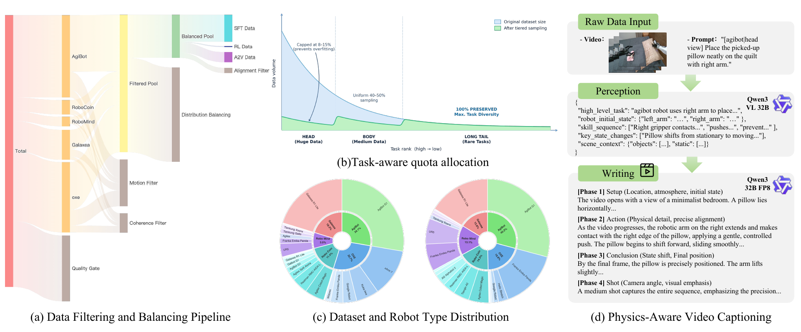
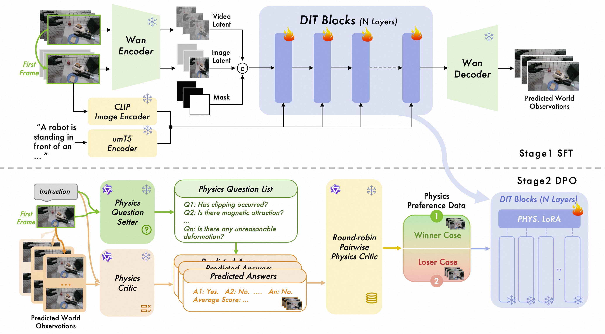

## Appendix

Code Repository: [https://github.com/amap-cvlab/ABot-PhysWorld](https://github.com/amap-cvlab/ABot-PhysWorld)

Contents

- [A. Vision-Action Alignment Verification](#Sx1.SSx1)
- [B. Two-Stage Physics-Aware Captioning Pipeline](#Sx1.SSx2)
- [C. Additional Qualitative Results](#Sx1.SSx3)

- [A. Vision-Action Alignment Verification](#a-vision-action-alignment-verification)
- [B. Two-Stage Physics-Aware Captioning Pipeline](#b-two-stage-physics-aware-captioning-pipeline)
- [C. Additional Qualitative Results](#c-additional-qualitative-results)

### A. Vision-Action Alignment Verification

Misaligned action-video pairs—arising from sensor calibration drift, clock synchronization errors, or coordinate frame inconsistencies—inject spurious correlations that prevent the world model from learning faithful physical dynamics. To detect and remove such samples, we render the calibrated action signals (joint positions, end-effector Cartesian poses, and gripper states) as semi-transparent color-coded action maps and overlay them onto the corresponding video frames (Figure [6](#Sx1.F6)).

The resulting composite images allow both human annotators and an automated VLM-based verifier (Qwen3-VL) to inspect whether the projected action trajectories match the observed robot motion in pixel space. Clips with significant spatial deviation—*e.g*. end-effector paths that diverge from the visually observed gripper trajectory, or gripper open/close states that contradict the visual evidence—are flagged and discarded.

> Figure 6: Vision-action alignment verification. Calibrated action signals are rendered as semi-transparent action maps and overlaid onto video frames. Samples with spatial deviation between projected trajectories and observed robot motion are identified and removed.

### B. Two-Stage Physics-Aware Captioning Pipeline

Section [2.3](#section-2-3) describes our two-stage captioning pipeline. Here we provide additional details and representative examples for each stage.

- [Stage 1: Structured Perception and Attribute Extraction](#stage-1-structured-perception-and-attribute-extraction)
- [Stage 2: Physics-Grounded Narrative Synthesis](#stage-2-physics-grounded-narrative-synthesis)

##### Stage 1: Structured Perception and Attribute Extraction

A vision-language perception module (Qwen3-VL 32B) processes each video clip and extracts structured physical attributes: robot morphology and embodiment type, manipulated objects with their properties (color, shape, material, size), spatial layout and relative object positions, and contact events and state transitions across the manipulation sequence. The output is a structured intermediate representation capturing the “what” and “where” of the scene, which grounds the subsequent writing stage. Representative Stage 1 outputs are shown in Figures [7](#Sx1.F7)–[9](#Sx1.F9).

> Figure 7: Stage 1 captioning example 1. Structured perception output showing extracted physical attributes, object identities, and spatial relations.

> Figure 8: Stage 1 captioning example 2. The perception module identifies robot morphology, object properties, and contact events from the video sequence.

> Figure 9: Stage 1 captioning example 3. Spatial layout parsing and state transition detection across the manipulation trajectory.

##### Stage 2: Physics-Grounded Narrative Synthesis

A language model (Qwen3 32B FP8) takes the Stage 1 structured output and produces a four-phase natural language caption: (1) Scene Setup—initial configuration, robot type, and object arrangement; (2) Action Detail—fine-grained manipulation actions including Cartesian trajectories, gripper operations, and contact dynamics; (3) State Transition—physical state changes such as object displacement, deformation, and containment relations; and (4) Camera Summary—viewpoint, camera motion, and visual framing. By separating perception from writing, the captions remain factually grounded in visual evidence while capturing the causal dynamics needed for world model training. Representative Stage 2 outputs are shown in Figures [10](#Sx1.F10)–[11](#Sx1.F11).

> Figure 10: Stage 2 captioning example 1. The writing module synthesizes a four-phase narrative covering scene setup, action detail, state transition, and camera summary from the structured perception output.

> Figure 11: Stage 2 captioning example 2. Physics-grounded narrative synthesis capturing fine-grained manipulation dynamics and causal state transitions.

### C. Additional Qualitative Results

We present additional qualitative comparisons across three evaluation settings.

- [Zero-Shot Qualitative Comparison on EZSbench](#zero-shot-qualitative-comparison-on-ezsbench)
- [Case Study on Zero-Shot Test Set](#case-study-on-zero-shot-test-set)
- [Action-to-Video Qualitative Comparison](#action-to-video-qualitative-comparison)

##### Zero-Shot Qualitative Comparison on EZSbench

Figure [12](#Sx1.F12) shows zero-shot results on EZSbench. Current video generation baselines struggle with long-horizon manipulation tasks that require complex logical reasoning. Wan-2.5, Veo 3.1, and WoW fail to map object color attributes to the correct target containers, producing placement errors. Sora v2 generates physically implausible contactless grasping, while Giga R0 and Veo 3.1 suffer from “generation collapse” during contact-rich interactions—the end-effector and object geometry become completely distorted. Our method correctly follows the compositional instructions and maintains spatiotemporal coherence throughout the long-horizon grasp-and-place trajectory without such artifacts.

> Figure 12: Zero-shot qualitative comparison on EZSbench. Baseline models exhibit placement errors (Wan-2.5, Veo 3.1, WoW), contactless grasping (Sora v2), and geometric collapse during contact interactions (Giga R0, Veo 3.1). Our method (bottom row) correctly follows compositional instructions and maintains physical plausibility.

##### Case Study on Zero-Shot Test Set

Figure [13](#Sx1.F13) shows generation results on the zero-shot test set across diverse unseen tasks. In the long-horizon “red knife $\rightarrow$ red box, black spoon $\rightarrow$ black box” task, the model correctly binds object attributes to target containers and performs continuous spatial reasoning. For dual-arm towel folding, it handles deformable-object topology changes while generating coordinated bimanual trajectories. The model also produces physically consistent results for articulated-object interaction (closing a door), rigid-body placement (placing blocks), contact-intensive wiping (removing stains), and object relocation (moving an apple). Across these tasks, the generated videos follow the language instructions and maintain physical plausibility over long horizons.

> Figure 13: Case study on zero-shot test set. Our model handles diverse unseen manipulation tasks including multi-object attribute binding, deformable object manipulation with dual-arm coordination, articulated object interaction, rigid body placement, contact-intensive wiping, and object relocation—all with strict physical plausibility and spatiotemporal coherence.

##### Action-to-Video Qualitative Comparison

Figure [14](#Sx1.F14) compares action-conditioned video generation (A2V) results. Our method generates contact-intensive manipulation videos while preserving object geometry and visual integrity throughout the interaction. In contrast, Genie-Envisioner and Enerverse-AC produce noticeable object deformation, contactless grasping artifacts, and target localization errors, resulting in distorted outputs or task failure.

> Figure 14: Action-to-video qualitative comparison. Our method preserves object geometry and visual integrity during contact-intensive manipulation. Baselines (Genie-Envisioner, Enerverse-AC) produce object deformation, contactless grasping, and localization errors.