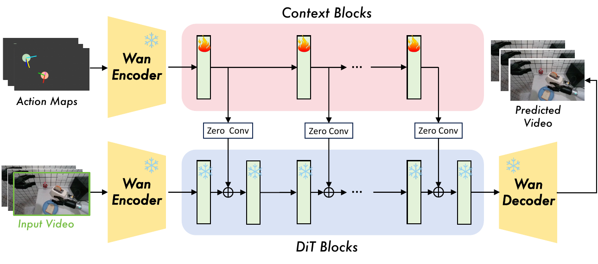
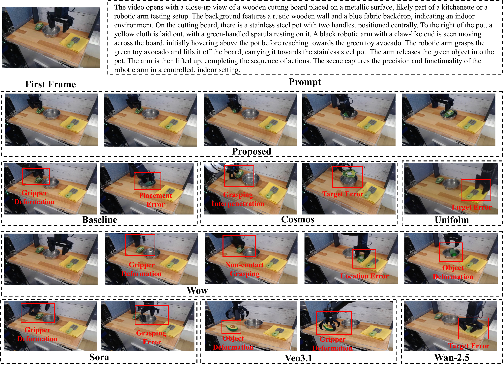
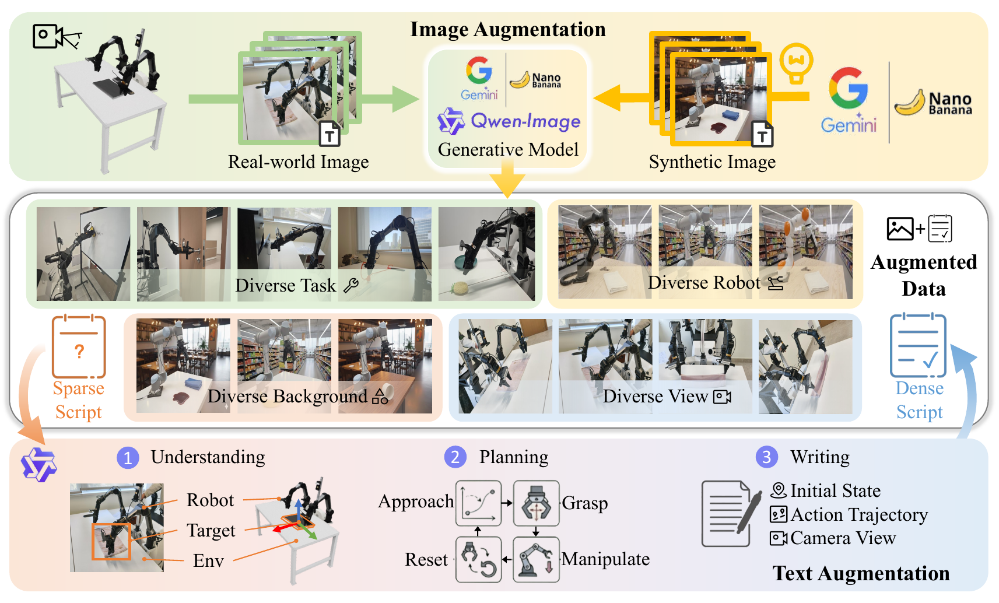

# Title: ABot-PhysWorld: Interactive World Foundation Model for Robotic Manipulation with Physics Alignment

- ArXiv: 2603.23376
- Authors: Yuzhi Chen, Ronghan Chen, Dongjie Huo, Yandan Yang, Dekang Qi, Haoyun Liu, Tong Lin, Shuang Zeng, Junjin Xiao, Xinyuan Chang, Feng Xiong, Xing Wei, Zhiheng Ma, Mu Xu
- Sections: 32
- Estimated tokens: 24.4k
- [摘要（Abstract）](#abstract)
- [1 引言（Introduction）](#1-introduction)
- [2 数据整理（Data Curation）](#2-data-curation)

  - [2.1 具身智能专用数据过滤（Embodied-Specific Data Filtering）](#21-embodied-specific-data-filtering)
  - [2.2 分层分布平衡（Hierarchical Distribution Balancing）](#22-hierarchical-distribution-balancing)
  - [2.3 物理感知视频标注（Physics-Aware Video Captioning）](#23-physics-aware-video-captioning)
- [3 方法（Method）](#3-method)

  - [3.1 具身视频生成主干网络（Embodied Video Generation Backbone）](#31-embodied-video-generation-backbone)
  - [3.2 物理偏好对齐（Physical Preference Alignment）](#32-physical-preference-alignment)
    - [3.2.1 解耦的视觉语言模型判别器（Decoupled VLM Discriminator）](#321-decoupled-vlm-discriminator)
    - [3.2.2 扩散直接偏好优化训练（Diffusion-DPO Training）](#322-diffusion-dpo-training)
  - [3.3 动作条件视频生成（Action-Conditioned Video Generation）](#33-action-conditioned-video-generation)
    - [3.3.1 动作图构建（Action Map Construction）](#331-action-map-construction)
    - [3.3.2 动作注入（Action Injection）](#332-action-injection)
- [4 具身零样本基准测试（Embodied-ZeroShot Benchmark）](#4-embodied-zeroshot-benchmark)

  - [4.1 评估集（Evaluation Set）](#41-evaluation-set)
  - [4.2 评估方法（Evaluation Method）](#42-evaluation-method)
- [5 实验（Experiments）](#5-experiments)
Arena
  - [5.1 实现细节（Implementation Details）](#51-implementation-details)
  - [5.2 评估设置（Evaluation Setup）](#52-evaluation-setup)
  - [5.3 评估结果（Evaluation Results）](#53-evaluation-results)
- [6 结论（Conclusion）](#6-conclusion)
- [7 贡献（Contributions）](#7-contributions)

## 摘要（Abstract）

**基于视频的世界模型（Video-based world models）** 为 **具身模拟（embodied simulation）** 和规划提供了一个强大的范式。然而，由于在通用视觉数据上进行训练，以及采用了忽略物理定律的基于似然的目标函数，最先进的模型常常生成物理上不可信的操控动作——例如物体穿透和反重力运动。我们提出了 **ABot-PhysWorld** ，一个 140 亿参数的 **扩散变换器（Diffusion Transformer, DiT）** 模型，能够生成视觉逼真、物理可信且动作可控的视频。该模型建立在一个经过精心整理的、包含三百万个带有物理感知标注的操控视频片段的数据集之上。它采用了一种新颖的、基于 **直接偏好优化（Direct Preference Optimization, DPO）** 的后训练框架，并配备了解耦的判别器，以抑制非物理行为，同时保持视觉质量。一个并行的上下文模块实现了精确的空间动作注入，用于跨具身控制。为了更好地评估泛化能力，我们引入了 **EZSbench** ，这是首个独立于训练的具身零样本基准测试，它结合了真实和合成的、未见过的机器人-任务-场景组合。它采用解耦的评估协议，分别评估物理真实性和动作对齐度。ABot-PhysWorld 在 PBench 和 EZSbench 上实现了新的最先进性能，在物理可信度和轨迹一致性方面超越了 Veo 3.1 和 Sora v2 Pro。我们将发布 EZSbench 以促进具身视频生成领域的标准化评估。

日期：2026 年 3 月 20 日

通讯作者：xumu.xm@alibaba-inc.com

项目主页：[https://github.com/amap-cvlab/ABot-PhysWorld](https://github.com/amap-cvlab/ABot-PhysWorld)

``

## Introduction

一个具身世界模型需要生成符合现实世界物理规律的未来预测，才能有效用于仿真、规划和策略学习。**视频生成**提供了一个有前景的范式：此类模型可以作为**视觉-语言-动作（Vision-Language-Action, VLA）策略的仿真器** [19, 25, 44, 45]，提供**可解释的轨迹预览**，或者通过预测动作条件动力学直接作为**世界动作模型（World Action Models, WAMs）**[26, 27, 46]——这构成了具身智能的关键基础设施。

[kim2024openvla, intelligence2025pi_, abot-m0, lingbot-vla]，提供可解释的轨迹预览，或者通过预测 **动作条件动力学（action-conditioned dynamics）** 直接作为 **世界动作模型（World Action Models, WAMs）** [ye2026worldactionmodelszeroshot, lingbot-va, kim2026cosmos-policy] 运行——这构成了 **具身智能（embodied intelligence）** 的关键基础设施。

然而，尽管视觉保真度取得了显著进步，但像 Veo 3.1 [google2026veo31] 和 Sora v2 Pro [openai2025sora2] 这样的最先进模型，**经常产生违反基础物理规律的操控序列**，包括物体穿透、无接触运动和非自然形变。这些不仅仅是渲染伪影，更是物理推理的根本性失败，限制了它们在下游机器人应用中的可靠性。

这一差距源于两个核心局限：

（i）在缺乏丰富具身交互信号的通用视觉数据上进行训练，这阻碍了对细粒度物理动力学（如摩擦、碰撞响应和质量分布）的获取；

（ii）在微调过程中依赖标准的 **最大似然目标（maximum likelihood objectives）** ，该目标对所有预测误差一视同仁，无法区分物理上有效与无效的状态转移。

**既缺乏具身体验，又缺乏物理感知的监督，导致了视觉真实感与物理合理性之间的系统性脱节。**

为了解决这个问题，我们提出了 **ABot-PhysWorld** ，这是一个**基于物理基础且动作可控的世界模型**，它基于一个 14B 的 **扩散变换器（Diffusion Transformer, DiT）** [wan2025wan, wan2025open]，并建立在一个**精心设计的数据整理流程**之上。我们整合了来自五个主要开源具身数据集的三百万个真实世界操控片段，通过精选采样、比例优化和物理感知标注来增强数据的多样性和平衡性——从而提升了跨机器人、物体和环境的泛化能力。在此基础上，我们引入了一个受物理启发的、基于 **直接偏好优化（Direct Preference Optimization, DPO）** [qian2025rdpo, wang2025physcorr, cai2025phygdpo, qian2025rdpo] 的**后训练框架**，该框架**采用解耦的判别器来抑制非物理行为**（例如，物体穿透、反重力运动），同时**保持视觉质量并提高动态一致性**。一个并行的上下文块实现了**多通道空间动作注入**，支持**精确的跨具身控制**和**动作对齐的运动合成**。总之，ABot-PhysWorld 能够**生成视觉逼真、物理合理且高度可控的操控序列**——作为**机器人仿真和规划的高保真接口**。

然而，评估此类进展仍然具有挑战性：现有的基准测试通常强调**视觉质量**或**分布内精度**，很少强调**物理一致性**或**零样本泛化**。为了实现更严格和现实的评估，我们提出了 **EZSbench** ，这是第一个 **训练无关的具身零样本基准测试（training-independent Embodied Zero-Shot Benchmark）** ，它结合了涉及未见过的机器人、任务和场景组合的真实与合成场景。与偏向于分布内保真度的现有基准不同，EZSbench 专门设计用于评估三个关键能力：**动作可控性**、**物理一致性**和**零样本泛化**。它采用**解耦的双模型评估协议**，分别对**物理真实感**和**动作对齐**进行评分，从而实现对模型行为的细粒度诊断。我们将公开释放 EZSbench，以促进具身视频生成领域标准化且有意义的进展。

action controllability, physical consistency, and zero-shot generalization.

我们的模型在 PBench 和 EZSbench 上都取得了新的最先进成果，在物理合理性和动作轨迹一致性方面超越了 Veo 3.1 和 Sora v2 Pro。更多细节见第 [5](#section-5) 节。我们的主要贡献是：

- **数据** ：我们设计了一个**原则性的数据整理流程**，通过精选采样和物理感知标注来提高具身视频数据的多样性和平衡性——从而实现对真实世界交互的可扩展且鲁棒的训练。
- **模型** ：我们提出了 **ABot-PhysWorld**，这是一个统一的框架，通过物理感知的 DPO 和并行空间动作注入，联合优化视觉真实感、物理合理性和动作可控性。
- **评估** ：我们引入了 **EZSbench**，这是第一个用于具身视频生成的训练无关零样本基准测试，采用解耦协议来评估分布偏移下的物理保真度和动作对齐。

``

## 2 数据整理（Data Curation）

数据对于高质量的具身世界模型至关重要。遵循 [halevy2009unreasonable]，我们采用数据驱动的方法，通过一个系统性的基础设施来增强数据规模和多样性，以应对复杂的人机交互建模。如图 [1](#figure-1) 所示，我们的数据整理流程包括三个阶段：**具身特定过滤**（§[2.1](#section-2-1)）、**分层分布平衡**（§[2.2](#section-2-2)）和**物理基础字幕生成**（§[2.3](#section-2-3)）。

- [2.1 具身特定数据过滤](#21-embodied-specific-data-filtering) 
- [2.2 分层分布平衡](#22-hierarchical-distribution-balancing)
- [2.3 物理感知视频字幕生成](#23-physics-aware-video-captioning)

``

> 图 1：数据整理流程概览。
>
> （a）展示了从原始聚合（约 300 万个片段）到训练就绪分割（SFT、RL 和 A2V 数据）的多阶段过滤和平衡流程。
>
> （b）任务感知的配额分配：头部任务被限制在 8–15%，主体任务被均匀采样 40–50%，长尾任务被完全保留以最大化任务多样性。
>
> （c）数据集和机器人类型分布：左环显示原始构成，右环显示分层采样后的再平衡结果。
>
> （d）**物理感知视频字幕生成流程**：感知模块（Qwen3-VL 32B）提取结构化的物理属性，随后由写作模块（Qwen3 32B FP8）生成涵盖场景设置、动作细节、状态转移和相机总结的四阶段字幕。

``

### 2.1 具身特定数据过滤（Embodied-Specific Data Filtering）

为了构建一个用于具身操控的物理一致的世界模型，我们通过整合五个公共数据集：AgiBot [bu2025agibot]、RoboCoin [wu2025robocoin]、RoboMind [wu2024robomind]、Galaxea [jiang2025galaxea] 和 OXE [o2024open]，构建了一个**包含近三百万个真实世界视频片段的基础数据集**。

通用领域的整理流程（如 Cosmos-Curate [cosmos2025curate] 和 VideoX-Fun [videox2024fun]）与具身数据不匹配：它们依赖不适用于静态背景操控视频的场景切换检测器，并且优先考虑视觉美学而非物理因果性。为了解决原始聚合引入的噪声，我们应用了一个**视频级质量门控**，随后是三个语义过滤阶段。

**视频级质量门控** 。丢弃分辨率异常或相机移动的片段。序列被限制在 80–500 帧；较长的视频按任务索引在时间上分割成符合训练要求的片段，以确保相关性和效率。

**基于光流的运动过滤** 。我们以 2 FPS 提取灰度帧，并计算 Farnebäck 密集光流 [farneback2003two] 以捕获像素级运动。通过对每帧位移矢量的极坐标幅度进行平均，我们得到一个全局运动学分数，并移除运动接近零或具有非物理振荡的片段。

**基于 CLIP 的时间连贯性** 。为了消除视觉损坏（例如，黑屏、剪切、拼接错误），我们使用基于 CLIP 的嵌入 [radford2021learning] 评估**时间连续性**。每个片段采样八个等距帧，并提取其 768 维特征；丢弃连续帧之间平均余弦相似度较低的样本。

**视觉-动作对齐验证** 。将编码了关节动作、末端执行器位姿和夹爪状态的校准动作图投影到视频帧上。Qwen3-VL 验证视觉运动与控制信号之间的时空对齐，过滤掉因传感器校准或同步错误导致的不匹配。

最终得到的数据集为训练跨多样化具身任务的可泛化、动力学感知的世界模型提供了坚实的基础。

``

### 2.2 分层分布平衡（Hierarchical Distribution Balancing）

最近的研究表明，数据的多样性（而不仅仅是数量）是可扩展世界模型和通用机器人策略的关键 [kang2024how, ye2026worldactionmodelszeroshot]；扩展重复数据通常导致记忆而非分布外泛化。为了解决这个问题，我们设计了一个跨越四个层次的分层动态采样策略：视频、子数据集或机器人类型、任务和宏观数据集。这种方法在平衡数据分布的同时保留了长尾特征。

**层次 1：数据集内多样性保留** 。几个源数据集本身就是较小集合的聚合；例如，OXE [o2024open] 中的小子数据集在应用任何跨数据集操作之前被完全保留，以保留独特的交互模式。

**层次 2：跨机器人再平衡** 。在五个源数据集上操作，这一层次解决了机器人具身类型之间的不平衡问题。代表性不足的机器人类型被赋予更高的权重，以保留罕见的交互模式（例如，非标准运动学或双臂协调），从而增强跨平台泛化并减轻头部类别的主导地位（图 [1](#figure-1)c）。

**层次 3：任务感知的配额分配** 。我们不应用固定的采样阈值，而是根据数据量将任务划分为三个层级，并分配层级特定的策略（图 [1](#figure-1)b）。头部任务（数据量大）被限制在其原始大小的 8–15%，以防止对主导类别的过拟合。主体任务（中等数据量）被均匀采样 40–50%，在保留代表性的同时避免过度冗余。长尾任务（罕见任务）被完全保留以最大化任务多样性。

**层次 4：宏观数据集规模调控** 。最后，在最粗的粒度上，大规模宏观数据集（例如，AgiBot、OXE）通过均匀子采样进行限制，而微观数据集（例如，RoboMind）则通过强制下限保证最小覆盖率。当激活时，一个三轮补充策略分配：（1）跨任务的基准配额，（2）按比例重新分配未使用的配额，以及（3）通过从全局过滤池中随机回退采样来填补剩余缺口，防止单任务过度提取并改善长尾平衡。这个分层框架提高了组合多样性和分布平衡性，为训练通用具身世界模型提供了坚实的基础。

``

### 2.3 物理感知视频字幕生成（Physics-Aware Video Captioning）

使用 **文本到视频（text-to-video, T2V）** 目标训练具身世界模型需要超越表面场景描述的字幕。一个有效的标注必须捕获机器人操控的三个逐步深入的方面：_机器人做什么_（动作语义），_它如何与物理世界交互_（空间和接触精度），以及*为什么观察到该结果*（因果推理）。我们设计了一个多级标注系统来满足这些要求。

**多级动作语义** 。采用以机器人为中心的“为动作标注”理念，我们将每个字幕在四个粒度上结构化：自然语言的宏观任务意图；用于长时程规划的细观动词-名词动作分割；包括笛卡尔轨迹、相对运动和夹爪状态的微观细节；以及描述物理关系（接触、支撑、包含）和任务结果（成功、失败、部分意外）的场景级描述。

**基础空间精度** 。纯模板驱动的标注往往会产生幻觉的空间关系和不精确的抓握描述。为了抑制这些错误，我们引入了三种机制：使用明确正负例进行少样本上下文学习以获取更丰富的物理细节，用于精确抓握类型指定的动态词汇表，以及将描述限制在可观察证据的可见事实基线。

**因果物理建模** 。除了描述发生了什么，世界模型的有效字幕还必须解释为什么会发生。我们明确标注物理因果关系，包括重力导致的掉落、表面形变和力反馈。一个四阶段的叙事结构（场景构建、动作流程、最终状态确认和相机总结）将每个字幕组织成对操控事件的时序连贯描述。

这个标注系统提供了物理基础的语言监督，不仅捕获事件，还捕获其潜在原因，为训练具有因果理解的世界模型提供了语义基础。

``

## 3 方法（Method）

``

> 图 2：两阶段训练流程。阶段 1：在 DiT 上进行监督微调（SFT），根据观察和指令预测未来帧。阶段 2：生成 $N$ 个候选，通过物理检查表评分，并在冻结的 DiT 权重上通过低秩适应（LoRA）应用 DPO。

``

> 表 1：PAI-Bench 机器人领域子集的定量比较。

[3.1 具身视频生成主干网络（Embodied Video Generation Backbone）](#31-embodied-video-generation-backbone)

- [3.2 物理偏好对齐（Physical Preference Alignment）](#32-physical-preference-alignment)
- [3.3 动作条件视频生成（Action-Conditioned Video Generation）](#33-action-conditioned-video-generation)

``

### 3.1 具身视频生成主干网络（Embodied Video Generation Backbone）

生成物理上合理的操作视频需要一个主干网络，它既能捕捉真实世界场景的视觉多样性，又能捕捉机器人-物体交互的细粒度时空动态。为满足此要求，我们在 Wan2.1-I2V-14B [wan2025open] 的基础上构建，并在我们精心整理的具身数据集上对其进行全面微调。

``

### 3.2 物理偏好对齐（Physical Preference Alignment）

虽然 **监督微调（Supervised Fine-Tuning, SFT）** 教会模型复现训练分布，但它平等对待所有样本，无法区分物理上正确的预测与那些包含违规（如物体穿透或反重力运动）的预测。为了明确抑制这些违规行为，我们提出了一个 **后训练偏好对齐（post-training preference alignment）** 流程（图 [2](#figure-2)），该流程将一个 **解耦的视觉语言模型（Vision-Language Model, VLM）判别器** 与 **扩散直接偏好优化（Diffusion-DPO）** 配对。

- [3.2.1 解耦的视觉语言模型判别器（Decoupled VLM Discriminator）](#321-decoupled-vlm-discriminator)
- [3.2.2 扩散直接偏好优化训练（Diffusion-DPO Training）](#322-diffusion-dpo-training)

#### 3.2.1 解耦的视觉语言模型判别器（Decoupled VLM Discriminator）

对于给定的提示 $x$ 和初始状态，我们生成 $N$ 个候选视频变体。使用单个 VLM 评估物理合理性存在 **自我评估幻觉（self-evaluation hallucinations）** 的风险，即生成问题的同一模型也评判答案。为防止这种情况，我们将评估解耦为两个角色。

**通义千问-VL 32B 思考模型（Qwen3-VL 32B Thinking model）** 充当*提议者（proposer）*。它观察第一帧和文本指令，基于一个 **分层评估系统（hierarchical evaluation system）** 动态生成特定任务的物理检查清单。该系统对 **第一层指标（Tier 1 metrics）** （如穿透和反重力等致命违规）应用 **一票否决权（single-vote veto power）** ，并使用 **第二层指标（Tier 2 metrics）** （微观物理保真度和接触动态）来区分合规样本。生成具体问题可防止模糊查询引起的幻觉。例如，给定抓取并放置苹果的指令，提议者会询问夹爪是否穿透苹果、苹果是否穿透袋子，以及是否被牢固抓握而非磁力吸附。提议者还明确构建一个平衡的正负问题组合，以防止评分模型阿谀奉承地预测没有违规。

随后， **Gemini 3 Pro 模型（Gemini 3 Pro model）** [gemini3_2025] 充当*评分者（scorer）*。它使用明确的 **思维链（Chain-of-Thought）** 推理，包括全局扫描、标记可疑帧和回溯确认，来根据生成的检查清单评估 $N$ 个变体。为了在 $\mathcal{O}(N)$ 复杂度内高效解决分数平局并分离出最优样本（$y_{w}$）和最差样本（$y_{l}$），我们采用基于多轮锦标赛的采样策略：首先进行淘汰赛选出最优样本，随后进行败者组轮次以确定最差样本。这种两阶段机制避免了全排列比较，并产生具有明显区分度的 **直接偏好优化（Direct Preference Optimization, DPO）** [rafailov2023direct] 训练三元组 $(x,y_{w},y_{l})$。

#### 3.2.2 扩散直接偏好优化训练（Diffusion-DPO Training）

给定由解耦判别器产生的判别性三元组 $(c,v_{w},v_{l})$，其中 $c$ 是条件，$v_{w}$ 是符合物理规律的视频，$v_{l}$ 是违反物理规律的视频，我们采用 **扩散直接偏好优化（Diffusion-DPO）** 框架在潜在空间中直接微调视频扩散模型。对于视频潜在表示 $z$，我们在时间步 $t\sim\mathcal{U}(0,T)$ 注入高斯噪声 $\epsilon\sim\mathcal{N}(0,I)$ 以获得 $z_{t}$。模型 $\epsilon_{\theta}$ 的单步去噪均方误差为 $L(\theta,z)=\|\epsilon_{\theta}(z_{t},t,c)-\epsilon\|_{2}^{2}$。令 $L_{\theta}(\cdot)$ 和 $L_{ref}(\cdot)$ 分别表示策略模型 $\pi_{\theta}$ 和参考模型 $\pi_{ref}$（SFT 基线）的去噪误差，物理偏好对齐损失为：

$$
\mathcal{L}_{DPO}=-\mathbb{E}_{z,\epsilon,t}\Bigg[\log\sigma\Bigg(-\frac{\beta}{2}\Big[\underbrace{(L_{\theta}(z_{w})-L_{\theta}(z_{l}))}_{\text{策略差异（Policy Diff.）}} -\underbrace{(L_{ref}(z_{w})-L_{ref}(z_{l}))}_{\text{参考差异（Ref.\ Diff.）}}\Big]\Bigg)\Bigg],(1)
$$

其中 $\beta$ 控制分布散度，$z_{w},z_{l}$ 是 $v_{w},v_{l}$ 的潜在表示。该目标在每个时间步主动减少 $z_{w}$ 的预测误差，同时增加 $z_{l}$ 的预测误差。

标准 DPO 需要维护两个完整的计算图（$\pi_{\theta}$ 和 $\pi_{ref}$），这会导致 14B **扩散变换器（Diffusion Transformer, DiT）** 出现内存不足错误。为解决此问题，我们冻结 DiT 主干网络，并向 **自注意力（self-attention）** （查询、键、值、输出）和 **前馈层（feed-forward layers）** 注入 **低秩自适应（Low-Rank Adaptation, LoRA）** [hu2021lora] 模块，秩为 64，这样参考模型损失 $L_{ref}$ 可以通过临时禁用 LoRA 权重（零额外内存）来计算。

``

### 3.3 动作条件视频生成（Action-Conditioned Video Generation）

除了文本条件预测，用于具身智能的 **世界模型（world model）** 必须支持可控生成：给定当前观察和未来动作序列，它应生成物理上合理且忠实遵循指令轨迹的视频。直接将低维机器人指令（_例如_，末端执行器位姿）注入高维视觉流程会产生 **语义鸿沟（semantic gap）** 。为弥合此鸿沟，我们将离散动作命令转换为空间结构化的 **动作图（action maps）** ，并通过 **并行上下文块（parallel context blocks）** 注入，以保留主干网络的预训练物理知识。

- [3.3.1 动作图构建（Action Map Construction）](#331-action-map-construction)
- [3.3.2 动作注入（Action Injection）](#332-action-injection)

#### 3.3.1 动作图构建（Action Map Construction）

输入动作是一个 7 维向量 $\boldsymbol{a}\in\mathbb{R}^{7}$（3D 位置、3D 朝向、夹爪开度），对于双臂系统扩展到 14 维。使用相机内参和外参，我们将 3D 位置 $(x,y,z)$ 投影到 2D 中心 $(u,v)$。朝向被编码为相应旋转矩阵的三个主轴，投影到图像平面并渲染为彩色箭头，其长度编码深度。夹爪状态被映射到 $(u,v)$ 处的圆形掩码，其不透明度线性表示开度。对于双臂机器人，我们通过红色和蓝色通道区分左臂和右臂，从而生成多通道动作图。

#### 3.3.2 动作注入（Action Injection）

现有的动作注入方法要么使用 **自适应层归一化（Adaptive Layer Normalization, AdaLN）** [dit] 处理 MLP 编码的动作 [cosmos, zhu2025irasim]，这会阻碍跨具身泛化；要么将动作图直接与噪声潜在表示拼接进行全微调 [evac, liao2025genie, team2025gigaworld]，导致预训练物理先验的 **灾难性遗忘（catastrophic forgetting）** 。

``

> 图 4：动作条件视频生成模型的架构。我们选择性地复制 DiT 块作为并行上下文块来处理动作图，并将其输出残差融合到主 DiT 中。

为解决这些挑战，如图 [4](#figure-4) 所示，我们从主 DiT [wan2025wan] 中克隆选择性块，形成一组并行上下文块来处理动作图 [vace]。每个上下文块的输出通过 **零初始化卷积层（zero-initialized convolution layers）** 投影，并残差添加到对应的主 DiT 块：

$$
\mathbf{x}_{i}={\mathrm{DiT}}_{i}(\mathbf{x}_{i-1})+\alpha\cdot W_{\mathrm{zero}}^{(i)}\mathbf{h}_{i},(2)
$$

其中 $\mathbf{h}_{i}$ 是第 $i$ 个上下文块的输出，$W_{\mathrm{zero}}$ 是零初始化卷积层，$\alpha$ 是控制尺度。遵循 VACE，我们选择性地实例化上下文块，仅复制每第五个 DiT 块。由于零初始化确保上下文分支在训练开始时不贡献任何信号，主干网络权重不受干扰，从而保留预训练的物理先验，同时逐步学习动作可控性。

``

> 表 2：在 EZSbench 上的定量比较。

| 模型  | AQ | BC | IQ | MS | OC | SC | I2VB | I2VS | 质量分数      | 领域分数     | 平均分 |
| ----- | -- | -- | -- | -- | -- | -- | ---- | ---- | ------------- | ------------ | ------ |
| Model | AQ | BC | IQ | MS | OC | SC | I2VB | I2VS | Quality Score | Domain Score | Avg.   |
| Model | AQ | BC | IQ | MS | OC | SC | I2VB | I2VS | Quality Score | Domain Score | Avg.   |
| Model | AQ | BC | IQ | MS | OC | SC | I2VB | I2VS | Quality Score | Domain Score | Avg.   |
| Model | AQ | BC | IQ | MS | OC | SC | I2VB | I2VS | Quality Score | Domain Score | Avg.   |
| Model | AQ | BC | IQ | MS | OC | SC | I2VB | I2VS | Quality Score | Domain Score | Avg.   |
| Model | AQ | BC | IQ | MS | OC | SC | I2VB | I2VS | Quality Score | Domain Score | Avg.   |
| Model | AQ | BC | IQ | MS | OC | SC | I2VB | I2VS | Quality Score | Domain Score | Avg.   |
| Model | AQ | BC | IQ | MS | OC | SC | I2VB | I2VS | Quality Score | Domain Score | Avg.   |
| Model | AQ | BC | IQ | MS | OC | SC | I2VB | I2VS | Quality Score | Domain Score | Avg.   |
| Model | AQ | BC | IQ | MS | OC | SC | I2VB | I2VS | Quality Score | Domain Score | Avg.   |
| Model | AQ | BC | IQ | MS | OC | SC | I2VB | I2VS | Quality Score | Domain Score | Avg.   |

``

> 图 5：在 PAI-Bench 上的定性比较。

``

[4.1 评估集（Evaluation Set）](#41-evaluation-set)

- [4.2 评估方法（Evaluation Method）](#42-evaluation-method)

``

### 4.1 评估集（Evaluation Set）

我们通过双分支策略构建初始观测池。第一个分支使用 **文本到图像模型（text-to-image model）** Nano Banana [google2025nanobanana] 生成合成图像，该过程由四个正交变量控制：机器人、场景、任务和视角。该方法通过改变手臂结构、背景以及任务复杂度（从基础的拾取放置到长时程操作）来针对形态、场景和任务泛化。第二个分支使用一个大型 **视觉语言模型（Visual Language Model, VLM）** 对真实世界机械臂图像进行可控场景编辑，动态改变背景，同时保留前景的物理交互。

为了生成可靠的物理描述，我们提出了一个 **物理启发式密集描述合成框架（physics-heuristic dense description synthesis framework）** ，该框架通过视觉锚定、运动学合规的动作模拟和叙事合成逐步推进，生成整合了初始状态、动作轨迹和最终状态的文本。每张初始图像与其密集描述配对，形成一个核心基准样本。

``

### 4.2 评估方法（Evaluation Method）

评估物理一致性的一个关键挑战在于，由单一模型同时充当问题生成器和答案评判者会引入 **自评估偏差（self-evaluation bias）** 。为解决此问题，我们提出了一种 **解耦的双模型评估范式（decoupled dual-model evaluation paradigm）** 。 **Qwen3-VL-32B-Thinking** 模型根据初始状态和文本指令动态生成物理检查清单问题。它采用 **系统 2 推理协议（System 2 reasoning protocol）** 进行场景解码和动作解析，并参考涵盖空间、时间和物理维度九个标准的少量示例。我们强制要求检查清单中 30–50% 的问题为 **否定性问题（negative questions）** （例如询问一个红苹果是否为绿色），以防止通过随机猜测进行 **捷径学习（shortcut learning）** 。为消除自评估偏差， **Qwen2.5-VL-72B-Instruct** 模型作为回答端。视频 $v$ 的最终物理得分 $S_{v}$ 衡量 **视觉问答（Visual Question Answering, VQA）** 预测与检查清单 **真实值（ground truth, GT）** 之间的一致性：$S_{v}=\frac{1}{|Q_{v}|}\sum_{q\in Q_{v}}\mathbb{I}(\text{VQA}(v,q)=\text{GT}(q))$，其中 $Q_{v}$ 是生成的检查清单，$\mathbb{I}(\cdot)$ 是指示函数。

``

## 5 实验（Experiments）

- [5.1 实现细节（Implementation Details）](#51-implementation-details)
- [5.2 评估设置（Evaluation Setup）](#52-evaluation-setup)
- [5.3 评估结果（Evaluation Results）](#53-evaluation-results)

``

### 5.1 实现细节（Implementation Details）

我们在一个包含 128 块英伟达 H20 GPU 的集群上进行所有实验。训练流程包含三个阶段： **TI2V** 基础训练、 **DPO** 和 **A2V** 训练。对于 TI2V，我们使用 **Wan2.1-I2V-14B-480P** ，输入裁剪为 $480\times 832$ 并均匀采样 81 帧。训练 6,000 步，全局批次大小为 128，学习率为 1e-5。对于 DPO，我们对 **扩散变换器（Diffusion Transformer）** 应用基于 **LoRA** 的微调，将秩为 64 的适配器（缩放因子 64）插入到自注意力和前馈层（q, k, v, o, ffn.0, ffn.2）中。使用 AdamW 优化器，学习率 lr=1e-6，预热 10 步。为加强扩散模型中的偏好信号，我们设置 $\beta=5000$。训练采用 BF16 混合精度、梯度检查点、每设备批次大小 1，并在 100 个周期内运行 500 步/周期。对于 A2V，我们在微调后的 TI2V 模型上采用 **VACE** 框架。我们复制特定的扩散变换器层（0, 5, 10, 15, 20, 25, 30, 35）作为可训练的上下文分支，同时保持主干网络冻结。数据通过可变步长的随机帧采样进行增强。训练使用批次大小 16，学习率 5e-5，共 20,000 步。

``

### 5.2 评估设置（Evaluation Setup）

**文本条件生成（Text-Conditioned Generation）** 。我们使用 **PAI-Bench** [zhou2025paibench] 及其 **PBench** 数据集评估物理合理性和视觉质量，重点关注机器人领域子集，该子集包含来自 BridgeData V2 [walke2023bridgedata]、AgiBot 和 Open X-Embodiment 的 174 个复杂操作视频。我们采用 **MLLM-as-Judge** 方法，使用 **Qwen2.5-VL-72B-Instruct** [bai2025qwen25vl] 进行二元视觉问答。 **领域得分（Domain Score）** 评估三个维度共 886 个问题的准确性：空间（36.3%，几何与接触）、时间（28.6%，因果逻辑）和物理（34.1%，物体属性与状态变化）。我们还使用 PAI-Bench 的多维质量指标：主体[caron2021emerging]/背景[fu2023dreamsim]一致性、整体一致性[wang2024internvid]、美学质量（LAION 美学头）、成像质量[ke2021musiq]、运动平滑度以及 i2v 主体/背景一致性。对于零样本评估，我们使用 **EZSbench** 和第 [5](#section-5) 节中的解耦双模型协议。

**动作条件生成（Action-Conditioned Generation）** 。我们通过从 **动作到视频数据集（action-to-video dataset）** 中均匀采样 200 个实例来构建动作条件评估集，每个实例包含一个初始帧和一个结构化动作序列（末端执行器位姿和夹爪状态）。视觉对齐通过逐帧使用 **PSNR** 评估像素精度，使用 **SSIM** 评估局部纹理保真度。对于轨迹精度，我们使用 **nDTW** ：一个微调的 **YOLO** 检测器定位每帧中的夹爪，提取的轨迹通过 nDTW 与真实值进行比较。

**基线模型（Baselines）** 。对于文本条件生成，我们与 **Cosmos-Predict 2.5-2B** [agarwal2025cosmos]、 **GigaWorld-0** [gigaai2025gigaworld]、 **UnifoLM-WMA-0** [unitree2025unifolm]、 **WoW-wan 14B** [chi2025wow]、 **Veo 3.1** [google2026veo31]、 **Sora v2 Pro** [openai2025sora2] 和 **Wan 2.5** [alibaba2025wan25] 进行比较。对于动作条件生成，我们与 **Enerverse-AC** [evac] 和 **Gen-Sim** [liao2025genie] 进行比较。

``

> Table 3: Quantitative results on action-conditioned generation.

| Model        | PSNR  | SSIM   | Traj. Consis. |
| ------------ | ----- | ------ | ------------- |
| Model        | PSNR  | SSIM   | Traj. Consis. |
| Model        | PSNR  | SSIM   | Traj. Consis. |
| Model        | PSNR  | SSIM   | Traj. Consis. |
| Enerverse-AC | 20.42 | 0.7542 | 0.8157        |
| Enerverse-AC | 20.42 | 0.7542 | 0.8157        |
| Enerverse-AC | 20.42 | 0.7542 | 0.8157        |
| Enerverse-AC | 20.42 | 0.7542 | 0.8157        |
| Gen-Sim      | 18.05 | 0.7413 | 0.6195        |
| Gen-Sim      | 18.05 | 0.7413 | 0.6195        |
| Gen-Sim      | 18.05 | 0.7413 | 0.6195        |
| Gen-Sim      | 18.05 | 0.7413 | 0.6195        |
| Ours         | 21.09 | 0.8126 | 0.8522        |
| Ours         | 21.09 | 0.8126 | 0.8522        |
| Ours         | 21.09 | 0.8126 | 0.8522        |
| Ours         | 21.09 | 0.8126 | 0.8522        |

``

### 5.3 评估结果（Evaluation Results）

**PBench 评估** 。如表 [1](#table-1) 所示，我们经过 **DPO** 增强的模型取得了最高的平均得分（0.8491），并创造了新的 **最先进（state-of-the-art）** 领域得分（0.9306），优于基础模型（0.8785）和所有基线模型。现有方法在视觉质量和物理保真度之间存在权衡： **Veo 3.1** 和 **Sora v2 Pro** 由于强大的成像和美学能力获得了高质量得分（0.7740, 0.7679），但在领域得分上落后（0.8350, 0.7626），更偏向感知而非物理。我们的模型在保持有竞争力的视觉质量（质量得分：0.7676）的同时，强制执行物理约束，证明了与物理定律的对齐不会牺牲感知质量。基础模型也表现出强大的时空稳定性（I2VB：0.9777；MS：0.9916）。

**EZSbench 评估** 。在分布外的 **EZSbench** 上（表 [2](#table-2)），我们的模型取得了最高的总体平均得分（0.8030），在质量得分（0.7694）和领域得分（0.8366）上都建立了最先进的结果。这证实了物理保真度的改进能够泛化到训练分布之外。

**定性分析** 。图 [5](#figure-5) 展示了定性的 PBench 比较。基线模型在复杂交互中违反了物理定律： **Sora v2 Pro** 和 **Veo 3.1** 在密集接触时显示出夹爪或物体变形； **GigaWorld-0** 和 **Cosmos** 表现出抓取穿透； **WoW** 产生非接触抓取和几何变形； **UnifoLM** 和 **Wan 2.5** 错误识别目标（例如，将抹布识别为铲子）。我们的方法正确识别目标，保持时空连贯性，并避免变形和穿透。

**动作条件生成结果** 。如表 [3](#table-3) 所示，我们的方法在视觉质量和动作保真度上都优于基线模型。我们的方法始终以显著优势超越基线模型。

``

## 6 结论（Conclusion）

我们提出了 **ABot-PhysWorld** ，这是一个基于 14B 扩散变换器的、物理基础且动作可控的具身操作世界模型。它整合了精选数据、通过 **Diffusion-DPO** 实现的物理对齐以及空间动作注入，以减少物理违规，同时保持对不同具身的控制。我们还提出了 **EZSbench** ，这是一个具有分布外场景和解耦评估协议的零样本基准。实验结果表明，与 **Veo 3.1** 和 **Sora v2 Pro** 相比，我们的模型在物理保真度和轨迹一致性方面达到了最先进水平。该模型目前依赖于固定视角数据，且缺乏闭环评估。未来的工作将探索多视图生成和真实世界部署。

``

## 7 贡献（Contributions）

作者在以下领域的贡献如下：

- **数据整理（Data Curation）** ：Yuzhi Chen, Ronghan Chen, Dongjie Huo, Haoyun Liu, Yandan Yang, Dekang Qi, Tong Lin, Shuang Zeng, Junjin Xiao
- **模型训练（Model Training）** ：Yuzhi Chen, Ronghan Chen
- **评估（Evaluation）** ：Yuzhi Chen, Ronghan Chen, Dongjie Huo
- **写作（Writing）** ：Yuzhi Chen, Yandan Yang, Ronghan Chen, Dongjie Huo, Dekang Qi
- **项目领导（Project Lead）** ：Xinyuan Chang, Feng Xiong
- **导师（Advisor）** ：Zhiheng Ma, Xing Wei, Mu Xu^†

``

> 图 3：EZSbench 的构建流程。顶部：双源图像增强——分支 1 通过文本到图像（Nano Banana）生成合成初始观察，通过改变机器人形态、场景、任务和视点；分支 2 对真实世界图像应用 VLM 引导的背景编辑，同时保留前景交互。下方：三阶段密集描述合成——视觉锚定（visual anchoring）确定场景布局和物体坐标，动作模拟（action simulation）推断符合运动学的轨迹及微观物理交互，叙事合成（narrative synthesis）生成整合了初始状态、轨迹和最终状态的纪录片风格字幕。