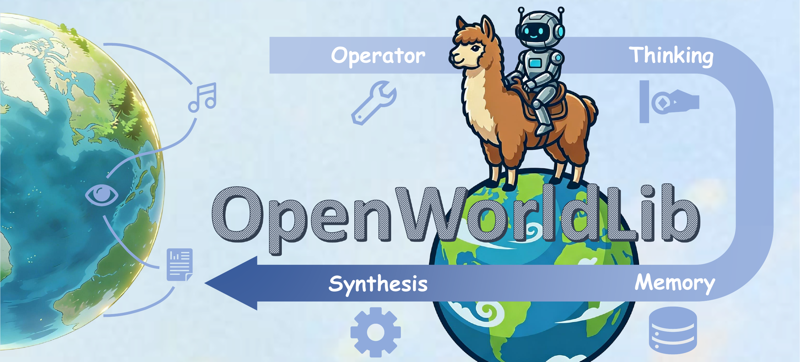
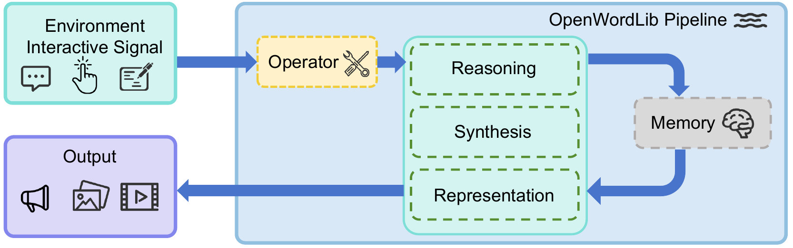
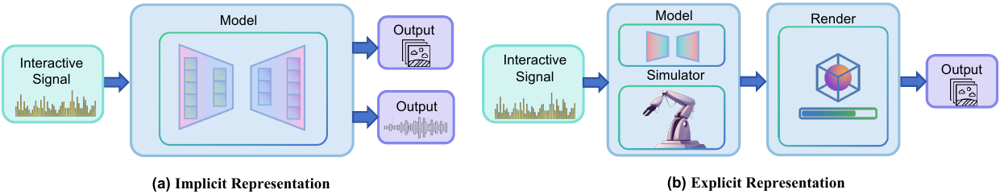

# Title: OpenWorldLib: A Unified Codebase and Definition of Advanced World Models

- ArXiv: 2604.04707
- Authors: DataFlow Team, Bohan Zeng, Daili Hua, Kaixin Zhu, Yifan Dai, Bozhou Li, Yuran Wang, Chengzhuo Tong, Yifan Yang, Mingkun Chang, Jianbin Zhao, Zhou Liu, Hao Liang, Xiaochen Ma, Ruichuan An, Junbo Niu, Zimo Meng, Tianyi Bai, Meiyi Qiang, Huanyao Zhang, Zhiyou Xiao, Tianyu Guo, Qinhan Yu, Runhao Zhao, Zhengpin Li, Xinyi Huang, Yisheng Pan, Yiwen Tang, Yang Shi, Yue Ding, Xinlong Chen, Hongcheng Gao, Minglei Shi, Jialong Wu, Zekun Wang, Yuanxing Zhang, Xintao Wang, Pengfei Wan, Yiren Song, Mike Zheng Shou, Wentao Zhang
- Sections: 29
- Estimated tokens: 22.6k

- [Title: OpenWorldLib: A Unified Codebase and Definition of Advanced World Models](#title-openworldlib-a-unified-codebase-and-definition-of-advanced-world-models)
  - [摘要（Abstract）](#摘要abstract)
  - [2 背景与相关工作（Background and Related Works）](#2-背景与相关工作background-and-related-works)
    - [2.1 世界模型相关任务（World Model Related Tasks）](#21-世界模型相关任务world-model-related-tasks)
        - [交互式视频生成（Interactivate Video Generation）](#交互式视频生成interactivate-video-generation)
        - [多模态推理（Multimodal Reasoning）](#多模态推理multimodal-reasoning)
        - [视觉-语言-动作（Vision-Language-Action）](#视觉-语言-动作vision-language-action)
    - [2.2 3D 与模拟器在世界模型中的作用（The Role of 3D and Simulators in World Models）](#22-3d-与模拟器在世界模型中的作用the-role-of-3d-and-simulators-in-world-models)
    - [2.3 不被视为世界模型的方法（Methods Not Considered World Models）](#23-不被视为世界模型的方法methods-not-considered-world-models)
  - [3 OpenWorldLib Framework Design](#3--openworldlib-framework-design)
    - [3.1 操作器（Operator）](#31-操作器operator)
    - [3.2 合成模块（Synthesis Module）](#32-合成模块synthesis-module)
      - [3.2.1 视觉合成（Visual Synthesis）](#321-视觉合成visual-synthesis)
      - [3.2.2 音频合成（Audio Synthesis）](#322-音频合成audio-synthesis)
      - [3.2.3 其他信号合成（Other Signal Synthesis）](#323-其他信号合成other-signal-synthesis)
    - [3.3 推理模块（Reasoning Module）](#33-推理模块reasoning-module)
    - [3.4 表示模块（Representation Module）](#34-表示模块representation-module)
    - [3.5 记忆模块（Memory Module）](#35-记忆模块memory-module)
    - [3.6 流水线（Pipeline）](#36-流水线pipeline)
  - [4 讨论（Discussion）](#4-讨论discussion)
    - [5.1 实验设置（Experimental Setting）](#51-实验设置experimental-setting)
    - [5.2 实验结果（Experimental Results）](#52-实验结果experimental-results)
      - [5.2.1 交互式视频生成（Interactive Video Generation）。](#521-交互式视频生成interactive-video-generation)
      - [5.2.2 多模态推理（Multimodal Reasoning）。](#522-多模态推理multimodal-reasoning)
      - [5.2.3 3D 生成（3D Generation）。](#523-3d-生成3d-generation)
      - [5.2.4 视觉-语言-动作生成（Vision-Language-Action Generation）。](#524-视觉-语言-动作生成vision-language-action-generation)
  - [6 结论（Conclusion）](#6-结论conclusion)

## 摘要（Abstract）

**世界模型（World Models）** 作为人工智能领域一个有前景的研究方向，已获得广泛关注，但仍缺乏清晰统一的定义。本文介绍了 **OpenWorldLib** ，一个用于 **高级世界模型（Advanced World Models）** 的全面且标准化的推理框架。借鉴世界模型的发展历程，我们提出了一个清晰的定义： **世界模型是一个以感知为中心，具备交互和长期记忆能力，用于理解和预测复杂世界的模型或框架** 。我们进一步系统地分类了世界模型的核心能力。基于此定义，OpenWorldLib 将不同任务的模型整合到一个统一的框架中，实现了高效复用与协同推理。最后，我们对世界模型研究的潜在未来方向提出了进一步的思考与分析。

[*] 同等贡献 \contribution[†] 项目负责人 \contribution[‡] 通讯作者 \checkdata[ 通讯 ] \checkdata[ 源代码 ] [https://github.com/OpenDCAI/OpenWorldLib](https://github.com/OpenDCAI/OpenWorldLib) \checkdata[ 文档 ] [https://wcny4qa9krto.feishu.cn/wiki/XtPJwf5XQipP7RkeVv0ckyWlnNd](https://wcny4qa9krto.feishu.cn/wiki/XtPJwf5XQipP7RkeVv0ckyWlnNd)

> 图 1：我们的 OpenWorldLib 概览。我们的 OpenWorldLib 为现有的世界模型相关任务建立了一个统一框架，涵盖对物理世界输入的感知、理解、记忆和生成。

## Introduction

随着 **大型语言模型（Large Language Models, LLMs）** 和 **智能体（Agents）** 的逐步发展 [[7], [119], [99], [166], [86], [106], [124], [66], [107], [77], [37], [21], [36], [102], [101], [9], [35], [25], [75], [80], [8], [4]]，模型迫切需要从虚拟世界应用转向现实世界应用。因此， **世界模型（World Models）** 开始进入聚光灯下，研究人员越来越关注大型模型在物理世界中（而非虚拟环境中）运行的能力。

世界模型的概念最初由 [[40]] 提出，后来的工作如 [[42], [12], [5]] 开始将视频生成和 3D 生成等 **下一帧预测（Next-frame-predict）** 任务视为世界建模的形式。随着该领域的发展，后续研究探索了世界模型的应用，众多综述 [[167], [46], [26], [131], [58], [82], [146], [70], [91], [32], [88], [145], [120], [30], [11], [47], [148]] 和观点 [[59], [139], [10], [137], [152]] 论文提供了总结和分析。然而，尽管有这些努力，世界模型的定义和范围仍然多样，尚未建立起广泛接受的共识。

为了提供世界模型的标准定义，最好从其核心目标入手： **持续从现实世界学习并与之交互的能力** 。相应地，我们将世界模型定义为一个 **以从感知中构建内部表征为中心，具备动作条件模拟和长期记忆能力，用于理解和预测复杂世界动态的模型或框架** 。正如 [[152]] 所指出的，世界模型并不绑定于任何特定任务或特定架构，而是代表了一个模型或框架应努力达到的能力水平，具体而言，即 **感知、交互和记忆复杂世界的能力** 。

本文主要定义了哪些任务属于世界模型应具备的能力范畴，以及哪些任务常被误认为是世界模型应实现的目标。此外，由于世界模型需要多样化的能力，需要一种更系统的方法来调用它们。为此，我们构建了 **OpenWorldLib** ，一个统一的世界模型推理框架，将交互式视频生成、3D 生成、多模态推理和视觉-语言-动作（Vision-Language-Action, VLA）等任务的调用标准化在一个框架下。

本文的主要贡献如下：

- **贡献 1.** 我们提供了世界模型的标准定义，明确了哪些任务应被视为世界模型能力的一部分。
- **贡献 2.** 我们提出了 OpenWorldLib，一个统一的世界模型推理框架，以帮助构建和标准化该领域的研究。
- **贡献 3.** 我们对世界模型的未来发展提供了进一步的分析和讨论。

## 2 背景与相关工作（Background and Related Works）

世界模型 [[40], [41]] 通常由三个核心条件概率分布定义：

$$
\text{状态转移模型：}\quad p(s_{t+1}\mid s_{t},a_{t}) \\ 
\text{观测模型：}\quad p(o_{t}\mid s_{t}) \\
\text{奖励模型：}\quad r_{t}\sim p(r_{t}\mid s_{t},a_{t})
$$

- 其中 $s_{t}$ 表示 **潜在状态（latent state）** ，它本质上结合了记忆存储以管理复杂任务的长期依赖关系；
- $a_{t}$ 表示时间步 $t$ 的 **动作（action）** ，从一个已扩展至涵盖多样化操作和任务特定输出（如生成和操控）的动作空间中抽取；
- $o_{t}$ 是 **感知观测（perceptual observation）** （例如视觉、音频或本体感觉）；
- $r_{t}$ 是通过动作与环境交互获得的 **奖励（reward）** 。

尽管这些公式被广泛使用，但许多任务在形式上满足此类条件概率分布，却并未真正服务于世界模型的核心目的。这些任务常与世界模型研究混淆或被松散地标记为世界模型研究。因此，在本节中，我们借鉴先前工作中提出的定义以及本文倡导的视角，以清晰界定哪些任务属于真正世界模型研究的范畴，哪些不属于。

- [2.1 世界模型相关任务](#21-世界模型相关任务)
- [2.2 3D 与模拟器在世界模型中的作用](#22-3d-与模拟器在世界模型中的作用)
- [2.3 不被视为世界模型的方法](#23-不被视为世界模型的方法)

### 2.1 世界模型相关任务（World Model Related Tasks）

- [交互式视频生成（Interactivate Video Generation）](#interactivate-video-generation)
- [多模态推理（Multimodal Reasoning）](#multimodal-reasoning)
- [视觉-语言-动作（Vision-Language-Action）](#vision-language-action)

##### 交互式视频生成（Interactivate Video Generation）

**下一帧预测（Next-frame prediction）** 被世界模型研究者广泛认为是最受认可的范式 [[40]]，这使得交互式视频生成成为该领域研究的主要焦点。早期方法主要依赖基于回归的模型 [[40], [42], [134], [93]] 来预测后续帧。最近，该领域已转向利用 **扩散模型（Diffusion models）** [[44], [48]] 以实现更高质量的交互式视频生成，而统一的多模态方法 [[135], [136], [23], [61], [129]] 进一步提升了生成保真度和可控性。随着扩散模型推理速度的加快，游戏视频生成 [[65], [111], [138]] 和相机控制视频生成 [[6], [92]] 已成为一个特别突出的兴趣领域。此外，视频预测范式已成功集成到 **视觉-语言-动作（Vision-Language-Action, VLA）模型** [[13], [53], [117]] 和自动驾驶系统 [[153], [45], [104]] 中。通过结合下一帧预测估计，这些模型在其预测能力上实现了显著增强的稳定性和鲁棒性。然而，尽管交互式视频生成仍是当前世界模型研究的基石，但需要注意的是，下一帧预测并非唯一的实现范式。考虑到世界模型的最终目标是促进复杂环境内的长期交互，探索替代或互补的表征范式同样至关重要 [[137]]。

##### 多模态推理（Multimodal Reasoning）

世界模型的一个关键能力在于其对复杂物理世界的深刻理解；因此，多模态推理是反映世界模型能力的关键。与世界模型密切相关的多模态推理任务不仅包括 **空间推理（spatial reasoning）** [[94], [64], [133], [17], [105], [108], [142], [33], [24]] 和 **全向推理（omni reasoning）** [[140], [141], [132], [50], [19], [163], [109], [165], [84], [3], [18], [27]]，还包括 **时序推理（temporal reasoning）** [[98], [100], [14], [72], [73]] 和 **因果推理（causal reasoning）** [[56], [31]]。最近，除了传统的显式推理方法外，利用 **潜在推理（latent reasoning）** [[5], [126]] 来分析现实世界中的复杂动态已成为一个突出的研究热点。通过摆脱大型语言模型（LLMs）传统的以文本为中心的预训练范式，潜在推理机制使模型能够更高效地摄取和处理现实世界固有的复杂、高维和连续信息。

##### 视觉-语言-动作（Vision-Language-Action）

世界模型的最终目标是使智能体能够与物理世界交互，而 **具身设备（embodied devices）** 是与复杂环境交互的主要代表。因此， **视觉-语言-动作（Vision-Language-Action, VLA）** 已成为世界模型必须支持的关键能力。在机械臂操控领域，最近的研究主要遵循两条轨迹：利用 **多模态大型语言模型（Multimodal Large Language Models, MLLMs）** 直接预测动作 [[13], [53], [117], [113], [154], [83], [5], [16], [34]]，或将动作预测与视频生成相结合 [[2], [114], [67], [20], [130], [95]]，以通过未来帧预测来促进动作规划。此外，这种 VLA 范式正被广泛应用于更复杂的具身场景，包括具有高度复杂且难以控制动态的移动机器人 [[49], [62]]，以及在更广阔环境中运行的自动驾驶系统 [[155], [45], [104], [168], [60], [127], [159], [69], [158]]，从而提升了模型在现实世界中的闭环交互能力。

### 2.2 3D 与模拟器在世界模型中的作用（The Role of 3D and Simulators in World Models）

除了依赖直接可观测感知的任务外，世界模型的一个关键部分涉及处理虚拟环境。为了确保物理空间在长期交互期间保持一致，研究人员通常使用 **模拟器（simulators）** 让模型以结构化的方式学习。虽然交互式视频生成创建了对未来的视觉猜测，但 **3D 表征（3D representations）** 提供了一个可验证的环境，其中可以严格遵守物理规则 [[63], [89], [160], [68], [118], [122], [85], [150], [143], [151]]。

在此背景下， **3D 生成与重建（3D generation and reconstruction）** 对于保持稳定的世界状态至关重要。最近的工作如 VGGT [[123]]、InfiniteVGGT [[147]] 和 OmniVGGT [[103]] 使用基于视觉几何的变换器（visual geometry grounded transformers）将图像输入与真实几何结构联系起来。为了处理来自现实世界的连续数据，一些模型现在维持持久的 3D 状态 [[125]] 或利用混合记忆进行长上下文重建 [[156]]，确保即使智能体移动，环境也能保持不变。此外，度量 3D 重建 [[55]]、深度估计 [[81]] 和大视角合成 [[54]] 中的新方法使世界模型能够从任何相机角度恢复精确的物理空间。通过学习置换等变的视觉几何 [[128]]，这些模型可以在不同类型的物理设置中更好地工作。

此外，模拟器充当了世界模型的“沙盒”，帮助它们从抽象思维转向真实的物理行动。为了使这些模拟器能够实时工作，快速的场景生成是必要的。例如，FlashWorld [[71]] 和混元系列 [[115], [144], [162], [52]] 可以在极短时间内创建高质量的 3D 场景或资产，为世界模型提供一个即时测试其想法的场所。最近的研究也探索了 **强化学习（reinforcement learning）** 在这些 3D 生成过程中的潜力 [[112]]。通过使用这些显式的 3D 表征和模拟工具，世界模型可以超越仅仅预测像素，真正理解现实世界的物理规则。

### 2.3 不被视为世界模型的方法（Methods Not Considered World Models）

除了世界模型相关任务外，某些应用并未真正反映世界模型的能力，但它们经常出现在类似的讨论中。基于上述公式化定义以及我们对世界模型的具体定义，本节阐明了哪些任务不属于此类。

这种误解的一个突出例子是 **文本到视频生成（text-to-video generation）** 。当 Sora 发布时，许多人将其标记为“世界模拟器”。然而，[[167]] 认为 Sora 并不构成一个完整的世界模拟器。虽然下一帧预测常与世界模型相关联，但我们的定义强调， **关键不在于输出格式，而在于模型是否利用多模态输入来分析和识别环境** 。下一帧预测只是一种格式。真正重要的是模型是否准确理解复杂的物理规则并与世界交互。文本到视频生成缺乏这种复杂的感知输入。尽管生成视频展示了对物理的一些理解，但它仍处于世界模型核心任务之外。

类似地，一些任务，例如代码生成或网络搜索 [[22], [29]]，借用了世界模型的长期交互结构用于其他领域。然而，这些任务通常缺乏多模态输入，并且不涉及对物理世界的理解。虽然将这种结构应用于新领域提供了有趣的机会，但这些任务并不符合真正世界模型的标准。

即使是实际上涉及多模态 [[28]] 和长期交互的应用，例如 **虚拟形象视频生成（avatar video generation）** [[51], [149], [38]]，也不一定符合定义。这些任务主要侧重于娱乐。由于它们与探索或理解复杂物理世界关系不大，因此不代表世界模型的主要关注点。

> 图 2：我们的 OpenWorldLib 框架示意图。

> 图 3：世界模型隐式表征与显式表征的演示。

## 3  OpenWorldLib Framework Design

根据第 [2](#section-2) 节的讨论，一个 **世界模型（World Model）** 需要具备以下能力：接收来自复杂物理世界的输入、理解物理世界、在交互过程中维持长期记忆，并支持多模态输出。尽管文献 [[152]] 提出了一个统一的世界模型框架设计，但它缺乏具体的工程实现，甚至缺乏统一的标准。本节将详细介绍我们提出的 **OpenWorldLib** 框架的具体设计，如图 [2](#figure-2) 所示。

- [3.1 操作器（Operator）](#31-operator)
- [3.2 合成模块（Synthesis Module）](#32-synthesis-module)
- [3.3 推理模块（Reasoning Module）](#33-reasoning-module)
- [3.4 表示模块（Representation Module）](#34-representation-module)
- [3.5 记忆模块（Memory Module）](#35-memory-module)
- [3.6 流水线（Pipeline）](#36-pipeline)

### 3.1 操作器（Operator）

在 OpenWorldLib 框架中， **操作器（Operator）** 模块充当原始用户输入（或环境信号）与核心执行模块（合成、推理和表示）之间的关键桥梁。由于世界模型必须处理来自物理世界的复杂、多模态输入——例如文本提示、图像、连续控制动作和音频信号——操作器的设计旨在标准化这些多样化的数据流。

具体而言，当流水线被调用时，它会将原始输入路由至操作器的 `process()` 方法。操作器主要负责两项核心功能：

- **验证** ：确保输入数据的格式、形状和类型满足下游模型的要求。
- **预处理** ：将原始信号转换为标准化的张量表示或结构化格式（例如，调整图像大小、对文本进行分词或归一化动作空间）。

为了便于集成新的世界模型方法，我们定义了一个统一的 **操作器模板（Operator template）** 。所有针对特定任务的操作器都继承自此基类，确保整个代码库具有一致的 API。操作器的定义如代码清单 LABEL:lst:base_operator 所示。

### 3.2 合成模块（Synthesis Module）

如图 [3](#figure-3) 的隐式表示部分所示，世界模型的一个核心能力是利用内部学习到的动态特性，生成视觉、听觉等感官结果作为环境反馈。我们将这种隐式生成过程定义为模型的 **隐式表示（implicit representation）** 。在 OpenWorldLib 框架中， **合成模块（Synthesis Module）** 充当上游流水线提供的标准化条件与用户、模拟器或机器人堆栈实际消费的多模态输出（视觉、听觉和具身输出）之间的生成桥梁。由于世界模型必须将预测实现为可观察的媒体和可执行的命令，而不仅仅是内部状态，因此合成模块承载异构的生成后端，同时保持跨模态的连贯集成模式。

具体而言，当流水线执行生成路径时，它将经过操作器对齐的输入传递给适当的合成后端，该后端在特定模态的控制下执行推理，并返回结构化的生成结果以及用于导出、评估或记忆的简洁元数据。以下小节将沿着其视觉、音频和其他物理信号合成分支来展开说明此模块。

- [3.2.1 视觉合成（Visual Synthesis）](#321-visual-synthesis)
- [3.2.2 音频合成（Audio Synthesis）](#322-audio-synthesis)
- [3.2.3 其他信号合成（Other Signal Synthesis）](#323-other-signal-synthesis)

#### 3.2.1 视觉合成（Visual Synthesis）

视觉合成层涵盖了 OpenWorldLib 中面向图像和视频的生成：它将结构化条件（如文本提示、参考图像或场景级规范）转换为光栅输出（帧张量、解码后的剪辑片段或 API 返回的资源），并附带用于导出、评估或可选记忆钩子的元数据。通过这种方式，框架可以提供场景随时间演变的可见预测，这对于交互式模拟、定性检查以及快速比较不同未来或相机路径至关重要。当视觉证据必须伴随文本或控制信号时，这些输出也为多模态叙事和数据集风格的记录提供了基础。

在实践中，视觉合成层围绕以下职责进行组织：

- **生成堆栈组合** ：将文本编码器、潜在解码器以及基于扩散或流的核心模型与适合每个任务的调度器或求解器相结合，并暴露用于控制空间分辨率、时间范围（帧预算）和引导风格参数的旋钮。
- **集成接口** ：支持基于检查点的流水线（从预训练资源统一构建并进行无梯度推理）以及通过端点和凭证进行身份验证的托管服务包装器，使得本地和远程生成器共享相同的概念调用模式。

#### 3.2.2 音频合成（Audio Synthesis）

音频合成层专注于在结构化条件（通常是文本、可选的视频衍生特征以及时序或批次元数据）下生成连续波形，并返回带有采样率的波形以及用于下游保存或度量的紧凑结果记录。其作用是提供多模态输出的听觉部分，使得场景不限于无声视频或纯文本反馈，这对于感知丰富的环境以及判断声音与视觉之间的对齐至关重要 [[39]]。

具体而言，音频合成层履行以下角色：

- **资源组装** ：通过单一的工厂风格入口点，从预训练源实例化神经音频生成器及任何辅助模块（例如，特征编码器），并明确设置设备和可复现性相关的参数。
- **条件波形合成** ：通过统一的推理入口点，将操作器准备好的张量和提示映射为音频输出，并提供面向用户的控制参数，如时长、随机种子、引导强度和采样步数预算。

#### 3.2.3 其他信号合成（Other Signal Synthesis）

除了视觉和音频模态，与环境的全面交互要求世界模型能够生成多样化的物理信号谱。其中， **动作控制（action control）** 被证明尤为关键，因为它构成了具身智能体主动操控物理世界的基本机制。因此，OpenWorldLib 在此模块中特别强调 **视觉-语言-动作（Vision-Language-Action, VLA）** 信号的生成。该合成层专为具身任务设计，并履行以下功能：

- **策略初始化与空间对齐** ：从预训练权重加载专门的物理策略（例如，VLA 基础模型）。至关重要的是，它将多样化的动作表示——从离散的类语言令牌到连续的运动学状态——映射为与目标模拟器或机器人硬件兼容的统一接口。
- **上下文条件动作合成** ：将丰富的多模态上下文（如实时视觉流、文本目标和本体感觉历史）转换为接地的物理命令。该模块产生可执行的动作序列和必要的控制元数据，以驱动闭环环境交互。

### 3.3 推理模块（Reasoning Module）

从图 [3](#figure-3) 的隐式表示部分来看，世界模型必须超越单纯的感知，以理解物理世界：在任何下游生成或动作发生之前，推断空间关系、整合多模态上下文并生成接地的语义解释。为了解决这一需求，OpenWorldLib 引入了一个专门的 **推理模块（Reasoning Module）** ，旨在为世界模型配备复杂物理推理所必需的结构化理解能力。具体而言，推理模块被组织成三个子类别，反映了世界模型必须处理的不同感知通道：

- **通用推理（General Reasoning）** ：能够以统一方式处理文本、图像、音频和视频的 **多模态大语言模型（Multimodal Large Language Models, MLLMs）** 。
- **空间推理（Spatial Reasoning）** ：专门从事从视觉观察中进行 3D 空间理解和物体定位的模型。
- **音频推理（Audio Reasoning）** ：解释和推理听觉信号的模型。

为了便于集成新的面向推理的世界模型方法，我们定义了一个统一的 **BaseReasoning** 模板。所有针对特定任务的推理类都继承自此基类，确保整个代码库具有一致的 API。BaseReasoning 的定义如代码清单 LABEL:lst:base_reasoning 所示。

### 3.4 表示模块（Representation Module）

除了利用内部能力理解世界的模型外，一些方法旨在构建人工定义的模拟器，例如 3D 网格。这些模拟器为世界模型框架提供了一个可测试的环境。由于这些结构化表示不同于可以直接从世界收集的感知数据，我们将 **表示模块（Representation Module）** 与合成模块分开设计，以处理这些 **显式表示（explicit representations）** （例如，3D 结构）。

具体而言，表示模块旨在弥合原始感知与结构化模拟之间的差距。其主要功能包括：

- **3D 重建** ：将输入数据转换为显式的 3D 输出，提供点云、深度图和相机位姿等结构化信息。
- **模拟支持** ：创建一个手动环境，世界模型可以在其中测试其推理，并在坐标系中验证其预测的动作是否正确。
- **服务集成** ：支持本地推理和基于云的 API，以帮助将这些显式表示导出到外部物理引擎。

为了标准化这些模型的使用方式，我们提供了一个统一的 **BaseRepresentation** 模板。所有针对特定任务的表示类都继承自此基类，以确保一致的 API。BaseRepresentation 的定义如代码清单 LABEL:lst:base_representation 所示。

### 3.5 记忆模块（Memory Module）

长期上下文记忆对于交互式世界模型维持历史观察、推理链和交互状态至关重要。OpenWorldLib 设计了一个统一的 **记忆模块（Memory Module）** 来管理多模态交互历史。

记忆模块作为框架的持久状态中心。它记录来自感知、推理、生成和动作的结构化信息，并为多轮交互任务提供高效的上下文检索。具体而言，记忆模块履行以下功能：

- **历史存储** ：跨交互存储文本、视觉特征、动作轨迹和场景状态。
- **上下文检索** ：选择相关历史以支持一致的推理和生成。
- **状态更新** ：在每次流水线执行后记录新的交互结果。
- **会话管理** ：支持为不同任务和会话提供独立的记忆。

为了统一记忆管理，我们定义了一个统一的 **BaseMemory** 模板。所有针对特定任务的记忆类都继承自此基类。BaseMemory 的定义如代码清单 LABEL:lst:base_memory 所示。

### 3.6 流水线（Pipeline）

为了将操作器、推理、合成、表示和记忆模块集成为一个内聚且可用的系统，OpenWorldLib 提供了一个统一的 **流水线（Pipeline）** 模块作为顶层的调度和执行入口。流水线封装了模型初始化、数据流、模块调用、记忆交互和结果后处理，通过一个简单、一致的 API 实现端到端的世界模型推理。

流水线遵循标准的前向执行工作流：它接收原始用户或环境输入，将其路由至操作器进行验证和预处理，查询记忆模块获取历史上下文，协调推理、合成和表示模块进行核心计算，最后返回结构化输出并更新记忆。这种设计充分解耦了模块实现，同时确保了高效可靠的数据传输。流水线的核心职责包括：

- **统一模型初始化** ：通过单一的 `from_pretrained()` 接口加载预训练权重、配置设备并实例化所有子模块。
- **端到端推理** ：通过 `call()` 方法为单轮世界模型任务实现一键式前向推理。
- **多轮交互执行** ：通过 `stream()` 方法支持有状态的连续交互，并自动读写记忆。
- **模块化编排** ：根据任务类型动态调用推理、合成或表示模块，而无需修改内部模块逻辑。
- **结果结构化** ：将输出组织成标准化格式，用于可视化、评估、日志记录或下游控制系统。

为了保持整个框架的一致性，所有针对特定任务的流水线都继承自一个统一的 **BasePipeline** 模板。其定义如代码清单 LABEL:lst:base_pipeline 所示。

## 4 讨论（Discussion）

OpenWorldLib 旨在为世界模型提供一个更清晰、更标准化的定义和框架。其目标是促进世界模型的发展，使人工智能能够更好地在复杂环境中辅助人类。在本节中，我们将讨论世界模型的未来发展方向。

当前许多世界模型架构专注于 **下一帧预测（next-frame prediction）** 。这种方法与人类处理高密度感官输入的方式一致，因为人类本质上是在物理世界中“预训练”的，而大模型则是在海量互联网文本语料库上进行预训练的 [[79], [78]]。然而，基于现有架构， **视觉语言模型（Vision-Language Models, VLMs）** 可能提供一种实用的解决方案。例如，Bagel [[161]] 成功利用 Qwen 架构实现了多模态推理和多模态生成。这表明在互联网数据上预训练的 **大语言模型（Large Language Models, LLMs）** 可以具备世界模型所需的所有能力，显示出它们作为基础基石的潜力。因此，在完全专注于世界模型的具体结构设计之前，我们应首先考虑如何实现其所有必要功能，以实现与复杂世界的真实有效交互。此外，由于 LLMs 作为世界模型的基础骨干，以数据为中心的方法论——包括多模态数据合成 [[90], [74]]、领域特定数据增强 [[15], [164]]、动态训练 [[80]] 以及训练数据质量评估 [[76]]——将在增强支撑世界模型能力的基础模型方面发挥越来越重要的作用。

在现实世界交互中，与 **下一词元预测（next-token prediction）** 相比，下一帧预测保留了更多信息，但其效率需要显著提升。为了提高此效率，改进必须从硬件层面开始。当前的计算机字节组织天然有利于下一词元预测。即使模型尝试进行下一帧预测，数据在实际计算中仍被作为词元处理。为了实现理想的世界模型，我们需要硬件迭代、基础模型结构的改变（基于词元的 Transformer 可能需要演进），以及复杂物理世界交互任务的全面实现。

> 图 4：交互式视频生成结果演示。

> 图 5：3D 场景生成结果演示。

[5.1 实验设置（Experimental Setting）](#51-实验设置experimental-setting)

- [5.2 实验结果（Experimental Results）](#52-实验结果experimental-results)

### 5.1 实验设置（Experimental Setting）

我们主要使用 NVIDIA A800（80GB 显存）和 H200（141GB 显存）GPU 进行实验。未来，我们计划在更广泛的硬件设备上评估我们的框架。

### 5.2 实验结果（Experimental Results）

- [5.2.1 交互式视频生成（Interactive Video Generation）。](#521-交互式视频生成interactive-video-generation)
- [5.2.2 多模态推理（Multimodal Reasoning）。](#522-多模态推理multimodal-reasoning)
- [5.2.3 3D 生成（3D Generation）。](#523-3d-生成3d-generation)
- [5.2.4 视觉-语言-动作生成（Vision-Language-Action Generation）。](#524-视觉-语言-动作生成vision-language-action-generation)

#### 5.2.1 交互式视频生成（Interactive Video Generation）。

对于视频生成，我们的评估主要涵盖导航视频生成和交互式视频生成等任务。视频生成对于 **世界模型（world model）** 的意义在于评估其对复杂世界的理解和记忆能力，同时辅助其他序列推理任务进行准确预测。在执行视频生成任务时，世界模型必须生成符合特定任务所要求的精确视觉演变的视频。具体而言，这些任务的输入由视觉条件（例如，单张图像或图像序列）与多样化的交互信号配对组成，这些交互信号包括文本指令、方向移动控制（前进、后退、左转、右转）和相机旋转命令。

如图 [4](#figure-4) 所示，我们评估并分析了各种方法的生成性能。在导航视频生成的背景下，早期方法如 Matrix-Game-2 [[157], [43]] 生成速度快，但在长序列生成中存在明显的颜色偏移问题。相比之下，近期模型如 Lingbot-World [[116]]、Hunyuan-GameCraft [[65], [111]] 和 YUME-1.5 [[97], [96]] 成功支持高质量的导航视频生成，其中 Hunyuan-WorldPlay [[110]] 实现了最佳的整体视觉性能。关于交互式视频生成，尽管 Wan-IT2V [[121]] 可以执行基本的交互式生成，但在保持物理一致性方面存在困难。此外，对于生成复杂的交互操作，虽然 WoW [[20]] 支持多种功能，但其生成质量和物理真实感明显逊色于 Cosmos [[1]]。

#### 5.2.2 多模态推理（Multimodal Reasoning）。

在 OpenWorldLib 中， **推理（Reasoning）** 模块将需要世界模型解释多模态证据并产生明确、可验证结论的高级认知任务分组。它涵盖 **空间推理（spatial reasoning）** [[94], [64]]（例如，回答以几何和布局为中心的查询、解决物体关系，以及从视觉输入执行逐步的空间演绎）以及 **全模态/通用推理（omni/general reasoning）** [[141]]，后者在混合模态（文本、图像、音频和视频）上运行，以支持广泛的指令遵循和多模态理解。该模块对于世界模型的重要性在于使内部感知和记忆可操作化：它将观察转化为有根据的决策、解释和计划，从而可以指导下游生成或控制。在执行推理任务时，输入通常由指令或问题与可选的感知信号（如图像、视频片段或音频片段）配对组成，这些信号被编码为模型就绪的表示；输出主要是解码后的自然语言响应，对于某些全模态推理设置，可能还包括与文本一起生成的音频。

> 图 6：模拟器生成结果演示。

#### 5.2.3 3D 生成（3D Generation）。

OpenWorldLib 中的 3D 生成流程支持 3D 场景重建，能够对复杂的现实世界环境进行鲁棒表示。该流程的感知输入通常由单张图像或图像序列组成，而交互信号则涉及移动控制或相机视点调整（例如，极角、方位角和偏航角）。如图 [5](#figure-5) 所示，尽管 VGGT [[123]] 和 InfiniteVGGT [[147]] 可以从不同视图生成 3D 场景，但它们仍然存在明显的局限性。例如，当相机大幅移动时，这些模型常常难以保持几何一致性，并在复杂区域出现纹理模糊，从而影响整体真实感。虽然像 FlashWorld [[71]] 这样的更快方法加速了处理过程，但在稳定形状与清晰细节之间取得平衡仍然是一个主要挑战。尽管如此，作为实现真实物理模拟的关键技术，3D 生成对于世界模型的发展仍然具有根本性的重要性。

#### 5.2.4 视觉-语言-动作生成（Vision-Language-Action Generation）。

与 3D 生成类似，模拟环境是世界模型评估不可或缺的组成部分，为具身视频合成和动作生成提供了可控的测试平台。为此，OpenWorldLib 整合了两种互补的基于模拟的范式：用于具身视频生成的 AI2-THOR [[57]]，支持逼真的场景渲染和动态智能体-环境交互；以及用于 **视觉-语言-动作（Vision-Language-Action, VLA）** 评估的 LIBERO [[87]]，提供可复现且基于物理的操作环境。这些范式共同严格评估世界模型在各种交互场景中将语义理解与物理动力学以及细粒度动作规划相结合的能力。

如图 [6](#figure-6) 所示，我们展示了来自 LIBERO 和 AI2-THOR 模拟环境的代表性评估案例，展示了多样化的操作任务和具身交互场景。此外，我们的框架支持评估一套全面的 VLA 方法。突出的例子包括 $\pi_{0}$ [[13]] 和 $\pi_{0.5}$ [[53]]，它们利用 PaliGemma 视觉-语言主干网络，并通过 **专家混合（Mixture-of-Experts, MoE）** 动作头进行增强，以实现鲁棒的多任务泛化。我们还整合了 LingBot-VA [[67]]，它从生成式角度处理该任务，通过采用视频扩散架构来联合建模视觉未来预测和连续动作合成。

## 6 结论（Conclusion）

总之，OpenWorldLib 为世界模型提出了一个标准化的工作流程和评估流程。通过为交互式视频生成和 3D 场景重建等核心任务提供统一接口，该框架标准化了多模态感知输入和多样化交互控制的集成。最终，我们希望 OpenWorldLib 能够作为研究社区的实用参考，促进世界模型研究中的未来探索和公平比较。
